# 认证安全

<cite>
**本文档引用的文件**
- [config.py](file://config.py)
- [cookie_manager.py](file://cookie_manager.py)
- [db_manager.py](file://db_manager.py)
- [reply_server.py](file://reply_server.py)
- [Start.py](file://Start.py)
- [global_config.yml](file://global_config.yml)
- [XianyuAutoAsync.py](file://XianyuAutoAsync.py)
</cite>

## 目录
1. [简介](#简介)
2. [系统架构概览](#系统架构概览)
3. [JWT认证机制](#jwt认证机制)
4. [Cookie安全管理](#cookie安全管理)
5. [令牌刷新机制](#令牌刷新机制)
6. [用户认证流程](#用户认证流程)
7. [安全最佳实践](#安全最佳实践)
8. [防护措施](#防护措施)
9. [故障排除指南](#故障排除指南)
10. [总结](#总结)

## 简介

闲鱼自动回复系统采用了一套完整的认证安全体系，确保用户身份验证的安全性和可靠性。该系统主要包含基于会话令牌的身份验证、Cookie安全管理、自动令牌刷新机制以及多层次的安全防护措施。

## 系统架构概览

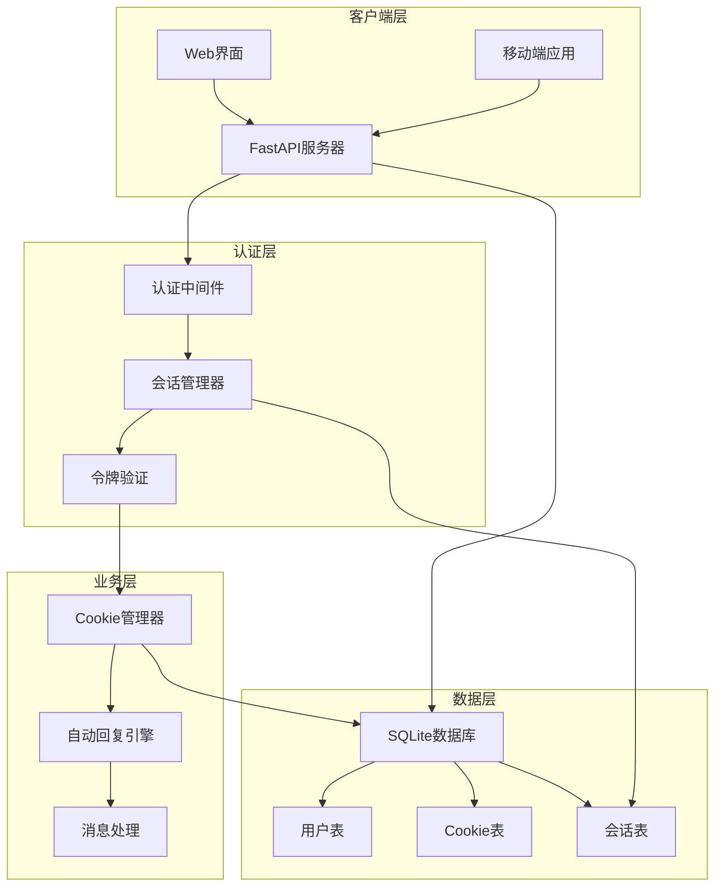

**图表来源**
- [reply_server.py](file://reply_server.py#L1-L50)
- [cookie_manager.py](file://cookie_manager.py#L10-L30)

## JWT认证机制

### 会话令牌系统

系统采用基于会话令牌的身份验证机制，替代传统的JWT令牌。这种设计提供了更好的安全性和灵活性。

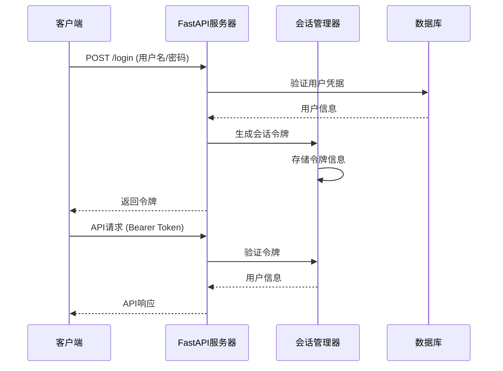

**图表来源**
- [reply_server.py](file://reply_server.py#L542-L600)
- [reply_server.py](file://reply_server.py#L182-L200)

### 令牌配置参数

| 参数名称 | 默认值 | 说明 | 安全考虑 |
|---------|--------|------|----------|
| TOKEN_EXPIRE_TIME | 24小时 | 令牌过期时间 | 设置合理的过期时间，平衡安全性和用户体验 |
| TOKEN_REFRESH_INTERVAL | 72000秒(20小时) | 令牌刷新间隔 | 避免频繁刷新导致性能问题 |
| TOKEN_RETRY_INTERVAL | 7200秒(2小时) | 令牌重试间隔 | 防止暴力破解攻击 |

**节来源**
- [config.py](file://config.py#L96-L97)
- [global_config.yml](file://global_config.yml#L60-L62)

### 令牌生成与验证

系统使用安全的随机令牌生成机制：

```python
# 令牌生成示例（来自代码分析）
def generate_token() -> str:
    """生成随机token"""
    return secrets.token_urlsafe(32)
```

**节来源**
- [reply_server.py](file://reply_server.py#L178-L181)

## Cookie安全管理

### 多层Cookie存储架构

系统采用双重存储机制来确保Cookie的安全性：

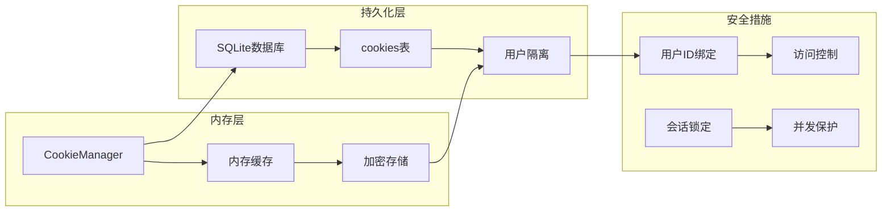

**图表来源**
- [cookie_manager.py](file://cookie_manager.py#L10-L50)
- [db_manager.py](file://db_manager.py#L110-L123)

### Cookie存储安全特性

| 安全特性 | 实现方式 | 安全价值 |
|---------|----------|----------|
| 用户隔离 | 每个Cookie绑定用户ID | 防止跨用户访问 |
| 加密传输 | HTTPS协议 | 防止中间人攻击 |
| 访问控制 | 基于用户权限的API调用 | 确保数据完整性 |
| 会话锁定 | 防止并发修改 | 避免数据竞争条件 |

**节来源**
- [cookie_manager.py](file://cookie_manager.py#L1156-L1195)
- [db_manager.py](file://db_manager.py#L1156-L1195)

### Cookie更新机制

系统实现了智能的Cookie更新机制，确保令牌的有效性：

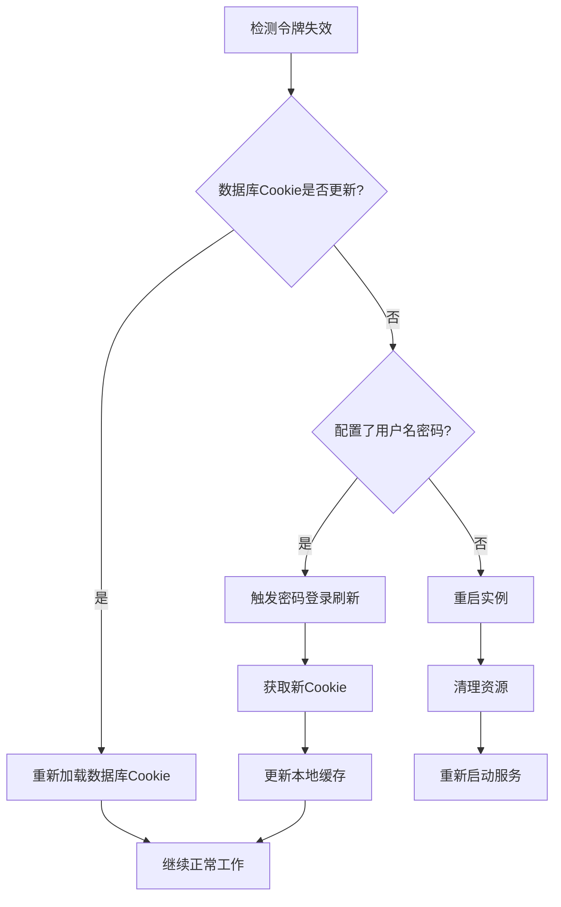

**图表来源**
- [XianyuAutoAsync.py](file://XianyuAutoAsync.py#L2062-L2180)

**节来源**
- [XianyuAutoAsync.py](file://XianyuAutoAsync.py#L2062-L2180)

## 令牌刷新机制

### 自动刷新策略

系统实现了智能的令牌刷新机制，确保服务的连续性：

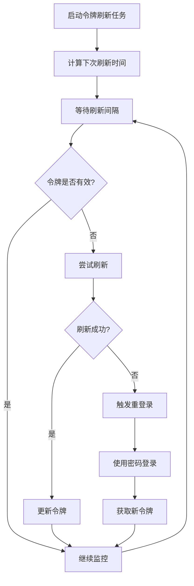

**图表来源**
- [XianyuAutoAsync.py](file://XianyuAutoAsync.py#L661-L667)

### 刷新配置参数

| 参数 | 默认值 | 作用 | 安全考量 |
|------|--------|------|----------|
| TOKEN_REFRESH_INTERVAL | 72000秒(20小时) | 主动刷新间隔 | 平衡安全性和性能 |
| TOKEN_RETRY_INTERVAL | 7200秒(2小时) | 失败重试间隔 | 防止频繁重试攻击 |
| COOKIE_REFRESH_INTERVAL | 1200秒(20分钟) | Cookie刷新间隔 | 确保Cookie有效性 |

**节来源**
- [XianyuAutoAsync.py](file://XianyuAutoAsync.py#L661-L667)
- [global_config.yml](file://global_config.yml#L60-L62)

### 密码登录刷新机制

当令牌刷新失败时，系统会自动尝试密码登录刷新：

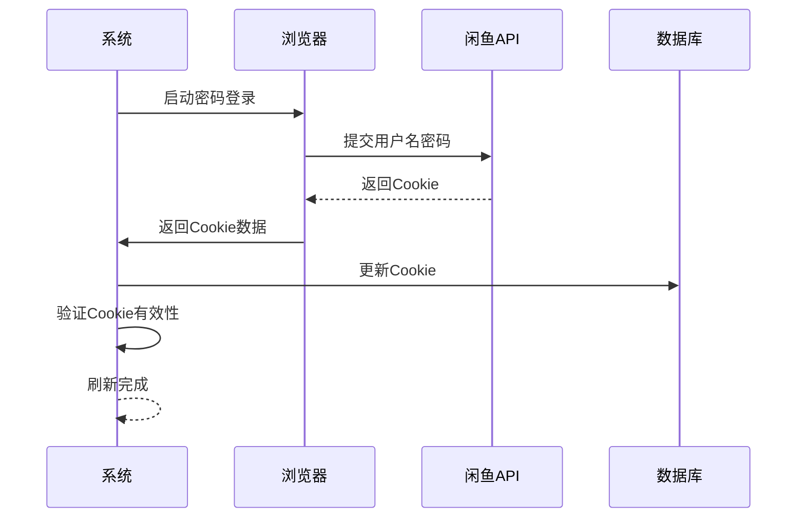

**图表来源**
- [XianyuAutoAsync.py](file://XianyuAutoAsync.py#L2062-L2180)

**节来源**
- [XianyuAutoAsync.py](file://XianyuAutoAsync.py#L2062-L2180)

## 用户认证流程

### 多种登录方式

系统支持多种认证方式，满足不同场景需求：

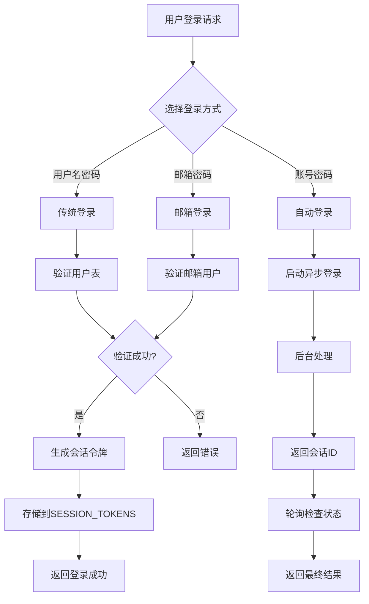

**图表来源**
- [reply_server.py](file://reply_server.py#L542-L600)

### 用户密码管理

系统采用安全的密码存储机制：

| 功能 | 实现方式 | 安全特性 |
|------|----------|----------|
| 密码哈希 | SHA256算法 | 单向加密，不可逆 |
| 用户注册 | 数据库验证 | 防止重复注册 |
| 密码更新 | 哈希比较 | 确保密码一致性 |
| 登录验证 | 哈希比对 | 高效验证机制 |

**节来源**
- [db_manager.py](file://db_manager.py#L2426-L2534)
- [reply_server.py](file://reply_server.py#L542-L600)

### 权限控制系统

系统实现了细粒度的权限控制：

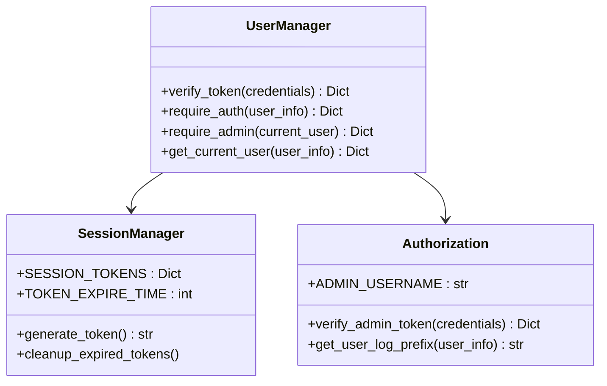

**图表来源**
- [reply_server.py](file://reply_server.py#L202-L225)

**节来源**
- [reply_server.py](file://reply_server.py#L202-L225)

## 安全最佳实践

### 密钥管理

虽然系统目前使用会话令牌而非JWT，但在未来的扩展中，建议采用以下密钥管理实践：

| 实践 | 推荐做法 | 安全价值 |
|------|----------|----------|
| 环境变量 | 使用环境变量存储密钥 | 避免硬编码 |
| 密钥轮换 | 定期更换密钥 | 降低长期暴露风险 |
| 权限最小化 | 限制密钥访问范围 | 减少潜在损害 |
| 审计日志 | 记录密钥使用情况 | 便于安全审计 |

### 传输安全

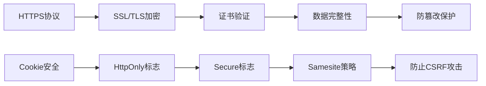

### 输入验证

系统实现了多层次的输入验证机制：

| 验证层级 | 验证内容 | 实现方式 |
|---------|----------|----------|
| 前端验证 | 基础格式检查 | JavaScript验证 |
| API验证 | 参数类型和范围 | Pydantic模型 |
| 业务验证 | 业务逻辑规则 | 自定义验证函数 |
| 数据库验证 | 约束和索引 | SQLite约束 |

**节来源**
- [reply_server.py](file://reply_server.py#L112-L176)

## 防护措施

### 防止令牌泄露

系统采用了多种防护措施防止令牌泄露：

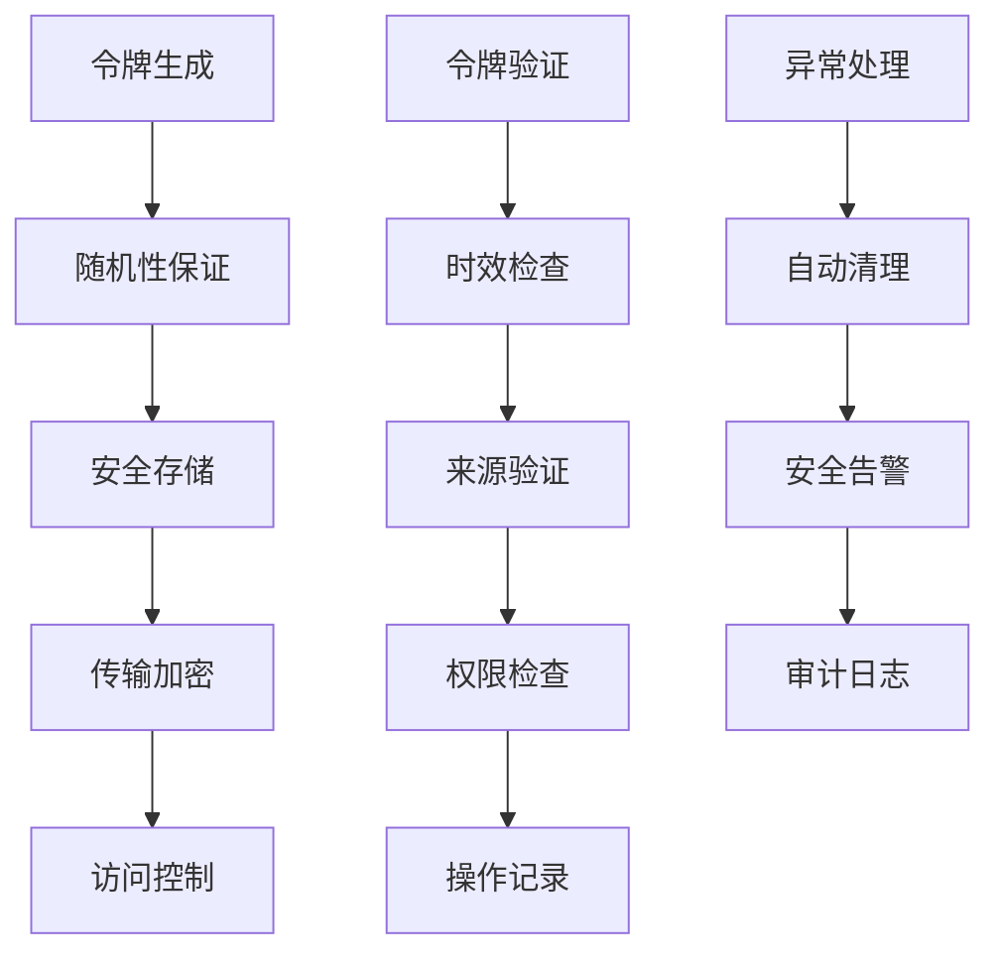

### 防止重放攻击

系统通过以下机制防止重放攻击：

| 防护机制 | 实现方式 | 技术细节 |
|---------|----------|----------|
| 时间戳验证 | 令牌生成时间检查 | 防止过期令牌重用 |
| 一次性令牌 | 会话令牌唯一性 | 每次登录生成新令牌 |
| 令牌撤销 | 内存中令牌管理 | 支持主动撤销 |
| 会话绑定 | 用户ID绑定 | 防止令牌盗用 |

### 登录尝试限制

系统实现了多层登录保护：

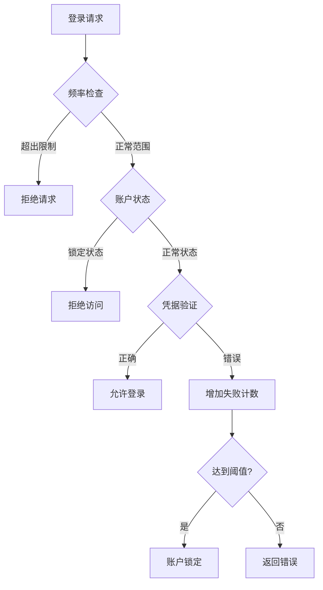

**节来源**
- [reply_server.py](file://reply_server.py#L542-L600)

## 故障排除指南

### 常见认证问题

| 问题类型 | 症状 | 解决方案 | 预防措施 |
|---------|------|----------|----------|
| 令牌过期 | 401未授权错误 | 重新登录获取新令牌 | 设置合理过期时间 |
| 会话丢失 | 页面刷新后需要重新登录 | 检查浏览器Cookie设置 | 启用会话持久化 |
| 权限不足 | 403禁止访问 | 检查用户权限分配 | 定期审核权限设置 |
| 数据库连接 | 500服务器错误 | 检查数据库状态 | 实施数据库监控 |

### 调试工具

系统提供了丰富的调试和监控功能：

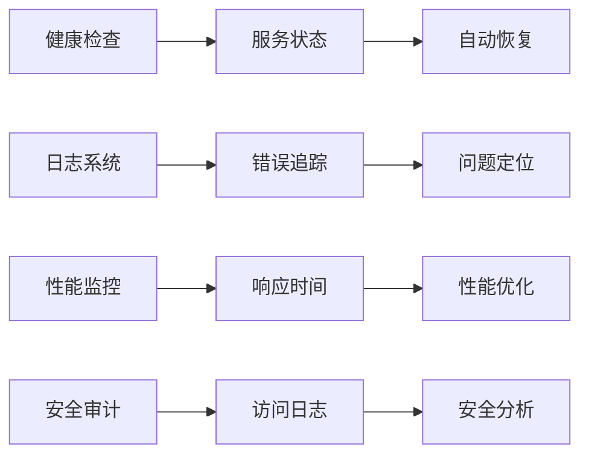

**节来源**
- [reply_server.py](file://reply_server.py#L374-L418)

### 监控指标

关键监控指标包括：

| 指标类别 | 监控项目 | 告警阈值 | 处理措施 |
|---------|----------|----------|----------|
| 认证指标 | 登录成功率 | < 95% | 检查认证服务 |
| 性能指标 | 响应时间 | > 2秒 | 优化查询性能 |
| 安全指标 | 异常登录 | 单位时间内 > 10次 | 启用二次验证 |
| 系统指标 | 服务可用性 | < 99.9% | 自动故障转移 |

## 总结

闲鱼自动回复系统建立了一套完整的认证安全体系，通过多层次的安全防护措施确保系统的安全性：

1. **认证机制**：采用基于会话令牌的身份验证，替代传统的JWT，提供更好的安全性和灵活性
2. **Cookie管理**：实现了内存和数据库的双重存储机制，确保Cookie的安全性和可靠性
3. **自动刷新**：建立了智能的令牌刷新机制，确保服务的连续性
4. **安全防护**：通过多种防护措施防止令牌泄露和重放攻击
5. **最佳实践**：遵循安全开发的最佳实践，包括输入验证、权限控制等

该系统为闲鱼自动回复功能提供了坚实的安全基础，能够有效应对各种安全威胁，保障用户数据和系统安全。