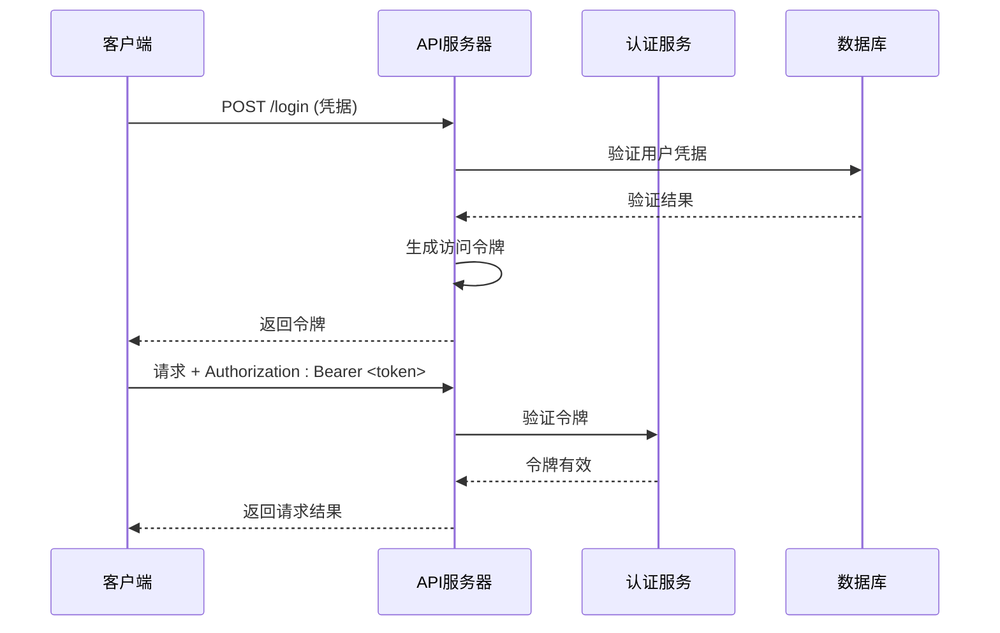
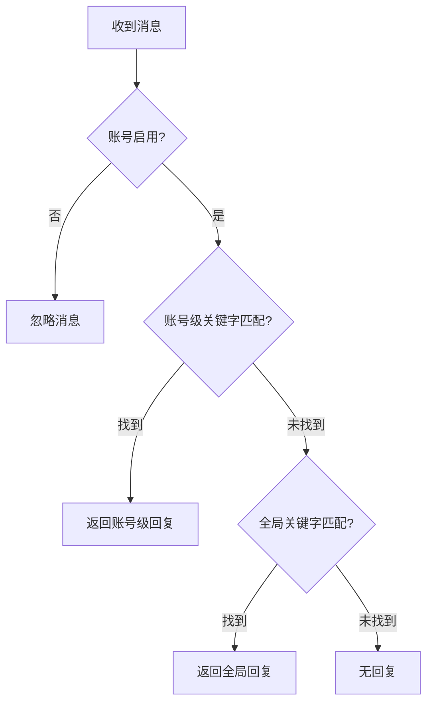
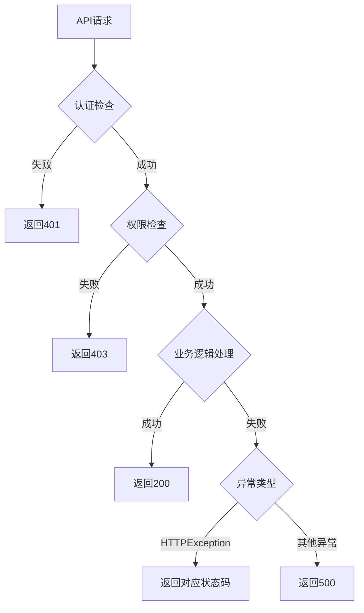

# API端点文档

<cite>
**本文档引用的文件**
- [reply_server.py](file://reply_server.py)
- [cookie_manager.py](file://cookie_manager.py)
- [db_manager.py](file://db_manager.py)
- [config.py](file://config.py)
- [static/js/app.js](file://static/js/app.js)
</cite>

## 目录
1. [简介](#简介)
2. [认证机制](#认证机制)
3. [Cookie管理API](#cookie管理api)
4. [关键字管理API](#关键字管理api)
5. [用户管理API](#用户管理api)
6. [系统设置API](#系统设置api)
7. [通知渠道API](#通知渠道api)
8. [卡券管理API](#卡券管理api)
9. [错误处理机制](#错误处理机制)
10. [安全考虑](#安全考虑)

## 简介

本文档详细描述了Xianyu Auto Reply系统中reply_server.py文件暴露的所有RESTful API端点。该系统提供了完整的闲鱼自动回复功能，包括账号管理、关键字配置、通知设置等功能模块。

系统采用FastAPI框架构建，支持异步处理和WebSocket通信，提供完整的CRUD操作接口。

## 认证机制

### 令牌认证

系统使用HTTP Bearer令牌进行身份验证：



**图表来源**
- [reply_server.py](file://reply_server.py#L183-L219)

### 权限控制

系统实现了多层次的权限控制：

| 权限级别 | 描述 | 示例端点 |
|---------|------|----------|
| 匿名访问 | 无需认证的公共接口 | `/registration-status`, `/login-info-status` |
| 用户认证 | 需要有效令牌 | `/cookies`, `/keywords` |
| 管理员权限 | 仅管理员可访问 | `/admin/users`, `/system-settings` |

**节来源**
- [reply_server.py](file://reply_server.py#L183-L219)

## Cookie管理API

### 基础CRUD操作

#### GET /cookies
获取当前用户的所有Cookie ID列表。

**请求参数**: 无  
**响应格式**:
```json
[
  "cookie_id_1",
  "cookie_id_2"
]
```

**节来源**
- [reply_server.py](file://reply_server.py#L1141-L1150)

#### GET /cookies/details
获取所有Cookie的详细信息（包括值和状态）。

**请求参数**: 无  
**响应格式**:
```json
[
  {
    "id": "cookie_id_1",
    "value": "cookie_value_string",
    "enabled": true,
    "auto_confirm": true,
    "remark": "账号备注",
    "pause_duration": 10
  }
]
```

**节来源**
- [reply_server.py](file://reply_server.py#L1153-L1180)

#### POST /cookies
添加新的Cookie到当前用户账户。

**请求体**:
```json
{
  "id": "unique_cookie_id",
  "value": "cookie_value_string"
}
```

**响应**:
```json
{"msg": "success"}
```

**节来源**
- [reply_server.py](file://reply_server.py#L1183-L1214)

#### PUT /cookies/{cid}
更新指定Cookie的值。

**路径参数**:
- `cid`: Cookie ID

**请求体**:
```json
{
  "id": "cookie_id",
  "value": "new_cookie_value"
}
```

**响应**:
```json
{"msg": "updated"}
```

**节来源**
- [reply_server.py](file://reply_server.py#L1217-L1251)

#### DELETE /cookies/{cid}
删除指定Cookie。

**路径参数**:
- `cid`: Cookie ID

**响应**:
```json
{"msg": "removed"}
```

**节来源**
- [reply_server.py](file://reply_server.py#L2796-L2814)

### Cookie状态管理

#### PUT /cookies/{cid}/status
更新Cookie的启用/禁用状态。

**请求体**:
```json
{
  "enabled": true
}
```

**响应**:
```json
{"msg": "status updated", "enabled": true}
```

**节来源**
- [reply_server.py](file://reply_server.py#L2337-L2356)

#### PUT /cookies/{cid}/auto-confirm
更新自动确认发货设置。

**请求体**:
```json
{
  "auto_confirm": true
}
```

**响应**:
```json
{
  "msg": "success",
  "auto_confirm": true,
  "message": "自动确认发货已开启"
}
```

**节来源**
- [reply_server.py](file://reply_server.py#L2829-L2860)

#### PUT /cookies/{cid}/remark
更新Cookie备注信息。

**请求体**:
```json
{
  "remark": "新的备注信息"
}
```

**响应**:
```json
{
  "message": "备注更新成功",
  "remark": "新的备注信息"
}
```

**节来源**
- [reply_server.py](file://reply_server.py#L2889-L2916)

### 账号信息管理

#### POST /cookie/{cid}/account-info
更新账号详细信息（Cookie、用户名、密码、浏览器显示设置）。

**请求体**:
```json
{
  "value": "新的cookie值",
  "username": "新用户名",
  "password": "新密码",
  "show_browser": true
}
```

**响应**:
```json
{"msg": "updated", "success": true}
```

**节来源**
- [reply_server.py](file://reply_server.py#L1262-L1304)

#### GET /cookie/{cid}/details
获取账号详细信息。

**响应**:
```json
{
  "id": "cookie_id",
  "value": "cookie_value",
  "username": "account_username",
  "password": "encrypted_password",
  "show_browser": true,
  "auto_confirm": true,
  "remark": "备注信息"
}
```

**节来源**
- [reply_server.py](file://reply_server.py#L1307-L1330)

## 关键字管理API

### 关键字CRUD操作

#### GET /keywords/{cid}
获取指定Cookie的所有关键字。

**路径参数**:
- `cid`: Cookie ID

**响应格式**:
```json
[
  {
    "keyword": "关键词",
    "reply": "回复内容",
    "item_id": "商品ID",
    "type": "normal"
  }
]
```

**节来源**
- [reply_server.py](file://reply_server.py#L3017-L3043)

#### GET /keywords-with-item-id/{cid}
获取包含商品ID的关键字列表。

**响应格式**:
```json
[
  {
    "keyword": "关键词",
    "reply": "回复内容",
    "item_id": "商品ID",
    "type": "text",
    "image_url": "图片URL"
  }
]
```

**节来源**
- [reply_server.py](file://reply_server.py#L3046-L3074)

#### POST /keywords/{cid}
更新关键字列表（仅文本类型）。

**请求体**:
```json
{
  "keywords": {
    "关键词1": "回复1",
    "关键词2": "回复2"
  }
}
```

**响应**:
```json
{"msg": "updated", "count": 2}
```

**节来源**
- [reply_server.py](file://reply_server.py#L3077-L3096)

#### POST /keywords-with-item-id/{cid}
更新包含商品ID的关键字列表。

**请求体**:
```json
{
  "keywords": [
    {
      "keyword": "关键词",
      "reply": "回复内容",
      "item_id": "商品ID"
    }
  ]
}
```

**响应**:
```json
{"msg": "updated", "count": 1}
```

**节来源**
- [reply_server.py](file://reply_server.py#L3099-L3181)

#### DELETE /keywords/{cid}/{index}
根据索引删除关键字。

**路径参数**:
- `cid`: Cookie ID
- `index`: 关键字索引

**响应**:
```json
{"msg": "删除成功"}
```

**节来源**
- [reply_server.py](file://reply_server.py#L3540-L3576)

### 关键字匹配逻辑

系统实现了优先级匹配机制：



**图表来源**
- [reply_server.py](file://reply_server.py#L263-L285)

**节来源**
- [reply_server.py](file://reply_server.py#L263-L285)

## 用户管理API

### 管理员专用接口

#### GET /admin/users
获取所有用户信息（管理员专用）。

**响应格式**:
```json
{
  "users": [
    {
      "id": 1,
      "username": "admin",
      "email": "admin@example.com",
      "cookie_count": 3,
      "card_count": 5,
      "created_at": "2024-01-01T00:00:00"
    }
  ]
}
```

**节来源**
- [reply_server.py](file://reply_server.py#L4672-L4699)

#### DELETE /admin/users/{user_id}
删除指定用户（管理员专用）。

**路径参数**:
- `user_id`: 用户ID

**响应**:
```json
{"message": "用户 username 删除成功"}
```

**节来源**
- [reply_server.py](file://reply_server.py#L4701-L4731)

### 用户设置管理

#### GET /user-settings/{key}
获取用户特定设置。

**路径参数**:
- `key`: 设置键名

**响应**:
```json
{
  "key": "setting_key",
  "value": "setting_value",
  "description": "设置说明"
}
```

**节来源**
- [reply_server.py](file://reply_server.py#L4655-L4667)

## 系统设置API

### 公共接口

#### GET /registration-status
获取注册开关状态（公开接口）。

**响应**:
```json
{
  "enabled": true,
  "message": "注册功能已开启"
}
```

**节来源**
- [reply_server.py](file://reply_server.py#L2685-L2710)

#### GET /login-info-status
获取默认登录信息显示状态（公开接口）。

**响应**:
```json
{"enabled": true}
```

**节来源**
- [reply_server.py](file://reply_server.py#L2712-L2730)

### 管理员接口

#### GET /system-settings
获取系统设置（排除敏感信息）。

**响应**:
```json
{
  "theme_color": "blue",
  "registration_enabled": "true",
  "smtp_server": "smtp.example.com",
  "smtp_port": "587"
}
```

**节来源**
- [reply_server.py](file://reply_server.py#L2646-L2657)

#### PUT /system-settings/{key}
更新系统设置（仅管理员）。

**路径参数**:
- `key`: 设置键名

**请求体**:
```json
{
  "value": "新的值",
  "description": "设置说明"
}
```

**响应**:
```json
{"msg": "system setting updated"}
```

**节来源**
- [reply_server.py](file://reply_server.py#L2663-L2680)

#### PUT /registration-settings
更新注册开关设置（仅管理员）。

**请求体**:
```json
{
  "enabled": true
}
```

**响应**:
```json
{
  "success": true,
  "enabled": true,
  "message": "注册功能已开启"
}
```

**节来源**
- [reply_server.py](file://reply_server.py#L2741-L2765)

## 通知渠道API

### 通知渠道管理

#### GET /notification-channels
获取所有通知渠道。

**响应**:
```json
[
  {
    "id": 1,
    "name": "钉钉群机器人",
    "type": "dingtalk",
    "config": "{\"webhook_url\": \"...\"}",
    "enabled": true,
    "created_at": "2024-01-01T00:00:00"
  }
]
```

**节来源**
- [reply_server.py](file://reply_server.py#L2466-L2474)

#### POST /notification-channels
创建通知渠道。

**请求体**:
```json
{
  "name": "渠道名称",
  "type": "dingtalk",
  "config": "{\"webhook_url\": \"...\"}"
}
```

**响应**:
```json
{"msg": "notification channel created", "id": 1}
```

**节来源**
- [reply_server.py](file://reply_server.py#L2477-L2491)

#### PUT /notification-channels/{channel_id}
更新通知渠道。

**路径参数**:
- `channel_id`: 渠道ID

**请求体**:
```json
{
  "name": "新名称",
  "config": "{\"new_config\": \"...\"}",
  "enabled": true
}
```

**响应**:
```json
{"msg": "notification channel updated"}
```

**节来源**
- [reply_server.py](file://reply_server.py#L2509-L2527)

#### DELETE /notification-channels/{channel_id}
删除通知渠道。

**路径参数**:
- `channel_id`: 渠道ID

**响应**:
```json
{"msg": "notification channel deleted"}
```

**节来源**
- [reply_server.py](file://reply_server.py#L2530-L2543)

### 消息通知配置

#### GET /message-notifications
获取当前用户所有账号的消息通知配置。

**响应**:
```json
{
  "cookie_id_1": [
    {
      "id": 1,
      "channel_id": 1,
      "enabled": true
    }
  ]
}
```

**节来源**
- [reply_server.py](file://reply_server.py#L2548-L2562)

#### POST /message-notifications/{cid}
设置账号的消息通知。

**路径参数**:
- `cid`: Cookie ID

**请求体**:
```json
{
  "channel_id": 1,
  "enabled": true
}
```

**响应**:
```json
{"msg": "message notification set"}
```

**节来源**
- [reply_server.py](file://reply_server.py#L2584-L2608)

#### DELETE /message-notifications/account/{cid}
删除账号的所有消息通知配置。

**路径参数**:
- `cid`: Cookie ID

**响应**:
```json
{"msg": "account notifications deleted"}
```

**节来源**
- [reply_server.py](file://reply_server.py#L2612-L2625)

## 卡券管理API

### 卡券基础操作

#### GET /cards
获取所有卡券（管理员专用）。

**响应**:
```json
[
  {
    "id": 1,
    "name": "自动回复卡券",
    "type": "text",
    "text_content": "自动回复内容",
    "enabled": true,
    "delay_seconds": 0
  }
]
```

**节来源**
- [reply_server.py](file://reply_server.py#L2466-L2474)

#### POST /cards
创建新卡券（管理员专用）。

**请求体**:
```json
{
  "name": "卡券名称",
  "type": "text",
  "text_content": "卡券内容",
  "enabled": true,
  "delay_seconds": 0
}
```

**响应**:
```json
{"msg": "card created", "id": 1}
```

**节来源**
- [reply_server.py](file://reply_server.py#L2477-L2491)

#### PUT /cards/{card_id}
更新卡券信息（管理员专用）。

**路径参数**:
- `card_id`: 卡券ID

**请求体**:
```json
{
  "name": "新名称",
  "type": "text",
  "text_content": "新内容",
  "enabled": true
}
```

**响应**:
```json
{"msg": "card updated"}
```

**节来源**
- [reply_server.py](file://reply_server.py#L2509-L2527)

#### DELETE /cards/{card_id}
删除卡券（管理员专用）。

**路径参数**:
- `card_id`: 卡券ID

**响应**:
```json
{"msg": "card deleted"}
```

**节来源**
- [reply_server.py](file://reply_server.py#L2530-L2543)

### 发货规则管理

#### GET /delivery-rules
获取所有发货规则。

**响应**:
```json
[
  {
    "id": 1,
    "keyword": "关键词",
    "card_id": 1,
    "delivery_count": 1,
    "enabled": true,
    "description": "规则说明"
  }
]
```

**节来源**
- [reply_server.py](file://reply_server.py#L2466-L2474)

#### POST /delivery-rules
创建发货规则。

**请求体**:
```json
{
  "keyword": "触发关键词",
  "card_id": 1,
  "delivery_count": 1,
  "enabled": true,
  "description": "规则描述"
}
```

**响应**:
```json
{"msg": "delivery rule created", "id": 1}
```

**节来源**
- [reply_server.py](file://reply_server.py#L2477-L2491)

#### PUT /delivery-rules/{rule_id}
更新发货规则。

**路径参数**:
- `rule_id`: 规则ID

**请求体**:
```json
{
  "keyword": "新关键词",
  "card_id": 1,
  "delivery_count": 1,
  "enabled": true,
  "description": "新描述"
}
```

**响应**:
```json
{"msg": "delivery rule updated"}
```

**节来源**
- [reply_server.py](file://reply_server.py#L2509-L2527)

#### DELETE /delivery-rules/{rule_id}
删除发货规则。

**路径参数**:
- `rule_id`: 规则ID

**响应**:
```json
{"msg": "delivery rule deleted"}
```

**节来源**
- [reply_server.py](file://reply_server.py#L2530-L2543)

## 错误处理机制

### HTTP状态码

系统使用标准HTTP状态码进行错误响应：

| 状态码 | 含义 | 场景 |
|--------|------|------|
| 200 | 成功 | 请求成功处理 |
| 400 | 请求错误 | 参数错误、数据格式错误 |
| 401 | 未授权 | 令牌无效或缺失 |
| 403 | 禁止访问 | 权限不足 |
| 404 | 未找到 | 资源不存在 |
| 500 | 服务器错误 | 内部处理错误 |

### 错误响应格式

所有API端点都遵循统一的错误响应格式：

```json
{
  "detail": "错误描述信息"
}
```

### 异常处理流程



**图表来源**
- [reply_server.py](file://reply_server.py#L183-L219)

**节来源**
- [reply_server.py](file://reply_server.py#L183-L219)

## 安全考虑

### 认证与授权

1. **令牌管理**: 使用JWT令牌进行身份验证，支持令牌过期机制
2. **权限分级**: 实现用户级和管理员级权限分离
3. **数据隔离**: 每个用户只能访问自己的数据

### 数据保护

1. **敏感信息过滤**: 系统设置中自动过滤敏感信息
2. **输入验证**: 所有API端点都进行严格的输入验证
3. **SQL注入防护**: 使用参数化查询防止SQL注入攻击

### API安全

1. **速率限制**: 通过令牌机制实现基本的速率限制
2. **CSRF防护**: 使用令牌验证防止跨站请求伪造
3. **日志记录**: 所有API请求都有详细的日志记录

### curl命令示例

#### 登录获取令牌
```bash
curl -X POST "http://localhost:8000/login" \
  -H "Content-Type: application/json" \
  -d '{
    "username": "admin",
    "password": "admin123"
  }'
```

#### 获取Cookie列表
```bash
curl -X GET "http://localhost:8000/cookies" \
  -H "Authorization: Bearer YOUR_TOKEN"
```

#### 添加新Cookie
```bash
curl -X POST "http://localhost:8000/cookies" \
  -H "Authorization: Bearer YOUR_TOKEN" \
  -H "Content-Type: application/json" \
  -d '{
    "id": "new_cookie_id",
    "value": "cookie_value_string"
  }'
```

### Python requests代码示例

#### 基础认证请求
```python
import requests

# 登录获取令牌
login_url = "http://localhost:8000/login"
login_data = {
    "username": "admin",
    "password": "admin123"
}
response = requests.post(login_url, json=login_data)
token = response.json()["token"]

# 使用令牌调用API
headers = {"Authorization": f"Bearer {token}"}
cookies_response = requests.get("http://localhost:8000/cookies", headers=headers)
print(cookies_response.json())
```

#### 添加Cookie
```python
# 添加新Cookie
cookie_data = {
    "id": "new_cookie_id",
    "value": "cookie_value_string"
}
response = requests.post(
    "http://localhost:8000/cookies", 
    headers=headers,
    json=cookie_data
)
print(response.json())
```

#### 关键字管理
```python
# 更新关键字
keywords_data = {
    "keywords": {
        "hello": "Hello! How can I help you?",
        "price": "Please check our latest offers!"
    }
}
response = requests.post(
    "http://localhost:8000/keywords/new_cookie_id",
    headers=headers,
    json=keywords_data
)
print(response.json())
```

**节来源**
- [reply_server.py](file://reply_server.py#L542-L672)