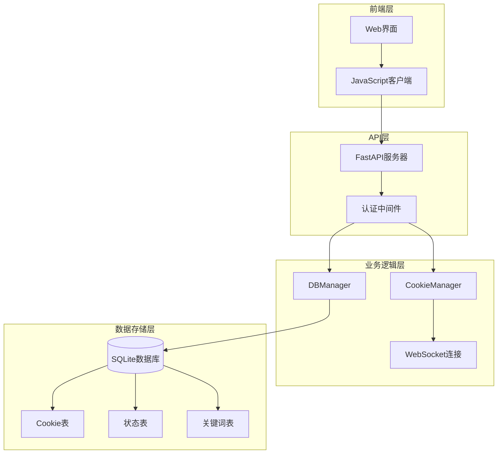
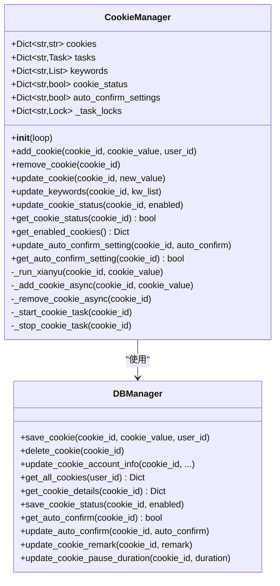
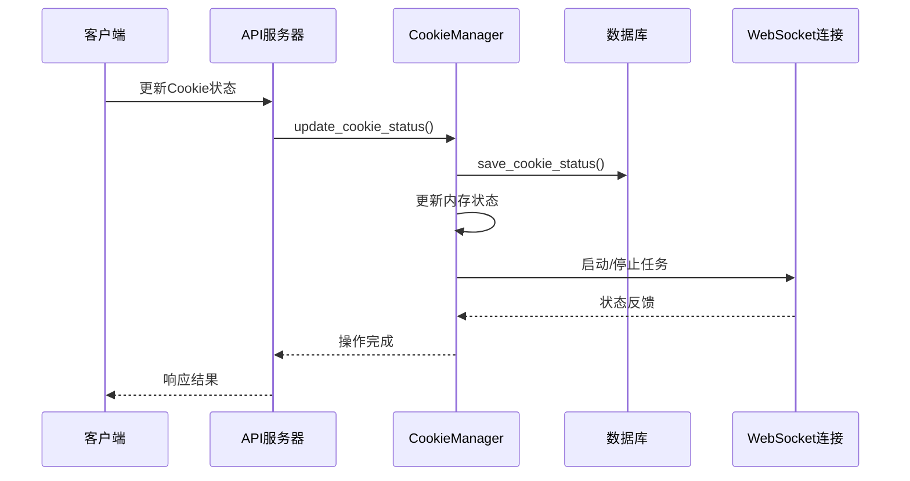
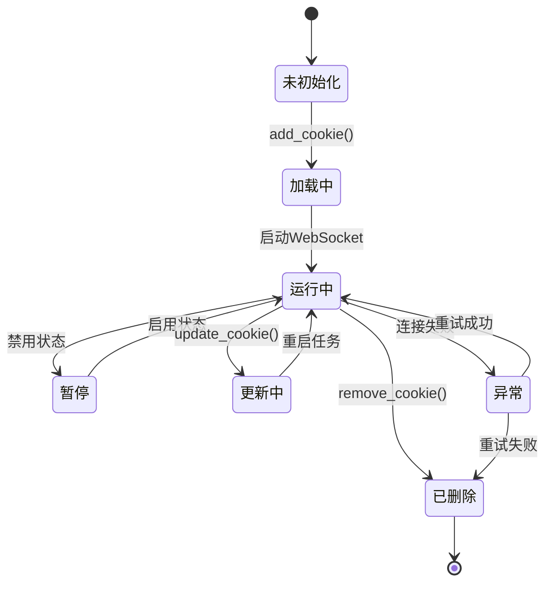
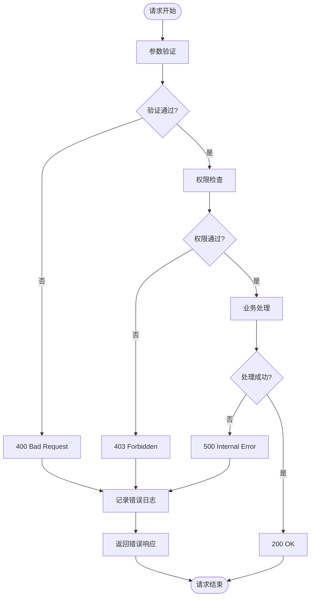

# Cookie管理接口

<cite>
**本文档引用的文件**
- [cookie_manager.py](file://cookie_manager.py)
- [db_manager.py](file://db_manager.py)
- [reply_server.py](file://reply_server.py)
- [XianyuAutoAsync.py](file://XianyuAutoAsync.py)
</cite>

## 目录
1. [简介](#简介)
2. [项目架构概览](#项目架构概览)
3. [核心组件分析](#核心组件分析)
4. [Cookie管理API接口](#cookie管理api接口)
5. [数据模型与验证](#数据模型与验证)
6. [状态同步机制](#状态同步机制)
7. [错误处理策略](#错误处理策略)
8. [实际使用示例](#实际使用示例)
9. [故障排除指南](#故障排除指南)
10. [总结](#总结)

## 简介

本文档全面介绍了闲鱼自动回复系统中的Cookie管理接口，包括RESTful API端点、数据模型验证、状态同步机制以及异常处理策略。该系统通过`cookie_manager.py`与闲鱼WebSocket连接进行交互，并通过`db_manager.py`实现持久化存储。

## 项目架构概览

系统采用分层架构设计，主要包含以下核心模块：



**图表来源**
- [cookie_manager.py](file://cookie_manager.py#L10-L428)
- [db_manager.py](file://db_manager.py#L16-L800)
- [reply_server.py](file://reply_server.py#L308-L500)

## 核心组件分析

### CookieManager类

`CookieManager`是系统的核心组件，负责管理多个账号的Cookie及其相关任务：



**图表来源**
- [cookie_manager.py](file://cookie_manager.py#L10-L428)
- [db_manager.py](file://db_manager.py#L16-L800)

**章节来源**
- [cookie_manager.py](file://cookie_manager.py#L10-L428)
- [db_manager.py](file://db_manager.py#L16-L800)

### 数据库架构

系统使用SQLite数据库存储Cookie及相关信息：

```mermaid
erDiagram
COOKIES {
string id PK
string value
integer user_id FK
integer auto_confirm
string remark
integer pause_duration
string username
string password
integer show_browser
timestamp created_at
}
COOKIE_STATUS {
string cookie_id PK FK
boolean enabled
timestamp updated_at
}
KEYWORDS {
string cookie_id FK
string keyword
string reply
string item_id
string type
string image_url
}
USERS {
integer id PK
string username UK
string email UK
string password_hash
boolean is_active
timestamp created_at
timestamp updated_at
}
COOKIES ||--|| COOKIE_STATUS : "has status"
COOKIES ||--o{ KEYWORDS : "has keywords"
COOKIES }o--|| USERS : "belongs to"
```

**图表来源**
- [db_manager.py](file://db_manager.py#L110-L148)

**章节来源**
- [db_manager.py](file://db_manager.py#L110-L148)

## Cookie管理API接口

### GET /api/cookies

获取当前用户的所有Cookie ID列表。

**请求参数：**
- 无

**响应格式：**
```json
[
    "cookie_id_1",
    "cookie_id_2",
    "cookie_id_3"
]
```

**实现细节：**
- 仅返回当前用户拥有的Cookie
- 通过`db_manager.get_all_cookies(user_id)`获取
- 安全性检查确保用户只能访问自己的Cookie

**章节来源**
- [reply_server.py](file://reply_server.py#L1141-L1150)

### GET /api/cookies/details

获取所有Cookie的详细信息，包括值、状态、自动确认设置等。

**请求参数：**
- 无

**响应格式：**
```json
[
    {
        "id": "cookie_id_1",
        "value": "cookie_value_1",
        "enabled": true,
        "auto_confirm": true,
        "remark": "备用账号",
        "pause_duration": 10
    }
]
```

**实现细节：**
- 合并Cookie值、状态、备注等信息
- 调用`cookie_manager.manager.get_cookie_status()`获取状态
- 调用`db_manager.get_cookie_details()`获取详细信息

**章节来源**
- [reply_server.py](file://reply_server.py#L1153-L1179)

### POST /api/cookies

添加新的Cookie到系统中。

**请求体：**
```json
{
    "id": "your_cookie_id",
    "value": "your_cookie_value"
}
```

**响应格式：**
```json
{
    "msg": "success"
}
```

**字段验证：**
- `id`: 必填，字符串类型，不能重复
- `value`: 必填，字符串类型，Cookie值

**安全检查：**
- 检查Cookie ID是否已被其他用户使用
- 自动绑定到当前用户
- 验证Cookie值的有效性

**章节来源**
- [reply_server.py](file://reply_server.py#L1183-L1209)

### PUT /api/cookies/{cookie_id}

更新现有Cookie的值。

**路径参数：**
- `cookie_id`: Cookie标识符

**请求体：**
```json
{
    "id": "cookie_id",
    "value": "new_cookie_value"
}
```

**响应格式：**
```json
{
    "msg": "updated"
}
```

**更新流程：**
1. 检查Cookie是否属于当前用户
2. 获取旧的Cookie值
3. 更新数据库中的Cookie值
4. 如果值发生变化，重启相关任务
5. 保持其他字段（如用户名、密码、备注等）不变

**章节来源**
- [reply_server.py](file://reply_server.py#L1217-L1247)

### DELETE /api/cookies/{cookie_id}

删除指定的Cookie。

**路径参数：**
- `cookie_id`: 要删除的Cookie标识符

**响应格式：**
```json
{
    "msg": "removed"
}
```

**删除流程：**
1. 检查Cookie是否属于当前用户
2. 调用`cookie_manager.manager.remove_cookie()`
3. 从数据库中删除记录
4. 清理相关任务和缓存

**章节来源**
- [reply_server.py](file://reply_server.py#L2796-L2810)

### PUT /api/cookies/{cookie_id}/status

更新Cookie的启用/禁用状态。

**路径参数：**
- `cookie_id`: Cookie标识符

**请求体：**
```json
{
    "enabled": true
}
```

**响应格式：**
```json
{
    "msg": "status updated",
    "enabled": true
}
```

**状态同步：**
- 更新内存中的状态
- 保存到数据库
- 启动或停止相关任务

**章节来源**
- [reply_server.py](file://reply_server.py#L2337-L2352)

### PUT /api/cookies/{cookie_id}/auto-confirm

更新Cookie的自动确认发货设置。

**路径参数：**
- `cookie_id`: Cookie标识符

**请求体：**
```json
{
    "auto_confirm": true
}
```

**响应格式：**
```json
{
    "msg": "success",
    "auto_confirm": true,
    "message": "自动确认发货已开启"
}
```

**实现细节：**
- 更新数据库中的设置
- 通知CookieManager更新内存中的设置
- 实时生效（无需重启任务）

**章节来源**
- [reply_server.py](file://reply_server.py#L2829-L2856)

### GET /api/cookies/{cookie_id}/auto-confirm

获取Cookie的自动确认发货设置。

**路径参数：**
- `cookie_id`: Cookie标识符

**响应格式：**
```json
{
    "auto_confirm": true,
    "message": "自动确认发货当前开启"
}
```

**章节来源**
- [reply_server.py](file://reply_server.py#L2863-L2882)

### PUT /api/cookies/{cookie_id}/remark

更新Cookie的备注信息。

**路径参数：**
- `cookie_id`: Cookie标识符

**请求体：**
```json
{
    "remark": "备用账号"
}
```

**响应格式：**
```json
{
    "message": "备注更新成功",
    "remark": "备用账号"
}
```

**章节来源**
- [reply_server.py](file://reply_server.py#L2889-L2909)

### GET /api/cookies/{cookie_id}/remark

获取Cookie的备注信息。

**路径参数：**
- `cookie_id`: Cookie标识符

**响应格式：**
```json
{
    "remark": "备用账号",
    "message": "获取备注成功"
}
```

**章节来源**
- [reply_server.py](file://reply_server.py#L2919-L2939)

### PUT /api/cookies/{cookie_id}/pause-duration

更新Cookie的自动回复暂停时间。

**路径参数：**
- `cookie_id`: Cookie标识符

**请求体：**
```json
{
    "pause_duration": 10
}
```

**响应格式：**
```json
{
    "message": "暂停时间更新成功",
    "pause_duration": 10
}
```

**验证规则：**
- 暂停时间范围：0-60分钟（0表示不暂停）

**章节来源**
- [reply_server.py](file://reply_server.py#L2948-L2973)

### POST /api/cookie/{cookie_id}/account-info

更新Cookie的账号信息（包括Cookie值、用户名、密码等）。

**路径参数：**
- `cookie_id`: Cookie标识符

**请求体：**
```json
{
    "value": "new_cookie_value",
    "username": "account_username",
    "password": "account_password",
    "show_browser": false
}
```

**响应格式：**
```json
{
    "msg": "updated",
    "success": true
}
```

**更新策略：**
- 使用`update_cookie_account_info`避免覆盖其他字段
- 仅当Cookie值发生变化时重启任务
- 保持用户名、密码、备注等信息不变

**章节来源**
- [reply_server.py](file://reply_server.py#L1262-L1299)

## 数据模型与验证

### CookieIn模型

基础的Cookie数据模型：

```python
class CookieIn(BaseModel):
    id: str      # Cookie标识符
    value: str   # Cookie值
```

**验证规则：**
- `id`: 必填，字符串类型
- `value`: 必填，字符串类型

### CookieStatusIn模型

Cookie状态更新模型：

```python
class CookieStatusIn(BaseModel):
    enabled: bool  # 启用状态
```

### RemarkUpdate模型

备注更新模型：

```python
class RemarkUpdate(BaseModel):
    remark: str  # 备注内容
```

### PauseDurationUpdate模型

暂停时间更新模型：

```python
class PauseDurationUpdate(BaseModel):
    pause_duration: int  # 暂停时间（分钟）
```

**验证规则：**
- 值范围：0-60分钟
- 0表示不暂停

### CookieAccountInfo模型

账号信息更新模型：

```python
class CookieAccountInfo(BaseModel):
    value: Optional[str] = None           # Cookie值
    username: Optional[str] = None       # 用户名
    password: Optional[str] = None       # 密码
    show_browser: Optional[bool] = None  # 显示浏览器设置
```

**章节来源**
- [reply_server.py](file://reply_server.py#L1094-L1097)
- [reply_server.py](file://reply_server.py#L1100-L1102)
- [reply_server.py](file://reply_server.py#L2820-L2823)
- [reply_server.py](file://reply_server.py#L2825-L2827)
- [reply_server.py](file://reply_server.py#L1254-L1260)

## 状态同步机制

### 内存与数据库同步

系统采用内存缓存与数据库持久化的双重机制：



**图表来源**
- [cookie_manager.py](file://cookie_manager.py#L304-L323)
- [db_manager.py](file://db_manager.py#L1737-L1764)

### 任务生命周期管理

Cookie任务的完整生命周期：



**图表来源**
- [cookie_manager.py](file://cookie_manager.py#L112-L153)
- [cookie_manager.py](file://cookie_manager.py#L155-L181)

**章节来源**
- [cookie_manager.py](file://cookie_manager.py#L304-L323)
- [cookie_manager.py](file://cookie_manager.py#L112-L181)

## 错误处理策略

### HTTP状态码规范

| 状态码 | 场景 | 描述 |
|--------|------|------|
| 200 | 成功 | 请求成功执行 |
| 400 | 客户端错误 | 参数验证失败、数据格式错误 |
| 403 | 权限拒绝 | 无权操作指定Cookie |
| 404 | 资源不存在 | Cookie不存在 |
| 500 | 服务器错误 | 系统内部错误 |

### 异常处理流程



**图表来源**
- [reply_server.py](file://reply_server.py#L1183-L1214)
- [reply_server.py](file://reply_server.py#L2796-L2814)

### 具体错误场景

1. **Cookie ID冲突**
   ```json
   {
       "detail": "该Cookie ID已被其他用户使用"
   }
   ```

2. **权限不足**
   ```json
   {
       "detail": "无权限操作该Cookie"
   }
   ```

3. **Cookie不存在**
   ```json
   {
       "detail": "账号不存在"
   }
   ```

4. **暂停时间无效**
   ```json
   {
       "detail": "暂停时间必须在0-60分钟之间（0表示不暂停）"
   }
   ```

**章节来源**
- [reply_server.py](file://reply_server.py#L1194-L1201)
- [reply_server.py](file://reply_server.py#L1227-L1228)
- [reply_server.py](file://reply_server.py#L2940-L2941)
- [reply_server.py](file://reply_server.py#L2963-L2964)

## 实际使用示例

### 添加新Cookie

**请求：**
```bash
curl -X POST "http://localhost:8000/api/cookies" \
  -H "Content-Type: application/json" \
  -H "Authorization: Bearer your_token" \
  -d '{
    "id": "taobao_account_001",
    "value": "your_cookie_value_here"
  }'
```

**响应：**
```json
{
    "msg": "success"
}
```

### 更新Cookie值

**请求：**
```bash
curl -X PUT "http://localhost:8000/api/cookies/taobao_account_001" \
  -H "Content-Type: application/json" \
  -H "Authorization: Bearer your_token" \
  -d '{
    "id": "taobao_account_001",
    "value": "new_cookie_value_here"
  }'
```

**响应：**
```json
{
    "msg": "updated"
}
```

### 启用/禁用Cookie

**请求：**
```bash
curl -X PUT "http://localhost:8000/api/cookies/taobao_account_001/status" \
  -H "Content-Type: application/json" \
  -H "Authorization: Bearer your_token" \
  -d '{
    "enabled": true
  }'
```

**响应：**
```json
{
    "msg": "status updated",
    "enabled": true
}
```

### 更新自动确认设置

**请求：**
```bash
curl -X PUT "http://localhost:8000/api/cookies/taobao_account_001/auto-confirm" \
  -H "Content-Type: application/json" \
  -H "Authorization: Bearer your_token" \
  -d '{
    "auto_confirm": false
  }'
```

**响应：**
```json
{
    "msg": "success",
    "auto_confirm": false,
    "message": "自动确认发货已关闭"
}
```

### 获取Cookie详细信息

**请求：**
```bash
curl -X GET "http://localhost:8000/api/cookies/details" \
  -H "Authorization: Bearer your_token"
```

**响应：**
```json
[
    {
        "id": "taobao_account_001",
        "value": "cookie_value_1",
        "enabled": true,
        "auto_confirm": true,
        "remark": "备用账号",
        "pause_duration": 10
    }
]
```

### 删除Cookie

**请求：**
```bash
curl -X DELETE "http://localhost:8000/api/cookies/taobao_account_001" \
  -H "Authorization: Bearer your_token"
```

**响应：**
```json
{
    "msg": "removed"
}
```

## 故障排除指南

### 常见问题及解决方案

#### 1. Cookie添加失败

**症状：** 添加Cookie时返回400错误

**可能原因：**
- Cookie ID已被使用
- Cookie值格式不正确
- 用户权限不足

**解决方案：**
```bash
# 检查Cookie是否已存在
curl -X GET "http://localhost:8000/api/cookies" \
  -H "Authorization: Bearer your_token"

# 验证Cookie格式
# Cookie值应该是有效的字符串，不包含特殊字符
```

#### 2. Cookie更新失败

**症状：** 更新Cookie值时返回错误

**可能原因：**
- Cookie不存在
- 权限不足
- 数据库连接问题

**解决方案：**
```bash
# 检查Cookie是否存在
curl -X GET "http://localhost:8000/api/cookies/details" \
  -H "Authorization: Bearer your_token"

# 检查数据库连接状态
# 查看服务器日志：tail -f server.log
```

#### 3. WebSocket连接失败

**症状：** Cookie添加成功但任务未启动

**可能原因：**
- 网络连接问题
- 闲鱼服务器限制
- Cookie已过期

**解决方案：**
```bash
# 检查Cookie状态
curl -X GET "http://localhost:8000/api/cookies/taobao_account_001/status" \
  -H "Authorization: Bearer your_token"

# 查看详细日志
# 日志文件位置：logs/xianyu.log
```

#### 4. 权限验证失败

**症状：** 返回403错误

**可能原因：**
- Token无效或已过期
- 用户无权限操作指定Cookie

**解决方案：**
```bash
# 重新登录获取新Token
curl -X POST "http://localhost:8000/api/login" \
  -H "Content-Type: application/json" \
  -d '{
    "username": "your_username",
    "password": "your_password"
  }'

# 使用新Token重试
```

### 性能优化建议

1. **批量操作：** 如需频繁更新多个Cookie，考虑使用批量API
2. **缓存策略：** 客户端可以缓存Cookie列表减少API调用
3. **连接池：** 确保数据库连接池配置合理
4. **监控告警：** 设置WebSocket连接状态监控

### 日志分析

系统提供详细的日志记录，可通过以下方式查看：

```bash
# 查看API请求日志
tail -f logs/api.log

# 查看WebSocket连接日志  
tail -f logs/xianyu.log

# 查看数据库操作日志
tail -f logs/db.log
```

**章节来源**
- [reply_server.py](file://reply_server.py#L1183-L1214)
- [cookie_manager.py](file://cookie_manager.py#L60-L111)

## 总结

闲鱼自动回复系统的Cookie管理接口提供了完整的CRUD操作能力，通过RESTful API设计实现了良好的可扩展性和易用性。系统采用分层架构，确保了数据的一致性和安全性。

### 主要特性

1. **完整的API覆盖：** 支持Cookie的增删改查及状态管理
2. **强类型验证：** 使用Pydantic模型确保数据完整性
3. **状态同步：** 内存与数据库双重存储保证一致性
4. **权限控制：** 基于用户的身份验证和授权机制
5. **异常处理：** 完善的错误处理和日志记录
6. **实时更新：** 支持在线修改配置并实时生效

### 最佳实践

1. **定期备份：** 定期导出数据库备份
2. **监控告警：** 设置关键指标监控
3. **安全防护：** 使用HTTPS传输，定期更换Token
4. **性能优化：** 合理配置数据库连接池和缓存策略

通过本文档的指导，开发者可以充分利用Cookie管理接口的功能，构建稳定可靠的自动化回复系统。