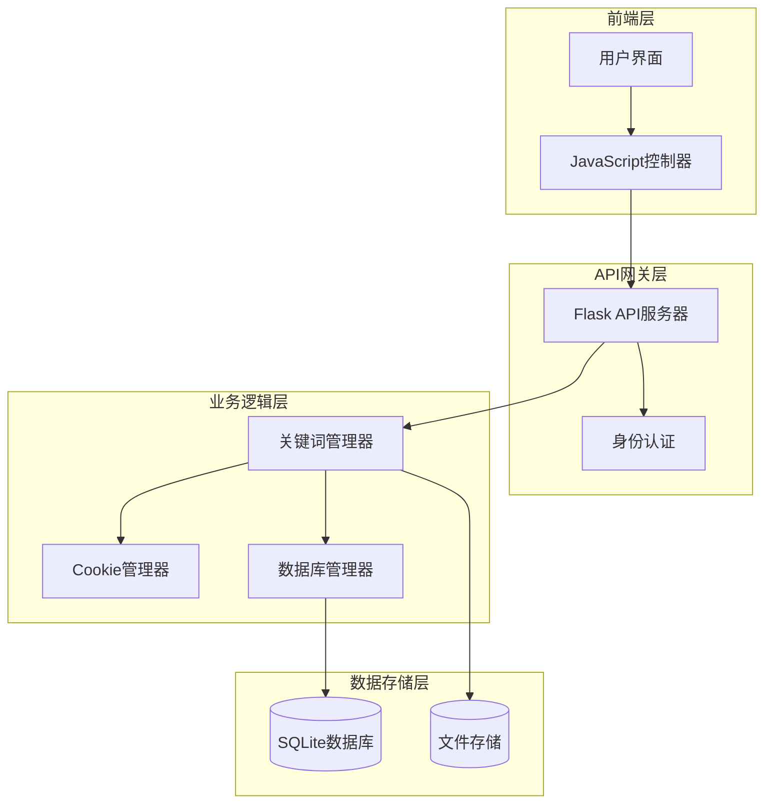
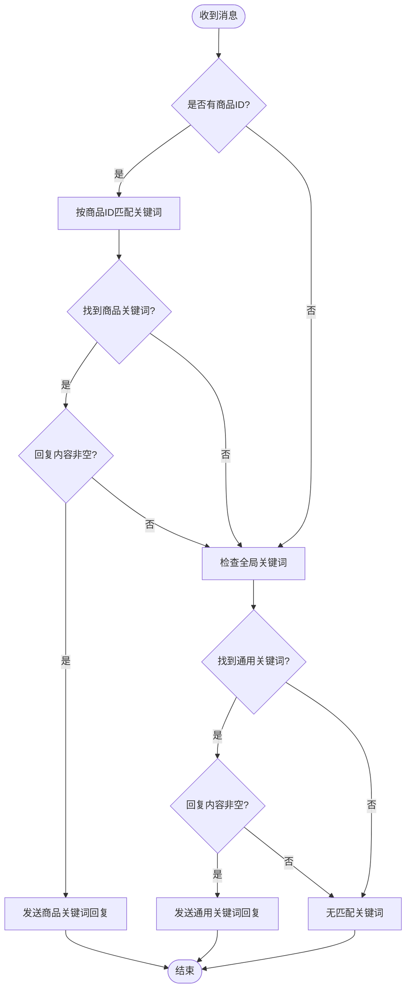
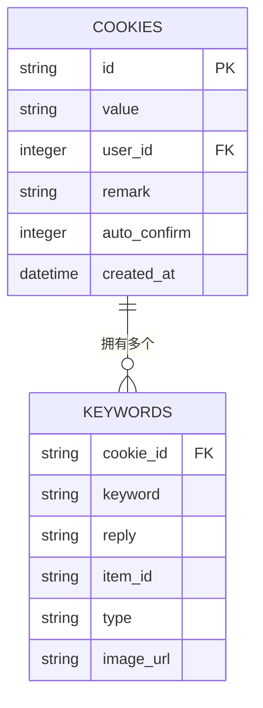
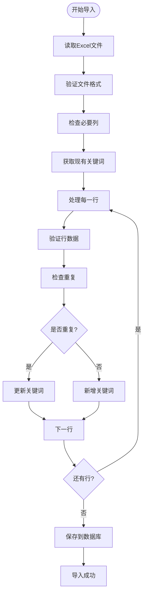
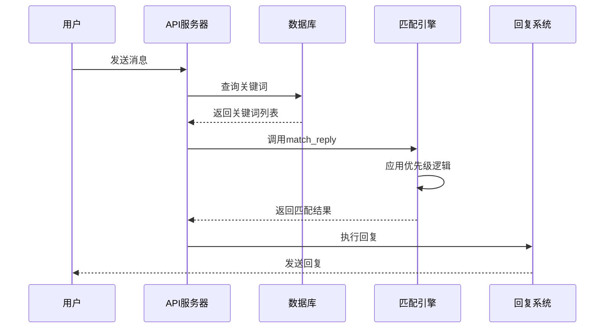

# 关键词管理接口文档

<cite>
**本文档引用的文件**
- [reply_server.py](file://reply_server.py)
- [db_manager.py](file://db_manager.py)
- [XianyuAutoAsync.py](file://XianyuAutoAsync.py)
- [static/js/app.js](file://static/js/app.js)
- [static/css/keywords.css](file://static/css/keywords.css)
- [static/index.html](file://static/index.html)
</cite>

## 目录
1. [简介](#简介)
2. [系统架构概览](#系统架构概览)
3. [API端点详解](#api端点详解)
4. [关键词匹配优先级逻辑](#关键词匹配优先级逻辑)
5. [关键词与Cookie关联机制](#关键词与cookie关联机制)
6. [导入导出功能](#导入导出功能)
7. [前端交互实现](#前端交互实现)
8. [数据库设计](#数据库设计)
9. [代码示例](#代码示例)
10. [故障排除指南](#故障排除指南)

## 简介

关键词管理接口是闲鱼自动回复系统的核心功能模块，负责管理账号级别的个性化回复规则。该系统支持多种类型的关键词回复，包括文本关键词、商品ID关键词和图片关键词，并实现了严格的权限控制和优先级匹配逻辑。

## 系统架构概览

关键词管理系统采用前后端分离架构，主要组件包括：



**图表来源**
- [reply_server.py](file://reply_server.py#L1-L50)
- [db_manager.py](file://db_manager.py#L16-L50)

## API端点详解

### 获取关键词列表

#### GET /api/keywords/{cid}

获取指定Cookie账号的所有关键词列表。

**请求参数：**
- `cid` (路径参数): Cookie ID，必需

**响应格式：**
```json
[
  {
    "keyword": "关键词文本",
    "reply": "回复内容",
    "item_id": "商品ID",
    "type": "text|image",
    "image_url": "图片URL"
  }
]
```

**权限验证：** 必须是当前用户的Cookie才能访问

**节来源**
- [reply_server.py](file://reply_server.py#L3017-L3043)

### 添加/更新关键词

#### POST /api/keywords/{cid}

更新指定Cookie的关键词列表（仅限文本关键词）。

**请求体：**
```json
{
  "keywords": {
    "关键词1": "回复内容1",
    "关键词2": "回复内容2"
  }
}
```

**响应：**
```json
{
  "msg": "updated",
  "count": 2
}
```

**节来源**
- [reply_server.py](file://reply_server.py#L3077-L3096)

### 批量管理关键词

#### POST /api/keywords-with-item-id/{cid}

支持包含商品ID的完整关键词列表管理，包括文本和图片关键词。

**请求体：**
```json
{
  "keywords": [
    {
      "keyword": "关键词",
      "reply": "回复内容",
      "item_id": "商品ID"
    }
  ]
}
```

**节来源**
- [reply_server.py](file://reply_server.py#L3099-L3181)

### 删除关键词

#### DELETE /api/keywords/{cid}/{index}

根据索引删除指定的关键词。

**路径参数：**
- `cid`: Cookie ID
- `index`: 关键词索引

**响应：**
```json
{
  "msg": "删除成功"
}
```

**节来源**
- [reply_server.py](file://reply_server.py#L3540-L3568)

## 关键词匹配优先级逻辑

系统实现了严格的关键词匹配优先级机制：



**图表来源**
- [XianyuAutoAsync.py](file://XianyuAutoAsync.py#L3174-L3250)

### 优先级规则

1. **商品ID关键词优先级最高**：当消息包含商品ID时，系统优先匹配该商品ID对应的关键词
2. **通用关键词次之**：如果没有商品ID匹配，则匹配通用关键词
3. **空回复处理**：如果匹配到关键词但回复内容为空，则不进行回复
4. **类型区分**：支持文本关键词和图片关键词两种类型

**节来源**
- [XianyuAutoAsync.py](file://XianyuAutoAsync.py#L3174-L3250)

## 关键词与Cookie关联机制

### 数据库关联设计

关键词与Cookie之间通过外键关联，确保数据隔离：



**图表来源**
- [db_manager.py](file://db_manager.py#L126-L137)

### 权限控制机制

系统实现了严格的权限控制：

1. **用户隔离**：每个用户只能访问自己创建的Cookie
2. **Cookie验证**：每次API调用都会验证Cookie是否属于当前用户
3. **审计日志**：所有操作都有详细的审计日志记录

**节来源**
- [reply_server.py](file://reply_server.py#L3022-L3028)
- [reply_server.py](file://reply_server.py#L3527-L3529)

## 导入导出功能

### 导出功能

#### GET /api/keywords-export/{cid}

导出指定账号的关键词为Excel文件。

**特点：**
- 只导出文本类型的关键词
- 自动生成Excel模板（无数据时）
- 支持示例数据和说明
- 文件名包含时间戳

**Excel格式：**
| 关键词 | 商品ID | 关键词内容 |
|--------|--------|------------|
| 你好   |        | 您好！欢迎咨询 |
| 价格   | 123456 | 价格是99元 |

**节来源**
- [reply_server.py](file://reply_server.py#L3225-L3305)

### 导入功能

#### POST /api/keywords-import/{cid}

从Excel文件导入关键词到指定账号。

**导入流程：**
1. 验证文件格式（必须为.xlsx或.xls）
2. 检查必要列：关键词、商品ID、关键词内容
3. 分析现有关键词
4. 处理重复项：更新或新增
5. 保存到数据库

**节来源**
- [reply_server.py](file://reply_server.py#L3312-L3399)

### 数据处理逻辑



**图表来源**
- [reply_server.py](file://reply_server.py#L3341-L3399)

## 前端交互实现

### 用户界面设计

关键词管理界面采用现代化设计，支持：

- **实时关键词列表**：动态显示当前账号的关键词
- **添加/编辑功能**：支持关键词的增删改查
- **导入导出**：一键导出和导入关键词数据
- **状态管理**：显示关键词数量和账号状态

**节来源**
- [static/js/app.js](file://static/js/app.js#L673-L1069)
- [static/css/keywords.css](file://static/css/keywords.css#L1-L66)

### 前端API调用

前端通过JavaScript实现与后端的交互：

```javascript
// 获取关键词列表
async function loadAccountKeywords() {
    const response = await fetch(`${apiBase}/keywords/${currentCookieId}`, {
        headers: {
            'Authorization': `Bearer ${authToken}`
        }
    });
    const keywordsData = await response.json();
    // 更新UI显示
}

// 添加关键词
async function addKeyword(keyword, reply, itemId) {
    const response = await fetch(`${apiBase}/keywords-with-item-id/${currentCookieId}`, {
        method: 'POST',
        headers: {
            'Content-Type': 'application/json',
            'Authorization': `Bearer ${authToken}`
        },
        body: JSON.stringify({
            keywords: [{
                keyword: keyword,
                reply: reply,
                item_id: itemId
            }]
        })
    });
}
```

**节来源**
- [static/js/app.js](file://static/js/app.js#L673-L1069)

## 数据库设计

### 关键词表结构

```sql
CREATE TABLE keywords (
    cookie_id TEXT,
    keyword TEXT,
    reply TEXT,
    item_id TEXT,
    type TEXT DEFAULT 'text',
    image_url TEXT,
    FOREIGN KEY (cookie_id) REFERENCES cookies(id) ON DELETE CASCADE
);
```

### 字段说明

| 字段名 | 类型 | 说明 |
|--------|------|------|
| cookie_id | TEXT | 关联的Cookie ID |
| keyword | TEXT | 关键词文本 |
| reply | TEXT | 回复内容 |
| item_id | TEXT | 商品ID（可选） |
| type | TEXT | 关键词类型：text/image |
| image_url | TEXT | 图片URL（图片关键词专用） |

**节来源**
- [db_manager.py](file://db_manager.py#L126-L137)

### 数据操作方法

数据库管理器提供了丰富的关键词操作方法：

- `get_keywords_with_type()`：获取包含类型信息的关键词列表
- `save_text_keywords_only()`：只保存文本关键词，保留图片关键词
- `delete_keyword_by_index()`：按索引删除关键词

**节来源**
- [db_manager.py](file://db_manager.py#L1616-L1650)

## 代码示例

### 批量配置关键词示例

以下示例展示了如何通过API批量配置关键词回复规则：

```python
# 批量添加关键词
import requests

# API基础URL
api_base = "http://localhost:8000/api"

# 添加关键词
def batch_add_keywords(cookie_id, keywords_data):
    """
    批量添加关键词
    :param cookie_id: Cookie ID
    :param keywords_data: 关键词数据列表
    """
    url = f"{api_base}/keywords-with-item-id/{cookie_id}"
    headers = {
        'Authorization': f'Bearer {auth_token}',
        'Content-Type': 'application/json'
    }
    
    response = requests.post(url, headers=headers, json={
        'keywords': keywords_data
    })
    
    if response.status_code == 200:
        print(f"成功添加 {len(keywords_data)} 个关键词")
    else:
        print(f"添加失败: {response.text}")

# 示例关键词数据
keywords = [
    {
        'keyword': '你好',
        'reply': '您好！欢迎咨询，有什么可以帮助您的吗？',
        'item_id': ''
    },
    {
        'keyword': '价格',
        'reply': '这个商品的价格是{send_message}元，现在有优惠活动哦！',
        'item_id': '123456'
    },
    {
        'keyword': '发货',
        'reply': '我们会在24小时内发货，请耐心等待。',
        'item_id': ''
    }
]

# 调用API
batch_add_keywords('your_cookie_id', keywords)
```

### 与match_reply函数的调用关系

关键词管理与核心匹配逻辑紧密集成：



**图表来源**
- [XianyuAutoAsync.py](file://XianyuAutoAsync.py#L3174-L3250)

**节来源**
- [XianyuAutoAsync.py](file://XianyuAutoAsync.py#L3174-L3250)

## 故障排除指南

### 常见问题及解决方案

#### 1. 权限错误
**问题**：`403 Forbidden` 错误
**原因**：尝试访问不属于当前用户的Cookie
**解决**：确保Cookie属于当前登录用户

#### 2. 关键词重复
**问题**：`关键词重复` 错误
**原因**：尝试添加重复的关键词组合
**解决**：检查关键词和商品ID的组合是否唯一

#### 3. 导入失败
**问题**：Excel导入失败
**原因**：文件格式错误或缺少必要列
**解决**：
- 确保文件为.xlsx或.xls格式
- 检查包含关键词、商品ID、关键词内容三列
- 确保数据格式正确

#### 4. 性能问题
**问题**：大量关键词导致查询缓慢
**解决**：
- 优化数据库索引
- 实现关键词缓存机制
- 分页加载关键词列表

### 调试工具

系统提供了调试端点：

```python
@app.get("/debug/keywords-table-info")
def debug_keywords_table_info():
    """调试：检查keywords表结构"""
    # 获取表结构信息
    cursor.execute("PRAGMA table_info(keywords)")
    columns = cursor.fetchall()
    return {"columns": columns}
```

**节来源**
- [reply_server.py](file://reply_server.py#L3579-L3589)

## 结论

关键词管理接口为闲鱼自动回复系统提供了强大而灵活的关键词管理能力。通过严格的权限控制、清晰的优先级逻辑和完善的导入导出功能，系统能够满足各种复杂的自动化回复需求。前端界面的现代化设计进一步提升了用户体验，使得关键词配置变得简单直观。

该系统的设计充分考虑了扩展性和维护性，为未来的功能增强奠定了良好的基础。