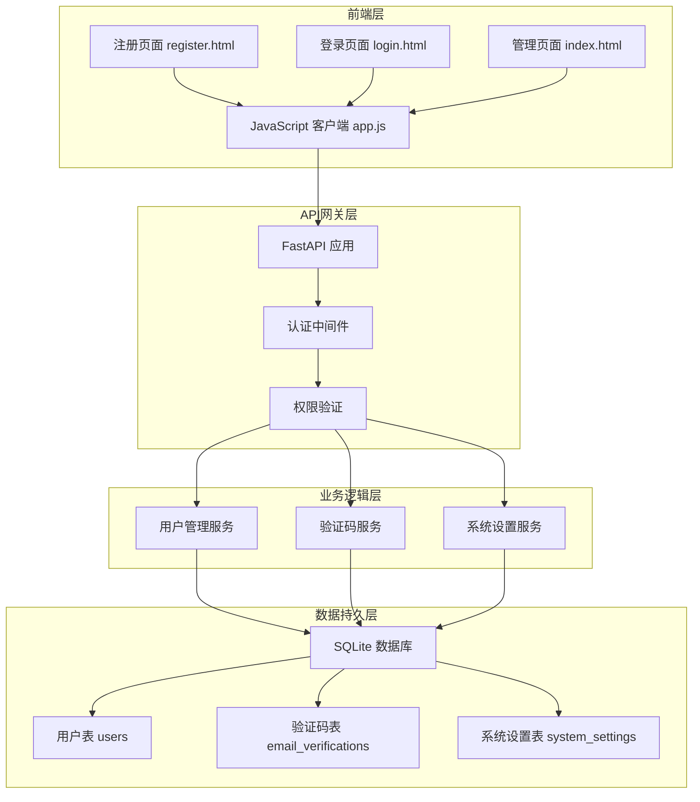
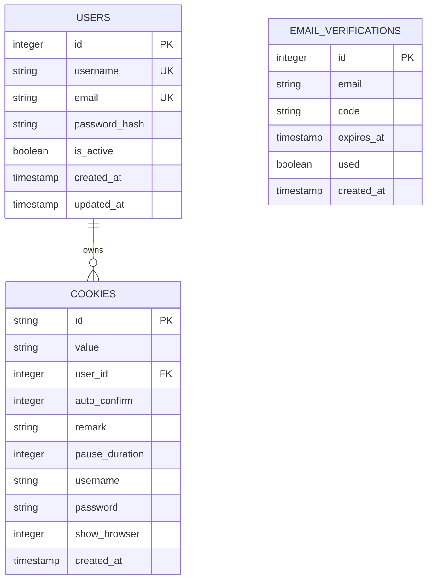
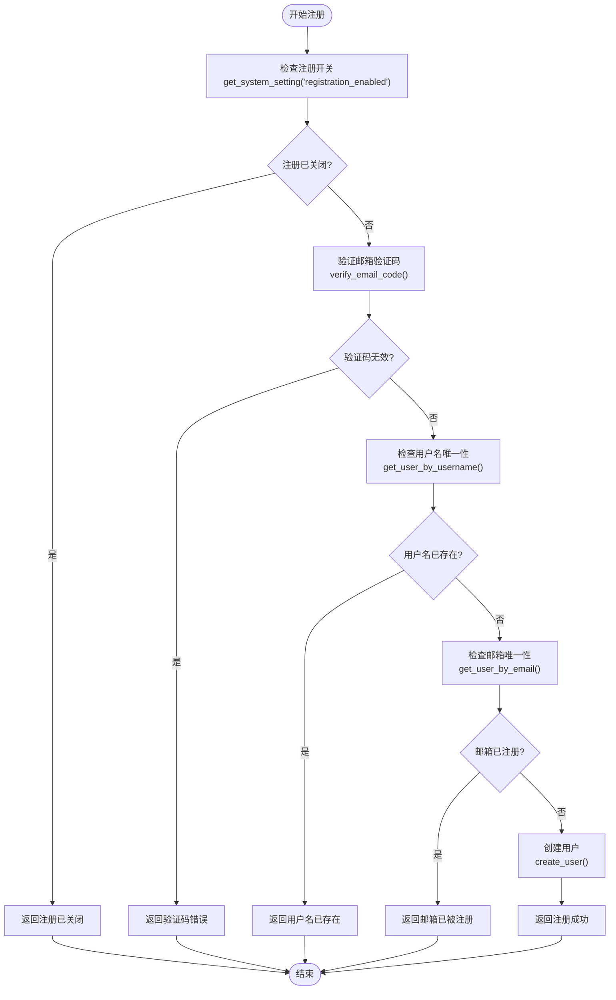
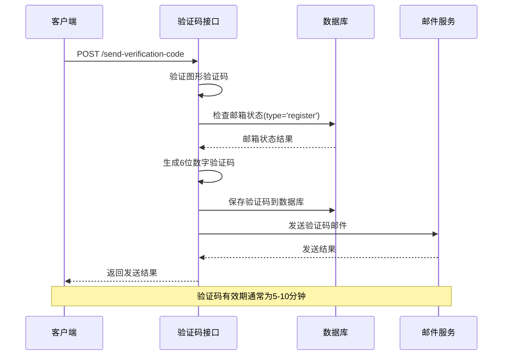
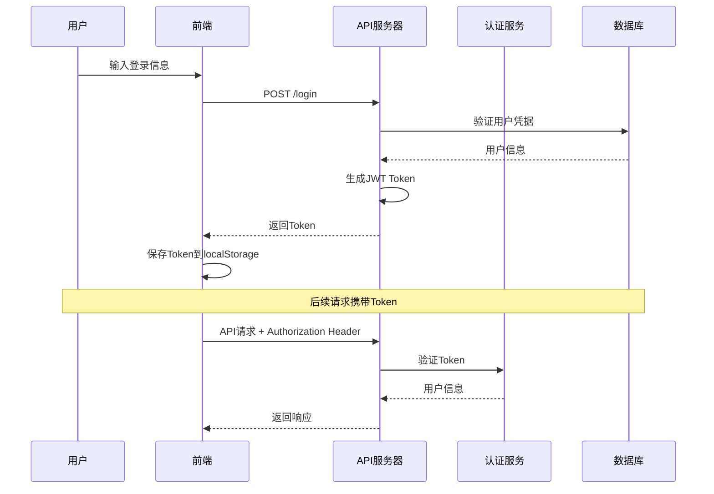
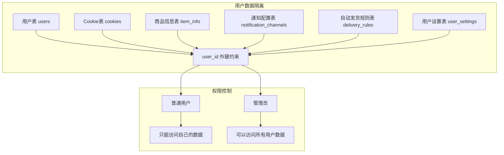
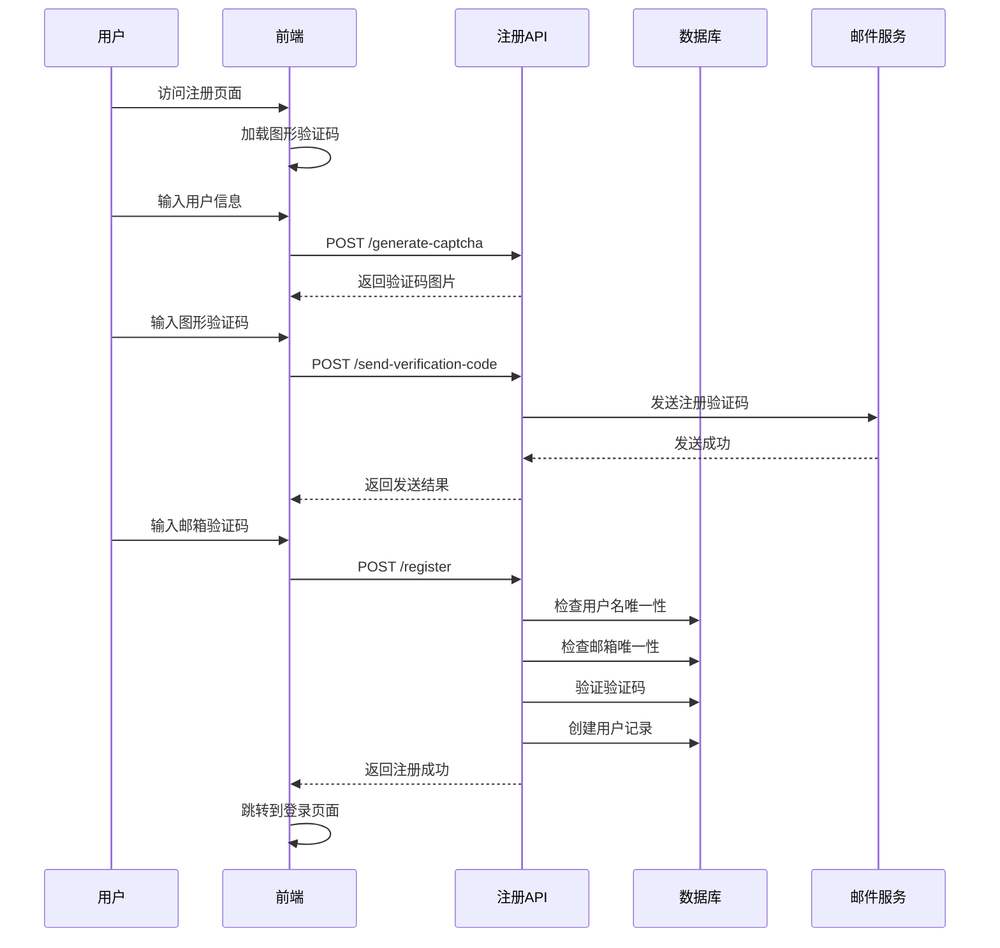
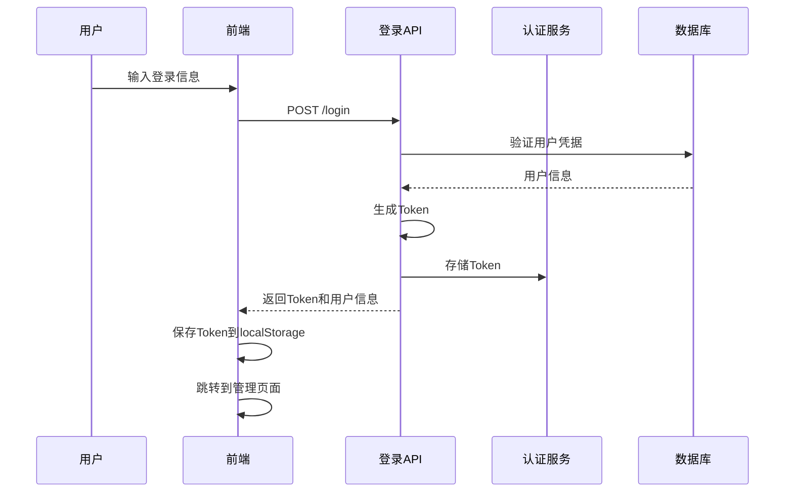
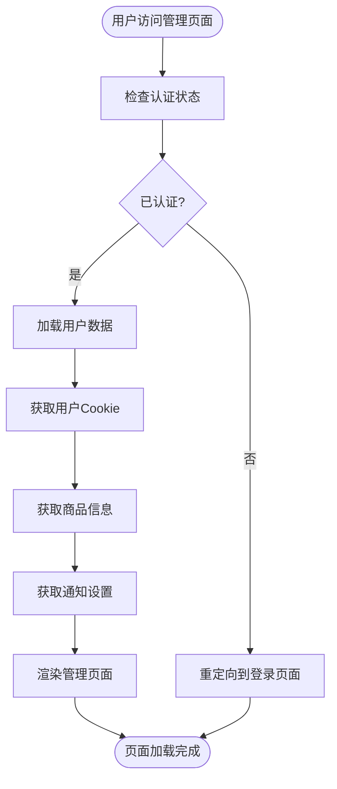

# 用户管理接口

<cite>
**本文档引用的文件**
- [reply_server.py](file://reply_server.py)
- [db_manager.py](file://db_manager.py)
- [register.html](file://static/register.html)
- [app.js](file://static/js/app.js)
- [login.html](file://static/login.html)
- [index.html](file://static/index.html)
</cite>

## 目录
1. [简介](#简介)
2. [系统架构概览](#系统架构概览)
3. [核心用户模型](#核心用户模型)
4. [用户注册接口](#用户注册接口)
5. [验证码发送接口](#验证码发送接口)
6. [用户认证与权限管理](#用户认证与权限管理)
7. [系统级用户设置](#系统级用户设置)
8. [用户数据隔离机制](#用户数据隔离机制)
9. [完整用户生命周期示例](#完整用户生命周期示例)
10. [故障排除指南](#故障排除指南)

## 简介

本文档详细介绍了闲鱼自动回复系统的用户管理相关API接口，包括用户注册、登录、验证码验证、系统设置管理等功能模块。系统采用基于令牌的身份验证机制，实现了严格的用户数据隔离和管理员权限控制。

## 系统架构概览

系统采用前后端分离架构，后端基于FastAPI框架提供RESTful API服务，前端使用纯HTML/CSS/JavaScript实现用户界面。



**图表来源**
- [reply_server.py](file://reply_server.py#L308-L370)
- [db_manager.py](file://db_manager.py#L16-L70)

## 核心用户模型

### RegisterRequest 模型

RegisterRequest 是用户注册请求的数据模型，定义了注册所需的所有字段要求。

| 字段名 | 类型 | 必填 | 长度限制 | 正则验证 | 描述 |
|--------|------|------|----------|----------|------|
| username | string | 是 | 3-20字符 | ^[a-zA-Z0-9_]+$ | 用户名，只能包含字母、数字和下划线 |
| email | string | 是 | - | 有效邮箱格式 | 用户邮箱地址 |
| password | string | 是 | ≥6字符 | - | 用户密码 |
| verification_code | string | 是 | 6位数字 | - | 邮箱验证码 |

### 用户数据库表结构

系统使用SQLite数据库存储用户信息，核心表结构如下：



**图表来源**
- [db_manager.py](file://db_manager.py#L74-L123)

**章节来源**
- [reply_server.py](file://reply_server.py#L134-L144)
- [db_manager.py](file://db_manager.py#L74-L123)

## 用户注册接口

### 接口概述

用户注册接口提供了完整的用户注册流程，包括注册状态检查、验证码验证、用户名和邮箱唯一性检查等安全措施。

### API端点

| 方法 | 端点 | 描述 | 认证要求 |
|------|------|------|----------|
| POST | `/register` | 用户注册 | 无 |

### 请求参数

```json
{
  "username": "string",
  "email": "string",
  "password": "string", 
  "verification_code": "string"
}
```

### 响应格式

```json
{
  "success": true,
  "message": "string"
}
```

### 注册流程验证逻辑



**图表来源**
- [reply_server.py](file://reply_server.py#L844-L905)

### 前端注册表单验证

前端实现了完整的表单验证逻辑，确保用户输入符合要求：

```javascript
// 前端验证规则
if (username.length < 3 || username.length > 20) {
    showAlert('用户名长度必须在3-20个字符之间');
    return;
}

if (!/^[a-zA-Z0-9_]+$/.test(username)) {
    showAlert('用户名只能包含字母、数字和下划线');
    return;
}

if (!validateEmail(email)) {
    showAlert('请输入有效的邮箱地址');
    return;
}

if (verificationCode.length !== 6) {
    showAlert('请输入6位验证码');
    return;
}

if (password.length < 6) {
    showAlert('密码长度至少6个字符');
    return;
}

if (password !== confirmPassword) {
    showAlert('两次输入的密码不一致');
    return;
}
```

**章节来源**
- [reply_server.py](file://reply_server.py#L844-L905)
- [register.html](file://static/register.html#L478-L510)

## 验证码发送接口

### 接口概述

验证码发送接口负责生成和发送邮箱验证码，支持注册和登录两种场景。

### API端点

| 方法 | 端点 | 描述 | 认证要求 |
|------|------|------|----------|
| POST | `/send-verification-code` | 发送邮箱验证码 | 无 |

### 请求参数

```json
{
  "email": "string",
  "session_id": "string",
  "type": "string"
}
```

### 验证码类型说明

| 类型 | 描述 | 验证逻辑 |
|------|------|----------|
| register | 注册验证码 | 检查邮箱是否已注册 |
| login | 登录验证码 | 检查邮箱是否已注册 |

### 验证码生成与验证流程



**图表来源**
- [reply_server.py](file://reply_server.py#L776-L842)

### 验证码时效性管理

系统实现了严格的验证码时效性控制：

- **生成时间**：验证码生成时记录当前时间
- **过期时间**：默认5分钟有效期
- **使用状态**：验证码一旦使用即标记为已使用
- **清理机制**：定期清理过期的验证码记录

**章节来源**
- [reply_server.py](file://reply_server.py#L776-L842)
- [db_manager.py](file://db_manager.py#L2536-L2540)

## 用户认证与权限管理

### 认证机制

系统采用基于Bearer Token的认证机制，支持会话管理和权限控制。

### 认证流程



**图表来源**
- [reply_server.py](file://reply_server.py#L542-L653)

### 权限控制层次

系统实现了多层次的权限控制：

| 权限级别 | 角色 | 可访问资源 | 操作范围 |
|----------|------|------------|----------|
| 匿名用户 | 未认证 | 公开接口 | 注册、登录、验证码 |
| 普通用户 | 用户 | 个人数据 | 用户信息、Cookie管理 |
| 管理员 | admin | 系统管理 | 用户管理、系统设置 |

### 认证中间件实现

```python
# 用户认证中间件
def require_auth(user_info: Optional[Dict[str, Any]] = Depends(verify_token)):
    """需要认证的依赖，返回用户信息"""
    if not user_info:
        raise HTTPException(status_code=401, detail="未授权访问")
    return user_info

# 管理员权限验证
def require_admin(current_user: Dict[str, Any] = Depends(get_current_user)) -> Dict[str, Any]:
    """要求管理员权限"""
    if current_user['username'] != 'admin':
        raise HTTPException(status_code=403, detail="需要管理员权限")
    return current_user
```

**章节来源**
- [reply_server.py](file://reply_server.py#L183-L243)

## 系统级用户设置

### 注册功能开关管理

系统提供了灵活的注册功能开关管理，允许管理员动态控制用户注册功能的开启和关闭。

### API端点

| 方法 | 端点 | 描述 | 认证要求 |
|------|------|------|----------|
| GET | `/registration-status` | 获取注册开关状态 | 无 |
| PUT | `/registration-settings` | 更新注册开关设置 | 管理员 |

### 注册状态查询

```json
{
  "enabled": true,
  "message": "注册功能已开启"
}
```

### 注册设置更新

```json
{
  "enabled": false,
  "message": "注册功能已关闭"
}
```

### 系统设置表结构

```mermaid
erDiagram
SYSTEM_SETTINGS {
string key PK
string value
string description
timestamp updated_at
}
SYSTEM_SETTINGS {
"registration_enabled" ||--|| "true/false" : controls
"show_default_login_info" ||--|| "true/false" : controls
"smtp_server" ||--|| "string" : configures
"smtp_port" ||--|| "integer" : configures
}
```

**图表来源**
- [db_manager.py](file://db_manager.py#L369-L375)

### 默认系统设置

系统初始化时预设了以下关键设置：

| 设置项 | 默认值 | 描述 |
|--------|--------|------|
| registration_enabled | true | 是否开启用户注册 |
| show_default_login_info | true | 是否显示默认登录信息 |
| smtp_server | "" | SMTP服务器地址 |
| smtp_port | 587 | SMTP端口 |
| smtp_use_tls | true | 是否启用TLS |

**章节来源**
- [reply_server.py](file://reply_server.py#L2685-L2765)
- [db_manager.py](file://db_manager.py#L426-L437)

## 用户数据隔离机制

### 数据隔离原则

系统实现了严格的用户数据隔离机制，确保普通管理员只能管理自己的账号，而不能访问其他用户的敏感信息。

### 隔离机制实现



**图表来源**
- [db_manager.py](file://db_manager.py#L110-L123)

### 数据访问控制示例

```python
# 获取当前用户的所有Cookie信息
@app.get("/items")
def get_all_items(current_user: Dict[str, Any] = Depends(get_current_user)):
    """获取当前用户的所有商品信息"""
    try:
        user_id = current_user['user_id']
        from db_manager import db_manager
        user_cookies = db_manager.get_all_cookies(user_id)
        # 只返回当前用户的商品信息
        all_items = []
        for cookie_id in user_cookies.keys():
            items = db_manager.get_items_by_cookie(cookie_id)
            all_items.extend(items)
        return {"items": all_items}
    except Exception as e:
        raise HTTPException(status_code=500, detail=f"获取商品信息失败: {str(e)}")
```

### 管理员特殊权限

管理员拥有以下特殊权限：

| 权限类型 | 操作范围 | 实现方式 |
|----------|----------|----------|
| 用户管理 | 查看、编辑、删除任何用户 | 直接访问用户表 |
| 系统设置 | 修改全局系统配置 | require_admin装饰器 |
| 日志审计 | 查看所有用户操作日志 | 管理员权限验证 |
| 数据备份 | 导出所有用户数据 | 管理员专用接口 |

**章节来源**
- [reply_server.py](file://reply_server.py#L3961-L3975)
- [reply_server.py](file://reply_server.py#L4718-L4731)

## 完整用户生命周期示例

### 注册流程

以下是完整的用户注册流程示例：



**图表来源**
- [register.html](file://static/register.html#L467-L540)
- [reply_server.py](file://reply_server.py#L844-L905)

### 登录流程



**图表来源**
- [login.html](file://static/login.html#L374-L408)
- [reply_server.py](file://reply_server.py#L542-L653)

### 信息查询流程



**图表来源**
- [app.js](file://static/js/app.js#L1918-L1948)

### 完整调用示例

以下是典型的API调用序列：

1. **注册阶段**
   ```bash
   # 1. 获取图形验证码
   curl -X POST "/generate-captcha" \
     -H "Content-Type: application/json" \
     -d '{"session_id": "abc123"}'
   
   # 2. 发送注册验证码
   curl -X POST "/send-verification-code" \
     -H "Content-Type: application/json" \
     -d '{"email": "user@example.com", "type": "register"}'
   
   # 3. 提交注册信息
   curl -X POST "/register" \
     -H "Content-Type: application/json" \
     -d '{"username": "testuser", "email": "user@example.com", "password": "securepass123", "verification_code": "123456"}'
   ```

2. **登录阶段**
   ```bash
   # 1. 发送登录验证码
   curl -X POST "/send-verification-code" \
     -H "Content-Type: application/json" \
     -d '{"email": "user@example.com", "type": "login"}'
   
   # 2. 使用验证码登录
   curl -X POST "/login" \
     -H "Content-Type: application/json" \
     -d '{"email": "user@example.com", "verification_code": "123456"}'
   ```

3. **系统设置管理**
   ```bash
   # 1. 获取注册状态
   curl -X GET "/registration-status"
   
   # 2. 更新注册设置（需要管理员权限）
   curl -X PUT "/registration-settings" \
     -H "Authorization: Bearer admin_token" \
     -H "Content-Type: application/json" \
     -d '{"enabled": false}'
   ```

**章节来源**
- [register.html](file://static/register.html#L467-L540)
- [login.html](file://static/login.html#L374-L408)
- [reply_server.py](file://reply_server.py#L2685-L2765)

## 故障排除指南

### 常见问题及解决方案

#### 1. 注册失败问题

**问题现象**：用户注册时收到"用户名已存在"或"邮箱已被注册"错误

**排查步骤**：
```python
# 检查用户名唯一性
existing_user = db_manager.get_user_by_username(request.username)
if existing_user:
    logger.warning(f"用户名已存在: {request.username}")

# 检查邮箱唯一性  
existing_email = db_manager.get_user_by_email(request.email)
if existing_email:
    logger.warning(f"邮箱已被注册: {request.email}")
```

**解决方案**：
- 确认用户名和邮箱的唯一性检查逻辑
- 检查数据库索引是否正常
- 验证用户名和邮箱格式是否符合要求

#### 2. 验证码问题

**问题现象**：验证码发送失败或验证码验证失败

**排查步骤**：
```python
# 检查验证码生成
code = db_manager.generate_verification_code()
logger.info(f"生成的验证码: {code}")

# 检查验证码验证
valid = db_manager.verify_email_code(email, code)
logger.info(f"验证码验证结果: {valid}")
```

**解决方案**：
- 检查SMTP配置是否正确
- 验证邮件服务是否可用
- 确认验证码过期时间设置合理

#### 3. 认证问题

**问题现象**：Token验证失败或权限不足

**排查步骤**：
```python
# 检查Token有效性
token_data = SESSION_TOKENS.get(token)
if token_data:
    expired = time.time() - token_data['timestamp'] > TOKEN_EXPIRE_TIME
    logger.info(f"Token过期状态: {expired}")

# 检查用户权限
if user_info['username'] != 'admin':
    logger.warning(f"非管理员用户尝试访问管理功能")
```

**解决方案**：
- 检查Token过期时间设置
- 验证用户权限验证逻辑
- 确认认证中间件配置正确

#### 4. 数据隔离问题

**问题现象**：普通用户能够访问其他用户的数据

**排查步骤**：
```python
# 检查用户数据访问权限
def get_user_cookies(user_id: int):
    """获取用户的所有Cookie，确保数据隔离"""
    with self.lock:
        try:
            cursor = self.conn.cursor()
            cursor.execute('''
            SELECT id, value, remark, created_at 
            FROM cookies 
            WHERE user_id = ?
            ''', (user_id,))
            return cursor.fetchall()
        except Exception as e:
            logger.error(f"获取用户Cookie失败: {e}")
            return []
```

**解决方案**：
- 确认外键约束是否正确设置
- 检查数据访问查询是否包含用户ID过滤
- 验证权限控制中间件是否生效

### 性能优化建议

1. **数据库索引优化**
   - 为用户表的username和email字段添加唯一索引
   - 为验证码表的email和expires_at字段添加索引
   - 为系统设置表的key字段添加主键索引

2. **缓存策略**
   - 缓存常用的系统设置值
   - 缓存用户认证信息
   - 实现验证码的内存缓存

3. **连接池管理**
   - 使用数据库连接池减少连接开销
   - 设置合理的连接超时时间
   - 实现连接池监控和自动恢复

### 监控和日志

系统提供了完善的日志记录功能，便于问题诊断和性能监控：

```python
# 用户操作日志
logger.info(f"【{user['username']}#{user['id']}】注册成功")

# 系统状态日志
logger.info(f"【{request.username}】尝试注册，邮箱: {request.email}")

# 错误日志
logger.error(f"【{request.username}】注册失败: 数据库操作失败")
```

**章节来源**
- [reply_server.py](file://reply_server.py#L858-L905)
- [db_manager.py](file://db_manager.py#L2426-L2448)