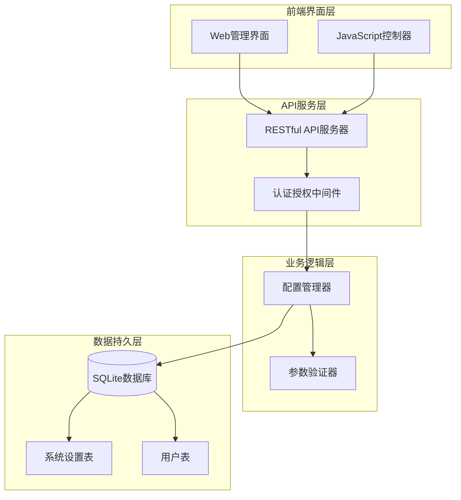
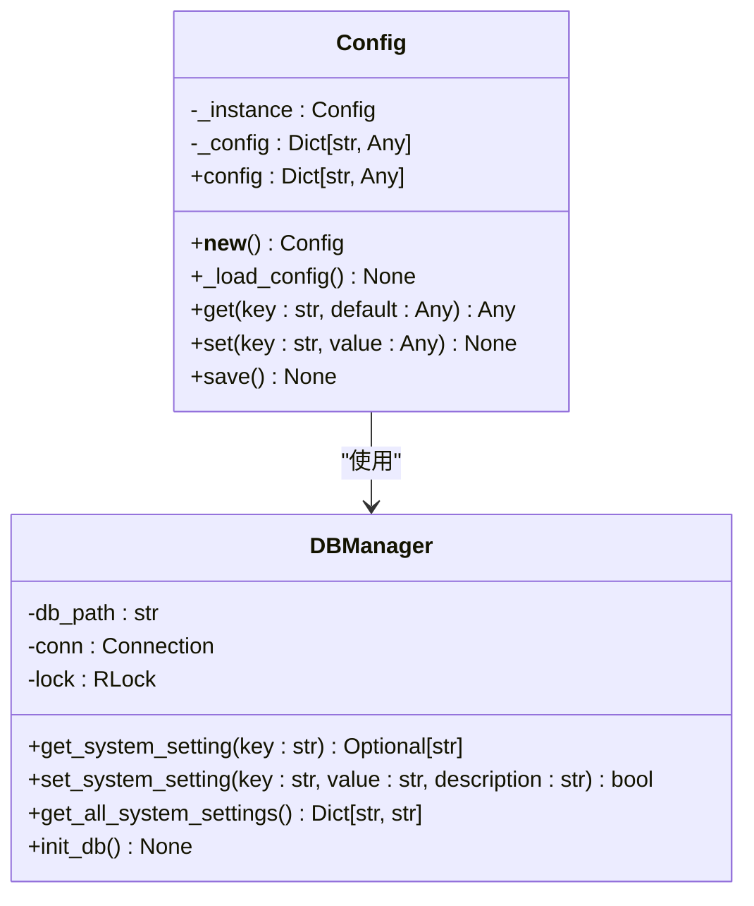
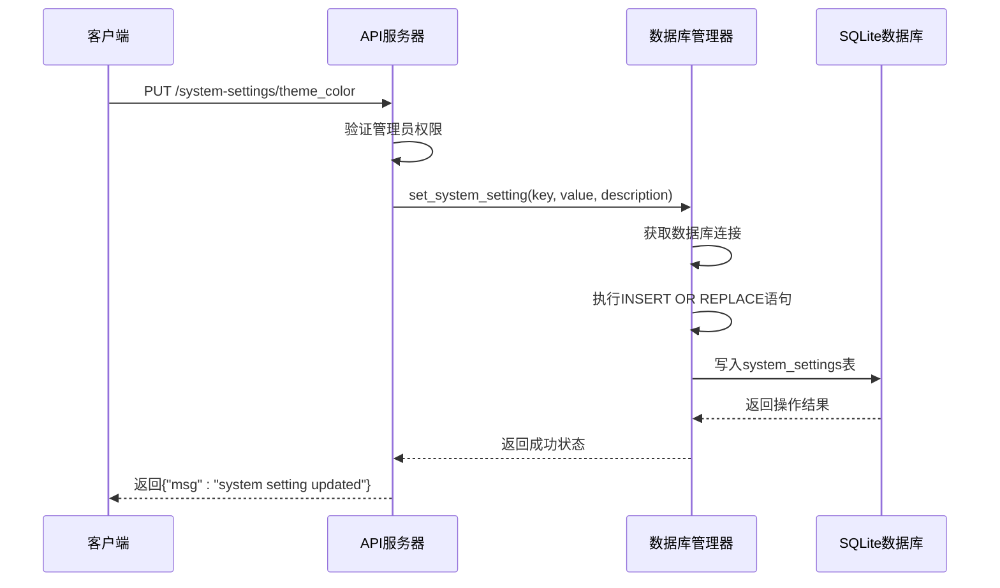
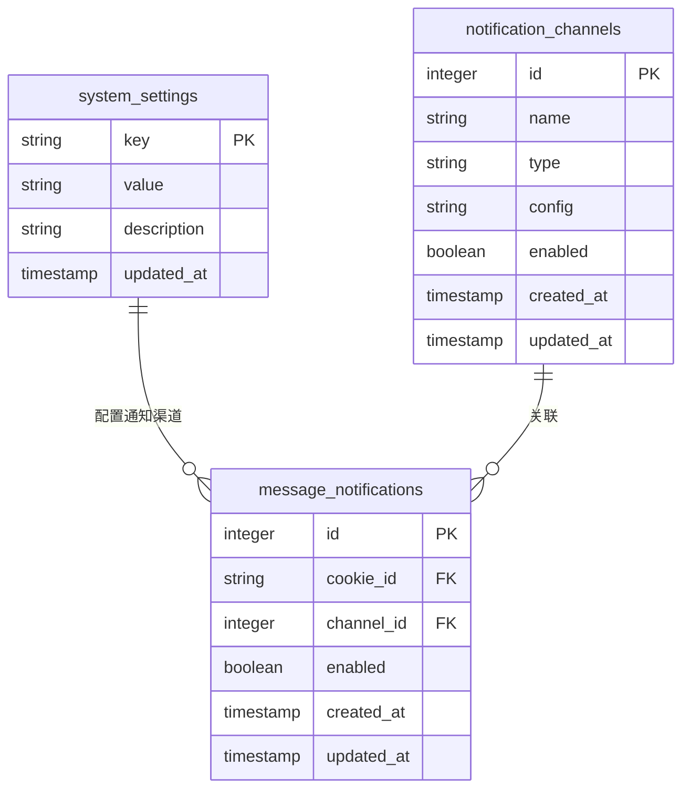
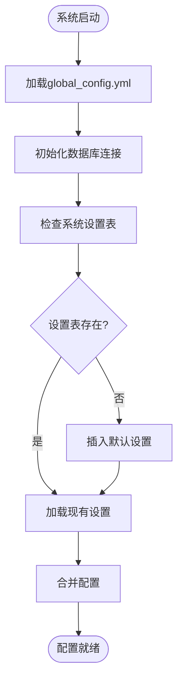
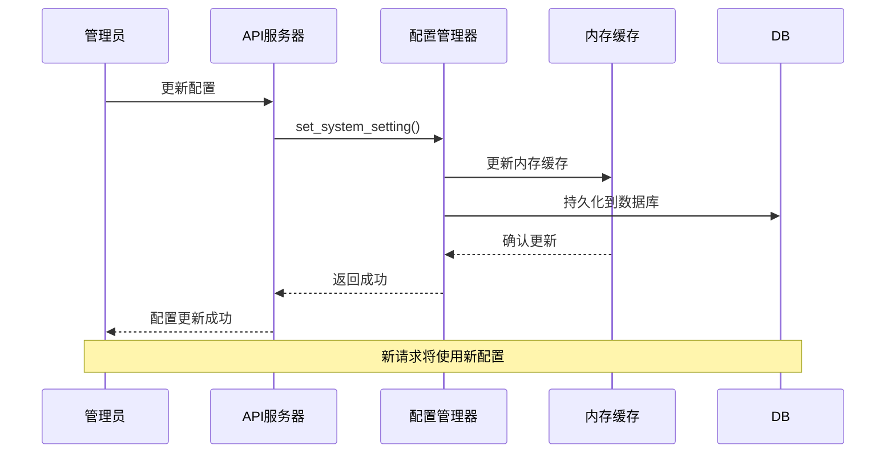
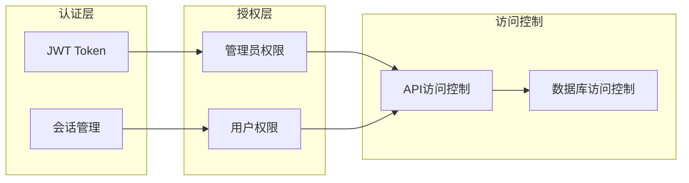
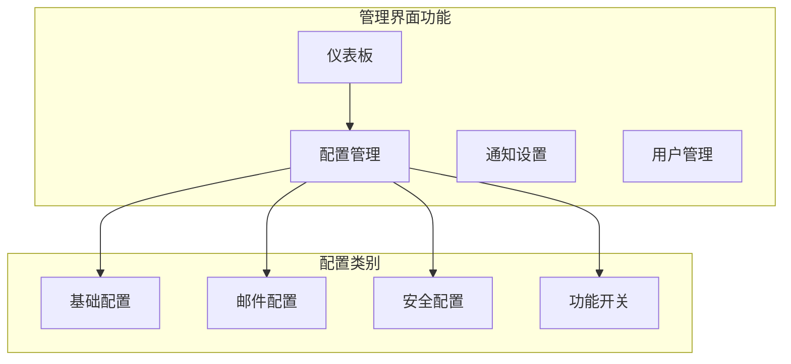
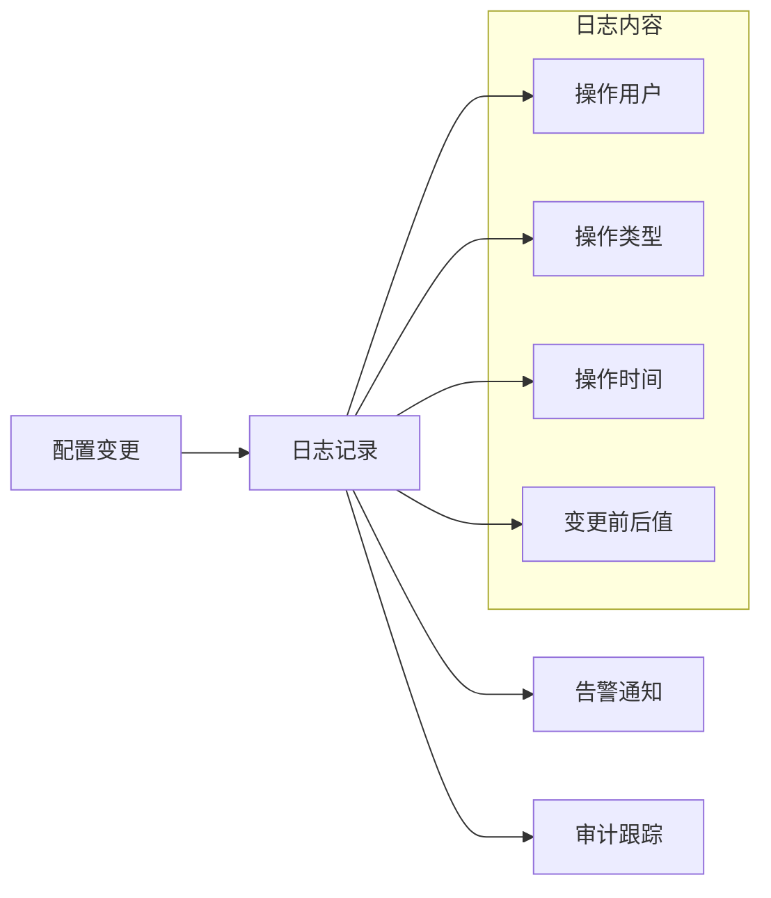

# 系统配置接口

<cite>
**本文档引用的文件**
- [config.py](file://config.py)
- [db_manager.py](file://db_manager.py)
- [global_config.yml](file://global_config.yml)
- [reply_server.py](file://reply_server.py)
- [slider_patch.py](file://utils/slider_patch.py)
- [app.js](file://static/js/app.js)
</cite>

## 目录
1. [简介](#简介)
2. [系统架构概览](#系统架构概览)
3. [核心组件分析](#核心组件分析)
4. [API端点详细说明](#api端点详细说明)
5. [配置存储机制](#配置存储机制)
6. [系统参数列表](#系统参数列表)
7. [配置变更生效机制](#配置变更生效机制)
8. [安全配置最佳实践](#安全配置最佳实践)
9. [远程配置管理](#远程配置管理)
10. [故障排除指南](#故障排除指南)

## 简介

本文档详细介绍了"xianyu-auto-reply"系统中的配置管理API接口，包括系统设置的获取、更新和管理功能。该系统采用SQLite数据库存储配置信息，支持实时配置更新和多种通知渠道配置。

## 系统架构概览

系统配置管理采用分层架构设计，主要包括以下层次：



**图表来源**
- [reply_server.py](file://reply_server.py#L2644-L2791)
- [db_manager.py](file://db_manager.py#L16-L52)

## 核心组件分析

### 配置管理器 (Config)

配置管理器负责全局配置的加载、读取和保存操作：



**图表来源**
- [config.py](file://config.py#L5-L126)
- [db_manager.py](file://db_manager.py#L16-L52)

**章节来源**
- [config.py](file://config.py#L5-L126)
- [db_manager.py](file://db_manager.py#L16-L52)

### 数据库管理器

数据库管理器负责系统设置的持久化存储：



**图表来源**
- [reply_server.py](file://reply_server.py#L2663-L2680)
- [db_manager.py](file://db_manager.py#L2388-L2404)

**章节来源**
- [db_manager.py](file://db_manager.py#L2376-L2404)

## API端点详细说明

### 系统设置获取接口

#### GET /system-settings

**功能描述**: 获取所有系统设置（排除敏感信息）

**请求参数**: 无

**响应格式**:
```json
{
    "theme_color": "blue",
    "registration_enabled": "true",
    "show_default_login_info": "true",
    "smtp_server": "",
    "smtp_port": "587",
    "smtp_user": "",
    "smtp_password": "",
    "smtp_from": "",
    "smtp_use_tls": "true",
    "smtp_use_ssl": "false",
    "qq_reply_secret_key": "xianyu_qq_reply_2024"
}
```

**认证要求**: 需要管理员权限

**错误处理**:
- 500: 数据库操作失败

**章节来源**
- [reply_server.py](file://reply_server.py#L2646-L2656)

### 系统设置更新接口

#### PUT /system-settings/{key}

**功能描述**: 更新指定的系统设置

**请求参数**:
- `key`: 设置项的键名
- `setting_data`: 设置数据对象

**请求体格式**:
```json
{
    "value": "新的值",
    "description": "设置项描述"
}
```

**响应格式**:
```json
{
    "msg": "system setting updated"
}
```

**认证要求**: 需要管理员权限

**限制条件**:
- 不能直接修改`admin_password_hash`
- 不允许修改敏感配置项

**错误处理**:
- 400: 禁止修改密码哈希或更新失败
- 500: 数据库操作失败

**章节来源**
- [reply_server.py](file://reply_server.py#L2663-L2680)

### 注册功能状态接口

#### GET /registration-status

**功能描述**: 获取用户注册功能的状态（公开接口）

**请求参数**: 无

**响应格式**:
```json
{
    "enabled": true,
    "message": "注册功能已开启"
}
```

**认证要求**: 无需认证

**章节来源**
- [reply_server.py](file://reply_server.py#L2685-L2706)

#### PUT /registration-settings

**功能描述**: 更新注册功能开关设置（仅管理员）

**请求参数**:
- `enabled`: 布尔值，是否开启注册功能

**响应格式**:
```json
{
    "success": true,
    "enabled": true,
    "message": "注册功能已开启"
}
```

**认证要求**: 需要管理员权限

**章节来源**
- [reply_server.py](file://reply_server.py#L2741-L2765)

### 登录信息显示接口

#### GET /login-info-status

**功能描述**: 获取默认登录信息显示状态

**请求参数**: 无

**响应格式**:
```json
{
    "enabled": true
}
```

**认证要求**: 无需认证

**章节来源**
- [reply_server.py](file://reply_server.py#L2712-L2730)

#### PUT /login-info-settings

**功能描述**: 更新登录信息显示设置（仅管理员）

**请求参数**:
- `enabled`: 布尔值，是否显示登录信息

**响应格式**:
```json
{
    "success": true,
    "enabled": true,
    "message": "默认登录信息显示已开启"
}
```

**认证要求**: 需要管理员权限

**章节来源**
- [reply_server.py](file://reply_server.py#L2768-L2791)

## 配置存储机制

### 数据库存储结构

系统配置存储在SQLite数据库的`system_settings`表中：



**图表来源**
- [db_manager.py](file://db_manager.py#L369-L390)

### 配置加载流程



**图表来源**
- [config.py](file://config.py#L21-L32)
- [db_manager.py](file://db_manager.py#L424-L437)

**章节来源**
- [db_manager.py](file://db_manager.py#L369-L447)

## 系统参数列表

### 基础配置参数

| 参数名 | 类型 | 默认值 | 描述 |
|--------|------|--------|------|
| `theme_color` | string | "blue" | 主题颜色设置 |
| `registration_enabled` | boolean | true | 是否开启用户注册 |
| `show_default_login_info` | boolean | true | 是否显示默认登录信息 |

### SMTP邮件配置

| 参数名 | 类型 | 默认值 | 描述 |
|--------|------|--------|------|
| `smtp_server` | string | "" | SMTP服务器地址 |
| `smtp_port` | integer | 587 | SMTP端口号 |
| `smtp_user` | string | "" | SMTP登录用户名 |
| `smtp_password` | string | "" | SMTP登录密码/授权码 |
| `smtp_from` | string | "" | 发件人显示名称 |
| `smtp_use_tls` | boolean | true | 是否启用TLS加密 |
| `smtp_use_ssl` | boolean | false | 是否启用SSL加密 |

### QQ回复配置

| 参数名 | 类型 | 默认值 | 描述 |
|--------|------|--------|------|
| `qq_reply_secret_key` | string | "xianyu_qq_reply_2024" | QQ回复消息API密钥 |

### 自动回复配置

| 参数名 | 类型 | 默认值 | 描述 |
|--------|------|--------|------|
| `AUTO_REPLY.enabled` | boolean | true | 是否启用自动回复 |
| `AUTO_REPLY.default_message` | string | "亲爱的\"{send_user_name}\"老板你好！..." | 默认回复消息 |
| `AUTO_REPLY.api.enabled` | boolean | false | 是否启用API回复 |
| `AUTO_REPLY.api.url` | string | "http://localhost:8080/xianyu/reply" | API回复地址 |

**章节来源**
- [global_config.yml](file://global_config.yml#L1-L77)
- [db_manager.py](file://db_manager.py#L426-L437)

## 配置变更生效机制

### 实时生效机制

大多数系统配置支持实时生效，无需重启服务：



**图表来源**
- [db_manager.py](file://db_manager.py#L2388-L2404)

### 特殊配置的处理

某些配置需要特殊处理：

1. **SMTP配置**: 修改后立即生效，但需要重新测试连接
2. **注册功能**: 开启/关闭后立即影响新用户注册
3. **主题设置**: 需要刷新前端页面才能看到效果

**章节来源**
- [reply_server.py](file://reply_server.py#L2741-L2765)

## 安全配置最佳实践

### 认证与授权

系统采用多层次的安全控制：



**图表来源**
- [reply_server.py](file://reply_server.py#L202-L212)

### 敏感配置保护

1. **密码哈希**: 不允许直接修改`admin_password_hash`
2. **API密钥**: 敏感配置在前端不显示明文
3. **访问控制**: 所有配置修改都需要管理员权限

### 最佳实践建议

1. **定期修改默认密码**: 强烈建议修改默认管理员密码
2. **启用HTTPS**: 生产环境中必须启用HTTPS
3. **限制API访问**: 配置适当的API访问频率限制
4. **定期备份**: 定期备份系统配置数据

**章节来源**
- [reply_server.py](file://reply_server.py#L2668-L2670)

## 远程配置管理

### Web管理界面

系统提供完整的Web管理界面：



**图表来源**
- [app.js](file://static/js/app.js#L8340-L8368)

### API远程管理

支持通过API进行远程配置管理：

1. **批量配置**: 可以通过脚本批量更新多个配置项
2. **配置导出**: 支持配置的导出和导入
3. **配置同步**: 支持多实例间的配置同步

### 配置模板

系统提供预设的配置模板：

- **开发环境**: 开启调试模式，禁用生产限制
- **生产环境**: 启用安全检查，优化性能参数
- **测试环境**: 模拟真实场景的配置

**章节来源**
- [app.js](file://static/js/app.js#L1918-L8369)

## 故障排除指南

### 常见问题及解决方案

#### 配置无法保存

**症状**: 更新配置后重启服务发现配置恢复默认值

**原因**: 
- 数据库连接失败
- 文件权限不足
- 配置项格式错误

**解决方法**:
1. 检查数据库文件权限
2. 验证配置项格式
3. 查看系统日志获取详细错误信息

#### SMTP配置无效

**症状**: 邮件通知发送失败

**原因**:
- SMTP服务器地址错误
- 认证信息不正确
- 网络连接问题

**解决方法**:
1. 测试SMTP服务器连通性
2. 验证用户名和密码
3. 检查防火墙设置

#### 权限访问被拒绝

**症状**: 非管理员用户尝试修改配置被拒绝

**原因**: 缺少管理员权限

**解决方法**:
1. 使用管理员账户登录
2. 检查用户权限设置
3. 重新生成管理员令牌

### 监控和日志

系统提供完整的配置变更日志：



**章节来源**
- [reply_server.py](file://reply_server.py#L2753-L2754)

### 性能优化建议

1. **配置缓存**: 对频繁访问的配置项进行缓存
2. **批量操作**: 使用批量API减少网络开销
3. **异步处理**: 大型配置更新采用异步处理
4. **连接池**: 数据库连接使用连接池管理

通过本文档的详细说明，您可以全面了解系统的配置管理功能，包括API接口的使用、配置参数的含义、安全最佳实践以及故障排除方法。这些信息将帮助您有效地管理和维护系统配置。