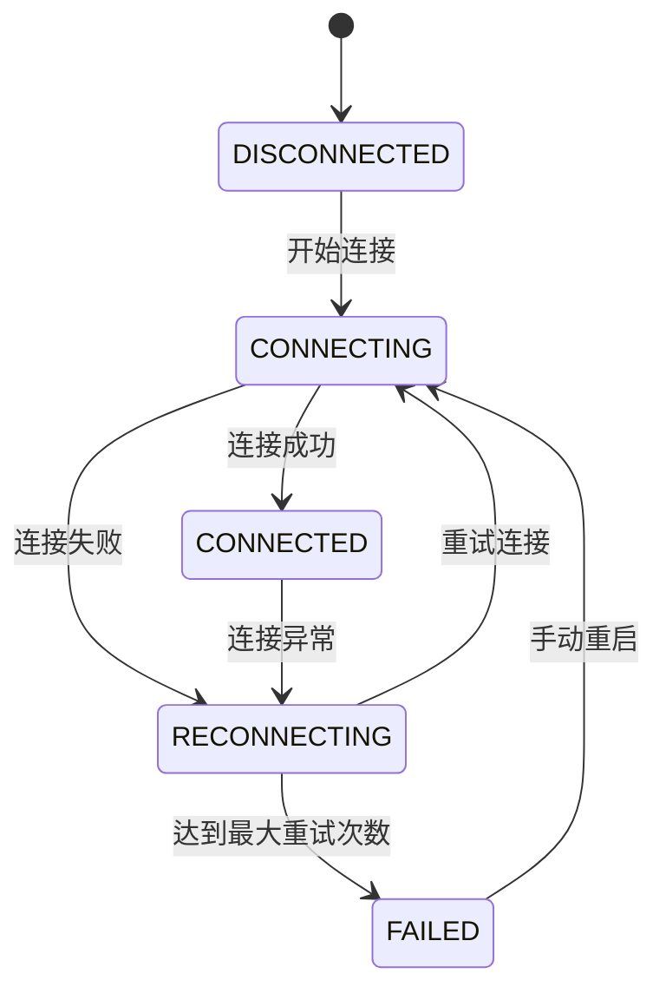
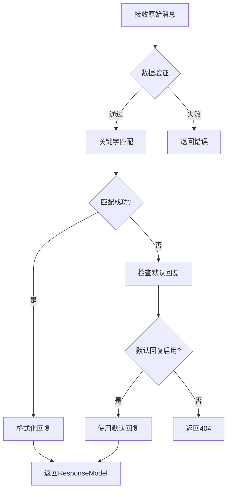
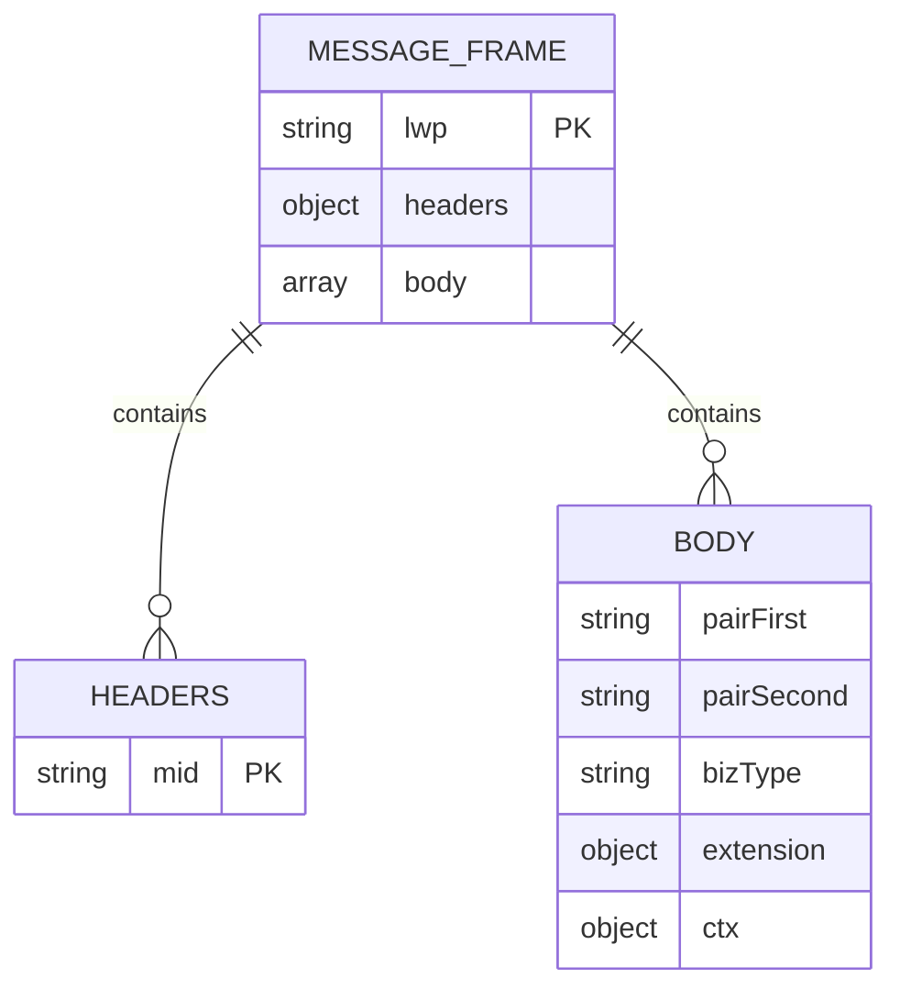
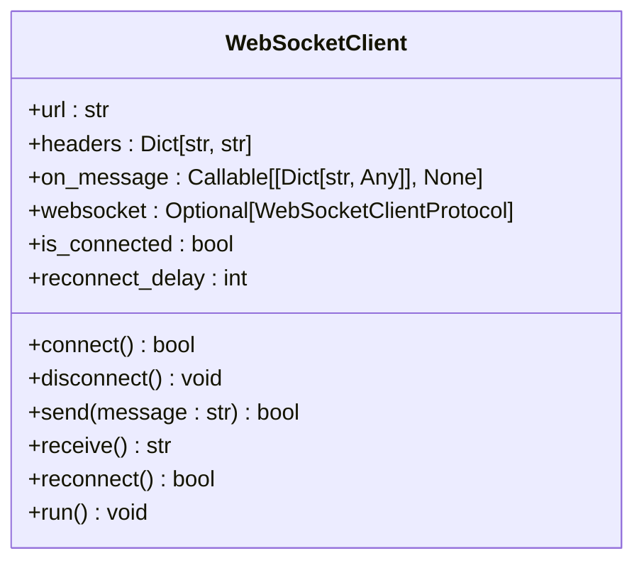
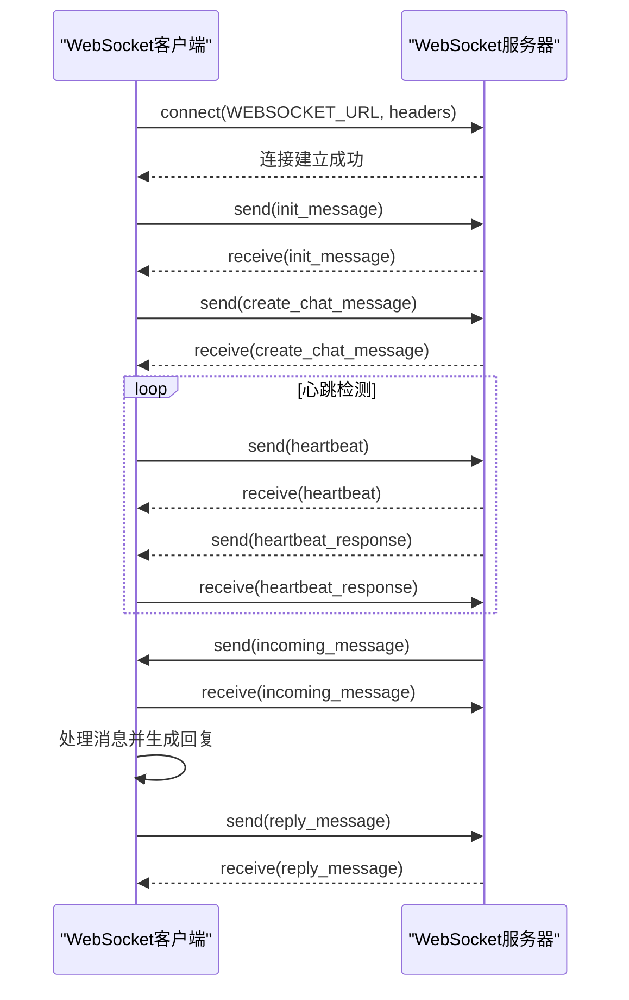
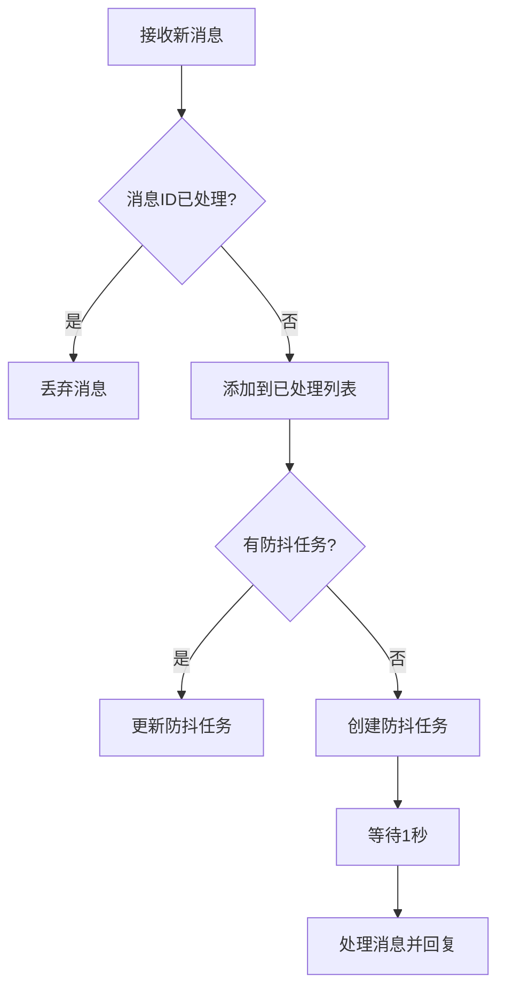

# WebSocket通信

<cite>
**本文档引用的文件**
- [reply_server.py](file://reply_server.py)
- [XianyuAutoAsync.py](file://XianyuAutoAsync.py)
- [utils/ws_utils.py](file://utils/ws_utils.py)
- [ai_reply_engine.py](file://ai_reply_engine.py)
</cite>

## 目录
1. [WebSocket通信机制概述](#websocket通信机制概述)
2. [WebSocket连接生命周期管理](#websocket连接生命周期管理)
3. [消息接收与处理流程](#消息接收与处理流程)
4. [WebSocket客户端交互协议](#websocket客户端交互协议)
5. [ws_utils.py工具模块分析](#ws_utilspy工具模块分析)
6. [WebSocket客户端连接示例](#websocket客户端连接示例)
7. [性能优化措施](#性能优化措施)

## WebSocket通信机制概述

闲鱼自动回复系统通过WebSocket协议实现与闲鱼平台的实时通信。系统采用FastAPI框架作为WebSocket服务器，XianyuAutoAsync.py作为WebSocket客户端，构建了完整的双向通信机制。WebSocket通信主要用于接收闲鱼平台的原始消息、发送自动回复以及处理各种平台事件。

系统通过`@app.post("/xianyu/reply")`端点接收来自闲鱼平台的消息，该端点使用`RequestModel`进行数据验证，确保接收到的消息包含所有必需字段。消息处理完成后，通过`ResponseModel`格式化回复并返回给客户端。

WebSocket通信的核心组件包括：
- **reply_server.py**: WebSocket服务器端，处理消息接收和回复
- **XianyuAutoAsync.py**: WebSocket客户端，负责建立连接和发送消息
- **ws_utils.py**: WebSocket工具模块，提供连接管理功能

**Section sources**
- [reply_server.py](file://reply_server.py#L288-L307)
- [XianyuAutoAsync.py](file://XianyuAutoAsync.py#L29-L37)

## WebSocket连接生命周期管理

WebSocket连接的生命周期由`ConnectionState`枚举类定义，包含五种状态：未连接(DISCONNECTED)、连接中(CONNECTING)、已连接(CONNECTED)、重连中(RECONNECTING)和连接失败(FAILED)。系统通过`_set_connection_state`方法管理连接状态的转换，并记录状态变化日志。

连接建立过程如下：
1. 客户端通过`_create_websocket_connection`方法创建WebSocket连接
2. 连接成功后，设置连接状态为CONNECTING
3. 执行初始化操作，包括发送初始化消息和创建聊天会话
4. 初始化完成后，设置连接状态为CONNECTED

当连接异常断开时，系统会自动进入重连流程：
1. 检测到连接异常，设置连接状态为RECONNECTING
2. 根据错误类型和失败次数计算重试延迟
3. 等待指定时间后尝试重新连接
4. 重试次数达到最大限制后，标记为连接失败



**Diagram sources**
- [XianyuAutoAsync.py](file://XianyuAutoAsync.py#L29-L37)
- [XianyuAutoAsync.py](file://XianyuAutoAsync.py#L7641-L7658)

**Section sources**
- [XianyuAutoAsync.py](file://XianyuAutoAsync.py#L29-L37)
- [XianyuAutoAsync.py](file://XianyuAutoAsync.py#L7641-L7658)

## 消息接收与处理流程

消息接收与处理流程是WebSocket通信的核心，系统通过`xianyu_reply`端点处理来自闲鱼平台的原始消息。流程包括数据验证、关键字匹配和回复生成三个主要步骤。

首先，系统使用`RequestModel`对收到的消息进行数据验证，确保包含所有必需字段：
- cookie_id: 账号标识
- msg_time: 消息时间
- user_url: 用户URL
- send_user_id: 发送用户ID
- send_user_name: 发送用户名
- item_id: 商品ID
- send_message: 发送消息
- chat_id: 聊天ID



**Diagram sources**
- [reply_server.py](file://reply_server.py#L288-L307)
- [reply_server.py](file://reply_server.py#L1048-L1090)

**Section sources**
- [reply_server.py](file://reply_server.py#L288-L307)
- [reply_server.py](file://reply_server.py#L1048-L1090)

验证通过后，系统调用`match_reply`函数进行关键字匹配。该函数首先检查账号是否启用，然后依次检查账号级关键字和全局关键字。如果找到匹配的关键字，则返回对应的回复模板。

如果未找到关键字匹配，系统会检查是否设置了默认回复。如果启用了默认回复且未超过回复次数限制，则使用默认回复内容。回复内容支持占位符格式化，如`{send_user_name}`和`{send_message}`。

最后，系统通过`ResponseModel`格式化回复并返回。`ResponseModel`包含`code`和`data`两个字段，其中`data`包含实际的回复消息。

## WebSocket客户端交互协议

WebSocket客户端与服务器的交互遵循特定的协议规范，包括消息帧格式、心跳机制和错误重连策略。

### 消息帧格式

消息帧采用JSON格式，包含以下字段：
- `lwp`: 消息类型标识
- `headers`: 消息头，包含`mid`等信息
- `body`: 消息体，包含实际内容



**Diagram sources**
- [XianyuAutoAsync.py](file://XianyuAutoAsync.py#L5075-L5095)

### 心跳机制

系统实现了完善的心跳机制，确保连接的稳定性：
- 心跳间隔：由`HEARTBEAT_INTERVAL`配置，通常为30秒
- 心跳超时：由`HEARTBEAT_TIMEOUT`配置，通常为60秒
- 心跳任务：通过`heartbeat_loop`方法实现，定期发送心跳消息

心跳机制的实现代码位于`XianyuAutoAsync.py`文件中，通过`asyncio`库实现异步心跳循环。当连续多次心跳失败时，系统会自动断开连接并进入重连流程。

### 错误重连策略

系统实现了智能的错误重连策略，根据不同的错误类型采用不同的重试延迟：
- WebSocket意外断开：短延迟（3秒×失败次数，最大15秒）
- 网络连接问题：长延迟（10秒×失败次数，最大60秒）
- 其他未知错误：中等延迟（5秒×失败次数，最大30秒）

重连策略通过`_calculate_retry_delay`方法实现，确保在不同网络环境下都能有效恢复连接。

**Section sources**
- [XianyuAutoAsync.py](file://XianyuAutoAsync.py#L5235-L5255)
- [XianyuAutoAsync.py](file://XianyuAutoAsync.py#L453-L465)

## ws_utils.py工具模块分析

`ws_utils.py`模块提供了WebSocket客户端的封装，简化了WebSocket连接的管理和使用。该模块的核心是`WebSocketClient`类，提供了连接、断开、发送和接收消息的完整功能。

`WebSocketClient`类的主要方法包括：
- `connect()`: 建立WebSocket连接
- `disconnect()`: 关闭WebSocket连接
- `send()`: 发送消息
- `receive()`: 接收消息
- `reconnect()`: 重新连接
- `run()`: 运行客户端主循环



**Diagram sources**
- [utils/ws_utils.py](file://utils/ws_utils.py#L6-L89)

该模块通过`run()`方法实现了自动重连机制，确保在连接断开后能够自动恢复。当接收消息失败时，会自动断开连接并等待指定时间后重新连接。

`WebSocketClient`类还提供了错误处理机制，在连接失败、消息发送失败或接收失败时会记录错误日志，并设置`is_connected`标志为`False`，确保后续操作能够正确处理连接状态。

**Section sources**
- [utils/ws_utils.py](file://utils/ws_utils.py#L6-L89)

## WebSocket客户端连接示例

以下是WebSocket客户端连接的完整示例，包括连接URL、认证头和消息交互序列。

### 连接URL和认证

WebSocket连接URL和认证信息通过配置文件加载：
```python
from config import (
    WEBSOCKET_URL, WEBSOCKET_HEADERS
)
```

连接时需要在请求头中包含Authorization认证：
```
Authorization: Bearer <token>
Cookie: <cookie_string>
```

### 消息交互序列图



**Diagram sources**
- [XianyuAutoAsync.py](file://XianyuAutoAsync.py#L7646-L7657)
- [XianyuAutoAsync.py](file://XianyuAutoAsync.py#L5235-L5243)

### 连接代码示例

```python
# 创建WebSocket客户端实例
client = WebSocketClient(
    url=WEBSOCKET_URL,
    headers=WEBSOCKET_HEADERS,
    on_message=handle_message
)

# 运行客户端
await client.run()
```

**Section sources**
- [XianyuAutoAsync.py](file://XianyuAutoAsync.py#L7638-L7647)
- [utils/ws_utils.py](file://utils/ws_utils.py#L7-L89)

## 性能优化措施

系统实现了多项性能优化措施，确保在高并发场景下的稳定性和响应速度。

### 异步消息处理

系统采用异步编程模型，通过`asyncio`库实现非阻塞I/O操作。消息处理任务通过`_create_tracked_task`方法创建，确保不会阻塞主线程。同时，系统使用信号量控制并发消息处理任务的数量，防止内存泄漏：

```python
self.message_semaphore = asyncio.Semaphore(100)  # 最多100个并发消息处理任务
```

### 并发连接限制

系统通过`concurrency_manager`管理并发连接数量，防止过多的并发连接导致资源耗尽。每个账号的连接都注册到并发管理器中，确保系统资源的合理分配。

### 消息队列缓冲

系统实现了消息去重和防抖机制，防止同一条消息被重复处理或用户连续发送消息导致的频繁回复：
- 消息去重：通过`processed_message_ids`字典记录已处理的消息ID，防止重复处理
- 消息防抖：通过`message_debounce_tasks`管理防抖任务，用户停止发送消息1秒后才回复



**Diagram sources**
- [XianyuAutoAsync.py](file://XianyuAutoAsync.py#L725-L740)

此外，系统还实现了定期清理过期记录的机制，包括过期的通知记录、发货记录和确认记录，防止内存泄漏。

**Section sources**
- [XianyuAutoAsync.py](file://XianyuAutoAsync.py#L725-L740)
- [XianyuAutoAsync.py](file://XianyuAutoAsync.py#L467-L495)