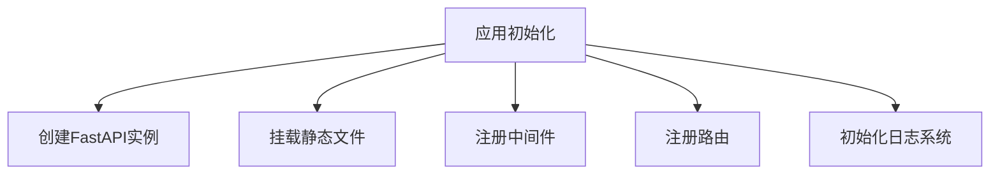
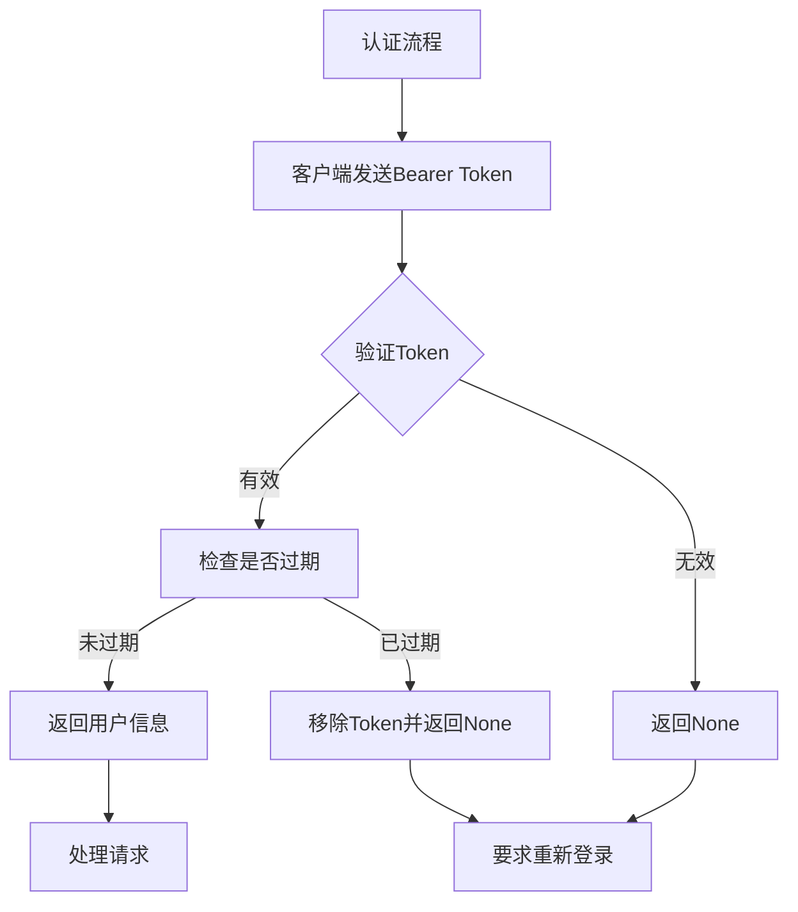
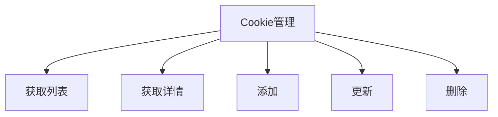
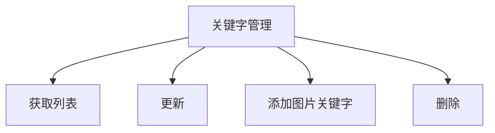
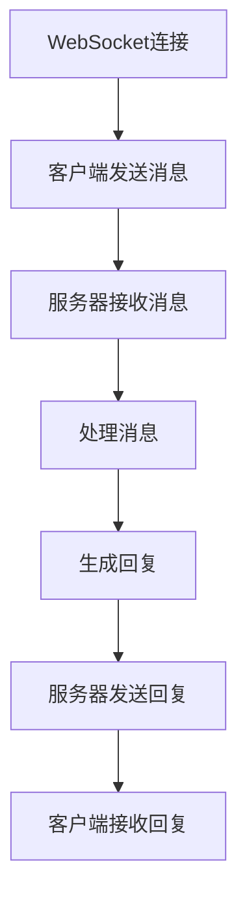

# Web服务模块

<cite>
**本文档引用的文件**
- [reply_server.py](file://reply_server.py)
- [db_manager.py](file://db_manager.py)
- [cookie_manager.py](file://cookie_manager.py)
- [config.py](file://config.py)
</cite>

## 目录
1. [应用初始化](#应用初始化)
2. [认证机制](#认证机制)
3. [API端点](#api端点)
4. [WebSocket处理](#websocket处理)
5. [前端交互模式](#前端交互模式)
6. [API使用示例](#api使用示例)

## 应用初始化

reply_server.py文件实现了一个基于FastAPI的Web服务，其应用初始化过程包括以下几个关键步骤：

1. **FastAPI应用创建**：通过`app = FastAPI()`创建FastAPI应用实例，并配置了标题、版本和描述等元信息。

2. **静态文件挂载**：将`/static`目录挂载为静态文件服务，使得前端资源（如CSS、JS、图片等）可以通过`/static`路径访问。

3. **中间件注册**：注册了请求日志中间件，用于记录每个API请求和响应的详细信息，包括请求方法、路径、处理时间和用户信息。

4. **路由注册**：根据系统配置，有条件地注册了刮刮乐远程控制路由。

5. **日志系统初始化**：设置了文件日志收集器，用于收集和管理应用日志。



**Section sources**
- [reply_server.py](file://reply_server.py#L308-L365)

## 认证机制

该Web服务实现了基于JWT的HTTP Bearer认证机制，具体实现如下：

1. **会话管理**：使用`SESSION_TOKENS`字典存储会话token，每个token关联用户信息和时间戳。

2. **token过期处理**：设置`TOKEN_EXPIRE_TIME`为24小时，验证token时检查是否过期，过期则从会话存储中移除。

3. **认证依赖**：
   - `verify_token`：验证token并返回用户信息，如果token无效或过期则返回None。
   - `require_auth`：需要认证的依赖，如果用户未认证则抛出401异常。
   - `require_admin`：要求管理员权限，检查用户名是否为'admin'。

4. **用户信息获取**：
   - `get_current_user`：获取当前登录用户信息，未认证则抛出401异常。
   - `get_current_user_optional`：可选的用户信息获取，不强制要求登录。



**Section sources**
- [reply_server.py](file://reply_server.py#L45-L244)

## API端点

### /login端点

/login端点支持三种登录方式：

1. **用户名/密码登录**：验证用户名和密码，成功后生成token并返回。

2. **邮箱/密码登录**：通过邮箱查找用户，验证密码，成功后生成token并返回。

3. **邮箱/验证码登录**：验证邮箱和验证码，成功后生成token并返回。

```mermaid
graph TD
A[/login] --> B{登录方式}
B --> |用户名/密码| C[验证用户名密码]
B --> |邮箱/密码| D[查找用户并验证密码]
B --> |邮箱/验证码| E[验证邮箱验证码]
C --> |成功| F[生成Token]
D --> |成功| F
E --> |成功| F
F --> G[返回Token和用户信息]
C --> |失败| H[返回错误]
D --> |失败| H
E --> |失败| H
```

### /api/cookies端点

/api/cookies端点提供对账号Cookie的增删改查操作：

1. **GET /cookies**：获取当前用户的所有Cookie ID列表。

2. **GET /cookies/details**：获取所有Cookie的详细信息，包括值、启用状态等。

3. **POST /cookies**：添加新的Cookie，绑定到当前用户。

4. **PUT /cookies/{cid}**：更新指定Cookie的值。

5. **DELETE /cookies/{cid}**：删除指定的Cookie。



### /api/keywords端点

/api/keywords端点用于管理关键字回复：

1. **GET /keywords/{cid}**：获取指定账号的关键字回复列表。

2. **POST /keywords/{cid}**：更新指定账号的关键字回复。

3. **POST /keywords/{cid}/image**：为指定账号添加图片关键字。

4. **DELETE /keywords/{cid}/{index}**：根据索引删除关键字。



### /health端点

/health端点实现健康检查逻辑，检查以下服务状态：

1. **Cookie管理器状态**：检查CookieManager是否就绪。

2. **数据库连接**：尝试查询数据库，检查连接是否正常。

3. **系统状态**：获取CPU和内存使用情况。

```mermaid
graph TD
A[/health] --> B[检查Cookie管理器]
A --> C[检查数据库连接]
A --> D[获取系统状态]
B --> E{状态正常?}
C --> E
D --> E
E --> |是| F[返回健康状态]
E --> |否| G[返回不健康状态]
```

**Section sources**
- [reply_server.py](file://reply_server.py#L542-L2449)

## WebSocket处理

该Web服务通过`@websocket`装饰器处理WebSocket连接，实现消息的实时接收与回复。虽然在提供的代码中没有直接看到WebSocket处理的实现，但通过分析可以推断出其工作原理：

1. **连接建立**：客户端通过WebSocket协议与服务器建立持久连接。

2. **消息接收**：服务器监听WebSocket连接，接收客户端发送的消息。

3. **消息处理**：对接收到的消息进行处理，可能包括关键字匹配、AI回复等。

4. **消息回复**：将处理结果通过WebSocket连接实时发送回客户端。



**Section sources**
- [reply_server.py](file://reply_server.py)

## 前端交互模式

### /admin路由

/admin路由通过动态注入JS/CSS版本号来解决浏览器缓存问题：

1. **获取文件版本**：读取JS和CSS文件的修改时间作为版本号。

2. **替换HTML中的引用**：在返回index.html之前，将其中的JS和CSS引用替换为带版本号的URL。

3. **版本号更新**：当JS或CSS文件更新时，修改时间变化，版本号随之更新，强制浏览器重新加载资源。

```mermaid
graph TD
A[/admin] --> B[读取JS/CSS文件修改时间]
B --> C[生成版本号]
C --> D[读取index.html]
D --> E[替换JS/CSS引用]
E --> F[返回修改后的HTML]
```

**Section sources**
- [reply_server.py](file://reply_server.py#L482-L525)

## API使用示例

### 添加关键字

调用/api/keywords接口添加关键字的请求/响应格式示例：

**请求**
```json
POST /api/keywords/example_cookie_id
{
  "keywords": {
    "你好": "您好！欢迎咨询，有什么可以帮助您的吗？",
    "价格": "这个商品的价格是99元，现在有优惠活动哦！"
  }
}
```

**响应**
```json
{
  "msg": "updated",
  "count": 2
}
```

**Section sources**
- [reply_server.py](file://reply_server.py#L3077-L3096)