# 认证机制

<cite>
**本文档中引用的文件**
- [reply_server.py](file://reply_server.py)
- [db_manager.py](file://db_manager.py)
- [config.py](file://config.py)
- [static/login.html](file://static/login.html)
- [static/js/app.js](file://static/js/app.js)
- [utils/qr_login.py](file://utils/qr_login.py)
</cite>

## 目录
1. [简介](#简介)
2. [项目结构概览](#项目结构概览)
3. [核心组件](#核心组件)
4. [架构概览](#架构概览)
5. [详细组件分析](#详细组件分析)
6. [依赖关系分析](#依赖关系分析)
7. [性能考虑](#性能考虑)
8. [故障排除指南](#故障排除指南)
9. [结论](#结论)

## 简介

本文档详细描述了基于FastAPI框架构建的闲鱼自动回复系统的认证机制。该系统采用HTTP Bearer Token认证方式，实现了多种登录方式（用户名/密码、邮箱/密码、邮箱/验证码），并提供了完整的会话管理和安全防护机制。

## 项目结构概览

系统认证模块主要分布在以下几个关键文件中：


**图表来源**
- [reply_server.py](file://reply_server.py#L1-L50)
- [db_manager.py](file://db_manager.py#L1-L50)
- [config.py](file://config.py#L1-L50)

**章节来源**
- [reply_server.py](file://reply_server.py#L1-L100)
- [db_manager.py](file://db_manager.py#L1-L100)

## 核心组件

### 安全配置初始化

系统使用FastAPI的HTTPBearer安全机制进行认证初始化：

```python
# HTTP Bearer认证
security = HTTPBearer(auto_error=False)
```

### 会话存储机制

系统维护一个内存中的会话令牌存储：

```python
# 会话令牌存储
SESSION_TOKENS = {}  # 存储会话token: {token: {'user_id': int, 'username': str, 'timestamp': float}}

# Token过期时间配置
TOKEN_EXPIRE_TIME = 24 * 60 * 60  # 24小时
```

### 认证模型定义

系统定义了多个Pydantic模型来处理认证相关的数据传输：

```python
class LoginRequest(BaseModel):
    username: Optional[str] = None
    password: Optional[str] = None
    email: Optional[str] = None
    verification_code: Optional[str] = None

class LoginResponse(BaseModel):
    success: bool
    token: Optional[str] = None
    message: str
    user_id: Optional[int] = None
    username: Optional[str] = None
    is_admin: Optional[bool] = None
```

**章节来源**
- [reply_server.py](file://reply_server.py#L48-L60)
- [reply_server.py](file://reply_server.py#L112-L127)

## 架构概览

系统采用分层架构设计，包含表示层、业务逻辑层和数据访问层：


**图表来源**
- [reply_server.py](file://reply_server.py#L542-L659)
- [reply_server.py](file://reply_server.py#L183-L220)

## 详细组件分析

### JWT Bearer认证流程

#### security = HTTPBearer() 初始化

系统使用FastAPI的内置HTTPBearer安全机制：


**图表来源**
- [reply_server.py](file://reply_server.py#L48-L49)
- [reply_server.py](file://reply_server.py#L183-L220)

#### verify_token() 函数实现

token验证函数负责检查令牌的有效性和过期状态：


**图表来源**
- [reply_server.py](file://reply_server.py#L183-L199)

#### 会话存储机制

SESSION_TOKENS是一个内存字典，存储活跃的认证令牌：

```python
SESSION_TOKENS = {
    'generated_token': {
        'user_id': 1,
        'username': 'admin',
        'timestamp': 1640995200.0
    }
}
```

#### TOKEN_EXPIRE_TIME 过期策略

系统采用基于时间戳的过期检查机制：

```python
# 检查token是否过期
if time.time() - token_data['timestamp'] > TOKEN_EXPIRE_TIME:
    del SESSION_TOKENS[token]
    return None
```

**章节来源**
- [reply_server.py](file://reply_server.py#L183-L199)

### 依赖函数实现

#### require_auth 依赖函数

require_auth函数确保请求必须经过身份验证：


**图表来源**
- [reply_server.py](file://reply_server.py#L215-L219)

#### require_admin 依赖函数

管理员权限验证函数：


**图表来源**
- [reply_server.py](file://reply_server.py#L239-L243)

**章节来源**
- [reply_server.py](file://reply_server.py#L215-L243)

### 登录方式实现

#### 用户名/密码登录

系统支持传统的用户名密码认证：


**图表来源**
- [reply_server.py](file://reply_server.py#L547-L578)

#### 邮箱/密码登录

邮箱认证方式的实现流程：


**图表来源**
- [reply_server.py](file://reply_server.py#L584-L613)

#### 邮箱/验证码登录

验证码登录提供了更高的安全性：


**图表来源**
- [reply_server.py](file://reply_server.py#L615-L653)

**章节来源**
- [reply_server.py](file://reply_server.py#L547-L653)

### token生成与登出机制

#### generate_token() 函数

系统使用secrets模块生成安全的随机token：

```python
def generate_token() -> str:
    """生成随机token"""
    return secrets.token_urlsafe(32)
```

#### logout() 函数实现

登出操作简单地从会话存储中删除token：

```python
@app.post('/logout')
async def logout(credentials: Optional[HTTPAuthorizationCredentials] = Depends(security)):
    if credentials and credentials.credentials in SESSION_TOKENS:
        del SESSION_TOKENS[credentials.credentials]
    return {"message": "已登出"}
```

**章节来源**
- [reply_server.py](file://reply_server.py#L178-L181)
- [reply_server.py](file://reply_server.py#L676-L680)

### 数据库交互分析

#### verify_user_password() 方法

数据库密码验证的核心实现：


**图表来源**
- [db_manager.py](file://db_manager.py#L2502-L2509)

#### 验证码系统

系统实现了完整的验证码验证机制：


**图表来源**
- [db_manager.py](file://db_manager.py#L2540-L2655)
- [db_manager.py](file://db_manager.py#L2657-L2705)

**章节来源**
- [db_manager.py](file://db_manager.py#L2502-L2509)
- [db_manager.py](file://db_manager.py#L2540-L2705)

## 依赖关系分析

系统认证模块的依赖关系图：

```mermaid
graph TD
A[FastAPI应用] --> B[认证依赖函数]
B --> C[verify_token]
B --> D[require_auth]
B --> E[require_admin]
C --> F[SESSION_TOKENS]
D --> C
E --> D
A --> G[登录处理器]
G --> H[LoginRequest]
G --> I[LoginResponse]
G --> J[db_manager]
J --> K[verify_user_password]
J --> L[verify_email_code]
J --> M[generate_captcha]
N[前端] --> O[登录页面]
O --> P[app.js]
P --> A
```



**图表来源**
- [reply_server.py](file://reply_server.py#L1-L50)
- [db_manager.py](file://db_manager.py#L1-L50)

**章节来源**
- [reply_server.py](file://reply_server.py#L1-L100)
- [db_manager.py](file://db_manager.py#L1-L100)

## 性能考虑

### 会话存储优化

- **内存存储**：SESSION_TOKENS使用内存字典存储，提供快速的查找性能
- **自动过期清理**：通过时间戳检查实现自动过期清理
- **并发安全**：使用FastAPI的依赖注入机制确保线程安全

### 数据库查询优化

- **索引利用**：数据库表设计包含适当的索引
- **连接池**：使用SQLite连接池提高并发性能
- **事务管理**：合理使用事务确保数据一致性

### 缓存策略

- **验证码缓存**：图形验证码和邮箱验证码使用数据库缓存
- **用户信息缓存**：用户基本信息在内存中缓存

## 故障排除指南

### 常见认证问题

#### Token验证失败

**症状**：客户端收到401 Unauthorized响应
**原因**：
- Token已过期
- Token不存在于SESSION_TOKENS中
- 请求头格式不正确

**解决方案**：
1. 检查请求头格式：`Authorization: Bearer <token>`
2. 验证Token是否在有效期内
3. 确认Token是否正确存储

#### 登录失败

**症状**：登录请求返回失败响应
**原因**：
- 用户名/密码错误
- 邮箱验证码错误
- 用户账户被禁用

**解决方案**：
1. 检查输入的凭据是否正确
2. 验证验证码的有效性
3. 确认用户账户状态

#### 验证码问题

**症状**：验证码生成或验证失败
**原因**：
- 图像生成库缺失
- 数据库连接问题
- 验证码过期

**解决方案**：
1. 确保PIL库已安装
2. 检查数据库连接
3. 重新生成验证码

**章节来源**
- [reply_server.py](file://reply_server.py#L183-L199)
- [db_manager.py](file://db_manager.py#L2540-L2705)

## 结论

该认证系统提供了完整的HTTP Bearer Token认证解决方案，具有以下特点：

### 安全特性
- 基于标准的Bearer Token认证
- 多种登录方式支持
- 图形验证码防护
- 密码哈希存储
- 自动过期清理

### 功能特性
- 管理员权限分离
- 前后端分离架构
- RESTful API设计
- 完整的错误处理

### 性能特性
- 内存存储提升性能
- 并发安全保证
- 自动资源清理

该系统为闲鱼自动回复平台提供了可靠的身份认证保障，同时保持了良好的扩展性和维护性。