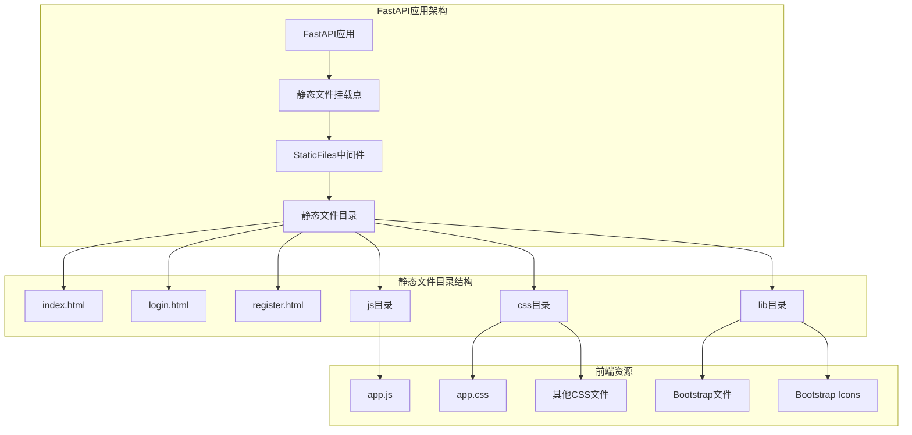
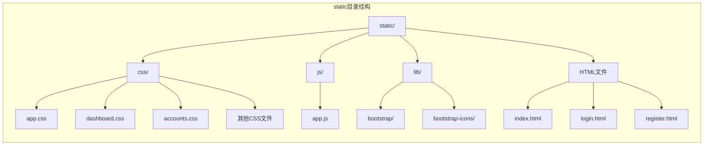
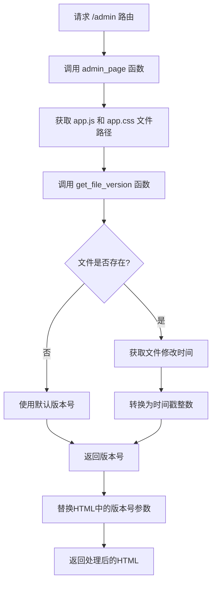
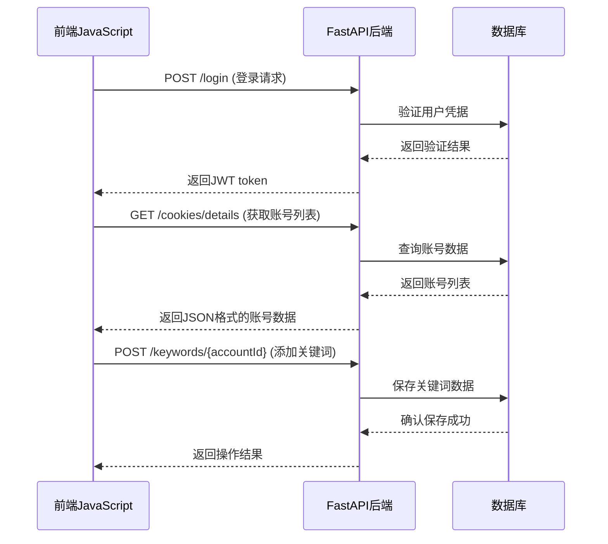

# 静态文件与前端集成

<cite>
**本文档引用的文件**
- [reply_server.py](file://reply_server.py)
- [static/index.html](file://static/index.html)
- [static/login.html](file://static/login.html)
- [static/register.html](file://static/register.html)
- [static/js/app.js](file://static/js/app.js)
- [static/css/app.css](file://static/css/app.css)
- [static/xianyu_js_version_2.js](file://static/xianyu_js_version_2.js)
</cite>

## 目录
1. [项目概述](#项目概述)
2. [静态文件服务架构](#静态文件服务架构)
3. [前端资源目录结构](#前端资源目录结构)
4. [版本控制与缓存机制](#版本控制与缓存机制)
5. [路由映射与页面加载](#路由映射与页面加载)
6. [前端JavaScript通信机制](#前端javascript通信机制)
7. [最佳实践建议](#最佳实践建议)
8. [总结](#总结)

## 项目概述

闲鱼自动回复管理系统采用FastAPI作为后端框架，提供了完整的静态文件服务和前端集成功能。该项目通过精心设计的静态文件服务架构，实现了高效的前端资源管理和版本控制，确保用户能够及时获取最新的前端更新。

## 静态文件服务架构

### FastAPI静态文件挂载

系统通过FastAPI的`StaticFiles`组件提供静态文件服务，这是整个前端集成的核心基础设施。



**图表来源**
- [reply_server.py](file://reply_server.py#L364-L366)

### 静态文件服务配置

静态文件服务通过以下代码配置：

```python
# 静态文件目录路径
static_dir = os.path.join(os.path.dirname(__file__), 'static')
if not os.path.exists(static_dir):
    os.makedirs(static_dir, exist_ok=True)

# 挂载静态文件服务
app.mount('/static', StaticFiles(directory=static_dir), name='static')
```

这种配置确保了：
- 静态文件可以通过`/static/`路径访问
- 支持CSS、JavaScript、HTML等多种前端资源类型
- 自动处理文件扩展名和MIME类型

**章节来源**
- [reply_server.py](file://reply_server.py#L360-L366)

## 前端资源目录结构

### 核心文件组织

项目的前端资源采用模块化的目录结构，便于维护和扩展：



**图表来源**
- [static/index.html](file://static/index.html#L1-L10)
- [static/css/app.css](file://static/css/app.css#L1-L14)

### CSS文件组织策略

主CSS文件采用模块化导入策略，便于维护：

```css
/* 主CSS文件结构 */
@import url('variables.css');    /* 变量定义 */
@import url('layout.css');       /* 布局样式 */
@import url('dashboard.css');    /* 仪表盘样式 */
@import url('accounts.css');     /* 账号管理样式 */
@import url('items.css');        /* 商品管理样式 */
@import url('keywords.css');     /* 关键词管理样式 */
@import url('notifications.css');/* 通知样式 */
@import url('components.css');   /* 组件样式 */
@import url('admin.css');        /* 管理界面样式 */
```

**章节来源**
- [static/css/app.css](file://static/css/app.css#L1-L14)

## 版本控制与缓存机制

### 动态版本注入机制

系统实现了智能的版本控制机制，通过文件修改时间动态注入版本号，解决浏览器缓存问题。



**图表来源**
- [reply_server.py](file://reply_server.py#L488-L524)

### 版本号生成算法

版本号基于文件修改时间生成：

```python
def get_file_version(file_path, default='1.0.0'):
    """获取文件的版本号（基于修改时间）"""
    if os.path.exists(file_path):
        try:
            mtime = os.path.getmtime(file_path)
            return str(int(mtime))  # 使用Unix时间戳作为版本号
        except Exception as e:
            logger.warning(f"获取文件 {file_path} 修改时间失败: {e}")
    return default
```

### 版本号注入流程

系统通过正则表达式精确替换HTML中的版本号参数：

```python
# 替换 app.js 的版本号参数
js_pattern = r'/static/js/app\.js\?v=[^"\'\s>]+'
js_new_url = f'/static/js/app.js?v={js_version}'
html_content = re.sub(js_pattern, js_new_url, html_content)

# 为 app.css 添加或更新版本号参数
css_pattern = r'/static/css/app\.css(\?v=[^"\'\s>]+)?'
css_new_url = f'/static/css/app.css?v={css_version}'
html_content = re.sub(css_pattern, css_new_url, html_content)
```

**章节来源**
- [reply_server.py](file://reply_server.py#L489-L520)

## 路由映射与页面加载

### 主要路由配置

系统定义了多个关键路由，每个路由负责特定的功能页面：

```mermaid
graph TB
subgraph "路由映射"
A[根路径 /] --> B[登录页面]
C[/login.html] --> D[登录页面]
E[/register.html] --> F[注册页面]
G[/admin] --> H[管理页面]
I[/static/*] --> J[静态文件服务]
end
subgraph "页面功能"
B --> K[用户认证]
D --> K
F --> L[用户注册]
H --> M[系统管理]
J --> N[前端资源]
end
```

**图表来源**
- [reply_server.py](file://reply_server.py#L421-L480)

### 管理页面加载机制

管理页面（/admin）是最复杂的路由，它不仅提供静态文件服务，还实现了智能的版本控制：

```python
@app.get('/admin', response_class=HTMLResponse)
async def admin_page():
    index_path = os.path.join(static_dir, 'index.html')
    if not os.path.exists(index_path):
        return HTMLResponse('<h3>No front-end found</h3>')
    
    # 获取静态文件的修改时间作为版本号
    def get_file_version(file_path, default='1.0.0'):
        if os.path.exists(file_path):
            try:
                mtime = os.path.getmtime(file_path)
                return str(int(mtime))
            except Exception as e:
                logger.warning(f"获取文件 {file_path} 修改时间失败: {e}")
        return default
    
    app_js_path = os.path.join(static_dir, 'js', 'app.js')
    app_css_path = os.path.join(static_dir, 'css', 'app.css')
    
    js_version = get_file_version(app_js_path, '2.2.0')
    css_version = get_file_version(app_css_path, '1.0.0')
    
    try:
        with open(index_path, 'r', encoding='utf-8') as f:
            html_content = f.read()
            
            # 替换 app.js 的版本号参数
            js_pattern = r'/static/js/app\.js\?v=[^"\'\s>]+'
            js_new_url = f'/static/js/app.js?v={js_version}'
            if re.search(js_pattern, html_content):
                html_content = re.sub(js_pattern, js_new_url, html_content)
                logger.debug(f"已替换 app.js 版本号: {js_version}")
            
            # 为 app.css 添加或更新版本号参数
            css_pattern = r'/static/css/app\.css(\?v=[^"\'\s>]+)?'
            css_new_url = f'/static/css/app.css?v={css_version}'
            html_content = re.sub(css_pattern, css_new_url, html_content)
            
            return HTMLResponse(html_content)
    except Exception as e:
        logger.error(f"读取或处理 index.html 失败: {e}")
        return HTMLResponse('<h3>Error loading page</h3>')
```

**章节来源**
- [reply_server.py](file://reply_server.py#L481-L524)

### HTML模板加载机制

系统采用模板加载机制，支持动态内容注入：

```python
# 登录页面路由
@app.get('/login.html', response_class=HTMLResponse)
async def login_page():
    login_path = os.path.join(static_dir, 'login.html')
    if os.path.exists(login_path):
        with open(login_path, 'r', encoding='utf-8') as f:
            return HTMLResponse(f.read())
    else:
        return HTMLResponse('<h3>Login page not found</h3>')
```

**章节来源**
- [reply_server.py](file://reply_server.py#L432-L441)

## 前端JavaScript通信机制

### RESTful API通信

前端JavaScript通过Fetch API与后端进行通信，实现数据的增删改查操作：



**图表来源**
- [static/js/app.js](file://static/js/app.js#L1-L100)

### WebSocket通信机制

系统支持WebSocket通信，实现实时数据交互：

```javascript
// WebSocket连接示例
const ws = new WebSocket(`ws://${window.location.host}/api/captcha/ws/${sessionId}`);

ws.onopen = () => {
    console.log('WebSocket连接成功');
};

ws.onmessage = async (event) => {
    const data = JSON.parse(event.data);
    handleWebSocketMessage(data);
};
```

**章节来源**
- [captcha_control.html](file://captcha_control.html#L380-L410)

### 前端资源加载策略

前端JavaScript采用模块化加载策略：

```javascript
// 全局变量和配置
const apiBase = location.origin;
let authToken = localStorage.getItem('auth_token');

// 页面切换功能
function showSection(sectionName) {
    // 隐藏所有内容区域
    document.querySelectorAll('.content-section').forEach(section => {
        section.classList.remove('active');
    });
    
    // 显示选中的内容区域
    const targetSection = document.getElementById(sectionName + '-section');
    if (targetSection) {
        targetSection.classList.add('active');
    }
    
    // 根据不同section加载对应数据
    switch(sectionName) {
        case 'dashboard':
            loadDashboard();
            break;
        case 'accounts':
            loadCookies();
            break;
        // ... 其他case
    }
}
```

**章节来源**
- [static/js/app.js](file://static/js/app.js#L39-L133)

## 最佳实践建议

### 静态文件组织最佳实践

1. **模块化CSS文件**
   - 将样式按功能模块分离
   - 使用主入口文件统一导入
   - 保持文件命名的一致性

2. **版本控制策略**
   - 基于文件修改时间生成版本号
   - 使用正则表达式精确替换
   - 提供合理的默认版本号

3. **路由设计原则**
   - 明确区分静态资源和动态路由
   - 实现适当的错误处理
   - 提供清晰的路由映射关系

### 前端集成最佳实践

1. **API通信规范**
   - 统一使用Fetch API
   - 实现标准的错误处理
   - 使用Promise链式调用

2. **状态管理**
   - 使用localStorage存储认证信息
   - 实现全局状态管理
   - 提供状态变更通知机制

3. **用户体验优化**
   - 实现加载状态指示
   - 提供友好的错误提示
   - 支持离线功能

### 安全性考虑

1. **认证机制**
   - 使用JWT token进行身份验证
   - 实现token过期机制
   - 提供安全的登录流程

2. **数据保护**
   - 对敏感数据进行加密传输
   - 实现适当的访问控制
   - 记录重要的操作日志

## 总结

闲鱼自动回复管理系统的静态文件服务和前端集成功能展现了现代Web应用开发的最佳实践。通过FastAPI的静态文件服务、智能的版本控制机制、以及完善的前端通信架构，系统实现了高效、可靠的前后端集成。

主要特点包括：

1. **高效的静态文件服务**：通过FastAPI的StaticFiles组件提供标准化的静态文件访问
2. **智能的版本控制**：基于文件修改时间的动态版本注入，有效解决浏览器缓存问题
3. **灵活的路由映射**：支持多种页面类型的路由配置
4. **完善的通信机制**：结合RESTful API和WebSocket，实现丰富的交互功能
5. **良好的可维护性**：模块化的文件组织和清晰的代码结构

这套解决方案为类似的Web应用开发提供了宝贵的参考价值，特别是在静态文件服务、版本控制和前后端集成方面。