# 闲鱼自动回复系统代码架构

<cite>
**本文档引用的文件**
- [Start.py](file://Start.py)
- [cookie_manager.py](file://cookie_manager.py)
- [reply_server.py](file://reply_server.py)
- [db_manager.py](file://db_manager.py)
- [config.py](file://config.py)
- [XianyuAutoAsync.py](file://XianyuAutoAsync.py)
- [utils/xianyu_utils.py](file://utils/xianyu_utils.py)
- [utils/message_utils.py](file://utils/message_utils.py)
- [utils/ws_utils.py](file://utils/ws_utils.py)
- [utils/item_search.py](file://utils/item_search.py)
</cite>

## 目录
1. [项目概述](#项目概述)
2. [整体架构](#整体架构)
3. [启动流程分析](#启动流程分析)
4. [核心组件详解](#核心组件详解)
5. [数据流分析](#数据流分析)
6. [工具模块架构](#工具模块架构)
7. [WebSocket通信机制](#websocket通信机制)
8. [数据库设计](#数据库设计)
9. [API接口设计](#api接口设计)
10. [系统集成关系](#系统集成关系)

## 项目概述

闲鱼自动回复系统是一个基于Python开发的自动化聊天机器人，能够通过WebSocket与闲鱼平台实时通信，自动回复买家消息。系统采用异步架构设计，支持多账号管理、智能关键词匹配、AI回复等功能。

### 主要特性
- **多账号管理**：支持同时管理多个闲鱼账号
- **实时通信**：基于WebSocket的双向消息通信
- **智能回复**：支持关键词匹配和AI自动回复
- **商品搜索**：基于Playwright的真实商品搜索功能
- **数据隔离**：完善的多用户数据隔离机制
- **RESTful API**：提供完整的管理接口

## 整体架构

系统采用分层架构设计，主要分为以下几个层次：

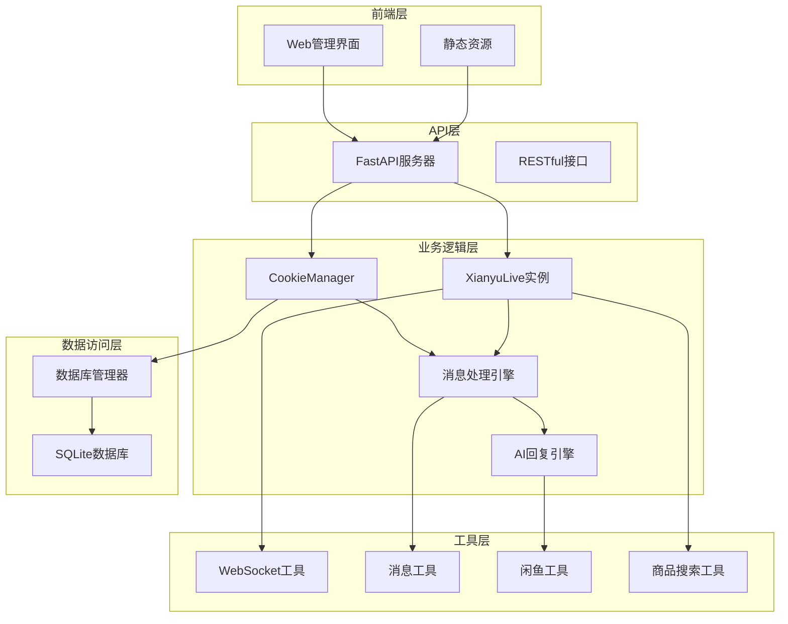

**图表来源**
- [Start.py](file://Start.py#L1-L50)
- [cookie_manager.py](file://cookie_manager.py#L1-L50)
- [reply_server.py](file://reply_server.py#L1-L50)

## 启动流程分析

系统启动遵循严格的初始化顺序，确保各个组件正确加载和配置。

### 启动序列图

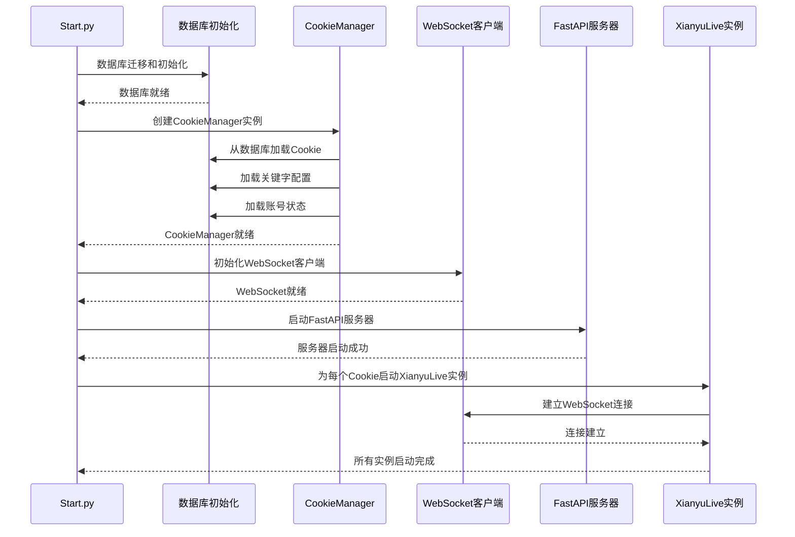

**图表来源**
- [Start.py](file://Start.py#L513-L586)
- [cookie_manager.py](file://cookie_manager.py#L13-L41)

### 启动流程详细步骤

1. **环境初始化**（[Start.py](file://Start.py#L1-L145)）
   - 设置控制台编码为UTF-8
   - 数据库文件迁移和检查
   - Playwright浏览器检查和安装

2. **数据库初始化**（[Start.py](file://Start.py#L62-L145)）
   - 检查并迁移数据库文件到data目录
   - 确保data目录存在并有正确权限
   - 迁移旧版本数据库文件

3. **CookieManager初始化**（[Start.py](file://Start.py#L523-L527)）
   - 创建CookieManager实例
   - 从数据库加载所有Cookie、关键字和状态
   - 初始化任务管理器

4. **FastAPI服务器启动**（[Start.py](file://Start.py#L573-L577)）
   - 后台线程启动Uvicorn服务器
   - 提供RESTful API接口

5. **WebSocket连接建立**（[XianyuAutoAsync.py](file://XianyuAutoAsync.py#L1-L200)）
   - 为每个Cookie创建XianyuLive实例
   - 建立与闲鱼WebSocket服务器的连接
   - 开始消息监听和处理

**章节来源**
- [Start.py](file://Start.py#L1-L602)
- [cookie_manager.py](file://cookie_manager.py#L1-L428)

## 核心组件详解

### CookieManager - 多账号管理器

CookieManager是系统的核心组件，负责管理多个闲鱼账号的生命周期。

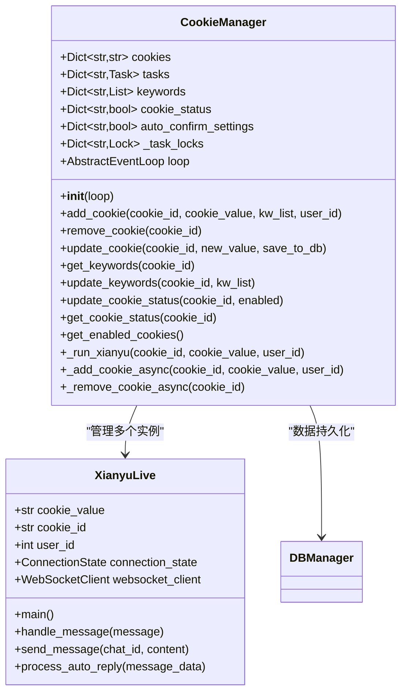

**图表来源**
- [cookie_manager.py](file://cookie_manager.py#L10-L428)
- [XianyuAutoAsync.py](file://XianyuAutoAsync.py#L158-L200)

#### 核心功能

1. **账号生命周期管理**
   - 动态添加和移除账号
   - 自动重启失效的账号任务
   - 支持账号状态的启用/禁用

2. **任务协调机制**
   - 使用异步锁防止重复创建任务
   - 支持跨线程的安全操作
   - 提供统一的任务管理接口

3. **数据持久化**
   - 与数据库的无缝集成
   - 支持增量更新和批量操作
   - 提供数据一致性保证

**章节来源**
- [cookie_manager.py](file://cookie_manager.py#L1-L428)

### XianyuLive - WebSocket客户端

XianyuLive是处理与闲鱼WebSocket通信的核心类，负责消息的接收、解析和回复。

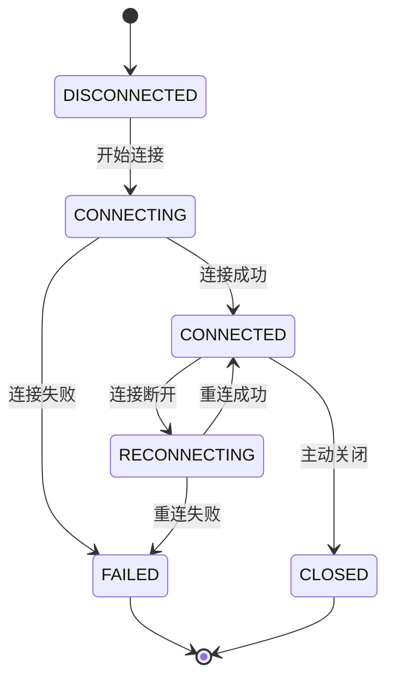

**图表来源**
- [XianyuAutoAsync.py](file://XianyuAutoAsync.py#L29-L37)

#### 核心特性

1. **连接管理**
   - 自动重连机制
   - 心跳包保活
   - 断线检测和恢复

2. **消息处理**
   - 消息解密和解析
   - 关键词匹配算法
   - AI回复生成

3. **状态监控**
   - 连接状态跟踪
   - 性能指标收集
   - 错误日志记录

**章节来源**
- [XianyuAutoAsync.py](file://XianyuAutoAsync.py#L1-L200)

### FastAPI服务器 - RESTful API

reply_server.py提供了完整的RESTful API接口，支持前端管理界面的所有功能。

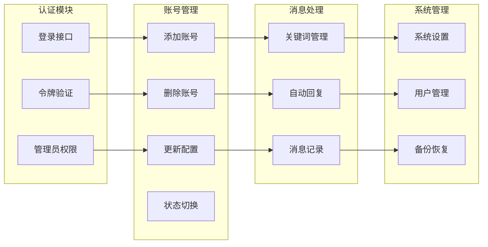

**图表来源**
- [reply_server.py](file://reply_server.py#L1-L800)

#### API功能分类

1. **用户认证**
   - JWT令牌生成和验证
   - 管理员权限控制
   - 会话管理

2. **账号管理**
   - Cookie的增删改查
   - 关键字配置
   - 自动回复设置

3. **系统监控**
   - 健康检查
   - 日志查询
   - 性能监控

**章节来源**
- [reply_server.py](file://reply_server.py#L1-L800)

## 数据流分析

系统中的数据流遵循清晰的层次结构，从WebSocket接收消息到最终回复的完整流程。

### 消息处理流程

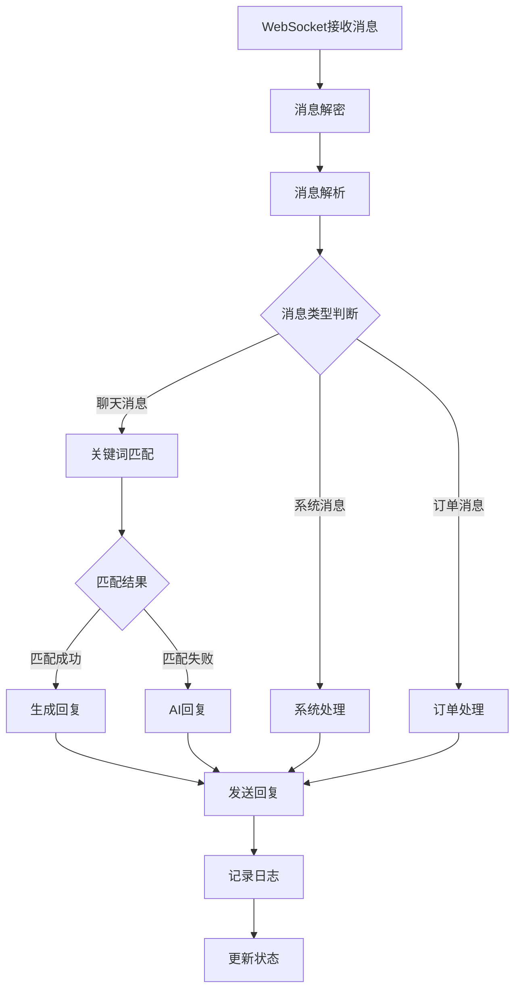

**图表来源**
- [XianyuAutoAsync.py](file://XianyuAutoAsync.py#L1-L200)
- [utils/message_utils.py](file://utils/message_utils.py#L1-L29)

### 数据流向详解

1. **消息接收阶段**
   - WebSocket客户端接收原始消息
   - 使用xianyu_utils进行解密和解析
   - 转换为标准化的消息格式

2. **消息处理阶段**
   - 检查消息类型和来源
   - 应用暂停管理器过滤
   - 执行关键词匹配算法

3. **回复生成阶段**
   - 匹配本地关键词库
   - 调用AI引擎生成回复
   - 应用模板和个性化设置

4. **消息发送阶段**
   - 格式化回复内容
   - 通过WebSocket发送
   - 记录发送状态和时间戳

**章节来源**
- [XianyuAutoAsync.py](file://XianyuAutoAsync.py#L1-L200)
- [utils/xianyu_utils.py](file://utils/xianyu_utils.py#L1-L379)
- [utils/message_utils.py](file://utils/message_utils.py#L1-L29)

## 工具模块架构

系统包含多个专用工具模块，每个模块都有明确的职责分工。

### 工具模块关系图

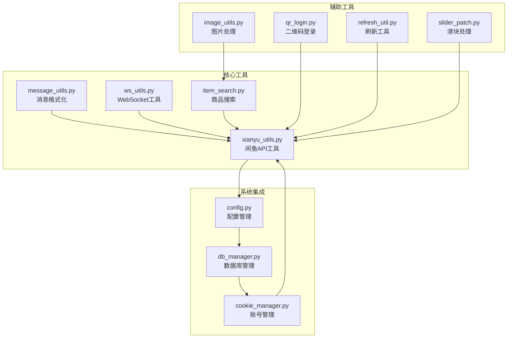

**图表来源**
- [utils/xianyu_utils.py](file://utils/xianyu_utils.py#L1-L379)
- [utils/message_utils.py](file://utils/message_utils.py#L1-L29)
- [utils/ws_utils.py](file://utils/ws_utils.py#L1-L89)
- [utils/item_search.py](file://utils/item_search.py#L1-L800)

### 核心工具模块详解

#### 1. xianyu_utils.py - 闲鱼API工具
- **加密签名生成**：实现闲鱼API的签名算法
- **消息解密**：处理WebSocket消息的加密解密
- **设备ID生成**：生成符合闲鱼规范的设备标识
- **Cookie转换**：将字符串格式的Cookie转换为字典

#### 2. message_utils.py - 消息格式化
- **消息格式化**：将消息数据转换为易读的文本格式
- **时间戳处理**：统一的时间格式化
- **方向标识**：区分发送和接收的消息

#### 3. ws_utils.py - WebSocket工具
- **连接管理**：封装WebSocket连接的建立和断开
- **自动重连**：实现指数退避的重连机制
- **消息队列**：处理消息的发送和接收队列
- **心跳保活**：定期发送心跳包维持连接

#### 4. item_search.py - 商品搜索
- **Playwright集成**：使用真实浏览器进行商品搜索
- **滑块验证处理**：自动处理各种类型的滑块验证
- **数据解析**：解析搜索结果并提取关键信息
- **缓存机制**：实现搜索结果的本地缓存

**章节来源**
- [utils/xianyu_utils.py](file://utils/xianyu_utils.py#L1-L379)
- [utils/message_utils.py](file://utils/message_utils.py#L1-L29)
- [utils/ws_utils.py](file://utils/ws_utils.py#L1-L89)
- [utils/item_search.py](file://utils/item_search.py#L1-L800)

## WebSocket通信机制

系统通过WebSocket与闲鱼平台建立实时通信连接，实现消息的双向传输。

### 通信架构

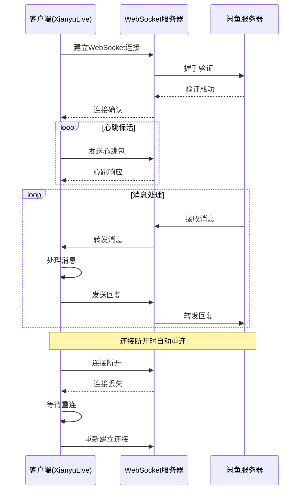

**图表来源**
- [XianyuAutoAsync.py](file://XianyuAutoAsync.py#L1-L200)
- [utils/ws_utils.py](file://utils/ws_utils.py#L1-L89)

### 通信协议

1. **连接建立**
   - 使用预定义的WebSocket URL
   - 设置必要的HTTP头部信息
   - 传递Cookie和设备标识

2. **消息格式**
   - 使用MessagePack编码
   - 包含消息ID、时间戳、内容等字段
   - 支持文本和富媒体消息

3. **状态管理**
   - 连接状态枚举
   - 自动重连机制
   - 心跳包保活

**章节来源**
- [XianyuAutoAsync.py](file://XianyuAutoAsync.py#L1-L200)
- [utils/ws_utils.py](file://utils/ws_utils.py#L1-L89)

## 数据库设计

系统采用SQLite数据库，通过db_manager.py提供统一的数据访问接口。

### 数据库架构

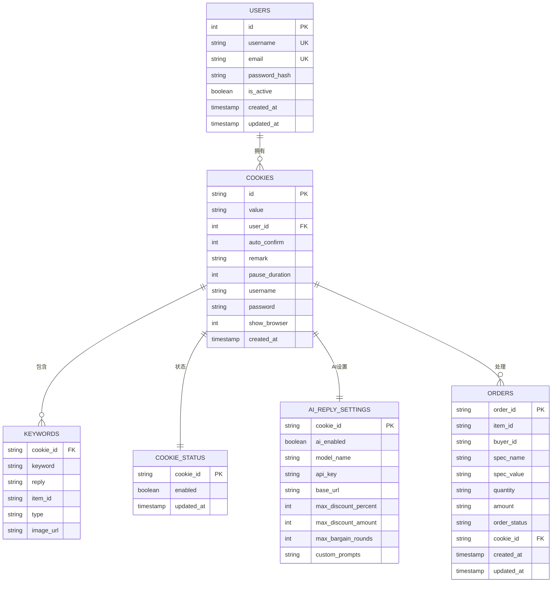

**图表来源**
- [db_manager.py](file://db_manager.py#L68-L447)

### 核心数据表设计

1. **用户表 (users)**
   - 存储系统用户信息
   - 支持多用户权限管理
   - 密码哈希存储

2. **Cookie表 (cookies)**
   - 存储闲鱼账号的登录凭据
   - 支持账号特定的配置
   - 自动确认发货设置

3. **关键词表 (keywords)**
   - 存储账号特定的回复关键词
   - 支持文本和图片回复
   - 关联商品ID

4. **订单表 (orders)**
   - 记录交易订单信息
   - 支持订单状态跟踪
   - 关联账号和商品

**章节来源**
- [db_manager.py](file://db_manager.py#L68-L447)

## API接口设计

reply_server.py提供了完整的RESTful API接口，支持前端管理界面的所有功能。

### API架构设计

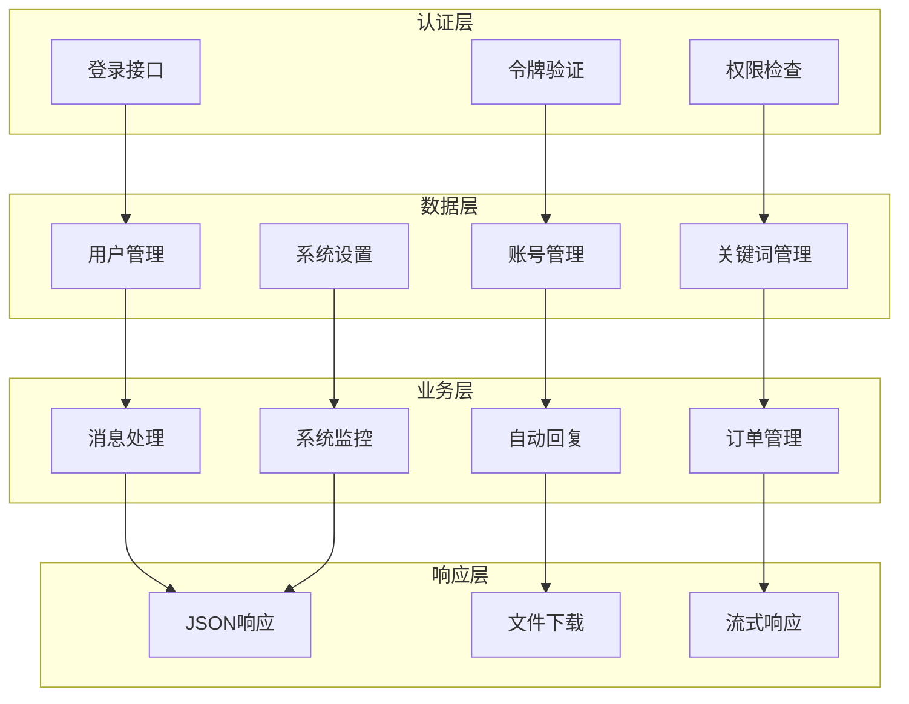

**图表来源**
- [reply_server.py](file://reply_server.py#L1-L800)

### 核心API功能

1. **用户认证接口**
   - 用户名/密码登录
   - 邮箱验证码登录
   - 管理员权限验证
   - 令牌刷新机制

2. **账号管理接口**
   - Cookie的增删改查
   - 关键字配置管理
   - 自动回复设置
   - 账号状态控制

3. **系统监控接口**
   - 健康检查
   - 日志查询
   - 性能指标
   - 系统状态

4. **文件操作接口**
   - 配置文件上传
   - 日志文件下载
   - 备份文件管理

**章节来源**
- [reply_server.py](file://reply_server.py#L1-L800)

## 系统集成关系

各组件之间通过明确定义的接口进行集成，形成完整的系统生态。

### 组件依赖关系

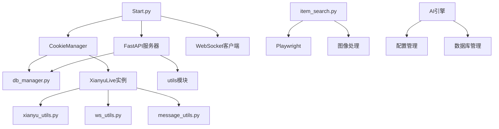

**图表来源**
- [Start.py](file://Start.py#L1-L602)
- [cookie_manager.py](file://cookie_manager.py#L1-L428)
- [reply_server.py](file://reply_server.py#L1-L800)

### 数据流集成

1. **启动集成**
   - Start.py负责整体启动顺序
   - CookieManager管理账号生命周期
   - FastAPI服务器提供API服务

2. **消息处理集成**
   - WebSocket接收消息
   - 消息工具进行格式化
   - 关键词匹配和AI回复
   - 结果通过WebSocket发送

3. **数据持久化集成**
   - 所有数据操作通过db_manager
   - 支持事务和一致性保证
   - 提供统一的查询接口

**章节来源**
- [Start.py](file://Start.py#L1-L602)
- [cookie_manager.py](file://cookie_manager.py#L1-L428)
- [reply_server.py](file://reply_server.py#L1-L800)

## 总结

闲鱼自动回复系统采用了现代化的异步架构设计，通过清晰的分层结构实现了复杂的功能需求。系统的主要优势包括：

1. **模块化设计**：每个组件职责明确，便于维护和扩展
2. **异步处理**：充分利用Python的异步特性，提高并发性能
3. **数据隔离**：完善的多用户数据隔离机制
4. **API友好**：提供完整的RESTful API接口
5. **工具丰富**：丰富的工具模块支持各种功能需求

这种架构设计使得系统具有良好的可扩展性和可维护性，能够适应不断变化的需求和挑战。