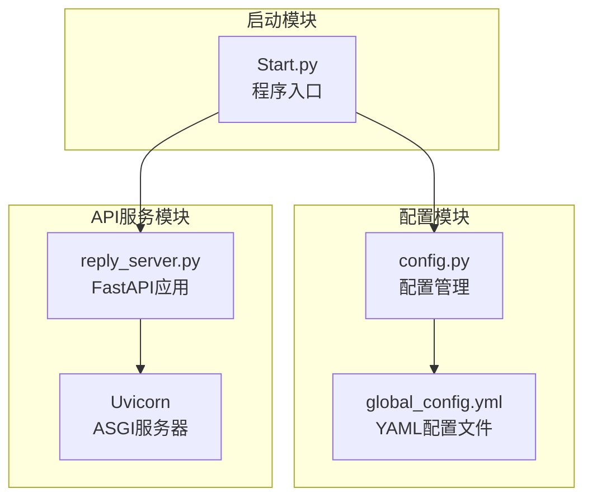
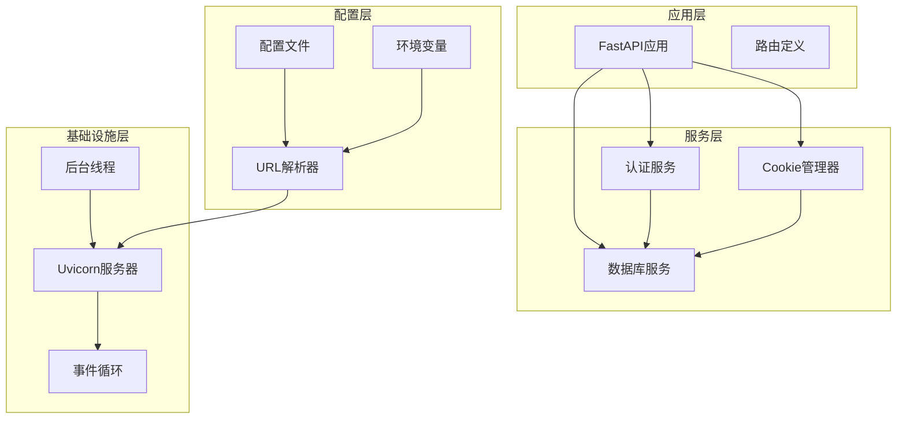
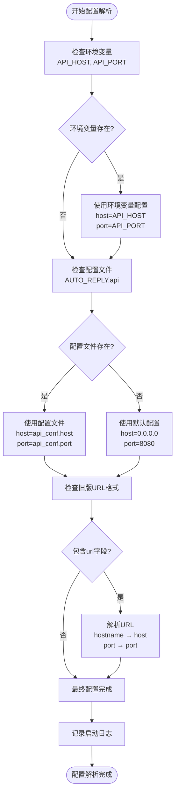
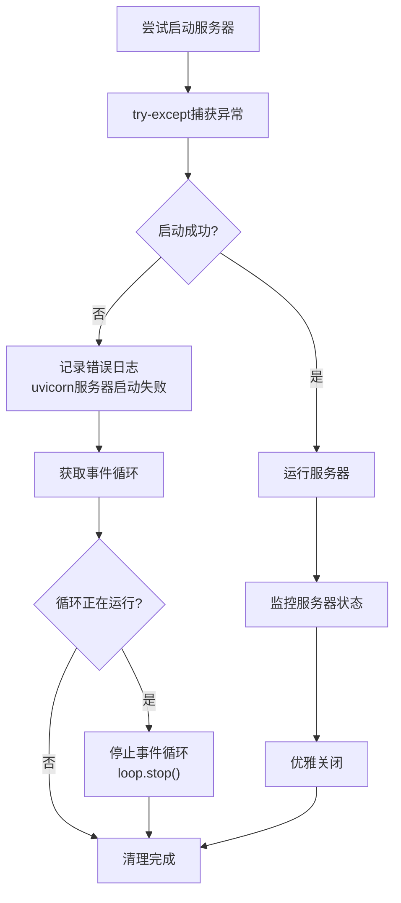
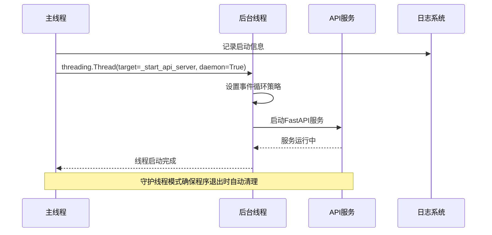
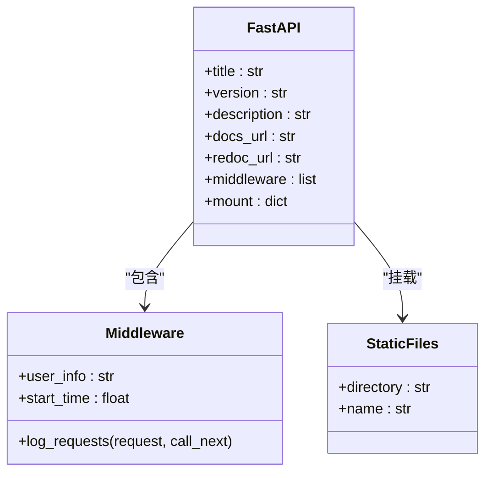
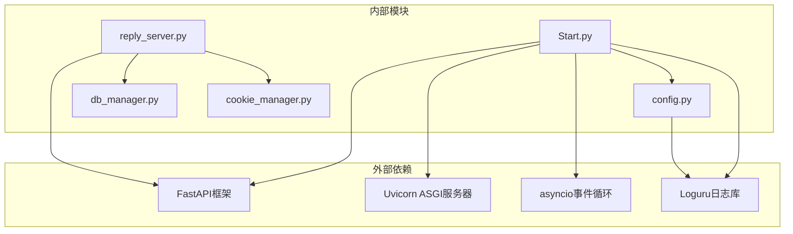
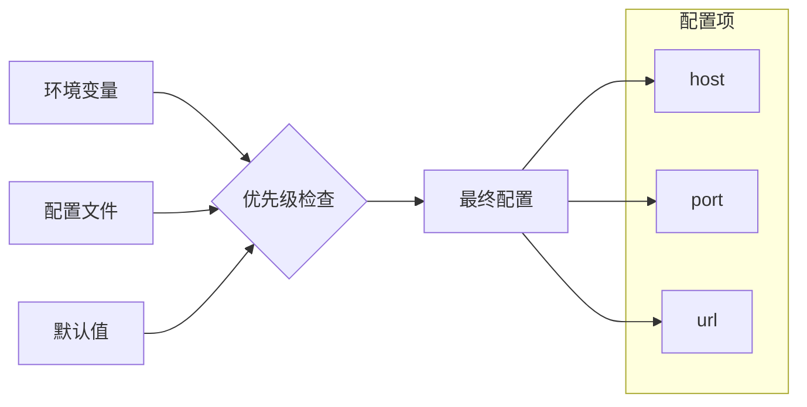
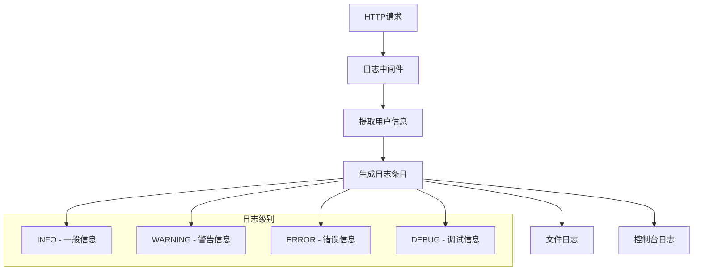

# API服务器初始化

<cite>
**本文档引用的文件**
- [Start.py](file://Start.py)
- [config.py](file://config.py)
- [reply_server.py](file://reply_server.py)
- [global_config.yml](file://global_config.yml)
</cite>

## 目录
1. [简介](#简介)
2. [项目结构概览](#项目结构概览)
3. [核心组件分析](#核心组件分析)
4. [架构概览](#架构概览)
5. [详细组件分析](#详细组件分析)
6. [依赖关系分析](#依赖关系分析)
7. [性能考虑](#性能考虑)
8. [故障排除指南](#故障排除指南)
9. [结论](#结论)

## 简介

本文档深入分析了`_start_api_server()`函数如何在独立线程中启动FastAPI服务的完整流程。该函数实现了优雅的服务器初始化机制，优先读取环境变量配置，回退到配置文件设置，并通过复杂的异常处理确保程序稳定性。

## 项目结构概览

该项目采用模块化架构设计，主要包含以下核心模块：



**图表来源**
- [Start.py](file://Start.py#L1-L50)
- [config.py](file://config.py#L1-L50)
- [reply_server.py](file://reply_server.py#L1-L50)

**章节来源**
- [Start.py](file://Start.py#L1-L100)
- [config.py](file://config.py#L1-L126)

## 核心组件分析

### 环境变量优先级机制

系统实现了多层次的配置优先级机制：

1. **环境变量优先**：`API_HOST`和`API_PORT`环境变量具有最高优先级
2. **配置文件回退**：当环境变量不存在时，使用`config.py`中的配置
3. **向后兼容**：支持旧版URL配置格式的自动解析

### 事件循环隔离策略

为了避免与主线程事件循环冲突，系统采用了创新的事件循环隔离策略：

```mermaid
sequenceDiagram
participant Main as 主线程
participant Thread as 后台线程
participant Loop as 新事件循环
participant Uvicorn as Uvicorn服务器
Main->>Thread : 创建守护线程
Thread->>Loop : asyncio.new_event_loop()
Thread->>Loop : asyncio.set_event_loop(loop)
Thread->>Uvicorn : server.serve()
Uvicorn-->>Thread : 服务器运行
Thread-->>Main : 线程启动完成
Note over Thread,Uvicorn : 独立事件循环确保线程安全
```

**图表来源**
- [Start.py](file://Start.py#L469-L477)

**章节来源**
- [Start.py](file://Start.py#L446-L490)

## 架构概览

系统采用分层架构设计，确保各组件职责清晰：



**图表来源**
- [Start.py](file://Start.py#L446-L490)
- [reply_server.py](file://reply_server.py#L308-L350)

## 详细组件分析

### `_start_api_server()`函数详解

#### 配置解析流程

函数首先从多个来源获取配置信息：



**图表来源**
- [Start.py](file://Start.py#L448-L467)

#### Uvicorn服务器配置

系统构建Uvicorn Config对象的过程体现了精心的设计：

| 配置项 | 来源 | 默认值 | 说明 |
|--------|------|--------|------|
| `app` | 固定值 | `"reply_server:app"` | FastAPI应用模块路径 |
| `host` | 配置解析 | `"0.0.0.0"` | 绑定所有网络接口 |
| `port` | 配置解析 | `8080` | HTTP服务端口 |
| `log_level` | 固定值 | `"info"` | 日志级别 |

#### 异常处理机制

系统实现了完善的异常处理和资源清理机制：



**图表来源**
- [Start.py](file://Start.py#L478-L485)

**章节来源**
- [Start.py](file://Start.py#L446-L490)

### 后台线程管理

#### 线程创建策略

系统使用守护线程(daemon=True)确保程序退出时自动清理资源：



**图表来源**
- [Start.py](file://Start.py#L574-L576)

#### 事件循环策略适配

针对不同平台的特殊处理：

| 平台 | 处理策略 | 原因 |
|------|----------|------|
| Linux | 设置DefaultEventLoopPolicy | 支持子进程fork场景 |
| Windows | 无需特殊处理 | asyncio默认行为 |
| Docker | 自定义事件循环策略 | 解决容器环境问题 |

**章节来源**
- [Start.py](file://Start.py#L430-L445)

### FastAPI应用初始化

#### 应用配置

FastAPI应用的初始化包含了丰富的配置选项：



**图表来源**
- [reply_server.py](file://reply_server.py#L308-L350)

#### 中间件系统

请求日志中间件提供了完整的请求追踪能力：

| 功能 | 实现方式 | 用途 |
|------|----------|------|
| 请求拦截 | `@app.middleware("http")` | 拦截所有HTTP请求 |
| 用户识别 | 从Authorization头解析Token | 跟踪用户操作 |
| 性能监控 | 计算请求处理时间 | 性能分析 |
| 日志记录 | 结构化日志输出 | 审计和调试 |

**章节来源**
- [reply_server.py](file://reply_server.py#L330-L358)

## 依赖关系分析

### 模块依赖图



**图表来源**
- [Start.py](file://Start.py#L424-L445)
- [reply_server.py](file://reply_server.py#L1-L30)

### 配置依赖关系

配置系统的层次结构确保了灵活性和可靠性：



**图表来源**
- [config.py](file://config.py#L108-L116)
- [global_config.yml](file://global_config.yml#L11-L17)

**章节来源**
- [Start.py](file://Start.py#L424-L445)
- [config.py](file://config.py#L1-L126)

## 性能考虑

### 事件循环优化

系统在事件循环管理方面采用了多项优化措施：

1. **独立事件循环**：每个线程拥有独立的事件循环，避免竞态条件
2. **资源隔离**：确保API服务不会影响主线程的其他任务
3. **优雅关闭**：完善的资源清理机制，防止内存泄漏

### 并发处理

系统支持高并发请求处理：

| 特性 | 实现方式 | 性能优势 |
|------|----------|----------|
| 异步处理 | FastAPI + Uvicorn | 高吞吐量 |
| 连接池 | 内置HTTP客户端 | 减少连接开销 |
| 请求限流 | 中间件实现 | 防止过载 |

## 故障排除指南

### 常见启动问题

#### 端口占用问题

**症状**：服务器启动失败，提示端口已被占用

**解决方案**：
1. 检查环境变量`API_PORT`设置
2. 修改配置文件中的端口设置
3. 使用`netstat`命令查找占用进程

#### 配置解析错误

**症状**：服务器启动但无法访问

**诊断步骤**：
1. 检查环境变量设置
2. 验证配置文件语法
3. 查看启动日志中的配置信息

#### 事件循环冲突

**症状**：程序崩溃或异常行为

**解决方案**：
1. 确认事件循环策略设置
2. 检查异步任务的正确性
3. 验证线程安全机制

**章节来源**
- [Start.py](file://Start.py#L478-L485)

### 监控和调试

#### 日志配置

系统提供了详细的日志记录机制：



**图表来源**
- [reply_server.py](file://reply_server.py#L330-L358)

## 结论

`_start_api_server()`函数展现了现代Python异步应用开发的最佳实践。通过精心设计的配置优先级机制、事件循环隔离策略和异常处理机制，系统实现了稳定可靠的API服务启动流程。

### 关键特性总结

1. **灵活的配置管理**：支持环境变量、配置文件和默认值的多层级配置
2. **线程安全设计**：独立事件循环确保后台服务不会干扰主线程
3. **完善的异常处理**：全面的错误捕获和资源清理机制
4. **向后兼容性**：支持旧版配置格式的平滑迁移
5. **生产就绪**：具备监控、日志和优雅关闭等生产环境必需的功能

这种设计模式为构建大规模异步Python应用提供了宝贵的参考价值，特别是在需要同时运行多个独立服务的复杂应用场景中。