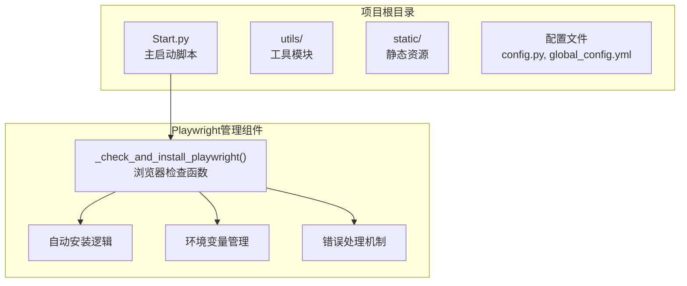
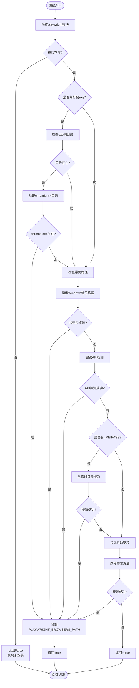
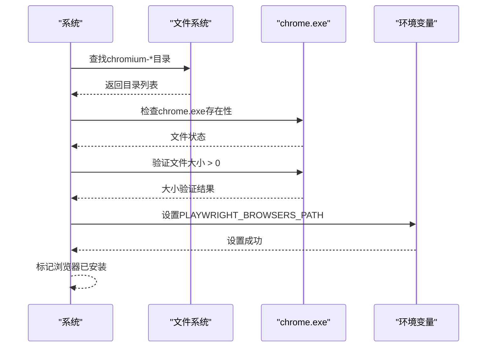
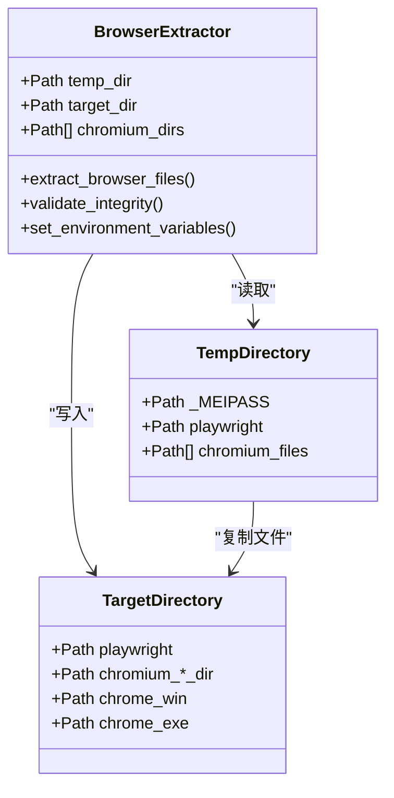
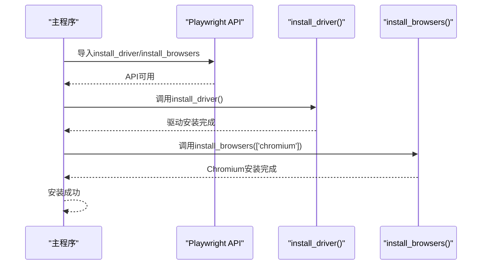
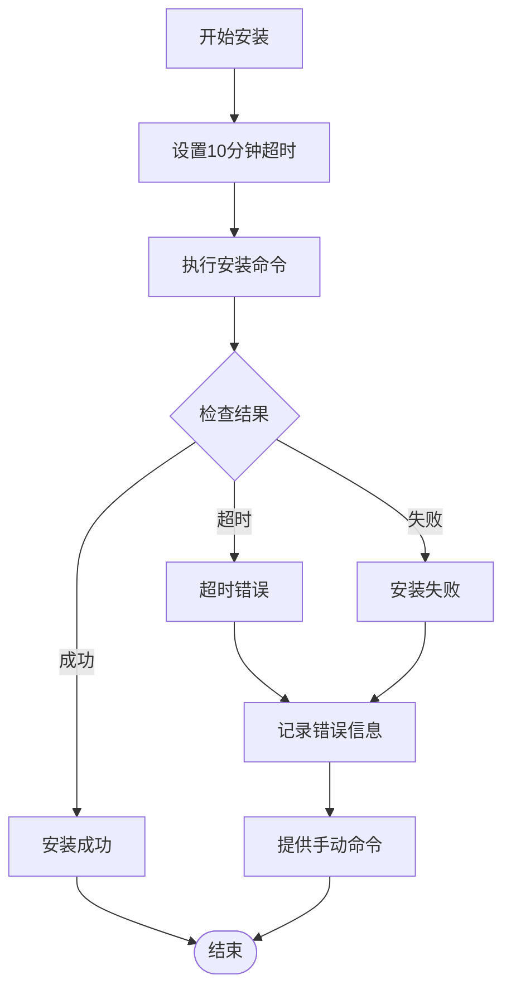

# Playwright浏览器检查与安装机制详解

<cite>
**本文档引用的文件**
- [Start.py](file://Start.py)
- [requirements.txt](file://requirements.txt)
</cite>

## 目录
1. [概述](#概述)
2. [项目结构分析](#项目结构分析)
3. [核心函数架构](#核心函数架构)
4. [Playwright浏览器检查机制](#playwright浏览器检查机制)
5. [PyInstaller打包环境处理](#pyinstaller打包环境处理)
6. [自动安装流程](#自动安装流程)
7. [错误处理与超时机制](#错误处理与超时机制)
8. [环境变量管理](#环境变量管理)
9. [性能优化考虑](#性能优化考虑)
10. [故障排除指南](#故障排除指南)

## 概述

Start.py中的`_playwright_check_and_install()`函数是一个精密设计的自动化管理系统，专门负责在启动时检查、验证和安装Playwright浏览器。该系统具备智能的多层级检查机制，能够适应不同的部署环境，包括开发环境、打包exe环境以及各种网络条件。

该函数的核心目标是在确保Playwright浏览器可用性的前提下，提供无缝的用户体验，无论是在本地开发环境还是经过PyInstaller打包的应用程序中。

## 项目结构分析

项目采用模块化架构，其中Playwright浏览器管理逻辑集中在Start.py文件中。整个项目的文件组织体现了清晰的职责分离：

**图表来源**
- [Start.py](file://Start.py#L146-L413)

**章节来源**
- [Start.py](file://Start.py#L1-L50)
- [requirements.txt](file://requirements.txt#L41-L44)

## 核心函数架构

`_check_and_install_playwright()`函数采用了分层检查策略，确保在各种环境下都能找到或安装合适的Playwright浏览器：

**图表来源**
- [Start.py](file://Start.py#L147-L413)

**章节来源**
- [Start.py](file://Start.py#L147-L413)

## Playwright浏览器检查机制

### 多层级检查策略

系统实现了智能的多层级检查机制，按照优先级顺序查找可用的Playwright浏览器：

#### 1. 模块可用性检查
首先验证playwright模块是否已安装，这是所有后续操作的前提条件。

#### 2. 打包环境特殊处理
对于PyInstaller打包的应用程序，系统会优先检查可执行文件所在目录下的`playwright`子目录，这是预打包浏览器的主要存放位置。

#### 3. Windows系统路径搜索
在非打包环境中，系统会在多个Windows常见路径中搜索已安装的Playwright浏览器：
- 用户缓存目录：`%USERPROFILE%/.cache/ms-playwright`
- LocalAppData目录：`%LOCALAPPDATA%/ms-playwright`
- AppData目录：`%APPDATA%/ms-playwright`

#### 4. API检测机制
当文件系统检查失败时，系统会尝试通过Playwright的同步API进行检测，验证浏览器是否已正确安装。

### 文件完整性验证

系统对找到的浏览器文件进行严格的完整性检查：

**图表来源**
- [Start.py](file://Start.py#L168-L187)

**章节来源**
- [Start.py](file://Start.py#L147-L236)

## PyInstaller打包环境处理

### MEIPASS临时目录提取

对于PyInstaller打包的应用程序，系统实现了复杂的临时目录提取机制：

#### 1. MEIPASS检测
系统首先检测是否存在`sys._MEIPASS`属性，这是PyInstaller创建的临时解压目录标识。

#### 2. 浏览器文件识别
从临时目录中识别出所有与chromium相关的目录，包括：
- `chromium-*`：完整版浏览器
- `chromium_headless_shell-*`：无头模式浏览器

#### 3. 文件完整性验证
对每个候选浏览器进行严格验证，确保：
- chrome.exe或headless_shell.exe文件存在
- 文件大小大于0字节
- 文件可执行性验证

#### 4. 文件复制与路径设置
验证通过后，系统将浏览器文件复制到应用程序目录，并正确设置环境变量：

**图表来源**
- [Start.py](file://Start.py#L240-L301)

**章节来源**
- [Start.py](file://Start.py#L238-L301)

## 自动安装流程

### 多种安装方法支持

系统提供了多种自动安装方法，确保在不同环境下都能成功安装Playwright浏览器：

#### 1. Python API安装（推荐）
这是首选方法，特别适用于打包后的应用程序：

**图表来源**
- [Start.py](file://Start.py#L312-L319)

#### 2. 命令行安装
当Python API不可用时，系统会回退到命令行安装方式：

| 安装方法 | 适用场景 | 优点 | 缺点 |
|---------|---------|------|------|
| Python API | 打包exe环境 | 性能好，无额外进程开销 | 需要playwright模块 |
| 命令行方式 | API不可用环境 | 兼容性强 | 性能较低，有进程开销 |

#### 3. 超时控制
所有安装操作都设置了10分钟的超时限制，防止长时间阻塞程序启动。

**章节来源**
- [Start.py](file://Start.py#L306-L411)

## 错误处理与超时机制

### 分层错误处理策略

系统实现了完善的错误处理机制，确保在各种异常情况下都能提供有用的反馈：

#### 1. 模块导入错误
当playwright模块缺失时，系统优雅降级，不会影响主程序启动。

#### 2. 文件系统错误
对于文件操作异常，系统提供详细的错误信息和建议解决方案。

#### 3. 网络安装失败
当自动安装失败时，系统会：
- 显示具体的错误信息
- 提供手动安装命令
- 记录详细的调试信息

#### 4. 超时处理
所有长时间操作都设置了合理的超时限制：

**图表来源**
- [Start.py](file://Start.py#L402-L411)

**章节来源**
- [Start.py](file://Start.py#L416-L421)
- [Start.py](file://Start.py#L402-L411)

## 环境变量管理

### PLAYWRIGHT_BROWSERS_PATH设置

系统实现了智能的环境变量管理机制：

#### 1. 自动检测现有设置
系统会检查现有的`PLAYWRIGHT_BROWSERS_PATH`环境变量，避免冲突。

#### 2. 动态更新机制
当找到新的浏览器位置时，系统会自动更新环境变量，确保Playwright能找到正确的浏览器。

#### 3. 路径规范化
所有路径都经过规范化处理，确保跨平台兼容性。

#### 4. 清理机制
当检测到不一致的环境变量时，系统会自动清理旧的设置。

**章节来源**
- [Start.py](file://Start.py#L177-L187)
- [Start.py](file://Start.py#L291-L300)

## 性能优化考虑

### 启动时间优化

系统在设计时充分考虑了启动性能：

#### 1. 早期检查
在导入其他模块之前就执行浏览器检查，避免不必要的模块加载。

#### 2. 快速失败机制
一旦找到可用的浏览器，立即停止进一步检查，减少启动时间。

#### 3. 缓存利用
充分利用已有的浏览器文件，避免重复下载和安装。

#### 4. 异步处理
虽然当前实现是同步的，但系统设计允许未来的异步优化。

### 内存使用优化

#### 1. 条件加载
只有在需要时才加载Playwright相关模块。
#### 2. 及时清理
安装完成后及时释放临时资源。

**章节来源**
- [Start.py](file://Start.py#L146-L147)
- [Start.py](file://Start.py#L416-L421)

## 故障排除指南

### 常见问题及解决方案

#### 1. Playwright模块未安装
**症状**：看到"Playwright模块未安装"警告
**解决方案**：运行`pip install playwright`安装模块

#### 2. 浏览器文件损坏
**症状**：浏览器文件存在但无法启动
**解决方案**：删除损坏的浏览器文件，让系统重新安装

#### 3. 权限问题
**症状**：无法写入浏览器文件
**解决方案**：以管理员权限运行程序或检查文件夹权限

#### 4. 网络连接问题
**症状**：自动安装失败
**解决方案**：手动运行`playwright install chromium`命令

### 调试信息收集

系统提供了丰富的调试信息，帮助诊断问题：

| 日志级别 | 信息内容 | 示例 |
|---------|---------|------|
| INFO | 环境变量设置 | "已设置PLAYWRIGHT_BROWSERS_PATH: C:\path\to\playwright" |
| OK | 成功操作 | "找到已提取的Playwright浏览器: C:\path\to\playwright\chromium-xxx\chrome-win\chrome.exe" |
| WARN | 警告信息 | "提取浏览器文件时出错: Permission denied" |
| ERROR | 错误信息 | "Playwright浏览器安装失败: Network timeout" |

**章节来源**
- [Start.py](file://Start.py#L416-L421)

## 结论

`_playwright_check_and_install()`函数展现了现代软件工程的最佳实践，通过智能的多层级检查、完善的错误处理和灵活的安装机制，确保了Playwright浏览器在各种环境下的可靠可用性。该系统不仅解决了技术挑战，还为用户提供了一个无缝的体验，是自动化软件部署领域的优秀范例。