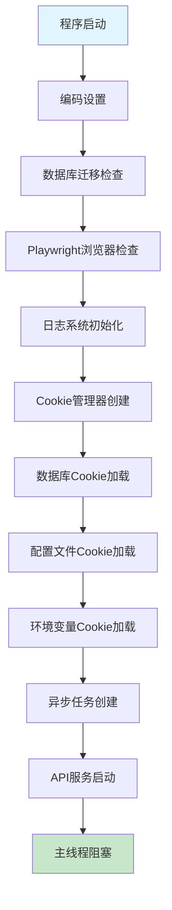
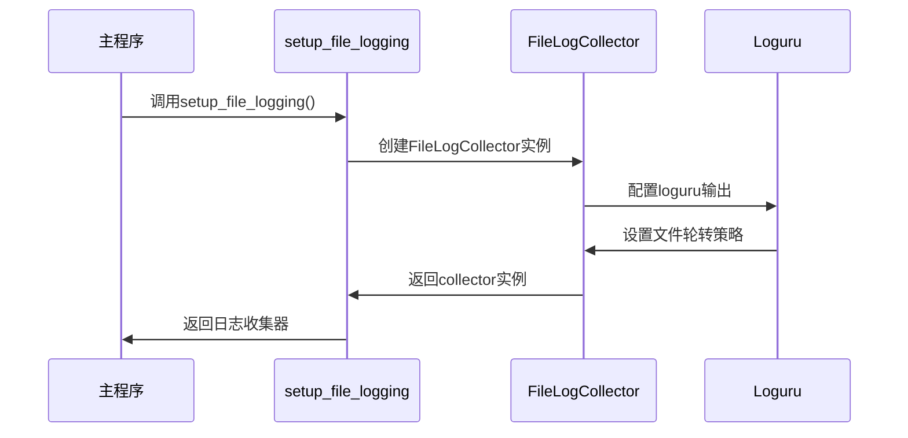
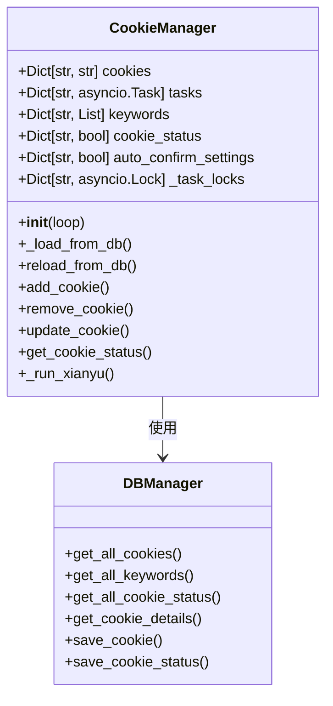
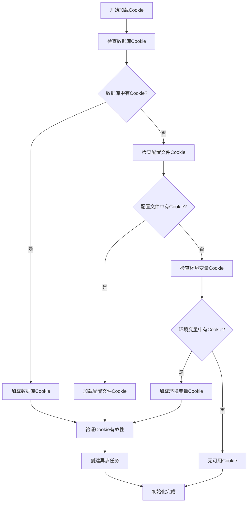
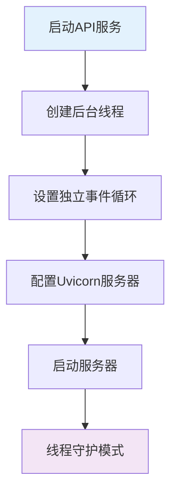
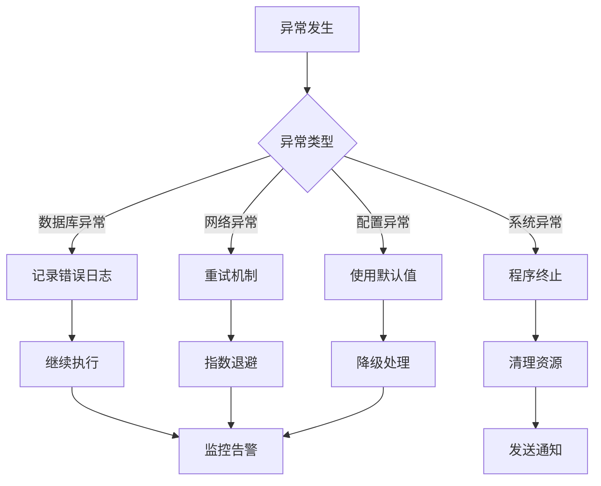

# 主程序初始化流程

<cite>
**本文档引用的文件**
- [Start.py](file://Start.py)
- [XianyuAutoAsync.py](file://XianyuAutoAsync.py)
- [cookie_manager.py](file://cookie_manager.py)
- [db_manager.py](file://db_manager.py)
- [config.py](file://config.py)
- [file_log_collector.py](file://file_log_collector.py)
- [reply_server.py](file://reply_server.py)
</cite>

## 目录
1. [概述](#概述)
2. [初始化流程架构](#初始化流程架构)
3. [日志系统初始化](#日志系统初始化)
4. [Cookie管理器创建与数据库加载](#cookie管理器创建与数据库加载)
5. [Cookie加载优先级处理](#cookie加载优先级处理)
6. [异步任务创建与管理](#异步任务创建与管理)
7. [API服务启动](#api服务启动)
8. [主线程阻塞机制](#主线程阻塞机制)
9. [异常处理与日志记录](#异常处理与日志记录)
10. [最佳实践总结](#最佳实践总结)

## 概述

主程序初始化流程是整个闲鱼自动回复系统的核心启动过程，负责协调各个组件的初始化工作。该流程通过`main()`协程函数实现，按照严格的顺序执行各项初始化任务，确保系统的稳定性和可观测性。

## 初始化流程架构

主程序初始化采用分阶段的流水线架构，每个阶段都有明确的职责和依赖关系：



**图表来源**
- [Start.py](file://Start.py#L513-L602)

## 日志系统初始化

### setup_file_logging()函数详解

日志系统初始化是整个启动流程的第一步，通过`setup_file_logging()`函数建立统一的日志收集机制：



**图表来源**
- [file_log_collector.py](file://file_log_collector.py#L210-L214)
- [Start.py](file://Start.py#L517-L518)

### 日志配置特点

1. **文件监控机制**：实时监控日志文件变化，确保日志的及时收集
2. **格式标准化**：采用统一的loguru格式，便于解析和分析
3. **性能优化**：使用行缓冲和即时写入，减少日志延迟
4. **容量控制**：限制日志队列大小，防止内存溢出

**章节来源**
- [file_log_collector.py](file://file_log_collector.py#L58-L72)
- [Start.py](file://Start.py#L517-L518)

## Cookie管理器创建与数据库加载

### CookieManager初始化流程

Cookie管理器是系统的核心组件，负责管理所有账号的Cookie及其相关配置：



**图表来源**
- [cookie_manager.py](file://cookie_manager.py#L10-L428)
- [db_manager.py](file://db_manager.py#L16-L800)

### 数据库加载机制

Cookie管理器在初始化时自动从数据库加载所有必要的配置信息：

1. **Cookie数据加载**：从`cookies`表加载所有账号的Cookie值
2. **关键字数据加载**：从`keywords`表加载每个账号的关键字配置
3. **状态数据加载**：从`cookie_status`表加载账号的启用状态
4. **自动确认设置**：从`ai_reply_settings`表加载AI回复配置

**章节来源**
- [cookie_manager.py](file://cookie_manager.py#L23-L40)
- [db_manager.py](file://db_manager.py#L1226-L1764)

## Cookie加载优先级处理

系统采用三层优先级机制加载Cookie，确保配置的灵活性和可靠性：

### 优先级顺序

1. **数据库中已保存的账号**（最高优先级）
2. **配置文件中的COOKIES_LIST**（中等优先级）
3. **环境变量COOKIES_STR提供的default账号**（最低优先级）



**图表来源**
- [Start.py](file://Start.py#L529-L571)

### 数据库Cookie处理

数据库中的Cookie在初始化时自动加载，并且会检查账号的启用状态：

```python
# 从数据库加载的Cookie处理逻辑
for cid, val in manager.cookies.items():
    if not manager.get_cookie_status(cid):
        logger.info(f"跳过禁用的 Cookie: {cid}")
        continue
        
    cookie_info = db_manager.get_cookie_details(cid)
    user_id = cookie_info.get('user_id') if cookie_info else None
    task = loop.create_task(manager._run_xianyu(cid, val, user_id))
    manager.tasks[cid] = task
```

**章节来源**
- [Start.py](file://Start.py#L531-L549)
- [cookie_manager.py](file://cookie_manager.py#L23-L40)

### 配置文件Cookie处理

配置文件中的Cookie通过`COOKIES_LIST`配置加载，支持关键字文件的关联：

```python
# 配置文件Cookie处理逻辑
for entry in COOKIES_LIST:
    cid = entry.get('id')
    val = entry.get('value')
    if not cid or not val or cid in manager.cookies:
        continue
        
    kw_file = entry.get('keywords_file')
    kw_list = load_keywords_file(kw_file) if kw_file else None
    manager.add_cookie(cid, val, kw_list)
```

**章节来源**
- [Start.py](file://Start.py#L555-L566)

### 环境变量Cookie处理

环境变量中的Cookie作为后备方案，主要用于简单的单账号部署：

```python
# 环境变量Cookie处理逻辑
env_cookie = os.getenv('COOKIES_STR')
if env_cookie and 'default' not in manager.list_cookies():
    manager.add_cookie('default', env_cookie)
```

**章节来源**
- [Start.py](file://Start.py#L567-L571)

## 异步任务创建与管理

### _run_xianyu任务创建

每个启用的Cookie都会创建对应的异步任务，通过`_run_xianyu`方法启动：

```mermaid
sequenceDiagram
participant CM as CookieManager
participant Loop as EventLoop
participant XL as XianyuLive
participant Task as AsyncTask
CM->>Loop : create_task(_run_xianyu)
Loop->>XL : 导入XianyuLive模块
XL->>Loop : 创建XianyuLive实例
Loop->>Task : 启动异步任务
Task->>XL : 执行main()方法
XL->>Task : 保持运行状态
```

**图表来源**
- [cookie_manager.py](file://cookie_manager.py#L59-L111)

### 任务管理机制

1. **任务锁机制**：防止重复创建相同账号的任务
2. **用户ID获取**：从数据库获取准确的用户ID信息
3. **异常处理**：完善的错误捕获和日志记录
4. **资源清理**：确保任务停止时的资源释放

### 任务注册流程

```python
# 任务创建和注册逻辑
task = self.loop.create_task(self._run_xianyu(cookie_id, cookie_value, actual_user_id))
self.tasks[cookie_id] = task
logger.info(f"已启动账号任务: {cookie_id} (用户ID: {actual_user_id})")
```

**章节来源**
- [cookie_manager.py](file://cookie_manager.py#L151-L153)
- [Start.py](file://Start.py#L546-L547)

## API服务启动

### 后台线程启动机制

API服务通过独立的后台线程启动，确保主线程的异步事件循环不受影响：



**图表来源**
- [Start.py](file://Start.py#L446-L487)

### Uvicorn服务器配置

API服务使用Uvicorn作为ASGI服务器，支持高性能的异步请求处理：

```python
# Uvicorn服务器配置
config = uvicorn.Config("reply_server:app", host=host, port=port, log_level="info")
server = uvicorn.Server(config)
loop = asyncio.new_event_loop()
asyncio.set_event_loop(loop)
loop.run_until_complete(server.serve())
```

**章节来源**
- [Start.py](file://Start.py#L471-L477)

### 线程安全考虑

1. **独立事件循环**：每个线程使用独立的事件循环
2. **守护线程模式**：确保主线程退出时自动终止
3. **异常隔离**：API服务异常不影响主程序

**章节来源**
- [Start.py](file://Start.py#L574-L576)

## 主线程阻塞机制

### asyncio.Event().wait()实现

主线程通过`asyncio.Event().wait()`实现永久阻塞，保持程序运行：

```python
# 主线程阻塞逻辑
print("主程序启动完成，保持运行...")
await asyncio.Event().wait()
```

### 阻塞机制特点

1. **永久阻塞**：使用`Event().wait()`实现永不超时的阻塞
2. **优雅退出**：支持通过事件循环的关闭实现优雅退出
3. **资源保持**：确保所有后台任务和资源持续可用

**章节来源**
- [Start.py](file://Start.py#L584-L586)

## 异常处理与日志记录

### 分层异常处理

系统采用分层的异常处理策略，确保每个阶段的错误都能得到妥善处理：



### 日志记录最佳实践

1. **分级日志**：使用不同级别记录不同类型的信息
2. **上下文信息**：包含足够的上下文信息便于排查
3. **异常堆栈**：记录完整的异常堆栈信息
4. **性能监控**：记录关键操作的执行时间

### 异常处理示例

```python
# 异常处理示例
try:
    # 关键操作
    await asyncio.wait_for(task, timeout=10.0)
except asyncio.TimeoutError:
    logger.warning(f"等待任务停止超时（10秒），强制继续")
except asyncio.CancelledError:
    logger.debug(f"任务已取消")
except Exception as e:
    logger.error(f"等待任务清理时出错: {cookie_id}, {e}")
```

**章节来源**
- [cookie_manager.py](file://cookie_manager.py#L165-L171)
- [Start.py](file://Start.py#L550-L553)

## 最佳实践总结

### 初始化流程设计原则

1. **顺序依赖**：严格按照依赖关系顺序执行初始化
2. **错误隔离**：每个阶段的错误不影响其他阶段
3. **资源管理**：确保资源的正确分配和释放
4. **可观测性**：提供详细的日志和监控信息

### 性能优化策略

1. **异步初始化**：使用异步方式处理耗时的初始化操作
2. **并发处理**：合理利用并发提高初始化效率
3. **缓存机制**：缓存频繁访问的数据减少重复操作
4. **懒加载**：按需加载非关键组件

### 可靠性保障

1. **健康检查**：初始化完成后进行健康状态检查
2. **回滚机制**：初始化失败时的清理和回滚策略
3. **监控告警**：关键指标的监控和异常告警
4. **文档记录**：详细的初始化流程文档和故障排除指南

通过遵循这些最佳实践，主程序初始化流程能够确保系统的稳定性、可靠性和可观测性，为整个闲鱼自动回复系统提供坚实的基础支撑。