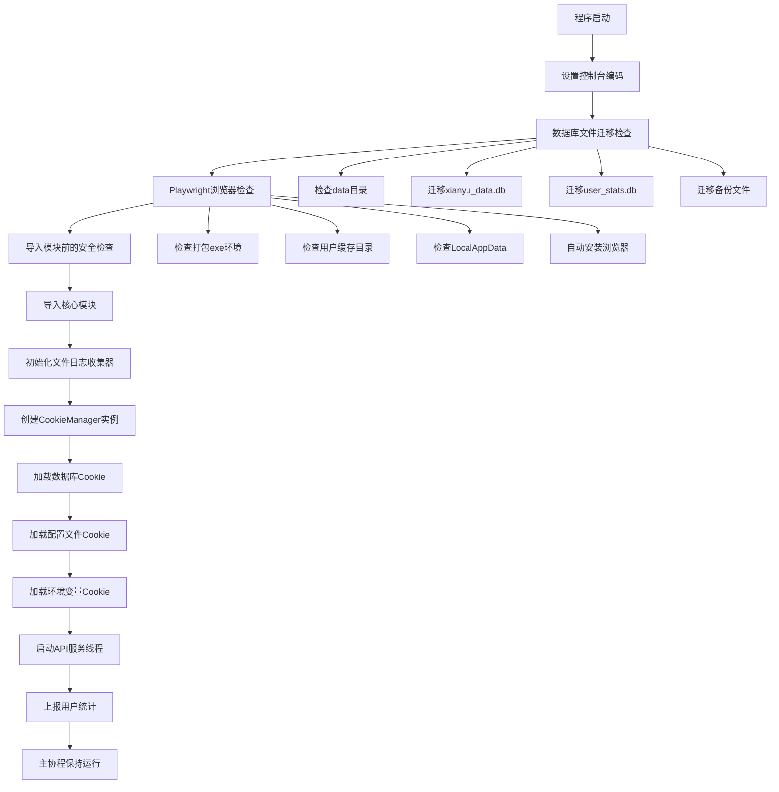
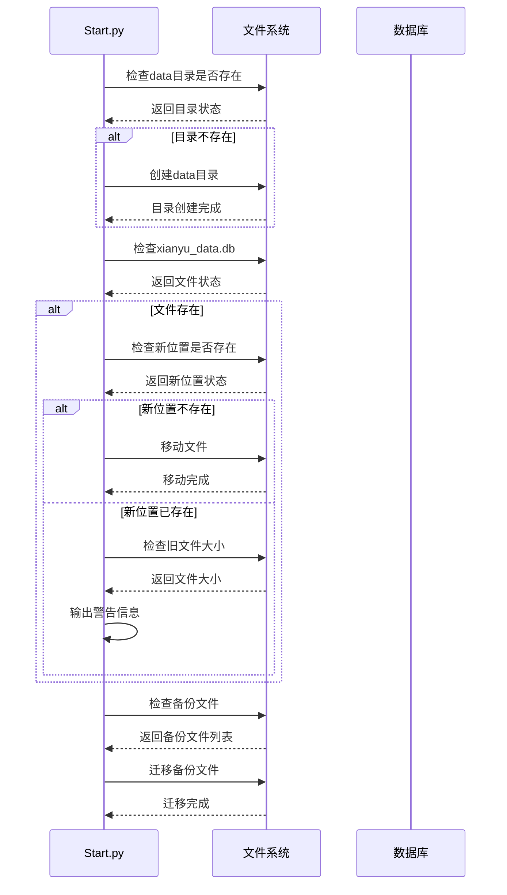
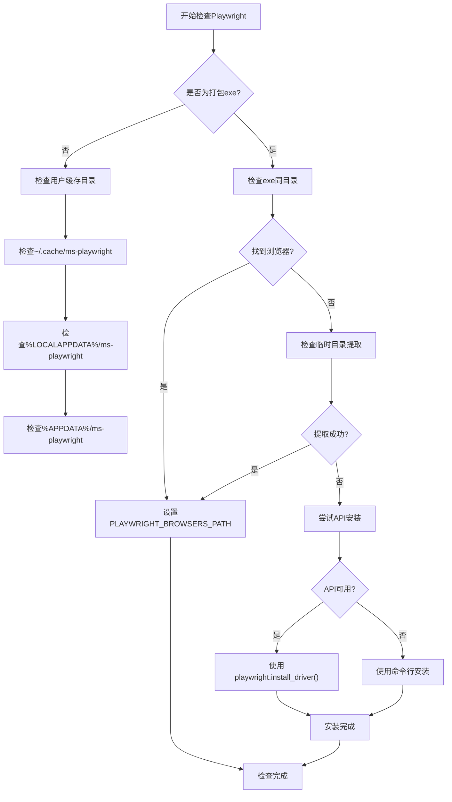
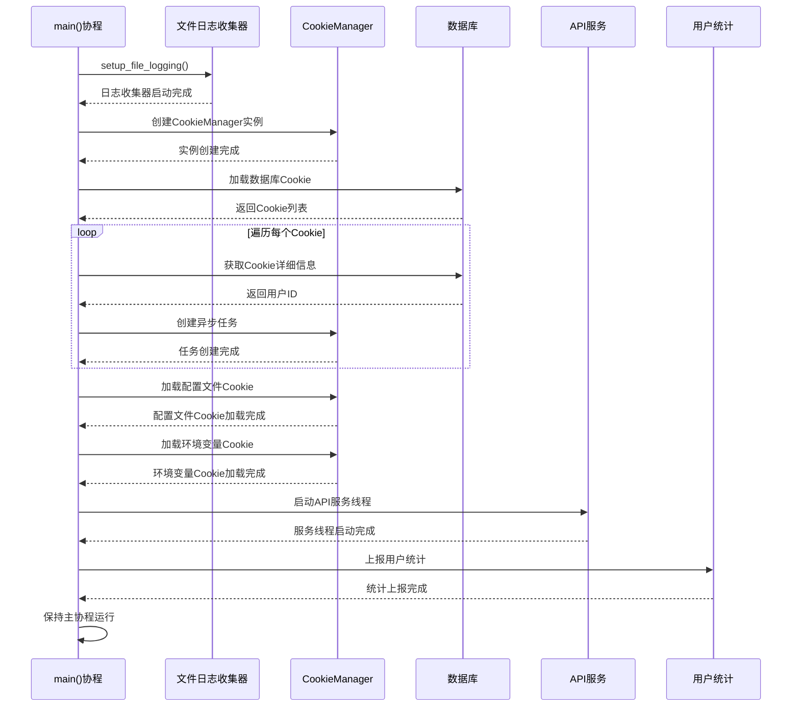
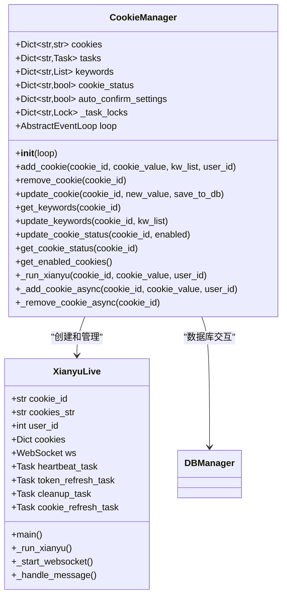
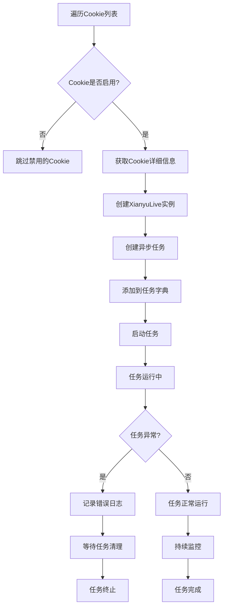
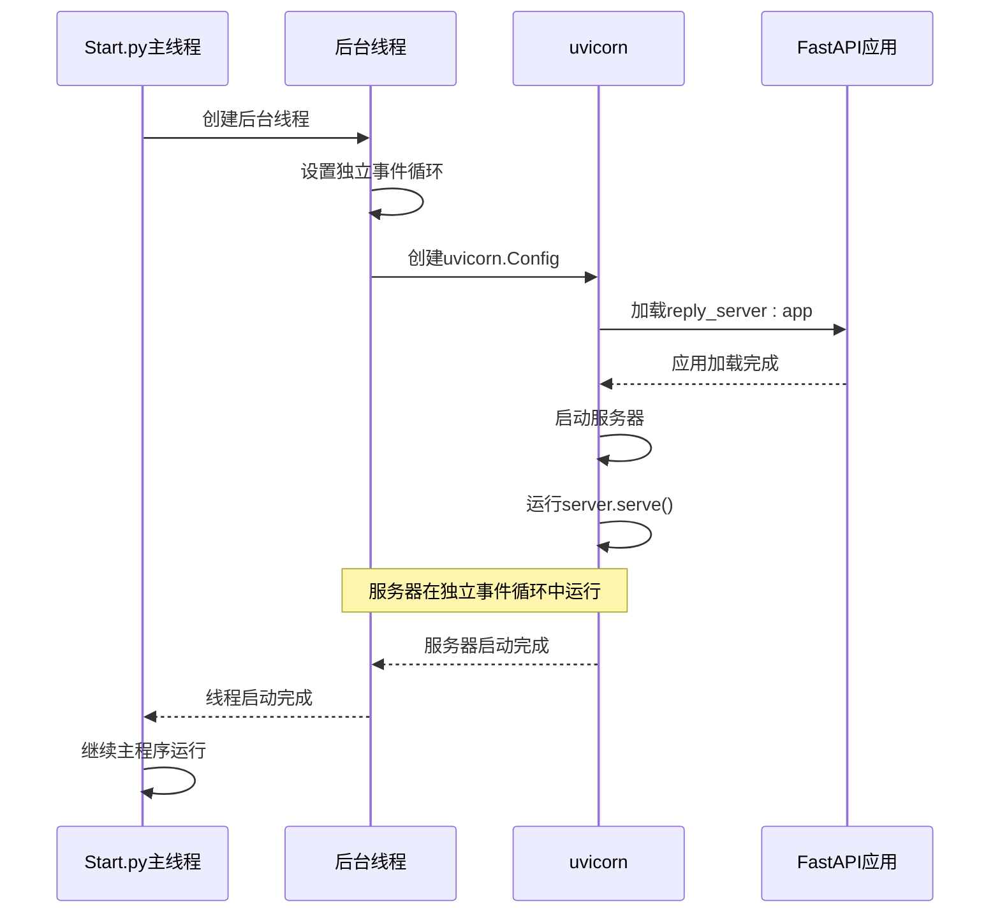
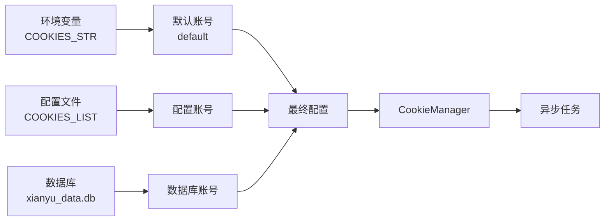

# 入口启动模块

<cite>
**本文档中引用的文件**
- [Start.py](file://Start.py)
- [XianyuAutoAsync.py](file://XianyuAutoAsync.py)
- [cookie_manager.py](file://cookie_manager.py)
- [db_manager.py](file://db_manager.py)
- [reply_server.py](file://reply_server.py)
</cite>

## 目录
1. [项目概述](#项目概述)
2. [启动流程架构](#启动流程架构)
3. [数据库文件迁移机制](#数据库文件迁移机制)
4. [Playwright浏览器检查与安装](#playwright浏览器检查与安装)
5. [主程序初始化流程](#主程序初始化流程)
6. [CookieManager实例创建](#cookiemanager实例创建)
7. [异步任务管理](#异步任务管理)
8. [FastAPI Web服务器启动](#fastapi-web服务器启动)
9. [环境变量处理](#环境变量处理)
10. [故障排除指南](#故障排除指南)

## 项目概述

Start.py作为项目的启动入口，负责协调整个应用程序的初始化流程。它采用异步编程模式，确保各个组件能够高效协同工作，同时提供了完善的错误处理和资源管理机制。

## 启动流程架构

**图表来源**
- [Start.py](file://Start.py#L1-L602)

**章节来源**
- [Start.py](file://Start.py#L1-L602)

## 数据库文件迁移机制

在导入任何模块之前，Start.py首先执行数据库文件迁移逻辑，确保xianyu_data.db等数据库文件位于正确的data目录中。

### 迁移检查流程

**图表来源**
- [Start.py](file://Start.py#L62-L137)

### 迁移文件列表

| 文件名 | 新位置 | 描述 |
|--------|--------|------|
| xianyu_data.db | data/xianyu_data.db | 主数据库文件 |
| user_stats.db | data/user_stats.db | 统计数据库文件 |
| 备份文件 | data/备份文件 | xianyu_data_backup_*.db |

### 迁移策略

1. **优先移动策略**：首先尝试移动文件到新位置
2. **降级复制策略**：移动失败时尝试复制文件
3. **备份文件处理**：自动识别并迁移所有备份文件
4. **冲突处理**：当新位置已存在文件时给出警告提示

**章节来源**
- [Start.py](file://Start.py#L62-L137)

## Playwright浏览器检查与安装

Start.py实现了智能的Playwright浏览器检查与安装机制，支持多种部署场景。

### 检查优先级

**图表来源**
- [Start.py](file://Start.py#L147-L413)

### 支持的部署环境

| 环境类型 | 检查路径 | 备注 |
|----------|----------|------|
| 打包exe | exe同目录/playwright | 优先检查 |
| 开发环境 | ~/.cache/ms-playwright | 用户缓存目录 |
| 生产环境 | %LOCALAPPDATA%/ms-playwright | Windows系统目录 |
| 便携应用 | %APPDATA%/ms-playwright | 应用数据目录 |

### 安装方式

1. **API安装**（推荐）：直接调用playwright的Python API
2. **命令行安装**：使用`python -m playwright install chromium`
3. **自动提取**：从打包的临时目录提取浏览器文件

**章节来源**
- [Start.py](file://Start.py#L147-L413)

## 主程序初始化流程

主程序初始化通过main()协程函数执行，负责协调各个组件的启动顺序。

### 初始化序列图

**图表来源**
- [Start.py](file://Start.py#L513-L586)

**章节来源**
- [Start.py](file://Start.py#L513-L586)

## CookieManager实例创建

CookieManager是项目的核心组件之一，负责管理多个账号的Cookie及其对应的异步任务。

### CookieManager架构

**图表来源**
- [cookie_manager.py](file://cookie_manager.py#L10-L428)
- [XianyuAutoAsync.py](file://XianyuAutoAsync.py#L628-L800)

### Cookie加载机制

CookieManager从三个来源加载Cookie：

1. **数据库加载**：从xianyu_data.db加载所有已保存的Cookie
2. **配置文件加载**：从COOKIES_LIST配置加载新的Cookie
3. **环境变量加载**：从COOKIES_STR环境变量加载默认Cookie

**章节来源**
- [cookie_manager.py](file://cookie_manager.py#L10-L428)

## 异步任务管理

Start.py为每个启用的Cookie创建独立的异步任务，确保每个账号都能独立运行。

### 任务创建流程

**图表来源**
- [Start.py](file://Start.py#L530-L554)

### 任务生命周期管理

| 阶段 | 操作 | 监控指标 |
|------|------|----------|
| 创建 | `loop.create_task()` | 任务创建时间 |
| 启动 | `_run_xianyu()` | 启动成功率 |
| 运行 | `await live.main()` | 运行稳定性 |
| 监控 | 异常捕获 | 错误率统计 |
| 清理 | 任务取消 | 清理时间 |

**章节来源**
- [Start.py](file://Start.py#L530-L554)

## FastAPI Web服务器启动

Start.py通过独立的后台线程启动FastAPI Web服务器，提供管理界面和API接口。

### 服务器启动机制

**图表来源**
- [Start.py](file://Start.py#L446-L486)
- [reply_server.py](file://reply_server.py#L1-L200)

### 线程安全的服务器启动

_start_api_server()函数实现了线程安全的服务器启动：

1. **独立事件循环**：在后台线程中创建全新的事件循环
2. **配置分离**：使用专门的配置对象隔离服务器设置
3. **优雅启动**：通过uvicorn.Server.serve()方法启动
4. **异常处理**：完善的错误捕获和资源清理机制

### 环境变量配置支持

| 配置项 | 环境变量 | 默认值 | 说明 |
|--------|----------|--------|------|
| 主机地址 | API_HOST | 0.0.0.0 | 绑定的网络接口 |
| 端口号 | API_PORT | 8080 | HTTP服务端口 |
| URL配置 | 无 | 无 | 兼容旧版配置方式 |

**章节来源**
- [Start.py](file://Start.py#L446-L486)

## 环境变量处理

Start.py提供了对旧版配置的兼容性支持，特别是COOKIES_STR环境变量的处理。

### 配置优先级

**图表来源**
- [Start.py](file://Start.py#L567-L571)

### 环境变量兼容性

1. **COOKIES_STR支持**：自动识别并加载旧版单账号配置
2. **默认账号处理**：当数据库中不存在default账号时自动创建
3. **配置合并**：新旧配置并存，互不干扰
4. **动态加载**：支持运行时更新环境变量配置

**章节来源**
- [Start.py](file://Start.py#L567-L571)

## 故障排除指南

### 常见启动问题及解决方案

| 问题类型 | 症状 | 解决方案 |
|----------|------|----------|
| 数据库迁移失败 | 文件移动/复制错误 | 手动将数据库文件移动到data目录 |
| Playwright安装失败 | 浏览器功能不可用 | 手动运行`playwright install chromium` |
| API服务启动失败 | Web界面无法访问 | 检查端口占用，修改API_PORT环境变量 |
| Cookie加载失败 | 任务无法启动 | 检查数据库连接和Cookie格式 |

### 调试建议

1. **日志分析**：查看启动时的详细日志输出
2. **环境检查**：确认Python环境和依赖包版本
3. **权限验证**：确保对data目录的读写权限
4. **网络连接**：验证Playwright下载源的网络可达性

### 性能优化建议

1. **并发控制**：合理设置异步任务数量
2. **资源监控**：定期清理过期的日志和缓存文件
3. **内存管理**：监控CookieManager的内存使用情况
4. **网络优化**：配置合适的超时和重试机制

**章节来源**
- [Start.py](file://Start.py#L1-L602)