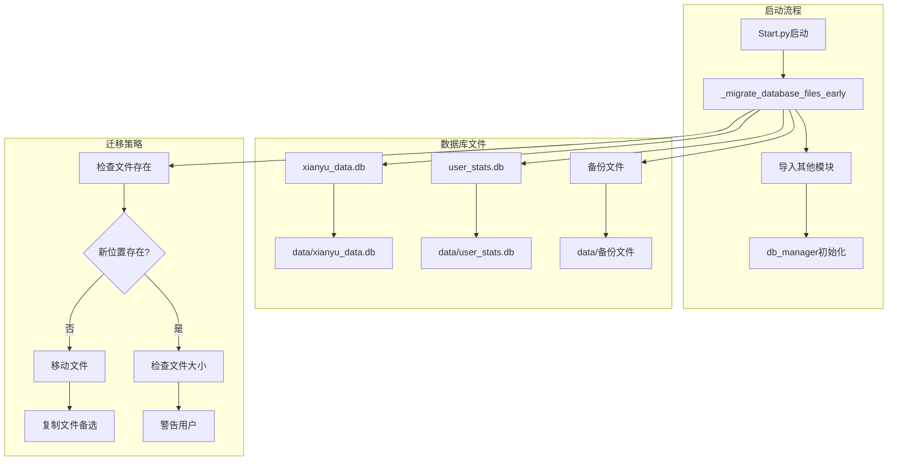
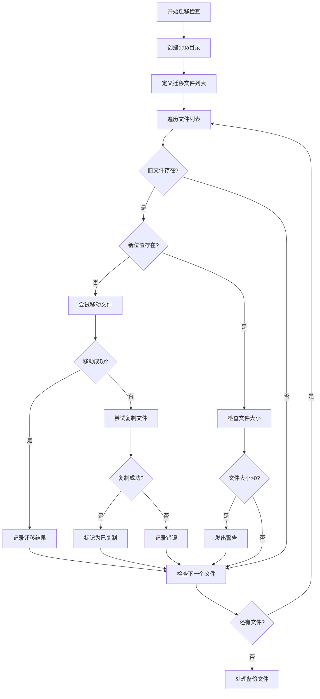
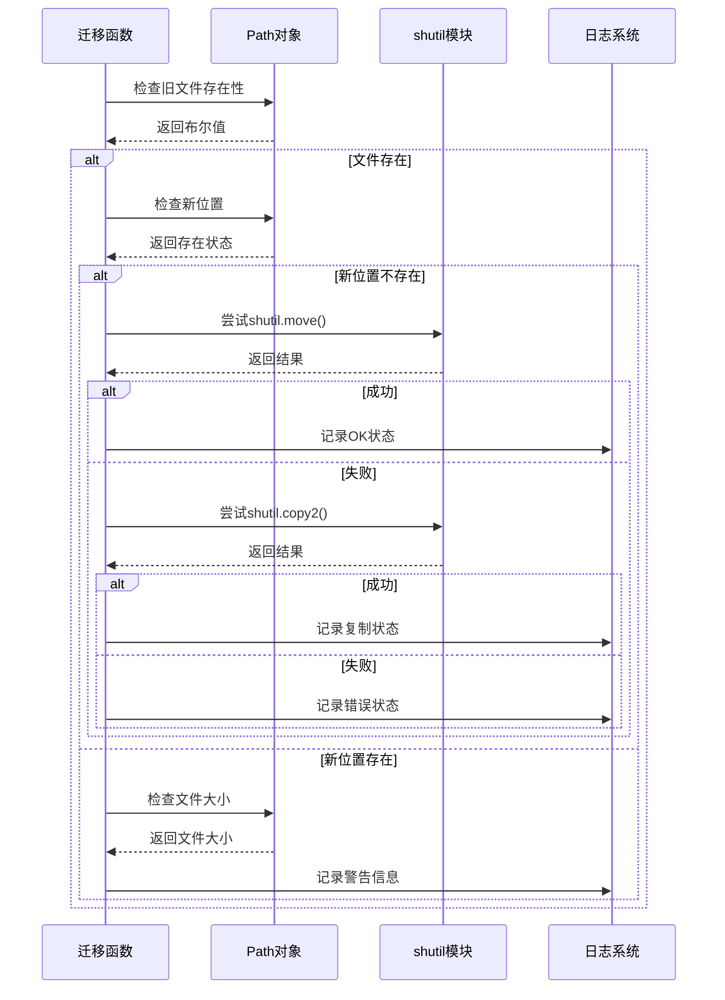
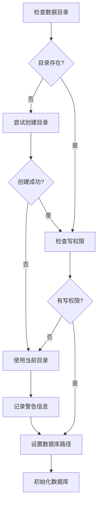
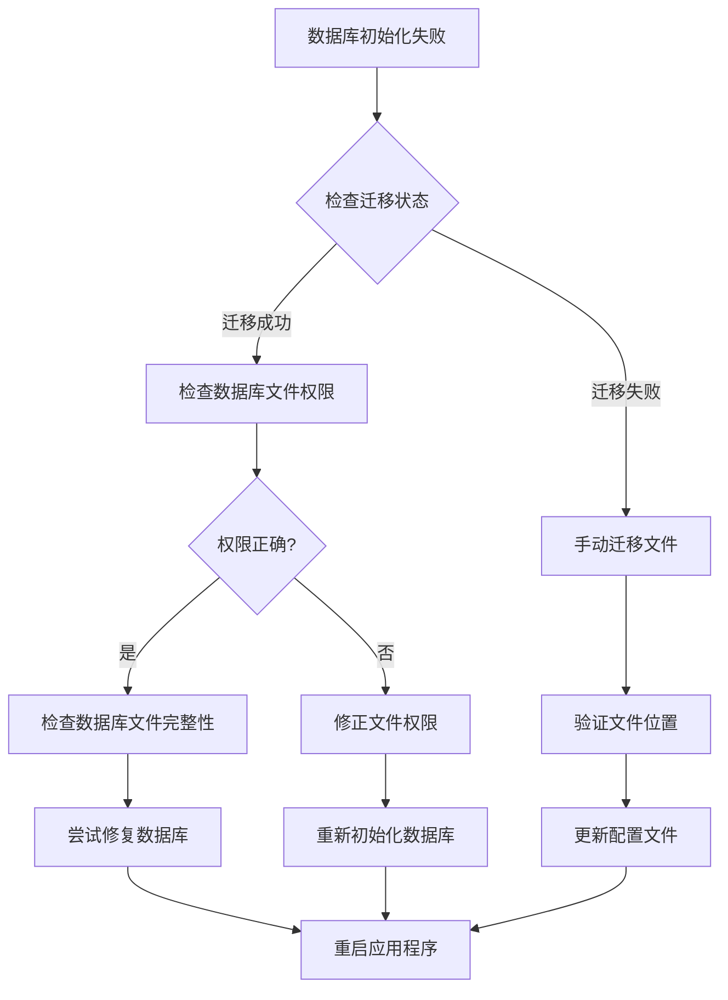

# 数据库迁移机制深度解析

<cite>
**本文档引用的文件**
- [Start.py](file://Start.py)
- [db_manager.py](file://db_manager.py)
- [config.py](file://config.py)
- [global_config.yml](file://global_config.yml)
</cite>

## 目录
1. [概述](#概述)
2. [项目架构分析](#项目架构分析)
3. [数据库迁移机制详解](#数据库迁移机制详解)
4. [核心组件分析](#核心组件分析)
5. [路径管理与跨平台兼容性](#路径管理与跨平台兼容性)
6. [异常处理与回退机制](#异常处理与回退机制)
7. [性能优化策略](#性能优化策略)
8. [最佳实践指南](#最佳实践指南)
9. [故障排除](#故障排除)
10. [总结](#总结)

## 概述

Start.py中的数据库迁移机制是一个精心设计的系统，确保应用程序在启动前能够安全地将旧版数据库文件迁移到新的data目录结构中。该机制的核心在于`_migrate_database_files_early()`函数，它在导入任何其他模块之前执行，避免了因路径配置不一致导致的数据库初始化错误。

### 核心特性

- **早期执行**：在导入db_manager等关键模块之前执行数据库迁移
- **智能检测**：自动识别需要迁移的数据库文件
- **多重备份**：支持主数据库和统计数据库的迁移
- **异常容错**：完善的错误处理和回退机制
- **跨平台兼容**：使用Path对象处理不同操作系统的路径差异

## 项目架构分析



**图表来源**
- [Start.py](file://Start.py#L62-L137)
- [db_manager.py](file://db_manager.py#L18-L65)

**章节来源**
- [Start.py](file://Start.py#L1-L602)
- [db_manager.py](file://db_manager.py#L1-L5103)

## 数据库迁移机制详解

### _migrate_database_files_early()函数核心逻辑

该函数采用三阶段迁移策略：

#### 第一阶段：基础文件迁移


**图表来源**
- [Start.py](file://Start.py#L62-L137)

#### 第二阶段：备份文件处理
备份文件迁移采用类似的策略，但使用通配符匹配模式：
- 搜索模式：`xianyu_data_backup_*.db`
- 迁移策略：优先移动，失败后复制
- 结果汇总：统计成功迁移的备份文件数量

#### 第三阶段：结果输出与状态报告
迁移完成后，系统输出结构化的状态信息：
- 成功迁移的文件列表
- 复制操作的文件标识
- 备份文件迁移统计
- 总体迁移状态

**章节来源**
- [Start.py](file://Start.py#L62-L137)

### 文件迁移策略对比

| 操作类型 | 使用函数 | 适用场景 | 回退策略 |
|---------|---------|---------|---------|
| 移动文件 | `shutil.move()` | 新位置不存在时 | 无（直接替换） |
| 复制文件 | `shutil.copy2()` | 移动失败时 | 保留原始文件 |
| 备份迁移 | `shutil.move()` | 备份文件处理 | 记录失败状态 |

## 核心组件分析

### 路径管理与文件操作

#### Path对象的跨平台优势
系统大量使用`pathlib.Path`对象而非字符串路径，提供以下优势：
- **统一语法**：跨平台兼容的路径操作
- **类型安全**：编译时检查路径操作
- **链式调用**：流畅的API设计

#### 文件检查与状态验证


**图表来源**
- [Start.py](file://Start.py#L82-L112)

**章节来源**
- [Start.py](file://Start.py#L62-L137)

### 异常处理机制

#### 分层异常处理策略
1. **迁移失败层**：捕获文件操作异常，记录错误但不中断启动
2. **模块导入层**：捕获迁移函数执行异常，确保程序继续运行
3. **数据库初始化层**：依赖迁移结果，但具备降级处理能力

#### 错误恢复策略
- **静默失败**：迁移失败不影响主程序启动
- **状态标记**：明确区分移动和复制操作
- **用户提示**：提供清晰的操作建议

**章节来源**
- [Start.py](file://Start.py#L139-L144)

## 路径管理与跨平台兼容性

### 环境变量配置支持

系统通过环境变量`DB_PATH`支持自定义数据库路径：
```python
# db_manager.py中的路径配置
db_path = os.getenv('DB_PATH', 'data/xianyu_data.db')
```

### 目录权限检查与处理



**图表来源**
- [db_manager.py](file://db_manager.py#L25-L47)

**章节来源**
- [db_manager.py](file://db_manager.py#L18-L65)

## 异常处理与回退机制

### 迁移失败的优雅降级

系统设计了多层次的异常处理机制：

#### 1. 文件操作异常处理
- **移动失败**：自动降级为复制操作
- **权限错误**：记录警告并继续
- **磁盘空间不足**：捕获异常并报告

#### 2. 模块导入异常处理
- **迁移函数异常**：捕获并记录，不影响主程序启动
- **数据库初始化异常**：具备降级处理能力

#### 3. 用户反馈机制
- **结构化输出**：使用预定义的状态标识符
- **详细日志**：提供完整的错误上下文
- **操作建议**：指导用户进行后续操作

**章节来源**
- [Start.py](file://Start.py#L139-L144)

## 性能优化策略

### 迁移效率优化

#### 批量文件处理
- **一次性检查**：预先扫描所有目标文件
- **并行处理**：独立文件的迁移操作
- **进度跟踪**：实时统计迁移进度

#### 内存使用优化
- **流式处理**：大文件的分块处理
- **及时释放**：操作完成后立即清理资源
- **缓存策略**：避免重复的文件系统查询

### 启动时间优化

```mermaid
gantt
title 启动时间分布
dateFormat X
axisFormat %s
section 数据库迁移
迁移检查 :milestone, m1, 0, 0
文件移动 :active, m2, 0, 5
备份迁移 :active, m3, 5, 8
结果输出 :milestone, m4, 8, 8
section 模块导入
db_manager导入 :active, m5, 8, 15
其他模块导入 :active, m6, 15, 25
```



**图表来源**
- [Start.py](file://Start.py#L139-L144)

## 最佳实践指南

### 开发者指南

#### 1. 数据库文件组织
- **推荐结构**：所有数据库文件集中存放在`data/`目录
- **命名规范**：使用描述性的文件名，如`xianyu_data.db`
- **备份策略**：定期创建备份文件，命名格式：`xianyu_data_backup_YYYYMMDD.db`

#### 2. 迁移脚本开发
- **测试环境**：在开发环境中充分测试迁移逻辑
- **回滚计划**：准备完整的数据回滚方案
- **监控指标**：监控迁移过程的关键指标

#### 3. 生产环境部署
- **预检查**：部署前验证文件权限和磁盘空间
- **备份验证**：确保备份文件的完整性
- **监控告警**：设置迁移失败的告警机制

### 用户操作指南

#### 1. 迁移前准备
- **备份重要数据**：在执行迁移前备份所有数据库文件
- **检查磁盘空间**：确保有足够的空间容纳新位置的文件
- **关闭应用程序**：在迁移过程中关闭相关应用程序

#### 2. 迁移后验证
- **功能测试**：验证应用程序的各项功能正常
- **数据完整性**：检查数据库中的数据是否完整
- **性能监控**：观察应用程序的性能表现

## 故障排除

### 常见问题与解决方案

#### 1. 迁移失败问题

| 问题症状 | 可能原因 | 解决方案 |
|---------|---------|---------|
| 文件移动失败 | 权限不足 | 检查目录权限，提升用户权限 |
| 磁盘空间不足 | 存储空间不够 | 清理磁盘空间或选择其他位置 |
| 文件锁定 | 应用程序占用 | 关闭相关应用程序后再尝试 |
| 路径无效 | 路径配置错误 | 检查环境变量和配置文件 |

#### 2. 数据库初始化问题



**图表来源**
- [db_manager.py](file://db_manager.py#L440-L451)

#### 3. 性能问题诊断

- **慢速迁移**：检查磁盘I/O性能，考虑使用SSD
- **内存占用高**：优化批量处理逻辑，减少内存峰值
- **CPU占用高**：检查文件系统性能，优化路径操作

**章节来源**
- [Start.py](file://Start.py#L95-L112)
- [db_manager.py](file://db_manager.py#L440-L451)

## 总结

Start.py中的数据库迁移机制展现了现代软件工程的最佳实践：

### 设计亮点
1. **时机控制**：在模块导入前执行迁移，避免路径配置冲突
2. **容错设计**：多层次的异常处理确保系统稳定性
3. **用户体验**：清晰的状态反馈和操作指导
4. **跨平台兼容**：统一的路径处理机制

### 技术价值
- **可靠性**：完善的错误处理和回退机制
- **可维护性**：模块化的代码结构和清晰的职责分离
- **扩展性**：灵活的配置支持和插件化设计
- **性能**：高效的文件操作和资源管理

### 实际应用意义
该迁移机制不仅解决了当前的数据库文件组织问题，更为未来的系统演进奠定了坚实的基础。通过早期迁移策略，系统能够在不影响用户体验的前提下，平滑地完成架构升级和数据重构。

这种设计思路值得在其他大型项目中推广，特别是在涉及数据迁移、配置管理和服务启动的场景中。通过合理的架构设计和完善的异常处理，可以显著提升系统的稳定性和用户体验。