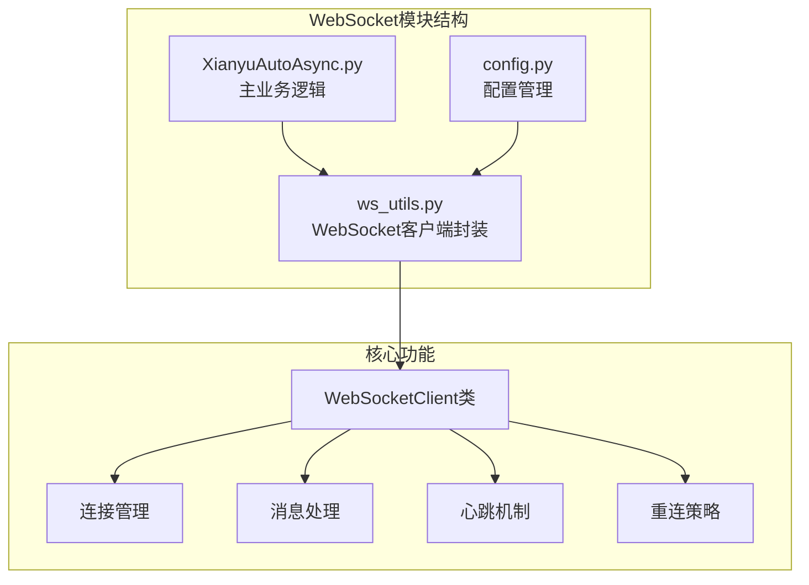
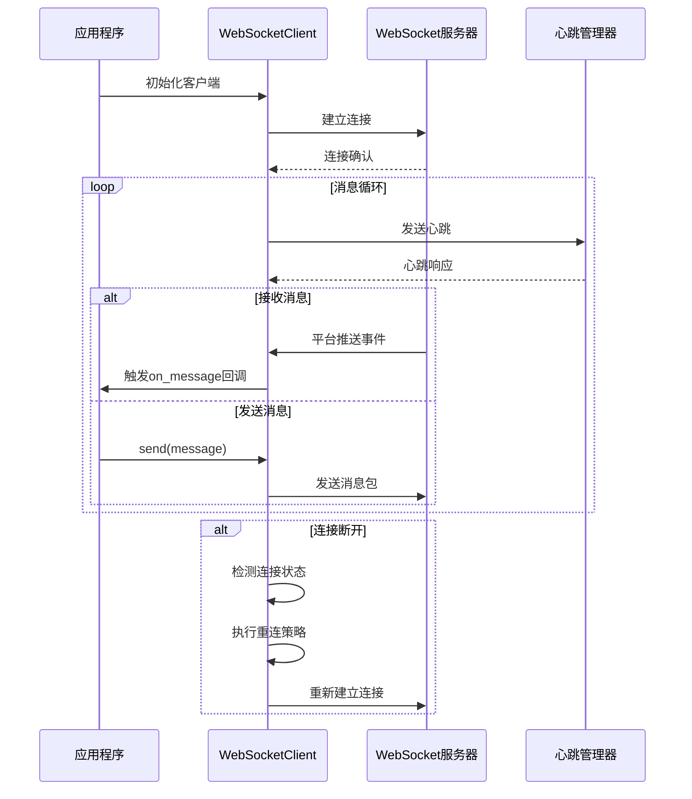
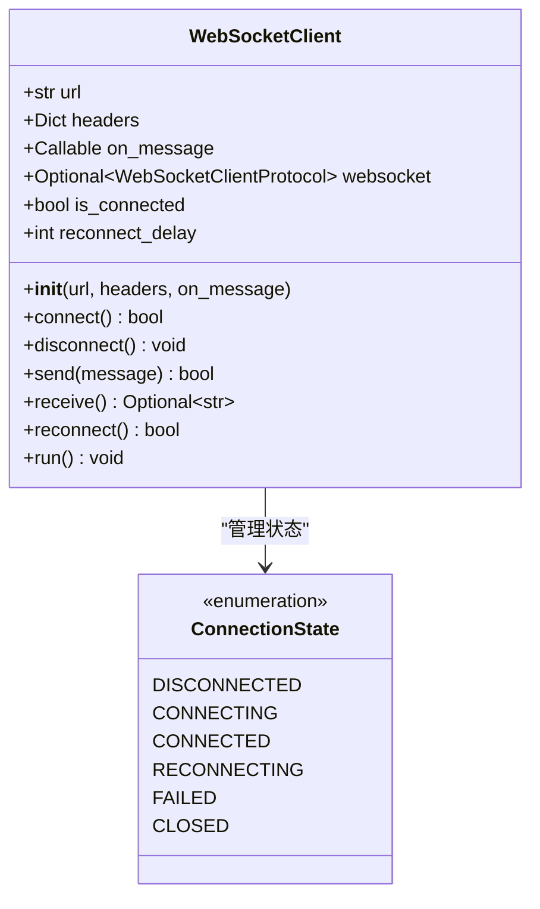
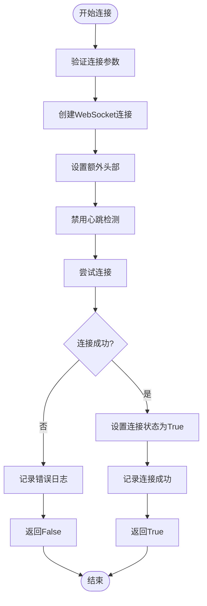
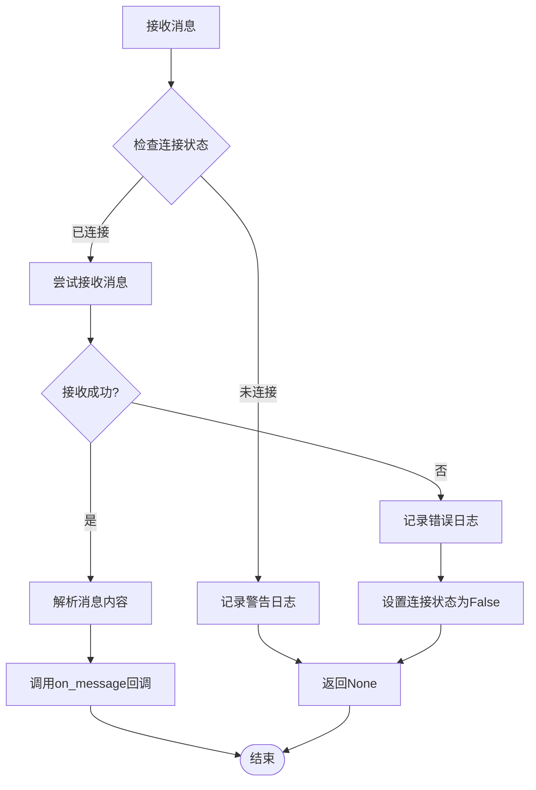
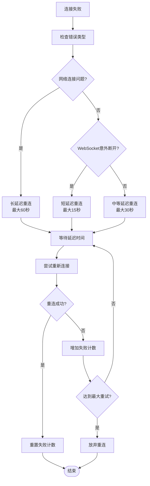
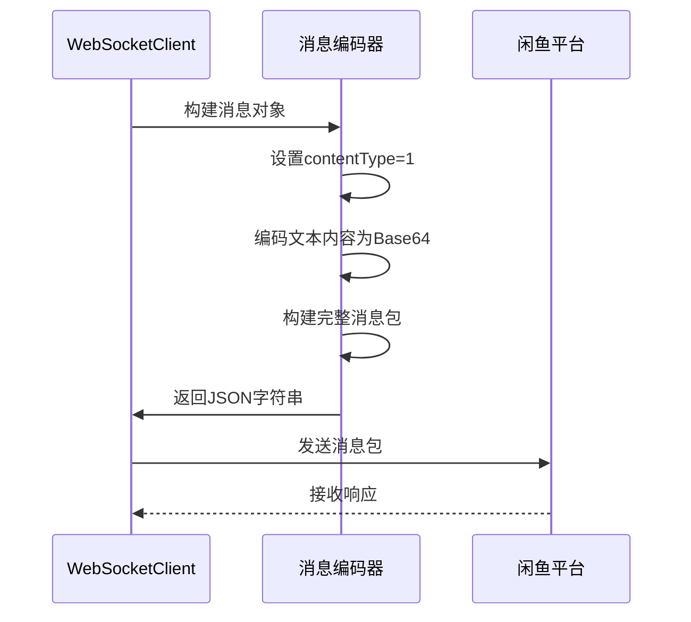
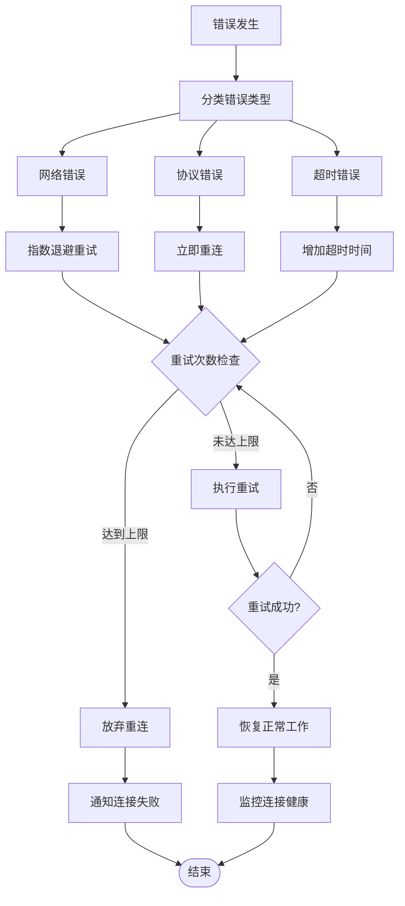
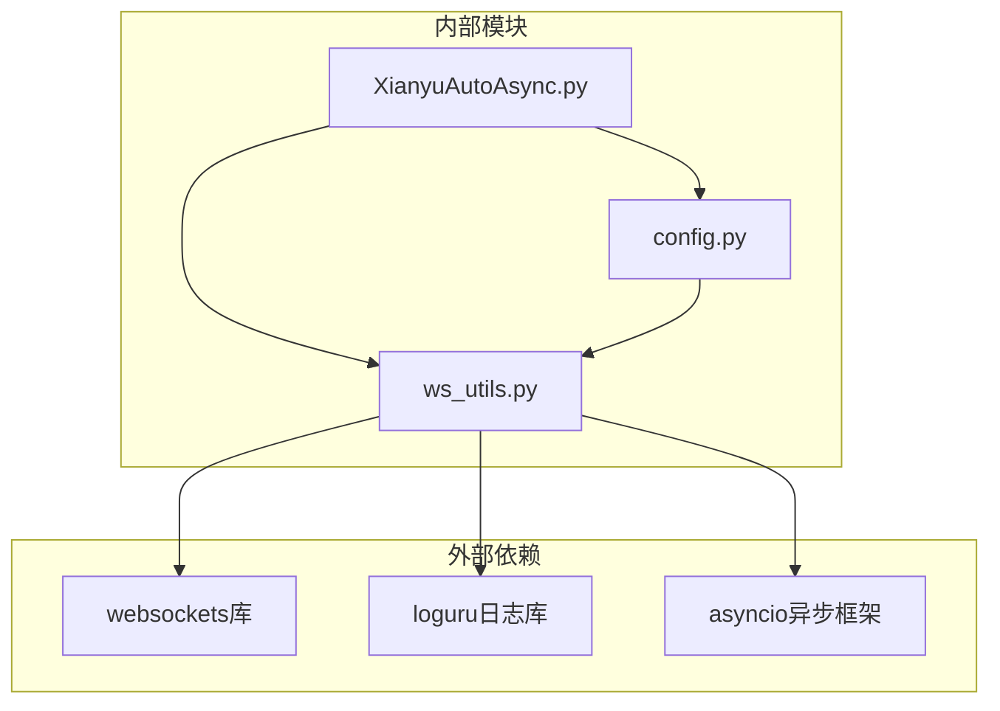

# WebSocket通信封装 (ws_utils.py)

<cite>
**本文档中引用的文件**
- [ws_utils.py](file://utils/ws_utils.py)
- [XianyuAutoAsync.py](file://XianyuAutoAsync.py)
- [config.py](file://config.py)
- [global_config.yml](file://global_config.yml)
</cite>

## 目录
1. [简介](#简介)
2. [项目结构](#项目结构)
3. [核心组件](#核心组件)
4. [架构概览](#架构概览)
5. [详细组件分析](#详细组件分析)
6. [依赖关系分析](#依赖关系分析)
7. [性能考虑](#性能考虑)
8. [故障排除指南](#故障排除指南)
9. [结论](#结论)

## 简介

ws_utils.py是xianyu-auto-reply项目中的核心WebSocket通信模块，提供了对底层websockets库的高级封装。该模块实现了完整的WebSocket连接管理、消息编解码、心跳维持和异常重连机制，为上层业务逻辑提供了简洁易用的接口。

主要特性包括：
- 抽象底层websockets库，提供高层级的send_message和on_message接口
- 实现二进制帧与文本帧的统一处理
- 提供可靠的消息顺序保证和完整性检查
- 实现智能重连策略和网络中断恢复
- 支持自定义头部和连接参数配置

## 项目结构

**图表来源**
- [ws_utils.py](file://utils/ws_utils.py#L1-L89)
- [XianyuAutoAsync.py](file://XianyuAutoAsync.py#L1-L100)

**章节来源**
- [ws_utils.py](file://utils/ws_utils.py#L1-L89)
- [config.py](file://config.py#L1-L126)

## 核心组件

WebSocketClient类是整个模块的核心，提供了完整的WebSocket通信能力：

### 主要属性
- `url`: WebSocket服务器地址
- `headers`: 连接头部信息
- `on_message`: 消息回调函数
- `websocket`: WebSocket协议对象
- `is_connected`: 连接状态标志
- `reconnect_delay`: 重连延迟时间

### 核心方法
- `connect()`: 建立WebSocket连接
- `disconnect()`: 关闭WebSocket连接
- `send(message)`: 发送消息
- `receive()`: 接收消息
- `reconnect()`: 执行重连操作
- `run()`: 主运行循环

**章节来源**
- [ws_utils.py](file://utils/ws_utils.py#L6-L89)

## 架构概览

**图表来源**
- [ws_utils.py](file://utils/ws_utils.py#L73-L89)
- [XianyuAutoAsync.py](file://XianyuAutoAsync.py#L5198-L5255)

## 详细组件分析

### WebSocketClient类设计

**图表来源**
- [ws_utils.py](file://utils/ws_utils.py#L6-L89)
- [XianyuAutoAsync.py](file://XianyuAutoAsync.py#L29-L36)

#### 连接建立机制

WebSocketClient采用异步连接模式，支持自定义头部和连接参数：

**图表来源**
- [ws_utils.py](file://utils/ws_utils.py#L16-L30)

#### 消息处理流程

**图表来源**
- [ws_utils.py](file://utils/ws_utils.py#L53-L65)

#### 重连策略实现

WebSocketClient实现了智能重连机制，根据不同的错误类型采用不同的重连策略：

**图表来源**
- [XianyuAutoAsync.py](file://XianyuAutoAsync.py#L453-L466)

### XianyuAutoAsync中的实际应用

在XianyuAutoAsync.py中，WebSocketClient被用于处理闲鱼平台的实时消息推送：

#### 消息加密与编码

**图表来源**
- [XianyuAutoAsync.py](file://XianyuAutoAsync.py#L5098-L5141)

#### 平台推送事件处理

WebSocketClient通过on_message回调处理来自闲鱼平台的各种推送事件：

| 事件类型 | 处理方式 | 业务逻辑 |
|---------|---------|---------|
| 消息通知 | 解析消息内容 | 触发自动回复机制 |
| 订单状态变更 | 更新订单状态 | 自动发货处理 |
| 用户互动 | 记录互动历史 | 防重复处理 |
| 系统通知 | 显示系统消息 | 用户提醒 |

**章节来源**
- [XianyuAutoAsync.py](file://XianyuAutoAsync.py#L5098-L5141)

### 错误处理策略

#### 网络中断恢复

WebSocketClient实现了多层次的错误处理和恢复机制：

**图表来源**
- [XianyuAutoAsync.py](file://XianyuAutoAsync.py#L453-L466)

#### 调试与日志追踪

模块提供了完整的日志记录功能，支持详细的WebSocket状态跟踪：

| 日志级别 | 记录内容 | 触发条件 |
|---------|---------|---------|
| DEBUG | 连接细节 | 连接建立/断开 |
| INFO | 状态变化 | 连接状态切换 |
| WARNING | 异常情况 | 重连尝试 |
| ERROR | 错误信息 | 连接失败/消息处理错误 |

**章节来源**
- [ws_utils.py](file://utils/ws_utils.py#L26-L30)
- [ws_utils.py](file://utils/ws_utils.py#L37-L40)

## 依赖关系分析

**图表来源**
- [ws_utils.py](file://utils/ws_utils.py#L1-L4)
- [config.py](file://config.py#L1-L126)

**章节来源**
- [ws_utils.py](file://utils/ws_utils.py#L1-L4)
- [config.py](file://config.py#L89-L106)

## 性能考虑

### 连接池管理

WebSocketClient采用单连接管理模式，避免了连接池的复杂性，同时通过智能重连机制保证了连接的可靠性。

### 消息队列处理

虽然当前实现是单线程的，但通过异步编程模型确保了高并发场景下的性能表现。

### 内存管理

模块实现了自动的资源清理机制，包括连接关闭、异常处理和状态重置。

## 故障排除指南

### 常见问题诊断

#### 连接失败问题

1. **检查网络连接**: 确保网络稳定性和防火墙设置
2. **验证URL配置**: 检查WEBSOCKET_URL配置是否正确
3. **查看日志输出**: 分析连接失败的具体原因

#### 消息丢失问题

1. **检查连接状态**: 确认WebSocket连接是否保持活跃
2. **验证消息格式**: 确保发送的消息符合平台要求
3. **监控重连机制**: 检查重连策略是否正常工作

#### 性能优化建议

1. **调整重连间隔**: 根据网络状况优化重连延迟
2. **启用消息去重**: 实现消息ID去重机制
3. **监控连接健康**: 定期检查连接状态和性能指标

**章节来源**
- [ws_utils.py](file://utils/ws_utils.py#L73-L89)

## 结论

ws_utils.py模块为xianyu-auto-reply项目提供了稳定可靠的WebSocket通信基础。通过抽象底层websockets库，实现了简洁的高层接口，同时提供了完整的错误处理和重连机制。

### 主要优势

1. **简单易用**: 提供直观的send和receive接口
2. **可靠稳定**: 实现智能重连和错误恢复机制
3. **灵活配置**: 支持自定义连接参数和头部信息
4. **性能优化**: 采用异步编程模型，支持高并发处理

### 应用价值

该模块成功支撑了闲鱼平台的自动化消息处理和实时交互功能，为项目的稳定运行提供了重要保障。通过完善的日志记录和调试支持，也为开发和运维工作提供了便利。