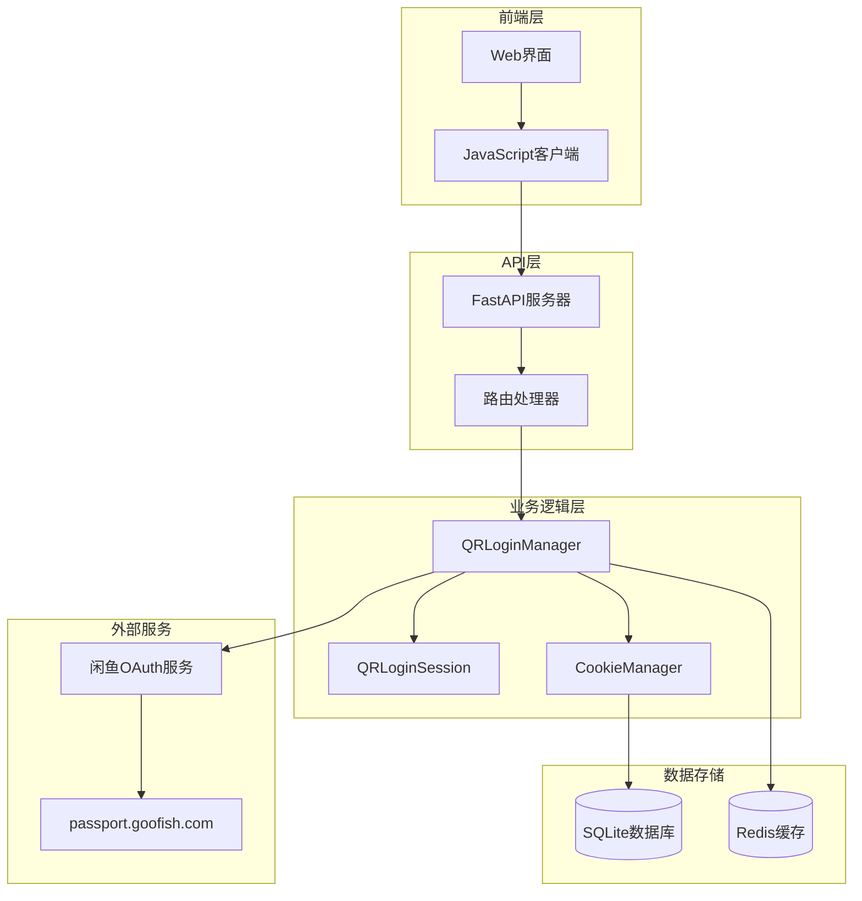
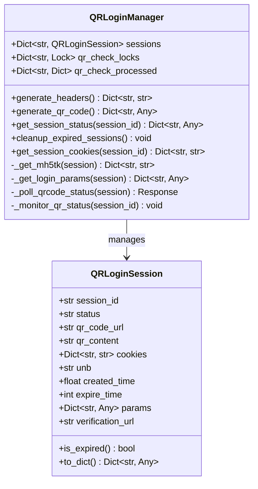
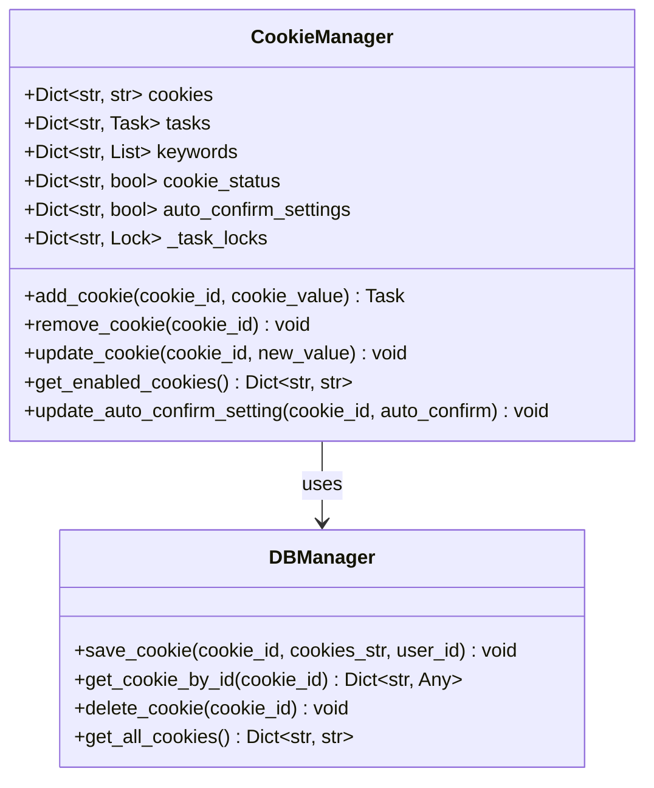
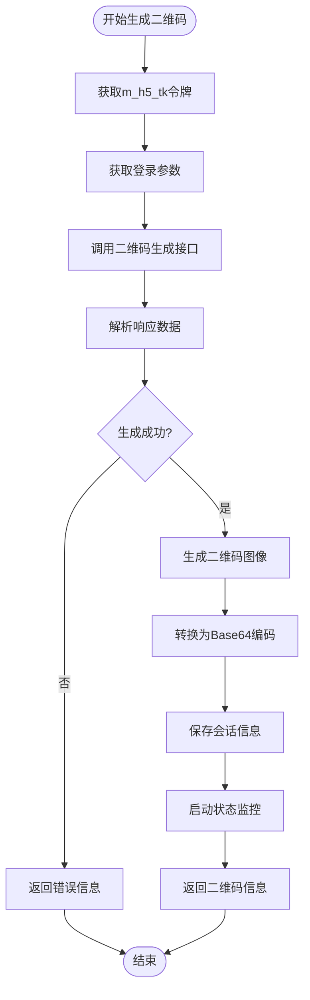
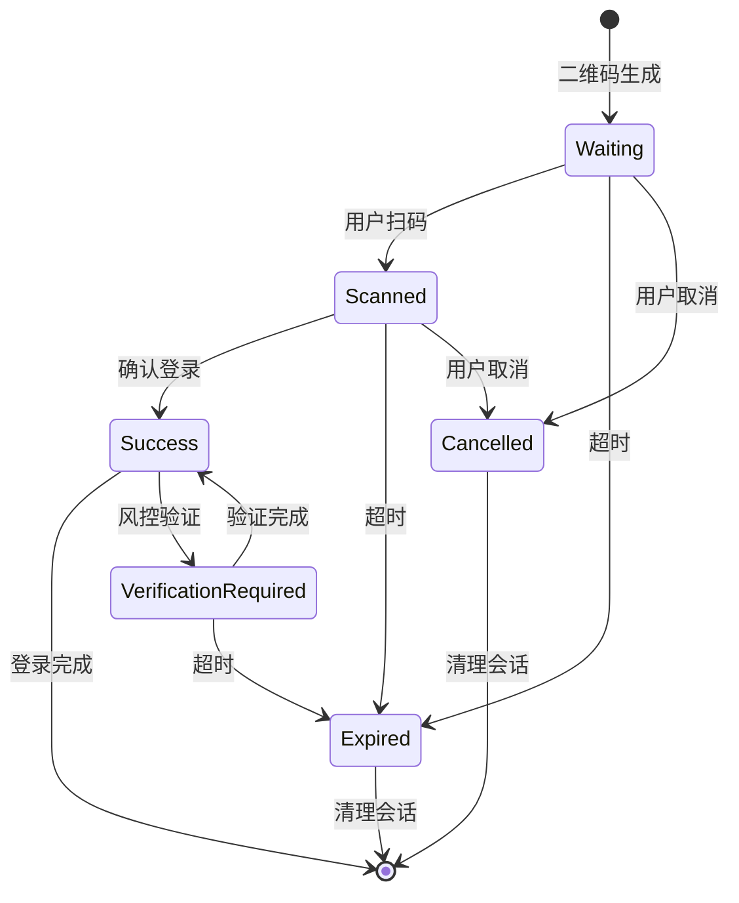
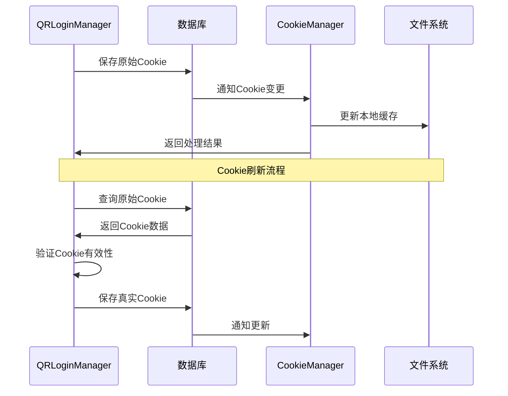
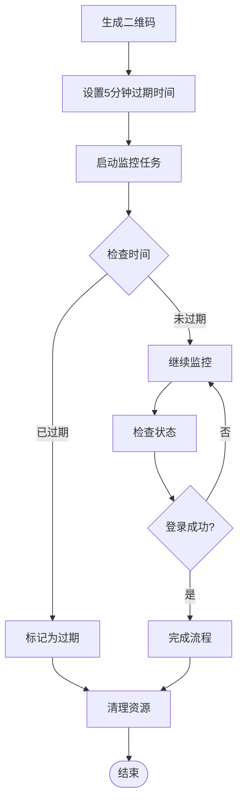
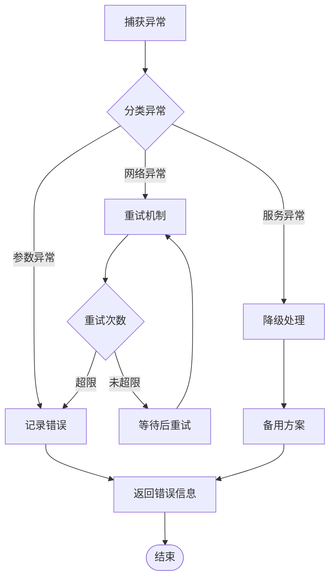
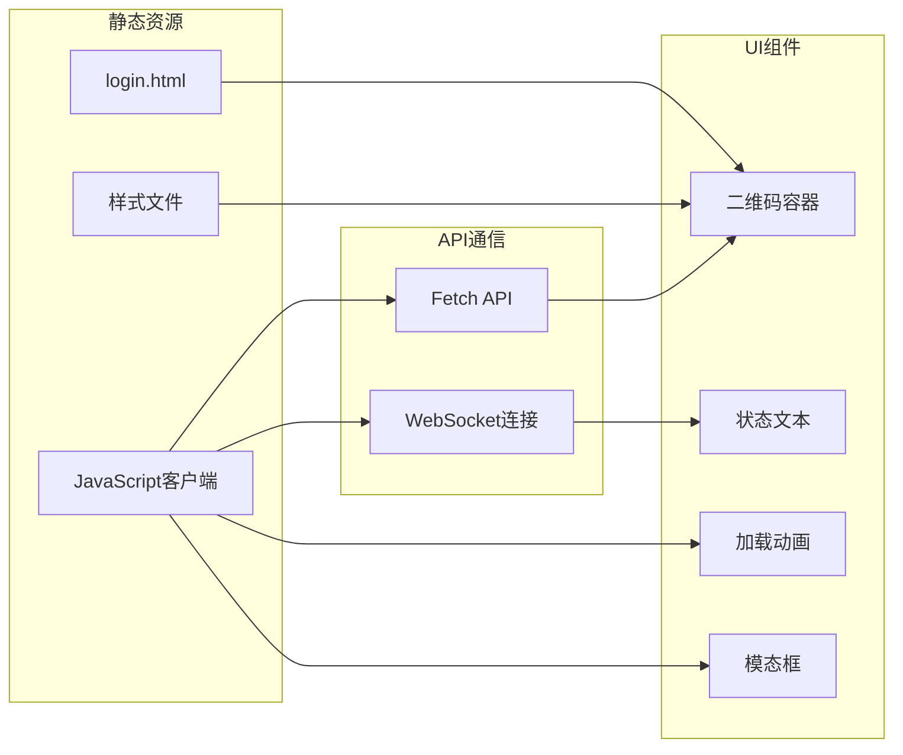
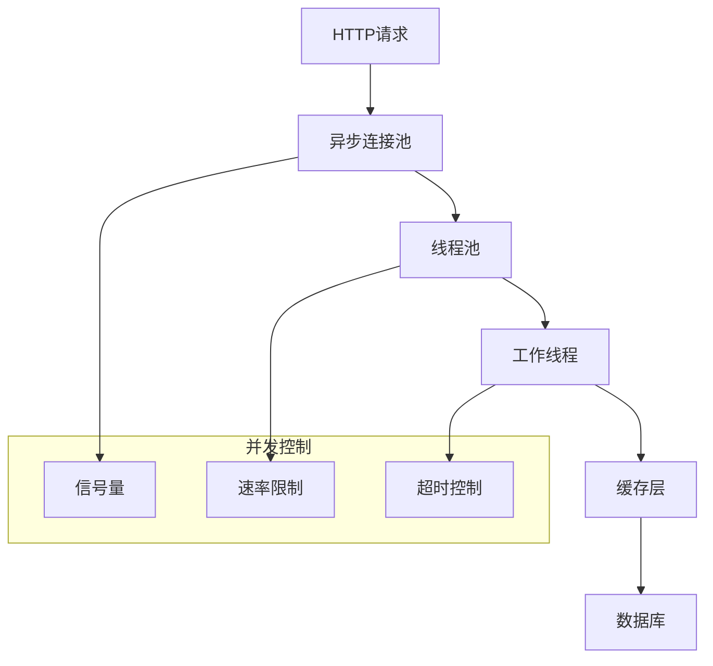

# 二维码登录管理 (qr_login.py)

<cite>
**本文档引用的文件**
- [qr_login.py](file://utils/qr_login.py)
- [cookie_manager.py](file://cookie_manager.py)
- [reply_server.py](file://reply_server.py)
- [login.html](file://static/login.html)
- [app.js](file://static/js/app.js)
- [db_manager.py](file://db_manager.py)
</cite>

## 目录
1. [简介](#简介)
2. [系统架构概览](#系统架构概览)
3. [核心组件分析](#核心组件分析)
4. [二维码生成流程](#二维码生成流程)
5. [状态轮询机制](#状态轮询机制)
6. [与闲鱼OAuth服务交互](#与闲鱼oauth服务交互)
7. [Cookie持久化存储](#cookie持久化存储)
8. [安全性措施](#安全性措施)
9. [异常处理机制](#异常处理机制)
10. [Web界面集成](#web界面集成)
11. [性能优化考虑](#性能优化考虑)
12. [故障排除指南](#故障排除指南)

## 简介

二维码登录管理系统是一个基于Python的自动化解决方案，专门设计用于实现闲鱼平台的扫码登录功能。该系统通过模拟移动设备的扫码登录过程，与闲鱼OAuth服务进行交互，获取用户的长期有效Cookie凭证，并将其持久化存储以便后续业务逻辑使用。

系统采用异步架构设计，支持高并发的二维码生成和状态检查，具备完善的异常处理机制和安全控制措施，能够有效应对各种网络环境和用户操作场景。

## 系统架构概览



**图表来源**
- [qr_login.py](file://utils/qr_login.py#L79-L452)
- [reply_server.py](file://reply_server.py#L1966-L2334)
- [cookie_manager.py](file://cookie_manager.py#L10-L428)

## 核心组件分析

### QRLoginManager类

QRLoginManager是系统的核心控制器，负责管理整个二维码登录流程的生命周期。



**图表来源**
- [qr_login.py](file://utils/qr_login.py#L49-L80)
- [qr_login.py](file://utils/qr_login.py#L79-L452)

### CookieManager类

CookieManager负责管理所有账号的Cookie信息，提供持久化存储和生命周期管理功能。



**图表来源**
- [cookie_manager.py](file://cookie_manager.py#L10-L428)
- [db_manager.py](file://db_manager.py#L16-L200)

**章节来源**
- [qr_login.py](file://utils/qr_login.py#L79-L452)
- [cookie_manager.py](file://cookie_manager.py#L10-L428)

## 二维码生成流程

二维码生成是整个登录流程的第一步，涉及多个复杂的HTTP请求和数据处理步骤。

### 生成流程图



**图表来源**
- [qr_login.py](file://utils/qr_login.py#L201-L292)

### 关键技术细节

1. **m_h5_tk令牌获取**：系统首先向闲鱼API发送GET请求，获取必要的身份验证令牌
2. **登录参数收集**：通过解析HTML页面中的JavaScript变量，提取登录所需的表单参数
3. **二维码生成**：使用HTTP GET请求调用闲鱼的二维码生成接口，获取二维码内容
4. **图像处理**：利用qrcode库将文本内容转换为PNG格式的二维码图像
5. **Base64编码**：将二维码图像转换为Base64编码，便于在Web界面中显示

**章节来源**
- [qr_login.py](file://utils/qr_login.py#L201-L292)

## 状态轮询机制

系统采用异步轮询机制监控二维码的状态变化，确保及时响应用户的扫码操作。

### 轮询状态机



**图表来源**
- [qr_login.py](file://utils/qr_login.py#L305-L402)

### 轮询策略

系统实现了智能的轮询策略，根据不同的状态调整检查频率：

- **等待扫码阶段**：每0.8秒检查一次
- **已扫码待确认阶段**：每0.8秒检查一次  
- **处理中状态**：每2秒检查一次
- **超时处理**：5分钟无操作自动过期

**章节来源**
- [qr_login.py](file://utils/qr_login.py#L305-L402)

## 与闲鱼OAuth服务交互

系统通过一系列精心设计的HTTP请求与闲鱼OAuth服务进行交互，实现完整的登录流程。

### API接口映射

| 接口名称 | URL | 方法 | 功能描述 |
|---------|-----|------|----------|
| mini_login.htm | https://passport.goofish.com/mini_login.htm | GET | 获取登录参数 |
| newlogin/qrcode/generate.do | https://passport.goofish.com/newlogin/qrcode/generate.do | GET | 生成二维码 |
| newlogin/qrcode/query.do | https://passport.goofish.com/newlogin/qrcode/query.do | POST | 查询状态 |

### 请求头标准化

系统定义了统一的请求头模板，确保与闲鱼服务的兼容性：

```python
headers = {
    'User-Agent': 'Mozilla/5.0 (Windows NT 10.0; Win64; x64) AppleWebKit/537.36',
    'Accept': 'application/json, text/plain, */*',
    'Accept-Language': 'zh-CN,zh;q=0.9,en;q=0.8',
    'Connection': 'keep-alive',
    'Referer': 'https://passport.goofish.com/',
    'Origin': 'https://passport.goofish.com',
}
```

**章节来源**
- [qr_login.py](file://utils/qr_login.py#L21-L34)
- [qr_login.py](file://utils/qr_login.py#L83-L96)

## Cookie持久化存储

成功获取的Cookie需要经过严格的验证和持久化处理，确保系统的稳定性和安全性。

### 存储流程



**图表来源**
- [reply_server.py](file://reply_server.py#L2024-L2035)
- [reply_server.py](file://reply_server.py#L2189-L2247)

### 数据库表结构

系统使用SQLite数据库存储Cookie信息，主要表结构如下：

| 表名 | 字段 | 类型 | 描述 |
|------|------|------|------|
| cookies | id | TEXT | Cookie唯一标识 |
| cookies | value | TEXT | Cookie字符串 |
| cookies | user_id | INTEGER | 用户ID外键 |
| cookies | auto_confirm | INTEGER | 自动确认发货设置 |
| cookies | remark | TEXT | 备注信息 |
| cookies | created_at | TIMESTAMP | 创建时间 |

**章节来源**
- [db_manager.py](file://db_manager.py#L110-L123)

## 安全性措施

系统实现了多层次的安全控制机制，确保二维码登录过程的安全可靠。

### 二维码有效期控制



**图表来源**
- [qr_login.py](file://utils/qr_login.py#L60-L66)
- [qr_login.py](file://utils/qr_login.py#L305-L402)

### 一次性使用限制

系统通过以下机制确保二维码的一次性使用：

1. **会话隔离**：每个二维码生成独立的会话ID
2. **状态跟踪**：严格跟踪二维码的各个状态变化
3. **并发控制**：使用锁机制防止并发访问冲突
4. **自动清理**：过期会话自动清理，防止资源泄漏

### 风控验证机制

当检测到账号存在风控时，系统会自动触发手机验证流程：

```python
if qrcode_status == "CONFIRMED" and iframeRedirect:
    session.status = 'verification_required'
    session.verification_url = iframe_url
    logger.warning(f"账号被风控，需要手机验证: {session_id}")
```

**章节来源**
- [qr_login.py](file://utils/qr_login.py#L342-L351)

## 异常处理机制

系统实现了全面的异常处理机制，能够优雅地处理各种异常情况。

### 异常类型分类

| 异常类型 | 触发条件 | 处理策略 |
|----------|----------|----------|
| GetLoginParamsError | 获取登录参数失败 | 返回错误信息，终止流程 |
| GetLoginQRCodeError | 二维码生成失败 | 返回错误信息，终止流程 |
| NotLoginError | 未登录错误 | 返回未登录状态 |
| ConnectTimeout | 连接超时 | 重试机制，最终失败 |
| ReadTimeout | 读取超时 | 重试机制，最终失败 |
| ConnectError | 连接错误 | 检查网络，返回错误 |

### 错误恢复策略



**图表来源**
- [qr_login.py](file://utils/qr_login.py#L39-L47)
- [qr_login.py](file://utils/qr_login.py#L281-L292)

### 用户体验优化

系统在异常处理中特别注重用户体验：

1. **友好的错误提示**：向用户提供清晰的错误信息
2. **自动重试**：对于临时性错误自动重试
3. **状态反馈**：实时反馈操作状态
4. **资源清理**：确保异常情况下资源得到正确释放

**章节来源**
- [qr_login.py](file://utils/qr_login.py#L281-L292)

## Web界面集成

系统提供了完整的Web界面集成方案，支持动态刷新的登录二维码显示。

### 前端架构



**图表来源**
- [login.html](file://static/login.html#L1-L724)
- [app.js](file://static/js/app.js#L7445-L7571)

### 动态刷新机制

前端实现了智能的二维码刷新机制：

```javascript
// 二维码生成
async function generateQRCode() {
    const response = await fetch(`${apiBase}/qr-login/generate`);
    const data = await response.json();
    if (data.success) {
        qrCodeSessionId = data.session_id;
        showQRCodeImage(data.qr_code_url);
        startQRCodeCheck();
    }
}

// 状态检查
async function checkQRCodeStatus() {
    const response = await fetch(`${apiBase}/qr-login/check/${qrCodeSessionId}`);
    const data = await response.json();
    
    switch(data.status) {
        case 'waiting':
            document.getElementById('statusText').textContent = '等待扫码...';
            break;
        case 'scanned':
            document.getElementById('statusText').textContent = '已扫码，请确认...';
            break;
        case 'success':
            handleQRCodeSuccess(data);
            break;
    }
}
```

### 实时状态更新

系统支持实时的状态更新和用户反馈：

1. **状态轮询**：每2秒检查一次二维码状态
2. **即时反馈**：用户扫码后立即显示确认状态
3. **错误提示**：二维码过期或取消时提供明确提示
4. **自动刷新**：登录成功后自动刷新页面

**章节来源**
- [app.js](file://static/js/app.js#L7445-L7571)
- [app.js](file://static/js/app.js#L7524-L7571)

## 性能优化考虑

系统在设计时充分考虑了性能优化，确保在高并发场景下的稳定运行。

### 异步处理优化



### 缓存策略

系统实现了多层缓存策略：

1. **会话缓存**：内存中缓存活跃的二维码会话
2. **Cookie缓存**：缓存已验证的Cookie信息
3. **配置缓存**：缓存系统配置和用户设置
4. **DNS缓存**：减少DNS查询开销

### 资源管理

```python
# 连接池配置
self.timeout = httpx.Timeout(connect=30.0, read=60.0, write=30.0, pool=60.0)

# 会话清理
def cleanup_expired_sessions(self):
    expired_sessions = []
    for session_id, session in self.sessions.items():
        if session.is_expired():
            expired_sessions.append(session_id)
    for session_id in expired_sessions:
        del self.sessions[session_id]
```

**章节来源**
- [qr_login.py](file://utils/qr_login.py#L95-L97)
- [qr_login.py](file://utils/qr_login.py#L429-L439)

## 故障排除指南

### 常见问题及解决方案

| 问题类型 | 症状 | 可能原因 | 解决方案 |
|----------|------|----------|----------|
| 二维码生成失败 | 返回错误信息 | 网络连接问题、服务不可用 | 检查网络连接，重试请求 |
| 扫码后无响应 | 状态一直为waiting | 服务端轮询异常 | 检查后台服务状态 |
| Cookie获取失败 | 登录成功但无Cookie | 验证流程异常 | 检查风控验证状态 |
| 会话超时 | 二维码很快过期 | 时间同步问题 | 检查系统时间 |
| 并发冲突 | 状态检查异常 | 竞态条件 | 检查锁机制 |

### 调试技巧

1. **日志分析**：查看详细的日志输出，定位问题根因
2. **网络抓包**：使用抓包工具分析HTTP请求和响应
3. **状态监控**：监控系统关键指标和状态变化
4. **单元测试**：编写针对性的单元测试验证功能

### 监控指标

系统建议监控以下关键指标：

- **二维码生成成功率**
- **状态轮询响应时间**
- **Cookie获取成功率**
- **会话清理效率**
- **并发处理能力**

**章节来源**
- [qr_login.py](file://utils/qr_login.py#L281-L292)
- [reply_server.py](file://reply_server.py#L1966-L2334)