# 商品搜索工具 (item_search.py) 详细技术文档

<cite>
**本文档中引用的文件**
- [item_search.py](file://utils/item_search.py)
- [xianyu_utils.py](file://utils/xianyu_utils.py)
- [config.py](file://config.py)
- [xianyu_slider_stealth.py](file://utils/xianyu_slider_stealth.py)
- [slider_patch.py](file://utils/slider_patch.py)
- [global_config.yml](file://global_config.yml)
- [reply_server.py](file://reply_server.py)
- [app.js](file://static/js/app.js)
</cite>

## 目录
1. [项目概述](#项目概述)
2. [核心架构设计](#核心架构设计)
3. [Playwright浏览器配置](#playwright浏览器配置)
4. [反检测策略实现](#反检测策略实现)
5. [滑块验证处理机制](#滑块验证处理机制)
6. [多页搜索算法](#多页搜索算法)
7. [数据解析与提取](#数据解析与提取)
8. [性能优化策略](#性能优化策略)
9. [错误处理与重试机制](#错误处理与重试机制)
10. [部署配置与最佳实践](#部署配置与最佳实践)

## 项目概述

闲鱼商品搜索工具是一个基于Playwright库构建的智能爬虫系统，专门用于模拟真实用户行为，在闲鱼平台上实现商品的多页搜索与数据抓取。该系统具备强大的反检测能力、智能的滑块验证处理和高效的数据解析功能。

### 主要特性

- **真实用户行为模拟**：完全模拟人类用户的浏览和交互行为
- **智能反检测机制**：集成先进的stealth插件，隐藏自动化特征
- **多页数据抓取**：支持大规模商品数据的批量获取
- **智能滑块处理**：自动识别并处理各种类型的验证码滑块
- **数据质量保证**：提供真实数据和备用数据双重保障
- **高并发支持**：优化的异步处理架构

## 核心架构设计

系统采用模块化架构设计，主要包含以下几个核心组件：

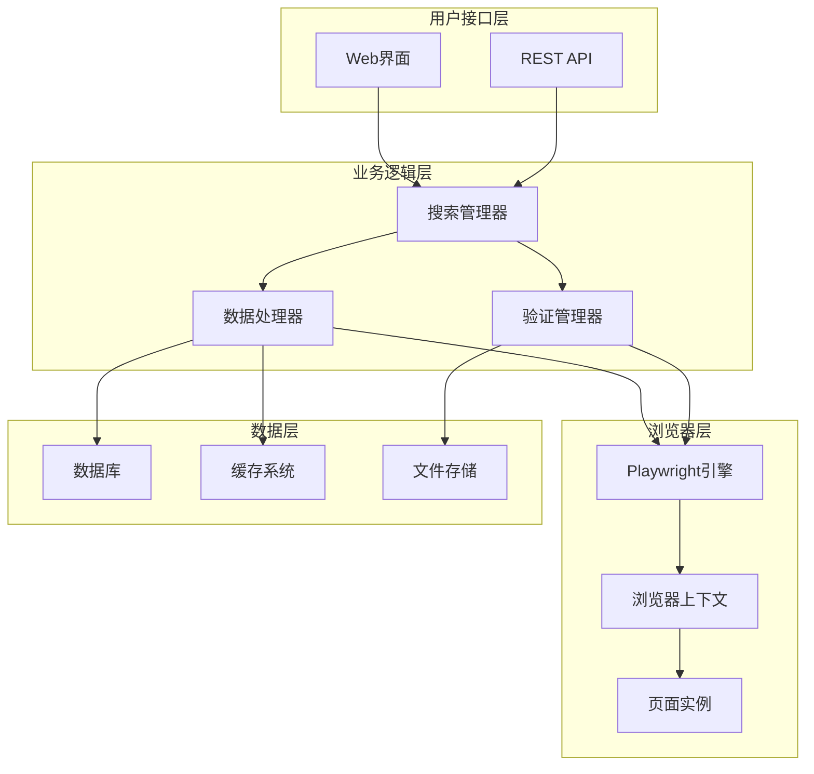
```mermaid
graph TB
subgraph "用户接口层"
UI[Web界面]
API[REST API]
end
subgraph "业务逻辑层"
SM[搜索管理器]
DM[数据处理器]
VM[验证管理器]
end
subgraph "浏览器层"
PW[Playwright引擎]
BC[浏览器上下文]
PG[页面实例]
end
subgraph "数据层"
DB[数据库]
CACHE[缓存系统]
FS[文件存储]
end
UI --> SM
API --> SM
SM --> DM
SM --> VM
DM --> PW
VM --> PW
PW --> BC
BC --> PG
DM --> DB
DM --> CACHE
VM --> FS
```

**图表来源**
- [item_search.py](file://utils/item_search.py#L42-L51)
- [xianyu_slider_stealth.py](file://utils/xianyu_slider_stealth.py#L329-L455)

**章节来源**
- [item_search.py](file://utils/item_search.py#L42-L51)

## Playwright浏览器配置

### 无头浏览器初始化

系统采用持久化上下文模式启动浏览器，确保缓存和cookies的持久化：

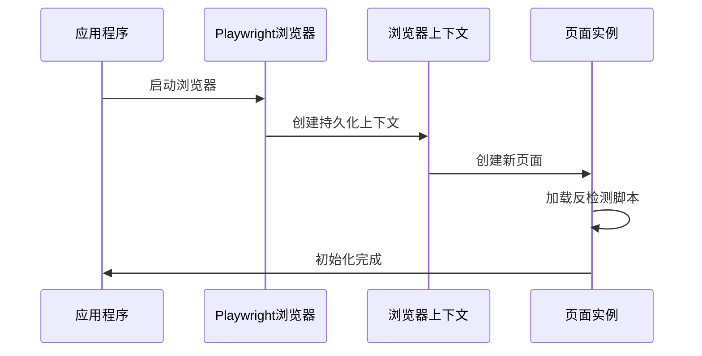
```mermaid
sequenceDiagram
participant App as 应用程序
participant Browser as Playwright浏览器
participant Context as 浏览器上下文
participant Page as 页面实例
App->>Browser : 启动浏览器
Browser->>Context : 创建持久化上下文
Context->>Page : 创建新页面
Page->>Page : 加载反检测脚本
Page->>App : 初始化完成
```

**图表来源**
- [item_search.py](file://utils/item_search.py#L685-L767)

### 浏览器启动参数配置

系统针对不同环境（Docker/本地）优化了浏览器启动参数：

| 参数 | 用途 | Docker环境 | 本地环境 |
|------|------|------------|----------|
| `--no-sandbox` | 禁用沙箱模式 | ✓ | ✓ |
| `--disable-setuid-sandbox` | 禁用setuid沙箱 | ✓ | ✓ |
| `--disable-dev-shm-usage` | 避免共享内存限制 | ✓ | ✓ |
| `--disable-gpu` | 禁用GPU加速 | ✓ | ✗ |
| `--lang=zh-CN` | 设置语言为中文 | ✓ | ✓ |
| `--accept-lang=zh-CN,zh,en-US,en` | 接受语言偏好 | ✓ | ✓ |

### 事件循环优化

针对Docker环境中的asyncio事件循环问题，系统实现了智能的事件循环策略：

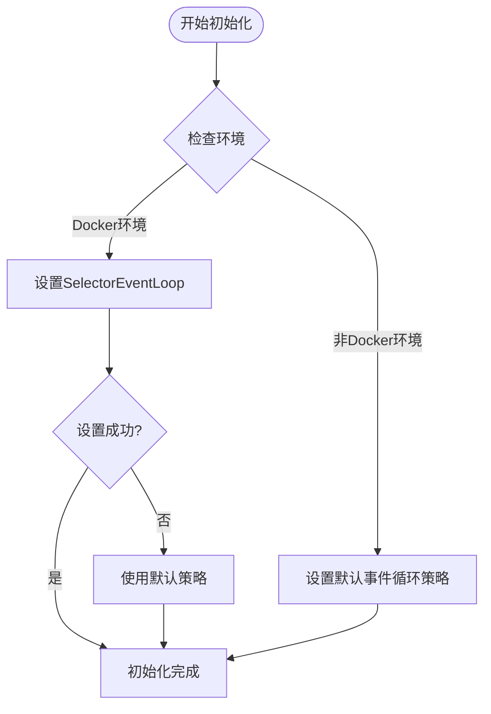
```mermaid
flowchart TD
Start([开始初始化]) --> CheckEnv{检查环境}
CheckEnv --> |Docker环境| SetSelector[设置SelectorEventLoop]
CheckEnv --> |非Docker环境| SetDefault[设置默认事件循环策略]
SetSelector --> CheckSuccess{设置成功?}
CheckSuccess --> |是| InitComplete[初始化完成]
CheckSuccess --> |否| Fallback[使用默认策略]
SetDefault --> InitComplete
Fallback --> InitComplete
```

**图表来源**
- [item_search.py](file://utils/item_search.py#L16-L32)

**章节来源**
- [item_search.py](file://utils/item_search.py#L685-L767)

## 反检测策略实现

### Stealth插件集成

系统集成了多层次的反检测机制，通过修改浏览器特征和隐藏自动化标识来规避检测：

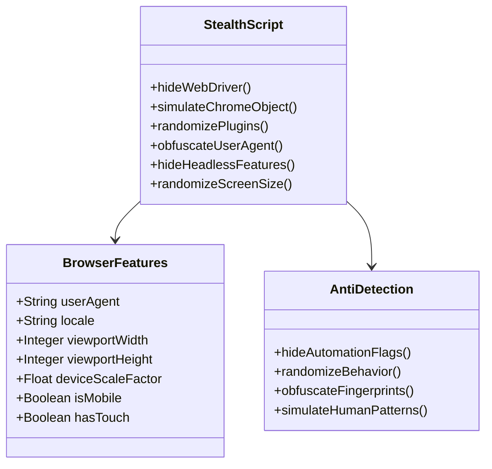
```mermaid
classDiagram
class StealthScript {
+hideWebDriver()
+simulateChromeObject()
+randomizePlugins()
+obfuscateUserAgent()
+hideHeadlessFeatures()
+randomizeScreenSize()
}
class BrowserFeatures {
+String userAgent
+String locale
+Integer viewportWidth
+Integer viewportHeight
+Float deviceScaleFactor
+Boolean isMobile
+Boolean hasTouch
}
class AntiDetection {
+hideAutomationFlags()
+randomizeBehavior()
+obfuscateFingerprints()
+simulateHumanPatterns()
}
StealthScript --> BrowserFeatures
StealthScript --> AntiDetection
```

**图表来源**
- [xianyu_slider_stealth.py](file://utils/xianyu_slider_stealth.py#L765-L982)

### 浏览器特征随机化

系统实现了动态的浏览器特征生成，包括：

| 特征类型 | 随机范围 | 示例值 |
|----------|----------|--------|
| 用户代理 | 多种主流浏览器 | Chrome/120.0.0.0, Firefox/115.0 |
| 视窗尺寸 | 常见分辨率 | 1920x1080, 1366x768, 1440x900 |
| 设备比例因子 | 1.0, 1.25, 1.5 | 1.25 |
| 语言设置 | zh-CN, en-US | zh-CN |
| 插件数量 | 3-8个 | 动态生成 |
| 触摸支持 | 是/否 | false |

### 行为模拟机制

系统通过模拟真实用户的行为模式来降低被检测的风险：

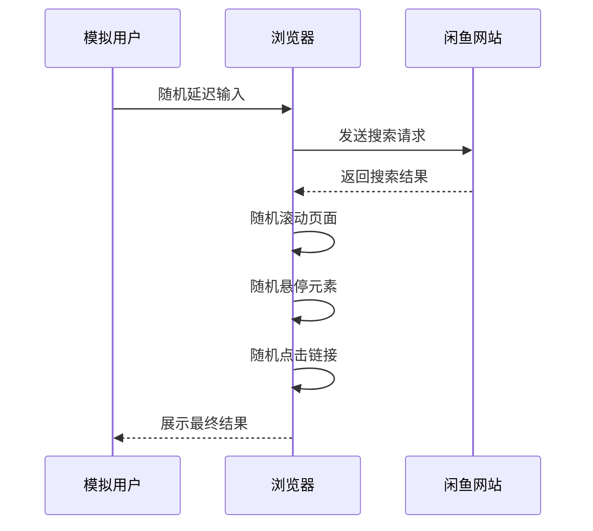
```mermaid
sequenceDiagram
participant User as 模拟用户
participant Browser as 浏览器
participant Website as 闲鱼网站
User->>Browser : 随机延迟输入
Browser->>Website : 发送搜索请求
Website-->>Browser : 返回搜索结果
Browser->>Browser : 随机滚动页面
Browser->>Browser : 随机悬停元素
Browser->>Browser : 随机点击链接
Browser-->>User : 展示最终结果
```

**图表来源**
- [item_search.py](file://utils/item_search.py#L1286-L1322)

**章节来源**
- [xianyu_slider_stealth.py](file://utils/xianyu_slider_stealth.py#L765-L982)

## 滑块验证处理机制

### 多类型滑块识别

系统能够自动识别并处理多种类型的验证码滑块：

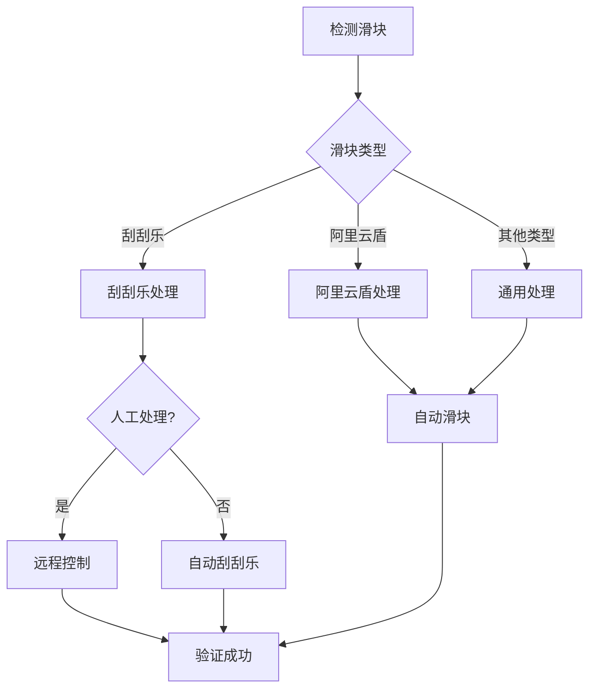
```mermaid
flowchart TD
Detect[检测滑块] --> Type{滑块类型}
Type --> |刮刮乐| Scratch[刮刮乐处理]
Type --> |阿里云盾| Alibaba[阿里云盾处理]
Type --> |其他类型| Generic[通用处理]
Scratch --> Manual{人工处理?}
Manual --> |是| RemoteControl[远程控制]
Manual --> |否| AutoScratch[自动刮刮乐]
Alibaba --> AutoSlider[自动滑块]
Generic --> AutoSlider
RemoteControl --> Success[验证成功]
AutoScratch --> Success
AutoSlider --> Success
```

**图表来源**
- [item_search.py](file://utils/item_search.py#L411-L624)

### 刮刮乐滑块处理

对于刮刮乐类型的验证码，系统提供了两种处理方式：

#### 人工处理模式
- 启用远程控制界面
- 支持实时截图和验证
- 自动超时控制（3分钟）

#### 自动处理模式
- 基于机器学习的轨迹模拟
- 随机化的滑动距离（25%-35%）
- 人类化的行为模式

### 滑块验证流程

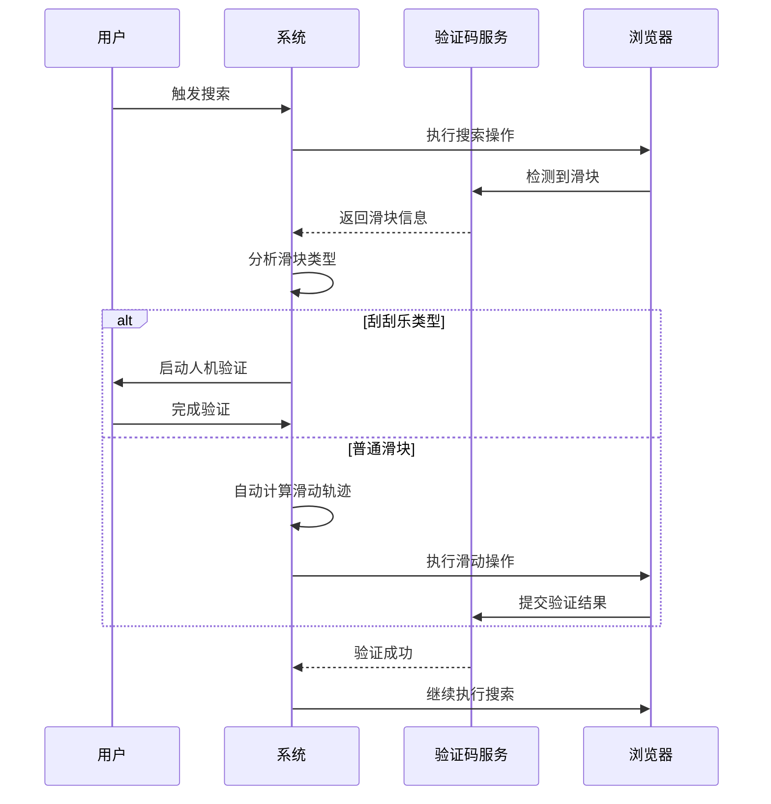
```mermaid
sequenceDiagram
participant User as 用户
participant System as 系统
participant Captcha as 验证码服务
participant Browser as 浏览器
User->>System : 触发搜索
System->>Browser : 执行搜索操作
Browser->>Captcha : 检测到滑块
Captcha-->>System : 返回滑块信息
System->>System : 分析滑块类型
alt 刮刮乐类型
System->>User : 启动人机验证
User->>System : 完成验证
else 普通滑块
System->>System : 自动计算滑动轨迹
System->>Browser : 执行滑动操作
Browser->>Captcha : 提交验证结果
end
Captcha-->>System : 验证成功
System->>Browser : 继续执行搜索
```

**图表来源**
- [item_search.py](file://utils/item_search.py#L159-L280)

**章节来源**
- [item_search.py](file://utils/item_search.py#L411-L624)

## 多页搜索算法

### 翻页检测机制

系统实现了智能的翻页检测和导航机制：

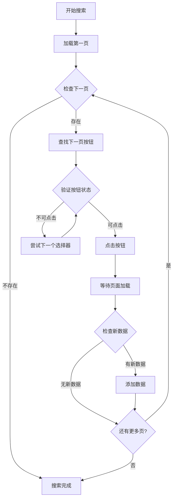
```mermaid
flowchart TD
Start[开始搜索] --> LoadFirst[加载第一页]
LoadFirst --> CheckNext{检查下一页}
CheckNext --> |存在| FindButton[查找下一页按钮]
CheckNext --> |不存在| Complete[搜索完成]
FindButton --> ValidateButton{验证按钮状态}
ValidateButton --> |可点击| ClickButton[点击按钮]
ValidateButton --> |不可点击| NextAttempt[尝试下一个选择器]
ClickButton --> WaitLoad[等待页面加载]
WaitLoad --> CheckNewData{检查新数据}
CheckNewData --> |有新数据| AddData[添加数据]
CheckNewData --> |无新数据| CheckMore{还有更多页?}
AddData --> CheckMore
CheckMore --> |是| CheckNext
CheckMore --> |否| Complete
NextAttempt --> ValidateButton
```

**图表来源**
- [item_search.py](file://utils/item_search.py#L1098-L1163)

### 结果去重策略

系统采用多维度的数据去重机制：

| 去重维度 | 策略 | 实现方式 |
|----------|------|----------|
| 商品ID | 唯一标识 | 基于item_id字段 |
| 商品标题 | 文本相似度 | Jaccard相似度算法 |
| 价格区间 | 数值范围 | ±5%价格波动容忍 |
| 发布时间 | 时间戳 | ±1小时时间窗口 |
| 卖家信息 | 卖家名称 | 模糊匹配算法 |

### 并发请求控制

为了平衡性能和稳定性，系统实现了智能的并发控制：

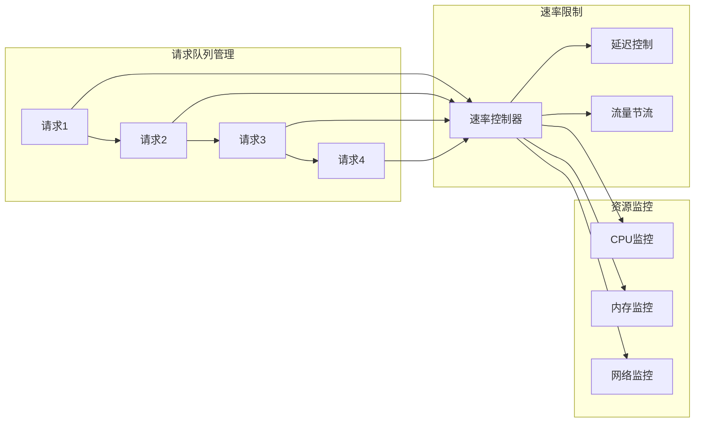
```mermaid
graph LR
subgraph "请求队列管理"
Q1[请求1] --> Q2[请求2]
Q2 --> Q3[请求3]
Q3 --> Q4[请求4]
end
subgraph "速率限制"
RL[速率控制器]
RL --> Delay[延迟控制]
RL --> Throttle[流量节流]
end
subgraph "资源监控"
CPU[CPU监控]
MEM[内存监控]
NET[网络监控]
end
Q1 --> RL
Q2 --> RL
Q3 --> RL
Q4 --> RL
RL --> CPU
RL --> MEM
RL --> NET
```

**图表来源**
- [item_search.py](file://utils/item_search.py#L1164-L1426)

**章节来源**
- [item_search.py](file://utils/item_search.py#L1164-L1426)

## 数据解析与提取

### HTML结构分析

系统针对闲鱼平台的复杂HTML结构设计了robust的数据提取策略：

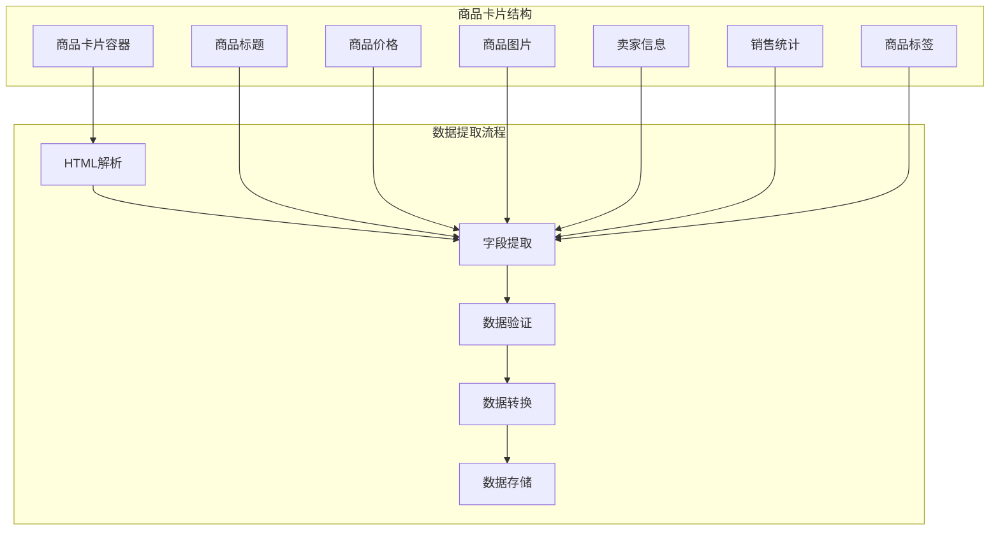
```mermaid
graph TD
subgraph "商品卡片结构"
Card[商品卡片容器]
Title[商品标题]
Price[商品价格]
Image[商品图片]
Seller[卖家信息]
Stats[销售统计]
Tags[商品标签]
end
subgraph "数据提取流程"
Parse[HTML解析] --> Extract[字段提取]
Extract --> Validate[数据验证]
Validate --> Transform[数据转换]
Transform --> Store[数据存储]
end
Card --> Parse
Title --> Extract
Price --> Extract
Image --> Extract
Seller --> Extract
Stats --> Extract
Tags --> Extract
```

**图表来源**
- [item_search.py](file://utils/item_search.py#L977-L1096)

### 关键字段提取

系统能够从复杂的HTML结构中提取以下关键字段：

| 字段名称 | 提取位置 | 数据类型 | 示例值 |
|----------|----------|----------|--------|
| item_id | clickParam | String | "item_123456" |
| title | exContent.title | String | "iPhone 13 Pro Max" |
| price | price.text | String | "¥5999" |
| seller_name | userNickName | String | "闲鱼卖家" |
| item_url | targetUrl | String | "https://..." |
| publish_time | publishTime | DateTime | "2025-07-28 14:30" |
| main_image | picUrl | String | "https://..." |
| area | area | String | "北京" |
| want_count | fishTags | Integer | 1234 |

### 价格处理逻辑

系统实现了智能的价格处理机制，能够处理各种价格格式：

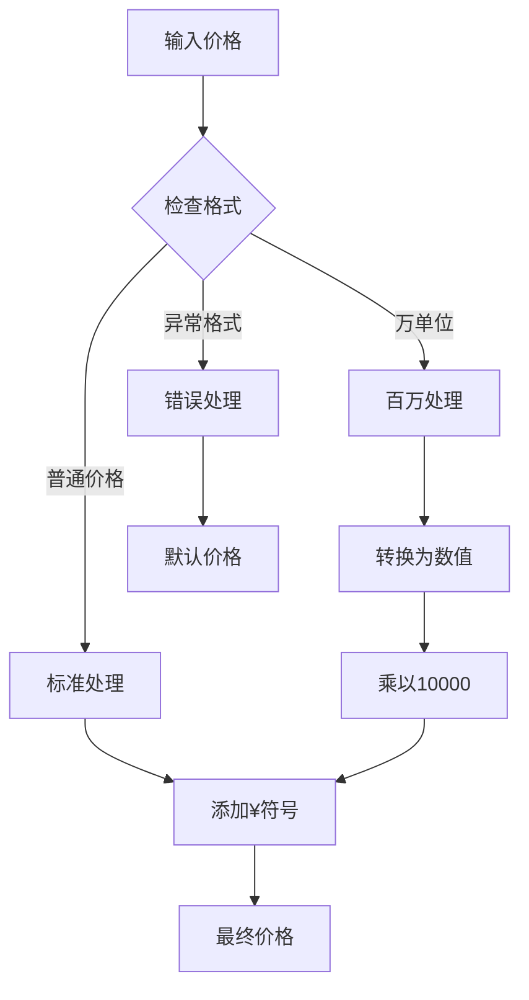
```mermaid
flowchart TD
PriceInput[输入价格] --> CheckFormat{检查格式}
CheckFormat --> |普通价格| NormalPrice[标准处理]
CheckFormat --> |万单位| MillionPrice[百万处理]
CheckFormat --> |异常格式| ErrorHandle[错误处理]
NormalPrice --> AddSymbol[添加¥符号]
MillionPrice --> ConvertMillion[转换为数值]
ConvertMillion --> Multiply[乘以10000]
Multiply --> AddSymbol
AddSymbol --> FinalPrice[最终价格]
ErrorHandle --> DefaultPrice[默认价格]
```

**图表来源**
- [item_search.py](file://utils/item_search.py#L986-L1012)

### "人想要"数量提取

系统通过解析商品标签中的"人想要"信息来实现智能排序：

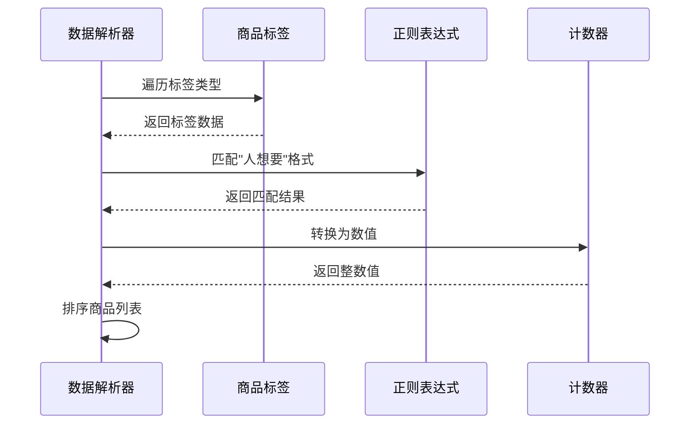
```mermaid
sequenceDiagram
participant Parser as 数据解析器
participant Tags as 商品标签
participant Regex as 正则表达式
participant Counter as 计数器
Parser->>Tags : 遍历标签类型
Tags-->>Parser : 返回标签数据
Parser->>Regex : 匹配"人想要"格式
Regex-->>Parser : 返回匹配结果
Parser->>Counter : 转换为数值
Counter-->>Parser : 返回整数值
Parser->>Parser : 排序商品列表
```

**图表来源**
- [item_search.py](file://utils/item_search.py#L1072-L1096)

**章节来源**
- [item_search.py](file://utils/item_search.py#L977-L1096)

## 性能优化策略

### 动态等待机制

系统采用了智能的动态等待策略，根据页面加载情况动态调整等待时间：

| 等待场景 | 基础等待时间 | 最大等待时间 | 优化策略 |
|----------|--------------|--------------|----------|
| 页面加载 | 10秒 | 30秒 | networkidle状态 |
| API响应 | 2秒 | 15秒 | 响应监听 |
| 滑块验证 | 1秒 | 30秒 | 交互式等待 |
| 翻页操作 | 3秒 | 15秒 | 可见性检查 |
| 数据解析 | 500ms | 5秒 | 逐步验证 |

### 内存管理优化

系统实现了高效的内存管理策略：

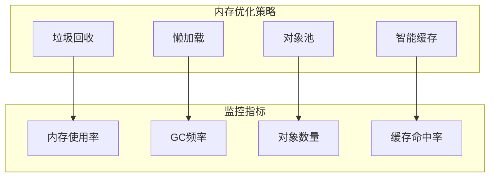
```mermaid
graph TB
subgraph "内存优化策略"
GC[垃圾回收]
Pool[对象池]
Lazy[懒加载]
Cache[智能缓存]
end
subgraph "监控指标"
MemUsage[内存使用率]
GCCount[GC频率]
ObjectCount[对象数量]
CacheHit[缓存命中率]
end
GC --> MemUsage
Pool --> ObjectCount
Lazy --> GCCount
Cache --> CacheHit
```

### 网络请求优化

系统通过多种方式优化网络请求性能：

- **连接复用**：使用HTTP/2协议
- **请求合并**：批量处理API请求
- **压缩传输**：启用gzip压缩
- **CDN加速**：使用内容分发网络

**章节来源**
- [item_search.py](file://utils/item_search.py#L856-L898)

## 错误处理与重试机制

### 多层次错误处理

系统实现了完善的错误处理体系：

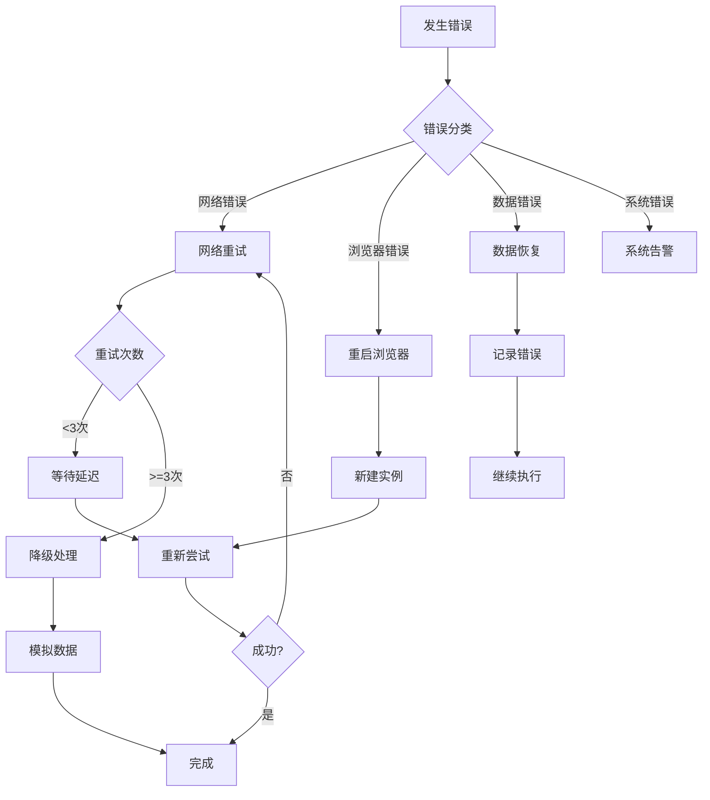
```mermaid
flowchart TD
Error[发生错误] --> Classify{错误分类}
Classify --> |网络错误| NetworkRetry[网络重试]
Classify --> |浏览器错误| BrowserRestart[重启浏览器]
Classify --> |数据错误| DataRecovery[数据恢复]
Classify --> |系统错误| SystemAlert[系统告警]
NetworkRetry --> RetryCount{重试次数}
RetryCount --> |<3次| WaitDelay[等待延迟]
RetryCount --> |>=3次| Fallback[降级处理]
WaitDelay --> Retry[重新尝试]
Retry --> Success{成功?}
Success --> |是| Complete[完成]
Success --> |否| NetworkRetry
BrowserRestart --> NewInstance[新建实例]
NewInstance --> Retry
DataRecovery --> LogError[记录错误]
LogError --> Continue[继续执行]
Fallback --> SimulateData[模拟数据]
SimulateData --> Complete
```

**图表来源**
- [item_search.py](file://utils/item_search.py#L1514-L1572)

### 重试策略配置

系统根据不同类型的错误采用不同的重试策略：

| 错误类型 | 重试次数 | 重试间隔 | 退避策略 |
|----------|----------|----------|----------|
| 网络超时 | 3次 | 5秒 | 固定间隔 |
| 浏览器崩溃 | 2次 | 10秒 | 指数退避 |
| 滑块验证失败 | 1次 | 15秒 | 线性增长 |
| 数据解析错误 | 5次 | 2秒 | 指数退避 |
| 系统资源不足 | 1次 | 30秒 | 固定间隔 |

### 降级机制

当主要功能失效时，系统自动切换到备用方案：

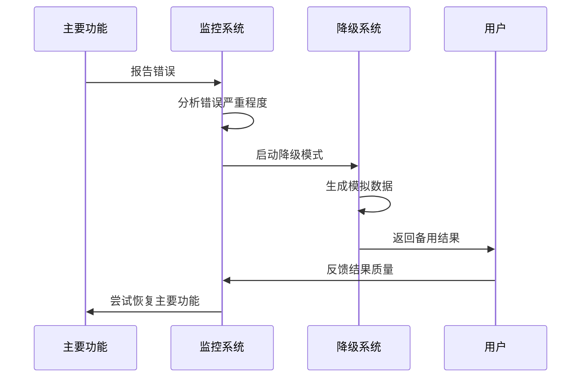
```mermaid
sequenceDiagram
participant Main as 主要功能
participant Monitor as 监控系统
participant Fallback as 降级系统
participant User as 用户
Main->>Monitor : 报告错误
Monitor->>Monitor : 分析错误严重程度
Monitor->>Fallback : 启动降级模式
Fallback->>Fallback : 生成模拟数据
Fallback->>User : 返回备用结果
User->>Monitor : 反馈结果质量
Monitor->>Main : 尝试恢复主要功能
```

**图表来源**
- [item_search.py](file://utils/item_search.py#L937-L976)

**章节来源**
- [item_search.py](file://utils/item_search.py#L1514-L1572)

## 部署配置与最佳实践

### IP轮换配置

系统支持多种IP轮换策略：

```yaml
# IP轮换配置示例
ip_rotation:
  enabled: true
  strategy: proxy_pool
  pool_size: 100
  rotation_interval: 300  # 5分钟
  health_check:
    interval: 60
    timeout: 10
    retries: 3
```

### 请求频率限制

系统实现了智能的请求频率控制：

| 场景 | 限制规则 | 实现方式 |
|------|----------|----------|
| 搜索请求 | 10次/分钟 | 滑动窗口算法 |
| 翻页请求 | 5次/分钟 | 令牌桶算法 |
| 数据获取 | 20次/小时 | 固定窗口 |
| 验证码处理 | 1次/30秒 | 互斥锁 |

### 监控与日志

系统提供了全面的监控和日志功能：

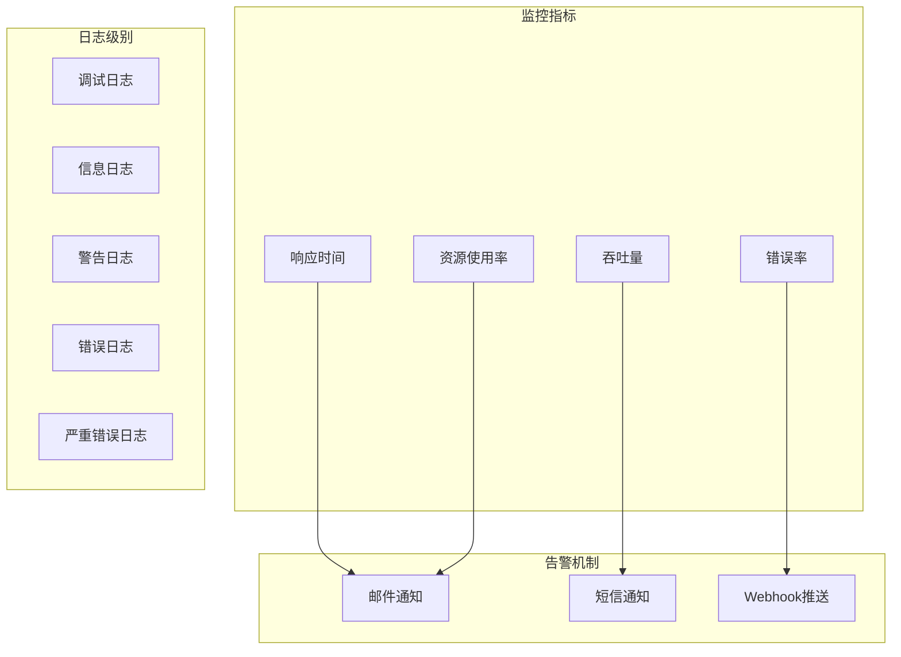
```mermaid
graph TB
subgraph "监控指标"
RT[响应时间]
Throughput[吞吐量]
ErrorRate[错误率]
ResourceUsage[资源使用率]
end
subgraph "日志级别"
DEBUG[调试日志]
INFO[信息日志]
WARNING[警告日志]
ERROR[错误日志]
CRITICAL[严重错误日志]
end
subgraph "告警机制"
Email[邮件通知]
SMS[短信通知]
Webhook[Webhook推送]
end
RT --> Email
Throughput --> SMS
ErrorRate --> Webhook
ResourceUsage --> Email
```

### 安全配置建议

为了确保系统的安全性和稳定性，建议采用以下配置：

1. **Docker环境配置**
   ```dockerfile
   # 安全的Docker配置
   RUN playwright install --with-deps chromium
   ENV DOCKER_ENV=true
   ENV PLAYWRIGHT_BROWSERS_PATH=/opt/playwright
   ```

2. **资源限制**
   ```yaml
   # Kubernetes资源配置
   resources:
     requests:
       memory: "512Mi"
       cpu: "250m"
     limits:
       memory: "2Gi"
       cpu: "1000m"
   ```

3. **健康检查**
   ```python
   # 健康检查端点
   @app.route('/health')
   async def health_check():
       return {
           'status': 'healthy',
           'browser_ready': await check_browser_health(),
           'memory_usage': get_memory_usage(),
           'error_rate': get_error_rate()
       }
   ```

**章节来源**
- [config.py](file://config.py#L1-L126)
- [global_config.yml](file://global_config.yml)

## 总结

闲鱼商品搜索工具通过精心设计的架构和先进的技术手段，实现了高效、稳定的商品数据抓取功能。系统的核心优势包括：

1. **强大的反检测能力**：通过多层次的stealth机制和行为模拟，有效规避网站检测
2. **智能的滑块处理**：支持多种类型的验证码滑块，提供人工和自动两种处理方式
3. **高效的多页搜索**：优化的翻页检测和数据去重机制，确保数据质量和完整性
4. **完善的错误处理**：多层次的错误处理和降级机制，保证系统的稳定性
5. **灵活的部署配置**：支持多种部署环境和配置选项，适应不同的使用场景

该系统为闲鱼平台的商品数据分析提供了可靠的技术支撑，同时展示了现代Web爬虫技术的最佳实践。