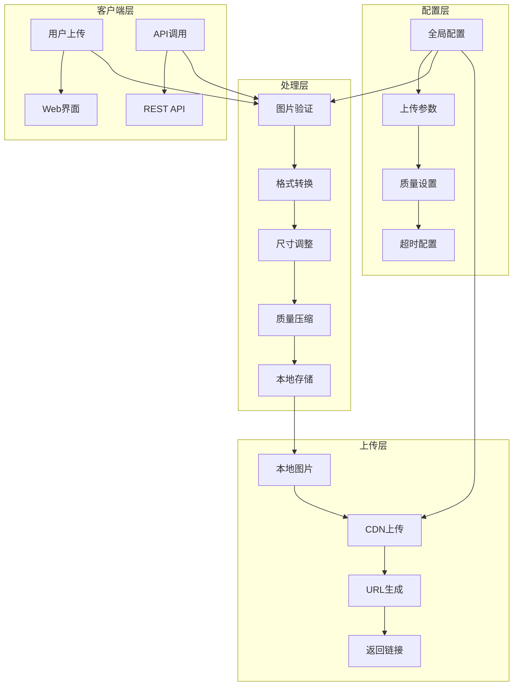
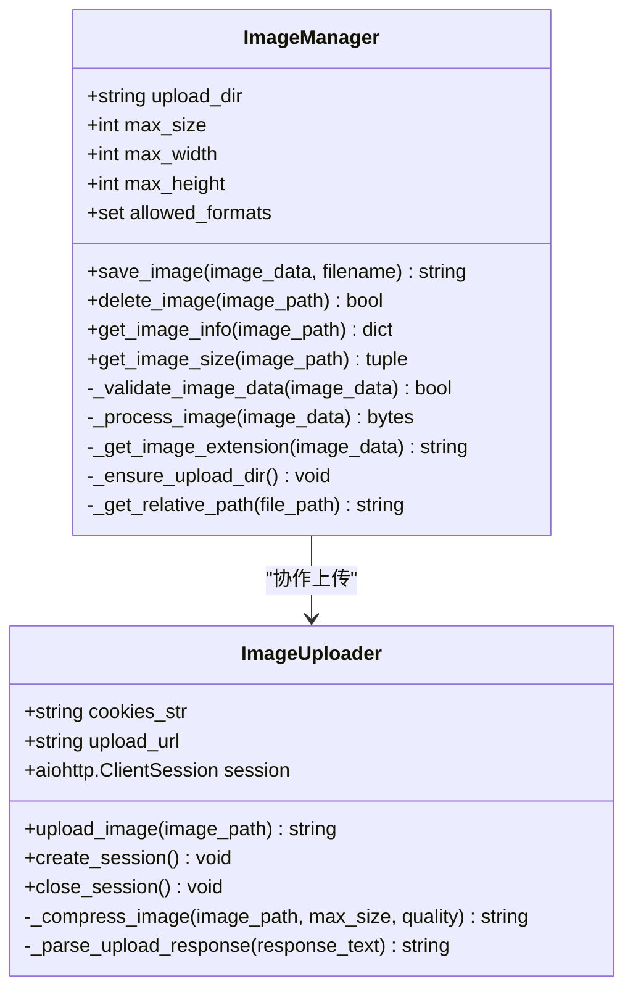
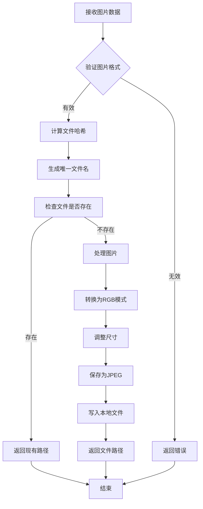
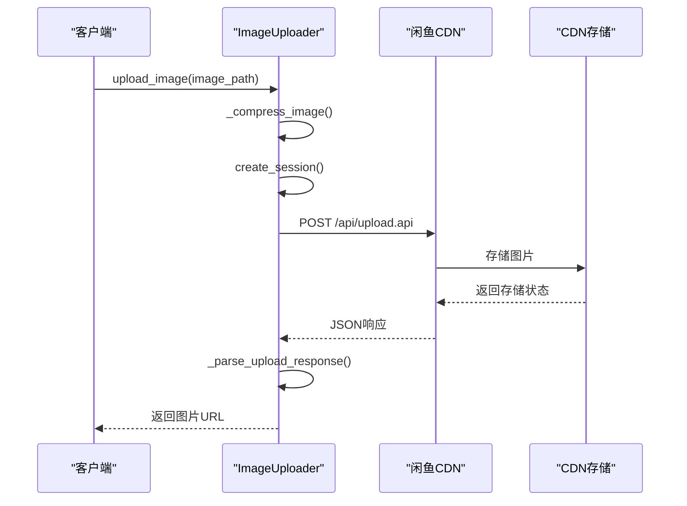
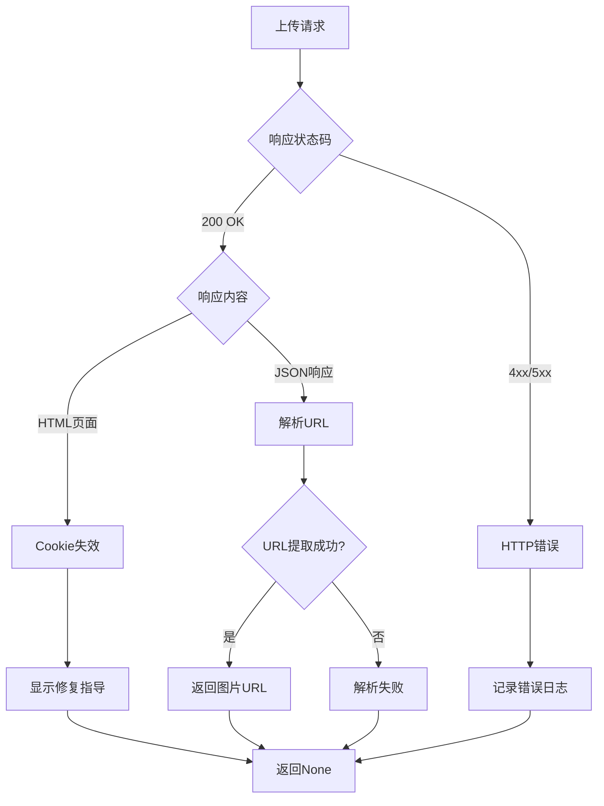
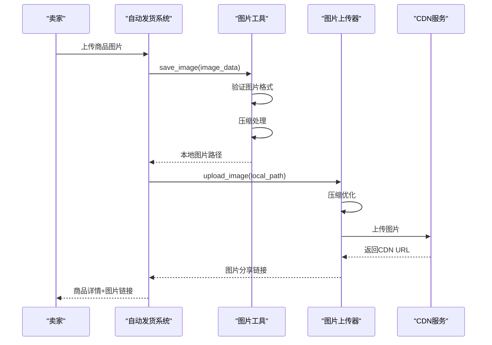

# 图片处理与上传系统 (image_utils.py, image_uploader.py)

<cite>
**本文档中引用的文件**
- [image_utils.py](file://utils/image_utils.py)
- [image_uploader.py](file://utils/image_uploader.py)
- [config.py](file://config.py)
- [global_config.yml](file://global_config.yml)
- [XianyuAutoAsync.py](file://XianyuAutoAsync.py)
- [reply_server.py](file://reply_server.py)
</cite>

## 目录
1. [简介](#简介)
2. [系统架构概览](#系统架构概览)
3. [核心组件分析](#核心组件分析)
4. [图片处理流程](#图片处理流程)
5. [上传服务集成](#上传服务集成)
6. [配置管理](#配置管理)
7. [错误处理与重试机制](#错误处理与重试机制)
8. [自动发货场景应用](#自动发货场景应用)
9. [性能优化与限制](#性能优化与限制)
10. [扩展性分析](#扩展性分析)
11. [故障排除指南](#故障排除指南)
12. [总结](#总结)

## 简介

该图片处理与上传系统是一个专为闲鱼平台设计的自动化解决方案，通过两个核心模块协同工作：`image_utils.py`负责本地图片处理和存储，`image_uploader.py`负责将处理后的图片上传至指定图床或CDN服务。系统特别针对自动发货场景进行了优化，能够自动压缩商品图片并生成分享链接。

## 系统架构概览



**图表来源**
- [image_utils.py](file://utils/image_utils.py#L1-L257)
- [image_uploader.py](file://utils/image_uploader.py#L1-L231)

## 核心组件分析

### ImageManager 类 (image_utils.py)

ImageManager 是图片管理的核心类，负责本地图片处理和存储：



**图表来源**
- [image_utils.py](file://utils/image_utils.py#L8-L257)
- [image_uploader.py](file://utils/image_uploader.py#L15-L231)

**章节来源**
- [image_utils.py](file://utils/image_utils.py#L8-L257)
- [image_uploader.py](file://utils/image_uploader.py#L15-L231)

### ImageUploader 类

ImageUploader 专门负责将图片上传到闲鱼CDN，支持异步操作和会话管理：

- **会话管理**: 使用 aiohttp 创建高效的 HTTP 会话
- **图片压缩**: 自动压缩图片以满足上传要求
- **错误处理**: 完善的错误检测和恢复机制
- **响应解析**: 智能解析不同格式的上传响应

**章节来源**
- [image_uploader.py](file://utils/image_uploader.py#L15-L231)

## 图片处理流程

### 本地图片处理步骤



**图表来源**
- [image_utils.py](file://utils/image_utils.py#L35-L73)

### 图片压缩策略

系统采用多层次的压缩策略：

1. **格式转换**: 自动将非RGB格式转换为RGB
2. **尺寸调整**: 最大边长2048像素，保持宽高比
3. **质量压缩**: 默认质量85%，支持动态调整
4. **文件大小检查**: 确保最终文件小于5MB

**章节来源**
- [image_utils.py](file://utils/image_utils.py#L129-L168)

## 上传服务集成

### 闲鱼CDN上传机制



**图表来源**
- [image_uploader.py](file://utils/image_uploader.py#L96-L158)

### 上传参数配置

| 参数 | 默认值 | 说明 |
|------|--------|------|
| 上传URL | `https://stream-upload.goofish.com/api/upload.api` | 闲鱼CDN上传接口 |
| 超时时间 | 30秒 | HTTP请求超时设置 |
| 并发限制 | 100连接/30主机 | TCP连接池配置 |
| 质量设置 | 85% | JPEG压缩质量 |
| 最大尺寸 | 1920x1920 | 图片最大尺寸 |

**章节来源**
- [image_uploader.py](file://utils/image_uploader.py#L18-L34)

## 配置管理

### 全局配置结构

系统通过 `global_config.yml` 文件管理配置：

```yaml
# 图片上传配置
UPLOAD_CONFIG:
  DEFAULT_QUALITY: 85
  MAX_FILE_SIZE: 5242880  # 5MB
  TIMEOUT: 30
  RETRY_COUNT: 3
  
# 闲鱼CDN配置
CDN_CONFIG:
  UPLOAD_URL: "https://stream-upload.goofish.com/api/upload.api"
  APP_KEY: "xy_chat"
  
# 自动发货配置
AUTO_DELIVERY:
  ENABLED: true
  IMAGE_COMPRESSION: true
  QUALITY_SETTING: 85
```

### 配置参数详解

| 配置项 | 类型 | 默认值 | 描述 |
|--------|------|--------|------|
| `DEFAULT_QUALITY` | int | 85 | 图片默认压缩质量 |
| `MAX_FILE_SIZE` | int | 5242880 | 最大文件大小(字节) |
| `TIMEOUT` | int | 30 | 上传超时时间(秒) |
| `RETRY_COUNT` | int | 3 | 上传失败重试次数 |

**章节来源**
- [global_config.yml](file://global_config.yml#L1-L77)
- [config.py](file://config.py#L1-L126)

## 错误处理与重试机制

### Cookie失效检测

系统具备智能的Cookie失效检测机制：



**图表来源**
- [image_uploader.py](file://utils/image_uploader.py#L167-L223)

### 错误恢复策略

1. **Cookie失效**: 提供详细的修复指导
2. **网络错误**: 自动重试机制
3. **文件损坏**: 返回原始数据作为后备
4. **超时处理**: 设置合理的超时时间

**章节来源**
- [image_uploader.py](file://utils/image_uploader.py#L167-L223)

## 自动发货场景应用

### 商品图片自动处理流程



**图表来源**
- [XianyuAutoAsync.py](file://XianyuAutoAsync.py#L8217-L8255)
- [image_utils.py](file://utils/image_utils.py#L35-L73)
- [image_uploader.py](file://utils/image_uploader.py#L96-L158)

### 自动发货配置示例

```python
# 自动发货配置
AUTO_DELIVERY_CONFIG = {
    "enabled": True,
    "image_compression": True,
    "quality_setting": 85,
    "timeout": 30,
    "retry_count": 3
}

# 商品图片处理示例
async def process_product_image(image_path: str, cookies_str: str) -> str:
    # 1. 本地图片处理
    from utils.image_utils import image_manager
    local_url = image_manager.save_image(image_data, filename)
    
    # 2. 上传到CDN
    from utils.image_uploader import ImageUploader
    uploader = ImageUploader(cookies_str)
    cdn_url = await uploader.upload_image(local_url)
    
    return cdn_url
```

**章节来源**
- [XianyuAutoAsync.py](file://XianyuAutoAsync.py#L8217-L8255)

## 性能优化与限制

### 图片处理限制

系统设置了严格的图片处理限制以确保性能：

| 限制项 | 数值 | 说明 |
|--------|------|------|
| 最大文件大小 | 5MB | 防止大文件占用过多带宽 |
| 最大宽度 | 4096像素 | 支持手机长截图 |
| 最大高度 | 4096像素 | 支持手机长截图 |
| 最大像素总数 | 8M像素 | 防止内存溢出 |
| 输出尺寸 | 2048x2048 | 优化传输效率 |

### 性能优化措施

1. **异步处理**: 使用 asyncio 实现非阻塞上传
2. **连接池**: 复用 HTTP 连接减少建立开销
3. **临时文件**: 使用系统临时目录减少磁盘 I/O
4. **内存管理**: 及时清理临时文件和资源

**章节来源**
- [image_utils.py](file://utils/image_utils.py#L79-L108)
- [image_uploader.py](file://utils/image_uploader.py#L24-L34)

## 扩展性分析

### 多图床支持可能性

目前系统主要针对闲鱼CDN优化，但具有良好的扩展性：

```python
# 伪代码：多图床支持框架
class MultiUploader:
    def __init__(self):
        self.uploaders = {
            'xiaoyu': XiaoyuUploader(),
            'smms': SMMSUploader(),
            'aliyun': AliyunOSSUploader()
        }
    
    async def upload_to_best_service(self, image_path: str) -> str:
        for service, uploader in self.uploaders.items():
            try:
                result = await uploader.upload_image(image_path)
                if result:
                    return result
            except Exception as e:
                logger.warning(f"上传到 {service} 失败: {e}")
                continue
        raise Exception("所有图床服务都失败了")
```

### 大文件分片上传

当前实现不支持大文件分片上传，主要受限于：

1. **CDN限制**: 闲鱼CDN可能不支持分片上传
2. **内存限制**: 大图片需要大量内存处理
3. **复杂度**: 分片上传增加了系统复杂度

**章节来源**
- [image_uploader.py](file://utils/image_uploader.py#L42-L94)

## 故障排除指南

### 常见问题及解决方案

#### 1. 图片上传失败

**症状**: 上传返回 `None` 或抛出异常

**排查步骤**:
1. 检查Cookie是否有效
2. 验证图片格式和大小
3. 确认网络连接状态
4. 查看详细错误日志

**解决方案**:
```python
# Cookie有效性检查
async def check_cookie_validity(cookies_str: str) -> bool:
    from utils.image_uploader import ImageUploader
    uploader = ImageUploader(cookies_str)
    try:
        await uploader.create_session()
        # 测试上传小图片
        test_result = await uploader.upload_image('/tmp/test.jpg')
        return test_result is not None
    except Exception as e:
        logger.error(f"Cookie检查失败: {e}")
        return False
    finally:
        await uploader.close_session()
```

#### 2. 图片质量过低

**症状**: 上传后图片模糊不清

**解决方案**:
- 调整 `DEFAULT_QUALITY` 参数
- 检查图片原始质量
- 考虑使用更高压缩算法

#### 3. 上传速度慢

**症状**: 上传过程耗时过长

**优化建议**:
- 减少图片尺寸
- 降低压缩质量
- 增加并发连接数
- 使用更快的网络

**章节来源**
- [image_uploader.py](file://utils/image_uploader.py#L167-L223)
- [XianyuAutoAsync.py](file://XianyuAutoAsync.py#L2327-L2370)

## 总结

该图片处理与上传系统通过 `image_utils.py` 和 `image_uploader.py` 的紧密协作，实现了完整的图片处理和上传解决方案。系统特点包括：

### 主要优势

1. **自动化程度高**: 从图片验证到CDN上传全程自动化
2. **错误处理完善**: 智能检测和处理各种异常情况
3. **性能优化**: 多层次的压缩和优化策略
4. **易于扩展**: 良好的架构设计支持功能扩展

### 应用价值

- **自动发货**: 为闲鱼自动发货系统提供可靠的图片处理能力
- **批量处理**: 支持大量商品图片的高效处理
- **质量保证**: 确保上传图片符合平台要求
- **用户体验**: 提供流畅的图片上传体验

### 改进建议

1. **支持更多图床**: 扩展对SM.MS、阿里云OSS等服务的支持
2. **分片上传**: 实现大文件的分片上传功能
3. **缓存机制**: 添加图片处理结果缓存
4. **监控告警**: 增强系统监控和异常告警功能

该系统为闲鱼平台的自动化运营提供了坚实的技术基础，特别是在自动发货场景下，能够显著提升运营效率和用户体验。