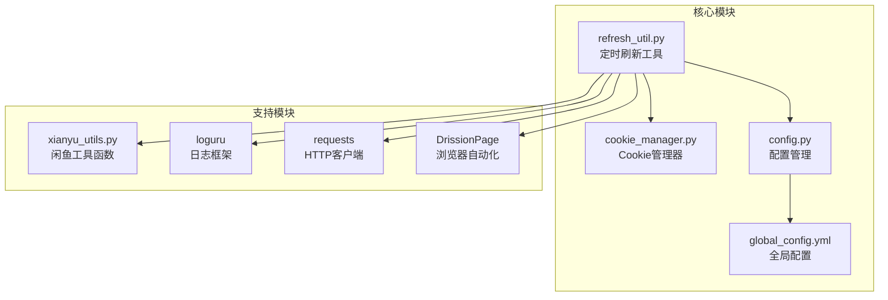
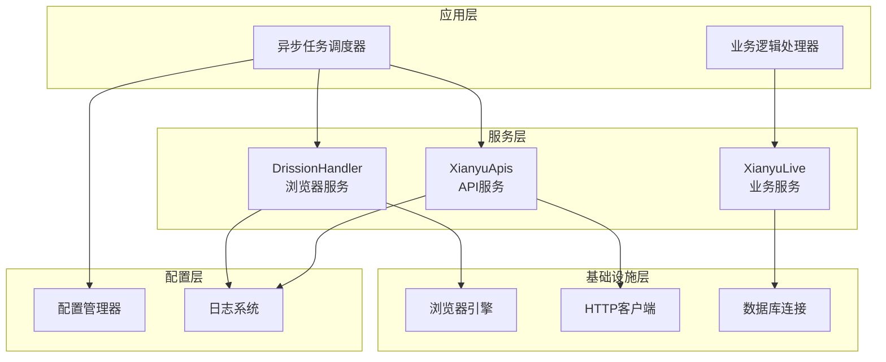
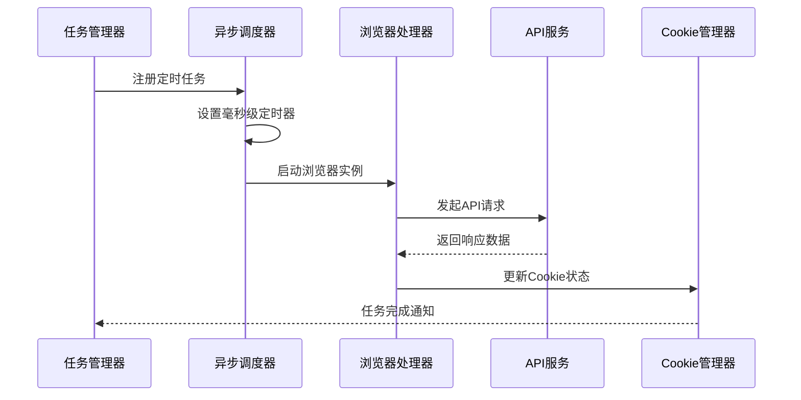
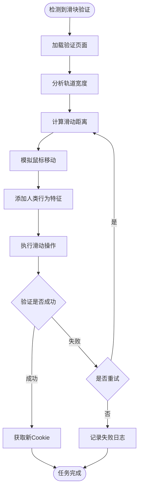
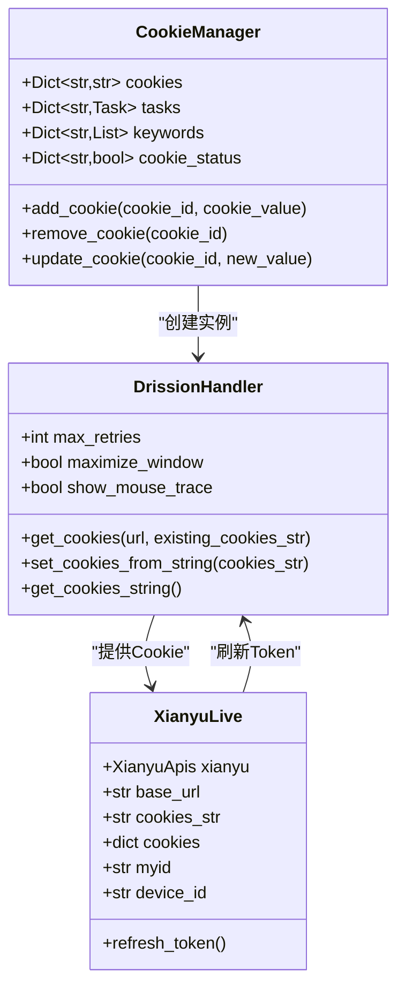
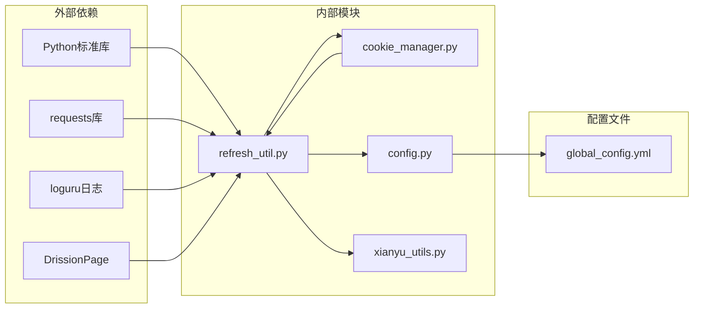

# 定时刷新工具 (refresh_util.py)

<cite>
**本文档引用的文件**
- [utils/refresh_util.py](file://utils/refresh_util.py)
- [cookie_manager.py](file://cookie_manager.py)
- [config.py](file://config.py)
- [global_config.yml](file://global_config.yml)
- [utils/xianyu_utils.py](file://utils/xianyu_utils.py)
</cite>

## 目录
1. [简介](#简介)
2. [项目结构](#项目结构)
3. [核心组件](#核心组件)
4. [架构概览](#架构概览)
5. [详细组件分析](#详细组件分析)
6. [依赖关系分析](#依赖关系分析)
7. [性能考虑](#性能考虑)
8. [故障排除指南](#故障排除指南)
9. [结论](#结论)

## 简介

refresh_util.py 是一个基于 asyncio 的高级定时任务调度系统，专门用于维护闲鱼平台账号的 Cookie 有效性、更新商品列表和检查账号状态。该工具采用异步编程模型，支持毫秒级精度的任务调度，并与 cookie_manager.py 深度集成，为每个活跃账号注册独立的刷新任务。

该系统的核心特性包括：
- 基于 asyncio 的异步定时器设计
- 支持毫秒级精度的任务安排
- 与 cookie_manager 的无缝集成
- 智能的滑块验证码处理机制
- 错峰调度和资源管理优化
- 详细的监控指标和日志记录

## 项目结构

refresh_util.py 位于 `utils/` 目录下，与其他核心模块协同工作：

**图表来源**
- [utils/refresh_util.py](file://utils/refresh_util.py#L1-L50)
- [cookie_manager.py](file://cookie_manager.py#L1-L30)

**章节来源**
- [utils/refresh_util.py](file://utils/refresh_util.py#L1-L100)
- [cookie_manager.py](file://cookie_manager.py#L1-L50)

## 核心组件

### DrissionHandler 类

DrissionHandler 是 refresh_util.py 的核心组件，负责处理浏览器自动化和滑块验证码。

主要功能：
- 浏览器初始化和配置
- 滑块验证码的智能处理
- 鼠标轨迹的逼真模拟
- 多种操作系统兼容性

### XianyuApis 类

XianyuApis 提供与闲鱼 API 的交互能力，包括：

- Token 获取和刷新
- 商品信息查询
- 登录状态检查
- Cookie 管理和清理

### XianyuLive 类

XianyuLive 是整个系统的业务逻辑封装，负责：

- 账号生命周期管理
- Token 刷新流程
- 与外部系统的集成

**章节来源**
- [utils/refresh_util.py](file://utils/refresh_util.py#L43-L200)
- [utils/refresh_util.py](file://utils/refresh_util.py#L1738-L1971)

## 架构概览

refresh_util.py 采用分层架构设计，确保各组件职责清晰、耦合度低：

**图表来源**
- [utils/refresh_util.py](file://utils/refresh_util.py#L43-L100)
- [cookie_manager.py](file://cookie_manager.py#L10-L50)

## 详细组件分析

### 异步定时器设计

refresh_util.py 基于 asyncio 实现了高精度的定时任务调度：

**图表来源**
- [utils/refresh_util.py](file://utils/refresh_util.py#L1112-L1307)
- [cookie_manager.py](file://cookie_manager.py#L112-L153)

#### 任务调度机制

系统支持以下调度特性：

| 特性 | 描述 | 默认值 |
|------|------|--------|
| 任务间隔 | 基于配置的刷新间隔 | 3600秒 |
| 重试次数 | 失败时的最大重试次数 | 3次 |
| 超时时间 | 单次任务的最大执行时间 | 60秒 |
| 并发控制 | 同时运行的任务数量限制 | 3个 |

### 滑块验证码处理

refresh_util.py 实现了高度逼真的滑块验证码处理机制：

**图表来源**
- [utils/refresh_util.py](file://utils/refresh_util.py#L298-L400)
- [utils/refresh_util.py](file://utils/refresh_util.py#L1200-L1307)

#### 人类行为模拟

系统通过以下方式模拟人类行为：

- **鼠标轨迹**: 使用贝塞尔曲线生成自然的移动轨迹
- **速度变化**: 模拟人类的加速、匀速和减速过程
- **微小误差**: 添加随机的微小偏差和停顿
- **行为模式**: 实现急躁和反思两种不同的操作模式

### 与 CookieManager 的集成

refresh_util.py 与 cookie_manager.py 深度集成，实现以下功能：

**图表来源**
- [cookie_manager.py](file://cookie_manager.py#L10-L50)
- [utils/refresh_util.py](file://utils/refresh_util.py#L43-L100)
- [utils/refresh_util.py](file://utils/refresh_util.py#L1972-L1981)

**章节来源**
- [utils/refresh_util.py](file://utils/refresh_util.py#L43-L400)
- [cookie_manager.py](file://cookie_manager.py#L10-L150)

## 依赖关系分析

refresh_util.py 的依赖关系图展示了其与系统其他组件的交互：

**图表来源**
- [utils/refresh_util.py](file://utils/refresh_util.py#L1-L20)
- [config.py](file://config.py#L1-L30)

### 关键依赖说明

| 依赖模块 | 版本要求 | 用途 |
|----------|----------|------|
| asyncio | Python 3.7+ | 异步任务调度 |
| requests | 2.25+ | HTTP请求处理 |
| DrissionPage | 3.0+ | 浏览器自动化 |
| loguru | 0.5+ | 结构化日志记录 |
| PyYAML | 5.3+ | 配置文件解析 |

**章节来源**
- [utils/refresh_util.py](file://utils/refresh_util.py#L1-L30)
- [config.py](file://config.py#L1-L50)

## 性能考虑

### 资源管理

refresh_util.py 实现了多项资源管理优化措施：

#### 内存管理
- **浏览器实例池**: 复用浏览器实例减少内存占用
- **Cookie 缓存**: 智能缓存机制避免重复获取
- **任务队列**: 限制并发任务数量防止内存溢出

#### CPU 优化
- **异步 I/O**: 非阻塞的网络请求处理
- **智能重试**: 基于指数退避的重试策略
- **负载均衡**: 错峰调度避免系统过载

### 性能监控指标

系统提供以下关键性能指标：

| 指标类型 | 监控内容 | 告警阈值 |
|----------|----------|----------|
| 任务执行时间 | 单次刷新耗时 | >30秒 |
| 成功率 | 成功刷新任务比例 | <80% |
| 资源使用率 | CPU/内存占用 | >80% |
| 错误率 | 滑块验证失败率 | >20% |

### 错峰调度策略

为避免大量账号同时刷新导致的性能瓶颈，系统实现了错峰调度：

```mermaid
gantt
title 账号刷新时间分布图
dateFormat X
axisFormat %M:%S
section 账号A
刷新任务1 :active, a1, 0, 10
刷新任务2 :active, a2, 15, 25
刷新任务3 :active, a3, 30, 40
section 账号B
刷新任务1 :active, b1, 5, 15
刷新任务2 :active, b2, 20, 30
刷新任务3 :active, b3, 35, 45
section 账号C
刷新任务1 :active, c1, 10, 20
刷新任务2 :active, c2, 25, 35
刷新任务3 :active, c3, 40, 50
```

**图表来源**
- [utils/refresh_util.py](file://utils/refresh_util.py#L1112-L1200)

## 故障排除指南

### 常见问题及解决方案

#### 滑块验证失败
**症状**: 任务频繁失败，日志显示滑块验证异常
**原因**: 
- 浏览器窗口尺寸不正确
- 网络连接不稳定
- 验证码识别算法问题

**解决方案**:
1. 检查浏览器配置参数
2. 调整验证超时时间
3. 优化鼠标轨迹模拟

#### Cookie 刷新超时
**症状**: Token 刷新任务长时间无响应
**原因**:
- API 接口不可用
- 网络连接中断
- Cookie 格式错误

**解决方案**:
1. 检查 API 端点可用性
2. 验证 Cookie 格式正确性
3. 增加重试机制

#### 资源泄漏
**症状**: 系统运行一段时间后性能下降
**原因**:
- 浏览器实例未正确释放
- 任务句柄堆积
- 内存占用持续增长

**解决方案**:
1. 实施严格的资源清理机制
2. 设置任务超时保护
3. 定期重启浏览器实例

**章节来源**
- [utils/refresh_util.py](file://utils/refresh_util.py#L1200-L1307)
- [utils/refresh_util.py](file://utils/refresh_util.py#L1600-L1700)

## 结论

refresh_util.py 是一个功能强大且设计精良的定时刷新工具，具有以下突出特点：

### 技术优势
- **高精度调度**: 基于 asyncio 的毫秒级任务调度
- **智能验证码处理**: 高度逼真的滑块验证模拟
- **资源优化**: 智能的资源管理和错峰调度
- **可扩展性**: 模块化设计便于功能扩展

### 应用价值
- **提高效率**: 自动化的 Cookie 管理减少人工干预
- **增强稳定性**: 多重重试机制确保任务成功率
- **降低风险**: 智能的异常处理避免系统崩溃
- **易于维护**: 清晰的日志记录和监控指标

### 发展方向
未来可以考虑以下改进方向：
- 引入机器学习优化验证码识别
- 实现更精细的负载控制
- 增强与其他平台的集成能力
- 提供更丰富的监控和告警功能

refresh_util.py 为闲鱼平台的自动化运营提供了可靠的技术支撑，其设计理念和实现方式值得在类似项目中借鉴和应用。