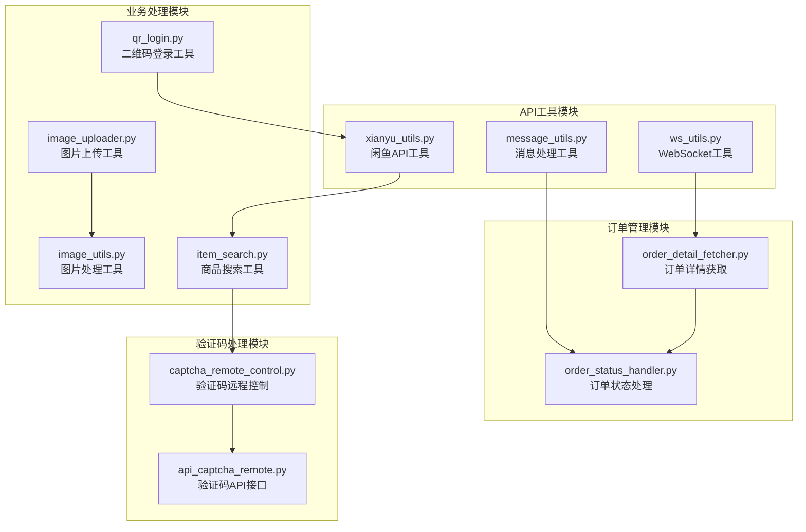
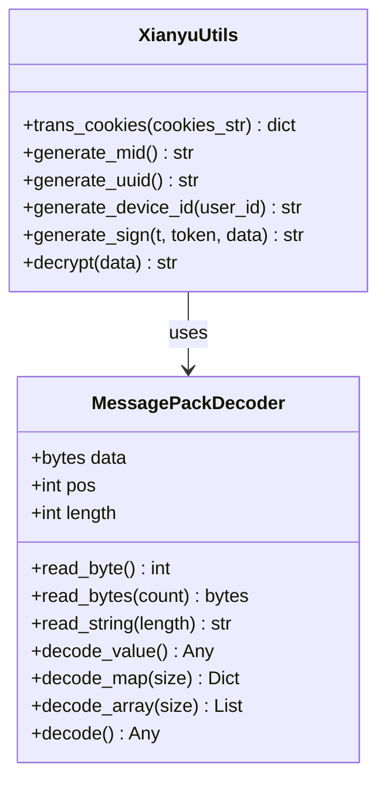
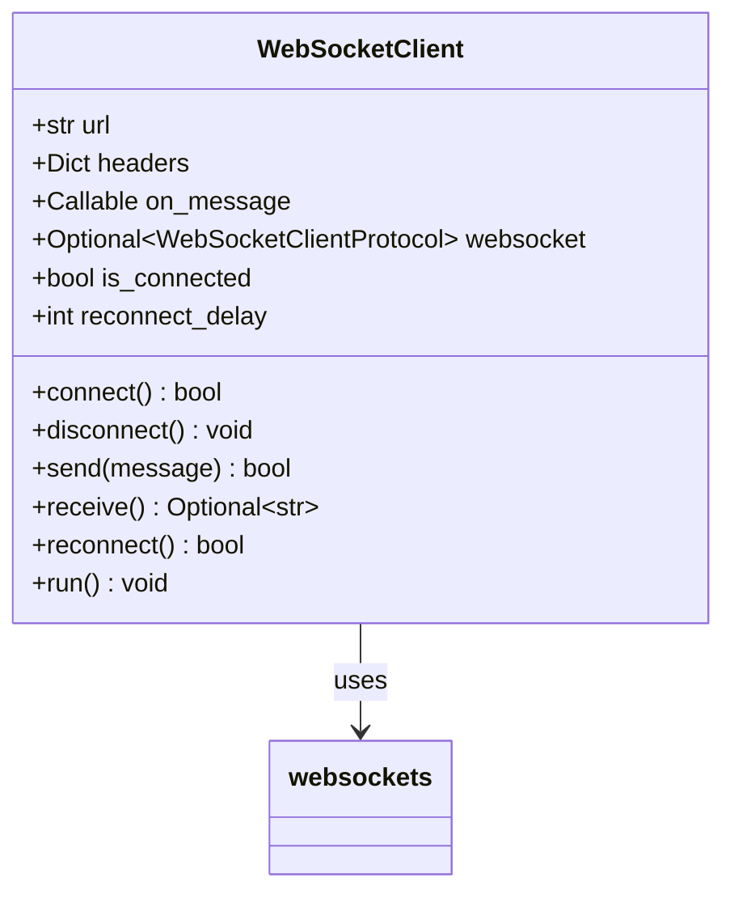
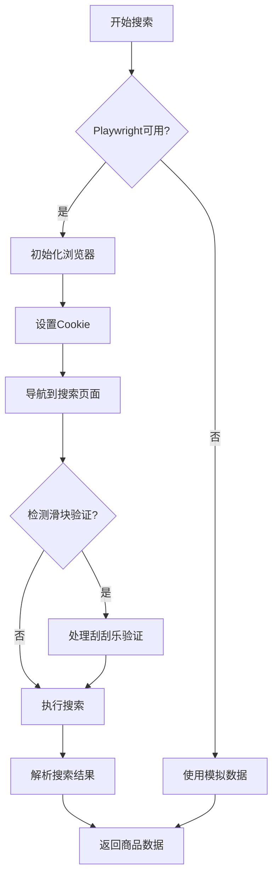
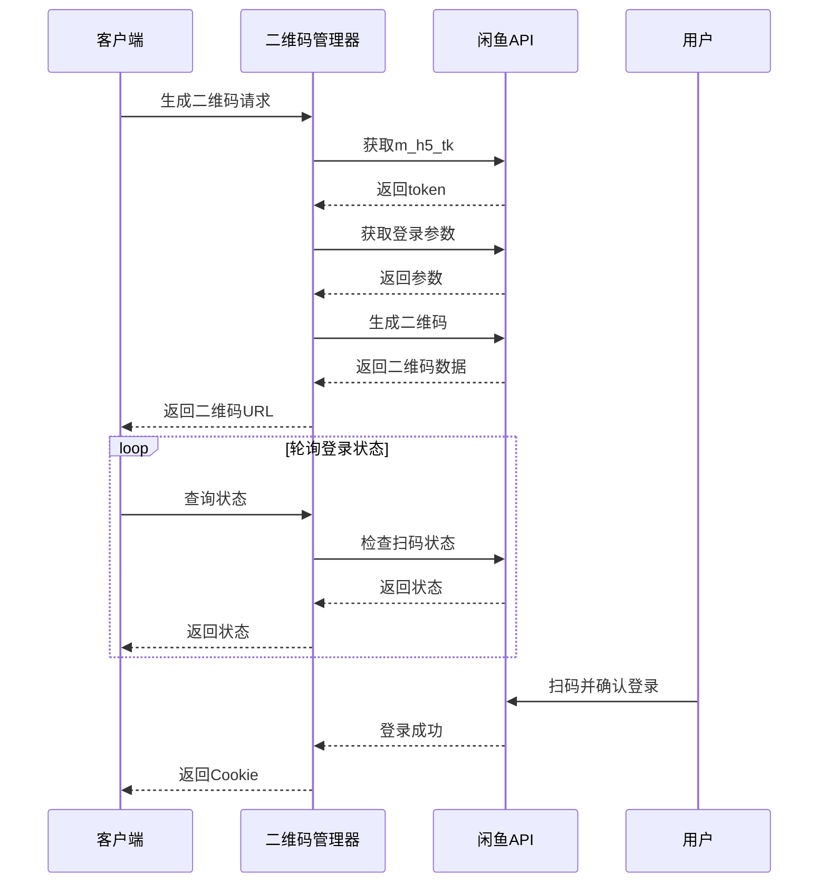

# 工具模块文档

<cite>
**本文档中引用的文件**
- [utils/xianyu_utils.py](file://utils/xianyu_utils.py)
- [utils/message_utils.py](file://utils/message_utils.py)
- [utils/ws_utils.py](file://utils/ws_utils.py)
- [utils/item_search.py](file://utils/item_search.py)
- [utils/qr_login.py](file://utils/qr_login.py)
- [utils/image_uploader.py](file://utils/image_uploader.py)
- [utils/image_utils.py](file://utils/image_utils.py)
- [utils/order_detail_fetcher.py](file://utils/order_detail_fetcher.py)
- [utils/order_status_handler.py](file://utils/order_status_handler.py)
- [utils/captcha_remote_control.py](file://utils/captcha_remote_control.py)
- [utils/api_captcha_remote.py](file://utils/api_captcha_remote.py)
</cite>

## 目录
1. [简介](#简介)
2. [核心工具模块概览](#核心工具模块概览)
3. [闲鱼API工具模块](#闲鱼api工具模块)
4. [消息处理工具模块](#消息处理工具模块)
5. [WebSocket通信工具模块](#websocket通信工具模块)
6. [商品搜索工具模块](#商品搜索工具模块)
7. [二维码登录工具模块](#二维码登录工具模块)
8. [图片处理工具模块](#图片处理工具模块)
9. [订单处理工具模块](#订单处理工具模块)
10. [验证码处理工具模块](#验证码处理工具模块)
11. [使用示例](#使用示例)
12. [总结](#总结)

## 简介

本文档详细介绍了闲鱼自动化系统中各个工具模块的功能和使用方法。这些工具模块涵盖了从API加密签名处理、消息格式化、WebSocket通信、商品搜索、二维码登录、图片处理、订单管理和验证码处理等多个方面，为整个系统的正常运行提供了坚实的技术基础。

## 核心工具模块概览

系统中的工具模块按照功能可分为以下几个主要类别：



**图表来源**
- [utils/xianyu_utils.py](file://utils/xianyu_utils.py#L1-L50)
- [utils/item_search.py](file://utils/item_search.py#L1-L50)
- [utils/order_status_handler.py](file://utils/order_status_handler.py#L1-L50)

## 闲鱼API工具模块

### xianyu_utils.py - 闲鱼API核心工具

xianyu_utils.py模块是整个系统的核心API工具，负责处理闲鱼平台的各种技术细节，包括加密签名生成、Cookie转换、设备ID生成等关键功能。

#### 主要功能特性

1. **JavaScript运行时集成**
   - 自动检测和加载Node.js运行时
   - 提供JavaScript文件路径获取功能
   - 错误处理和运行时配置

2. **Cookie处理功能**
   - `trans_cookies()`函数：将字符串格式的Cookie转换为字典格式
   - 支持标准HTTP Cookie格式解析
   - 键值对分离和存储

3. **设备标识生成**
   - `generate_mid()`：生成设备唯一标识符
   - `generate_uuid()`：生成用户唯一标识符
   - `generate_device_id()`：生成符合闲鱼规范的设备ID

4. **签名算法实现**
   - `generate_sign()`：基于MD5的签名生成算法
   - 使用AppKey、Token和数据生成签名
   - 支持闲鱼API的签名验证要求

5. **数据解密功能**
   - `decrypt()`：解密闲鱼消息数据
   - 支持Base64解码和MessagePack格式解析
   - 提供完整的错误处理和数据验证

#### 核心类和方法



**图表来源**
- [utils/xianyu_utils.py](file://utils/xianyu_utils.py#L110-L379)

**章节来源**
- [utils/xianyu_utils.py](file://utils/xianyu_utils.py#L1-L379)

## 消息处理工具模块

### message_utils.py - 消息格式化和内容过滤

message_utils.py模块专注于消息的格式化和输出处理，为系统提供了统一的消息显示格式和内容过滤功能。

#### 核心功能

1. **消息格式化**
   - `format_message()`：格式化普通消息输出
   - 支持消息方向标识（发出/收到/手动发出）
   - 时间戳格式化和消息内容提取
   - 异常情况的友好错误提示

2. **系统消息格式化**
   - `format_system_message()`：格式化系统通知消息
   - 统一的时间戳格式
   - 系统消息标识符

#### 使用场景

- 聊天界面的消息显示
- 系统日志的消息格式化
- 用户交互反馈的消息展示

**章节来源**
- [utils/message_utils.py](file://utils/message_utils.py#L1-L29)

## WebSocket通信工具模块

### ws_utils.py - WebSocket通信封装

ws_utils.py模块提供了完整的WebSocket客户端实现，支持自动重连、消息发送接收和错误处理等功能。

#### 核心特性

1. **连接管理**
   - 自动连接和断开功能
   - 连接状态监控
   - 优雅的关闭机制

2. **消息处理**
   - 异步消息发送和接收
   - 自动重连机制
   - 错误恢复和状态重置

3. **配置选项**
   - 可配置的重连延迟
   - 自定义请求头支持
   - 异步事件驱动架构

#### 类结构设计



**图表来源**
- [utils/ws_utils.py](file://utils/ws_utils.py#L6-L89)

**章节来源**
- [utils/ws_utils.py](file://utils/ws_utils.py#L1-L89)

## 商品搜索工具模块

### item_search.py - 基于Playwright的商品搜索

item_search.py模块是系统中最复杂的工具之一，基于Playwright库实现了真实的浏览器行为模拟，能够绕过反爬虫机制进行商品搜索和数据抓取。

#### 核心功能架构



**图表来源**
- [utils/item_search.py](file://utils/item_search.py#L768-L800)

#### 主要功能特性

1. **浏览器自动化**
   - Playwright集成和配置
   - 多进程浏览器启动
   - Cookie管理和会话持久化

2. **滑块验证处理**
   - 刮刮乐验证的人工处理模式
   - 异步自动滑块处理
   - 多种滑块类型的识别和处理

3. **搜索功能**
   - 多页搜索支持
   - 商品数据解析
   - 结果缓存和去重

4. **远程控制集成**
   - 刮刮乐验证的远程控制
   - WebSocket实时截图传输
   - 用户交互事件处理

#### 使用示例

在XianyuLive中调用item_search.py的search_multiple_pages()方法：

```python
# 示例：搜索多个页面的商品
from utils.item_search import XianyuSearcher

async def search_commodities():
    searcher = XianyuSearcher()
    try:
        # 初始化浏览器
        await searcher.init_browser()
        
        # 搜索关键词，获取多页结果
        results = await searcher.search_multiple_pages(
            keyword="手机",
            max_pages=5,
            page_size=20
        )
        
        # 处理搜索结果
        for item in results['items']:
            print(f"商品: {item['title']}, 价格: {item['price']}")
            
    finally:
        await searcher.close_browser()
```

**章节来源**
- [utils/item_search.py](file://utils/item_search.py#L1-L800)

## 二维码登录工具模块

### qr_login.py - 闲鱼扫码登录实现

qr_login.py模块实现了闲鱼的二维码登录功能，通过API接口生成二维码并处理登录状态。

#### 功能架构



**图表来源**
- [utils/qr_login.py](file://utils/qr_login.py#L201-L290)

#### 核心功能

1. **二维码生成**
   - 自动生成唯一的会话ID
   - 获取必要的登录参数
   - 生成可扫描的二维码图片

2. **登录状态监控**
   - 异步轮询扫码状态
   - 处理各种登录状态（等待扫码、已扫码、已确认、已过期、已取消）
   - 风控验证处理

3. **会话管理**
   - 会话生命周期管理
   - 自动过期清理
   - Cookie和UNB信息提取

**章节来源**
- [utils/qr_login.py](file://utils/qr_login.py#L1-L452)

## 图片处理工具模块

### image_uploader.py 和 image_utils.py - 图片处理和上传

这两个模块协同工作，提供了完整的图片处理和上传功能。

#### image_utils.py - 图片管理器

image_utils.py提供了基础的图片管理功能：

1. **图片验证**
   - 文件大小检查（最大5MB）
   - 格式验证（支持JPEG、PNG、GIF、WEBP）
   - 尺寸限制（最大4096x4096像素）

2. **图片处理**
   - 自动压缩和调整尺寸
   - 格式转换（RGBA转RGB）
   - 质量优化

3. **文件管理**
   - 唯一文件名生成
   - 目录结构管理
   - 文件删除和信息获取

#### image_uploader.py - 图片上传器

image_uploader.py专注于将图片上传到闲鱼CDN：

1. **上传流程**
   - 图片压缩优化
   - 分块上传支持
   - 断点续传机制

2. **错误处理**
   - Cookie失效检测
   - 上传失败重试
   - 响应解析和URL提取

3. **配置选项**
   - 可配置的上传参数
   - 超时和重试机制
   - 并发连接管理

**章节来源**
- [utils/image_utils.py](file://utils/image_utils.py#L1-L257)
- [utils/image_uploader.py](file://utils/image_uploader.py#L1-L231)

## 订单处理工具模块

### order_detail_fetcher.py - 订单详情获取

order_detail_fetcher.py模块使用Playwright实现真实的浏览器行为，获取订单详情信息。

#### 核心功能

1. **浏览器自动化**
   - Playwright集成和配置
   - 多进程浏览器启动
   - Cookie管理和会话持久化

2. **订单信息提取**
   - SKU规格信息解析
   - 数量和金额提取
   - 订单状态识别

3. **数据库集成**
   - 订单数据缓存
   - 重复查询优化
   - 数据一致性保证

#### order_status_handler.py - 订单状态处理

order_status_handler.py专门处理订单状态更新逻辑：

1. **状态转换规则**
   - 完整的状态转换矩阵
   - 严格的验证机制
   - 特殊状态处理（退款撤销）

2. **消息处理**
   - 系统消息解析
   - 红色提醒消息处理
   - 订单ID提取和验证

3. **队列管理**
   - 待处理更新队列
   - 过期数据清理
   - 并发安全保护

**章节来源**
- [utils/order_detail_fetcher.py](file://utils/order_detail_fetcher.py#L1-L764)
- [utils/order_status_handler.py](file://utils/order_status_handler.py#L1-L800)

## 验证码处理工具模块

### captcha_remote_control.py - 验证码远程控制

captcha_remote_control.py模块实现了刮刮乐验证码的远程控制功能，通过WebSocket实现实时交互。

#### 核心功能

1. **远程控制架构**
   - WebSocket连接管理
   - 实时截图传输
   - 用户交互事件处理

2. **验证码处理**
   - 滑块位置检测
   - 截图区域优化
   - 鼠标事件模拟

3. **状态监控**
   - 验证完成检测
   - 自动刷新机制
   - 会话生命周期管理

#### api_captcha_remote.py - 验证码API接口

api_captcha_remote.py提供了验证码处理的API接口，与前端控制系统配合使用。

**章节来源**
- [utils/captcha_remote_control.py](file://utils/captcha_remote_control.py#L1-L369)

## 使用示例

### XianyuLive中调用商品搜索

以下是XianyuLive中调用item_search.py模块的具体示例：

```python
# 在XianyuLive中使用商品搜索功能
from utils.item_search import XianyuSearcher

async def search_commodities_in_live():
    searcher = XianyuSearcher()
    try:
        # 初始化浏览器
        await searcher.init_browser()
        
        # 搜索关键词，获取多页结果
        results = await searcher.search_multiple_pages(
            keyword="手机",
            max_pages=5,
            page_size=20
        )
        
        # 处理搜索结果
        for item in results['items']:
            print(f"商品: {item['title']}, 价格: {item['price']}")
            
    finally:
        await searcher.close_browser()
```

### 二维码登录流程

```python
# 二维码登录示例
from utils.qr_login import qr_login_manager

async def qr_login_example():
    # 生成二维码
    qr_result = await qr_login_manager.generate_qr_code()
    
    if qr_result['success']:
        session_id = qr_result['session_id']
        qr_url = qr_result['qr_code_url']
        
        # 显示二维码给用户
        print(f"请扫描二维码: {qr_url}")
        
        # 轮询登录状态
        while True:
            status = qr_login_manager.get_session_status(session_id)
            if status['status'] == 'success':
                cookies = status['cookies']
                unb = status['unb']
                print(f"登录成功，获取到Cookie: {cookies}")
                break
            elif status['status'] == 'expired':
                print("二维码已过期")
                break
            await asyncio.sleep(1)
```

### 图片上传示例

```python
# 图片上传示例
from utils.image_uploader import ImageUploader

async def upload_image_example(image_path, cookies):
    uploader = ImageUploader(cookies)
    try:
        # 上传图片
        image_url = await uploader.upload_image(image_path)
        if image_url:
            print(f"图片上传成功: {image_url}")
            return image_url
        else:
            print("图片上传失败")
    finally:
        await uploader.close_session()
```

## 总结

本文档详细介绍了闲鱼自动化系统中各个工具模块的功能和使用方法。这些工具模块构成了系统的核心基础设施，每个模块都有其特定的职责和应用场景：

1. **API工具模块**（xianyu_utils.py）提供了闲鱼平台的技术支持
2. **消息处理模块**（message_utils.py）负责消息格式化和输出
3. **WebSocket模块**（ws_utils.py）实现了实时通信功能
4. **商品搜索模块**（item_search.py）基于Playwright实现了真实的浏览器行为
5. **二维码登录模块**（qr_login.py）提供了便捷的登录方式
6. **图片处理模块**（image_utils.py和image_uploader.py）处理图片上传和管理
7. **订单处理模块**（order_detail_fetcher.py和order_status_handler.py）管理订单状态
8. **验证码处理模块**（captcha_remote_control.py和api_captcha_remote.py）处理复杂的验证码挑战

这些模块相互协作，形成了一个完整的闲鱼自动化解决方案，为后续的业务逻辑实现奠定了坚实的基础。通过合理使用这些工具模块，开发者可以构建出功能强大、稳定可靠的闲鱼自动化应用。