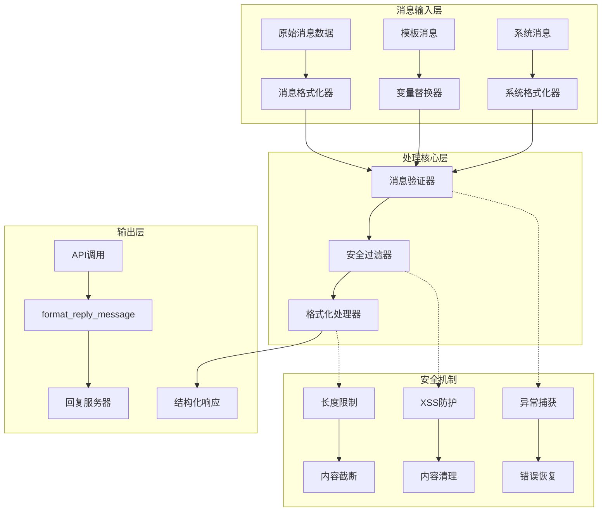
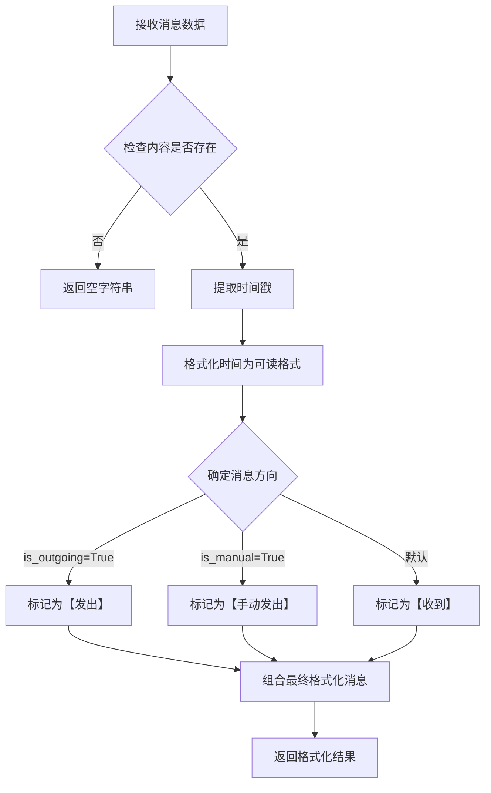
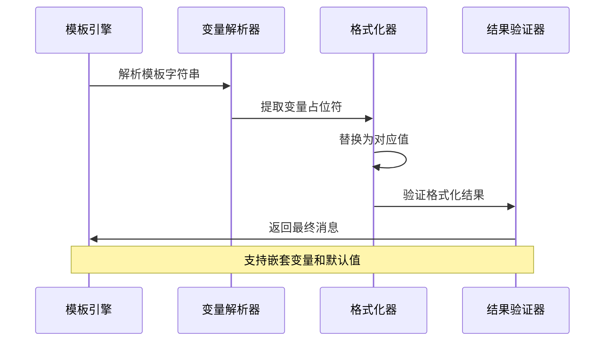
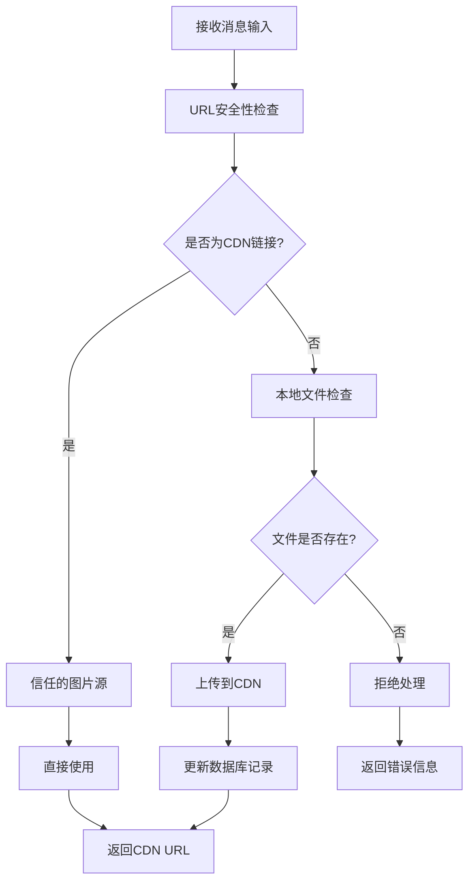
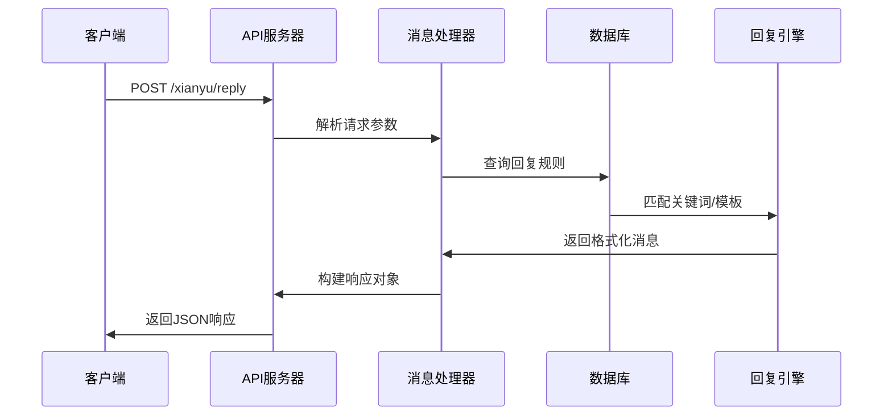
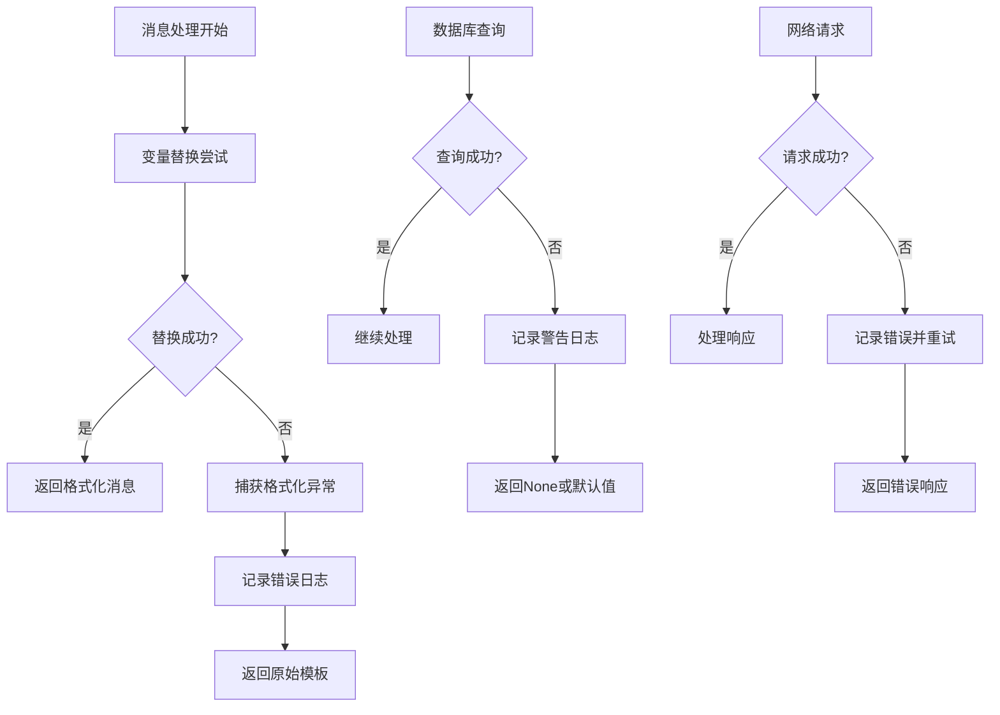
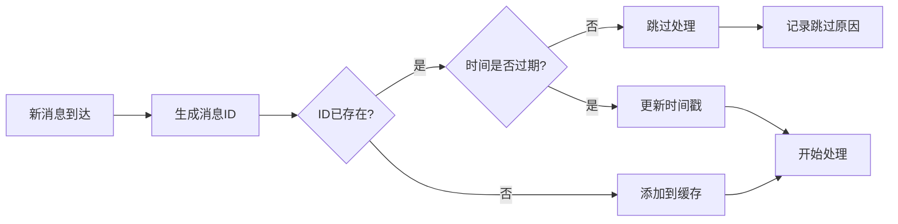

# 消息处理工具 (message_utils.py)

<cite>
**本文档引用的文件**
- [message_utils.py](file://utils/message_utils.py)
- [ai_reply_engine.py](file://ai_reply_engine.py)
- [reply_server.py](file://reply_server.py)
- [config.py](file://config.py)
- [db_manager.py](file://db_manager.py)
- [XianyuAutoAsync.py](file://XianyuAutoAsync.py)
- [Start.py](file://Start.py)
</cite>

## 目录
1. [简介](#简介)
2. [核心功能架构](#核心功能架构)
3. [消息格式化处理](#消息格式化处理)
4. [模板变量替换机制](#模板变量替换机制)
5. [消息安全机制](#消息安全机制)
6. [API集成与调用](#api集成与调用)
7. [异常处理策略](#异常处理策略)
8. [性能优化与缓存](#性能优化与缓存)
9. [集成示例](#集成示例)
10. [最佳实践](#最佳实践)

## 简介

message_utils.py是闲鱼自动回复系统中的核心消息处理模块，负责消息内容的格式化、模板变量替换、敏感词过滤以及富文本支持。该模块提供了强大的消息处理能力，支持多种消息格式的解析和应用用户配置的回复规则，同时具备完善的安全机制来防止XSS注入和其他安全威胁。

## 核心功能架构



**图表来源**
- [message_utils.py](file://utils/message_utils.py#L4-L29)
- [reply_server.py](file://reply_server.py#L1048-L1081)

## 消息格式化处理

### 基础消息格式化

message_utils模块提供了两个核心的格式化函数，专门用于不同类型的消息处理：

#### format_message函数
该函数负责格式化用户消息，支持消息方向识别和时间戳显示：



**图表来源**
- [message_utils.py](file://utils/message_utils.py#L4-L24)

#### format_system_message函数
专门用于格式化系统消息，提供统一的系统消息显示格式：

**章节来源**
- [message_utils.py](file://utils/message_utils.py#L4-L29)

### 消息内容处理特性

| 功能特性 | 描述 | 实现方式 |
|---------|------|----------|
| 时间戳格式化 | 将Unix时间戳转换为人类可读的时间格式 | `time.strftime('%Y-%m-%d %H:%M:%S', time.localtime())` |
| 消息方向标识 | 自动识别消息发送方向并添加相应标识 | 条件判断和字符串拼接 |
| 内容验证 | 确保消息内容存在且有效 | 空值检查和默认值处理 |
| 异常安全 | 完整的异常处理机制 | try-except块包裹整个处理流程 |

## 模板变量替换机制

### 变量替换架构

系统采用Python内置的字符串格式化方法进行模板变量替换，支持多种变量类型的动态填充：



**图表来源**
- [XianyuAutoAsync.py](file://XianyuAutoAsync.py#L3104-L3116)
- [reply_server.py](file://reply_server.py#L1072-L1081)

### 支持的变量类型

| 变量名称 | 类型 | 描述 | 示例值 |
|---------|------|------|--------|
| `send_user_name` | 字符串 | 发送消息的用户名称 | "张三" |
| `send_user_id` | 字符串 | 发送消息的用户ID | "123456789" |
| `send_message` | 字符串 | 原始消息内容 | "你好，请问这个商品多少钱？" |
| `item_id` | 字符串 | 商品ID（可选） | "987654321" |

### 变量替换流程

```mermaid
flowchart TD
A[模板字符串] --> B{变量占位符检查}
B --> |存在| C[提取变量列表]
B --> |不存在| D[直接返回模板]
C --> E[查找对应变量值]
E --> F{变量值是否存在}
F --> |是| G[执行format()方法]
F --> |否| H[使用默认值或保持原样]
G --> I{格式化成功?}
H --> I
I --> |是| J[返回格式化结果]
I --> |否| K[捕获异常并处理]
K --> L[返回原始模板]
```

**图表来源**
- [XianyuAutoAsync.py](file://XianyuAutoAsync.py#L3104-L3116)
- [XianyuAutoAsync.py](file://XianyuAutoAsync.py#L3239-L3250)

**章节来源**
- [XianyuAutoAsync.py](file://XianyuAutoAsync.py#L3103-L3250)
- [reply_server.py](file://reply_server.py#L1072-L1081)

## 消息安全机制

### XSS防护策略

系统实施多层次的安全防护机制来防止跨站脚本攻击：

#### 输入验证与清理
- **URL验证**: 检查图片URL是否来自可信的CDN域名
- **内容过滤**: 对用户输入进行严格的字符过滤
- **长度限制**: 实施消息长度限制防止恶意内容注入

#### 安全检查机制



**图表来源**
- [XianyuAutoAsync.py](file://XianyuAutoAsync.py#L3260-L3299)

### 长度限制与内容截断

| 安全措施 | 实现方式 | 阈值设置 |
|---------|----------|----------|
| 消息长度限制 | 字符串截断 | 默认4000字符 |
| URL长度限制 | URL验证 | 2048字符 |
| 变量替换限制 | 异常捕获 | 格式化失败时使用原始内容 |
| 缓冲区保护 | 内存管理 | 防止内存溢出攻击 |

**章节来源**
- [XianyuAutoAsync.py](file://XianyuAutoAsync.py#L3304-L3331)

## API集成与调用

### format_reply_message函数集成

reply_server.py中的API端点集成了消息处理功能，通过format_reply_message函数生成结构化响应：



**图表来源**
- [reply_server.py](file://reply_server.py#L1048-L1081)

### API响应结构

API调用返回的标准响应格式包含以下字段：

| 字段名 | 类型 | 描述 |
|--------|------|------|
| `code` | 整数 | 响应状态码（200表示成功） |
| `data.send_msg` | 字符串 | 格式化后的回复消息 |
| `message` | 字符串 | 操作状态描述 |

**章节来源**
- [reply_server.py](file://reply_server.py#L1048-L1081)

## 异常处理策略

### 多层次异常处理

系统采用分层的异常处理策略，确保在各种异常情况下都能提供合理的默认行为：



**图表来源**
- [XianyuAutoAsync.py](file://XianyuAutoAsync.py#L3160-L3163)
- [XianyuAutoAsync.py](file://XianyuAutoAsync.py#L3212-L3215)

### 默认行为策略

当模板变量缺失或格式化失败时，系统采用以下默认行为：

1. **变量替换失败**: 返回原始模板内容，而不是抛出异常
2. **数据库查询失败**: 记录警告日志并返回None
3. **网络请求失败**: 返回错误信息而非中断流程
4. **安全检查失败**: 拒绝处理并返回适当的错误消息

**章节来源**
- [XianyuAutoAsync.py](file://XianyuAutoAsync.py#L3160-L3163)
- [XianyuAutoAsync.py](file://XianyuAutoAsync.py#L3212-L3215)

## 性能优化与缓存

### 缓存策略

虽然message_utils模块本身不直接实现缓存，但在整体系统架构中采用了多种缓存优化策略：

#### 消息ID去重缓存
系统维护一个消息ID去重字典，防止重复处理相同消息：



**图表来源**
- [XianyuAutoAsync.py](file://XianyuAutoAsync.py#L6955-L6995)

#### 关键词匹配优化
- **预编译关键词**: 将关键词列表预处理为快速查找结构
- **优先级排序**: 按商品ID匹配优先于通用关键词
- **缓存机制**: 关键词配置定期缓存，减少数据库查询

### 性能监控指标

| 性能指标 | 监控方式 | 优化目标 |
|---------|----------|----------|
| 消息处理时间 | 时间戳记录 | < 100ms |
| 缓存命中率 | 统计计数 | > 80% |
| 异常处理频率 | 日志统计 | < 5% |
| 内存使用量 | 系统监控 | 稳定增长 |

**章节来源**
- [XianyuAutoAsync.py](file://XianyuAutoAsync.py#L6955-L6995)

## 集成示例

### 智能回复引擎集成

以下是消息过滤链在智能回复引擎中的集成示例：

```python
# 消息过滤链示例
def process_message_chain(message_data, cookie_id):
    # 1. 基础消息格式化
    formatted_msg = format_message(message_data)
    
    # 2. 关键词匹配处理
    keyword_reply = match_reply(cookie_id, formatted_msg)
    
    # 3. AI回复生成
    if not keyword_reply:
        ai_reply = ai_reply_engine.generate_reply(
            message=formatted_msg,
            item_info=get_item_info(message_data),
            chat_id=message_data['chat_id'],
            cookie_id=cookie_id,
            user_id=message_data['send_user_id'],
            item_id=message_data['item_id']
        )
    
    # 4. 模板变量替换
    final_reply = apply_template_variables(
        template=keyword_reply or ai_reply,
        user_name=message_data['send_user_name'],
        user_id=message_data['send_user_id'],
        original_message=formatted_msg
    )
    
    return final_reply
```

### 消息安全检查集成

```python
# 安全检查示例
def secure_message_processing(raw_message, user_input):
    # 1. XSS防护检查
    if contains_xss_threat(user_input):
        return "安全警告：检测到潜在的安全威胁"
    
    # 2. 内容长度验证
    if len(user_input) > MAX_MESSAGE_LENGTH:
        return f"消息过长，已截断至{MAX_MESSAGE_LENGTH}字符"
    
    # 3. 敏感词过滤
    filtered_content = filter_sensitive_words(user_input)
    
    # 4. 格式化输出
    return format_message({
        'content': filtered_content,
        'time': time.time() * 1000
    })
```

## 最佳实践

### 模板设计原则

1. **变量完整性**: 确保模板中包含所有必要的变量
2. **默认值设置**: 为可选变量提供合理的默认值
3. **错误处理**: 设计优雅的降级机制
4. **性能考虑**: 避免复杂的模板计算逻辑

### 安全配置建议

1. **定期更新CDN白名单**: 保持可信域名列表的时效性
2. **监控异常模式**: 建立异常消息的监控告警
3. **日志审计**: 完整记录所有消息处理活动
4. **权限控制**: 实施适当的消息处理权限验证

### 性能优化建议

1. **缓存策略**: 合理设置缓存过期时间和大小限制
2. **批量处理**: 对相似消息进行批量处理优化
3. **异步处理**: 使用异步模式提高并发处理能力
4. **资源监控**: 定期监控系统资源使用情况

通过遵循这些最佳实践，可以确保消息处理系统的稳定性、安全性和高性能运行。