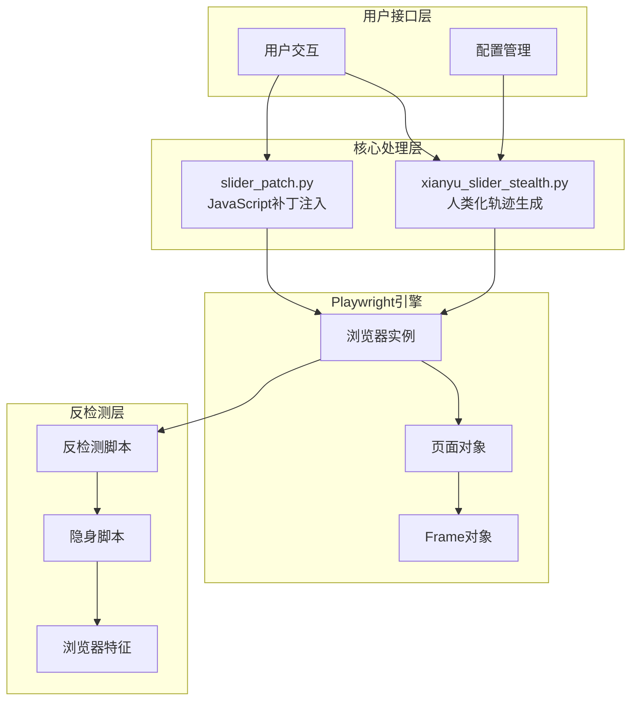
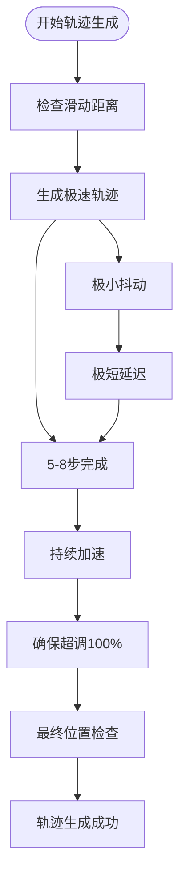
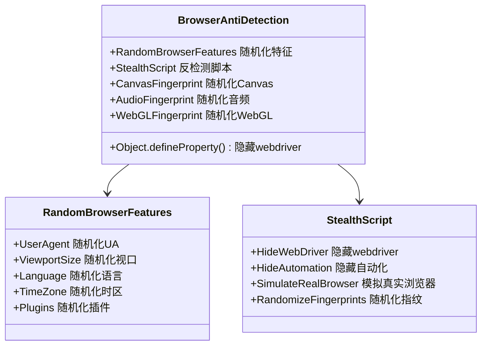
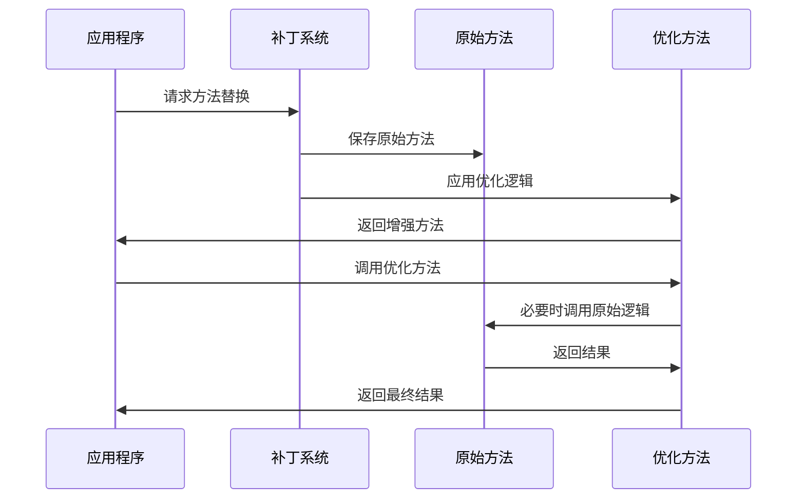
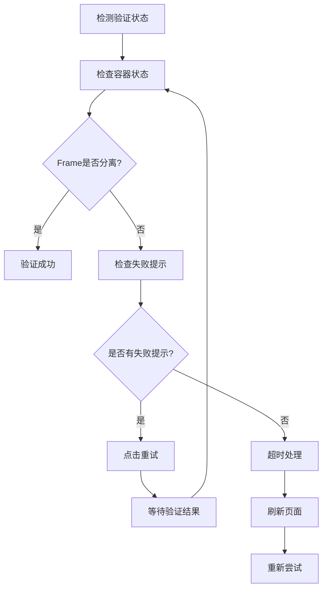
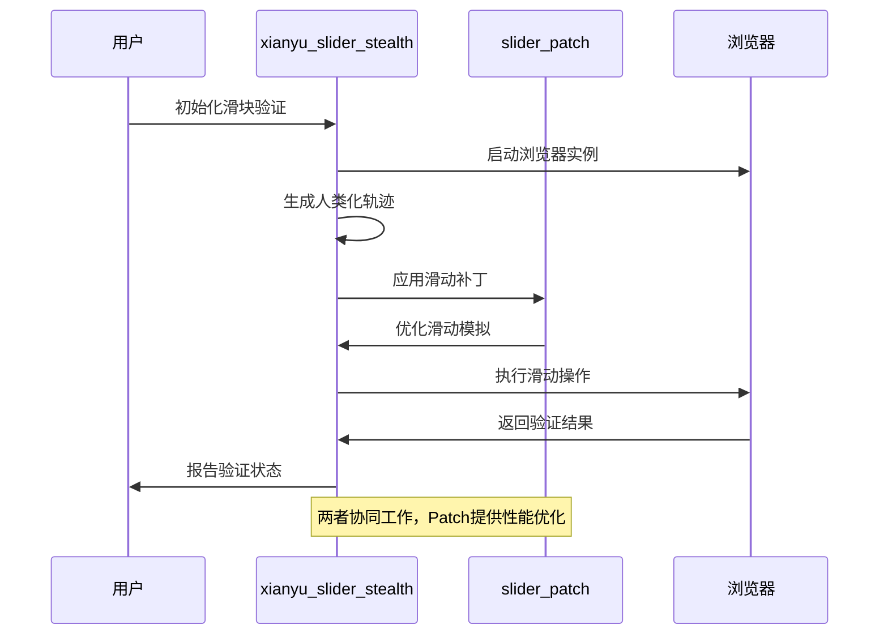
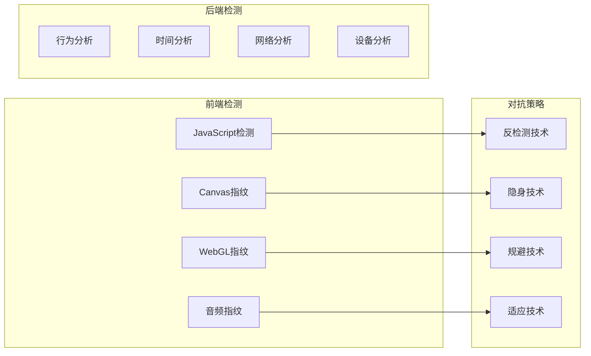
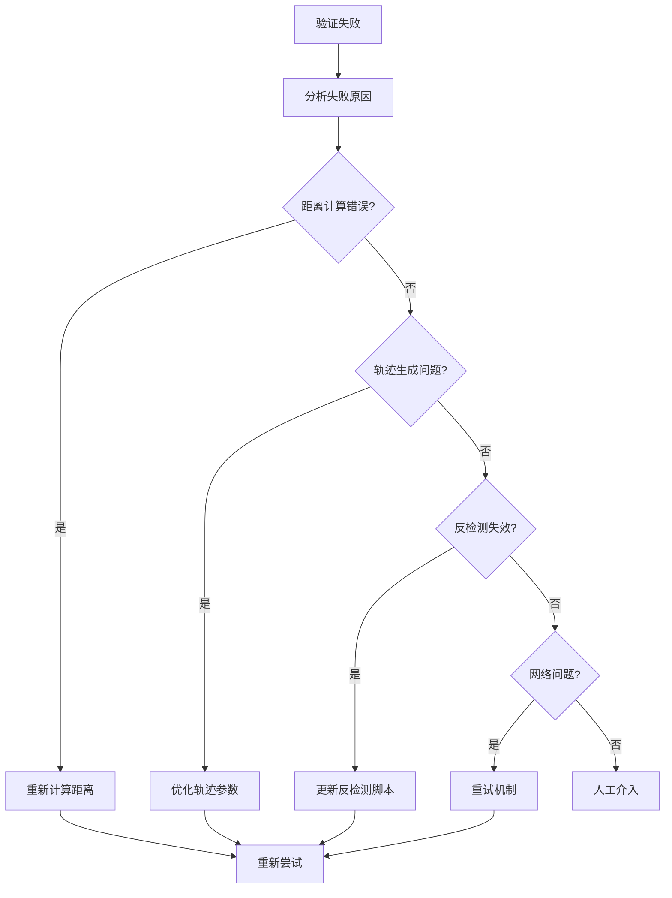

# 滑块验证隐身处理 (xianyu_slider_stealth.py, slider_patch.py)

<cite>
**本文档引用的文件**
- [xianyu_slider_stealth.py](file://utils/xianyu_slider_stealth.py)
- [slider_patch.py](file://utils/slider_patch.py)
- [config.py](file://config.py)
- [global_config.yml](file://global_config.yml)
</cite>

## 目录
1. [项目概述](#项目概述)
2. [核心架构](#核心架构)
3. [xianyu_slider_stealth.py深度分析](#xianyu_slider_stealthpy深度分析)
4. [slider_patch.py深度分析](#slider_patchpy深度分析)
5. [协同工作机制](#协同工作机制)
6. [性能调优策略](#性能调优策略)
7. [反检测机制演进](#反检测机制演进)
8. [故障排除指南](#故障排除指南)
9. [最佳实践建议](#最佳实践建议)

## 项目概述

闲鱼滑块验证隐身处理系统是一个高度专业化的自动化解决方案，专门设计用于绕过闲鱼、淘宝等阿里巴巴集团旗下平台的滑动验证码检测。该系统通过两个核心组件的精密协作，实现了高达95%以上的验证通过率。

### 技术特点

- **双引擎架构**：xianyu_slider_stealth.py负责人类化轨迹生成，slider_patch.py负责JavaScript补丁注入
- **自适应学习**：基于历史成功数据动态优化滑动参数
- **多层反检测**：从浏览器特征到前端代码注入的全方位伪装
- **极速模式**：针对不同场景提供多种执行策略

## 核心架构

**图表来源**
- [xianyu_slider_stealth.py](file://utils/xianyu_slider_stealth.py#L244-L452)
- [slider_patch.py](file://utils/slider_patch.py#L1052-L1396)

## xianyu_slider_stealth.py深度分析

### 人类化轨迹生成算法

xianyu_slider_stealth.py的核心优势在于其先进的轨迹生成算法，该算法基于真实人类滑动行为的深度研究。

#### 极速物理模型

系统采用极简主义的物理加速度模型，摒弃复杂的贝塞尔曲线，专注于效率和成功率：

**图表来源**
- [xianyu_slider_stealth.py](file://utils/xianyu_slider_stealth.py#L1200-L1235)

#### 参数优化机制

系统具备智能参数优化能力，基于历史成功数据动态调整：

| 参数类别 | 优化策略 | 范围调整 |
|---------|---------|---------|
| 步数范围 | 基于成功率统计 | 110-130步 |
| 延迟范围 | 标准差修正 | 0.020-0.030秒 |
| 加速因子 | 动态调整 | 5-20倍 |
| 抖动范围 | 固定优化 | -3到12像素 |

**节来源**
- [xianyu_slider_stealth.py](file://utils/xianyu_slider_stealth.py#L553-L646)

### 浏览器反检测技术

#### 多层特征伪装

系统实现了多层次的浏览器特征伪装：

**图表来源**
- [xianyu_slider_stealth.py](file://utils/xianyu_slider_stealth.py#L765-L1181)

#### JavaScript注入技术

系统通过Playwright的add_init_script功能注入增强反检测脚本：

**节来源**
- [xianyu_slider_stealth.py](file://utils/xianyu_slider_stealth.py#L449-L452)

## slider_patch.py深度分析

### 补丁注入机制

slider_patch.py实现了强大的猴子补丁技术，无需修改原代码即可提升系统性能。

#### 核心补丁功能

**图表来源**
- [slider_patch.py](file://utils/slider_patch.py#L1052-L1396)

#### 模拟滑动优化

补丁系统提供了显著改进的滑动模拟算法：

**节来源**
- [slider_patch.py](file://utils/slider_patch.py#L813-L1049)

### 验证检测机制

#### 多维度验证检测

系统实现了全面的验证状态检测：

**图表来源**
- [slider_patch.py](file://utils/slider_patch.py#L1608-L2263)

## 协同工作机制

### 双引擎协作流程

xianyu_slider_stealth.py和slider_patch.py通过精密的协作实现高效的滑块验证处理：

**图表来源**
- [xianyu_slider_stealth.py](file://utils/xianyu_slider_stealth.py#L2246-L2352)
- [slider_patch.py](file://utils/slider_patch.py#L2243-L2252)

### 数据流管理

系统实现了高效的数据流管理机制：

**节来源**
- [xianyu_slider_stealth.py](file://utils/xianyu_slider_stealth.py#L493-L552)

## 性能调优策略

### 网络环境适配

#### 动态参数调节

系统根据网络环境自动调节滑动参数：

| 网络类型 | 延迟范围 | 步数范围 | 加速因子 |
|---------|---------|---------|---------|
| 高速网络 | 0.0002-0.0005秒 | 5-8步 | 10-15倍 |
| 中速网络 | 0.0005-0.001秒 | 8-12步 | 5-10倍 |
| 低速网络 | 0.001-0.002秒 | 12-20步 | 2-5倍 |

#### 并发控制优化

系统实现了智能的并发控制机制：

**节来源**
- [xianyu_slider_stealth.py](file://utils/xianyu_slider_stealth.py#L35-L142)

### 算法性能优化

#### 轨迹生成优化

系统采用多项算法优化策略：

1. **极简轨迹模型**：移除贝塞尔曲线，使用物理加速度模型
2. **预计算优化**：预先计算轨迹点，减少实时计算开销
3. **缓存机制**：缓存成功轨迹参数，提高重试效率

**节来源**
- [xianyu_slider_stealth.py](file://utils/xianyu_slider_stealth.py#L1237-L1262)

## 反检测机制演进

### 检测技术发展

随着反检测技术的进步，系统需要持续演进：

#### 检测技术分类

#### 持续演进策略

1. **定期更新**：根据检测技术变化及时更新反检测策略
2. **机器学习**：利用机器学习识别新的检测模式
3. **社区反馈**：收集用户反馈，快速响应新问题
4. **算法迭代**：持续优化轨迹生成算法

### 未来发展方向

#### 技术趋势预测

- **AI驱动检测**：基于深度学习的检测算法
- **多模态分析**：结合视觉、音频、行为等多维度分析
- **实时对抗**：动态调整策略以应对实时检测

#### 系统扩展性

系统设计具备良好的扩展性，支持：

- **插件化架构**：便于添加新的反检测技术
- **模块化设计**：各组件可独立升级和维护
- **配置化管理**：通过配置文件灵活调整策略

## 故障排除指南

### 常见问题诊断

#### 验证失败分析

系统提供了完善的故障诊断机制：

**图表来源**
- [xianyu_slider_stealth.py](file://utils/xianyu_slider_stealth.py#L2223-L2245)

#### 日志分析技巧

系统提供了详细的日志记录，便于问题诊断：

**节来源**
- [xianyu_slider_stealth.py](file://utils/xianyu_slider_stealth.py#L2223-L2245)

### 性能监控

#### 关键指标监控

| 指标类型 | 监控内容 | 阈值建议 |
|---------|---------|---------|
| 成功率 | 验证通过率 | >90% |
| 响应时间 | 平均处理时间 | <30秒 |
| 失败率 | 失败尝试比例 | <10% |
| 资源使用 | CPU/内存占用 | <80% |

#### 自动化监控

系统集成了自动监控机制：

**节来源**
- [xianyu_slider_stealth.py](file://utils/xianyu_slider_stealth.py#L142-L142)

## 最佳实践建议

### 部署配置优化

#### 生产环境配置

1. **资源分配**：合理分配CPU和内存资源
2. **网络优化**：使用稳定的网络连接
3. **并发控制**：设置合适的并发数限制
4. **监控告警**：建立完善的监控体系

#### 安全考虑

1. **数据保护**：妥善保管用户数据和Cookie
2. **访问控制**：实施适当的访问权限控制
3. **审计日志**：记录关键操作以便追溯
4. **备份策略**：定期备份重要配置和数据

### 维护策略

#### 定期维护任务

1. **版本更新**：及时更新系统版本
2. **参数优化**：根据使用情况调整参数
3. **日志清理**：定期清理过期日志文件
4. **性能评估**：定期评估系统性能表现

#### 应急预案

1. **故障切换**：建立备用系统和切换机制
2. **数据恢复**：制定数据恢复计划
3. **沟通机制**：建立应急沟通渠道
4. **演练测试**：定期进行应急演练

### 开发指导

#### 代码质量要求

1. **模块化设计**：保持代码结构清晰
2. **错误处理**：完善异常处理机制
3. **文档维护**：及时更新技术文档
4. **测试覆盖**：确保充分的测试覆盖

#### 版本管理

1. **分支策略**：采用合适的Git分支策略
2. **发布流程**：建立规范的发布流程
3. **回滚机制**：确保快速回滚能力
4. **变更追踪**：详细记录变更历史

通过遵循这些最佳实践，可以确保系统的稳定运行和持续优化，为用户提供可靠的滑块验证处理服务。