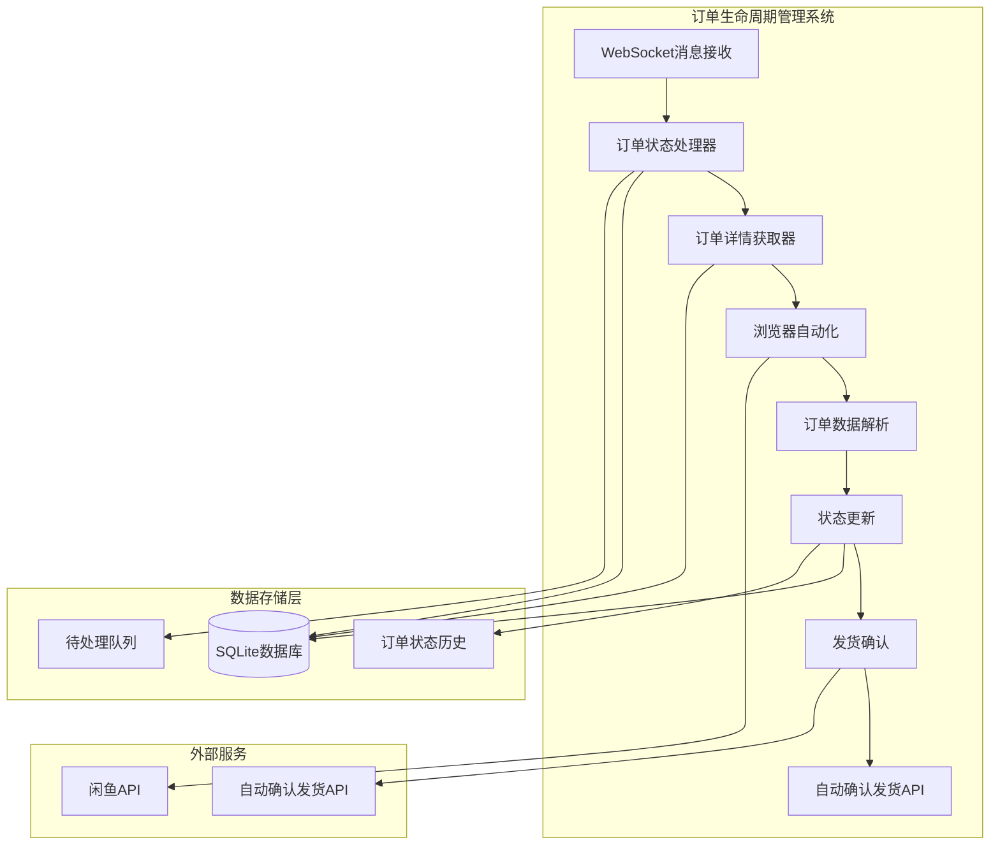
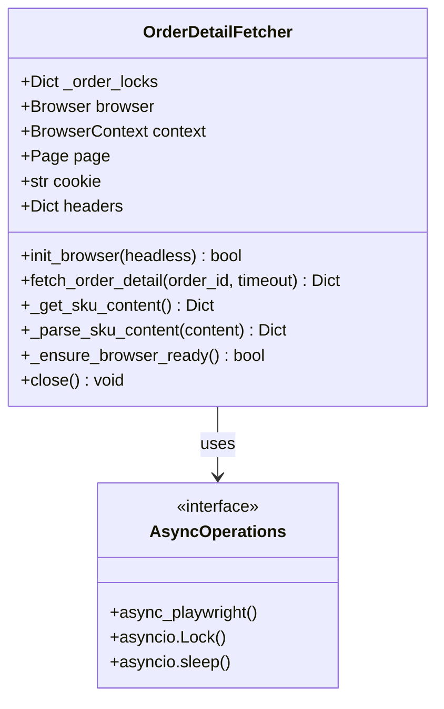
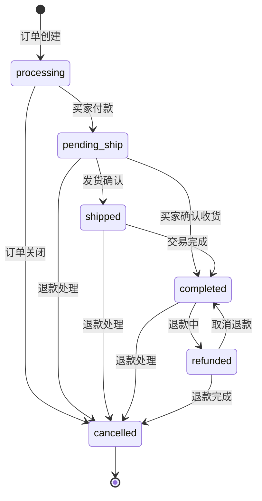
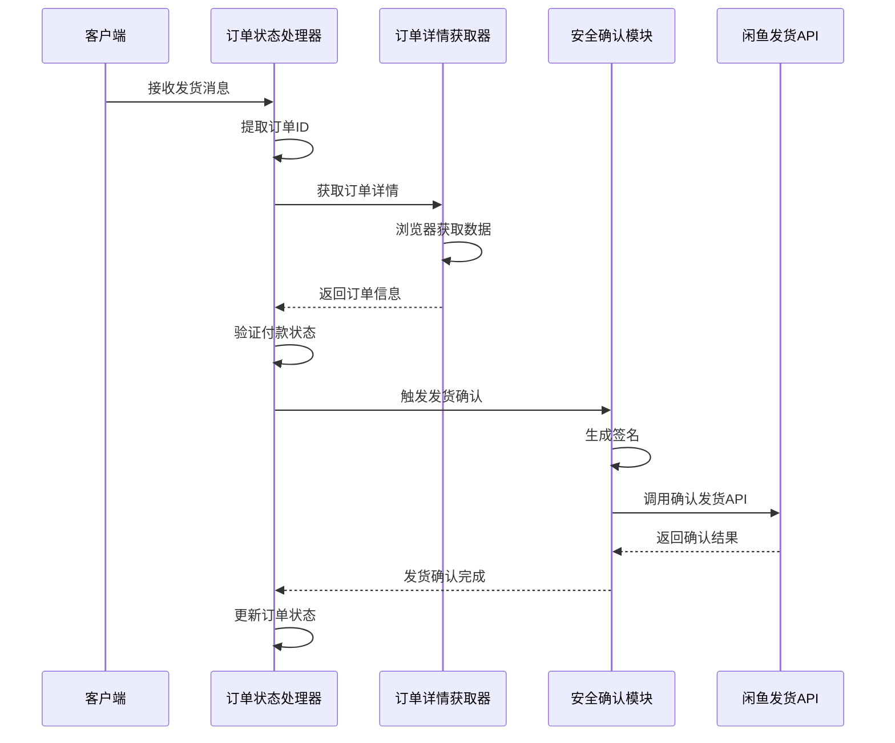
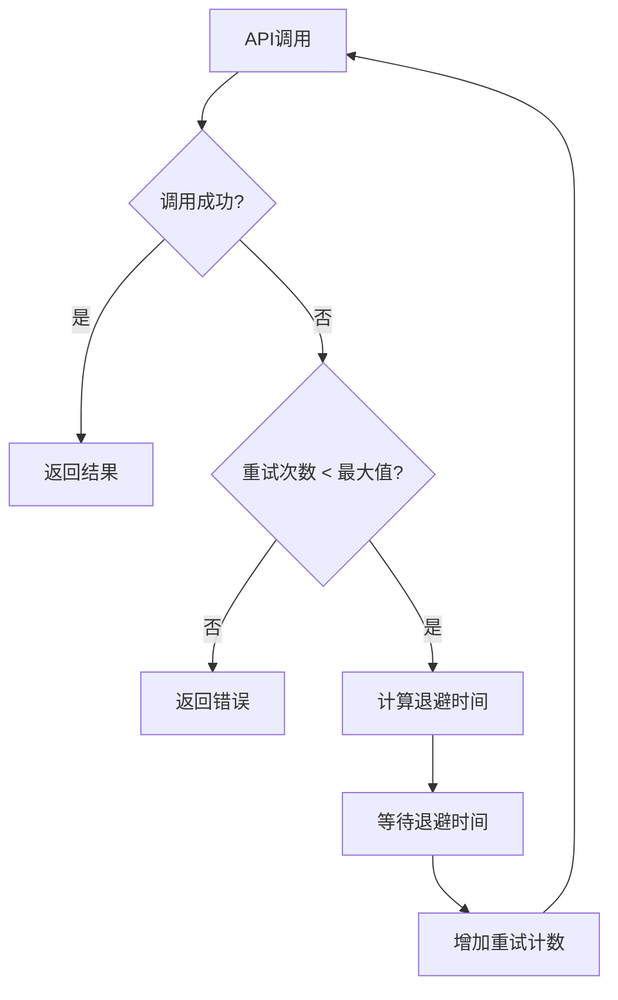
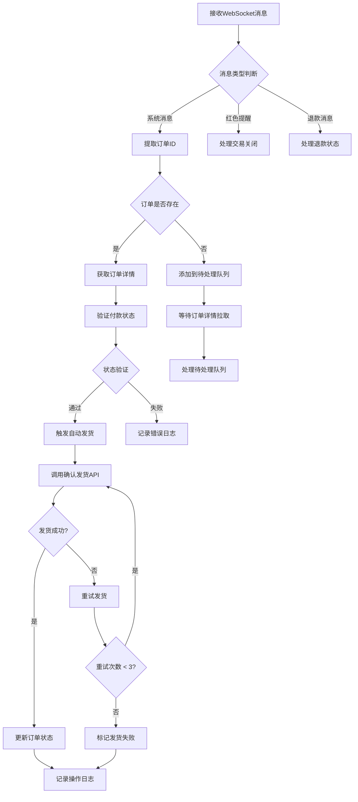

# 订单信息获取与状态处理 (order_detail_fetcher.py, order_status_handler.py)

<cite>
**本文档引用的文件**
- [order_detail_fetcher.py](file://utils/order_detail_fetcher.py)
- [order_status_handler.py](file://order_status_handler.py)
- [secure_confirm_ultra.py](file://secure_confirm_ultra.py)
- [secure_confirm_decrypted.py](file://secure_confirm_decrypted.py)
- [config.py](file://config.py)
- [db_manager.py](file://db_manager.py)
- [XianyuAutoAsync.py](file://XianyuAutoAsync.py)
</cite>

## 目录
1. [简介](#简介)
2. [系统架构概览](#系统架构概览)
3. [订单详情获取模块 (order_detail_fetcher.py)](#订单详情获取模块-order_detail_fetcherpy)
4. [订单状态处理模块 (order_status_handler.py)](#订单状态处理模块-order_status_handlerpy)
5. [发货确认流程](#发货确认流程)
6. [错误处理与重试机制](#错误处理与重试机制)
7. [日志记录与审计追踪](#日志记录与审计追踪)
8. [完整工作流程](#完整工作流程)
9. [性能优化策略](#性能优化策略)
10. [故障排除指南](#故障排除指南)

## 简介

本文档详细阐述了闲鱼自动回复系统中订单生命周期管理的核心组件：`order_detail_fetcher.py` 和 `order_status_handler.py` 的协作机制。这两个模块共同构成了一个完整的订单信息获取、状态管理和自动发货确认系统，确保商家能够高效处理闲鱼平台上的订单交易。

系统采用异步架构设计，通过浏览器自动化技术获取订单详情，结合智能状态管理算法，实现了从订单识别到完成确认的全链路自动化处理。

## 系统架构概览



**图表来源**
- [order_status_handler.py](file://order_status_handler.py#L26-L80)
- [order_detail_fetcher.py](file://utils/order_detail_fetcher.py#L37-L172)

## 订单详情获取模块 (order_detail_fetcher.py)

### 核心功能概述

`OrderDetailFetcher` 类负责通过浏览器自动化技术从闲鱼平台获取订单详细信息，包括买家信息、商品规格、支付状态等关键数据。

### 主要特性

1. **并发安全设计**：使用分布式锁机制确保同一订单不会被重复处理
2. **智能缓存策略**：优先从数据库缓存获取数据，减少API调用
3. **浏览器稳定性**：针对Docker环境优化的浏览器启动参数
4. **错误恢复机制**：自动重试和浏览器重新初始化

### 核心方法分析



**图表来源**
- [order_detail_fetcher.py](file://utils/order_detail_fetcher.py#L37-L172)

### 锁机制与并发控制

系统采用基于订单ID的分布式锁机制，确保同一订单在同一时间只能被一个线程处理：

**章节来源**
- [order_detail_fetcher.py](file://utils/order_detail_fetcher.py#L40-L42)
- [order_detail_fetcher.py](file://utils/order_detail_fetcher.py#L211-L215)

### 浏览器初始化优化

针对不同运行环境（本地开发、Docker容器）进行了专门的浏览器启动参数优化：

**章节来源**
- [order_detail_fetcher.py](file://utils/order_detail_fetcher.py#L76-L137)

### SKU信息解析算法

系统能够智能解析不同格式的SKU信息，包括：
- 规格名称和值的分离
- 数量信息的提取
- 金额数据的识别

**章节来源**
- [order_detail_fetcher.py](file://utils/order_detail_fetcher.py#L397-L554)

## 订单状态处理模块 (order_status_handler.py)

### 核心功能概述

`OrderStatusHandler` 类负责解析订单状态消息，执行状态转换验证，并触发相应的业务逻辑。

### 状态转换规则

系统定义了严格的订单状态转换规则，确保状态变更的合理性：



**图表来源**
- [order_status_handler.py](file://order_status_handler.py#L36-L44)

### 订单ID提取算法

系统实现了复杂的订单ID提取算法，能够从多种消息格式中准确识别订单信息：

**章节来源**
- [order_status_handler.py](file://order_status_handler.py#L81-L190)

### 待处理队列管理

当订单不存在或状态更新失败时，系统会将更新请求加入待处理队列，等待后续处理：

**章节来源**
- [order_status_handler.py](file://order_status_handler.py#L465-L589)

### 状态验证机制

系统实现了严格的状态转换验证，防止不合理的状态回退：

**章节来源**
- [order_status_handler.py](file://order_status_handler.py#L309-L330)

## 发货确认流程

### 安全确认模块架构



**图表来源**
- [order_status_handler.py](file://order_status_handler.py#L836-L852)
- [secure_confirm_decrypted.py](file://secure_confirm_decrypted.py#L87-L181)

### 自动确认发货机制

系统实现了智能的自动确认发货功能，具备以下特性：

1. **防重复发货保护**：基于订单ID的冷却时间机制
2. **智能商品ID选择**：自动从数据库获取真实商品ID
3. **Token刷新机制**：自动处理API认证Token过期
4. **重试策略**：网络异常时的指数退避重试

**章节来源**
- [secure_confirm_decrypted.py](file://secure_confirm_decrypted.py#L87-L181)

### 混淆保护机制

为了防止被检测，系统采用了多层代码混淆技术：

**章节来源**
- [secure_confirm_ultra.py](file://secure_confirm_ultra.py#L1-L43)

## 错误处理与重试机制

### 指数退避重试策略

系统实现了智能的重试机制，采用指数退避算法：



**图表来源**
- [secure_confirm_decrypted.py](file://secure_confirm_decrypted.py#L167-L178)
- [order_detail_fetcher.py](file://utils/order_detail_fetcher.py#L277-L304)

### 网络异常处理

系统能够识别并处理多种网络异常情况：

**章节来源**
- [secure_confirm_decrypted.py](file://secure_confirm_decrypted.py#L171-L180)
- [order_detail_fetcher.py](file://utils/order_detail_fetcher.py#L292-L300)

### 浏览器异常恢复

当浏览器出现异常时，系统会自动尝试重新初始化：

**章节来源**
- [order_detail_fetcher.py](file://utils/order_detail_fetcher.py#L575-L629)

## 日志记录与审计追踪

### 分层日志系统

系统采用分层的日志记录策略，支持不同级别的日志输出：

| 日志级别 | 用途 | 示例场景 |
|---------|------|----------|
| DEBUG | 详细调试信息 | 变量值、内部状态 |
| INFO | 一般信息记录 | 操作完成、状态变更 |
| WARNING | 警告信息 | 异常情况、待处理任务 |
| ERROR | 错误信息 | 操作失败、异常处理 |

### 审计追踪功能

系统提供了完整的审计追踪能力：

1. **状态变更历史**：记录每次状态变更的详细信息
2. **操作时间戳**：精确记录每个操作的时间点
3. **上下文信息**：记录操作的背景和原因
4. **异常追踪**：详细记录异常发生的位置和原因

**章节来源**
- [order_status_handler.py](file://order_status_handler.py#L419-L446)

### 日志格式标准化

所有日志都遵循统一的格式标准，便于分析和监控：

```
[时间戳] [Cookie_ID] [操作描述] [详细信息]
```

## 完整工作流程

### 订单生命周期管理流程



**图表来源**
- [order_status_handler.py](file://order_status_handler.py#L633-L758)
- [XianyuAutoAsync.py](file://XianyuAutoAsync.py#L4639-L4703)

### 关键业务逻辑节点

1. **订单识别阶段**：从消息中提取订单ID和状态信息
2. **状态验证阶段**：检查付款状态和订单有效性
3. **自动发货判定**：基于配置和状态决定是否自动发货
4. **发货确认执行**：调用API完成发货确认
5. **状态同步更新**：更新数据库中的订单状态

**章节来源**
- [XianyuAutoAsync.py](file://XianyuAutoAsync.py#L798-L848)

## 性能优化策略

### 缓存机制优化

系统实现了多层次的缓存策略：

1. **数据库缓存**：订单详情的持久化存储
2. **内存缓存**：活跃订单的状态缓存
3. **浏览器缓存**：减少重复的页面加载

### 并发处理优化

1. **异步处理**：所有I/O操作采用异步模式
2. **连接池管理**：复用HTTP连接减少建立开销
3. **资源池化**：浏览器实例的复用和管理

### 内存管理优化

1. **垃圾回收**：及时释放不再使用的资源
2. **内存监控**：监控内存使用情况防止泄漏
3. **对象池**：复用频繁创建的对象

## 故障排除指南

### 常见问题诊断

| 问题类型 | 症状 | 可能原因 | 解决方案 |
|---------|------|----------|----------|
| 订单ID提取失败 | 无法识别订单状态 | 消息格式变化 | 更新消息解析逻辑 |
| 浏览器初始化失败 | 页面加载超时 | 网络连接问题 | 检查网络连接和代理设置 |
| 确认发货失败 | API调用返回错误 | Token过期或无效 | 重新登录获取新Token |
| 状态更新冲突 | 并发更新失败 | 多实例竞争 | 检查锁机制和并发配置 |

### 调试技巧

1. **启用DEBUG日志**：设置日志级别为DEBUG获取详细信息
2. **监控待处理队列**：检查队列积压情况
3. **验证数据库连接**：确保数据库正常运行
4. **测试API连通性**：验证外部API的可用性

### 性能监控指标

1. **响应时间**：订单处理的平均响应时间
2. **成功率**：各环节的成功率统计
3. **队列长度**：待处理任务的数量
4. **错误率**：各类错误的发生频率

**章节来源**
- [config.py](file://config.py#L1-L126)

## 结论

`order_detail_fetcher.py` 和 `order_status_handler.py` 构成了闲鱼自动回复系统的核心订单管理引擎。通过精心设计的架构和完善的错误处理机制，系统能够可靠地处理大量订单，实现从订单识别到自动发货确认的全自动化流程。

系统的模块化设计使其易于维护和扩展，而完善的日志记录和审计追踪功能则确保了操作的透明性和可追溯性。通过持续的性能优化和错误处理改进，系统能够在高负载环境下稳定运行，为商家提供高效的订单管理解决方案。