# 闲鱼工具模块 (xianyu_utils.py)

<cite>
**本文档中引用的文件**
- [xianyu_utils.py](file://utils/xianyu_utils.py)
- [XianyuAutoAsync.py](file://XianyuAutoAsync.py)
- [cookie_manager.py](file://cookie_manager.py)
- [config.py](file://config.py)
- [refresh_util.py](file://utils/refresh_util.py)
</cite>

## 目录
1. [简介](#简介)
2. [模块架构概览](#模块架构概览)
3. [核心功能详解](#核心功能详解)
4. [加密签名生成机制](#加密签名生成机制)
5. [Cookie格式转换](#cookie格式转换)
6. [请求头自动化构造](#请求头自动化构造)
7. [WebSocket连接支持](#websocket连接支持)
8. [HTTP请求支持](#http请求支持)
9. [多账号管理](#多账号管理)
10. [实际使用场景](#实际使用场景)
11. [常见问题与调试](#常见问题与调试)
12. [总结](#总结)

## 简介

xianyu_utils.py 是闲鱼自动回复系统的核心工具模块，负责处理闲鱼平台API通信中的关键功能。该模块提供了完整的加密签名生成、Cookie格式转换、请求头构造以及消息解密等功能，为WebSocket连接和HTTP请求提供底层支持。

该模块的主要特点包括：
- 基于JavaScript运行时的动态签名生成
- 完整的Cookie格式转换和验证机制
- 自动化请求头构造和管理
- MessagePack协议的数据解密
- 多账号Cookie管理和自动刷新

## 模块架构概览

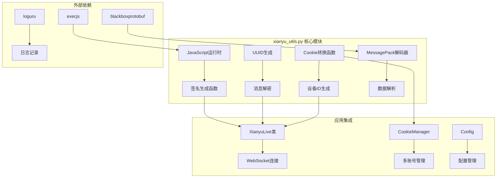

**图表来源**
- [xianyu_utils.py](file://utils/xianyu_utils.py#L1-L56)
- [XianyuAutoAsync.py](file://XianyuAutoAsync.py#L11-L14)

## 核心功能详解

### JavaScript运行时集成

模块首先尝试加载JavaScript运行时环境，这是签名生成的基础：

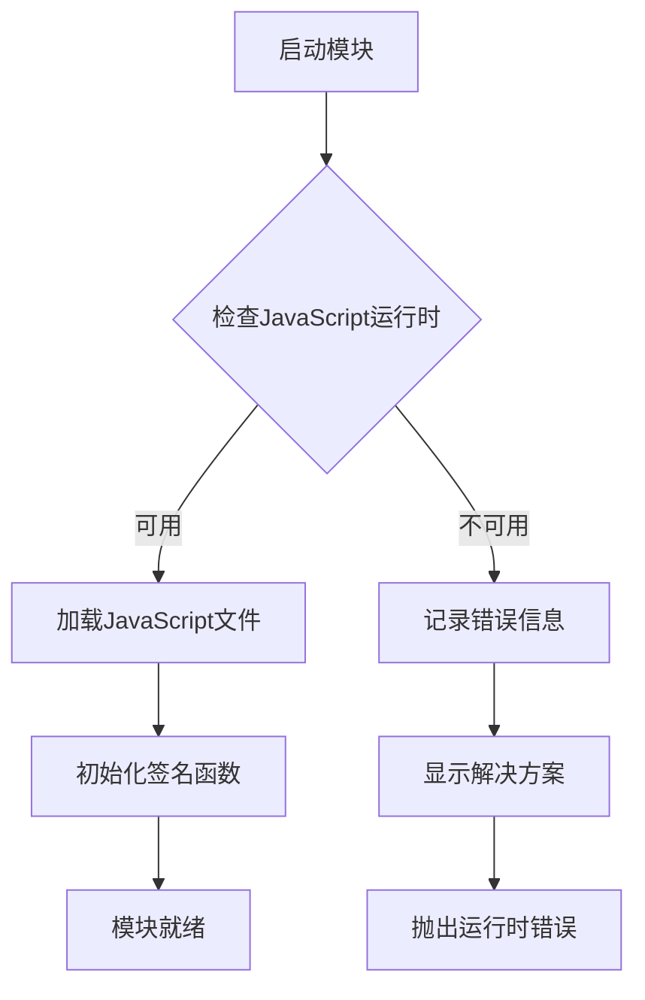

**图表来源**
- [xianyu_utils.py](file://utils/xianyu_utils.py#L24-L56)

### 设备标识生成

模块提供了多种设备标识生成函数：

| 函数 | 功能 | 输出格式 |
|------|------|----------|
| `generate_mid()` | 生成消息ID | `{随机数}{时间戳} 0` |
| `generate_uuid()` | 生成唯一标识符 | `-{时间戳}1` |
| `generate_device_id()` | 生成设备ID | 标准UUID格式 + 用户ID |

**章节来源**
- [xianyu_utils.py](file://utils/xianyu_utils.py#L71-L107)

## 加密签名生成机制

### 签名算法原理

闲鱼平台采用基于MD5的签名算法，确保API请求的安全性：

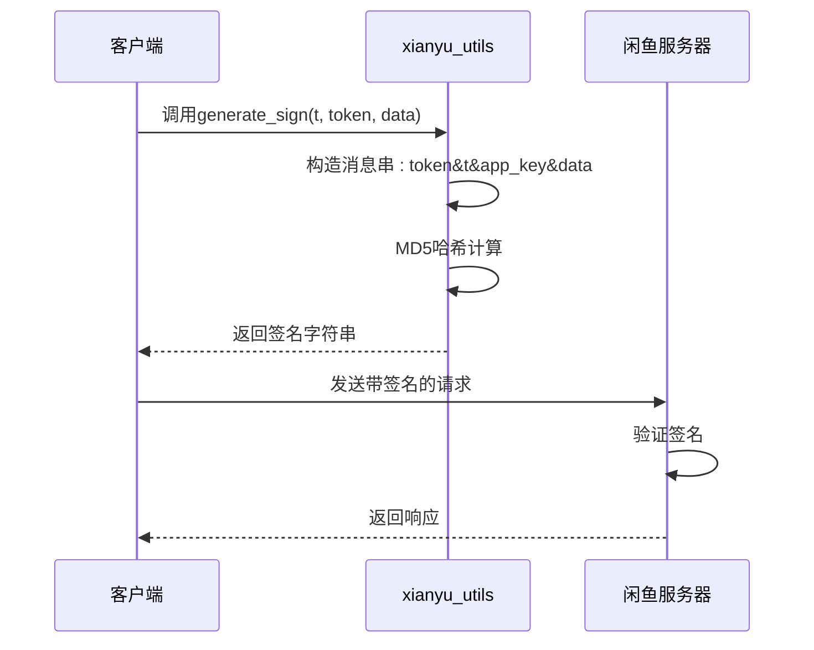

**图表来源**
- [xianyu_utils.py](file://utils/xianyu_utils.py#L110-L118)

### 签名生成流程

签名生成遵循以下步骤：

1. **参数准备**：收集token、时间戳t、应用密钥和请求数据
2. **消息构建**：按照`token&t&app_key&data`格式拼接字符串
3. **哈希计算**：使用MD5算法生成32位十六进制签名
4. **验证机制**：服务器端使用相同算法验证签名有效性

**章节来源**
- [xianyu_utils.py](file://utils/xianyu_utils.py#L110-L118)

### 实际应用场景

在XianyuLive类中，签名生成被广泛应用于各种API调用：

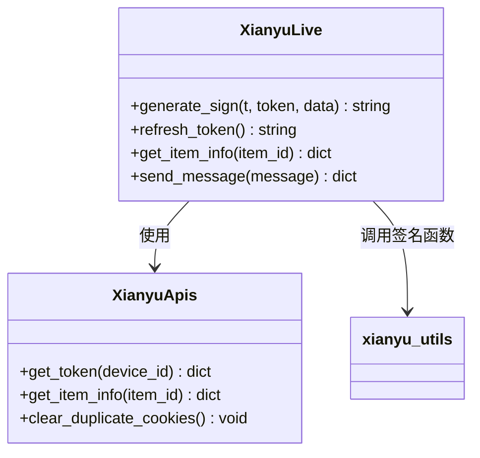

**图表来源**
- [XianyuAutoAsync.py](file://XianyuAutoAsync.py#L157-L160)
- [refresh_util.py](file://utils/refresh_util.py#L1738-L1757)

## Cookie格式转换

### trans_cookies函数实现

Cookie格式转换是模块的核心功能之一，负责将浏览器格式的Cookie字符串转换为Python可识别的字典格式：

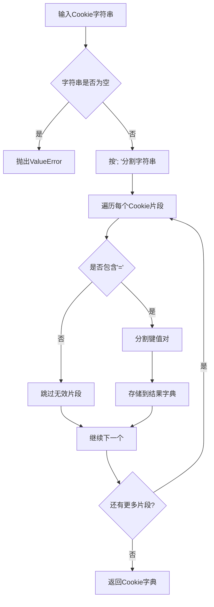

**图表来源**
- [xianyu_utils.py](file://utils/xianyu_utils.py#L58-L68)

### Cookie验证机制

模块实现了严格的Cookie验证逻辑：

| 验证项目 | 检查内容 | 错误处理 |
|----------|----------|----------|
| 空值检查 | 确保Cookie字符串非空 | 抛出ValueError异常 |
| 格式验证 | 检查必需字段存在性 | 提供详细错误信息 |
| 数据完整性 | 验证Cookie字段完整性 | 记录警告日志 |

**章节来源**
- [xianyu_utils.py](file://utils/xianyu_utils.py#L58-L68)

### 多账号Cookie管理

在CookieManager类中，Cookie转换被用于多账号管理系统：

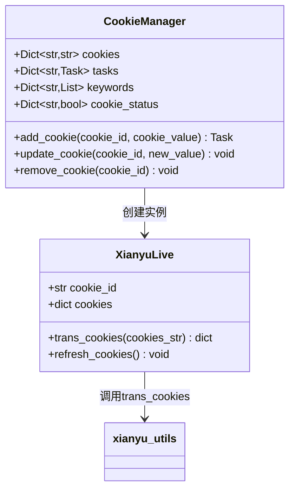

**图表来源**
- [cookie_manager.py](file://cookie_manager.py#L10-L428)
- [XianyuAutoAsync.py](file://XianyuAutoAsync.py#L628-L640)

## 请求头自动化构造

### 默认请求头配置

模块通过Config类管理各种请求头配置：

| 配置项 | 默认值 | 用途 |
|--------|--------|------|
| WEBSOCKET_HEADERS | WebSocket连接头部 | WebSocket握手 |
| DEFAULT_HEADERS | HTTP请求通用头部 | API调用基础 |
| API_ENDPOINTS | API端点配置 | 接口路由 |

**章节来源**
- [config.py](file://config.py#L94-L106)

### 动态头部生成

在XianyuLive类中，请求头会根据不同的操作动态生成：

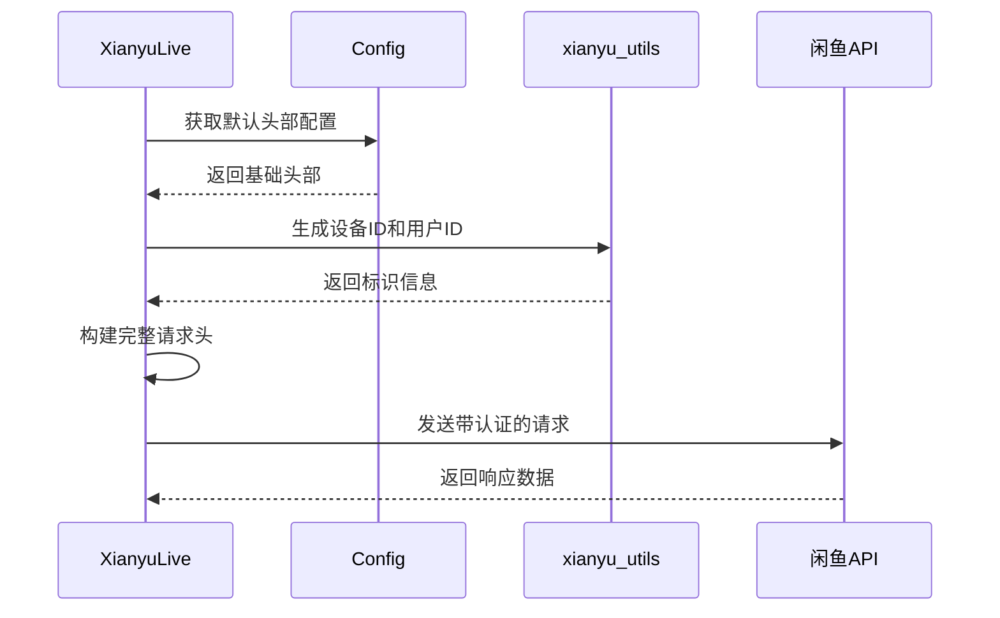

**图表来源**
- [XianyuAutoAsync.py](file://XianyuAutoAsync.py#L628-L640)

## WebSocket连接支持

### 连接状态管理

XianyuLive类实现了完整的WebSocket连接状态管理：

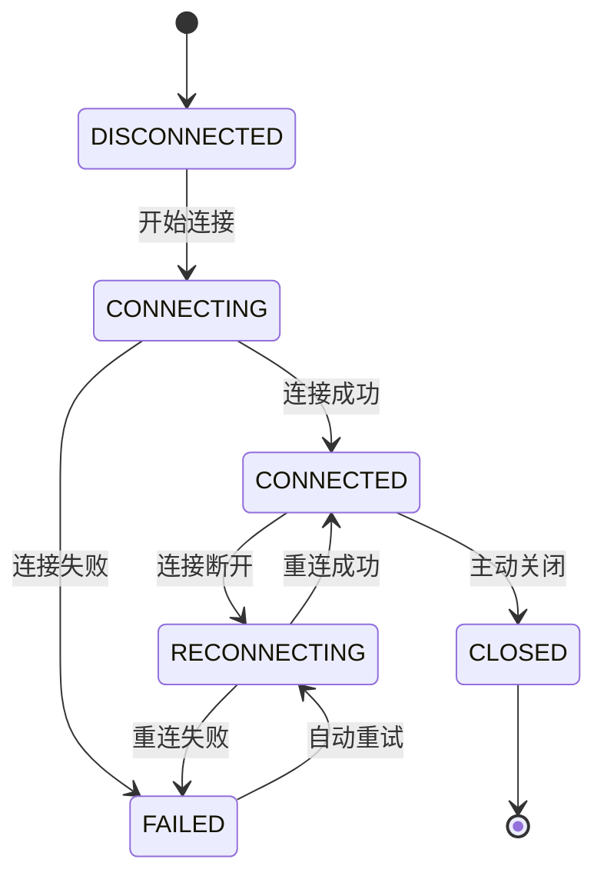

**图表来源**
- [XianyuAutoAsync.py](file://XianyuAutoAsync.py#L29-L36)

### 心跳机制

WebSocket连接通过心跳机制维持活跃状态：

| 参数 | 默认值 | 说明 |
|------|--------|------|
| HEARTBEAT_INTERVAL | 15秒 | 心跳发送间隔 |
| HEARTBEAT_TIMEOUT | 30秒 | 心跳超时时间 |
| MAX_CONNECTION_FAILURES | 5次 | 最大连续失败次数 |

**章节来源**
- [config.py](file://config.py#L95-L96)

## HTTP请求支持

### API调用封装

模块通过XianyuApis类封装了各种HTTP API调用：

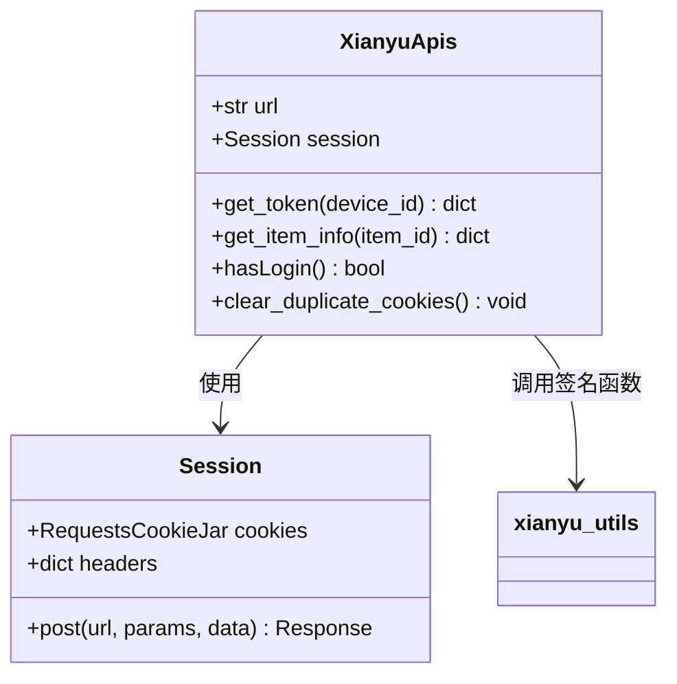

**图表来源**
- [refresh_util.py](file://utils/refresh_util.py#L1738-L1757)

### 错误处理机制

API调用实现了完善的错误处理和重试机制：

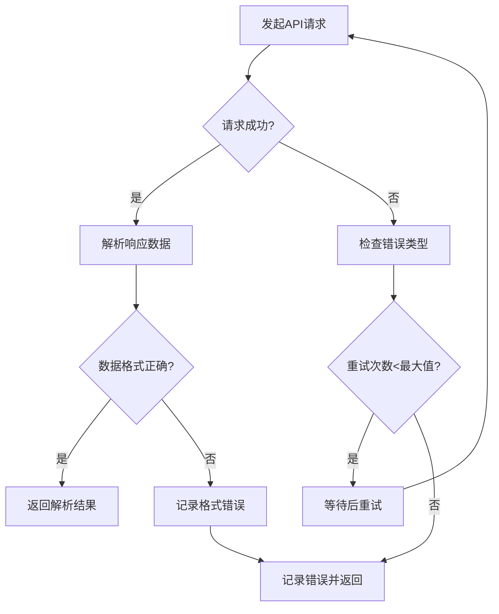

**图表来源**
- [refresh_util.py](file://utils/refresh_util.py#L1832-L1906)

## 多账号管理

### Cookie生命周期管理

CookieManager类提供了完整的多账号Cookie生命周期管理：

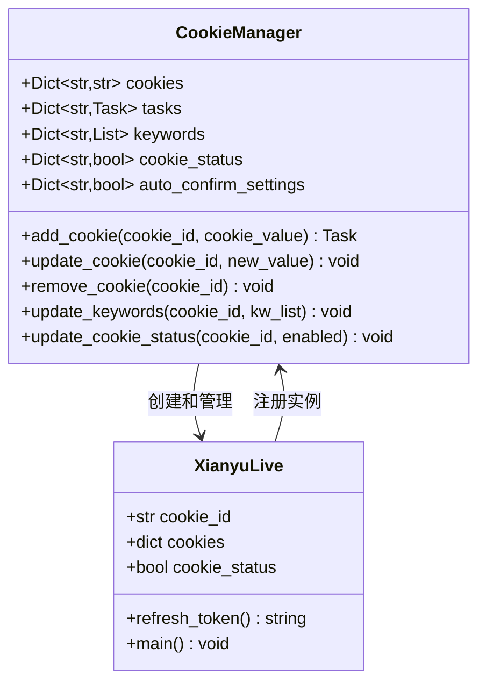

**图表来源**
- [cookie_manager.py](file://cookie_manager.py#L10-L428)

### 自动刷新逻辑

模块实现了智能的Cookie自动刷新机制：

| 触发条件 | 刷新策略 | 时间间隔 |
|----------|----------|----------|
| Token过期 | 自动刷新Token | 2小时 |
| Cookie失效 | 重新登录 | 即时 |
| 消息接收 | 延迟刷新 | 5分钟 |
| 扫码登录 | 特殊处理 | 10分钟 |

**章节来源**
- [cookie_manager.py](file://cookie_manager.py#L184-L428)

## 实际使用场景

### 消息发送前的加密封装

在发送聊天消息前，系统会对消息内容进行加密封装：

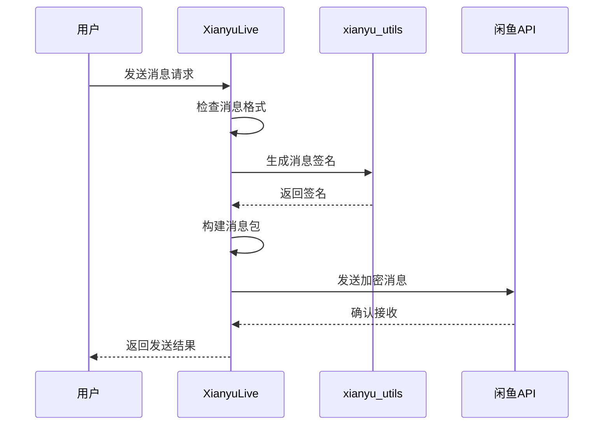

**图表来源**
- [XianyuAutoAsync.py](file://XianyuAutoAsync.py#L1373)

### 商品信息获取

获取商品详细信息时的签名流程：

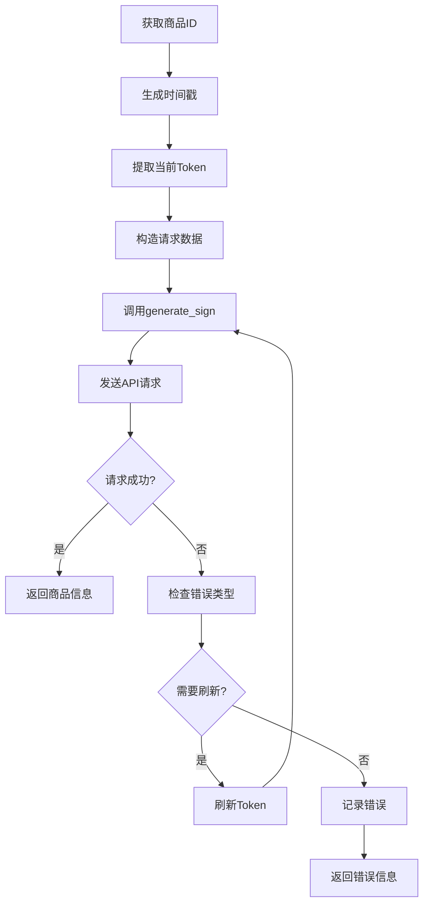

**图表来源**
- [refresh_util.py](file://utils/refresh_util.py#L1907-L1970)

### Token刷新流程

Token刷新是维持长期连接的关键机制：

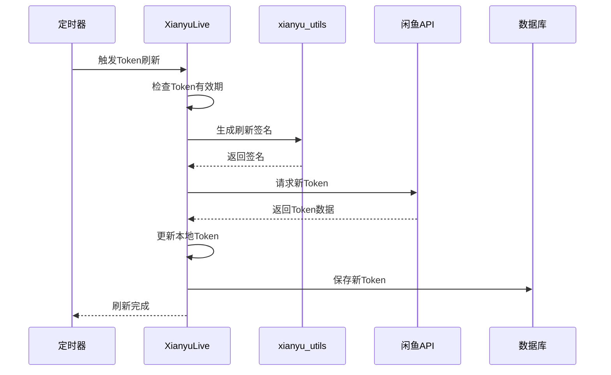

**图表来源**
- [XianyuAutoAsync.py](file://XianyuAutoAsync.py#L2931-L2932)

## 常见问题与调试

### 签名失败的可能原因

1. **时间同步问题**
   - 系统时间与服务器时间偏差过大
   - 解决方案：确保系统时间准确，使用NTP同步

2. **Token过期**
   - 当前Token已失效
   - 解决方案：触发Token刷新机制

3. **签名算法错误**
   - 签名生成参数顺序错误
   - 解决方案：检查generate_sign函数实现

4. **网络问题**
   - 网络连接不稳定导致请求失败
   - 解决方案：增加重试机制和超时处理

### 调试方法

#### 日志分析

模块使用loguru进行详细日志记录：

```python
# 启用详细日志
logger.add("debug.log", level="DEBUG")

# 关键操作日志示例
logger.info("开始生成签名...")
logger.debug(f"签名参数: t={t}, token={token}, data={data}")
logger.success("签名生成成功")
logger.error("签名生成失败")
```

#### 签名验证

可以通过以下方式验证签名生成是否正确：

```python
# 示例签名验证
test_token = "your_token_here"
test_t = str(int(time.time()) * 1000)
test_data = '{"appKey":"444e9908a51d1cb236a27862abc769c9","deviceId":"your_device_id"}'

generated_sign = generate_sign(test_t, test_token, test_data)
print(f"生成的签名: {generated_sign}")

# 服务器端应得到相同的签名
expected_sign = hashlib.md5(f"{test_token}&{test_t}&34839810&{test_data}".encode('utf-8')).hexdigest()
print(f"预期签名: {expected_sign}")
```

#### Cookie有效性验证

```python
# Cookie有效性检查
def validate_cookies(cookies_dict):
    required_fields = ['unb', '_m_h5_tk', 'cna']
    missing_fields = [field for field in required_fields if field not in cookies_dict]
    
    if missing_fields:
        logger.error(f"Cookie缺少必要字段: {missing_fields}")
        return False
    
    # 检查unb格式
    if not cookies_dict['unb'].startswith('CM'):
        logger.warning("unb格式可能不正确")
    
    return True
```

### 性能优化建议

1. **连接池管理**
   - 使用aiohttp的连接池减少连接开销
   - 合理设置连接超时时间

2. **缓存策略**
   - 缓存商品信息减少API调用
   - 缓存设备ID生成结果

3. **并发控制**
   - 限制同时进行的API请求数量
   - 使用信号量控制消息处理并发度

**章节来源**
- [XianyuAutoAsync.py](file://XianyuAutoAsync.py#L730-L740)

## 总结

xianyu_utils.py模块作为闲鱼自动回复系统的核心组件，提供了完整的API通信支持。其主要优势包括：

1. **安全性**：基于MD5的签名机制确保请求安全性
2. **可靠性**：完善的错误处理和重试机制
3. **扩展性**：支持多账号管理和动态配置
4. **易用性**：简洁的API设计和详细的错误提示

该模块的成功实施为闲鱼自动回复系统提供了稳定可靠的底层支撑，使得复杂的WebSocket连接和HTTP API调用变得简单高效。通过合理的错误处理和调试机制，开发者可以快速定位和解决问题，确保系统的稳定运行。