# 验证码远程控制 (captcha_remote_control.py, api_captcha_remote.py)

<cite>
**本文档引用的文件**
- [captcha_remote_control.py](file://utils/captcha_remote_control.py)
- [api_captcha_remote.py](file://api_captcha_remote.py)
- [captcha_control.html](file://captcha_control.html)
- [config.py](file://config.py)
- [global_config.yml](file://global_config.yml)
- [Start.py](file://Start.py)
- [XianyuAutoAsync.py](file://XianyuAutoAsync.py)
- [item_search.py](file://utils/item_search.py)
</cite>

## 目录
1. [简介](#简介)
2. [系统架构](#系统架构)
3. [核心组件分析](#核心组件分析)
4. [WebSocket服务端实现](#websocket服务端实现)
5. [RESTful API设计](#restful-api设计)
6. [前端控制面板](#前端控制面板)
7. [安全机制](#安全机制)
8. [部署配置](#部署配置)
9. [使用流程](#使用流程)
10. [故障排除](#故障排除)

## 简介

验证码远程控制系统是一套完整的刮刮乐验证码自动化解决方案，通过WebSocket技术实现实时的验证码图像传输和用户操作同步。该系统由两个核心模块组成：`captcha_remote_control.py`负责后端WebSocket服务端逻辑，`api_captcha_remote.py`提供RESTful API接口供外部客户端访问。

系统的主要功能包括：
- 实时捕获和传输验证码图像到管理员界面
- 支持鼠标事件的实时同步和处理
- 提供完整的验证码验证状态监控
- 实现会话管理和操作权限控制
- 支持多种验证状态检查机制

## 系统架构

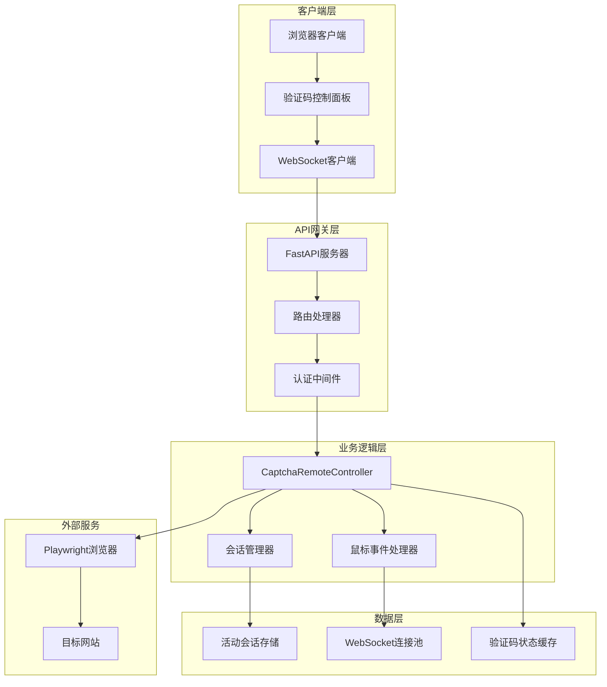

**架构图来源**
- [captcha_remote_control.py](file://utils/captcha_remote_control.py#L14-L369)
- [api_captcha_remote.py](file://api_captcha_remote.py#L17-L319)

## 核心组件分析

### CaptchaRemoteController 类

`CaptchaRemoteController`是系统的核心控制器，负责管理所有验证码验证会话和处理相关操作。

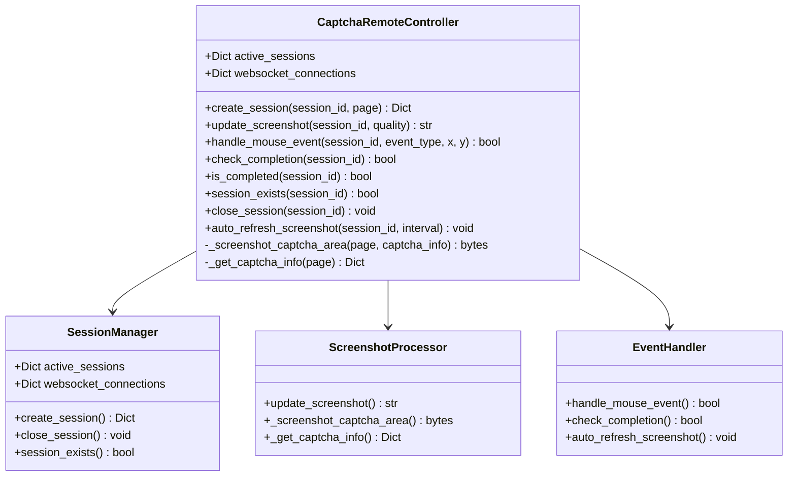

**类图来源**
- [captcha_remote_control.py](file://utils/captcha_remote_control.py#L14-L369)

**节源**
- [captcha_remote_control.py](file://utils/captcha_remote_control.py#L14-L369)

### API路由器设计

系统采用FastAPI框架构建RESTful API，提供完整的HTTP接口支持。

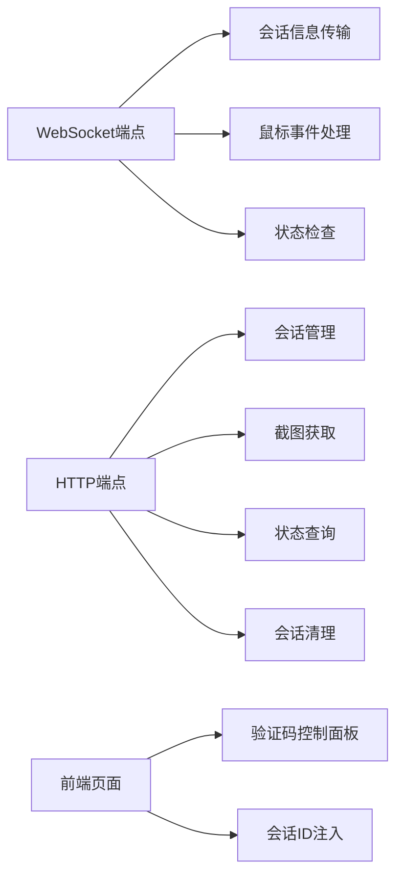

**架构图来源**
- [api_captcha_remote.py](file://api_captcha_remote.py#L17-L319)

**节源**
- [api_captcha_remote.py](file://api_captcha_remote.py#L17-L319)

## WebSocket服务端实现

### 连接管理

WebSocket服务端通过`websocket_endpoint`函数处理客户端连接，实现双向实时通信。

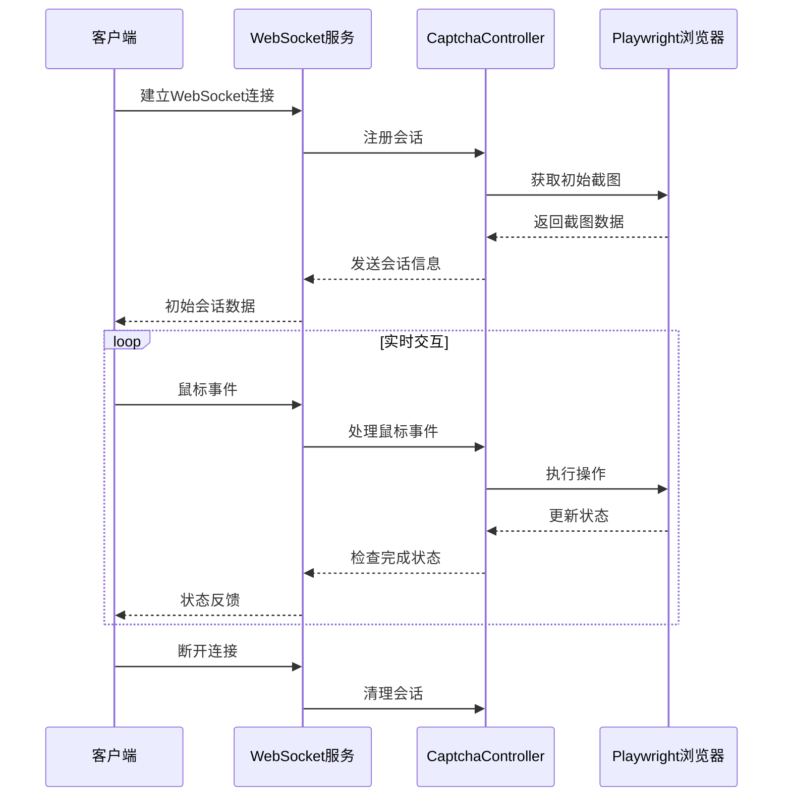

**序列图来源**
- [api_captcha_remote.py](file://api_captcha_remote.py#L38-L156)

### 鼠标事件处理

系统支持完整的鼠标事件处理，包括按下、移动和释放三个阶段。

| 事件类型 | 处理逻辑 | 性能优化 |
|---------|---------|---------|
| mouse_down | 移动鼠标指针并按下 | 立即执行，无延迟 |
| mouse_move | 移动鼠标指针 | 节流处理，避免频繁发送 |
| mouse_up | 释放鼠标并检查完成状态 | 延迟检查，确保页面响应 |

**节源**
- [api_captcha_remote.py](file://api_captcha_remote.py#L77-L126)

### 自动刷新机制

系统实现了智能的自动刷新机制，根据会话状态动态调整截图更新频率。

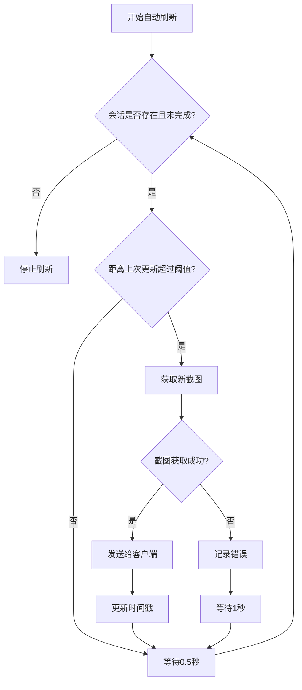

**流程图来源**
- [captcha_remote_control.py](file://utils/captcha_remote_control.py#L334-L364)

**节源**
- [captcha_remote_control.py](file://utils/captcha_remote_control.py#L334-L364)

## RESTful API设计

### HTTP端点概览

系统提供丰富的HTTP接口，支持完整的验证码控制功能。

| 端点 | 方法 | 功能 | 权限要求 |
|------|------|------|----------|
| `/api/captcha/ws/{session_id}` | WebSocket | 实时通信 | 会话ID有效 |
| `/api/captcha/sessions` | GET | 获取活跃会话列表 | 管理员权限 |
| `/api/captcha/session/{session_id}` | GET | 获取指定会话信息 | 会话拥有者 |
| `/api/captcha/screenshot/{session_id}` | GET | 获取最新截图 | 会话拥有者 |
| `/api/captcha/mouse_event` | POST | 处理鼠标事件 | 会话ID有效 |
| `/api/captcha/check_completion` | POST | 检查完成状态 | 会话ID有效 |
| `/api/captcha/session/{session_id}` | DELETE | 关闭会话 | 会话拥有者 |
| `/api/captcha/status/{session_id}` | GET | 获取验证状态 | 会话ID有效 |
| `/api/captcha/control` | GET | 返回控制页面 | 无需认证 |
| `/api/captcha/control/{session_id}` | GET | 返回带会话ID的页面 | 无需认证 |

**节源**
- [api_captcha_remote.py](file://api_captcha_remote.py#L162-L317)

### 数据模型定义

系统使用Pydantic模型确保API数据的类型安全和验证。

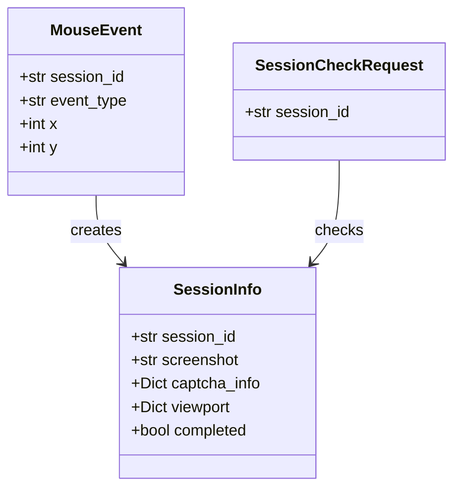

**类图来源**
- [api_captcha_remote.py](file://api_captcha_remote.py#L21-L32)

**节源**
- [api_captcha_remote.py](file://api_captcha_remote.py#L21-L32)

## 前端控制面板

### 页面结构设计

验证码控制面板采用现代化的Web界面设计，提供直观的操作体验。

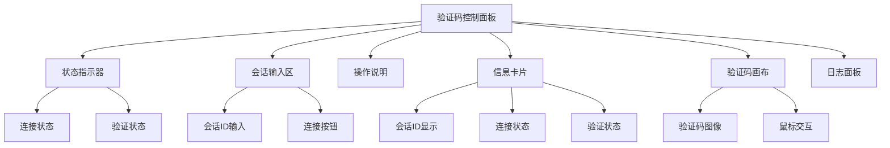

**架构图来源**
- [captcha_control.html](file://captcha_control.html#L1-L572)

### WebSocket客户端实现

前端JavaScript通过WebSocket与后端建立实时连接，实现验证码的远程控制。

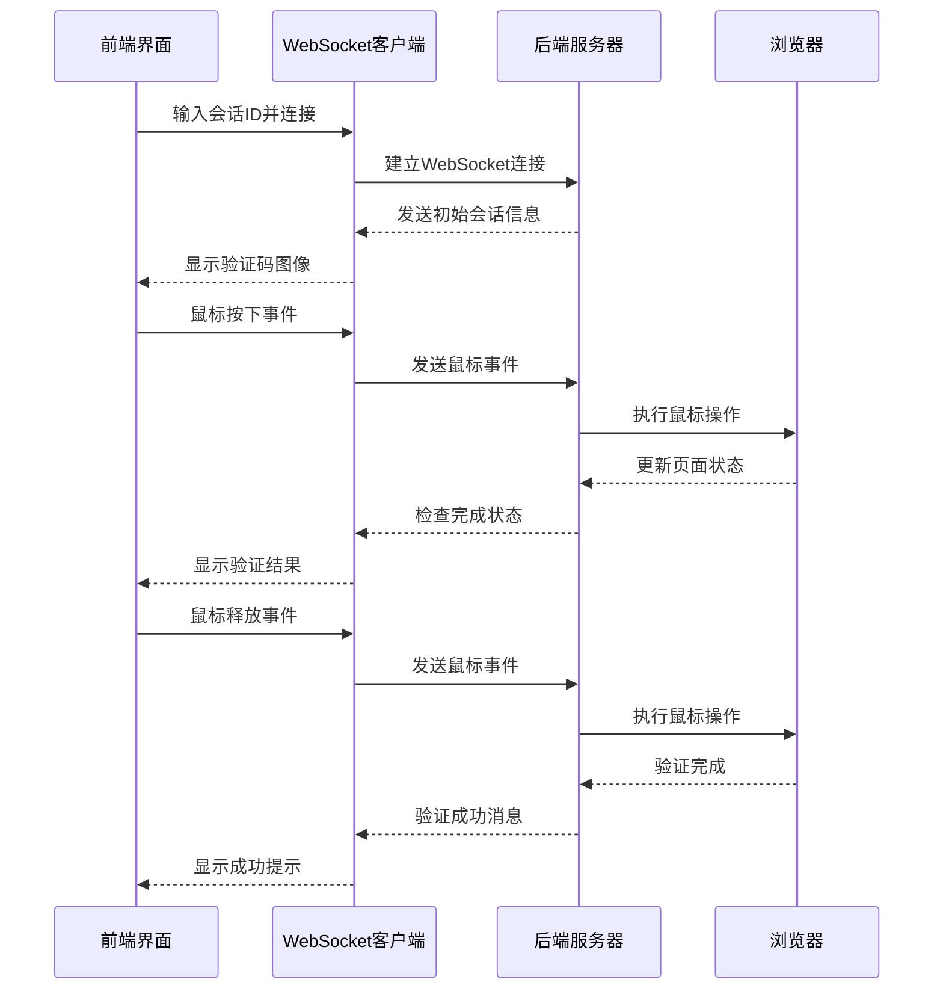

**序列图来源**
- [captcha_control.html](file://captcha_control.html#L370-L567)

### 性能优化特性

前端实现了多项性能优化措施：

| 优化项 | 实现方式 | 效果 |
|--------|---------|------|
| 鼠标事件节流 | 5ms间隔限制 | 避免频繁发送事件 |
| 图像质量动态调整 | 按需降低质量 | 提升传输效率 |
| Canvas渲染优化 | 启用图像平滑 | 保持视觉效果 |
| 连接状态监控 | 心跳机制 | 及时发现连接问题 |

**节源**
- [captcha_control.html](file://captcha_control.html#L302-L567)

## 安全机制

### 会话绑定机制

系统通过会话ID实现严格的操作权限控制，确保只有授权用户才能操作对应的验证码会话。

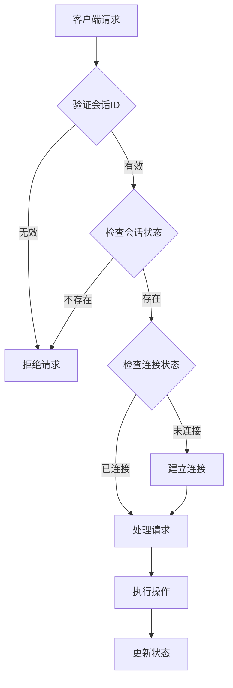

**流程图来源**
- [captcha_remote_control.py](file://utils/captcha_remote_control.py#L160-L195)

### 防暴力破解设计

系统实现了多层次的防护机制：

1. **连接频率限制**：WebSocket连接建立有合理的超时机制
2. **操作间隔控制**：鼠标事件处理包含适当的延迟
3. **会话生命周期管理**：自动清理长时间未活动的会话
4. **状态检查机制**：多重验证确保操作的准确性

**节源**
- [captcha_remote_control.py](file://utils/captcha_remote_control.py#L240-L316)

### 验证状态检查

系统提供了多种验证状态检查机制，确保验证过程的可靠性。

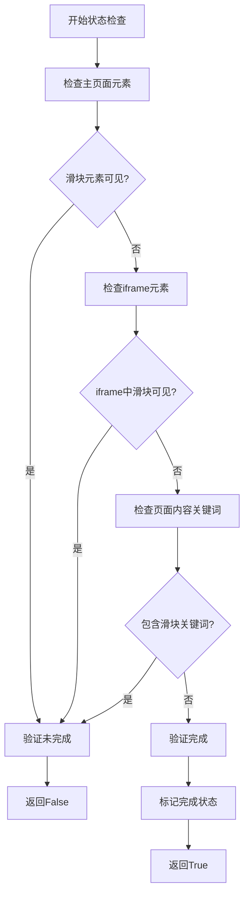

**流程图来源**
- [captcha_remote_control.py](file://utils/captcha_remote_control.py#L240-L316)

**节源**
- [captcha_remote_control.py](file://utils/captcha_remote_control.py#L240-L316)

## 部署配置

### 基础配置

系统通过`global_config.yml`文件进行基础配置管理。

| 配置项 | 默认值 | 说明 |
|--------|--------|------|
| SLIDER_VERIFICATION.max_concurrent | 3 | 最大并发验证数量 |
| SLIDER_VERIFICATION.wait_timeout | 60 | 等待超时时间（秒） |
| API_HOST | 0.0.0.0 | API服务器绑定地址 |
| API_PORT | 8080 | API服务器端口号 |
| WEBSOCKET_URL | wss://wss-goofish.dingtalk.com/ | WebSocket服务器地址 |

**节源**
- [global_config.yml](file://global_config.yml#L63-L65)
- [config.py](file://config.py#L99-L103)

### 环境变量配置

系统支持通过环境变量进行灵活配置：

```bash
# API服务器配置
export API_HOST=0.0.0.0
export API_PORT=8080

# 服务器主机配置（Docker部署）
export SERVER_HOST=your-public-ip

# 调试配置
export LOG_LEVEL=DEBUG
```

**节源**
- [Start.py](file://Start.py#L450-L467)

### Docker部署配置

对于Docker环境，需要特别注意网络配置和环境变量设置。

```yaml
version: '3.8'
services:
  captcha-remote:
    image: xianyu-auto-reply:latest
    ports:
      - "8080:8080"
    environment:
      - API_HOST=0.0.0.0
      - API_PORT=8080
      - SERVER_HOST=your-public-ip
    volumes:
      - ./data:/app/data
      - ./logs:/app/logs
    restart: unless-stopped
```

**节源**
- [Start.py](file://Start.py#L450-L467)

### 启用远程验证功能

要启用远程验证功能，需要确保以下配置正确：

1. **配置文件设置**：在`global_config.yml`中正确配置SLIDER_VERIFICATION参数
2. **API服务启动**：确保FastAPI服务器正常运行
3. **WebSocket连接**：验证WebSocket服务器可访问性
4. **防火墙配置**：开放必要的端口（8080）

**节源**
- [config.py](file://config.py#L99-L103)

## 使用流程

### 完整使用流程

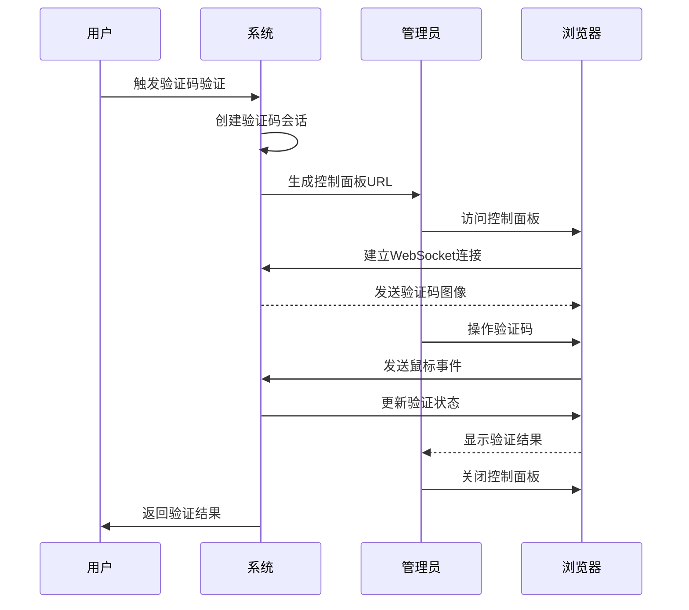

**序列图来源**
- [item_search.py](file://utils/item_search.py#L108-L134)

### 会话管理流程

系统提供了完整的会话生命周期管理：

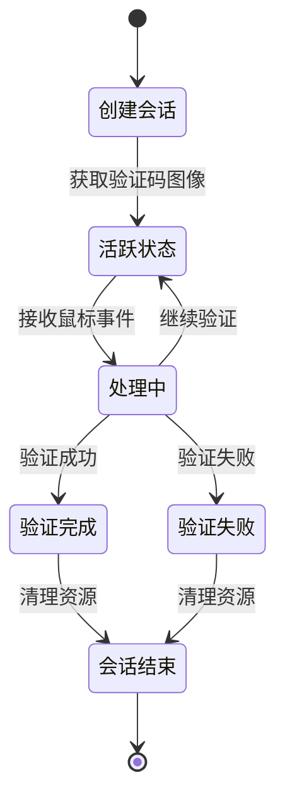

**状态图来源**
- [captcha_remote_control.py](file://utils/captcha_remote_control.py#L21-L369)

**节源**
- [item_search.py](file://utils/item_search.py#L108-L134)

### 访问令牌配置

虽然系统本身不强制要求访问令牌，但可以通过以下方式增强安全性：

1. **IP白名单**：限制访问来源IP
2. **HTTPS加密**：使用SSL证书保护通信
3. **会话超时**：设置合理的会话过期时间
4. **日志审计**：记录所有操作日志

## 故障排除

### 常见问题及解决方案

| 问题 | 症状 | 解决方案 |
|------|------|---------|
| WebSocket连接失败 | 控制面板无法加载 | 检查防火墙设置和网络连通性 |
| 验证码图像不显示 | 白屏或加载失败 | 验证Playwright浏览器安装 |
| 鼠标操作无响应 | 点击验证码无效果 | 检查会话ID和连接状态 |
| 验证超时 | 3分钟无响应 | 增加wait_timeout配置 |
| 内存占用过高 | 系统响应缓慢 | 调整max_concurrent参数 |

### 调试技巧

1. **启用详细日志**：设置`LOG_LEVEL=DEBUG`获取详细信息
2. **检查会话状态**：使用`/api/captcha/sessions`端点查看活跃会话
3. **监控WebSocket连接**：观察连接建立和断开日志
4. **验证浏览器状态**：确保Playwright浏览器正常运行

**节源**
- [captcha_remote_control.py](file://utils/captcha_remote_control.py#L334-L364)

### 性能监控

系统内置了多项性能监控指标：

- **会话数量监控**：跟踪活跃会话总数
- **连接状态监控**：实时监控WebSocket连接状态
- **操作延迟监控**：测量鼠标事件处理延迟
- **内存使用监控**：跟踪系统内存占用情况

通过这些监控指标，可以及时发现和解决系统性能问题。

## 结论

验证码远程控制系统提供了一套完整、安全、高效的刮刮乐验证码自动化解决方案。通过WebSocket技术实现实时通信，结合完善的会话管理和安全机制，确保了系统的可靠性和可用性。

系统的主要优势包括：
- **实时性强**：通过WebSocket实现毫秒级响应
- **安全性高**：严格的会话绑定和权限控制
- **扩展性好**：模块化设计便于功能扩展
- **易于部署**：支持多种部署方式和配置选项

通过合理的配置和使用，该系统能够显著提高验证码处理效率，为自动化业务流程提供强有力的支持。