# 敏感数据存储策略

<cite>
**本文档引用的文件**
- [config.py](file://config.py)
- [db_manager.py](file://db_manager.py)
- [cookie_manager.py](file://cookie_manager.py)
- [global_config.yml](file://global_config.yml)
- [reply_server.py](file://reply_server.py)
- [XianyuAutoAsync.py](file://XianyuAutoAsync.py)
- [secure_confirm_ultra.py](file://secure_confirm_ultra.py)
- [secure_freeshipping_ultra.py](file://secure_freeshipping_ultra.py)
- [utils/xianyu_utils.py](file://utils/xianyu_utils.py)
</cite>

## 目录
1. [概述](#概述)
2. [系统架构概览](#系统架构概览)
3. [敏感数据存储策略](#敏感数据存储策略)
4. [system_settings表安全存储](#system_settings表安全存储)
5. [用户密码存储机制](#用户密码存储机制)
6. [Cookie数据安全存储](#cookie数据安全存储)
7. [配置管理与环境变量](#配置管理与环境变量)
8. [加密与脱敏技术](#加密与脱敏技术)
9. [安全防护措施](#安全防护措施)
10. [最佳实践建议](#最佳实践建议)

## 概述

本系统采用多层次的安全策略来保护敏感数据，包括密码哈希存储、配置信息管理、Cookie数据保护等。系统通过数据库表设计、配置管理机制和前端界面控制，实现了对敏感信息的全面保护。

## 系统架构概览

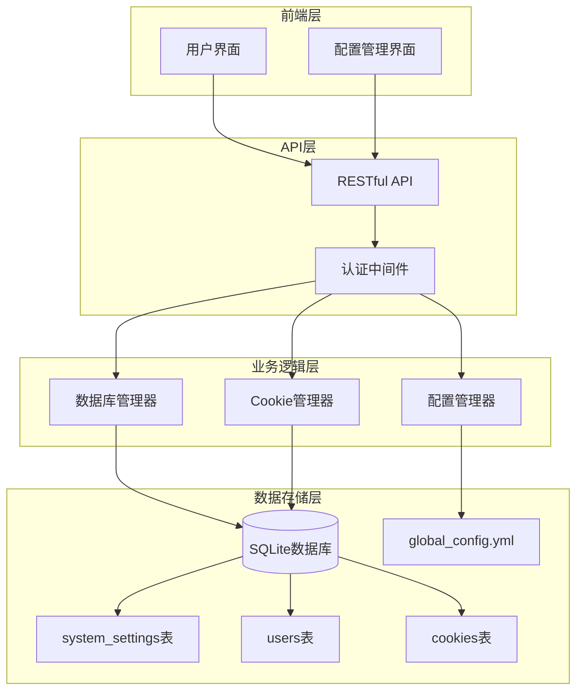

**图表来源**
- [db_manager.py](file://db_manager.py#L16-L50)
- [cookie_manager.py](file://cookie_manager.py#L10-L30)
- [config.py](file://config.py#L5-L20)

## 敏感数据存储策略

### 存储层次结构

系统采用分层存储策略，将不同类型的敏感数据分别存储在不同的位置：

1. **数据库层**：存储用户凭据、系统配置、Cookie信息
2. **配置文件层**：存储应用程序基础配置
3. **内存层**：临时存储敏感数据

### 数据分类与保护级别

| 数据类型 | 存储位置 | 保护措施 | 访问控制 |
|---------|---------|---------|---------|
| 用户密码 | users表(password_hash) | SHA256哈希 | 数据库权限控制 |
| SMTP密码 | system_settings表 | 明文存储 | 管理员认证 |
| Cookie数据 | cookies表 | 明文存储 | 用户隔离 |
| 系统配置 | system_settings表 | 明文存储 | 管理员权限 |
| 应用配置 | global_config.yml | 文件权限控制 | 系统权限 |

## system_settings表安全存储

### 表结构设计

system_settings表专门用于存储系统级别的敏感配置信息：

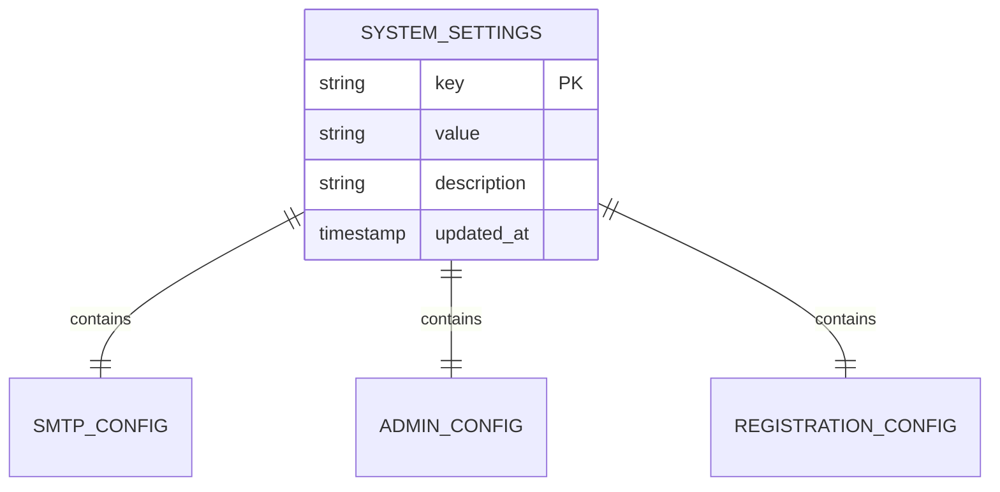

**图表来源**
- [db_manager.py](file://db_manager.py#L369-L376)

### SMTP配置存储

SMTP相关配置存储在system_settings表中，包括：

- `smtp_server`: SMTP服务器地址
- `smtp_port`: SMTP端口号
- `smtp_user`: 发件邮箱地址
- `smtp_password`: 邮箱密码/授权码
- `smtp_from`: 发件人显示名称
- `smtp_use_tls`: 是否启用TLS
- `smtp_use_ssl`: 是否启用SSL

### 安全访问控制

系统通过以下机制保护system_settings表：

1. **API接口限制**：只有管理员可以访问和修改系统设置
2. **敏感信息过滤**：在前端界面中隐藏敏感配置
3. **审计日志**：记录所有配置修改操作

**章节来源**
- [db_manager.py](file://db_manager.py#L2376-L2420)
- [reply_server.py](file://reply_server.py#L2646-L2677)

## 用户密码存储机制

### 哈希算法选择

系统采用SHA256算法对用户密码进行单向哈希处理：

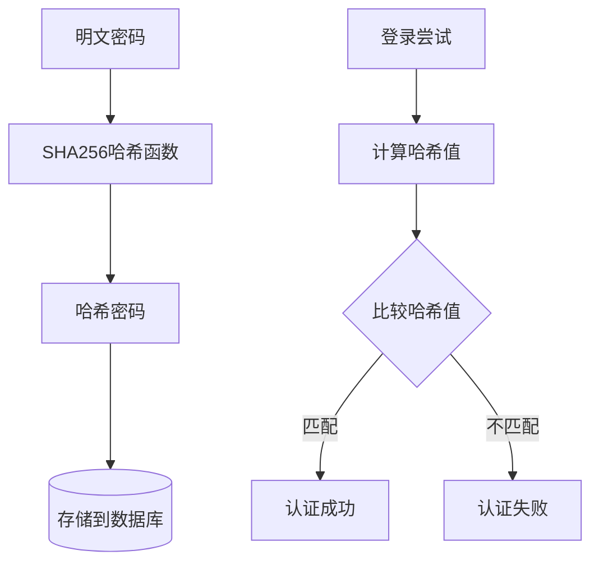

**图表来源**
- [db_manager.py](file://db_manager.py#L2426-L2436)

### 存储实现细节

密码存储过程包括以下步骤：

1. **密码哈希**：使用`hashlib.sha256()`对明文密码进行哈希
2. **存储到数据库**：将哈希值存储在users表的password_hash字段
3. **无盐值**：系统不使用额外的盐值，直接对密码进行哈希

### 认证流程

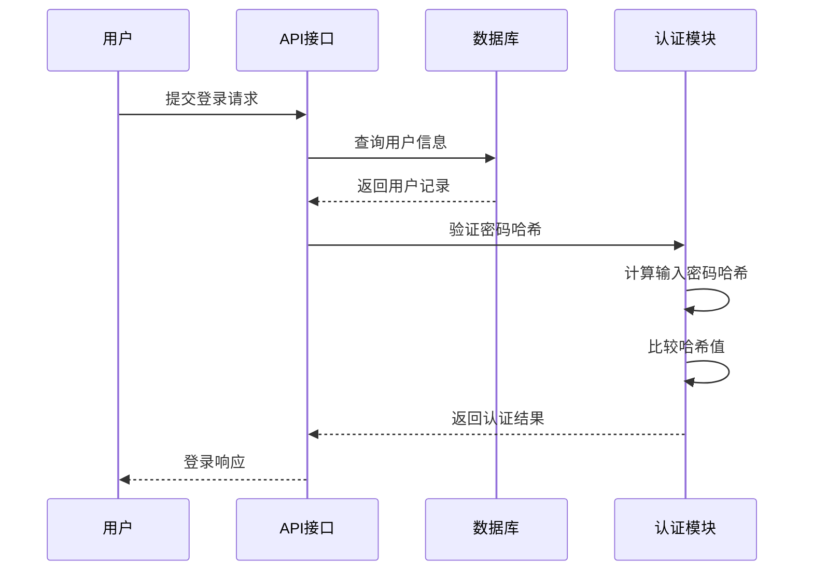

**图表来源**
- [db_manager.py](file://db_manager.py#L2502-L2510)

### 安全考虑

虽然使用SHA256提供了基本的安全保护，但仍存在以下风险：

1. **彩虹表攻击**：已知密码的哈希值可能被反查
2. **暴力破解**：短密码容易被暴力破解
3. **缺乏随机性**：无盐值可能导致相同密码产生相同哈希

**章节来源**
- [db_manager.py](file://db_manager.py#L2426-L2534)

## Cookie数据安全存储

### 表结构设计

cookies表包含多个字段，其中部分字段存储敏感信息：

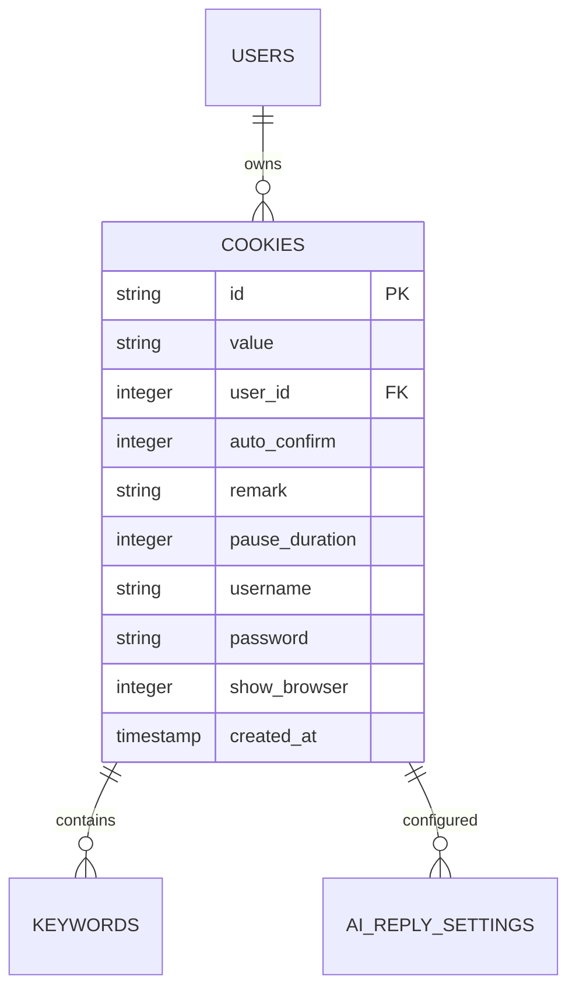

**图表来源**
- [db_manager.py](file://db_manager.py#L109-L123)

### 敏感字段识别

cookies表中包含以下敏感字段：

| 字段名 | 敏感程度 | 存储方式 | 访问控制 |
|-------|---------|---------|---------|
| username | 中等 | 明文存储 | 用户隔离 |
| password | 高 | 明文存储 | 用户隔离 |
| value | 高 | 明文存储 | 用户隔离 |

### 用户隔离机制

系统通过user_id字段实现用户数据隔离：

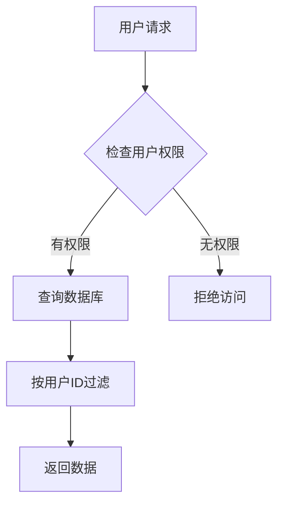

**图表来源**
- [db_manager.py](file://db_manager.py#L1226-L1237)

### 数据访问控制

1. **API层面**：每个Cookie操作都需要验证用户权限
2. **数据库层面**：查询时自动添加用户过滤条件
3. **前端层面**：界面只显示当前用户的数据

**章节来源**
- [cookie_manager.py](file://cookie_manager.py#L18-L428)
- [db_manager.py](file://db_manager.py#L1226-L1400)

## 配置管理与环境变量

### 配置文件结构

系统使用YAML格式的配置文件管理应用程序设置：

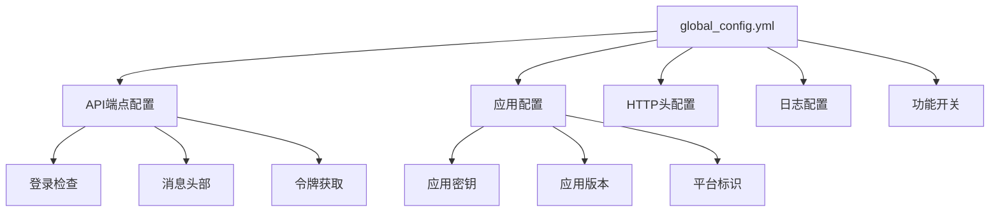

**图表来源**
- [global_config.yml](file://global_config.yml#L1-L77)

### 配置管理类

Config类提供统一的配置管理接口：

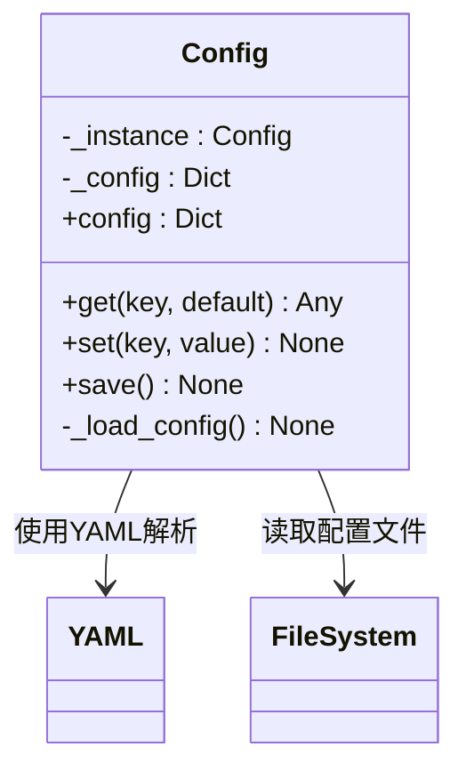

**图表来源**
- [config.py](file://config.py#L5-L89)

### 环境变量支持

系统支持通过环境变量覆盖配置：

1. **数据库路径**：`DB_PATH`环境变量
2. **SQL日志**：`SQL_LOG_ENABLED`和`SQL_LOG_LEVEL`
3. **其他配置**：通过环境变量传递运行时参数

**章节来源**
- [config.py](file://config.py#L1-L89)
- [global_config.yml](file://global_config.yml#L1-L77)

## 加密与脱敏技术

### 消息解密机制

系统实现了复杂的消息解密机制来保护传输数据：

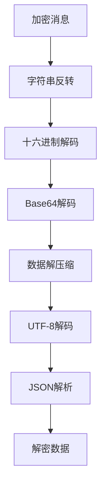

**图表来源**
- [utils/xianyu_utils.py](file://utils/xianyu_utils.py#L328-L379)

### 动态代码解密

系统使用动态解密技术保护核心功能代码：

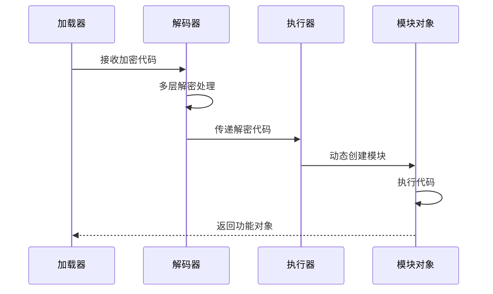

**图表来源**
- [secure_confirm_ultra.py](file://secure_confirm_ultra.py#L15-L42)
- [secure_freeshipping_ultra.py](file://secure_freeshipping_ultra.py#L15-L43)

### 数据脱敏策略

系统在不同场景下采用不同的数据脱敏策略：

1. **日志记录**：敏感字段截断显示
2. **API响应**：敏感配置过滤
3. **调试输出**：条件性敏感信息显示

**章节来源**
- [utils/xianyu_utils.py](file://utils/xianyu_utils.py#L328-L379)

## 安全防护措施

### 访问控制机制

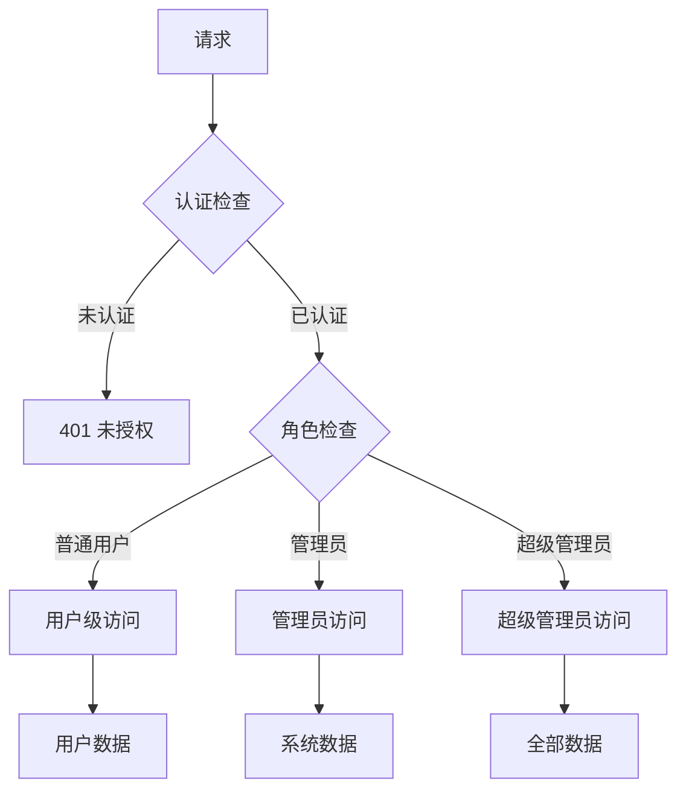

### 数据库安全

1. **连接池管理**：使用线程安全的数据库连接
2. **事务控制**：确保数据一致性
3. **SQL注入防护**：使用参数化查询
4. **权限控制**：最小权限原则

### 网络安全

1. **HTTPS支持**：推荐使用HTTPS协议
2. **CORS配置**：严格控制跨域请求
3. **CSRF防护**：实施CSRF令牌验证

**章节来源**
- [db_manager.py](file://db_manager.py#L49-L65)
- [reply_server.py](file://reply_server.py#L2646-L2677)

## 最佳实践建议

### 密码安全改进

1. **使用加盐哈希**：引入随机盐值增强安全性
2. **密码强度检查**：要求符合一定复杂度的密码
3. **定期密码更新**：强制用户定期更换密码
4. **多因素认证**：增加短信验证码等验证方式

### 配置安全管理

1. **配置文件权限**：设置适当的文件权限
2. **敏感配置分离**：将敏感配置存储在独立位置
3. **配置版本控制**：避免将敏感配置提交到版本控制系统
4. **定期审查**：定期检查和更新配置项

### 监控与审计

1. **访问日志**：记录所有敏感操作
2. **异常监控**：监控异常访问模式
3. **定期审计**：定期进行安全审计
4. **漏洞扫描**：定期进行安全漏洞扫描

### 数据备份与恢复

1. **定期备份**：制定数据备份策略
2. **加密备份**：对备份数据进行加密
3. **恢复测试**：定期测试数据恢复流程
4. **异地存储**：将备份存储在异地位置

## 结论

本系统通过多层次的安全策略有效保护了敏感数据。虽然在某些方面仍有改进空间（如密码加盐、更高级别的加密等），但整体架构提供了良好的安全基础。建议根据实际需求进一步完善安全措施，特别是在密码管理和数据传输加密方面。