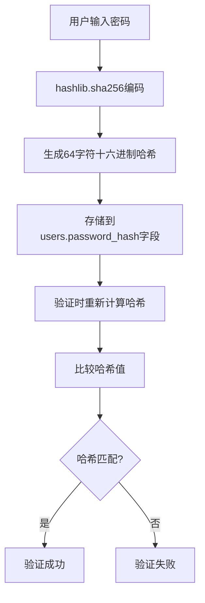
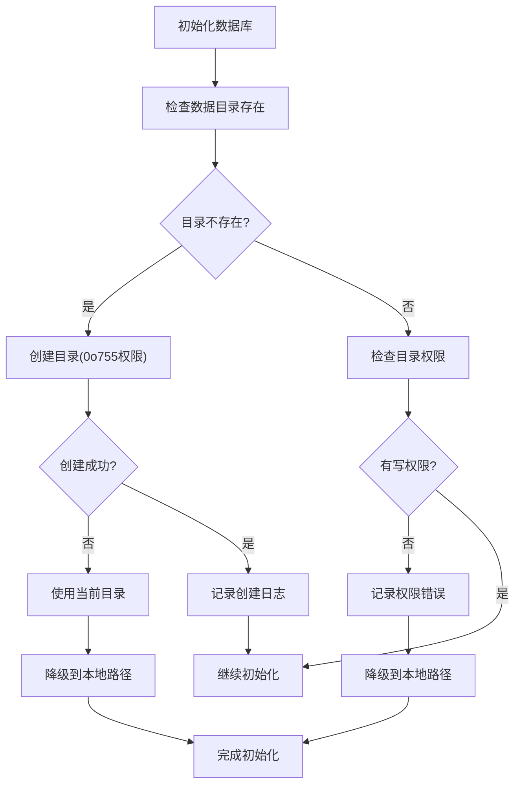
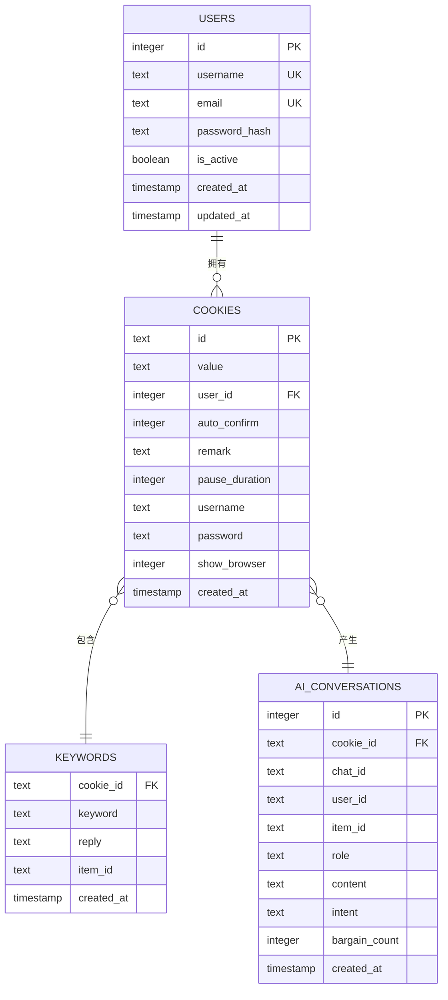
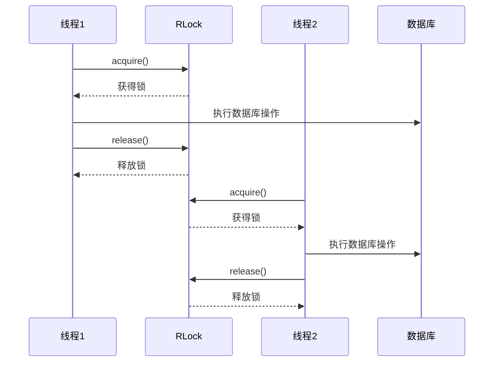
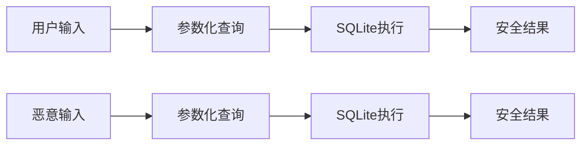

# 数据库存储安全机制

<cite>
**本文档引用的文件**
- [db_manager.py](file://db_manager.py)
- [config.py](file://config.py)
- [reply_server.py](file://reply_server.py)
- [XianyuAutoAsync.py](file://XianyuAutoAsync.py)
</cite>

## 目录
1. [概述](#概述)
2. [密码哈希安全机制](#密码哈希安全机制)
3. [数据库目录权限控制](#数据库目录权限控制)
4. [外键约束与数据完整性](#外键约束与数据完整性)
5. [表结构安全设计](#表结构安全设计)
6. [并发控制与线程安全](#并发控制与线程安全)
7. [SQL注入防护](#sql注入防护)
8. [审计与监控](#审计与监控)
9. [总结](#总结)

## 概述

本系统采用SQLite数据库作为核心存储引擎，实现了多层次的安全机制来保护敏感数据。通过密码哈希、权限控制、外键约束、表结构设计等多重安全保障，确保用户数据和系统安全。

## 密码哈希安全机制

### SHA-256单向哈希存储

系统采用`hashlib.sha256`算法对用户密码进行单向哈希处理，确保密码不会以明文形式存储。



**图表来源**
- [db_manager.py](file://db_manager.py#L2430-L2520)

### 密码处理流程

系统在多个关键场景中应用密码哈希机制：

1. **用户注册时**：[`create_user`](file://db_manager.py#L2426-L2448) 方法对新密码进行SHA-256哈希
2. **密码验证时**：[`verify_user_password`](file://db_manager.py#L2502-L2509) 方法验证用户凭据
3. **密码更新时**：[`update_user_password`](file://db_manager.py#L2511-L2534) 方法更新密码哈希

**节来源**
- [db_manager.py](file://db_manager.py#L2426-L2534)

### 默认管理员密码处理

系统在初始化时为管理员账户设置默认密码，同样采用SHA-256哈希存储：

```python
# 默认管理员密码处理示例
default_password_hash = hashlib.sha256("admin123".encode()).hexdigest()
```

**节来源**
- [db_manager.py](file://db_manager.py#L622-L626)

## 数据库目录权限控制

### 目录创建与权限检查

系统在初始化阶段严格控制数据库目录的访问权限，确保只有授权用户才能访问数据库文件。



**图表来源**
- [db_manager.py](file://db_manager.py#L25-L47)

### 权限控制机制

1. **目录权限设置**：使用`os.makedirs`创建目录时设置`mode=0o755`
2. **写权限检查**：通过`os.access(db_dir, os.W_OK)`验证目录写权限
3. **降级策略**：当权限不足时自动降级到当前工作目录

**节来源**
- [db_manager.py](file://db_manager.py#L25-L47)

### 异常处理与日志记录

系统对权限相关异常进行详细记录：

- **PermissionError**：目录创建权限不足
- **其他异常**：目录操作失败
- **警告日志**：权限不足时的降级提示

**节来源**
- [db_manager.py](file://db_manager.py#L31-L38)

## 外键约束与数据完整性

### ON DELETE CASCADE机制

系统广泛使用外键约束配合`ON DELETE CASCADE`选项，确保数据关系的一致性和完整性。



**图表来源**
- [db_manager.py](file://db_manager.py#L73-L182)

### 外键约束设计原则

1. **用户级数据隔离**：每个Cookie都关联到特定用户
2. **级联删除保护**：删除用户时自动清理相关数据
3. **数据一致性保证**：防止孤儿记录的产生

### 级联删除的具体应用

| 主表 | 外键字段 | 关联表 | ON DELETE行为 |
|------|----------|--------|---------------|
| users | id | cookies | CASCADE |
| cookies | id | keywords | CASCADE |
| cookies | id | ai_conversations | CASCADE |
| cookies | id | cookie_status | CASCADE |
| cookies | id | ai_reply_settings | CASCADE |

**节来源**
- [db_manager.py](file://db_manager.py#L119-L125)

### 数据完整性验证

系统在删除操作前进行完整性检查，确保级联删除的正确性：

```python
# 删除Cookie时的级联操作示例
def delete_cookie(self, cookie_id: str) -> bool:
    # 删除关联的关键字
    self._execute_sql(cursor, "DELETE FROM keywords WHERE cookie_id = ?", (cookie_id,))
    # 删除Cookie
    self._execute_sql(cursor, "DELETE FROM cookies WHERE id = ?", (cookie_id,))
```

**节来源**
- [db_manager.py](file://db_manager.py#L1196-L1207)

## 表结构安全设计

### NOT NULL约束

系统在关键字段上强制使用`NOT NULL`约束，确保数据完整性。

| 表名 | 必填字段 | 约束目的 |
|------|----------|----------|
| users | username, email, password_hash | 用户基本信息完整性 |
| cookies | id, value, user_id | Cookie数据完整性 |
| cards | name, type, user_id | 卡券信息完整性 |
| keywords | cookie_id, keyword, reply | 关键词回复完整性 |

**节来源**
- [db_manager.py](file://db_manager.py#L75-L182)

### CHECK约束

系统使用CHECK约束限制字段值的有效范围：

```sql
-- 卡券类型约束
type TEXT NOT NULL CHECK (type IN ('api', 'text', 'data', 'image'))

-- 通知渠道类型约束  
type TEXT NOT NULL CHECK (type IN ('qq','ding_talk','dingtalk','feishu','lark','bark','email','webhook','wechat','telegram'))
```

**节来源**
- [db_manager.py](file://db_manager.py#L510-L511)
- [db_manager.py](file://db_manager.py#L360-L361)

### UNIQUE索引

系统在关键字段上建立唯一索引，防止重复数据：

1. **用户名唯一性**：`users.username`字段
2. **邮箱唯一性**：`users.email`字段
3. **Cookie唯一性**：`cookies.id`字段
4. **复合唯一性**：`keywords`表的复合唯一约束

**节来源**
- [db_manager.py](file://db_manager.py#L77-L78)
- [db_manager.py](file://db_manager.py#L1071-L1083)

### 复合唯一约束

系统使用复合唯一约束解决复杂的数据完整性需求：

```sql
-- 对于item_id为空的情况：(cookie_id, keyword)必须唯一
CREATE UNIQUE INDEX idx_keywords_unique_no_item
ON keywords(cookie_id, keyword)
WHERE item_id IS NULL OR item_id = ''

-- 对于item_id不为空的情况：(cookie_id, keyword, item_id)必须唯一
CREATE UNIQUE INDEX idx_keywords_unique_with_item
ON keywords(cookie_id, keyword, item_id)
WHERE item_id IS NOT NULL AND item_id != ''
```

**节来源**
- [db_manager.py](file://db_manager.py#L1071-L1083)

## 并发控制与线程安全

### 可重入锁机制

系统使用`threading.RLock`实现线程安全的数据库操作：



**图表来源**
- [db_manager.py](file://db_manager.py#L51)

### 锁的使用模式

1. **数据库连接锁**：[`self.lock`](file://db_manager.py#L51) 保护所有数据库操作
2. **事务隔离**：每个操作都在锁保护下进行
3. **可重入性**：同一线程可多次获取同一锁

**节来源**
- [db_manager.py](file://db_manager.py#L51)

### 数据库连接管理

系统实现了智能的数据库连接管理：

```python
def get_connection(self):
    """获取数据库连接，如果已关闭则重新连接"""
    if self.conn is None:
        self.conn = sqlite3.connect(self.db_path, check_same_thread=False)
    return self.conn
```

**节来源**
- [db_manager.py](file://db_manager.py#L1102-L1106)

### 线程安全配置

系统通过`check_same_thread=False`配置实现跨线程访问：

```python
# SQLite连接配置
self.conn = sqlite3.connect(self.db_path, check_same_thread=False)
```

**节来源**
- [db_manager.py](file://db_manager.py#L70)

## SQL注入防护

### 参数化查询

系统在所有SQL操作中使用参数化查询，完全避免SQL注入风险：



**图表来源**
- [db_manager.py](file://db_manager.py#L1142-L1148)

### SQL日志记录

系统提供SQL执行日志功能，支持安全审计：

```python
def _log_sql(self, sql: str, params: tuple = None, operation: str = "EXECUTE"):
    """记录SQL执行日志"""
    if not self.sql_log_enabled:
        return
    
    # 格式化参数，避免敏感信息泄露
    params_str = ""
    if params:
        if isinstance(params, (list, tuple)):
            formatted_params = []
            for param in params:
                if isinstance(param, str) and len(param) > 100:
                    formatted_params.append(f"{param[:100]}...")
                else:
                    formatted_params.append(repr(param))
            params_str = f" | 参数: [{', '.join(formatted_params)}]"
```

**节来源**
- [db_manager.py](file://db_manager.py#L1108-L1141)

### 敏感信息过滤

系统在日志记录中对敏感信息进行过滤：

1. **密码字段**：不在日志中显示
2. **Cookie值**：截断显示
3. **邮件内容**：限制长度

**节来源**
- [db_manager.py](file://db_manager.py#L1117-L1125)

## 审计与监控

### SQL执行审计

系统提供完整的SQL执行审计功能：

| 功能 | 配置项 | 默认值 | 说明 |
|------|--------|--------|------|
| 日志启用 | SQL_LOG_ENABLED | true | 是否启用SQL日志 |
| 日志级别 | SQL_LOG_LEVEL | INFO | 日志输出级别 |
| 参数过滤 | 参数长度限制 | 100字符 | 防止敏感信息泄露 |

**节来源**
- [db_manager.py](file://db_manager.py#L54-L62)

### 数据库版本管理

系统实现了数据库版本管理和自动升级机制：

```python
def check_and_upgrade_db(self, cursor):
    """检查数据库版本并执行必要的升级"""
    current_version = self.get_system_setting("db_version") or "1.0"
    # 版本升级逻辑...
```

**节来源**
- [db_manager.py](file://db_manager.py#L557-L562)

### 数据完整性检查

系统定期检查数据完整性，确保约束条件得到遵守：

```python
def _update_cards_table_constraints(self, cursor):
    """更新cards表的CHECK约束以支持image类型"""
    # 约束测试和更新逻辑...
```

**节来源**
- [db_manager.py](file://db_manager.py#L488-L556)

## 总结

本系统通过以下多层次的安全机制确保数据库存储安全：

1. **密码安全**：采用SHA-256单向哈希，防止密码泄露
2. **权限控制**：严格的目录权限检查和访问控制
3. **数据完整性**：外键约束和级联删除保护
4. **表结构设计**：NOT NULL、CHECK、UNIQUE等约束
5. **并发安全**：可重入锁和线程安全设计
6. **审计监控**：完整的SQL日志和版本管理

这些安全机制协同工作，为系统提供了全面的数据保护，确保用户隐私和系统安全。