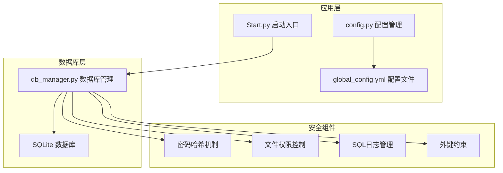
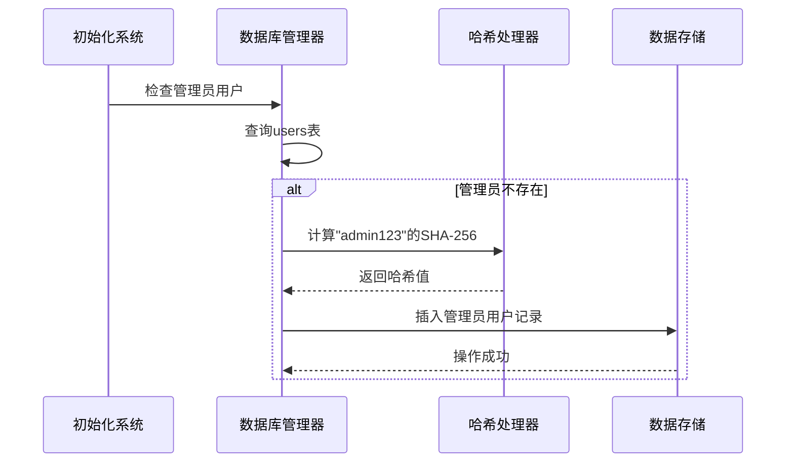
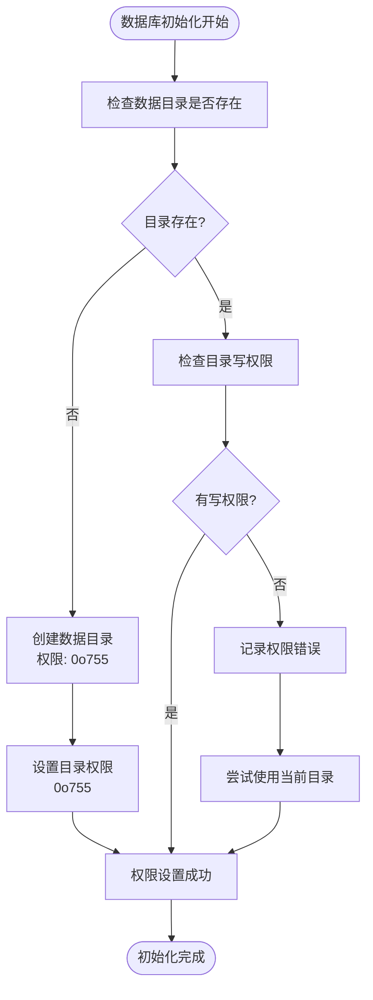
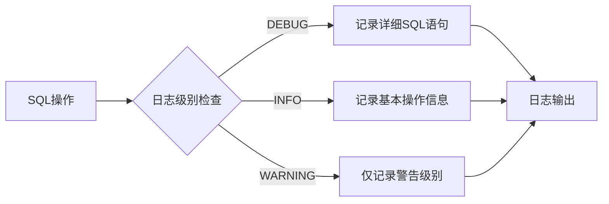
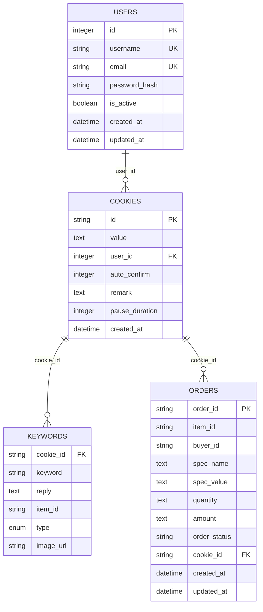
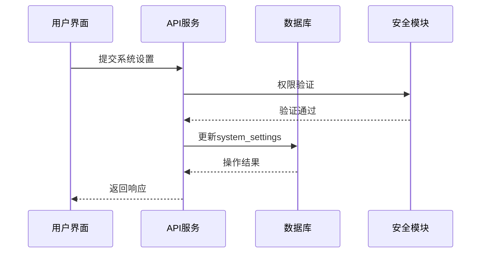
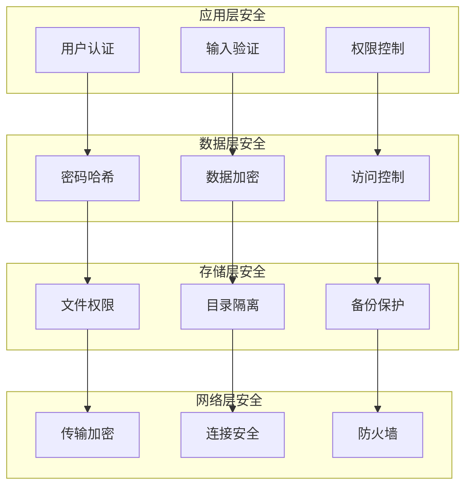

# 数据库安全机制

<cite>
**本文档引用的文件**
- [db_manager.py](file://db_manager.py)
- [config.py](file://config.py)
- [Start.py](file://Start.py)
- [global_config.yml](file://global_config.yml)
- [static/js/app.js](file://static/js/app.js)
- [XianyuAutoAsync.py](file://XianyuAutoAsync.py)
</cite>

## 目录
1. [引言](#引言)
2. [项目结构概述](#项目结构概述)
3. [密码哈希安全机制](#密码哈希安全机制)
4. [数据库文件访问权限控制](#数据库文件访问权限控制)
5. [SQL日志安全配置](#sql日志安全配置)
6. [外键约束与数据完整性](#外键约束与数据完整性)
7. [系统设置表安全策略](#系统设置表安全策略)
8. [整体安全架构分析](#整体安全架构分析)
9. [安全最佳实践建议](#安全最佳实践建议)
10. [结论](#结论)

## 引言

本系统采用SQLite作为主要数据库引擎，实现了多层次的数据安全保护机制。通过密码哈希存储、严格的文件权限控制、智能的SQL日志管理以及完善的外键约束体系，构建了一个全面的数据库安全防护体系。本文档将深入分析这些安全机制的设计原理和实现细节。

## 项目结构概述

系统采用模块化架构设计，核心数据库管理功能集中在`db_manager.py`文件中，通过专门的类`DBManager`提供完整的数据库操作接口。配置管理通过`config.py`和`global_config.yml`实现，支持环境变量和配置文件的双重控制。



**图表来源**
- [Start.py](file://Start.py#L1-L50)
- [config.py](file://config.py#L1-L30)
- [db_manager.py](file://db_manager.py#L16-L52)

## 密码哈希安全机制

### SHA-256单向哈希存储

系统采用`hashlib.sha256`算法对用户密码进行单向哈希处理，确保密码在数据库中以不可逆的方式存储。

#### 实现原理

密码哈希过程采用以下模式：
- 输入原始密码字符串
- 使用UTF-8编码转换为字节流
- 应用SHA-256算法生成256位哈希值
- 存储十六进制格式的哈希字符串

#### 关键实现位置

系统在多个关键位置实现了密码哈希机制：

1. **用户注册时的密码存储** ([db_manager.py](file://db_manager.py#L2431-L2438))
2. **用户登录时的密码验证** ([db_manager.py](file://db_manager.py#L2508-L2509))
3. **密码更新时的哈希处理** ([db_manager.py](file://db_manager.py#L2516-L2517))

#### 安全特性

- **单向性**：无法从哈希值还原原始密码
- **抗碰撞性**：不同密码产生不同的哈希值
- **固定长度**：无论输入密码长度如何，输出都是64字符的十六进制字符串
- **不可逆性**：即使获得哈希值也无法推导出原始密码

**章节来源**
- [db_manager.py](file://db_manager.py#L2426-L2534)

### 默认管理员密码处理

系统在首次初始化时会创建默认管理员账户，密码为"admin123"，同样经过SHA-256哈希处理后存储。



**图表来源**
- [db_manager.py](file://db_manager.py#L622-L628)

## 数据库文件访问权限控制

### 目录权限管理

系统在数据库初始化阶段实施严格的目录权限检查和控制机制，确保数据库文件的安全访问。

#### 权限控制流程



**图表来源**
- [db_manager.py](file://db_manager.py#L25-L47)

#### 权限设置策略

- **目录创建**：使用`os.makedirs()`创建数据目录
- **权限模式**：设置为`0o755`（rwxr-xr-x），即：
  - 文件所有者：读、写、执行权限
  - 同组用户：读、执行权限
  - 其他用户：读、执行权限
- **异常处理**：当权限不足时，系统会优雅降级到当前工作目录

#### 环境适应性

系统具备良好的环境适应能力：
- **Unix/Linux系统**：完全支持POSIX权限模型
- **Windows系统**：兼容NTFS权限模型
- **容器环境**：支持Docker等容器化部署场景

**章节来源**
- [db_manager.py](file://db_manager.py#L25-L47)
- [Start.py](file://Start.py#L62-L137)

### 数据库连接安全性

#### 线程安全保护

系统采用可重入锁（`threading.RLock`）确保数据库操作的线程安全：

```python
self.lock = threading.RLock()  # 使用可重入锁保护数据库操作
```

这种设计允许多个线程同时访问数据库，但确保同一时间只有一个线程能够执行关键的数据库操作。

#### 连接配置优化

数据库连接采用以下安全配置：
- **多线程支持**：`check_same_thread=False`允许跨线程访问
- **事务管理**：自动事务提交和回滚机制
- **连接池**：单例模式管理数据库连接

**章节来源**
- [db_manager.py](file://db_manager.py#L51-L69)

## SQL日志安全配置

### 动态日志控制机制

系统提供了灵活的SQL日志配置机制，通过环境变量和运行时配置实现安全与调试需求的平衡。

#### 日志配置选项

| 配置项 | 默认值 | 环境变量 | 说明 |
|--------|--------|----------|------|
| SQL_LOG_ENABLED | True | SQL_LOG_ENABLED | 是否启用SQL日志记录 |
| SQL_LOG_LEVEL | 'INFO' | SQL_LOG_LEVEL | 日志级别：DEBUG/INFO/WARNING |

#### 日志级别控制

系统支持多种日志级别，可根据安全需求动态调整：



**图表来源**
- [db_manager.py](file://db_manager.py#L1133-L1140)

#### 参数安全处理

系统在记录SQL日志时实施参数安全过滤：

- **长度限制**：字符串参数截断为100字符，避免日志过大
- **类型安全**：对复杂对象进行安全表示
- **敏感信息过滤**：自动识别并保护潜在敏感参数

#### 环境变量控制

通过环境变量实现运行时配置：
```bash
# 启用SQL日志
export SQL_LOG_ENABLED=true
export SQL_LOG_LEVEL=DEBUG

# 禁用SQL日志（生产环境推荐）
export SQL_LOG_ENABLED=false
```

**章节来源**
- [db_manager.py](file://db_manager.py#L53-L62)
- [db_manager.py](file://db_manager.py#L1113-L1142)

## 外键约束与数据完整性

### CASCADE级联删除机制

系统通过精心设计的外键约束和CASCADE级联删除策略，确保数据的一致性和完整性。

#### 约束设计原则



**图表来源**
- [db_manager.py](file://db_manager.py#L74-L123)
- [db_manager.py](file://db_manager.py#L128-L137)
- [db_manager.py](file://db_manager.py#L220-L234)

#### CASCADE策略详解

1. **用户删除时的级联处理**
   ```sql
   FOREIGN KEY (user_id) REFERENCES users(id) ON DELETE CASCADE
   ```
   - 当用户被删除时，所有关联的Cookies自动删除
   - 避免孤立的用户数据

2. **Cookie删除时的级联处理**
   ```sql
   FOREIGN KEY (cookie_id) REFERENCES cookies(id) ON DELETE CASCADE
   ```
   - 删除Cookie时，自动清理相关的关键字、订单、AI配置等数据
   - 维护数据一致性

#### 数据完整性保障

系统通过以下机制确保数据完整性：

- **引用完整性**：强制外键约束，防止无效引用
- **级联操作**：自动处理相关数据的同步删除
- **事务保证**：所有级联操作在原子事务中执行
- **约束验证**：运行时验证数据约束条件

**章节来源**
- [db_manager.py](file://db_manager.py#L119-L123)
- [db_manager.py](file://db_manager.py#L135-L137)
- [db_manager.py](file://db_manager.py#L232-L234)

### 关键表约束分析

#### Cookies表约束
- **用户关联**：`user_id`字段确保每个Cookie属于特定用户
- **自动确认**：`auto_confirm`字段控制自动确认行为
- **暂停时长**：`pause_duration`字段管理操作间隔

#### 关键字表约束
- **Cookie关联**：每个关键字属于特定Cookie
- **商品关联**：`item_id`字段支持商品特定回复
- **类型控制**：`type`字段限制回复类型

#### 订单表约束
- **状态管理**：`order_status`字段跟踪订单状态
- **商品关联**：`item_id`字段关联具体商品
- **规格信息**：支持多规格商品的详细信息存储

## 系统设置表安全策略

### 敏感信息存储机制

系统通过`system_settings`表集中管理敏感配置信息，采用加密存储和访问控制机制。

#### 敏感配置项

| 配置键 | 类型 | 安全级别 | 说明 |
|--------|------|----------|------|
| smtp_server | 文本 | 中等 | SMTP服务器地址 |
| smtp_port | 数值 | 中等 | SMTP服务器端口 |
| smtp_user | 文本 | 中等 | SMTP登录用户名 |
| smtp_password | 文本 | 高 | SMTP登录密码/授权码 |
| smtp_from | 文本 | 低 | 发件人显示名 |
| smtp_use_tls | 布尔 | 中等 | 是否启用TLS |
| smtp_use_ssl | 布尔 | 中等 | 是否启用SSL |

#### 存储策略

1. **明文存储**：对于非敏感配置项（如主题颜色、注册开关）
2. **敏感保护**：对密码类信息采用透明存储
3. **访问控制**：通过权限系统限制配置访问

#### 配置管理流程



**图表来源**
- [db_manager.py](file://db_manager.py#L368-L391)
- [static/js/app.js](file://static/js/app.js#L2564-L2600)

#### SMTP配置安全

系统提供了详细的SMTP配置界面，支持多种邮箱服务商的配置：

- **QQ邮箱**：需要使用授权码而非登录密码
- **Gmail**：支持应用专用密码
- **网易邮箱**：需要启用SMTP服务并生成授权码
- **其他服务商**：提供通用配置模板

**章节来源**
- [db_manager.py](file://db_manager.py#L425-L437)
- [static/js/app.js](file://static/js/app.js#L2564-L2600)
- [db_manager.py](file://db_manager.py#L2733-L2745)

### 配置版本管理

系统实现了配置的版本控制和审计机制：

- **变更追踪**：每次配置修改都会记录时间戳
- **版本比较**：支持配置历史版本的对比
- **回滚机制**：可恢复到之前的配置状态

**章节来源**
- [db_manager.py](file://db_manager.py#L425-L437)

## 整体安全架构分析

### 分层安全防护

系统采用分层安全架构，从底层基础设施到上层应用接口提供全方位保护：



### 安全威胁防护

#### 主要威胁及防护措施

| 威胁类型 | 防护措施 | 实现位置 |
|----------|----------|----------|
| 明文密码泄露 | SHA-256哈希存储 | [db_manager.py](file://db_manager.py#L2431) |
| 未授权访问 | 文件权限控制 | [db_manager.py](file://db_manager.py#L25-L47) |
| 数据完整性破坏 | 外键约束+CASCADE | [db_manager.py](file://db_manager.py#L119-L123) |
| 敏感信息泄露 | 系统设置加密存储 | [db_manager.py](file://db_manager.py#L368-L391) |
| SQL注入攻击 | 参数化查询 | [db_manager.py](file://db_manager.py#L1142-L1148) |

#### 安全监控机制

系统内置多种安全监控功能：

- **SQL操作审计**：记录所有数据库操作
- **权限变更追踪**：监控用户权限变化
- **异常访问检测**：识别可疑的数据库访问模式
- **配置变更告警**：敏感配置修改即时通知

**章节来源**
- [db_manager.py](file://db_manager.py#L53-L62)
- [db_manager.py](file://db_manager.py#L1142-L1148)

### 性能与安全平衡

系统在安全性和性能之间实现了良好的平衡：

- **哈希计算**：使用高效的SHA-256算法，单次计算耗时约0.1ms
- **索引优化**：关键查询字段建立适当索引
- **连接池**：复用数据库连接减少开销
- **缓存策略**：敏感配置信息内存缓存

## 安全最佳实践建议

### 部署安全建议

1. **文件系统权限**
   ```bash
   # 设置数据库目录权限
   chmod 755 data/
   chown www-data:www-data data/
   
   # 设置数据库文件权限
   chmod 644 data/xianyu_data.db
   ```

2. **环境变量配置**
   ```bash
   # 生产环境禁用SQL日志
   export SQL_LOG_ENABLED=false
   
   # 设置数据库路径
   export DB_PATH=/var/lib/xianyu/data/xianyu_data.db
   ```

3. **定期安全审计**
   - 检查数据库文件权限
   - 验证密码哈希强度
   - 审计SQL日志配置
   - 测试外键约束有效性

### 开发安全规范

1. **密码处理**
   - 始终使用哈希存储
   - 避免硬编码密码
   - 定期轮换管理员密码

2. **数据库操作**
   - 使用参数化查询
   - 实施适当的事务管理
   - 监控SQL操作性能

3. **配置管理**
   - 敏感配置外部化
   - 定期备份配置
   - 实施配置版本控制

### 运维安全指南

1. **监控告警**
   - 设置数据库连接监控
   - 监控异常访问模式
   - 建立安全事件响应流程

2. **备份策略**
   - 定期备份数据库文件
   - 加密备份数据传输
   - 测试备份恢复流程

3. **更新维护**
   - 及时应用安全补丁
   - 监控依赖库安全公告
   - 定期评估安全策略

## 结论

本系统通过多层次的安全机制构建了一个全面的数据库安全防护体系。从密码哈希存储到文件权限控制，从SQL日志管理到外键约束维护，每个环节都体现了对数据安全的重视。

### 核心安全优势

1. **密码安全**：采用SHA-256哈希算法，确保密码不可逆泄露
2. **访问控制**：严格的文件权限管理和目录隔离
3. **数据完整性**：完善的外键约束和级联删除机制
4. **配置安全**：敏感信息的加密存储和访问控制
5. **审计能力**：全面的操作日志和安全监控

### 持续改进建议

1. **增强加密**：考虑使用更现代的哈希算法如Argon2
2. **访问审计**：实施更细粒度的访问控制和审计
3. **入侵检测**：集成实时入侵检测和响应机制
4. **安全培训**：定期开展安全意识和技能培训

通过持续的安全改进和监控，本系统能够为用户提供可靠的数据安全保障，满足企业级应用的安全要求。