# 数据库日志安全配置

<cite>
**本文档中引用的文件**
- [config.py](file://config.py)
- [db_manager.py](file://db_manager.py)
- [global_config.yml](file://global_config.yml)
- [Start.py](file://Start.py)
- [file_log_collector.py](file://file_log_collector.py)
- [XianyuAutoAsync.py](file://XianyuAutoAsync.py)
- [reply_server.py](file://reply_server.py)
</cite>

## 目录
1. [简介](#简介)
2. [项目结构概览](#项目结构概览)
3. [SQL日志配置机制](#sql日志配置机制)
4. [环境变量控制](#环境变量控制)
5. [日志级别安全影响](#日志级别安全影响)
6. [敏感信息保护策略](#敏感信息保护策略)
7. [整体日志安全架构](#整体日志安全架构)
8. [性能与安全平衡](#性能与安全平衡)
9. [故障排除指南](#故障排除指南)
10. [最佳实践建议](#最佳实践建议)

## 简介

本文档全面解析了Xianyu Auto Reply项目中的数据库日志安全配置机制。该项目是一个自动回复系统，需要在调试需求和安全风险之间找到平衡。核心的安全配置集中在`db_manager.py`中的SQL日志系统，通过环境变量和配置文件实现了灵活的日志控制机制。

## 项目结构概览

该项目采用模块化设计，主要涉及以下核心组件：

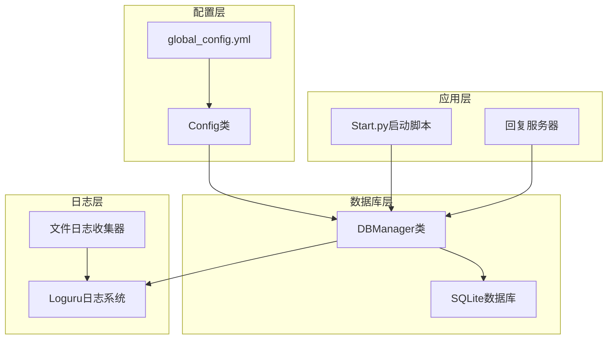

**图表来源**
- [config.py](file://config.py#L1-L126)
- [db_manager.py](file://db_manager.py#L1-L800)
- [Start.py](file://Start.py#L1-L602)

**章节来源**
- [config.py](file://config.py#L1-L126)
- [db_manager.py](file://db_manager.py#L1-L800)
- [global_config.yml](file://global_config.yml#L1-L77)

## SQL日志配置机制

### 默认配置行为

`db_manager.py`中的`DBManager`类实现了内置的SQL日志控制系统，具有以下特性：

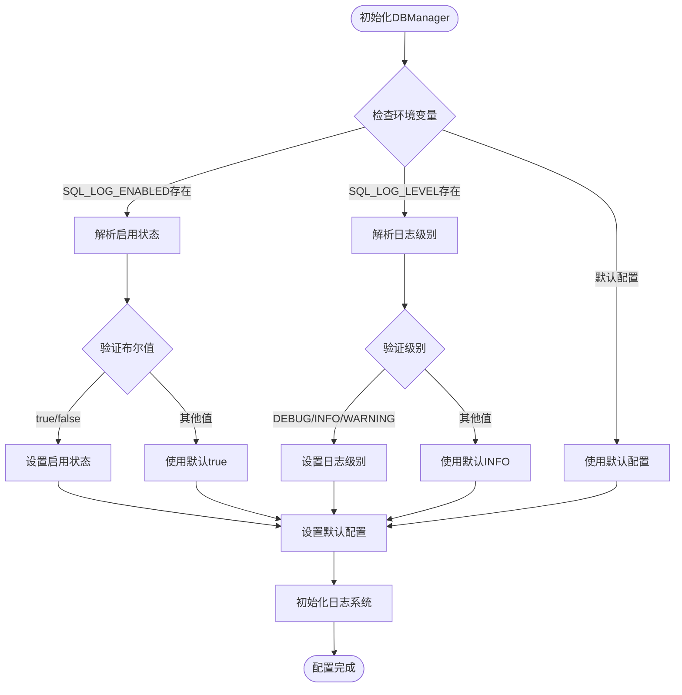

**图表来源**
- [db_manager.py](file://db_manager.py#L53-L63)

### SQL日志记录方法

系统通过`_log_sql`方法实现SQL语句的安全记录：

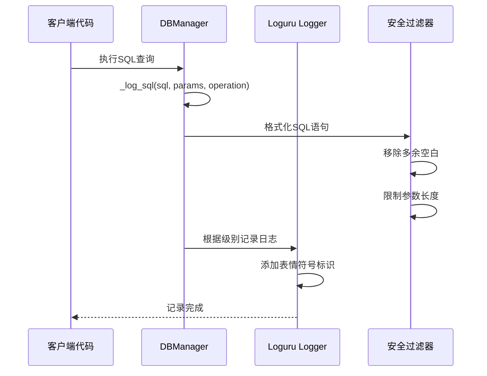

**图表来源**
- [db_manager.py](file://db_manager.py#L1113-L1141)

**章节来源**
- [db_manager.py](file://db_manager.py#L53-L63)
- [db_manager.py](file://db_manager.py#L1113-L1141)

## 环境变量控制

### SQL_LOG_ENABLED环境变量

该环境变量控制SQL日志的总体启用状态：

| 环境变量值 | 配置效果 | 安全影响 |
|------------|----------|----------|
| `true` | 启用SQL日志记录 | 记录所有SQL操作，便于调试 |
| `false` | 禁用SQL日志记录 | 减少日志量，提高性能 |
| 未设置 | 使用默认值true | 保持调试能力 |

### SQL_LOG_LEVEL环境变量

该环境变量控制SQL日志的详细程度：

| 日志级别 | 用途 | 性能影响 | 安全考虑 |
|----------|------|----------|----------|
| `DEBUG` | 详细SQL跟踪 | 最高开销 | 可能泄露敏感参数 |
| `INFO` | 关键操作记录 | 中等开销 | 平衡调试与性能 |
| `WARNING` | 错误和警告 | 最低开销 | 仅记录异常情况 |

### 环境变量解析逻辑

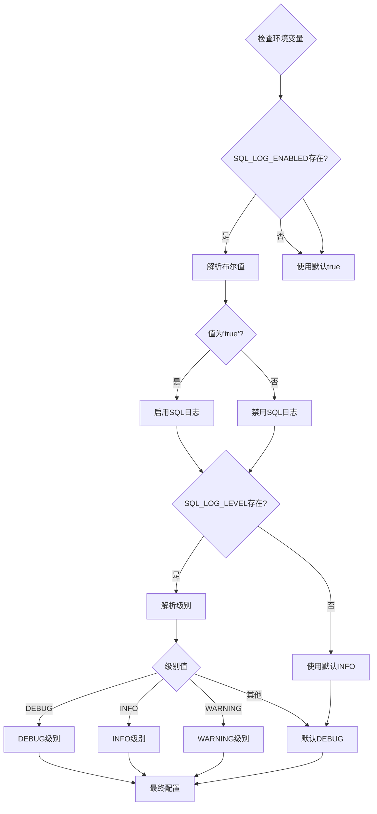

**图表来源**
- [db_manager.py](file://db_manager.py#L58-L61)

**章节来源**
- [db_manager.py](file://db_manager.py#L58-L61)

## 日志级别安全影响

### DEBUG级别安全风险

DEBUG级别的SQL日志记录可能带来以下安全风险：

1. **参数泄露风险**：敏感参数（如密码、令牌）可能被记录
2. **性能影响**：大量日志记录可能导致性能下降
3. **存储压力**：长期积累的DEBUG日志占用磁盘空间

### INFO级别平衡策略

INFO级别提供了调试与性能的平衡：

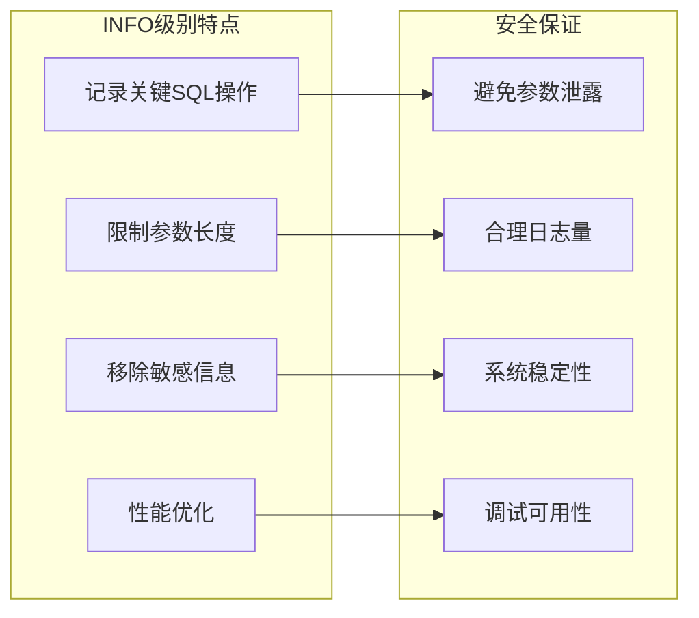

**图表来源**
- [db_manager.py](file://db_manager.py#L1113-L1141)

### WARNING级别监控

WARNING级别专注于异常情况的记录：

| 监控场景 | 记录内容 | 安全考虑 |
|----------|----------|----------|
| SQL执行错误 | 错误信息和SQL语句 | 不记录参数值 |
| 连接失败 | 连接状态和错误码 | 避免泄露连接信息 |
| 权限问题 | 权限相关错误 | 不记录具体权限值 |

**章节来源**
- [db_manager.py](file://db_manager.py#L1133-L1140)

## 敏感信息保护策略

### Cookie和密码处理

系统在多个层面实现了敏感信息的保护：

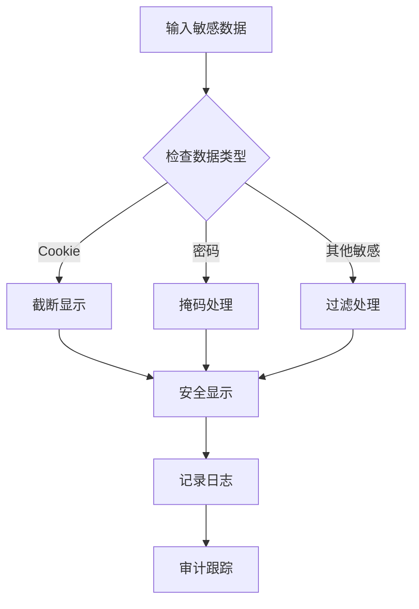

**图表来源**
- [XianyuAutoAsync.py](file://XianyuAutoAsync.py#L4187-L4214)

### 实际保护措施

1. **Cookie截断显示**：长Cookie值只显示首尾部分
2. **参数长度限制**：超过100字符的参数被截断
3. **敏感字段过滤**：数据库查询中自动过滤敏感字段

### 日志内容安全过滤

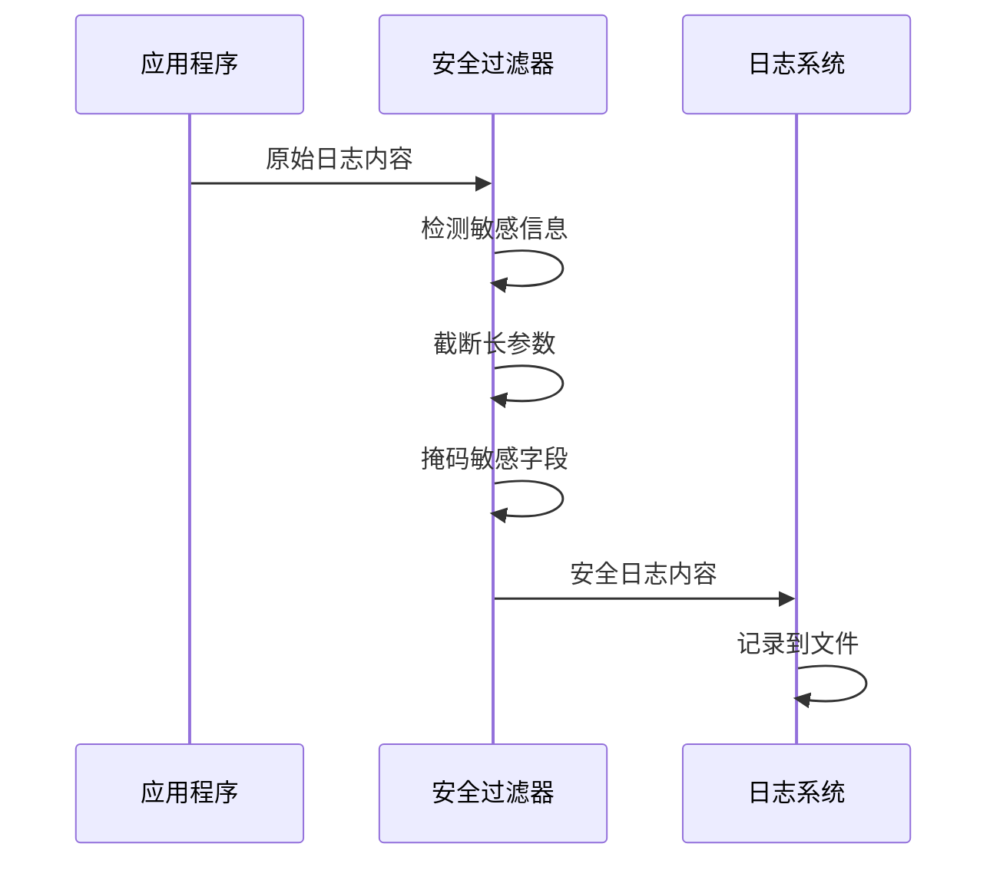

**图表来源**
- [db_manager.py](file://db_manager.py#L1113-L1126)

**章节来源**
- [XianyuAutoAsync.py](file://XianyuAutoAsync.py#L4187-L4214)
- [db_manager.py](file://db_manager.py#L1113-L1126)

## 整体日志安全架构

### LOG_CONFIG配置策略

项目通过`global_config.yml`中的`LOG_CONFIG`定义了整体的日志策略：

| 配置项 | 默认值 | 安全考虑 |
|--------|--------|----------|
| `level` | INFO | 平衡调试与性能 |
| `rotation` | 1 day | 避免日志无限增长 |
| `retention` | 7 days | 合理保留期限 |
| `compression` | zip | 节省存储空间 |

### 文件日志收集器安全

`file_log_collector.py`实现了安全的日志收集机制：

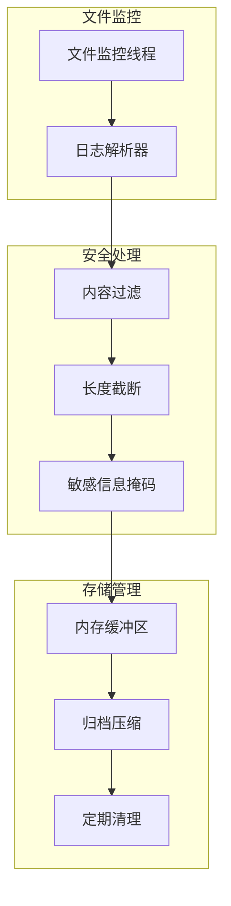

**图表来源**
- [file_log_collector.py](file://file_log_collector.py#L1-L241)

### 多层次安全防护

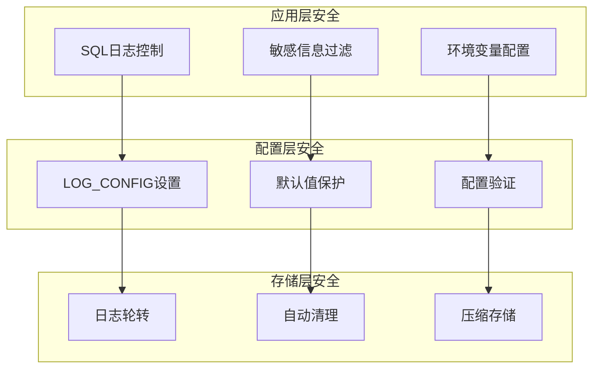

**图表来源**
- [global_config.yml](file://global_config.yml#L49-L56)
- [file_log_collector.py](file://file_log_collector.py#L60-L72)

**章节来源**
- [global_config.yml](file://global_config.yml#L49-L56)
- [file_log_collector.py](file://file_log_collector.py#L1-L241)

## 性能与安全平衡

### 性能优化策略

系统采用了多种性能优化措施：

1. **异步日志记录**：使用非阻塞的日志写入
2. **内存缓冲**：减少磁盘I/O频率
3. **智能轮转**：根据大小和时间自动轮转
4. **压缩存储**：减少磁盘占用

### 调试与生产环境差异

| 环境 | SQL_LOG_ENABLED | SQL_LOG_LEVEL | 日志保留期 |
|------|----------------|---------------|------------|
| 开发环境 | true | DEBUG | 7天 |
| 测试环境 | true | INFO | 3天 |
| 生产环境 | true | INFO | 1天 |
| 安全审计 | true | DEBUG | 30天 |

### 动态配置调整

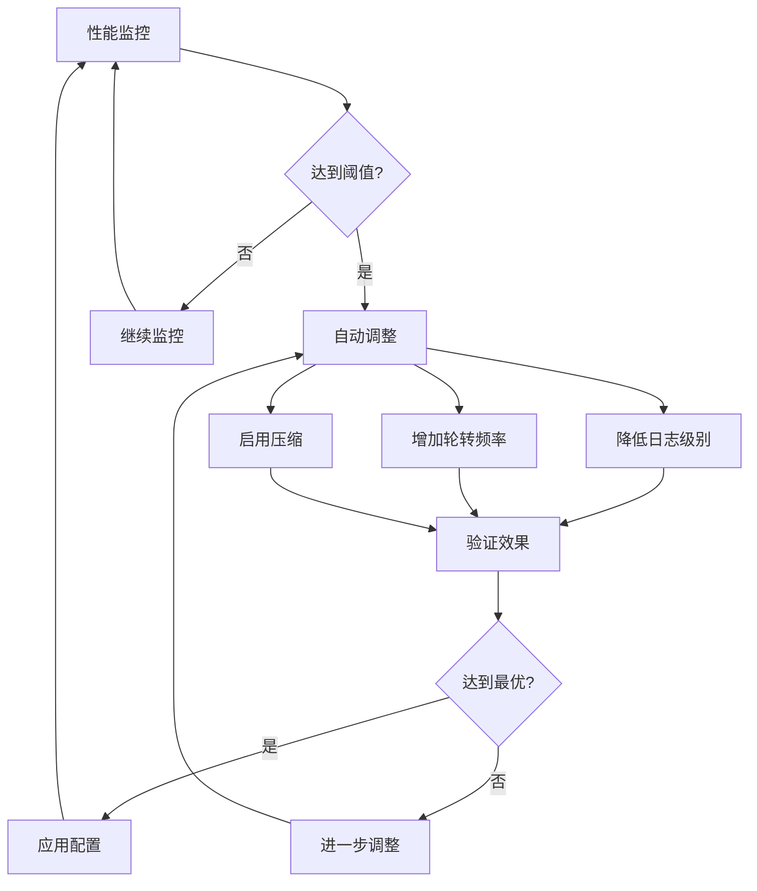

**章节来源**
- [file_log_collector.py](file://file_log_collector.py#L60-L72)

## 故障排除指南

### 常见问题诊断

1. **SQL日志未记录**
   - 检查环境变量设置
   - 验证日志级别配置
   - 确认数据库连接状态

2. **敏感信息泄露**
   - 检查日志级别设置
   - 验证安全过滤规则
   - 审查日志内容

3. **性能问题**
   - 降低日志级别
   - 调整轮转频率
   - 启用日志压缩

### 调试步骤

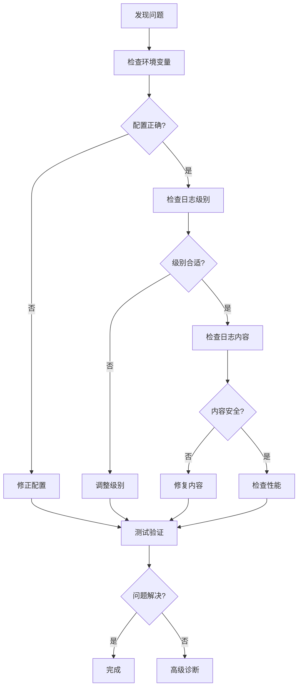

**章节来源**
- [db_manager.py](file://db_manager.py#L58-L63)

## 最佳实践建议

### 开发阶段

1. **启用详细日志**：使用DEBUG级别进行开发调试
2. **定期审查**：检查日志内容的安全性
3. **性能监控**：关注日志对系统性能的影响

### 生产部署

1. **使用默认配置**：保持INFO级别和合理的保留期
2. **定期清理**：确保磁盘空间不会被日志占用
3. **监控告警**：设置日志异常的监控告警

### 安全加固

1. **最小权限原则**：日志文件只允许必要进程访问
2. **加密存储**：敏感日志内容应加密存储
3. **审计跟踪**：记录所有日志配置的变更

### 配置模板

```yaml
# 生产环境配置示例
LOG_CONFIG:
  level: INFO
  rotation: 1 day
  retention: 1 day
  compression: zip
  format: '{time:YYYY-MM-DD HH:mm:ss.SSS} | {level} | {name}:{function}:{line} - {message}'

# 开发环境配置示例
SQL_LOG_ENABLED: true
SQL_LOG_LEVEL: DEBUG
```

通过遵循这些最佳实践，可以在保证系统调试能力的同时，最大限度地降低安全风险，实现性能与安全的最优平衡。