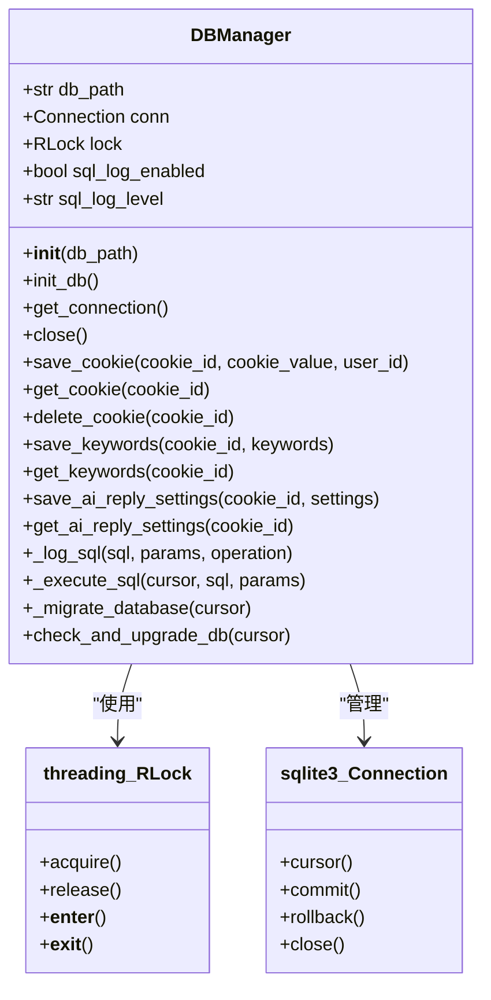
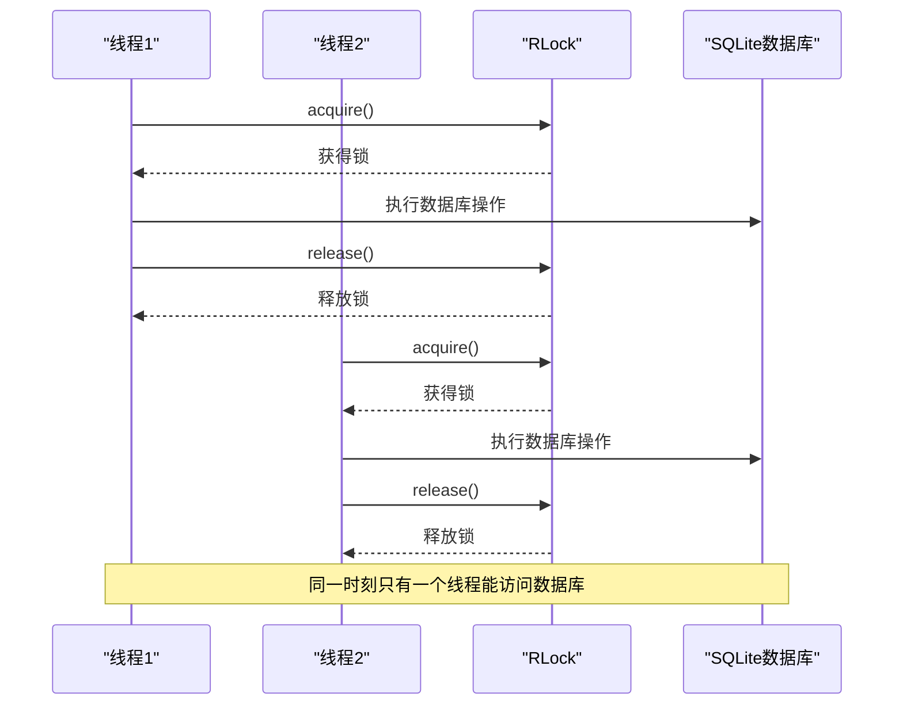
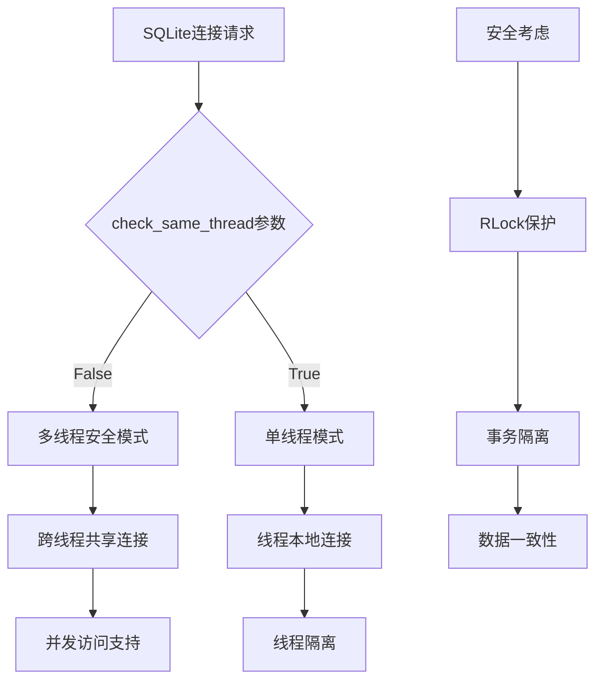
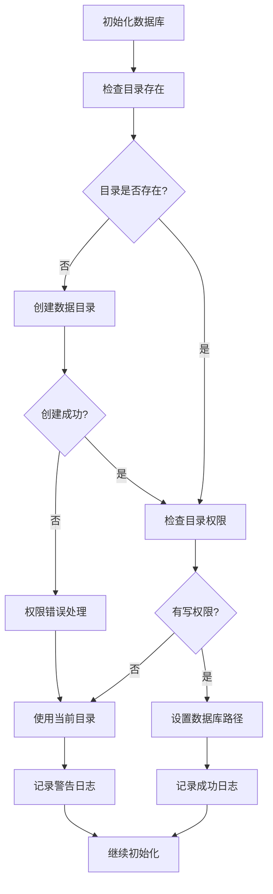
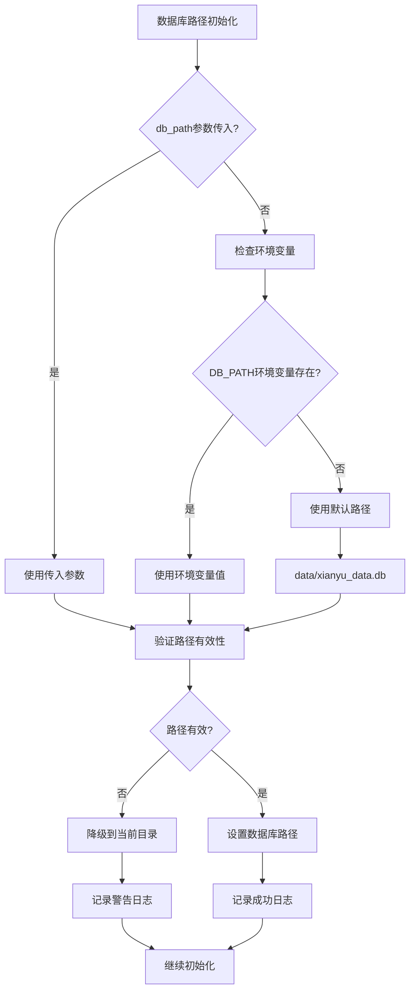
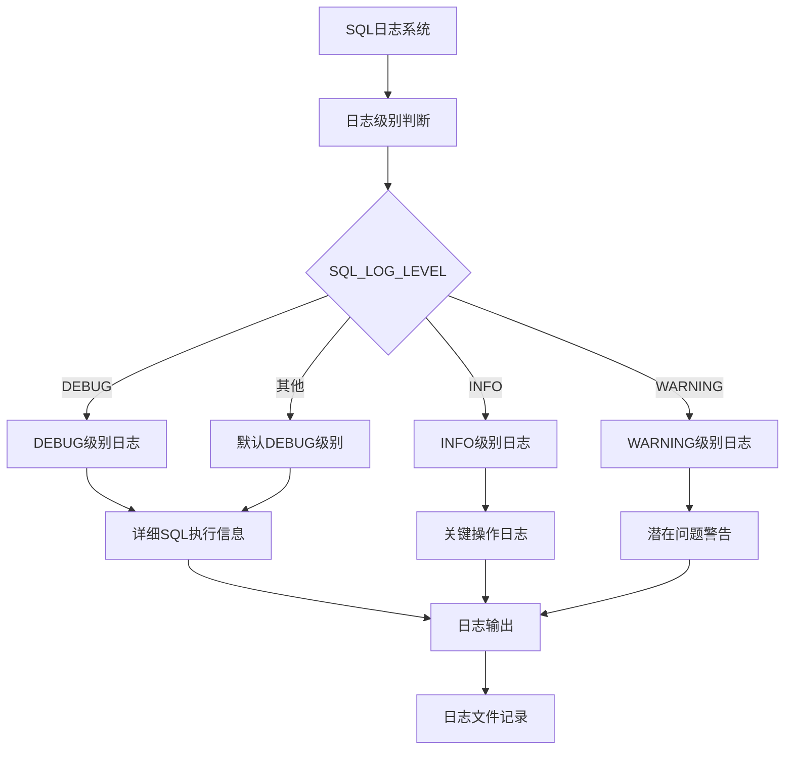
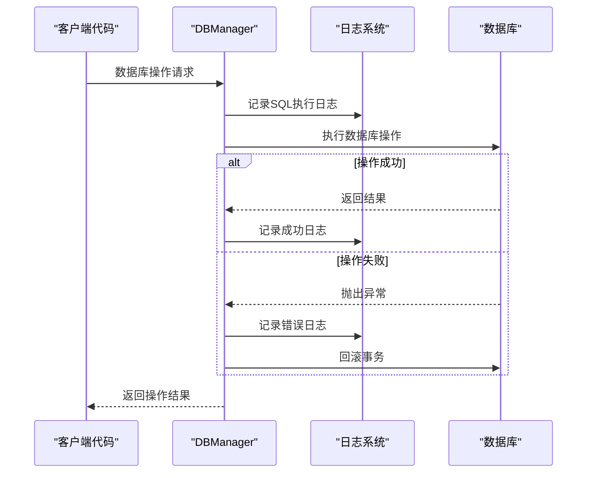
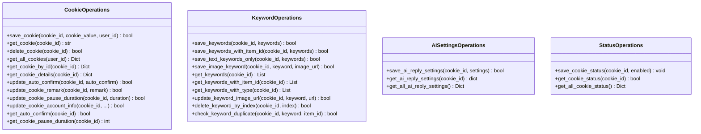
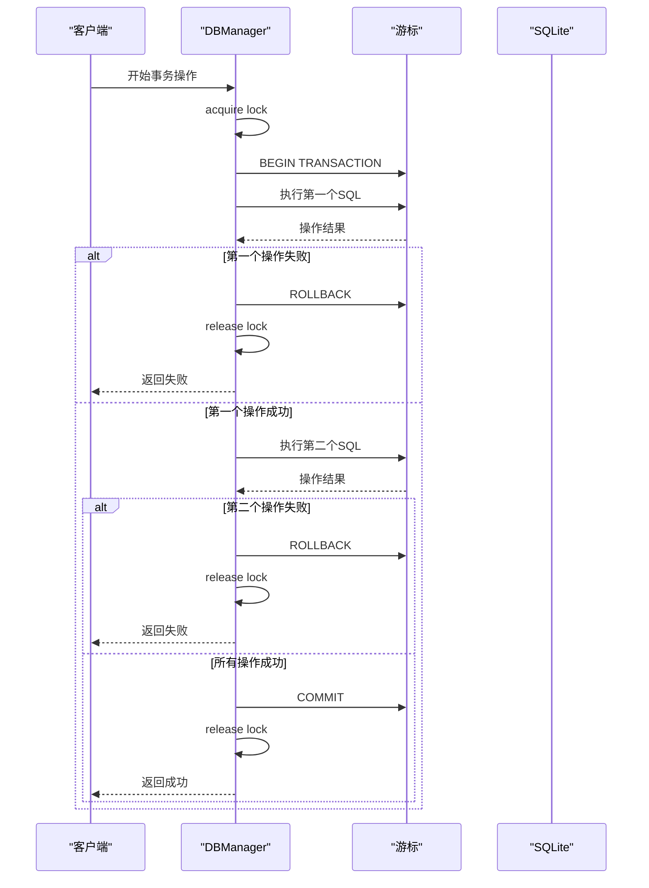

# 数据库访问控制机制深度分析

<cite>
**本文档引用的文件**
- [db_manager.py](file://db_manager.py)
- [config.py](file://config.py)
- [global_config.yml](file://global_config.yml)
</cite>

## 目录
1. [概述](#概述)
2. [核心架构设计](#核心架构设计)
3. [线程安全机制](#线程安全机制)
4. [数据库连接配置](#数据库连接配置)
5. [环境变量配置系统](#环境变量配置系统)
6. [日志监控体系](#日志监控体系)
7. [数据库操作方法](#数据库操作方法)
8. [性能优化策略](#性能优化策略)
9. [故障排除指南](#故障排除指南)
10. [最佳实践建议](#最佳实践建议)

## 概述

本文档深入分析了XianyuAutoReply项目中的数据库访问控制机制，重点探讨了DBManager类如何通过多层次的安全措施确保数据库操作的线程安全性和可靠性。该系统采用了SQLite作为底层数据库，结合Python的多线程特性，实现了高效且安全的数据持久化解决方案。

## 核心架构设计

### DBManager类架构

DBManager类是整个数据库访问层的核心组件，采用单例模式设计，确保全局只有一个数据库连接实例。



**图表来源**
- [db_manager.py](file://db_manager.py#L16-L52)

### 数据库表结构设计

系统设计了多个专门的数据库表来支持不同的业务功能：

```mermaid
erDiagram
USERS {
int id PK
string username UK
string email UK
string password_hash
boolean is_active
timestamp created_at
timestamp updated_at
}
COOKIES {
string id PK
string value
int user_id FK
int auto_confirm
string remark
int pause_duration
string username
string password
int show_browser
timestamp created_at
}
KEYWORDS {
string cookie_id FK
string keyword
string reply
string item_id
string type
string image_url
foreign key (cookie_id) references cookies(id)
}
AI_REPLY_SETTINGS {
string cookie_id PK FK
boolean ai_enabled
string model_name
string api_key
string base_url
int max_discount_percent
int max_discount_amount
int max_bargain_rounds
string custom_prompts
timestamp created_at
timestamp updated_at
}
COOKIE_STATUS {
string cookie_id PK FK
boolean enabled
timestamp updated_at
}
USERS ||--o{ COOKIES : "拥有"
COOKIES ||--o{ KEYWORDS : "包含"
COOKIES ||--|| AI_REPLY_SETTINGS : "配置"
COOKIES ||--|| COOKIE_STATUS : "状态"
```

**图表来源**
- [db_manager.py](file://db_manager.py#L69-L447)

**章节来源**
- [db_manager.py](file://db_manager.py#L16-L447)

## 线程安全机制

### RLock可重入锁的实现

DBManager类的核心安全机制是使用Python标准库中的`threading.RLock`来确保数据库操作的线程安全性。

#### 锁机制的工作原理



**图表来源**
- [db_manager.py](file://db_manager.py#L51)

#### 锁的应用场景

系统在所有关键的数据库操作中都使用了锁保护：

1. **Cookie管理操作**：保存、获取、删除Cookie
2. **关键字管理操作**：保存、获取、更新关键字
3. **AI设置管理**：保存、获取AI回复设置
4. **状态管理操作**：保存、获取Cookie状态
5. **事务性操作**：涉及多个表的复杂操作

#### 可重入特性的优势

RLock的可重入特性允许同一个线程在持有锁的情况下再次获取锁，这对于复杂的业务逻辑特别重要：

```python
# 示例：嵌套的数据库操作
with self.lock:
    # 外层操作
    self._execute_sql(cursor, "BEGIN TRANSACTION")
    try:
        # 内层操作（在同一事务中）
        self.save_keywords(cookie_id, keywords)
        self.save_ai_reply_settings(cookie_id, settings)
        self.conn.commit()
    except Exception as e:
        self.conn.rollback()
        raise
```

**章节来源**
- [db_manager.py](file://db_manager.py#L51-L1194)

## 数据库连接配置

### SQLite连接参数

系统使用SQLite作为底层数据库，通过特定的连接参数确保多线程环境下的安全访问。

#### check_same_thread=False配置



**图表来源**
- [db_manager.py](file://db_manager.py#L70)

#### 连接池管理策略

系统实现了智能的连接管理机制：

1. **延迟连接**：只有在首次需要时才建立数据库连接
2. **自动重连**：连接断开时自动重新建立连接
3. **连接复用**：在整个应用生命周期内复用同一个连接

#### 目录权限检查机制

系统在初始化时会严格检查数据库目录的权限：



**图表来源**
- [db_manager.py](file://db_manager.py#L25-L47)

**章节来源**
- [db_manager.py](file://db_manager.py#L69-L1106)

## 环境变量配置系统

### DB_PATH环境变量控制

系统提供了灵活的数据库路径配置机制，支持通过环境变量动态调整数据库位置。

#### 配置优先级机制



**图表来源**
- [db_manager.py](file://db_manager.py#L22-L23)

#### 环境变量配置示例

系统支持多种环境变量配置：

| 环境变量 | 默认值 | 说明 |
|---------|--------|------|
| `DB_PATH` | `data/xianyu_data.db` | 数据库文件路径 |
| `SQL_LOG_ENABLED` | `true` | 是否启用SQL日志 |
| `SQL_LOG_LEVEL` | `INFO` | SQL日志级别 |

#### 动态配置更新

系统支持运行时通过环境变量动态调整配置：

```python
# SQL日志配置的动态更新机制
if os.getenv('SQL_LOG_ENABLED'):
    self.sql_log_enabled = os.getenv('SQL_LOG_ENABLED', 'true').lower() == 'true'
if os.getenv('SQL_LOG_LEVEL'):
    self.sql_log_level = os.getenv('SQL_LOG_LEVEL', 'INFO').upper()
```

**章节来源**
- [db_manager.py](file://db_manager.py#L22-L62)

## 日志监控体系

### SQL执行日志系统

系统实现了全面的SQL执行日志记录机制，支持不同级别的日志输出和灵活的配置选项。

#### 日志级别配置



**图表来源**
- [db_manager.py](file://db_manager.py#L1133-L1140)

#### 日志内容格式化

系统对SQL日志进行了精心的格式化处理：

1. **SQL语句清理**：移除多余的空白字符
2. **参数安全处理**：限制参数长度，避免敏感信息泄露
3. **操作类型标识**：区分普通执行和批量执行
4. **图标增强**：使用数据库图标增强视觉识别

#### 日志监控指标

系统通过日志记录实现了多维度的监控：

| 监控维度 | 记录内容 | 用途 |
|---------|----------|------|
| SQL执行 | 完整的SQL语句和参数 | 性能分析和调试 |
| 操作类型 | EXECUTE/EXECUTEMANY | 操作分类统计 |
| 时间戳 | 执行时间点 | 性能分析 |
| 参数安全 | 截断的参数值 | 安全审计 |

#### 异常监控机制

系统在每个数据库操作中都包含了完善的异常监控：



**图表来源**
- [db_manager.py](file://db_manager.py#L1108-L1148)

**章节来源**
- [db_manager.py](file://db_manager.py#L1108-L1148)

## 数据库操作方法

### 核心操作接口

DBManager类提供了丰富的数据库操作方法，涵盖了从基础的CRUD操作到复杂的业务逻辑处理。

#### Cookie管理操作



**图表来源**
- [db_manager.py](file://db_manager.py#L1155-L2000)

#### 事务处理机制

系统在关键操作中实现了完整的事务处理：



**图表来源**
- [db_manager.py](file://db_manager.py#L1158-L1189)

#### 数据迁移和升级机制

系统实现了强大的数据库迁移和升级功能：

1. **版本检查**：自动检测数据库版本
2. **增量升级**：支持逐步升级到最新版本
3. **向后兼容**：确保新版本能够处理旧版本数据
4. **自动修复**：自动修复常见的数据问题

**章节来源**
- [db_manager.py](file://db_manager.py#L1155-L2000)

## 性能优化策略

### 连接管理优化

系统采用了多种连接管理优化策略：

1. **延迟初始化**：仅在首次需要时建立连接
2. **连接复用**：在整个应用生命周期内复用连接
3. **自动重连**：连接断开时自动恢复
4. **资源清理**：及时释放不再使用的资源

### 查询优化技术

1. **索引策略**：为频繁查询的字段建立索引
2. **批量操作**：支持批量插入和更新操作
3. **参数化查询**：防止SQL注入并提高解析效率
4. **事务批处理**：将多个操作合并到单个事务中

### 内存管理优化

1. **连接池大小控制**：合理控制并发连接数
2. **内存使用监控**：监控数据库内存占用
3. **垃圾回收优化**：及时清理不再使用的对象

## 故障排除指南

### 常见问题诊断

#### 数据库连接问题

**症状**：无法连接到数据库文件
**原因**：
1. 数据库文件路径错误
2. 目录权限不足
3. 文件被其他进程锁定

**解决方案**：
1. 检查`DB_PATH`环境变量设置
2. 验证数据目录的读写权限
3. 确认数据库文件未被其他程序占用

#### 线程安全问题

**症状**：数据库操作出现竞态条件
**原因**：
1. 锁机制失效
2. 事务未正确提交/回滚
3. 并发访问冲突

**解决方案**：
1. 检查RLock的正确使用
2. 确保所有事务都有正确的提交/回滚逻辑
3. 分析并发访问模式

#### 性能问题

**症状**：数据库操作响应缓慢
**原因**：
1. 缺少适当的索引
2. 查询语句效率低下
3. 连接池配置不当

**解决方案**：
1. 分析慢查询日志
2. 添加必要的索引
3. 优化查询语句
4. 调整连接池参数

### 监控和调试工具

系统提供了多种监控和调试工具：

1. **SQL日志**：详细的SQL执行记录
2. **性能指标**：操作耗时统计
3. **错误追踪**：异常堆栈信息
4. **连接状态**：数据库连接健康检查

## 最佳实践建议

### 部署配置建议

1. **环境变量配置**
   ```bash
   export DB_PATH=/var/lib/xianyu/data.db
   export SQL_LOG_ENABLED=true
   export SQL_LOG_LEVEL=INFO
   ```

2. **目录权限设置**
   ```bash
   mkdir -p /var/lib/xianyu
   chmod 755 /var/lib/xianyu
   chown www-data:www-data /var/lib/xianyu
   ```

3. **日志轮转配置**
   ```bash
   # /etc/logrotate.d/xianyu
   /var/log/xianyu/*.log {
       daily
       rotate 7
       compress
       delaycompress
       missingok
       notifempty
   }
   ```

### 开发规范建议

1. **事务边界明确**：每个事务应该有清晰的开始和结束
2. **异常处理完善**：所有数据库操作都应该有适当的异常处理
3. **资源释放及时**：确保数据库连接和游标得到正确释放
4. **日志记录完整**：重要的数据库操作都应该有相应的日志记录

### 安全配置建议

1. **最小权限原则**：数据库文件和目录使用最小必要权限
2. **敏感信息保护**：避免在日志中记录敏感的数据库凭据
3. **连接加密**：在生产环境中考虑使用加密连接
4. **定期备份**：建立完善的数据库备份和恢复机制

### 监控和维护建议

1. **定期检查**：定期检查数据库文件大小和碎片情况
2. **性能监控**：监控数据库操作的平均响应时间和错误率
3. **容量规划**：根据数据增长趋势进行容量规划
4. **版本升级**：及时跟进数据库软件的安全补丁和功能更新

通过以上深入分析，我们可以看到XianyuAutoReply项目的数据库访问控制系统是一个设计精良、功能完备的企业级解决方案。它不仅确保了数据的安全性和一致性，还提供了良好的性能和可维护性，为整个系统的稳定运行奠定了坚实的基础。