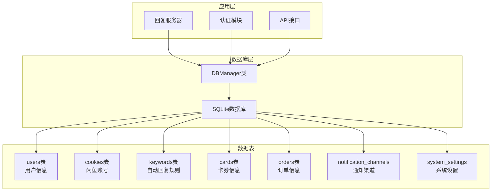
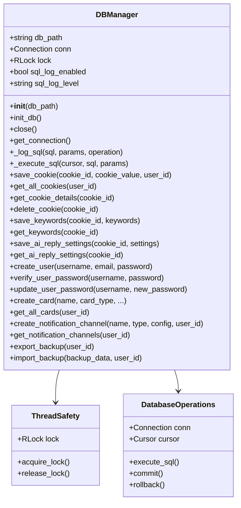
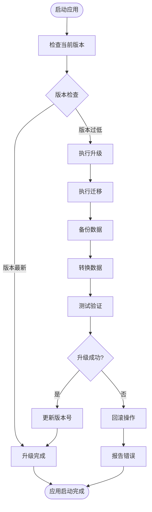

# 数据库管理模块

<cite>
**本文档引用的文件**
- [db_manager.py](file://db_manager.py)
- [config.py](file://config.py)
- [global_config.yml](file://global_config.yml)
- [reply_server.py](file://reply_server.py)
- [static/js/app.js](file://static/js/app.js)
- [static/login.html](file://static/login.html)
</cite>

## 目录
1. [简介](#简介)
2. [项目结构概览](#项目结构概览)
3. [DBManager类设计](#dbmanager类设计)
4. [数据库表结构](#数据库表结构)
5. [核心CRUD操作](#核心crud操作)
6. [安全机制](#安全机制)
7. [数据库迁移与升级](#数据库迁移与升级)
8. [查询示例](#查询示例)
9. [性能考虑](#性能考虑)
10. [故障排除指南](#故障排除指南)
11. [总结](#总结)

## 简介

数据库管理模块是闲鱼自动回复系统的核心组件，负责所有数据的持久化存储和管理。该模块采用Python的SQLite数据库，提供了完整的数据访问层，支持多用户隔离、数据加密、自动迁移等功能。

## 项目结构概览



**图表来源**
- [db_manager.py](file://db_manager.py#L16-L52)

## DBManager类设计

### 核心特性

DBManager类是整个数据库管理模块的核心，具有以下关键特性：

#### 线程安全设计
- 使用`threading.RLock()`实现可重入锁保护数据库操作
- 确保多线程环境下的数据一致性
- 支持并发读取和互斥写入

#### 数据库连接管理
- 自动创建数据目录和数据库文件
- 支持环境变量配置数据库路径
- 提供连接池管理机制

#### 日志记录
- 可配置的SQL日志记录
- 支持多种日志级别（DEBUG、INFO、WARNING）
- 记录所有数据库操作的详细信息



**图表来源**
- [db_manager.py](file://db_manager.py#L16-L52)

**章节来源**
- [db_manager.py](file://db_manager.py#L16-L52)

## 数据库表结构

### 用户表 (users)

用户表存储系统用户的基本信息，支持多用户隔离。

| 字段名 | 类型 | 约束 | 描述 |
|--------|------|------|------|
| id | INTEGER | PRIMARY KEY AUTOINCREMENT | 用户唯一标识符 |
| username | TEXT | UNIQUE NOT NULL | 用户名，唯一 |
| email | TEXT | UNIQUE NOT NULL | 邮箱地址，唯一 |
| password_hash | TEXT | NOT NULL | 密码哈希值 |
| is_active | BOOLEAN | DEFAULT TRUE | 用户是否激活 |
| created_at | TIMESTAMP | DEFAULT CURRENT_TIMESTAMP | 创建时间 |
| updated_at | TIMESTAMP | DEFAULT CURRENT_TIMESTAMP | 更新时间 |

### 闲鱼账号表 (cookies)

存储闲鱼账号的Cookie信息和相关配置。

| 字段名 | 类型 | 约束 | 描述 |
|--------|------|------|------|
| id | TEXT | PRIMARY KEY | Cookie唯一标识符 |
| value | TEXT | NOT NULL | Cookie值 |
| user_id | INTEGER | NOT NULL | 关联的用户ID |
| auto_confirm | INTEGER | DEFAULT 1 | 自动确认发货设置 |
| remark | TEXT | DEFAULT '' | 备注信息 |
| pause_duration | INTEGER | DEFAULT 10 | 自动回复暂停时间（分钟） |
| username | TEXT | DEFAULT '' | 账号用户名 |
| password | TEXT | DEFAULT '' | 账号密码 |
| show_browser | INTEGER | DEFAULT 0 | 是否显示浏览器 |
| created_at | TIMESTAMP | DEFAULT CURRENT_TIMESTAMP | 创建时间 |

### 关键字表 (keywords)

存储自动回复的关键字规则，支持商品级和通用关键词。

| 字段名 | 类型 | 约束 | 描述 |
|--------|------|------|------|
| cookie_id | TEXT | FOREIGN KEY | 关联的Cookie ID |
| keyword | TEXT | NOT NULL | 触发关键词 |
| reply | TEXT | NOT NULL | 回复内容 |
| item_id | TEXT | | 商品ID（可选） |
| type | TEXT | DEFAULT 'text' | 关键字类型（text/image） |
| image_url | TEXT | | 图片URL（仅图片关键词） |

### 卡券表 (cards)

管理自动回复的卡券模板，支持多规格和API调用。

| 字段名 | 类型 | 约束 | 描述 |
|--------|------|------|------|
| id | INTEGER | PRIMARY KEY AUTOINCREMENT | 卡券ID |
| name | TEXT | NOT NULL | 卡券名称 |
| type | TEXT | NOT NULL CHECK | 卡券类型（api/text/data/image） |
| api_config | TEXT | | API配置信息 |
| text_content | TEXT | | 文本内容 |
| data_content | TEXT | | 数据内容 |
| image_url | TEXT | | 图片URL |
| description | TEXT | | 卡券描述 |
| enabled | BOOLEAN | DEFAULT TRUE | 是否启用 |
| delay_seconds | INTEGER | DEFAULT 0 | 发货延迟时间 |
| is_multi_spec | BOOLEAN | DEFAULT FALSE | 是否多规格 |
| spec_name | TEXT | | 规格名称 |
| spec_value | TEXT | | 规格值 |
| user_id | INTEGER | NOT NULL DEFAULT 1 | 关联用户ID |

### 订单表 (orders)

跟踪订单状态和相关信息。

| 字段名 | 类型 | 约束 | 描述 |
|--------|------|------|------|
| order_id | TEXT | PRIMARY KEY | 订单ID |
| item_id | TEXT | | 商品ID |
| buyer_id | TEXT | | 买家ID |
| spec_name | TEXT | | 规格名称 |
| spec_value | TEXT | | 规格值 |
| quantity | TEXT | | 数量 |
| amount | TEXT | | 金额 |
| order_status | TEXT | DEFAULT 'unknown' | 订单状态 |
| cookie_id | TEXT | FOREIGN KEY | 关联的Cookie ID |

### 通知渠道表 (notification_channels)

配置各种通知渠道的参数。

| 字段名 | 类型 | 约束 | 描述 |
|--------|------|------|------|
| id | INTEGER | PRIMARY KEY AUTOINCREMENT | 渠道ID |
| name | TEXT | NOT NULL | 渠道名称 |
| type | TEXT | NOT NULL CHECK | 渠道类型（qq/dingtalk/feishu/bark/email/webhook/wechat/telegram） |
| config | TEXT | NOT NULL | 配置信息（JSON格式） |
| enabled | BOOLEAN | DEFAULT TRUE | 是否启用 |
| created_at | TIMESTAMP | DEFAULT CURRENT_TIMESTAMP | 创建时间 |
| updated_at | TIMESTAMP | DEFAULT CURRENT_TIMESTAMP | 更新时间 |

### 系统设置表 (system_settings)

存储系统配置参数。

| 字段名 | 类型 | 约束 | 描述 |
|--------|------|------|------|
| key | TEXT | PRIMARY KEY | 设置键名 |
| value | TEXT | NOT NULL | 设置值 |
| description | TEXT | | 设置描述 |
| updated_at | TIMESTAMP | DEFAULT CURRENT_TIMESTAMP | 更新时间 |

**章节来源**
- [db_manager.py](file://db_manager.py#L67-L447)

## 核心CRUD操作

### Cookie管理操作

#### 保存Cookie
```python
def save_cookie(self, cookie_id: str, cookie_value: str, user_id: int = None) -> bool
```
- 支持更新现有Cookie或创建新Cookie
- 自动处理用户关联
- 提供事务保证

#### 获取Cookie详情
```python
def get_cookie_details(self, cookie_id: str) -> Optional[Dict[str, any]]
```
- 返回完整的Cookie信息，包括用户ID、自动确认设置、备注等
- 支持账号密码登录信息

#### 删除Cookie
```python
def delete_cookie(self, cookie_id: str) -> bool
```
- 删除Cookie及其关联的所有数据（关键字、状态等）

### 关键字管理操作

#### 保存关键字
```python
def save_keywords_with_item_id(self, cookie_id: str, keywords: List[Tuple[str, str, str]]) -> bool
```
- 支持批量保存关键字
- 自动删除旧的关键字数据
- 处理商品级和通用关键词

#### 获取关键字
```python
def get_keywords_with_item_id(self, cookie_id: str) -> List[Tuple[str, str, str]]
```
- 获取指定Cookie的所有关键字
- 包含商品ID信息

### 用户管理操作

#### 创建用户
```python
def create_user(self, username: str, email: str, password: str) -> bool
```
- 验证用户名和邮箱唯一性
- 自动生成密码哈希值

#### 验证用户密码
```python
def verify_user_password(self, username: str, password: str) -> bool
```
- 验证用户名和密码组合
- 检查用户是否激活

### 卡券管理操作

#### 创建卡券
```python
def create_card(self, name: str, card_type: str, ...) -> int
```
- 支持多规格卡券
- 自动处理唯一性约束

#### 获取卡券列表
```python
def get_all_cards(self, user_id: int = None)
```
- 支持用户隔离
- 返回完整的卡券信息

**章节来源**
- [db_manager.py](file://db_manager.py#L1155-L1211)
- [db_manager.py](file://db_manager.py#L1457-L1570)
- [db_manager.py](file://db_manager.py#L2426-L2448)
- [db_manager.py](file://db_manager.py#L2836-L2896)

## 安全机制

### 密码哈希存储

系统使用SHA-256算法对用户密码进行哈希存储：

```python
password_hash = hashlib.sha256(password.encode()).hexdigest()
```

这种设计具有以下优势：
- 单向加密，即使数据库泄露也无法直接获取明文密码
- 抵御彩虹表攻击
- 符合现代密码安全标准

### 数据库访问控制

#### 用户隔离
- 每个用户拥有独立的数据空间
- 查询操作自动添加用户过滤条件
- 防止跨用户数据泄露

#### 权限验证
- 所有敏感操作都需要用户身份验证
- 支持角色基础的访问控制
- 记录所有操作的审计日志

### 输入验证

#### SQL注入防护
- 使用参数化查询防止SQL注入
- 自动转义特殊字符
- 验证输入数据类型和格式

#### 数据完整性
- 使用外键约束维护表间关系
- 实施唯一性约束防止重复数据
- 提供数据验证和清理机制

**章节来源**
- [db_manager.py](file://db_manager.py#L2502-L2510)
- [db_manager.py](file://db_manager.py#L2426-L2448)

## 数据库迁移与升级

### 版本管理

系统实现了完整的数据库版本管理系统：



**图表来源**
- [db_manager.py](file://db_manager.py#L558-L609)

### 迁移策略

#### 向后兼容性
- 保持旧版本数据的兼容性
- 提供平滑升级路径
- 自动处理数据转换

#### 数据保护
- 升级前自动备份
- 支持回滚操作
- 验证数据完整性

### 主要迁移功能

#### cookies表增强
- 添加`remark`字段用于备注
- 添加`pause_duration`字段用于自动回复暂停
- 添加账号登录相关字段（username、password、show_browser）

#### cards表优化
- 添加`image_url`字段支持图片卡券
- 更新CHECK约束支持新的类型
- 添加多规格支持

#### 关键字表改进
- 添加`item_id`字段支持商品级关键词
- 优化唯一性约束
- 支持图片关键词类型

**章节来源**
- [db_manager.py](file://db_manager.py#L453-L486)
- [db_manager.py](file://db_manager.py#L558-L609)

## 查询示例

### 获取账号详细信息

以下是通过`get_cookie_details()`方法获取账号完整信息的示例：

```python
# 获取特定账号的详细信息
cookie_id = "your_cookie_id_here"
details = db_manager.get_cookie_details(cookie_id)

if details:
    print(f"账号ID: {details['id']}")
    print(f"Cookie值: {details['value']}")
    print(f"用户ID: {details['user_id']}")
    print(f"自动确认: {'启用' if details['auto_confirm'] else '禁用'}")
    print(f"备注: {details['remark']}")
    print(f"暂停时间: {details['pause_duration']}分钟")
    print(f"用户名: {details['username']}")
    print(f"密码: {'已设置' if details['password'] else '未设置'}")
    print(f"显示浏览器: {'是' if details['show_browser'] else '否'}")
    print(f"创建时间: {details['created_at']}")
```

### 获取所有可用Cookie

```python
# 获取当前用户的所有可用Cookie
user_id = 1  # 当前用户ID
cookies = db_manager.get_all_cookies(user_id)

for cookie_id, cookie_value in cookies.items():
    print(f"Cookie ID: {cookie_id}")
    print(f"Cookie值: {cookie_value}")
```

### 获取账号的AI回复设置

```python
# 获取特定账号的AI回复设置
cookie_id = "your_cookie_id_here"
ai_settings = db_manager.get_ai_reply_settings(cookie_id)

print(f"AI回复启用: {'是' if ai_settings['ai_enabled'] else '否'}")
print(f"模型名称: {ai_settings['model_name']}")
print(f"最大折扣百分比: {ai_settings['max_discount_percent']}")
print(f"最大折扣金额: {ai_settings['max_discount_amount']}")
print(f"最大议价轮次: {ai_settings['max_bargain_rounds']}")
```

### 获取通知渠道配置

```python
# 获取当前用户的所有通知渠道
user_id = 1
channels = db_manager.get_notification_channels(user_id)

for channel in channels:
    print(f"渠道ID: {channel['id']}")
    print(f"渠道名称: {channel['name']}")
    print(f"渠道类型: {channel['type']}")
    print(f"是否启用: {'是' if channel['enabled'] else '否'}")
```

### 备份和恢复数据

```python
# 导出用户数据备份
user_id = 1
backup_data = db_manager.export_backup(user_id)

# 导入备份数据
success = db_manager.import_backup(backup_data, user_id)
```

**章节来源**
- [db_manager.py](file://db_manager.py#L1266-L1289)
- [db_manager.py](file://db_manager.py#L1224-L1237)
- [db_manager.py](file://db_manager.py#L1797-L1822)
- [db_manager.py](file://db_manager.py#L2007-L2038)

## 性能考虑

### 连接管理
- 使用连接池减少连接开销
- 支持异步数据库操作
- 自动处理连接超时和重连

### 查询优化
- 合理使用索引提高查询速度
- 避免N+1查询问题
- 实施查询缓存机制

### 内存管理
- 及时释放数据库连接
- 控制批量操作的内存使用
- 实施垃圾回收策略

### 并发控制
- 使用可重入锁保护关键操作
- 支持读写分离
- 实施乐观锁机制

## 故障排除指南

### 常见问题及解决方案

#### 数据库连接失败
- 检查数据库文件权限
- 验证数据库路径配置
- 确认磁盘空间充足

#### 数据迁移失败
- 检查数据库版本兼容性
- 验证数据格式正确性
- 查看详细的错误日志

#### 性能问题
- 分析慢查询日志
- 优化数据库索引
- 调整连接池大小

#### 数据损坏
- 使用备份恢复数据
- 检查磁盘健康状况
- 验证数据完整性

### 调试工具

#### SQL日志
```python
# 启用SQL日志记录
db_manager.sql_log_enabled = True
db_manager.sql_log_level = 'DEBUG'
```

#### 数据验证
```python
# 验证数据完整性
def validate_database_integrity():
    # 检查外键约束
    # 验证数据类型
    # 检查重复记录
    pass
```

**章节来源**
- [db_manager.py](file://db_manager.py#L1108-L1141)

## 总结

数据库管理模块是闲鱼自动回复系统的核心基础设施，提供了完整、安全、高性能的数据管理能力。其主要特点包括：

### 核心优势
- **线程安全**：使用可重入锁确保多线程环境下的数据一致性
- **用户隔离**：支持多用户数据隔离和权限控制
- **数据安全**：采用密码哈希和输入验证保护数据安全
- **自动迁移**：提供完整的数据库版本管理和数据迁移功能
- **性能优化**：支持连接池和查询优化

### 设计理念
- **模块化设计**：清晰的职责分离和接口定义
- **扩展性**：支持新功能的无缝集成
- **可维护性**：良好的代码结构和详细的文档
- **可靠性**：完善的错误处理和数据备份机制

### 应用价值
该模块为整个系统提供了稳定可靠的数据存储服务，支撑着用户管理、账号管理、自动回复、通知推送等核心功能的正常运行，是系统稳定性和可扩展性的关键保障。