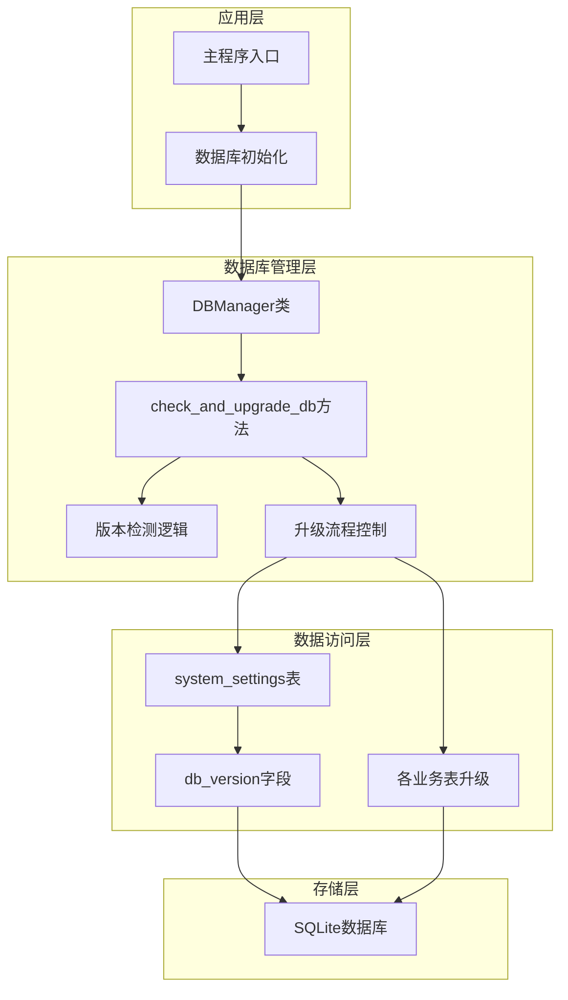
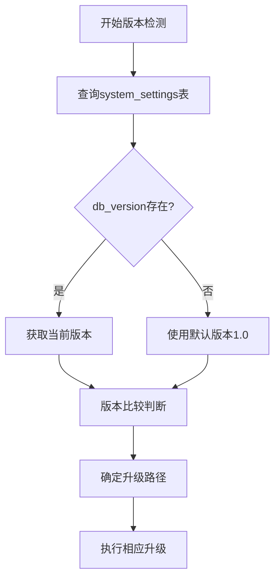
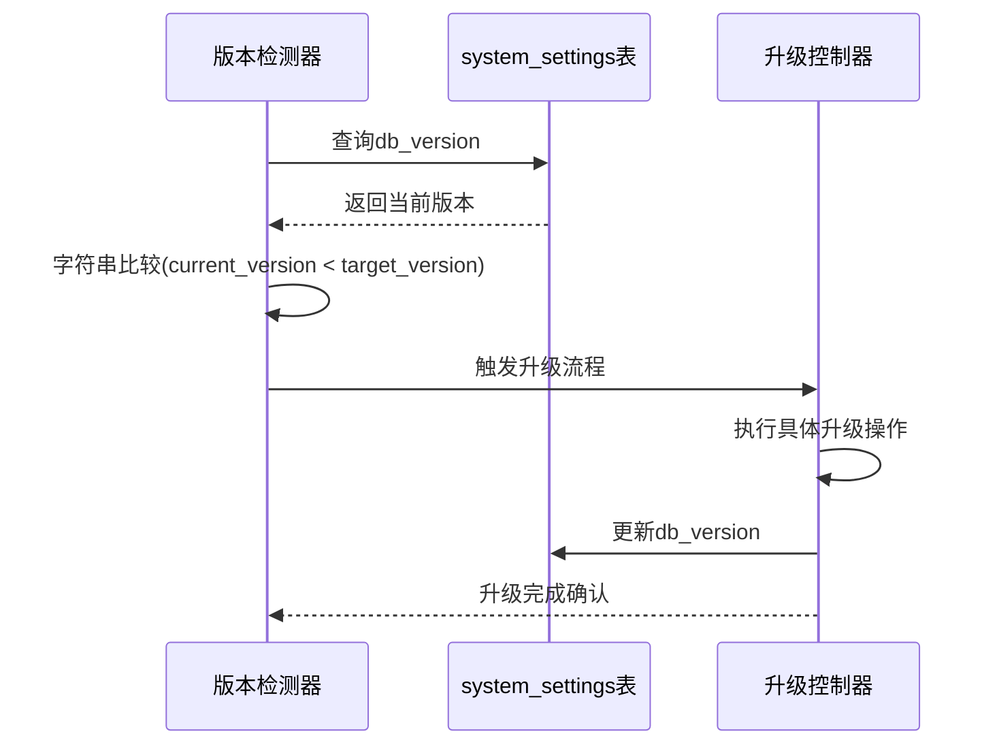
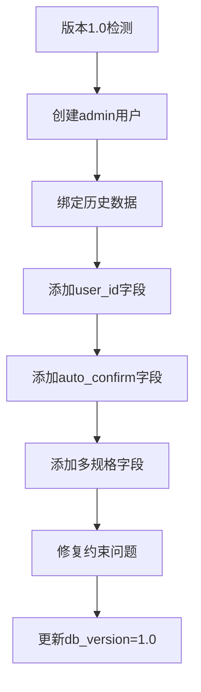
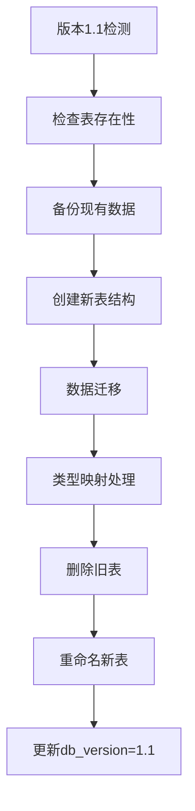
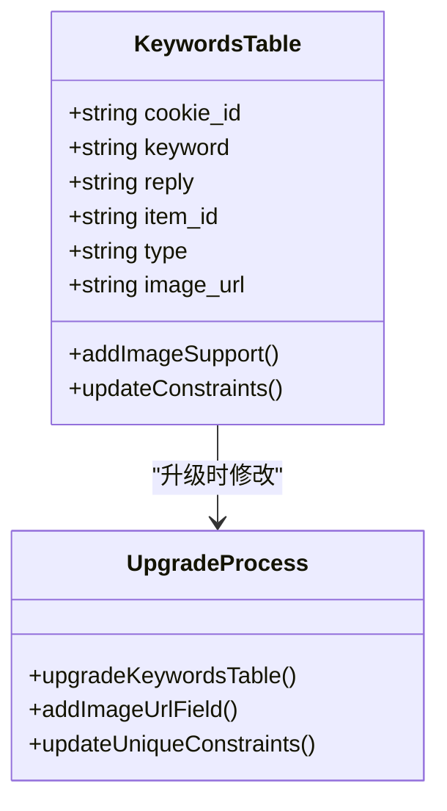
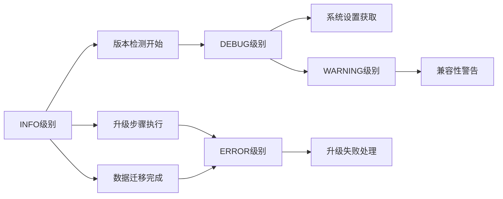
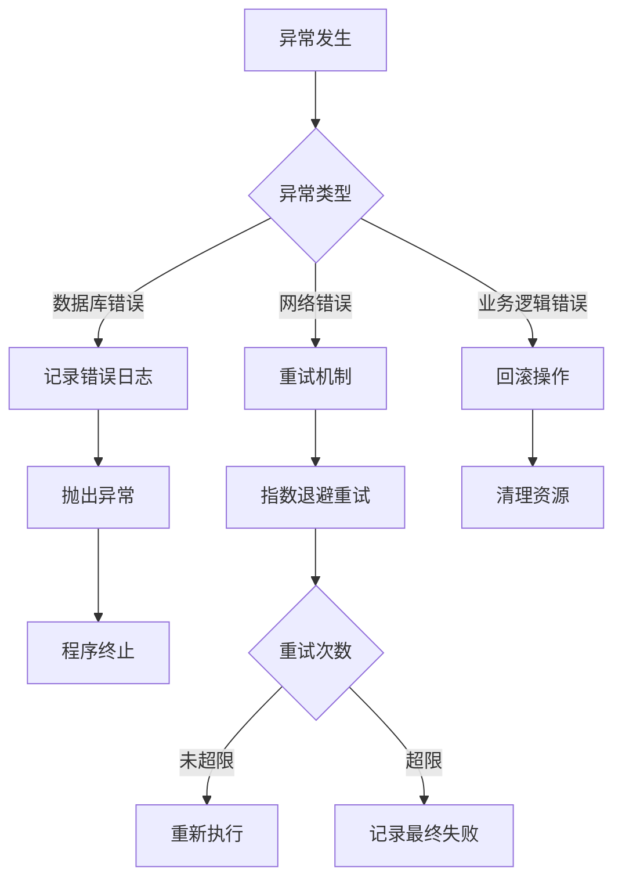
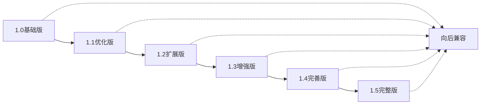
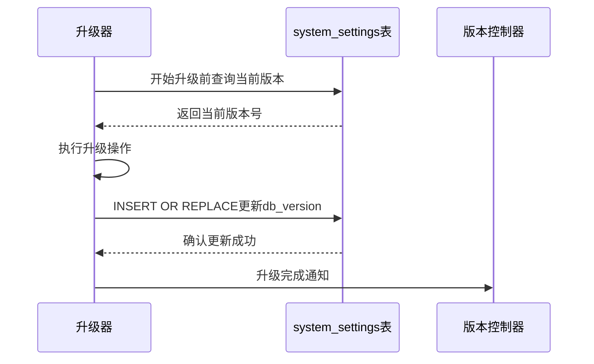

# 数据库版本检测机制

<cite>
**本文档引用的文件**
- [db_manager.py](file://db_manager.py)
- [config.py](file://config.py)
</cite>

## 目录
1. [简介](#简介)
2. [系统架构概览](#系统架构概览)
3. [核心组件分析](#核心组件分析)
4. [版本检测机制详解](#版本检测机制详解)
5. [升级流程分析](#升级流程分析)
6. [日志记录与异常处理](#日志记录与异常处理)
7. [版本控制策略](#版本控制策略)
8. [性能考虑](#性能考虑)
9. [故障排除指南](#故障排除指南)
10. [总结](#总结)

## 简介

db_manager.py中的`check_and_upgrade_db()`方法是整个系统数据库版本管理的核心组件，负责通过system_settings表中的db_version字段判断当前数据库版本，并按照版本号顺序执行从1.0到1.5的逐步升级流程。该方法确保了数据库结构演进的一致性和安全性，为系统的持续发展提供了可靠的版本控制机制。

## 系统架构概览

系统采用分层架构设计，数据库管理层负责维护数据持久化和版本控制：

**图表来源**
- [db_manager.py](file://db_manager.py#L16-L50)
- [db_manager.py](file://db_manager.py#L557-L608)

## 核心组件分析

### DBManager类

DBManager类是数据库管理的核心控制器，负责：
- 数据库连接管理
- 表结构初始化
- 版本检测与升级
- 系统设置管理

### system_settings表

system_settings表是版本控制的核心存储机制，包含以下关键字段：

| 字段名 | 类型 | 描述 |
|--------|------|------|
| key | TEXT | 设置键名，主键 |
| value | TEXT | 设置值 |
| description | TEXT | 设置描述 |
| updated_at | TIMESTAMP | 更新时间戳 |

**节来源**
- [db_manager.py](file://db_manager.py#L368-L376)

## 版本检测机制详解

### 版本获取逻辑

版本检测的核心逻辑位于第560-561行：

**图表来源**
- [db_manager.py](file://db_manager.py#L560-L562)

### 版本比较算法

版本比较采用字符串比较方式，确保语义版本控制的正确性：

**图表来源**
- [db_manager.py](file://db_manager.py#L570-L604)

**节来源**
- [db_manager.py](file://db_manager.py#L557-L608)

## 升级流程分析

### 1.0版本升级 - 基础功能完善

当检测到版本为1.0时，执行基础功能完善升级：

**图表来源**
- [db_manager.py](file://db_manager.py#L564-L568)

### 1.1版本升级 - 通知渠道优化

升级notification_channels表，优化表结构：

**图表来源**
- [db_manager.py](file://db_manager.py#L571-L575)

### 1.2/1.4版本升级 - 通知渠道类型扩展

支持更多通知渠道类型，包括：
- 钉钉通知 (dingtalk)
- 飞书通知 (feishu/lark)
- Bark通知 (bark)
- 邮件通知 (email)
- Webhook通知 (webhook)
- 微信通知 (wechat)
- Telegram通知 (telegram)

### 1.3版本升级 - 图片支持增强

为keywords表添加图片URL字段，支持图片回复功能：

**图表来源**
- [db_manager.py](file://db_manager.py#L585-L589)

### 1.5版本升级 - 账号登录功能

为cookies表添加账号登录相关字段：

| 字段名 | 类型 | 默认值 | 描述 |
|--------|------|--------|------|
| username | TEXT | '' | 用于密码登录的用户名 |
| password | TEXT | '' | 用于密码登录的密码 |
| show_browser | INTEGER | 0 | 登录时是否显示浏览器 |

**节来源**
- [db_manager.py](file://db_manager.py#L599-L604)

## 日志记录与异常处理

### 日志记录策略

系统采用分级日志记录策略：

### 异常处理机制

异常处理遵循以下原则：

**节来源**
- [db_manager.py](file://db_manager.py#L609-L611)

## 版本控制策略

### 渐进式升级策略

系统采用渐进式升级策略，确保每个版本的稳定性：

### 版本状态持久化

每次升级完成后，系统都会更新db_version设置：

**图表来源**
- [db_manager.py](file://db_manager.py#L567-L568)
- [db_manager.py](file://db_manager.py#L575-L576)

### 数据一致性保障

系统通过以下机制保障数据一致性：

1. **事务控制**：每个升级步骤都在独立事务中执行
2. **回滚机制**：升级失败时自动回滚所有更改
3. **完整性检查**：升级前后进行数据完整性验证
4. **备份策略**：关键升级前创建数据备份

**节来源**
- [db_manager.py](file://db_manager.py#L2389-L2404)

## 性能考虑

### 升级性能优化

系统在升级过程中采用了多种性能优化策略：

1. **批量操作**：大量数据迁移采用批量处理
2. **索引优化**：升级过程中智能管理索引创建和删除
3. **内存管理**：大数据量处理时的内存使用优化
4. **并发控制**：使用线程锁防止并发升级冲突

### 版本检测性能

版本检测采用高效查询策略：
- 直接查询system_settings表的db_version字段
- 使用主键索引快速定位
- 缓存查询结果减少重复查询

## 故障排除指南

### 常见问题及解决方案

| 问题类型 | 症状 | 解决方案 |
|----------|------|----------|
| 版本检测失败 | 无法识别当前版本 | 检查system_settings表结构，确保db_version字段存在 |
| 升级中断 | 部分升级未完成 | 查看错误日志，手动执行剩余升级步骤 |
| 数据丢失 | 升级后数据异常 | 检查备份文件，恢复到升级前状态 |
| 性能问题 | 升级过程缓慢 | 优化数据库连接参数，增加硬件资源 |

### 调试技巧

1. **启用详细日志**：设置SQL_LOG_ENABLED=true获取详细执行日志
2. **版本追踪**：定期备份system_settings表内容
3. **增量测试**：对单个升级步骤进行单元测试
4. **监控指标**：监控升级过程中的资源使用情况

**节来源**
- [db_manager.py](file://db_manager.py#L55-L62)

## 总结

db_manager.py中的`check_and_upgrade_db()`方法构建了一个完整而可靠的数据库版本控制系统。该系统通过以下特性确保了数据库结构演进的安全性和一致性：

1. **精确的版本检测**：基于system_settings表的db_version字段进行版本识别
2. **渐进式升级流程**：从1.0到1.5的有序升级路径
3. **完善的异常处理**：多层次的错误处理和恢复机制
4. **数据安全保障**：事务控制和回滚机制
5. **性能优化策略**：高效的查询和批量处理

这种设计不仅保证了系统的稳定运行，还为未来的功能扩展提供了坚实的基础。通过版本控制机制，开发者可以放心地添加新功能，而不必担心破坏现有数据结构或影响系统稳定性。