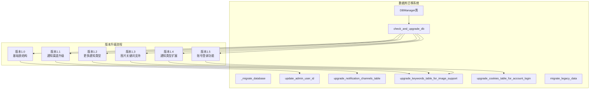
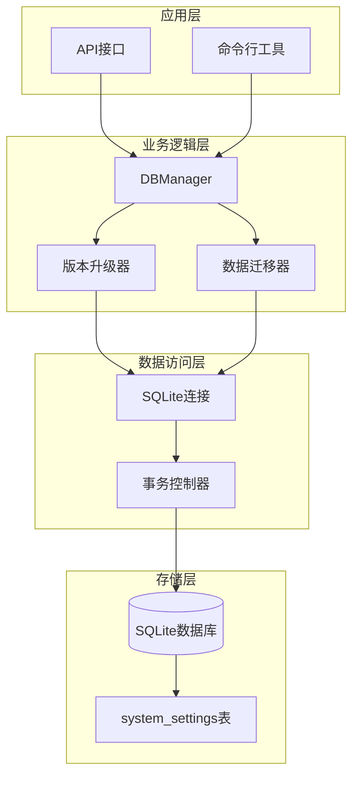
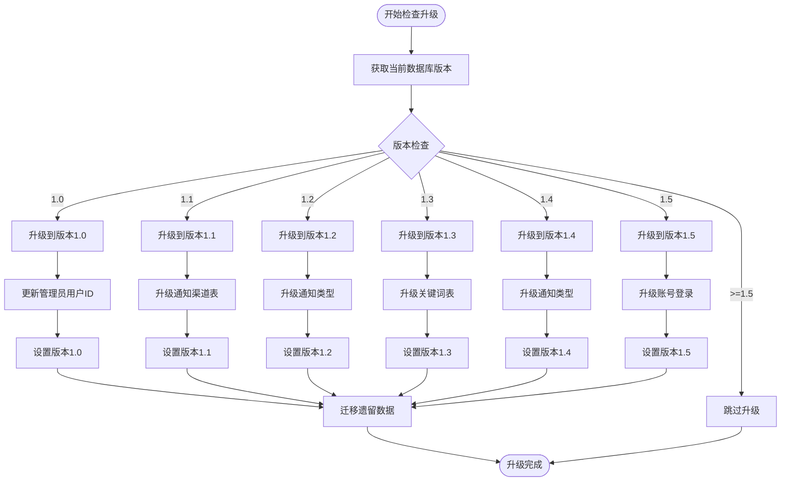
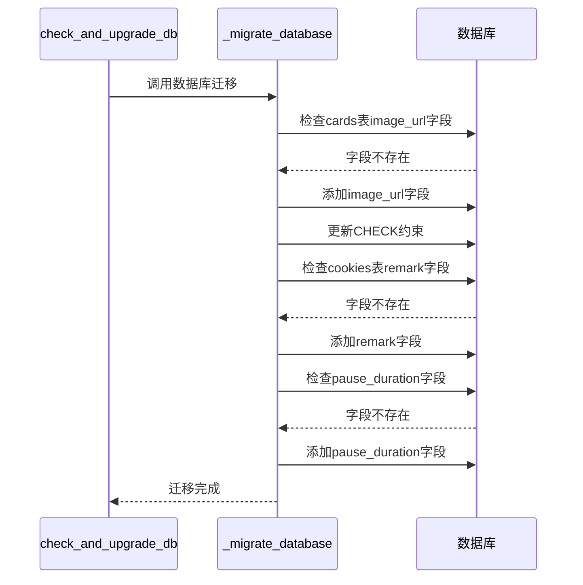
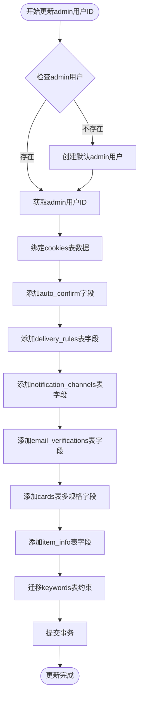
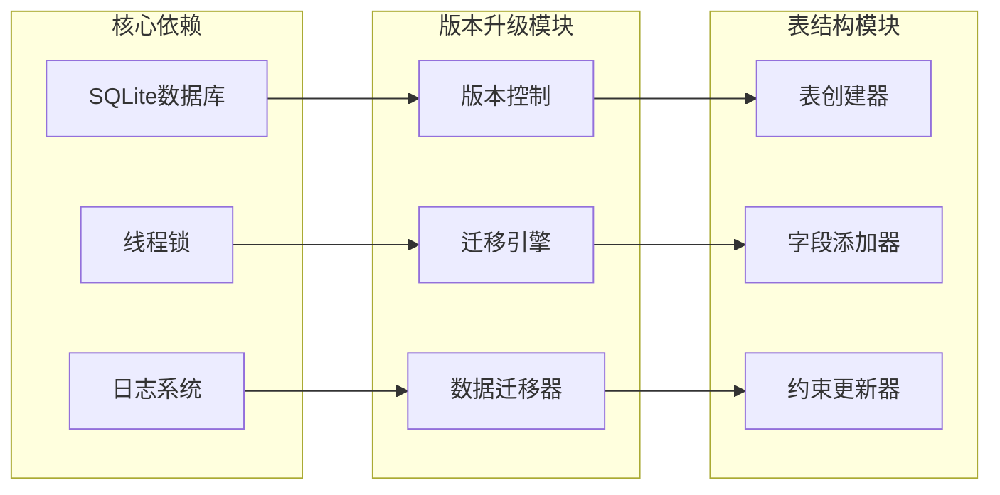

# 数据库迁移与版本升级

<cite>
**本文档引用的文件**
- [db_manager.py](file://db_manager.py)
</cite>

## 目录
1. [简介](#简介)
2. [项目结构概览](#项目结构概览)
3. [核心组件分析](#核心组件分析)
4. [架构概览](#架构概览)
5. [详细组件分析](#详细组件分析)
6. [依赖关系分析](#依赖关系分析)
7. [性能考虑](#性能考虑)
8. [故障排除指南](#故障排除指南)
9. [结论](#结论)

## 简介

本文档深入分析了`db_manager.py`文件中的数据库迁移机制，详细解释了如何通过版本控制系统实现数据库结构的平滑升级。该系统采用渐进式升级策略，支持从版本1.0到1.5的逐步升级，确保数据完整性的同时提供向后兼容性。

## 项目结构概览

数据库迁移系统位于`db_manager.py`文件中，采用面向对象的设计模式，通过`DBManager`类封装所有的数据库操作和迁移逻辑。系统支持多种升级场景，包括表结构变更、字段添加、约束更新和数据迁移。

**图表来源**
- [db_manager.py](file://db_manager.py#L556-L610)
- [db_manager.py](file://db_manager.py#L453-L485)

## 核心组件分析

### DBManager类设计

`DBManager`类是整个数据库迁移系统的核心，负责管理数据库连接、表结构初始化和版本升级。该类采用单例模式，确保数据库连接的一致性和线程安全性。

**章节来源**
- [db_manager.py](file://db_manager.py#L16-L66)

### 版本控制系统

系统通过`system_settings`表维护数据库版本信息，每次升级都会更新版本号，确保升级过程的幂等性。

**章节来源**
- [db_manager.py](file://db_manager.py#L2376-L2403)

## 架构概览

数据库迁移系统采用分层架构设计，包含以下核心层次：

**图表来源**
- [db_manager.py](file://db_manager.py#L16-L66)
- [db_manager.py](file://db_manager.py#L2376-L2403)

## 详细组件分析

### check_and_upgrade_db() 方法

这是数据库版本检查和升级的核心方法，实现了从当前版本到目标版本的完整升级流程。

**图表来源**
- [db_manager.py](file://db_manager.py#L556-L610)

**章节来源**
- [db_manager.py](file://db_manager.py#L556-L610)

### _migrate_database() 方法

该方法负责执行具体的数据库迁移操作，主要处理表结构的小幅调整和字段添加。

**图表来源**
- [db_manager.py](file://db_manager.py#L453-L485)

**章节来源**
- [db_manager.py](file://db_manager.py#L453-L485)

### update_admin_user_id() 方法

该方法在初始化时为历史数据绑定admin用户ID，确保所有现有数据都有明确的所有者。

**图表来源**
- [db_manager.py](file://db_manager.py#L612-L724)

**章节来源**
- [db_manager.py](file://db_manager.py#L612-L724)

### upgrade_notification_channels_table() 方法

该方法处理通知渠道表的升级，支持从有限的通知类型扩展到完整的支持集。

**章节来源**
- [db_manager.py](file://db_manager.py#L726-L816)

### upgrade_keywords_table_for_image_support() 方法

该方法为关键词表添加图片支持功能，包括type和image_url字段。

**章节来源**
- [db_manager.py](file://db_manager.py#L4608-L4633)

### upgrade_cookies_table_for_account_login() 方法

该方法为cookies表添加账号登录相关字段，支持用户名密码登录功能。

**章节来源**
- [db_manager.py](file://db_manager.py#L918-L957)

### migrate_legacy_data() 方法

该方法处理遗留数据的迁移，确保旧版本的数据能够平滑迁移到新版本。

**章节来源**
- [db_manager.py](file://db_manager.py#L958-L1018)

## 依赖关系分析

数据库迁移系统具有清晰的依赖关系结构：

**图表来源**
- [db_manager.py](file://db_manager.py#L16-L66)
- [db_manager.py](file://db_manager.py#L556-L610)

**章节来源**
- [db_manager.py](file://db_manager.py#L16-L66)

## 性能考虑

数据库迁移系统在设计时充分考虑了性能优化：

1. **增量升级**：每次只执行必要的升级步骤，避免不必要的操作
2. **事务保护**：所有升级操作都在事务中执行，确保数据一致性
3. **索引优化**：在迁移过程中合理使用索引，提高查询性能
4. **内存管理**：对于大数据量的表，采用分批处理策略

## 故障排除指南

### 常见问题及解决方案

1. **版本检查失败**
   - 检查`system_settings`表是否存在
   - 验证数据库连接权限

2. **迁移操作超时**
   - 增加数据库连接超时时间
   - 考虑对大表进行分批处理

3. **数据完整性问题**
   - 在升级前创建数据库备份
   - 使用事务确保原子性操作

**章节来源**
- [db_manager.py](file://db_manager.py#L556-L610)
- [db_manager.py](file://db_manager.py#L453-L485)

## 结论

该数据库迁移系统展现了优秀的软件工程实践，通过以下特点实现了可靠的数据库版本管理：

1. **渐进式升级**：支持从1.0到1.5的平滑升级
2. **向后兼容**：确保新版本能够处理旧版本的数据
3. **数据安全**：通过事务和备份机制保障数据完整性
4. **可维护性**：模块化的升级逻辑便于扩展和维护

该系统为类似项目的数据库迁移提供了良好的参考范例，特别是在处理复杂表结构变更和数据迁移方面展现了出色的架构设计。