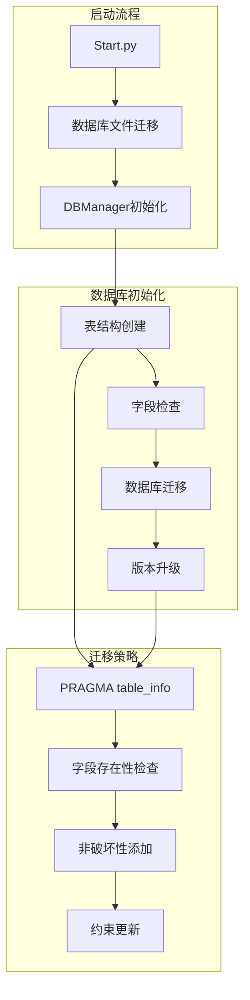
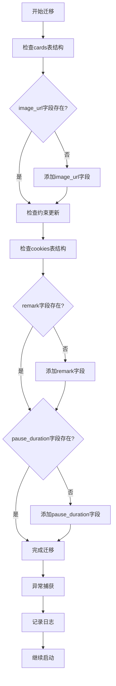
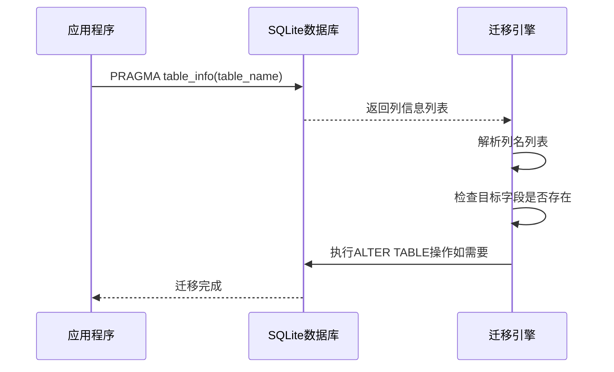
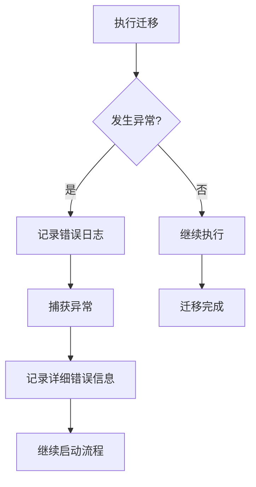
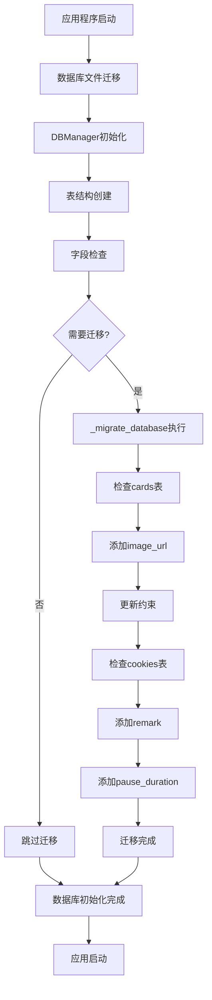

# 数据库迁移策略与实现

<cite>
**本文档引用的文件**
- [db_manager.py](file://db_manager.py)
- [Start.py](file://Start.py)
</cite>

## 目录
1. [概述](#概述)
2. [项目架构](#项目架构)
3. [数据库迁移策略](#数据库迁移策略)
4. [核心迁移方法分析](#核心迁移方法分析)
5. [表结构检查机制](#表结构检查机制)
6. [具体迁移实现](#具体迁移实现)
7. [异常处理与容错机制](#异常处理与容错机制)
8. [迁移流程图](#迁移流程图)
9. [最佳实践与建议](#最佳实践与建议)

## 概述

本文档详细分析了`db_manager.py`中`_migrate_database()`方法所采用的数据库迁移策略。该策略通过PRAGMA table_info()检查现有表结构，实现了对cards表和cookies表的非破坏性字段添加操作，确保系统升级过程中的数据完整性和平滑过渡。

## 项目架构

系统采用SQLite数据库作为主要数据存储方案，通过DBManager类统一管理数据库连接和操作。数据库初始化和迁移过程分为多个阶段：



**图表来源**
- [Start.py](file://Start.py#L62-L144)
- [db_manager.py](file://db_manager.py#L16-L447)

## 数据库迁移策略

### 核心设计理念

数据库迁移策略遵循以下核心原则：

1. **向后兼容性**：确保新版本能够处理旧版本的数据
2. **非破坏性操作**：避免删除或修改现有数据
3. **渐进式升级**：分步骤执行迁移，降低风险
4. **异常容错**：迁移失败不影响系统正常启动

### 迁移触发时机

数据库迁移在以下情况下触发：
- 应用程序启动时的初始化阶段
- 表结构发生变化时
- 数据库版本升级时

**章节来源**
- [db_manager.py](file://db_manager.py#L443-L447)

## 核心迁移方法分析

### _migrate_database()方法架构

`_migrate_database()`方法是数据库迁移的核心入口，采用分步检查和添加的策略：



**图表来源**
- [db_manager.py](file://db_manager.py#L453-L486)

### 迁移执行流程

迁移过程严格按照以下顺序执行：

1. **cards表迁移**：首先检查并添加image_url字段
2. **约束更新**：检查并更新cards表的CHECK约束
3. **cookies表迁移**：依次检查并添加remark和pause_duration字段

**章节来源**
- [db_manager.py](file://db_manager.py#L453-L486)

## 表结构检查机制

### PRAGMA table_info()使用

系统通过SQLite的PRAGMA table_info()函数获取表的详细结构信息：



**图表来源**
- [db_manager.py](file://db_manager.py#L456-L481)

### 字段存在性检查算法

系统采用以下算法检查字段是否存在：

1. **执行PRAGMA查询**：获取表的所有列信息
2. **提取列名列表**：从查询结果中提取列名
3. **存在性判断**：检查目标字段是否在列名列表中
4. **条件执行**：根据检查结果决定是否执行添加操作

**章节来源**
- [db_manager.py](file://db_manager.py#L456-L481)

## 具体迁移实现

### cards表迁移

#### image_url字段添加

cards表的image_url字段添加过程：

```mermaid
flowchart LR
A[PRAGMA table_info(cards)] --> B[获取列名列表]
B --> C{检查image_url字段}
C --> |不存在| D[ALTER TABLE ADD COLUMN]
C --> |存在| E[跳过]
D --> F[记录迁移日志]
E --> F
F --> G[完成]
```

**图表来源**
- [db_manager.py](file://db_manager.py#L456-L463)

#### 约束更新机制

当检测到旧的CHECK约束时，系统采用重建表的方式更新约束：

1. **约束测试**：尝试插入测试记录验证约束
2. **约束检测**：识别约束失败的情况
3. **表重建**：创建新表并复制数据
4. **原子切换**：确保迁移过程的原子性

**章节来源**
- [db_manager.py](file://db_manager.py#L488-L555)

### cookies表迁移

#### remark字段添加

cookies表的remark字段添加包含以下特性：

- **默认值设置**：默认为空字符串
- **非空约束**：确保字段始终有值
- **索引优化**：为提高查询性能创建索引

#### pause_duration字段添加

pause_duration字段添加的特点：

- **整数类型**：存储暂停时间（秒）
- **默认值**：默认值为10秒
- **业务用途**：控制自动回复的间隔时间

**章节来源**
- [db_manager.py](file://db_manager.py#L468-L481)

## 异常处理与容错机制

### 迁移失败处理策略

系统采用"迁移失败不影响启动"的设计原则：



**图表来源**
- [db_manager.py](file://db_manager.py#L483-L486)

### 日志记录机制

迁移过程中的日志记录包括：

1. **成功日志**：记录每个迁移步骤的成功状态
2. **错误日志**：记录迁移失败的详细信息
3. **调试日志**：提供详细的执行过程信息

**章节来源**
- [db_manager.py](file://db_manager.py#L483-L486)

## 迁移流程图

### 完整迁移流程



**图表来源**
- [Start.py](file://Start.py#L140-L144)
- [db_manager.py](file://db_manager.py#L443-L447)

## 最佳实践与建议

### 迁移设计原则

1. **最小化影响**：每次迁移只修改必要的字段
2. **数据完整性**：确保迁移过程中数据不丢失
3. **性能考虑**：避免大规模数据迁移影响性能
4. **监控告警**：建立迁移状态监控机制

### 开发建议

1. **版本控制**：为每次数据库变更建立版本标记
2. **测试验证**：在生产环境部署前充分测试
3. **回滚准备**：准备迁移失败的回滚方案
4. **文档维护**：及时更新数据库迁移文档

### 运维建议

1. **定期检查**：定期检查数据库迁移状态
2. **日志分析**：分析迁移日志发现潜在问题
3. **容量规划**：评估迁移对数据库容量的影响
4. **备份策略**：在迁移前做好数据备份

**章节来源**
- [db_manager.py](file://db_manager.py#L453-L486)