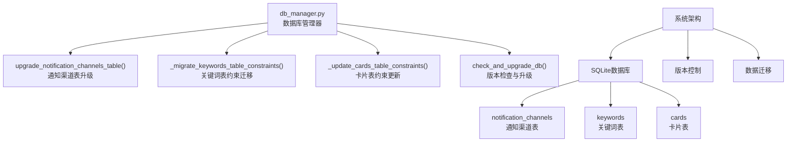
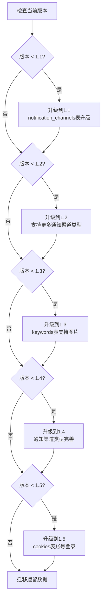
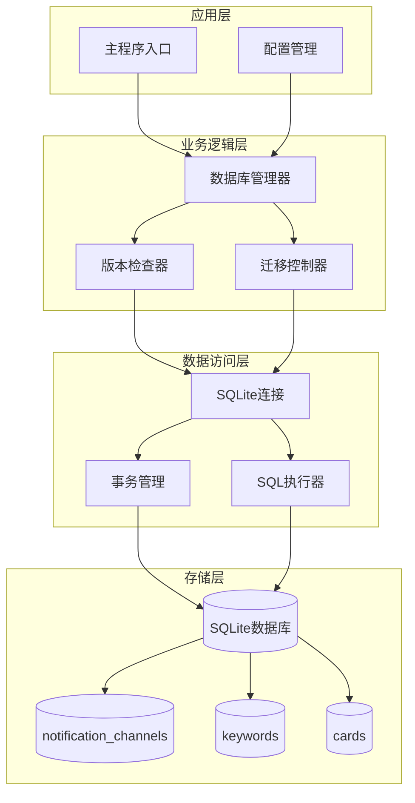
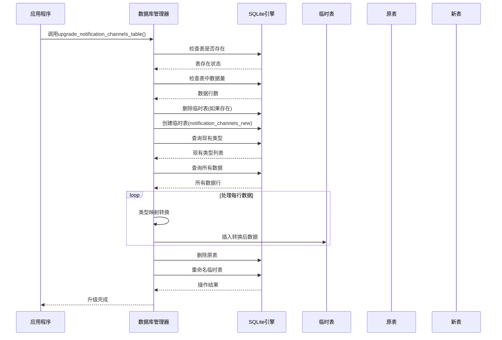
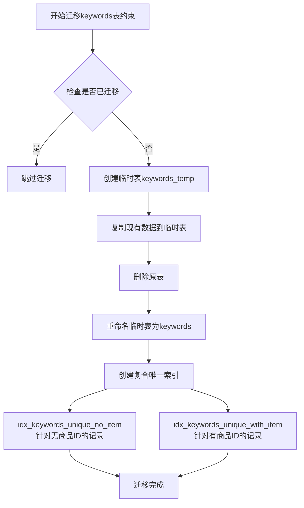
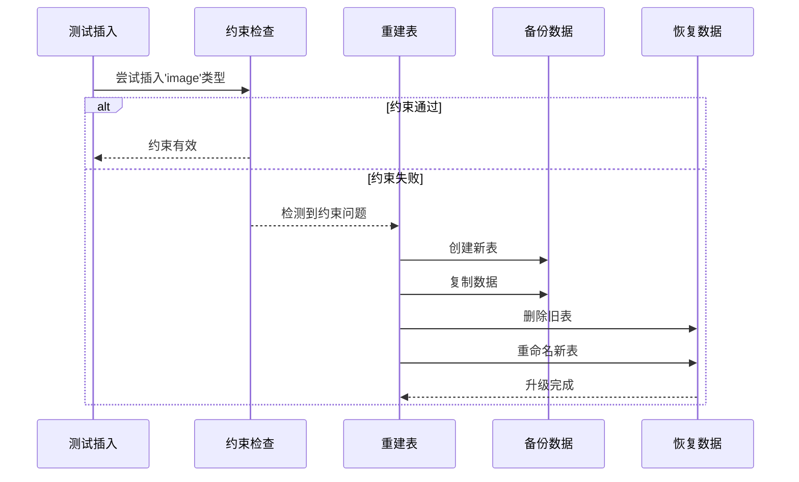
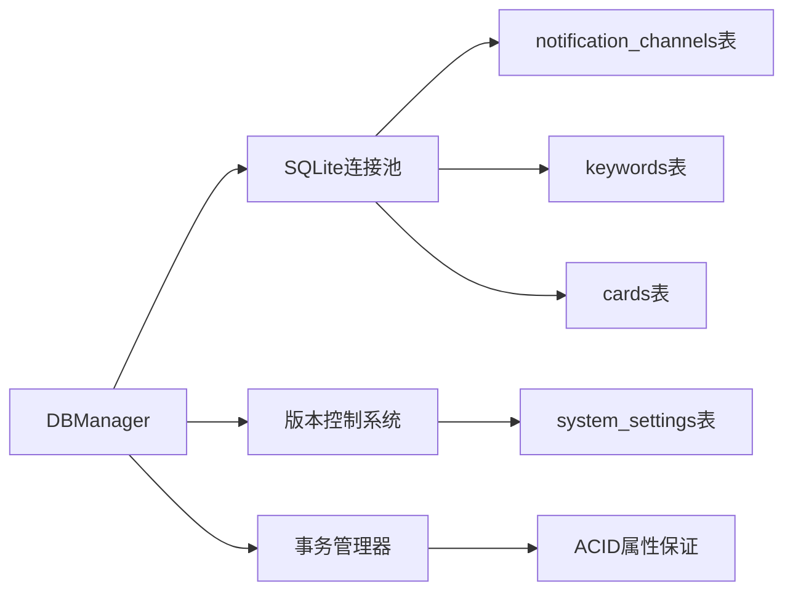

# 数据表结构升级机制

<cite>
**本文档引用的文件**
- [db_manager.py](file://db_manager.py)
</cite>

## 目录
1. [简介](#简介)
2. [项目结构概述](#项目结构概述)
3. [核心组件分析](#核心组件分析)
4. [架构概览](#架构概览)
5. [详细组件分析](#详细组件分析)
6. [依赖关系分析](#依赖关系分析)
7. [性能考虑](#性能考虑)
8. [故障排除指南](#故障排除指南)
9. [结论](#结论)

## 简介

本文档深入分析了Xianyu Auto Reply系统中的数据库表结构升级机制，重点研究了`upgrade_notification_channels_table()`等关键函数的工作原理。该系统采用重建表的方式来实现数据库约束升级，确保数据完整性的同时支持功能扩展。

## 项目结构概述

该项目是一个基于Python的闲鱼自动回复系统，使用SQLite作为数据库。主要文件结构如下：

**图表来源**
- [db_manager.py](file://db_manager.py#L16-L50)

**章节来源**
- [db_manager.py](file://db_manager.py#L1-L100)

## 核心组件分析

### 数据库管理器(DBManager)

数据库管理器是整个系统的核心组件，负责：
- 数据库连接管理
- 版本检查与升级
- 表结构迁移
- 数据完整性保证

### 版本升级机制

系统采用基于版本的升级策略，每个版本对应特定的功能增强：

**图表来源**
- [db_manager.py](file://db_manager.py#L558-L607)

**章节来源**
- [db_manager.py](file://db_manager.py#L558-L607)

## 架构概览

系统采用分层架构设计，确保数据库升级过程的安全性和可靠性：

**图表来源**
- [db_manager.py](file://db_manager.py#L16-L50)

## 详细组件分析

### notification_channels表升级机制

#### 工作原理

`upgrade_notification_channels_table()`函数实现了通知渠道表的CHECK约束升级，采用重建表的方式确保数据完整性：

**图表来源**
- [db_manager.py](file://db_manager.py#L727-L814)

#### 关键特性

1. **类型映射转换**：将`dingtalk`映射为`ding_talk`，确保向后兼容
2. **数据完整性保护**：通过临时表确保升级过程中数据不丢失
3. **错误处理机制**：升级失败时自动回滚，保证数据库一致性

#### 实现细节

升级过程包含以下关键步骤：

| 步骤 | 操作 | 目的 |
|------|------|------|
| 1 | 检查表存在性 | 确认目标表确实存在 |
| 2 | 检查数据量 | 评估迁移工作量 |
| 3 | 删除临时表 | 清理可能存在的残留 |
| 4 | 创建新表 | 定义新的表结构和约束 |
| 5 | 数据迁移 | 复制并转换现有数据 |
| 6 | 删除旧表 | 移除原有表结构 |
| 7 | 重命名表 | 将新表命名为原表名称 |

**章节来源**
- [db_manager.py](file://db_manager.py#L727-L814)

### keywords表唯一约束问题处理

#### 问题背景

SQLite不支持直接修改表约束，因此需要重建表来实现复杂的唯一约束需求。

#### 解决方案

系统采用复合索引的方式实现基于商品ID的唯一性校验：

**图表来源**
- [db_manager.py](file://db_manager.py#L1036-L1094)

#### 约束逻辑

系统实现了两种不同的唯一性约束：

| 条件 | 约束规则 | 索引名称 |
|------|----------|----------|
| item_id为空或空字符串 | (cookie_id, keyword)必须唯一 | idx_keywords_unique_no_item |
| item_id不为空且非空字符串 | (cookie_id, keyword, item_id)必须唯一 | idx_keywords_unique_with_item |

**章节来源**
- [db_manager.py](file://db_manager.py#L1036-L1094)

### cards表CHECK约束升级

#### 技术挑战

SQLite的CHECK约束无法直接修改，需要重建表来支持新的约束条件。

#### 升级流程

**图表来源**
- [db_manager.py](file://db_manager.py#L488-L555)

**章节来源**
- [db_manager.py](file://db_manager.py#L488-L555)

## 依赖关系分析

### 组件耦合度

系统采用低耦合高内聚的设计原则：

**图表来源**
- [db_manager.py](file://db_manager.py#L16-L50)

### 外部依赖

- **SQLite 3.x**: 核心数据库引擎
- **Python 3.7+**: 运行时环境
- **Loguru**: 日志记录框架

**章节来源**
- [db_manager.py](file://db_manager.py#L1-L20)

## 性能考虑

### 升级性能优化

1. **批量操作**: 使用INSERT语句批量插入数据，减少数据库交互次数
2. **索引重建**: 在数据迁移完成后一次性创建复合索引
3. **内存管理**: 对于大数据量表，采用流式处理避免内存溢出

### 数据完整性保障

- **事务隔离**: 每个升级操作都在独立事务中执行
- **原子性**: 升级要么完全成功，要么完全回滚
- **一致性**: 通过约束验证确保数据符合预期格式

## 故障排除指南

### 常见问题及解决方案

#### 1. 升级失败导致数据丢失

**症状**: 升级过程中断，数据无法恢复
**解决方案**: 
- 系统会在升级前自动备份数据
- 使用`migrate_legacy_data()`函数恢复遗留数据
- 检查`system_settings`表中的`db_version`字段

#### 2. 约束冲突错误

**症状**: 插入数据时出现约束违反错误
**解决方案**:
- 检查`keywords`表的复合索引定义
- 验证数据是否符合唯一性约束规则
- 使用`_migrate_keywords_table_constraints()`重新执行约束迁移

#### 3. 类型映射错误

**症状**: 通知渠道类型显示异常
**解决方案**:
- 检查`_normalize_channel_type()`函数的映射规则
- 验证`notification_channels`表的`type`字段值
- 使用`upgrade_notification_channels_types()`重新升级

**章节来源**
- [db_manager.py](file://db_manager.py#L958-L1018)

## 结论

Xianyu Auto Reply系统的数据库升级机制展现了优秀的软件工程实践：

1. **安全性**: 通过重建表的方式确保数据完整性
2. **可维护性**: 分版本的升级策略便于问题追踪和回滚
3. **扩展性**: 支持灵活的功能扩展和约束修改
4. **可靠性**: 完善的错误处理和回滚机制

该机制为类似系统提供了宝贵的参考价值，特别是在处理SQLite这种受限数据库引擎时的创新解决方案。通过合理的架构设计和严格的测试流程，确保了系统升级过程的安全性和稳定性。