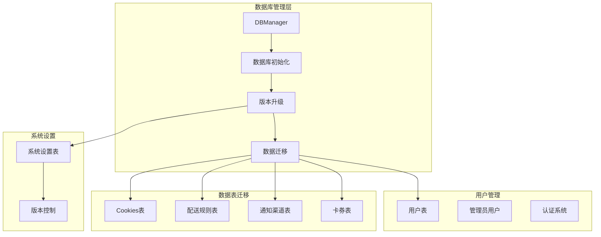
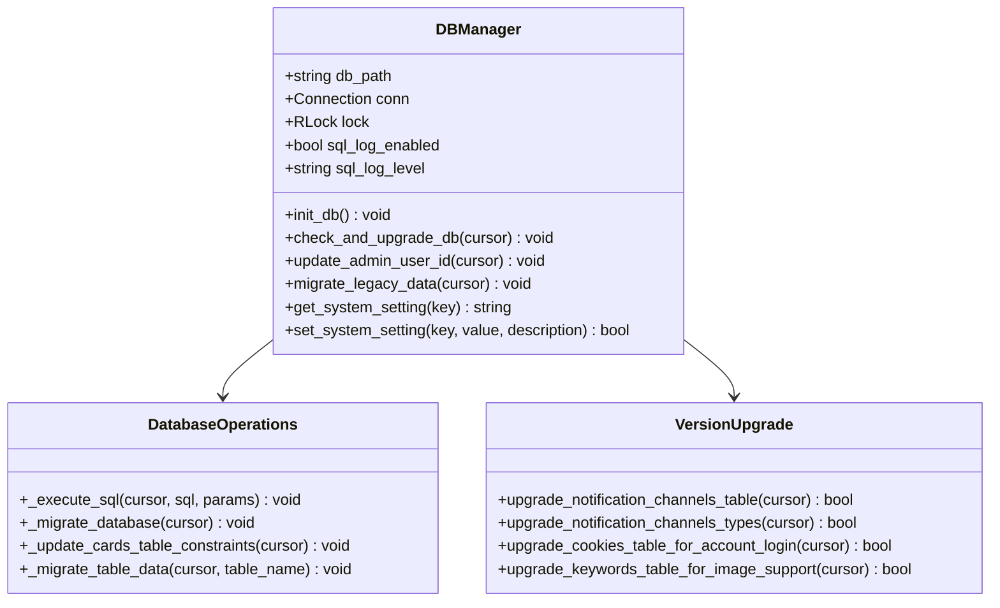
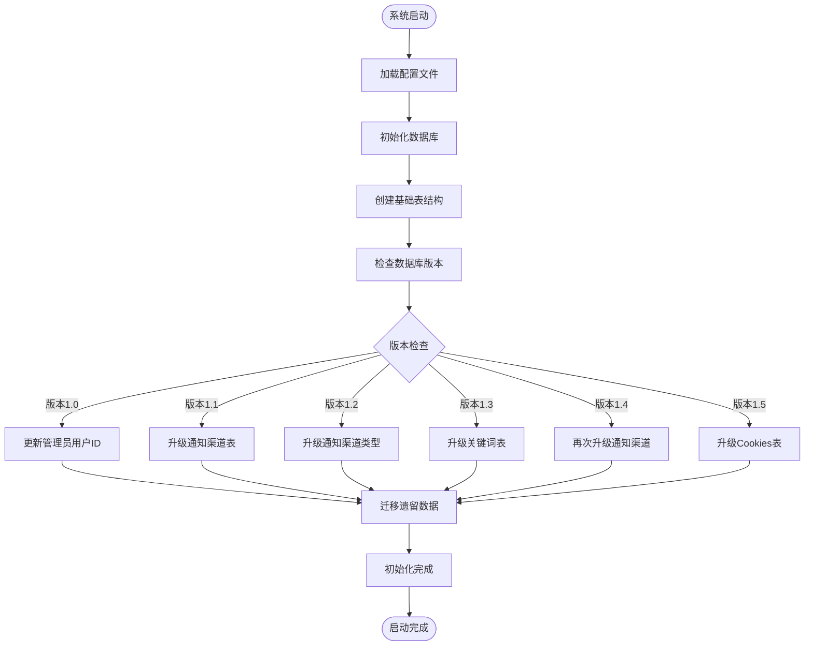
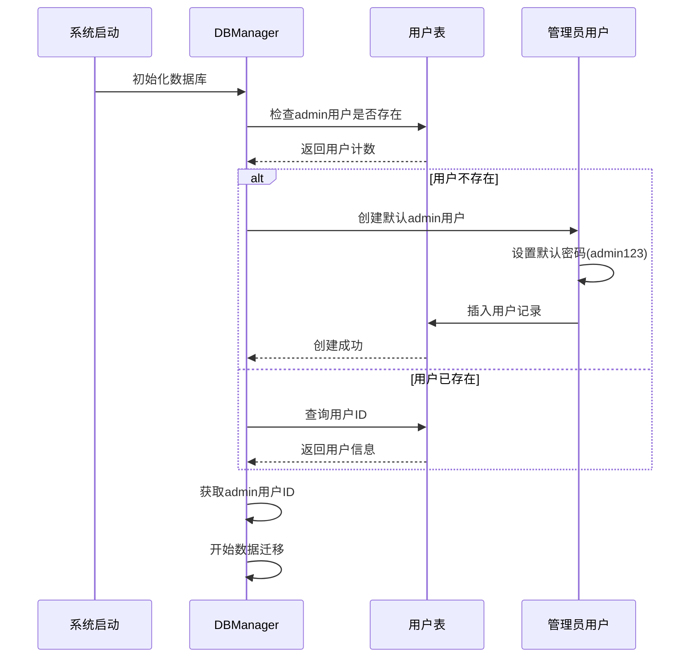
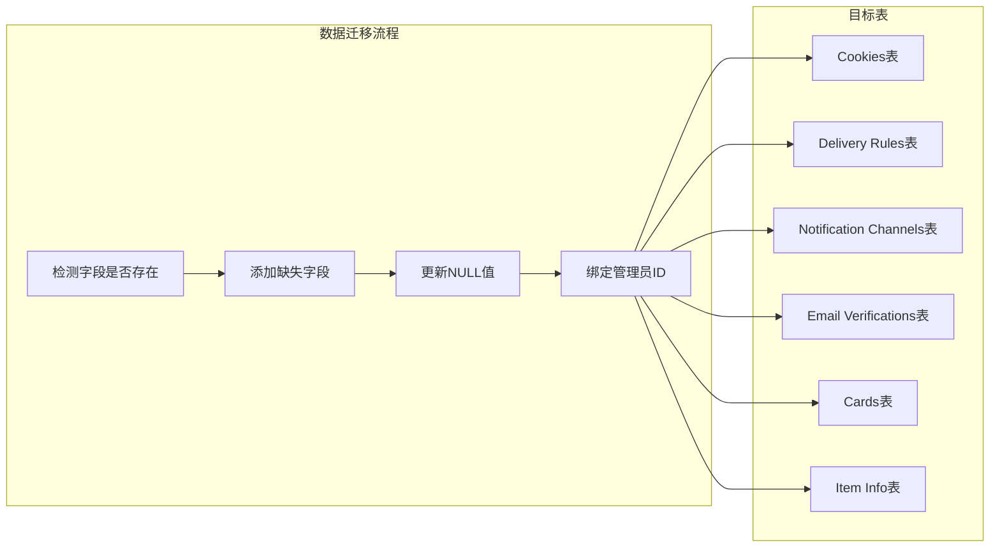
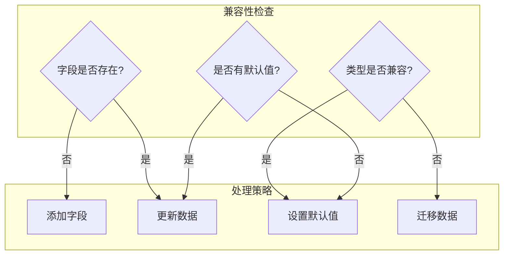
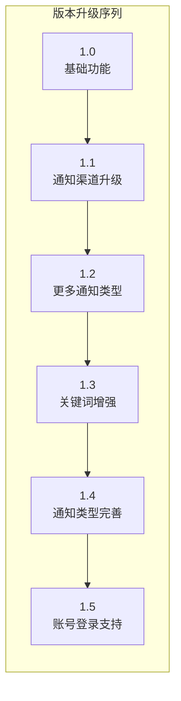

# 管理员用户数据迁移

<cite>
**本文档引用的文件**
- [db_manager.py](file://db_manager.py)
- [reply_server.py](file://reply_server.py)
- [Start.py](file://Start.py)
- [config.py](file://config.py)
</cite>

## 目录
1. [概述](#概述)
2. [项目架构](#项目架构)
3. [核心组件分析](#核心组件分析)
4. [数据库初始化流程](#数据库初始化流程)
5. [管理员用户创建机制](#管理员用户创建机制)
6. [历史数据迁移策略](#历史数据迁移策略)
7. [兼容性处理逻辑](#兼容性处理逻辑)
8. [版本升级管理](#版本升级管理)
9. [故障排除指南](#故障排除指南)
10. [总结](#总结)

## 概述

本文档详细阐述了系统中`update_admin_user_id()`方法在数据库初始化过程中的作用，重点说明其如何处理历史数据迁移、管理员用户创建以及各关键表的字段兼容性处理。该方法是系统数据库版本升级和数据迁移的核心组件，确保系统从旧版本平滑过渡到新版本。

## 项目架构

系统采用模块化的数据库管理架构，主要包含以下核心组件：

**图表来源**
- [db_manager.py](file://db_manager.py#L16-L50)
- [db_manager.py](file://db_manager.py#L440-L608)

## 核心组件分析

### DBManager类架构

DBManager类是整个数据库管理系统的核心，负责：

- 数据库连接管理
- 表结构初始化
- 版本升级协调
- 数据迁移执行

**图表来源**
- [db_manager.py](file://db_manager.py#L16-L50)
- [db_manager.py](file://db_manager.py#L613-L726)

**章节来源**
- [db_manager.py](file://db_manager.py#L16-L50)
- [db_manager.py](file://db_manager.py#L613-L726)

## 数据库初始化流程

系统启动时的数据库初始化遵循严格的版本控制和升级流程：

**图表来源**
- [db_manager.py](file://db_manager.py#L440-L608)
- [db_manager.py](file://db_manager.py#L558-L608)

**章节来源**
- [db_manager.py](file://db_manager.py#L440-L608)

## 管理员用户创建机制

### 用户检测与创建流程

`update_admin_user_id()`方法实现了智能的管理员用户管理机制：

**图表来源**
- [db_manager.py](file://db_manager.py#L617-L628)
- [db_manager.py](file://db_manager.py#L630-L634)

### 默认管理员账户配置

系统采用安全的默认管理员账户配置：

| 属性 | 值 | 说明 |
|------|-----|------|
| 用户名 | admin | 固定用户名，便于识别 |
| 邮箱 | admin@localhost | 本地开发环境专用邮箱 |
| 密码 | admin123 | SHA256哈希后的默认密码 |
| 权限级别 | 管理员 | 最高系统权限 |

**章节来源**
- [db_manager.py](file://db_manager.py#L617-L628)
- [reply_server.py](file://reply_server.py#L43-L44)

## 历史数据迁移策略

### 多表数据绑定机制

系统为多个关键表实施了统一的历史数据迁移策略：

**图表来源**
- [db_manager.py](file://db_manager.py#L636-L678)
- [db_manager.py](file://db_manager.py#L680-L716)

### 具体迁移步骤详解

#### Cookies表迁移

1. **字段检测**：检查`user_id`字段是否存在
2. **字段添加**：如不存在则添加`user_id INTEGER`字段
3. **数据更新**：将所有NULL值更新为admin用户ID
4. **字段扩展**：添加`auto_confirm`字段并设置默认值

#### Delivery Rules表迁移

1. **字段检测**：检查`user_id`字段状态
2. **条件处理**：根据字段存在情况选择添加或更新
3. **数据绑定**：将所有规则绑定到admin用户

#### Notification Channels表迁移

1. **字段检测**：检查`user_id`字段
2. **兼容性处理**：添加字段并更新历史数据
3. **类型映射**：处理通知渠道类型的向后兼容

**章节来源**
- [db_manager.py](file://db_manager.py#L636-L678)
- [db_manager.py](file://db_manager.py#L680-L716)

## 兼容性处理逻辑

### 字段兼容性策略

系统实现了多层次的字段兼容性处理机制：

**图表来源**
- [db_manager.py](file://db_manager.py#L647-L678)
- [db_manager.py](file://db_manager.py#L680-L716)

### 特殊字段处理

#### 多规格字段处理

系统为多个表添加了多规格支持字段：

| 表名 | 新增字段 | 类型 | 默认值 | 用途 |
|------|----------|------|--------|------|
| cards | is_multi_spec | BOOLEAN | FALSE | 是否支持多规格 |
| cards | spec_name | TEXT | - | 规格名称 |
| cards | spec_value | TEXT | - | 规格值 |
| item_info | is_multi_spec | BOOLEAN | FALSE | 商品多规格标识 |
| item_info | multi_quantity_delivery | BOOLEAN | FALSE | 多数量发货支持 |

#### 自动确认字段处理

为cookies表添加了`auto_confirm`字段，支持自动发货确认功能。

**章节来源**
- [db_manager.py](file://db_manager.py#L691-L716)
- [db_manager.py](file://db_manager.py#L647-L656)

## 版本升级管理

### 版本控制机制

系统采用语义化版本控制，每个版本对应特定的功能升级：

**图表来源**
- [db_manager.py](file://db_manager.py#L564-L604)

### 升级执行顺序

每个版本的升级都按照严格的依赖关系执行：

1. **版本检查**：获取当前数据库版本
2. **条件判断**：检查是否需要升级到当前版本
3. **功能升级**：执行特定版本的功能升级
4. **版本标记**：更新系统设置中的版本号

**章节来源**
- [db_manager.py](file://db_manager.py#L558-L604)

## 故障排除指南

### 常见问题及解决方案

#### 管理员用户创建失败

**问题症状**：系统无法创建默认管理员用户

**可能原因**：
- 数据库权限不足
- 用户表结构损坏
- 密码哈希计算错误

**解决方案**：
1. 检查数据库文件权限
2. 验证users表结构完整性
3. 查看详细的错误日志

#### 数据迁移中断

**问题症状**：部分表的数据迁移失败

**可能原因**：
- 数据库连接超时
- 字段约束冲突
- 磁盘空间不足

**解决方案**：
1. 检查数据库连接状态
2. 验证字段约束定义
3. 清理磁盘空间

#### 版本升级失败

**问题症状**：数据库版本升级过程中断

**可能原因**：
- 系统设置表访问失败
- 并发升级冲突
- 数据库锁定

**解决方案**：
1. 检查系统设置表状态
2. 确保单一进程执行升级
3. 重启数据库连接

**章节来源**
- [db_manager.py](file://db_manager.py#L723-L726)
- [db_manager.py](file://db_manager.py#L609-L611)

## 总结

`update_admin_user_id()`方法作为系统数据库初始化的核心组件，实现了完整的管理员用户管理和历史数据迁移功能。通过智能的字段检测、兼容性处理和版本控制机制，确保了系统能够从任何旧版本平滑升级到最新版本。

该方法的主要优势包括：

1. **向后兼容性**：支持从任意历史版本升级
2. **数据完整性**：确保所有历史数据都能正确迁移
3. **安全性**：提供默认的安全管理员账户
4. **可维护性**：清晰的版本控制和错误处理机制

通过这套完善的迁移机制，系统能够在不影响现有数据的情况下，逐步引入新功能和改进，为用户提供稳定可靠的自动化服务体验。