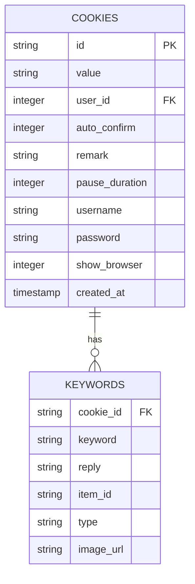
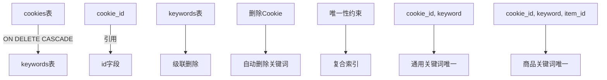
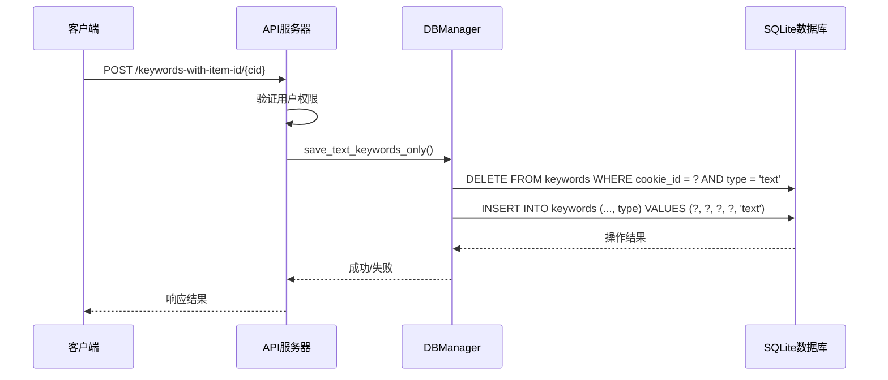
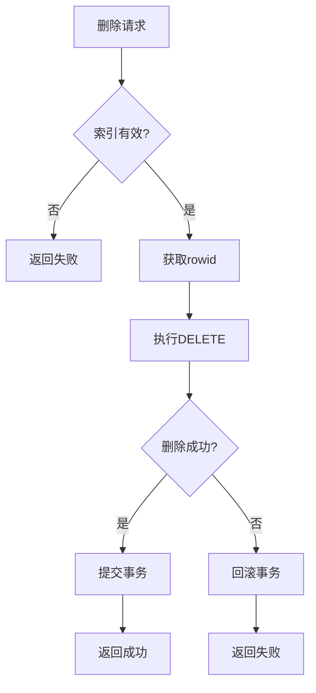
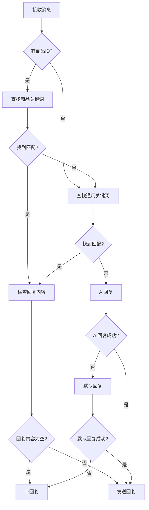
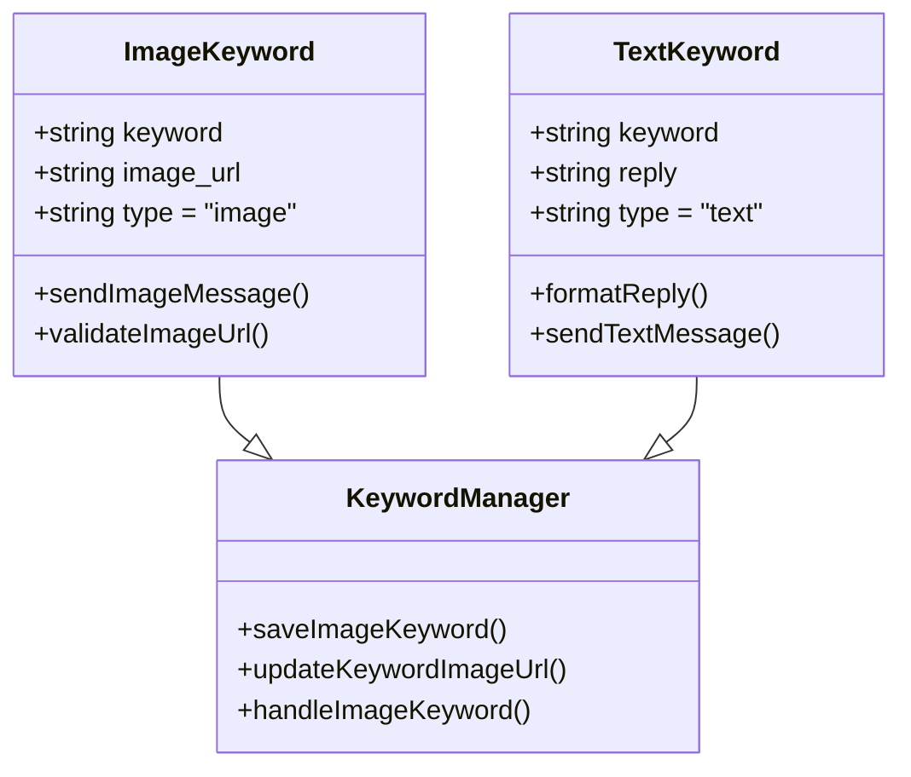
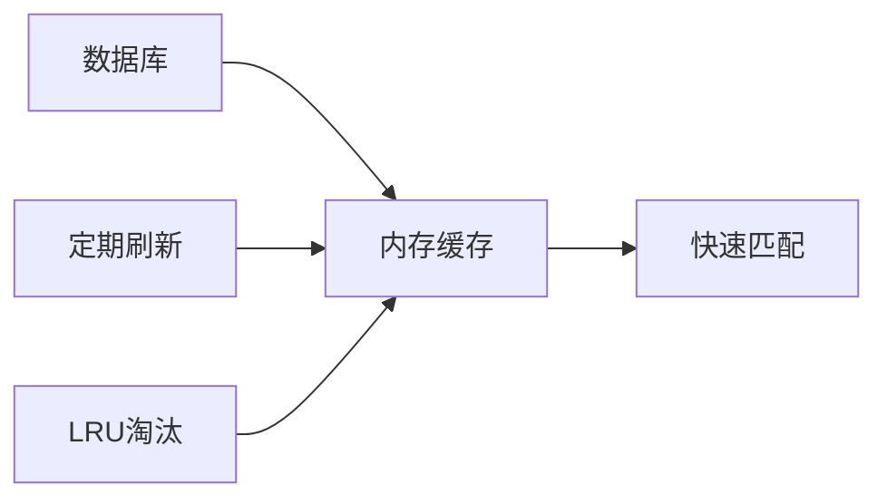

# 关键词回复表 (keywords)

<cite>
**本文档引用的文件**
- [db_manager.py](file://db_manager.py)
- [cookie_manager.py](file://cookie_manager.py)
- [reply_server.py](file://reply_server.py)
- [XianyuAutoAsync.py](file://XianyuAutoAsync.py)
- [ai_reply_engine.py](file://ai_reply_engine.py)
</cite>

## 目录
1. [简介](#简介)
2. [表结构设计](#表结构设计)
3. [字段详细说明](#字段详细说明)
4. [外键关系与约束](#外键关系与约束)
5. [数据操作方法](#数据操作方法)
6. [关键词匹配机制](#关键词匹配机制)
7. [高级功能特性](#高级功能特性)
8. [性能优化考虑](#性能优化考虑)
9. [故障排除指南](#故障排除指南)
10. [总结](#总结)

## 简介

keywords表是智能回复系统的核心组件，负责存储和管理每个Cookie账号的关键词回复规则。该表支持文本和图片两种回复类型，能够根据商品ID进行精确匹配，实现了灵活而强大的自动化回复功能。

## 表结构设计



**图表来源**
- [db_manager.py](file://db_manager.py#L128-L137)

**章节来源**
- [db_manager.py](file://db_manager.py#L128-L137)

## 字段详细说明

### cookie_id字段
- **数据类型**: TEXT
- **约束条件**: 主键的一部分，外键引用cookies表的id字段
- **业务含义**: 标识关键词所属的Cookie账号，实现多账号独立的关键词管理
- **技术特点**: 设置了ON DELETE CASCADE级联删除，当关联的Cookie被删除时，对应的关键词也会自动清除

### keyword字段
- **数据类型**: TEXT
- **约束条件**: 非空，与cookie_id共同构成复合主键的一部分
- **业务含义**: 定义触发自动回复的关键词，支持大小写不敏感匹配
- **技术特点**: 使用LIKE查询进行模糊匹配，支持部分关键词匹配

### reply字段
- **数据类型**: TEXT
- **约束条件**: 可为空，支持变量替换格式
- **业务含义**: 关键词匹配成功时返回的回复内容
- **技术特点**: 支持Python格式化字符串，可以动态替换发送者名称、ID和消息内容

### item_id字段
- **数据类型**: TEXT
- **约束条件**: 可为空，与keyword联合构成唯一性约束
- **业务含义**: 指定特定商品的自动回复，实现商品级别的精确匹配
- **技术特点**: 当值不为空时，关键词只能对该商品有效；为空时为通用关键词

### type字段
- **数据类型**: TEXT
- **约束条件**: 默认值为'text'，CHECK约束限制为'text'或'image'
- **业务含义**: 区分关键词回复类型，支持文本和图片两种回复方式
- **技术特点**: 影响回复处理逻辑，决定是发送文本消息还是图片消息

### image_url字段
- **数据类型**: TEXT
- **约束条件**: 可为空，仅在type为'image'时有意义
- **业务含义**: 存储图片回复的URL地址
- **技术特点**: 当type为'image'时，reply字段通常为空，实际回复内容由image_url指定

**章节来源**
- [db_manager.py](file://db_manager.py#L128-L137)
- [db_manager.py](file://db_manager.py#L1594-L1610)

## 外键关系与约束

### 外键关系设计



**图表来源**
- [db_manager.py](file://db_manager.py#L122-L123)
- [db_manager.py](file://db_manager.py#L136-L137)

### 级联删除机制

keywords表的cookie_id字段设置了ON DELETE CASCADE约束，确保数据一致性：

1. **自动清理**: 当cookies表中的某个Cookie被删除时，所有相关的关键词记录会自动删除
2. **防止孤立数据**: 避免出现指向不存在Cookie的关键词记录
3. **简化维护**: 减少手动清理工作量，提高系统可靠性

### 唯一性约束

keywords表实现了复杂的唯一性约束逻辑：

| 约束类型 | 约束条件 | 业务意义 |
|---------|---------|---------|
| 通用关键词唯一 | `(cookie_id, keyword)` | 同一账号内不能有重复的通用关键词 |
| 商品关键词唯一 | `(cookie_id, keyword, item_id)` | 同一账号内对同一商品不能有重复关键词 |
| 类型区分 | `type='text' OR type='image'` | 确保type字段的有效性 |

**章节来源**
- [db_manager.py](file://db_manager.py#L122-L123)
- [db_manager.py](file://db_manager.py#L136-L137)
- [db_manager.py](file://db_manager.py#L1035-L1095)

## 数据操作方法

### 关键字保存操作



**图表来源**
- [reply_server.py](file://reply_server.py#L3099-L3181)
- [db_manager.py](file://db_manager.py#L1496-L1548)

### 关键字查询操作

系统提供了多种查询方法来满足不同场景需求：

| 方法名 | 功能 | 返回格式 | 使用场景 |
|-------|------|---------|---------|
| `get_keywords` | 获取基础关键词列表 | `List[Tuple[str, str]]` | 向后兼容 |
| `get_keywords_with_item_id` | 获取带商品ID的关键词 | `List[Tuple[str, str, str]]` | 基础关键词管理 |
| `get_keywords_with_type` | 获取带类型信息的关键词 | `List[Dict[str, any]]` | 完整关键词管理 |
| `check_keyword_duplicate` | 检查关键词重复 | `bool` | 关键词验证 |

### 关键字删除操作



**图表来源**
- [db_manager.py](file://db_manager.py#L1666-L1691)

**章节来源**
- [db_manager.py](file://db_manager.py#L1457-L1700)
- [reply_server.py](file://reply_server.py#L3017-L3043)

## 关键词匹配机制

### 匹配优先级流程



**图表来源**
- [XianyuAutoAsync.py](file://XianyuAutoAsync.py#L7117-L7137)

### 匹配算法实现

关键词匹配采用以下算法：

1. **大小写不敏感匹配**: 使用`keyword.lower() in send_message.lower()`进行匹配
2. **优先级处理**: 商品关键词优先于通用关键词
3. **精确度匹配**: 完全匹配优于部分匹配
4. **空回复处理**: 特殊标记"EMPTY_REPLY"表示匹配但不回复

### 变量替换机制

文本关键词支持Python格式化字符串：

```python
# 支持的变量
reply = reply.format(
    send_user_name=send_user_name,      # 发送者名称
    send_user_id=send_user_id,          # 发送者ID
    send_message=send_message           # 发送的消息内容
)
```

**章节来源**
- [XianyuAutoAsync.py](file://XianyuAutoAsync.py#L3174-L3250)
- [XianyuAutoAsync.py](file://XianyuAutoAsync.py#L7117-L7137)

## 高级功能特性

### 图片关键词支持



**图表来源**
- [db_manager.py](file://db_manager.py#L1594-L1610)
- [db_manager.py](file://db_manager.py#L1641-L1665)

### 商品ID精确匹配

商品关键词具有以下特性：

1. **商品专属**: 只对指定商品有效，与其他商品无关
2. **优先级最高**: 在有商品ID的情况下，优先匹配商品关键词
3. **灵活性**: 可以为同一关键词配置多个商品的不同回复

### 类型区分机制

| 类型 | 特点 | 使用场景 | 实现方式 |
|-----|------|---------|---------|
| text | 文本回复 | 通用文字回复、商品介绍 | 直接发送reply内容 |
| image | 图片回复 | 商品图片、促销海报 | 发送image_url指定的图片 |

### 内容过滤机制

系统实现了多层次的内容过滤：

1. **重复检测**: 防止同一关键词重复添加
2. **类型冲突**: 文本关键词不能与图片关键词同名
3. **空内容处理**: 自动跳过空回复内容的关键词

**章节来源**
- [db_manager.py](file://db_manager.py#L1594-L1665)
- [db_manager.py](file://db_manager.py#L1496-L1548)

## 性能优化考虑

### 索引策略

keywords表采用了以下索引策略：

```sql
-- 通用关键词唯一索引
CREATE UNIQUE INDEX idx_keywords_unique_no_item
ON keywords(cookie_id, keyword)
WHERE item_id IS NULL OR item_id = ''

-- 商品关键词唯一索引  
CREATE UNIQUE INDEX idx_keywords_unique_with_item
ON keywords(cookie_id, keyword, item_id)
WHERE item_id IS NOT NULL AND item_id != ''
```

### 查询优化

1. **批量查询**: 使用`IN`语句一次性获取多个关键词
2. **缓存机制**: 在内存中缓存常用关键词，减少数据库访问
3. **延迟加载**: 只在需要时才加载完整的关键词列表

### 内存管理



**图表来源**
- [cookie_manager.py](file://cookie_manager.py#L17-L21)

**章节来源**
- [db_manager.py](file://db_manager.py#L1035-L1095)
- [cookie_manager.py](file://cookie_manager.py#L17-L21)

## 故障排除指南

### 常见问题及解决方案

| 问题类型 | 症状 | 可能原因 | 解决方案 |
|---------|------|---------|---------|
| 关键词重复 | UNIQUE约束冲突 | 同一账号内重复关键词 | 检查关键词唯一性，使用check_keyword_duplicate方法 |
| 图片发送失败 | 图片关键词不生效 | image_url无效或网络问题 | 验证图片URL有效性，检查网络连接 |
| 匹配失败 | 关键词不响应 | 关键词配置错误或匹配算法问题 | 检查关键词配置，验证匹配逻辑 |
| 性能问题 | 响应缓慢 | 关键词数量过多或索引失效 | 优化关键词数量，重建索引 |

### 调试工具

系统提供了调试接口：

```python
@app.get("/debug/keywords-table-info")
def debug_keywords_table_info():
    """检查keywords表结构"""
    # 获取表结构信息
    # 获取数据库版本
    # 验证约束条件
```

### 日志记录

系统记录详细的日志信息：

- **匹配日志**: 记录关键词匹配过程
- **错误日志**: 记录操作失败原因
- **性能日志**: 记录查询耗时

**章节来源**
- [reply_server.py](file://reply_server.py#L3578-L3596)
- [db_manager.py](file://db_manager.py#L1572-L1592)

## 总结

keywords表作为智能回复系统的核心数据结构，具备以下关键特性：

1. **灵活的关键词管理**: 支持文本和图片两种回复类型，能够针对特定商品定制回复
2. **完善的数据一致性**: 通过外键约束和级联删除确保数据完整性
3. **高效的匹配机制**: 实现了优先级匹配和精确度匹配的平衡
4. **强大的扩展能力**: 支持变量替换和内容过滤等高级功能
5. **良好的性能表现**: 通过索引优化和缓存机制保证系统响应速度

该表的设计充分考虑了电商场景下的复杂需求，为自动化回复系统提供了坚实的数据基础。通过合理的架构设计和完善的约束机制，确保了系统的稳定性和可维护性。