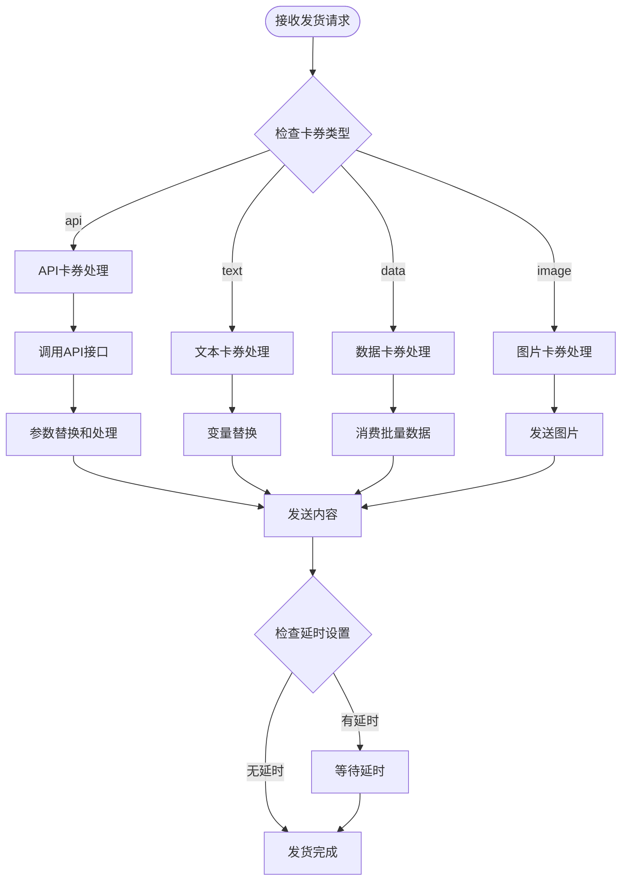
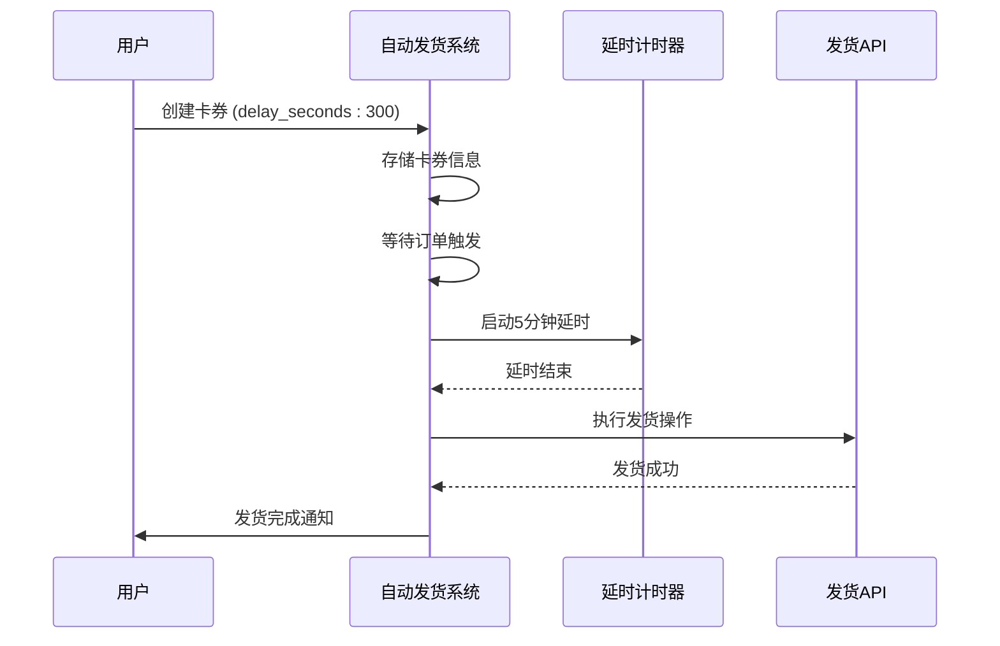
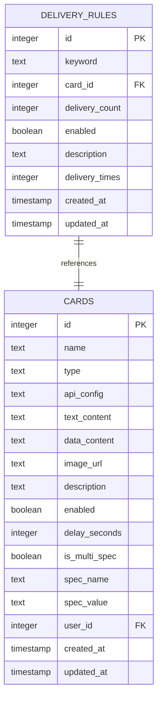

# 卡券表 (cards) 详尽文档

<cite>
**本文档引用的文件**
- [db_manager.py](file://db_manager.py)
- [reply_server.py](file://reply_server.py)
- [XianyuAutoAsync.py](file://XianyuAutoAsync.py)
- [secure_confirm_decrypted.py](file://secure_confirm_decrypted.py)
- [static/js/app.js](file://static/js/app.js)
</cite>

## 目录
1. [简介](#简介)
2. [表结构概述](#表结构概述)
3. [字段详细说明](#字段详细说明)
4. [核心业务功能](#核心业务功能)
5. [自动发货系统集成](#自动发货系统集成)
6. [SQL建表语句](#sql建表语句)
7. [使用示例](#使用示例)
8. [最佳实践](#最佳实践)
9. [故障排除](#故障排除)

## 简介

cards表是自动发货系统的核心数据表，负责存储各种类型的卡券信息，包括API接口卡券、文本卡券、数据卡券和图片卡券。该表支持多规格商品、自动发货延时、用户级数据隔离等高级功能，在整个自动回复系统中占据中心地位。

## 表结构概述


**图表来源**
- [db_manager.py](file://db_manager.py#L196-L216)

## 字段详细说明

### 核心字段

#### id (INTEGER PRIMARY KEY)
- **类型**: 整数
- **约束**: 主键，自增
- **业务含义**: 卡券的唯一标识符，系统自动生成

#### name (TEXT NOT NULL)
- **类型**: 文本
- **约束**: 非空
- **业务含义**: 卡券名称，用于识别和分类卡券
- **示例**: "VIP会员卡", "优惠券", "实物商品"

#### type (TEXT NOT NULL CHECK (type IN ('api', 'text', 'data', 'image')))
- **类型**: 文本
- **约束**: 非空，CHECK约束限制为四个固定值
- **业务含义**: 卡券类型，决定内容处理方式
- **取值说明**:
  - `'api'`: API接口卡券，通过HTTP请求获取内容
  - `'text'`: 文本卡券，直接使用预设的文字内容
  - `'data'`: 数据卡券，从批量数据池中消费数据
  - `'image'`: 图片卡券，发送预设的图片资源

#### api_config (TEXT)
- **类型**: 文本
- **约束**: 可空
- **业务含义**: API卡券的配置信息，JSON格式存储
- **结构示例**: 
  ```json
  {
    "url": "https://api.example.com/get-card",
    "method": "POST",
    "timeout": 10,
    "headers": {"Authorization": "Bearer token"},
    "params": {"user_id": "{BUYER_ID}"}
  }
  ```

#### text_content (TEXT)
- **类型**: 文本
- **约束**: 可空
- **业务含义**: 文本卡券的内容，支持变量替换
- **变量支持**: `{BUYER_ID}`, `{ORDER_ID}`, `{ITEM_ID}` 等动态参数

#### data_content (TEXT)
- **类型**: 文本
- **约束**: 可空
- **业务含义**: 数据卡券的批量数据内容
- **使用场景**: 优惠券序列号、激活码等一次性使用的数据

#### image_url (TEXT)
- **类型**: 文本
- **约束**: 可空
- **业务含义**: 图片卡券的图片URL地址
- **格式要求**: 支持相对路径或绝对URL

#### description (TEXT)
- **类型**: 文本
- **约束**: 可空
- **业务含义**: 卡券描述信息，用于备注和说明
- **变量替换**: 支持 `{DELIVERY_CONTENT}` 变量

### 控制字段

#### enabled (BOOLEAN DEFAULT TRUE)
- **类型**: 布尔值
- **约束**: 默认值为TRUE
- **业务含义**: 卡券启用状态，控制是否参与自动发货
- **影响范围**: 禁用的卡券不会被自动发货系统匹配

#### delay_seconds (INTEGER DEFAULT 0)
- **类型**: 整数
- **约束**: 默认值为0
- **业务含义**: 自动发货延时时间（秒）
- **核心设计**:
  - 实现定时发货功能
  - 支持批量订单的分批处理
  - 避免系统过载和风控检测
- **使用场景**:
  - 电商促销活动的定时发货
  - 避免短时间内大量发货触发风控
  - 与其他卡券配合实现复杂的发货策略

#### is_multi_spec (BOOLEAN DEFAULT FALSE)
- **类型**: 布尔值
- **约束**: 默认值为FALSE
- **业务含义**: 是否为多规格卡券
- **高级功能**:
  - 支持同一商品的不同规格
  - 实现精细化的商品管理
  - 适用于服装、电子产品等多规格商品

#### spec_name (TEXT)
- **类型**: 文本
- **约束**: 当is_multi_spec为TRUE时非空
- **业务含义**: 规格名称，如"颜色", "尺寸", "版本"
- **示例**: "颜色", "尺码", "内存"

#### spec_value (TEXT)
- **类型**: 文本
- **约束**: 当is_multi_spec为TRUE时非空
- **业务含义**: 规格值，如"红色", "XL", "8GB"
- **示例**: "红色", "XL", "8GB"

### 关联字段

#### user_id (INTEGER NOT NULL DEFAULT 1)
- **类型**: 整数
- **约束**: 非空，默认值为1
- **业务含义**: 用户ID，实现用户级数据隔离
- **外键关系**: 引用users表的id字段
- **安全特性**: 确保用户只能访问自己的卡券数据
- **默认行为**: 系统初始化时自动绑定到admin用户

#### created_at (TIMESTAMP DEFAULT CURRENT_TIMESTAMP)
- **类型**: 时间戳
- **约束**: 默认值为当前时间
- **业务含义**: 卡券创建时间

#### updated_at (TIMESTAMP DEFAULT CURRENT_TIMESTAMP)
- **类型**: 时间戳
- **约束**: 默认值为当前时间
- **业务含义**: 卡券最后更新时间

**节来源**
- [db_manager.py](file://db_manager.py#L196-L216)

## 核心业务功能

### 卡券类型处理流程



**图表来源**
- [XianyuAutoAsync.py](file://XianyuAutoAsync.py#L4716-L4738)

### 多规格商品支持

多规格卡券功能允许为同一商品创建多个规格变体：


**图表来源**
- [db_manager.py](file://db_manager.py#L2845-L2857)

### 自动发货延时机制

延迟发货功能通过以下机制实现：



**图表来源**
- [XianyuAutoAsync.py](file://XianyuAutoAsync.py#L4640-L4646)

**节来源**
- [XianyuAutoAsync.py](file://XianyuAutoAsync.py#L4716-L4753)

## 自动发货系统集成

### 卡券与发货规则的关系



**图表来源**
- [db_manager.py](file://db_manager.py#L293-L306)

### 关键API接口

#### 创建卡券接口
- **端点**: `POST /cards`
- **功能**: 创建新卡券，支持多规格和各种类型
- **验证**: 用户身份验证和权限检查

#### 获取卡券列表接口
- **端点**: `GET /cards`
- **功能**: 获取当前用户的卡券列表
- **过滤**: 支持按用户ID过滤，实现数据隔离

#### 更新卡券接口
- **端点**: `PUT /cards/{card_id}`
- **功能**: 更新卡券信息，支持增量更新
- **安全性**: 验证卡券归属关系

**节来源**
- [reply_server.py](file://reply_server.py#L3620-L3706)

## SQL建表语句

### 完整建表语句

```sql
CREATE TABLE IF NOT EXISTS cards (
    id INTEGER PRIMARY KEY AUTOINCREMENT,
    name TEXT NOT NULL,
    type TEXT NOT NULL CHECK (type IN ('api', 'text', 'data', 'image')),
    api_config TEXT,
    text_content TEXT,
    data_content TEXT,
    image_url TEXT,
    description TEXT,
    enabled BOOLEAN DEFAULT TRUE,
    delay_seconds INTEGER DEFAULT 0,
    is_multi_spec BOOLEAN DEFAULT FALSE,
    spec_name TEXT,
    spec_value TEXT,
    user_id INTEGER NOT NULL DEFAULT 1,
    created_at TIMESTAMP DEFAULT CURRENT_TIMESTAMP,
    updated_at TIMESTAMP DEFAULT CURRENT_TIMESTAMP,
    FOREIGN KEY (user_id) REFERENCES users (id)
);

-- 索引优化
CREATE INDEX IF NOT EXISTS idx_cards_user_id ON cards(user_id);
CREATE INDEX IF NOT EXISTS idx_cards_name ON cards(name);
CREATE INDEX IF NOT EXISTS idx_cards_multi_spec ON cards(is_multi_spec, spec_name, spec_value);
```

### 数据迁移脚本

```sql
-- 添加user_id字段（如果不存在）
ALTER TABLE cards ADD COLUMN user_id INTEGER NOT NULL DEFAULT 1;

-- 添加delay_seconds字段（如果不存在）
ALTER TABLE cards ADD COLUMN delay_seconds INTEGER DEFAULT 0;

-- 添加多规格字段
ALTER TABLE cards ADD COLUMN is_multi_spec BOOLEAN DEFAULT FALSE;
ALTER TABLE cards ADD COLUMN spec_name TEXT;
ALTER TABLE cards ADD COLUMN spec_value TEXT;

-- 创建索引
CREATE INDEX IF NOT EXISTS idx_cards_user_id ON cards(user_id);
CREATE INDEX IF NOT EXISTS idx_cards_multi_spec ON cards(is_multi_spec, spec_name, spec_value);
```

**节来源**
- [db_manager.py](file://db_manager.py#L196-L216)
- [db_manager.py](file://db_manager.py#L237-L255)

## 使用示例

### API卡券示例

```python
# 创建API卡券
card_id = db_manager.create_card(
    name="VIP会员卡",
    card_type="api",
    api_config={
        "url": "https://api.example.com/vip-card",
        "method": "POST",
        "timeout": 10,
        "headers": {"Authorization": "Bearer ${API_TOKEN}"},
        "params": {"user_id": "{BUYER_ID}", "order_id": "{ORDER_ID}"}
    },
    description="VIP会员专属权益卡",
    delay_seconds=300,
    enabled=True,
    user_id=current_user_id
)
```

### 文本卡券示例

```python
# 创建文本卡券
card_id = db_manager.create_card(
    name="欢迎语卡券",
    card_type="text",
    text_content="感谢您购买{ITEM_TITLE}！订单号：{ORDER_ID}，预计24小时内发货。",
    description="通用欢迎语模板",
    delay_seconds=0,
    enabled=True,
    user_id=current_user_id
)
```

### 数据卡券示例

```python
# 创建数据卡券
card_id = db_manager.create_card(
    name="优惠券卡券",
    card_type="data",
    data_content="DISCOUNT_CODE_001,DISCOUNT_CODE_002,DISCOUNT_CODE_003",
    description="批量优惠券序列号",
    delay_seconds=60,
    enabled=True,
    user_id=current_user_id
)
```

### 图片卡券示例

```python
# 创建图片卡券
card_id = db_manager.create_card(
    name="实物商品图片",
    card_type="image",
    image_url="/images/products/goods1.jpg",
    description="商品实物图",
    delay_seconds=0,
    enabled=True,
    user_id=current_user_id
)
```

### 多规格商品示例

```python
# 创建多规格商品
specs = [
    {"name": "颜色", "value": "红色"},
    {"name": "颜色", "value": "蓝色"},
    {"name": "尺码", "value": "M"},
    {"name": "尺码", "value": "L"}
]

for spec in specs:
    card_id = db_manager.create_card(
        name="T恤",
        card_type="image",
        image_url=f"/images/tshirts/{spec['value']}.jpg",
        description="T恤商品",
        is_multi_spec=True,
        spec_name=spec["name"],
        spec_value=spec["value"],
        delay_seconds=120,
        enabled=True,
        user_id=current_user_id
    )
```

**节来源**
- [db_manager.py](file://db_manager.py#L2836-L2896)
- [reply_server.py](file://reply_server.py#L3620-L3656)

## 最佳实践

### 卡券命名规范

1. **清晰性**: 使用描述性的名称，便于识别
   ```
   VIP会员卡券
   优惠券_满100减10
   实物商品_手机壳
   ```

2. **版本控制**: 包含版本信息
   ```
   促销活动_202401_V1
   双十一特惠_V2
   ```

### 类型选择指南

1. **API卡券**:
   - 适用场景：动态内容、个性化推荐、第三方服务
   - 注意事项：设置合理的超时时间和重试机制

2. **文本卡券**:
   - 适用场景：通用模板、欢迎语、基础信息
   - 注意事项：充分利用变量替换功能

3. **数据卡券**:
   - 适用场景：优惠券、激活码、序列号
   - 注意事项：确保数据质量和唯一性

4. **图片卡券**:
   - 适用场景：实物商品、宣传资料
   - 注意事项：优化图片大小和加载速度

### 延时设置策略

1. **批量处理**: 为大量订单设置不同的延时
   ```
   小批量: 0-60秒
   中批量: 60-300秒
   大批量: 300-1800秒
   ```

2. **时段优化**: 避开高峰期
   ```
   工作日: 0-120秒
   周末: 60-300秒
   黄金时段: 300-600秒
   ```

### 多规格管理

1. **规格命名**: 使用统一的命名规范
   ```
   颜色: 红色, 蓝色, 绿色
   尺寸: S, M, L, XL
   版本: 标准版, 高级版, 旗舰版
   ```

2. **数据维护**: 定期清理无效规格

### 性能优化

1. **索引策略**: 为常用查询字段建立索引
2. **缓存机制**: 缓存频繁访问的卡券信息
3. **批量操作**: 使用批量API减少数据库压力

## 故障排除

### 常见问题及解决方案

#### 1. 卡券创建失败

**问题症状**: 创建卡券时返回错误
**可能原因**:
- 多规格卡券缺少规格参数
- 卡券名称重复
- 用户ID无效

**解决方案**:
```python
# 检查多规格参数
if is_multi_spec:
    if not spec_name or not spec_value:
        raise ValueError("多规格卡券必须提供规格名称和规格值")

# 检查唯一性
cursor.execute('''
    SELECT COUNT(*) FROM cards 
    WHERE name = ? AND user_id = ?
''', (name, user_id))
if cursor.fetchone()[0] > 0:
    raise ValueError(f"卡券名称已存在：{name}")
```

#### 2. 自动发货失败

**问题症状**: 订单触发后无法正常发货
**排查步骤**:
1. 检查卡券启用状态
2. 验证卡券类型和内容
3. 查看延时设置
4. 检查API接口状态

#### 3. 多规格匹配错误

**问题症状**: 多规格商品无法正确匹配
**解决方案**:
```python
# 确保规格参数正确传递
def match_card_by_spec(keyword, spec_name, spec_value):
    cursor.execute('''
        SELECT * FROM cards 
        WHERE name = ? 
        AND spec_name = ? 
        AND spec_value = ? 
        AND enabled = 1
    ''', (keyword, spec_name, spec_value))
```

#### 4. 性能问题

**问题症状**: 卡券查询响应缓慢
**优化措施**:
1. 添加适当的索引
2. 优化查询语句
3. 使用缓存机制
4. 分页处理大量数据

### 监控和日志

建议监控以下指标：
- 卡券创建成功率
- 自动发货成功率
- API接口响应时间
- 数据库查询性能
- 用户操作频率

**节来源**
- [db_manager.py](file://db_manager.py#L2845-L2867)
- [XianyuAutoAsync.py](file://XianyuAutoAsync.py#L4755-L4757)

## 结论

cards表作为自动发货系统的核心组件，通过其丰富的字段设计和灵活的功能支持，为电商平台提供了强大的自动化发货能力。从简单的文本卡券到复杂的多规格商品管理，从即时发货到定时延时，该表的设计充分考虑了实际业务需求和扩展性。

关键优势：
- **类型丰富**: 支持四种不同类型的卡券，满足各种业务场景
- **灵活配置**: 通过api_config字段支持高度定制化的API调用
- **多规格支持**: 为复杂商品提供精细化管理能力
- **延时机制**: 实现智能的发货节奏控制
- **用户隔离**: 确保数据安全和隐私保护

随着业务的发展，cards表将继续发挥重要作用，为自动回复系统提供稳定可靠的数据支撑。