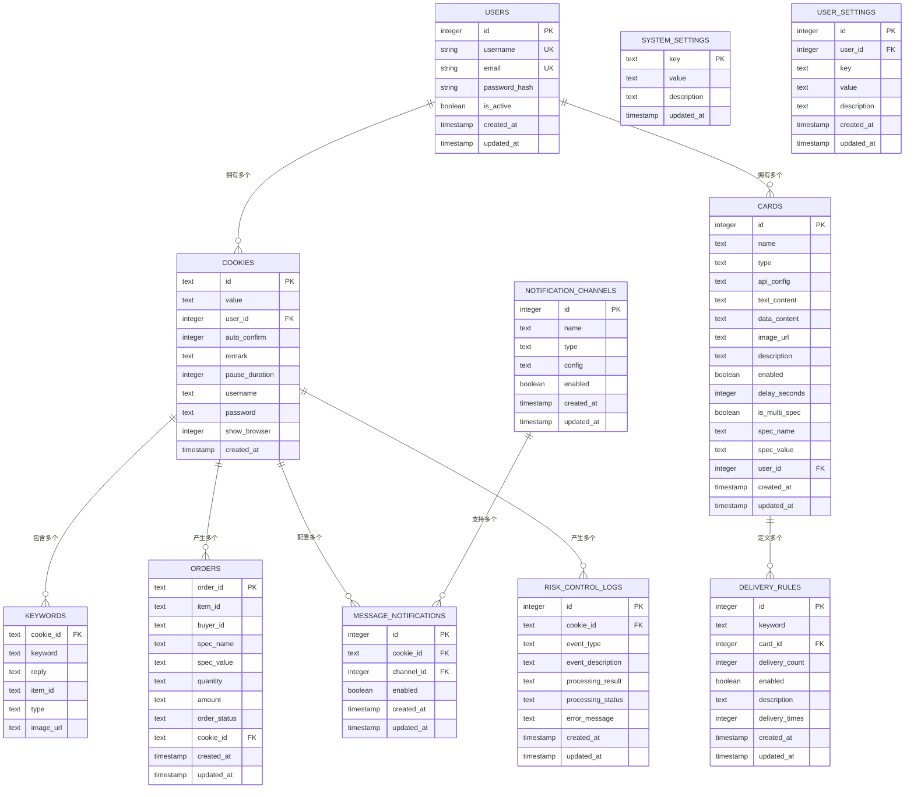

# 数据模型与表结构

<cite>
**本文档引用的文件**
- [db_manager.py](file://db_manager.py)
- [config.py](file://config.py)
</cite>

## 目录
1. [简介](#简介)
2. [数据库架构概览](#数据库架构概览)
3. [核心数据表详解](#核心数据表详解)
4. [表间关系与约束](#表间关系与约束)
5. [高级功能字段说明](#高级功能字段说明)
6. [数据迁移与升级](#数据迁移与升级)
7. [总结](#总结)

## 简介

本文档详细描述了闲鱼自动回复系统中使用的SQLite数据库的数据模型结构。系统采用SQLite作为主要数据存储引擎，通过精心设计的表结构支持多用户、多账号管理，以及复杂的自动回复、自动发货等功能。

数据库设计遵循以下核心原则：
- **用户隔离**：支持多用户环境下的数据隔离
- **扩展性**：预留字段支持未来功能扩展
- **完整性**：通过外键约束保证数据一致性
- **性能优化**：合理设计索引提升查询效率

## 数据库架构概览

系统采用模块化的表结构设计，主要分为以下几个核心模块：

**图表来源**
- [db_manager.py](file://db_manager.py#L74-L438)

## 核心数据表详解

### 1. 用户表 (users)

用户表是整个系统的核心基础表，用于管理系统的用户账户信息。

| 字段名 | 数据类型 | 约束 | 说明 |
|--------|----------|------|------|
| id | INTEGER | PRIMARY KEY, AUTOINCREMENT | 用户唯一标识符 |
| username | TEXT | UNIQUE, NOT NULL | 用户名，全局唯一 |
| email | TEXT | UNIQUE, NOT NULL | 邮箱地址，全局唯一 |
| password_hash | TEXT | NOT NULL | 密码哈希值，使用SHA256加密 |
| is_active | BOOLEAN | DEFAULT TRUE | 用户账户状态，是否激活 |
| created_at | TIMESTAMP | DEFAULT CURRENT_TIMESTAMP | 账户创建时间 |
| updated_at | TIMESTAMP | DEFAULT CURRENT_TIMESTAMP | 最后更新时间 |

**业务含义**：存储系统用户的基本信息，支持多用户环境下的用户管理和认证。

**节来源**
- [db_manager.py](file://db_manager.py#L74-L83)

### 2. Cookie表 (cookies)

Cookie表用于存储闲鱼账号的登录凭证及相关配置信息。

| 字段名 | 数据类型 | 约束 | 说明 |
|--------|----------|------|------|
| id | TEXT | PRIMARY KEY | Cookie唯一标识符 |
| value | TEXT | NOT NULL | 实际的Cookie值 |
| user_id | INTEGER | NOT NULL, FOREIGN KEY | 关联的用户ID |
| auto_confirm | INTEGER | DEFAULT 1 | 自动确认发货设置 |
| remark | TEXT | DEFAULT '' | 备注信息 |
| pause_duration | INTEGER | DEFAULT 10 | 自动回复暂停时间（分钟） |
| username | TEXT | DEFAULT '' | 账号用户名 |
| password | TEXT | DEFAULT '' | 账号密码 |
| show_browser | INTEGER | DEFAULT 0 | 是否显示浏览器界面 |
| created_at | TIMESTAMP | DEFAULT CURRENT_TIMESTAMP | 创建时间 |

**业务含义**：存储闲鱼账号的登录凭证，支持多账号管理，每个账号可以配置不同的回复策略和行为设置。

**节来源**
- [db_manager.py](file://db_manager.py#L110-L123)

### 3. 关键字表 (keywords)

关键字表定义了自动回复的触发机制和响应内容。

| 字段名 | 数据类型 | 约束 | 说明 |
|--------|----------|------|------|
| cookie_id | TEXT | NOT NULL, FOREIGN KEY | 关联的Cookie ID |
| keyword | TEXT | NOT NULL | 触发关键词 |
| reply | TEXT | NOT NULL | 回复内容 |
| item_id | TEXT | NULLABLE | 商品ID（可选） |
| type | TEXT | DEFAULT 'text' | 关键字类型（text/image） |
| image_url | TEXT | NULLABLE | 图片URL（仅图片类型） |

**业务含义**：定义自动回复的触发条件和响应内容，支持文本和图片两种类型的回复，可针对特定商品设置专属回复。

**节来源**
- [db_manager.py](file://db_manager.py#L127-L137)

### 4. 卡券表 (cards)

卡券表存储各种类型的回复素材，支持多种回复方式。

| 字段名 | 数据类型 | 约束 | 说明 |
|--------|----------|------|------|
| id | INTEGER | PRIMARY KEY, AUTOINCREMENT | 卡券唯一标识符 |
| name | TEXT | NOT NULL | 卡券名称 |
| type | TEXT | NOT NULL, CHECK | 卡券类型（api/text/data/image） |
| api_config | TEXT | NULLABLE | API配置信息（JSON格式） |
| text_content | TEXT | NULLABLE | 文本内容 |
| data_content | TEXT | NULLABLE | 批量数据内容 |
| image_url | TEXT | NULLABLE | 图片URL |
| description | TEXT | NULLABLE | 卡券描述 |
| enabled | BOOLEAN | DEFAULT TRUE | 是否启用 |
| delay_seconds | INTEGER | DEFAULT 0 | 自动发货延时（秒） |
| is_multi_spec | BOOLEAN | DEFAULT FALSE | 是否支持多规格 |
| spec_name | TEXT | NULLABLE | 规格名称 |
| spec_value | TEXT | NULLABLE | 规格值 |
| user_id | INTEGER | NOT NULL, FOREIGN KEY | 关联用户ID |
| created_at | TIMESTAMP | DEFAULT CURRENT_TIMESTAMP | 创建时间 |
| updated_at | TIMESTAMP | DEFAULT CURRENT_TIMESTAMP | 更新时间 |

**业务含义**：存储各种回复素材，支持API接口、文本、批量数据和图片等多种形式，支持多规格商品的差异化回复。

**节来源**
- [db_manager.py](file://db_manager.py#L196-L216)

### 5. 订单表 (orders)

订单表记录系统处理的所有订单信息。

| 字段名 | 数据类型 | 约束 | 说明 |
|--------|----------|------|------|
| order_id | TEXT | PRIMARY KEY | 订单唯一标识符 |
| item_id | TEXT | NULLABLE | 商品ID |
| buyer_id | TEXT | NULLABLE | 买家ID |
| spec_name | TEXT | NULLABLE | 商品规格名称 |
| spec_value | TEXT | NULLABLE | 商品规格值 |
| quantity | TEXT | NULLABLE | 商品数量 |
| amount | TEXT | NULLABLE | 订单金额 |
| order_status | TEXT | DEFAULT 'unknown' | 订单状态 |
| cookie_id | TEXT | NOT NULL, FOREIGN KEY | 关联的Cookie ID |
| created_at | TIMESTAMP | DEFAULT CURRENT_TIMESTAMP | 创建时间 |
| updated_at | TIMESTAMP | DEFAULT CURRENT_TIMESTAMP | 更新时间 |

**业务含义**：跟踪系统处理的所有订单，支持订单状态管理、商品规格追踪和财务统计。

**节来源**
- [db_manager.py](file://db_manager.py#L219-L234)

### 6. 自动发货规则表 (delivery_rules)

自动发货规则表定义了基于关键词的自动发货逻辑。

| 字段名 | 数据类型 | 约束 | 说明 |
|--------|----------|------|------|
| id | INTEGER | PRIMARY KEY, AUTOINCREMENT | 规则唯一标识符 |
| keyword | TEXT | NOT NULL | 触发关键词 |
| card_id | INTEGER | NOT NULL, FOREIGN KEY | 关联的卡券ID |
| delivery_count | INTEGER | DEFAULT 1 | 发货数量 |
| enabled | BOOLEAN | DEFAULT TRUE | 是否启用 |
| description | TEXT | NULLABLE | 规则描述 |
| delivery_times | INTEGER | DEFAULT 0 | 已发货次数 |
| created_at | TIMESTAMP | DEFAULT CURRENT_TIMESTAMP | 创建时间 |
| updated_at | TIMESTAMP | DEFAULT CURRENT_TIMESTAMP | 更新时间 |

**业务含义**：定义基于关键词的自动发货规则，支持灵活的发货策略配置。

**节来源**
- [db_manager.py](file://db_manager.py#L294-L306)

### 7. 通知渠道表 (notification_channels)

通知渠道表管理各种消息通知的配置。

| 字段名 | 数据类型 | 约束 | 说明 |
|--------|----------|------|------|
| id | INTEGER | PRIMARY KEY, AUTOINCREMENT | 渠道唯一标识符 |
| name | TEXT | NOT NULL | 渠道名称 |
| type | TEXT | NOT NULL, CHECK | 渠道类型（qq/ding_talk/feishu/email/webhook等） |
| config | TEXT | NOT NULL | 配置信息（JSON格式） |
| enabled | BOOLEAN | DEFAULT TRUE | 是否启用 |
| created_at | TIMESTAMP | DEFAULT CURRENT_TIMESTAMP | 创建时间 |
| updated_at | TIMESTAMP | DEFAULT CURRENT_TIMESTAMP | 更新时间 |

**业务含义**：支持多种通知渠道的配置，包括QQ、钉钉、飞书、邮件等多种通知方式。

**节来源**
- [db_manager.py](file://db_manager.py#L356-L366)

### 8. 系统设置表 (system_settings)

系统设置表存储全局系统配置信息。

| 字段名 | 数据类型 | 约束 | 说明 |
|--------|----------|------|------|
| key | TEXT | PRIMARY KEY | 设置键名 |
| value | TEXT | NOT NULL | 设置值 |
| description | TEXT | NULLABLE | 设置说明 |
| updated_at | TIMESTAMP | DEFAULT CURRENT_TIMESTAMP | 更新时间 |

**业务含义**：存储系统级别的配置信息，如主题颜色、SMTP配置、注册开关等。

**节来源**
- [db_manager.py](file://db_manager.py#L369-L376)

### 9. 用户设置表 (user_settings)

用户设置表存储用户个性化的配置信息。

| 字段名 | 数据类型 | 约束 | 说明 |
|--------|----------|------|------|
| id | INTEGER | PRIMARY KEY, AUTOINCREMENT | 设置唯一标识符 |
| user_id | INTEGER | NOT NULL, FOREIGN KEY | 关联用户ID |
| key | TEXT | NOT NULL | 设置键名 |
| value | TEXT | NOT NULL | 设置值 |
| description | TEXT | NULLABLE | 设置说明 |
| created_at | TIMESTAMP | DEFAULT CURRENT_TIMESTAMP | 创建时间 |
| updated_at | TIMESTAMP | DEFAULT CURRENT_TIMESTAMP | 更新时间 |

**业务含义**：支持用户级别的个性化配置，每个用户可以有自己的偏好设置。

**节来源**
- [db_manager.py](file://db_manager.py#L394-L405)

### 10. 风控日志表 (risk_control_logs)

风控日志表记录系统中的风险控制事件。

| 字段名 | 数据类型 | 约束 | 说明 |
|--------|----------|------|------|
| id | INTEGER | PRIMARY KEY, AUTOINCREMENT | 日志唯一标识符 |
| cookie_id | TEXT | NOT NULL, FOREIGN KEY | 关联的Cookie ID |
| event_type | TEXT | DEFAULT 'slider_captcha' | 事件类型 |
| event_description | TEXT | NULLABLE | 事件描述 |
| processing_result | TEXT | NULLABLE | 处理结果 |
| processing_status | TEXT | DEFAULT 'processing' | 处理状态 |
| error_message | TEXT | NULLABLE | 错误信息 |
| created_at | TIMESTAMP | DEFAULT CURRENT_TIMESTAMP | 创建时间 |
| updated_at | TIMESTAMP | DEFAULT CURRENT_TIMESTAMP | 更新时间 |

**业务含义**：记录系统中的风险控制事件，如滑块验证码处理、风控拦截等，支持审计和问题排查。

**节来源**
- [db_manager.py](file://db_manager.py#L409-L422)

## 表间关系与约束

### 外键关系图

**图表来源**
- [db_manager.py](file://db_manager.py#L121-L389)

### 约束说明

1. **用户-账号关系**：一对多关系，一个用户可以拥有多个闲鱼账号
2. **账号-关键字关系**：一对多关系，一个账号可以配置多个回复关键字
3. **账号-订单关系**：一对多关系，一个账号可以处理多个订单
4. **卡券-规则关系**：一对多关系，一张卡券可以对应多个发货规则
5. **通知配置关系**：多对多关系，通过中间表message_notifications建立

### 级联删除策略

系统采用级联删除策略确保数据一致性：
- 当删除用户时，自动删除该用户的所有相关数据
- 当删除账号时，自动删除该账号的所有关键字、订单等关联数据
- 当删除卡券时，自动删除相关的发货规则

**节来源**
- [db_manager.py](file://db_manager.py#L121-L389)

## 高级功能字段说明

### 多规格支持（is_multi_spec字段）

多规格支持是系统的重要特性，允许针对不同商品规格设置差异化的回复策略。

**字段说明**：
- **is_multi_spec**: 布尔值，指示卡券是否支持多规格
- **spec_name**: 规格名称（如"颜色"、"尺寸"）
- **spec_value**: 规格值（如"红色"、"XL"）

**应用场景**：
1. **服装类商品**：不同颜色、尺码的差异化回复
2. **电子产品**：不同配置版本的专属回复
3. **食品类商品**：不同包装规格的定制回复

### 自动发货延时（delay_seconds字段）

自动发货延时功能允许设置发货前的等待时间。

**字段说明**：
- **delay_seconds**: 整数值，发货前等待的秒数
- **默认值**: 0秒（立即发货）

**应用场景**：
1. **库存检查**：等待库存确认后再发货
2. **人工审核**：给客服人员审核的时间
3. **批量处理**：集中处理多个订单

### 多数量发货（multi_quantity_delivery字段）

多数量发货功能支持一次性处理多个商品的发货。

**应用场景**：
1. **套装商品**：一套商品包含多个配件
2. **批量采购**：客户购买多个相同商品
3. **组合销售**：商品组合优惠

**节来源**
- [db_manager.py](file://db_manager.py#L208-L210)
- [db_manager.py](file://db_manager.py#L285-L291)

## 数据迁移与升级

### 版本管理

系统采用版本化的数据库升级策略，确保数据迁移的安全性和可靠性。

**版本升级流程**：
1. **版本检查**：检查当前数据库版本
2. **增量升级**：执行版本间的增量升级
3. **数据迁移**：迁移遗留数据和结构变更
4. **完整性验证**：验证升级后的数据完整性

### 主要升级场景

1. **字段添加**：如delay_seconds、multi_quantity_delivery等新字段
2. **约束更新**：如CHECK约束的扩展支持新类型
3. **表结构调整**：如keywords表的唯一约束优化
4. **索引优化**：添加性能优化所需的索引

**节来源**
- [db_manager.py](file://db_manager.py#L441-L612)

## 总结

闲鱼自动回复系统的数据模型设计体现了以下特点：

### 设计优势

1. **模块化架构**：清晰的功能分区，便于维护和扩展
2. **用户隔离**：完善的多用户支持机制
3. **灵活配置**：丰富的配置选项满足不同业务需求
4. **数据完整性**：严格的外键约束保证数据一致性
5. **性能优化**：合理的索引设计和查询优化

### 技术特色

1. **SQLite轻量化**：适合中小规模部署，易于维护
2. **JSON支持**：灵活的配置存储格式
3. **版本控制**：完善的数据库版本管理
4. **级联操作**：自动化的数据关联处理

### 应用价值

该数据模型为闲鱼自动回复系统提供了坚实的数据基础，支持：
- 多账号、多用户的复杂业务场景
- 灵活的自动回复和发货策略
- 完整的风控和审计功能
- 可扩展的系统配置能力

通过合理的设计和完善的约束，系统能够在保证数据安全的前提下，提供高效稳定的自动化服务。