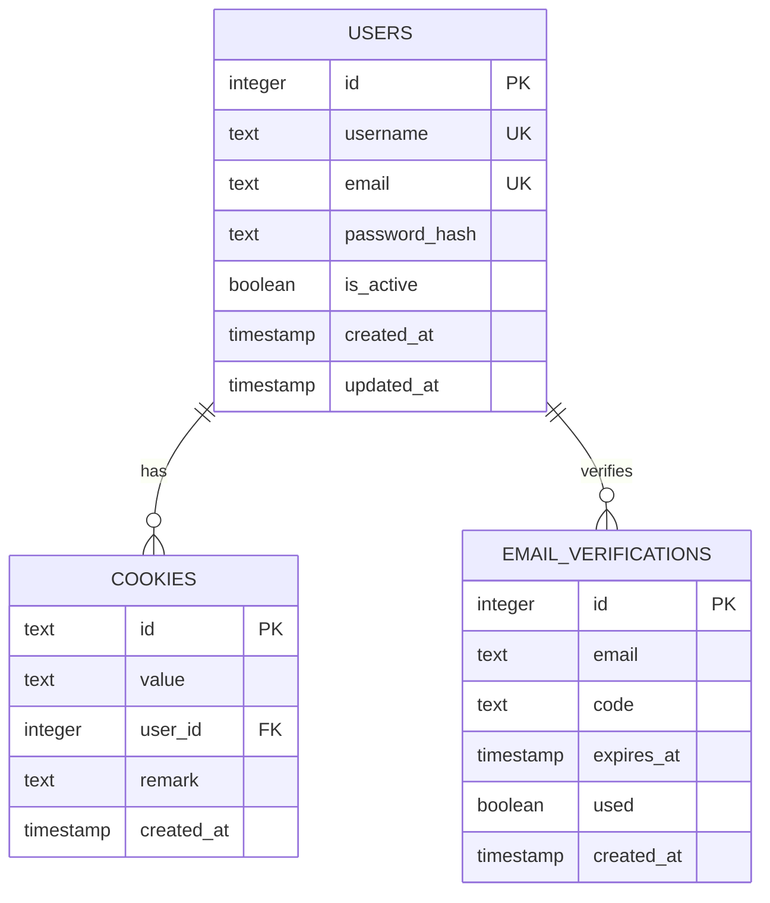
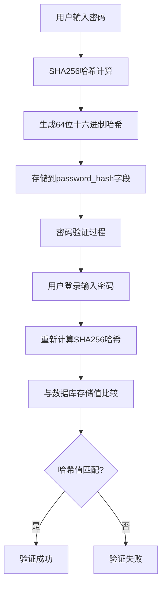
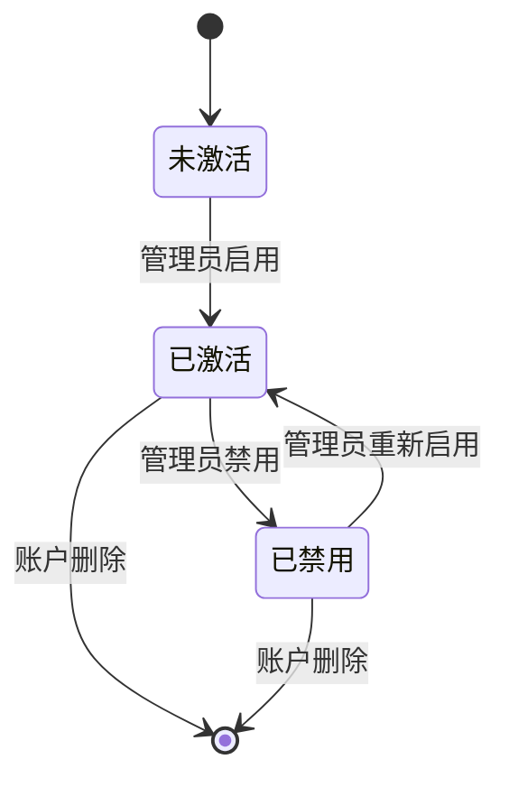
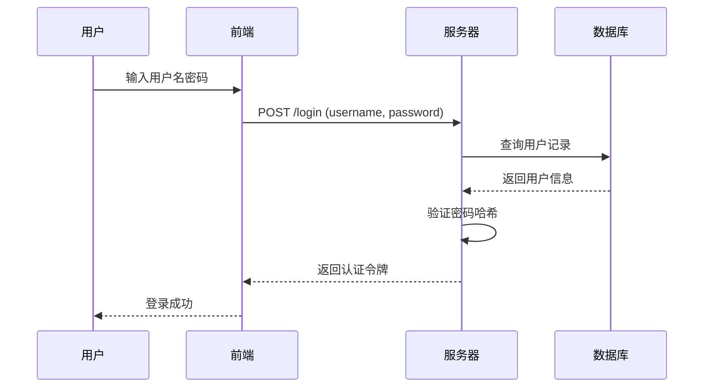
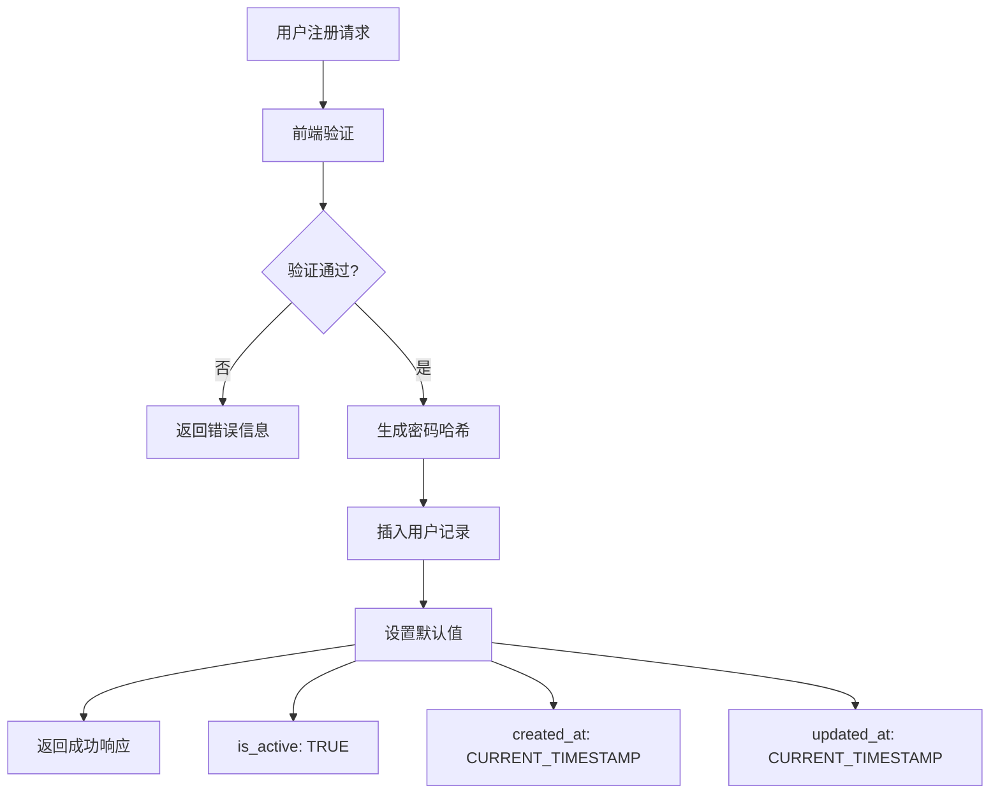
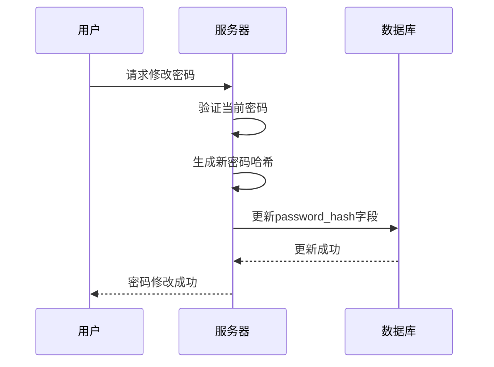
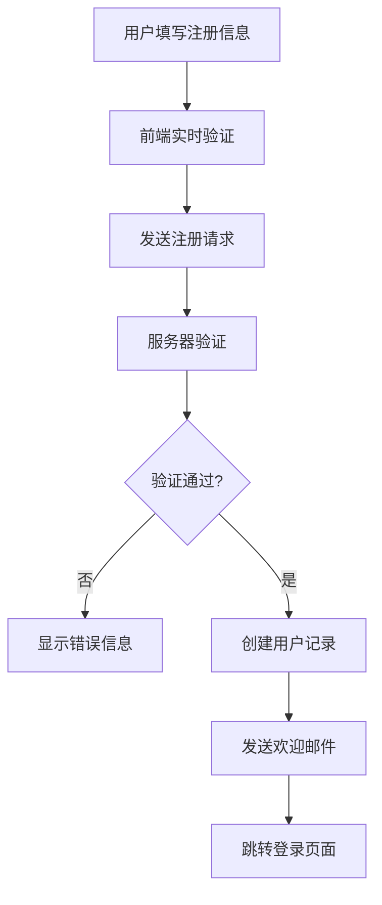
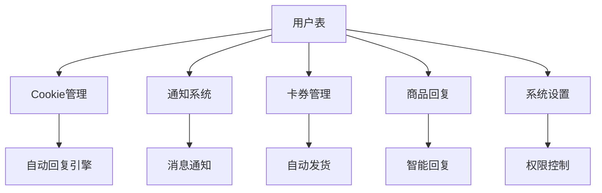

# 用户表 (users)

<cite>
**本文档引用的文件**
- [db_manager.py](file://db_manager.py)
- [reply_server.py](file://reply_server.py)
- [config.py](file://config.py)
- [static/login.html](file://static/login.html)
- [static/register.html](file://static/register.html)
- [static/js/app.js](file://static/js/app.js)
</cite>

## 目录
1. [简介](#简介)
2. [表结构设计](#表结构设计)
3. [字段详细说明](#字段详细说明)
4. [安全机制](#安全机制)
5. [用户认证流程](#用户认证流程)
6. [数据库操作](#数据库操作)
7. [前端交互](#前端交互)
8. [系统集成](#系统集成)
9. [最佳实践](#最佳实践)
10. [故障排除](#故障排除)

## 简介

用户表 (`users`) 是系统的核心数据表，负责存储和管理所有用户的基本信息、认证凭据和账户状态。该表采用 SQLite 数据库存储，提供了完整的用户生命周期管理功能，包括用户注册、登录认证、权限管理和审计追踪。

## 表结构设计

**图表来源**
- [db_manager.py](file://db_manager.py#L73-L83)

**章节来源**
- [db_manager.py](file://db_manager.py#L73-L83)

## 字段详细说明

### 主键字段
- **id** (`INTEGER PRIMARY KEY AUTOINCREMENT`)
  - 类型：整数
  - 约束：主键，自增
  - 用途：唯一标识每个用户记录
  - 特性：自动递增，保证唯一性

### 用户标识字段
- **username** (`TEXT UNIQUE NOT NULL`)
  - 类型：文本字符串
  - 约束：唯一性，非空
  - 长度限制：3-20个字符
  - 字符集：字母、数字、下划线
  - 业务含义：用户的登录名称，用于身份识别
  - 唯一性：确保用户名在整个系统中唯一

- **email** (`TEXT UNIQUE NOT NULL`)
  - 类型：文本字符串
  - 约束：唯一性，非空
  - 格式验证：标准电子邮件格式
  - 业务含义：用户的电子邮箱地址，用于找回密码和通知
  - 唯一性：确保邮箱地址在整个系统中唯一

### 安全字段
- **password_hash** (`TEXT NOT NULL`)
  - 类型：文本字符串
  - 约束：非空
  - 加密算法：SHA256哈希
  - 长度：64个十六进制字符
  - 业务含义：存储用户密码的加密哈希值
  - 安全特性：明文密码永不存储，仅存储不可逆的哈希值

### 状态管理字段
- **is_active** (`BOOLEAN DEFAULT TRUE`)
  - 类型：布尔值
  - 默认值：TRUE（激活状态）
  - 业务含义：控制用户账户的激活状态
  - 应用场景：
    - 新用户注册时默认激活
    - 管理员可以禁用违规账户
    - 自动清理长期未使用的账户

### 时间戳字段
- **created_at** (`TIMESTAMP DEFAULT CURRENT_TIMESTAMP`)
  - 类型：时间戳
  - 默认值：当前时间
  - 业务含义：记录用户账户的创建时间
  - 审计价值：用于统计分析和合规要求

- **updated_at** (`TIMESTAMP DEFAULT CURRENT_TIMESTAMP`)
  - 类型：时间戳
  - 默认值：当前时间
  - 自动更新：每次记录更新时自动更新
  - 业务含义：记录用户信息的最后修改时间
  - 审计价值：跟踪用户活动的时间线

**章节来源**
- [db_manager.py](file://db_manager.py#L73-L83)

## 安全机制

### 密码哈希策略

系统采用 SHA256 哈希算法对用户密码进行加密存储：

**图表来源**
- [db_manager.py](file://db_manager.py#L2507-L2508)
- [reply_server.py](file://reply_server.py#L2652-L2653)

### 默认管理员账户

系统在首次初始化时自动创建默认管理员账户：

| 属性 | 值 |
|------|-----|
| 用户名 | admin |
| 邮箱 | admin@localhost |
| 密码 | admin123（明文，仅用于初始化） |
| 初始状态 | 已激活 |

**章节来源**
- [db_manager.py](file://db_manager.py#L617-L628)

### 账户状态管理

**图表来源**
- [db_manager.py](file://db_manager.py#L80-L81)

## 用户认证流程

### 多种登录方式

系统支持三种不同的用户认证方式：

#### 1. 用户名密码登录

**图表来源**
- [reply_server.py](file://reply_server.py#L542-L582)

#### 2. 邮箱密码登录
- 使用邮箱地址作为登录凭据
- 支持传统的邮箱密码认证模式
- 适用于企业用户和组织管理

#### 3. 邮箱验证码登录
- 通过发送一次性验证码到用户邮箱
- 提供更高的安全性
- 适用于移动设备和临时访问场景

**章节来源**
- [reply_server.py](file://reply_server.py#L542-L613)

### Token 认证机制

系统采用基于 Token 的无状态认证：

| 组件 | 功能 | 生命周期 |
|------|------|----------|
| 生成器 | `generate_token()` | 随机32字节URL安全令牌 |
| 存储 | `SESSION_TOKENS` | 内存字典，24小时过期 |
| 验证 | `verify_token()` | 检查Token存在性和时效性 |
| 清理 | 自动清理 | 过期Token自动移除 |

**章节来源**
- [reply_server.py](file://reply_server.py#L178-L199)

## 数据库操作

### 用户创建流程

**图表来源**
- [db_manager.py](file://db_manager.py#L2430-L2435)

### 用户查询操作

系统提供了多种用户查询方法：

| 方法 | 功能 | 参数 | 返回值 |
|------|------|------|--------|
| `get_user_by_id()` | 通过ID查询用户 | user_id | 用户对象 |
| `get_user_by_username()` | 通过用户名查询 | username | 用户对象 |
| `get_user_by_email()` | 通过邮箱查询 | email | 用户对象 |
| `get_all_users()` | 获取所有用户 | 无 | 用户列表 |
| `verify_user_password()` | 验证密码 | username, password | 布尔值 |

**章节来源**
- [db_manager.py](file://db_manager.py#L2455-L2520)

### 密码更新机制

**图表来源**
- [reply_server.py](file://reply_server.py#L683-L700)

**章节来源**
- [db_manager.py](file://db_manager.py#L2507-L2520)

## 前端交互

### 登录界面设计

系统提供了直观的登录界面，支持多种登录方式：

#### 登录方式切换
- **用户名密码**：传统登录方式
- **邮箱密码**：邮箱认证登录
- **邮箱验证码**：验证码登录方式

#### 默认登录信息
系统支持显示默认管理员账户信息，便于初次使用：

| 字段 | 值 |
|------|-----|
| 用户名 | admin |
| 密码 | admin123 |

**章节来源**
- [static/login.html](file://static/login.html#L288-L305)

### 注册界面功能

注册页面包含完整的用户信息输入和验证：

#### 前端验证规则
- **用户名验证**：3-20字符，字母数字下划线
- **邮箱验证**：标准电子邮件格式
- **密码验证**：至少6字符，密码确认
- **验证码验证**：图形验证码和邮箱验证码

#### 注册流程

**图表来源**
- [static/register.html](file://static/register.html#L467-L531)

**章节来源**
- [static/register.html](file://static/register.html#L245-L565)

## 系统集成

### 与其他模块的关系

用户表与系统的其他组件紧密集成：

**图表来源**
- [db_manager.py](file://db_manager.py#L109-L124)

### 权限管理系统

用户表支持基于角色的权限控制：

| 用户类型 | 权限范围 | 特殊功能 |
|----------|----------|----------|
| 管理员 | 全系统权限 | 用户管理、系统配置 |
| 普通用户 | 个人资源权限 | 个人设置、内容管理 |

**章节来源**
- [reply_server.py](file://reply_server.py#L4672-L4726)

## 最佳实践

### 安全建议

1. **密码策略**
   - 强制使用复杂密码
   - 定期更换密码
   - 启用双因素认证（扩展功能）

2. **账户管理**
   - 及时清理无效账户
   - 监控异常登录行为
   - 实施账户锁定机制

3. **数据保护**
   - 定期备份用户数据
   - 加密敏感信息传输
   - 实施访问控制

### 性能优化

1. **索引策略**
   - 在username和email字段上建立唯一索引
   - 在created_at和updated_at字段上建立普通索引
   - 考虑复合索引优化查询性能

2. **查询优化**
   - 使用参数化查询防止SQL注入
   - 实施适当的缓存策略
   - 优化批量操作性能

### 监控和维护

1. **审计日志**
   - 记录用户登录事件
   - 监控账户状态变更
   - 跟踪敏感操作

2. **定期维护**
   - 清理过期的临时数据
   - 优化数据库性能
   - 更新安全策略

## 故障排除

### 常见问题及解决方案

#### 登录失败问题

| 问题症状 | 可能原因 | 解决方案 |
|----------|----------|----------|
| 用户名密码错误 | 密码输入错误 | 检查密码大小写和特殊字符 |
| 账户被禁用 | 管理员禁用了账户 | 联系管理员启用账户 |
| 邮箱登录失败 | 邮箱不存在或密码错误 | 确认邮箱地址和密码 |
| 验证码错误 | 验证码过期或输入错误 | 重新获取验证码 |

#### 注册问题

| 问题症状 | 可能原因 | 解决方案 |
|----------|----------|----------|
| 用户名重复 | 用户名已被占用 | 选择其他用户名 |
| 邮箱重复 | 邮箱地址已被注册 | 使用其他邮箱地址 |
| 验证码错误 | 验证码输入错误或过期 | 重新获取验证码 |
| 注册功能关闭 | 系统管理员关闭了注册 | 联系管理员开启注册 |

#### 数据库问题

| 问题症状 | 可能原因 | 解决方案 |
|----------|----------|----------|
| 数据库连接失败 | 数据库文件损坏或权限问题 | 检查数据库文件和权限 |
| 查询超时 | 数据量过大或索引缺失 | 优化查询语句和添加索引 |
| 记录重复 | 唯一约束违反 | 检查数据完整性约束 |

### 调试技巧

1. **日志分析**
   - 查看系统日志定位问题
   - 分析错误堆栈信息
   - 监控性能指标

2. **数据库检查**
   - 使用SQLite工具检查表结构
   - 验证数据完整性
   - 分析查询计划

3. **前端调试**
   - 使用浏览器开发者工具
   - 检查网络请求和响应
   - 验证JavaScript错误

**章节来源**
- [db_manager.py](file://db_manager.py#L446-L448)
- [reply_server.py](file://reply_server.py#L542-L613)