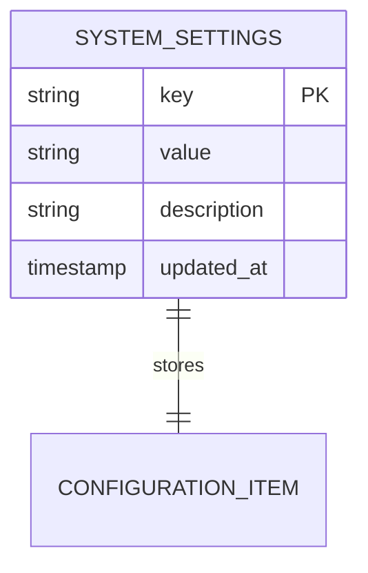
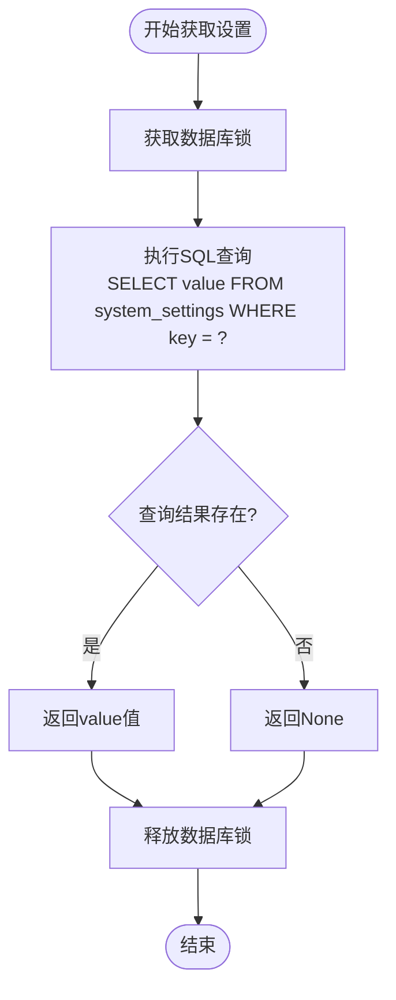
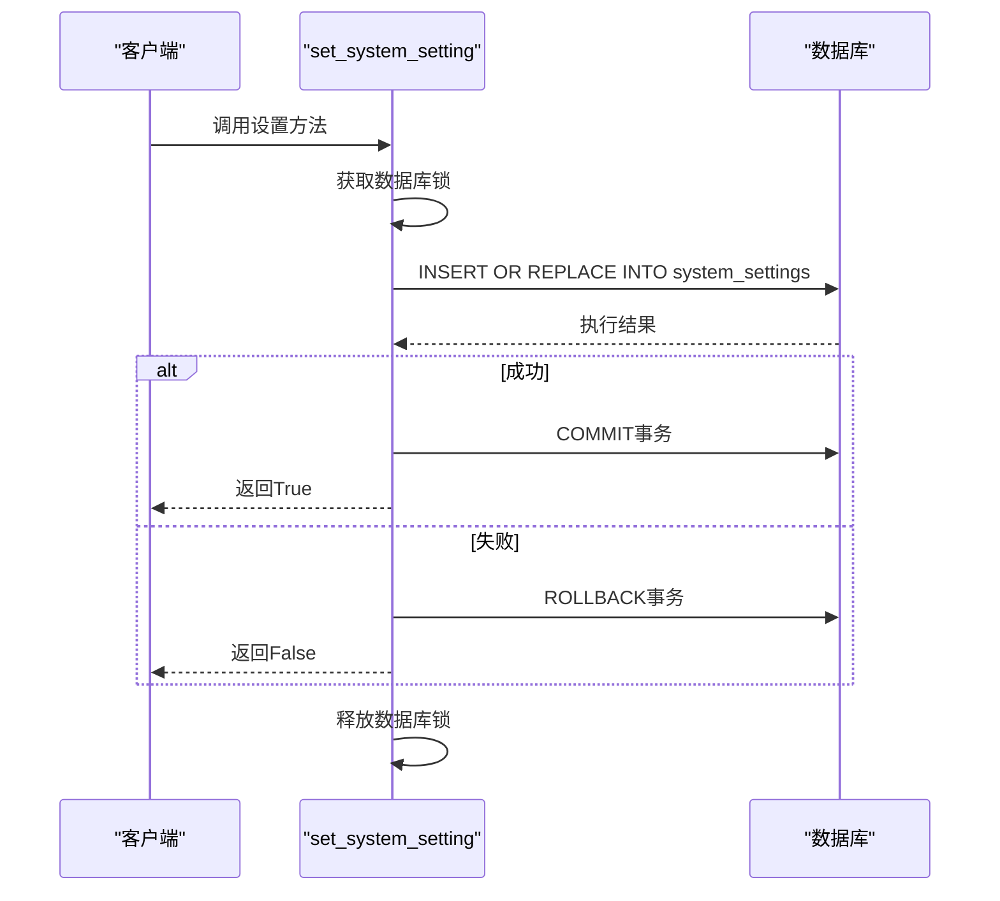
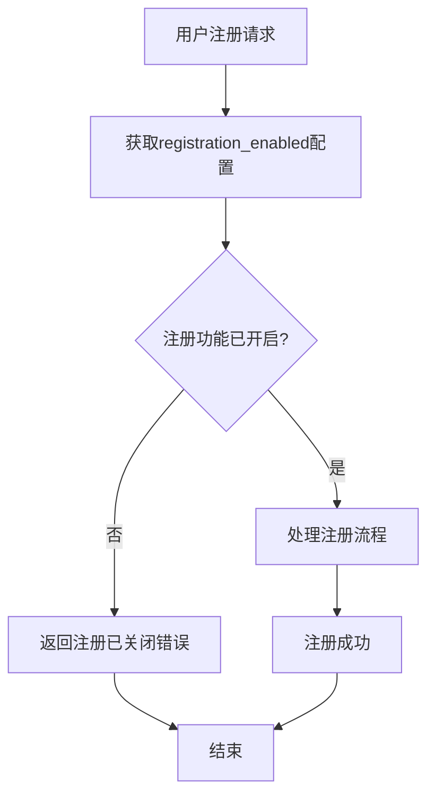
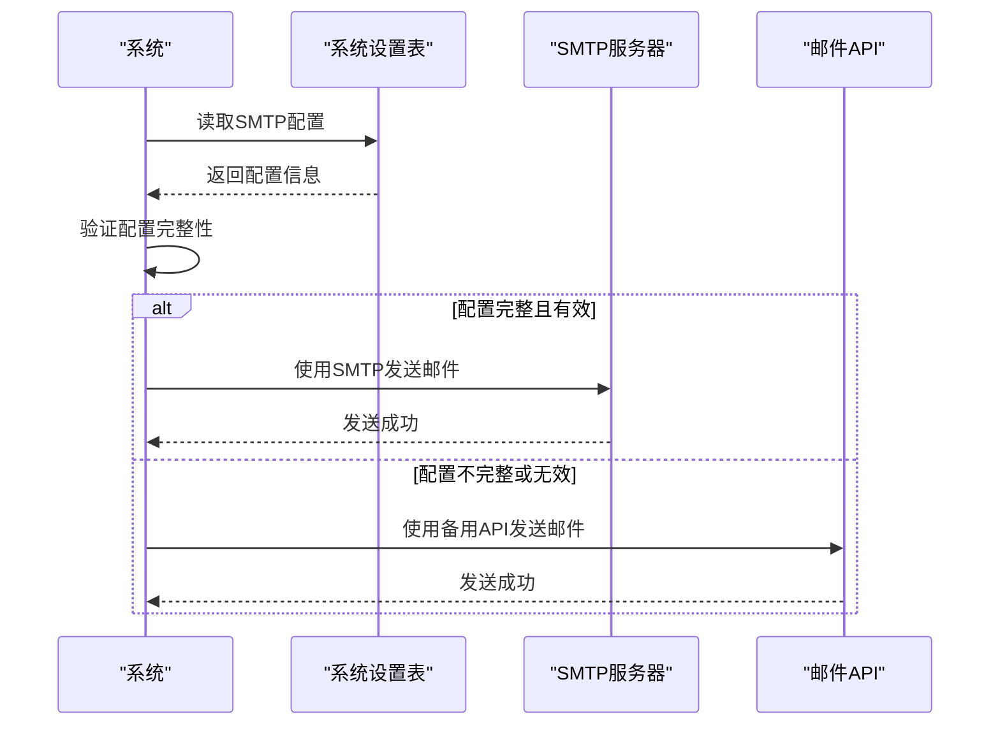
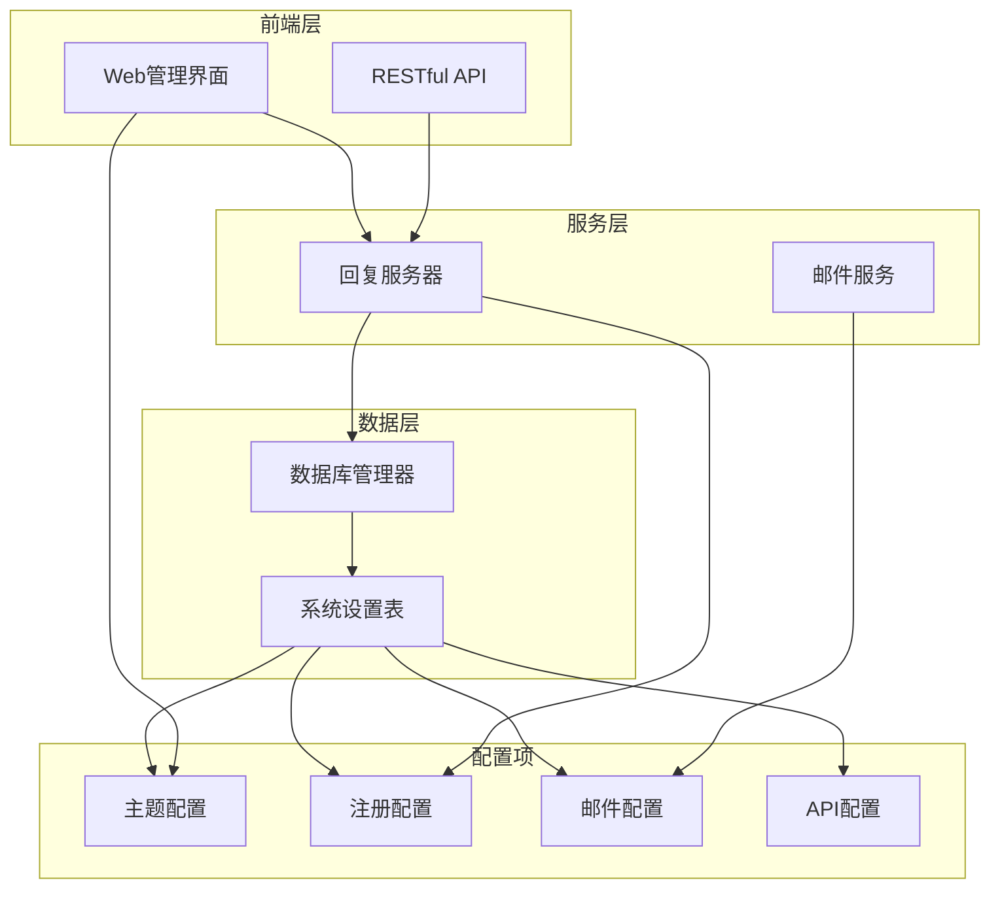
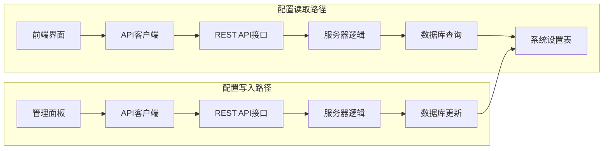

# 系统设置表 (system_settings)

<cite>
**本文档引用的文件**
- [db_manager.py](file://db_manager.py)
- [config.py](file://config.py)
- [reply_server.py](file://reply_server.py)
- [static/js/app.js](file://static/js/app.js)
- [static/index.html](file://static/index.html)
- [XianyuAutoAsync.py](file://XianyuAutoAsync.py)
</cite>

## 目录
1. [简介](#简介)
2. [表结构设计](#表结构设计)
3. [核心字段详解](#核心字段详解)
4. [默认配置初始化](#默认配置初始化)
5. [核心方法实现](#核心方法实现)
6. [业务应用场景](#业务应用场景)
7. [架构图](#架构图)
8. [最佳实践](#最佳实践)
9. [故障排除](#故障排除)

## 简介

系统设置表 (`system_settings`) 是闲鱼自动回复系统的核心配置管理组件，采用键值对设计模式，支持动态配置管理。该表为整个系统提供了灵活的配置机制，使得管理员可以通过界面或API实时调整系统行为，而无需重启应用程序。

系统设置表的设计遵循以下核心原则：
- **键值对架构**：每个配置项通过唯一的key标识，value存储配置值
- **动态配置**：支持运行时修改配置，无需重启系统
- **类型安全**：所有配置值以字符串形式存储，便于序列化和反序列化
- **版本控制**：通过updated_at字段追踪配置变更历史

## 表结构设计

### SQL建表语句

```sql
CREATE TABLE IF NOT EXISTS system_settings (
    key TEXT PRIMARY KEY,
    value TEXT NOT NULL,
    description TEXT,
    updated_at TIMESTAMP DEFAULT CURRENT_TIMESTAMP
)
```

### 数据库约束



**图表来源**
- [db_manager.py](file://db_manager.py#L369-L375)

**章节来源**
- [db_manager.py](file://db_manager.py#L369-L375)

## 核心字段详解

### key字段 - 唯一标识符

**数据类型**: TEXT (PRIMARY KEY)
**约束条件**: NOT NULL, UNIQUE
**业务含义**: 
- 作为配置项的唯一标识符，用于快速定位和检索特定配置
- 采用语义化命名规范，如`theme_color`、`registration_enabled`、`smtp_server`
- 支持层次化命名，如`smtp.server.address`、`smtp.port.number`

**技术特性**:
- 主键约束确保每个配置项的唯一性
- 支持精确查询和批量操作
- 便于前端界面展示和用户理解

### value字段 - 配置值存储

**数据类型**: TEXT
**约束条件**: NOT NULL
**业务含义**: 存储配置项的实际值，支持多种数据类型的序列化表示

**存储特点**:
- **字符串化存储**: 所有配置值统一以字符串形式存储
- **JSON支持**: 复杂配置可通过JSON格式序列化存储
- **布尔值处理**: 使用`true`/`false`字符串表示布尔值
- **数值类型**: 数值配置以字符串形式存储，便于统一处理

**示例配置值**:
- `theme_color`: `"blue"`
- `registration_enabled`: `"true"`
- `smtp_port`: `"587"`
- `ai_model_config`: `{"model":"qwen-plus","temperature":0.7}`

### description字段 - 配置说明

**数据类型**: TEXT
**约束条件**: NULLABLE
**业务含义**: 提供配置项的功能说明和使用指导

**用途**:
- 帮助管理员理解配置项的作用
- 提供配置的最佳实践建议
- 支持配置项的分类和搜索

### updated_at字段 - 变更追踪

**数据类型**: TIMESTAMP
**约束条件**: DEFAULT CURRENT_TIMESTAMP
**业务含义**: 记录配置项的最后更新时间，支持配置变更审计

**价值**:
- **变更追踪**: 追踪配置的历史变更记录
- **版本控制**: 支持配置的版本管理和回滚
- **性能优化**: 识别最近变更的配置项，优化缓存策略
- **审计功能**: 为系统审计提供配置变更的时间戳

**章节来源**
- [db_manager.py](file://db_manager.py#L369-L375)

## 默认配置初始化

系统启动时会自动初始化一组默认配置，确保系统能够正常运行。

### 初始化SQL语句

```sql
INSERT OR IGNORE INTO system_settings (key, value, description) VALUES
('theme_color', 'blue', '主题颜色'),
('registration_enabled', 'true', '是否开启用户注册'),
('show_default_login_info', 'true', '是否显示默认登录信息'),
('smtp_server', '', 'SMTP服务器地址'),
('smtp_port', '587', 'SMTP端口'),
('smtp_user', '', 'SMTP登录用户名（发件邮箱）'),
('smtp_password', '', 'SMTP登录密码/授权码'),
('smtp_from', '', '发件人显示名（留空则使用用户名）'),
('smtp_use_tls', 'true', '是否启用TLS'),
('smtp_use_ssl', 'false', '是否启用SSL'),
('qq_reply_secret_key', 'xianyu_qq_reply_2024', 'QQ回复消息API秘钥')
```

### 默认配置表

| 配置项 | 默认值 | 说明 |
|--------|--------|------|
| `theme_color` | `blue` | 系统主题颜色，支持蓝色、绿色、红色等 |
| `registration_enabled` | `true` | 是否允许新用户注册 |
| `show_default_login_info` | `true` | 是否在登录页面显示默认登录信息 |
| `smtp_server` | `''` | SMTP服务器地址，为空时使用备用邮件发送方式 |
| `smtp_port` | `587` | SMTP服务器端口，通常为587（TLS）或465（SSL） |
| `smtp_user` | `''` | SMTP认证用户名（发件邮箱地址） |
| `smtp_password` | `''` | SMTP认证密码或授权码 |
| `smtp_from` | `''` | 发件人显示名称，留空则使用用户名 |
| `smtp_use_tls` | `'true'` | 是否启用TLS加密传输 |
| `smtp_use_ssl` | `'false'` | 是否启用SSL加密传输 |
| `qq_reply_secret_key` | `xianyu_qq_reply_2024` | QQ消息API通信密钥 |

**章节来源**
- [db_manager.py](file://db_manager.py#L425-L437)

## 核心方法实现

### get_system_setting方法

**功能**: 获取指定key的系统设置值

**实现逻辑**:


**图表来源**
- [db_manager.py](file://db_manager.py#L2376-L2387)

**方法签名**:
```python
def get_system_setting(self, key: str) -> Optional[str]:
    """获取系统设置"""
```

**使用场景**:
- 系统启动时读取初始配置
- 功能模块运行时获取配置参数
- 接口调用时验证配置状态

### set_system_setting方法

**功能**: 设置系统配置项的值

**实现逻辑**:


**图表来源**
- [db_manager.py](file://db_manager.py#L2389-L2404)

**方法签名**:
```python
def set_system_setting(self, key: str, value: str, description: str = None) -> bool:
    """设置系统设置"""
```

**特性**:
- **原子性操作**: 使用INSERT OR REPLACE确保操作的原子性
- **自动更新**: 如果key已存在，则更新value和updated_at
- **事务安全**: 自动处理事务的提交和回滚
- **日志记录**: 成功时记录调试日志

### get_all_system_settings方法

**功能**: 获取所有系统设置

**实现特点**:
- 使用线程锁保证并发安全
- 返回字典格式的配置集合
- 忽略数据库异常，提供降级处理

**章节来源**
- [db_manager.py](file://db_manager.py#L2376-L2420)

## 业务应用场景

### 主题配置管理

**配置项**: `theme_color`
**用途**: 控制系统的视觉主题
**实现方式**: 
- 前端通过JavaScript读取配置并动态应用样式
- 支持运行时切换主题色，无需重启系统

### 用户注册控制

**配置项**: `registration_enabled`
**用途**: 管理新用户注册功能
**实现流程**:


**图表来源**
- [reply_server.py](file://reply_server.py#L2685-L2709)

### SMTP邮件配置

**配置项组**:
- `smtp_server`: SMTP服务器地址
- `smtp_port`: SMTP端口号
- `smtp_user`: 发件邮箱
- `smtp_password`: 邮箱密码/授权码
- `smtp_use_tls`: 是否启用TLS
- `smtp_use_ssl`: 是否启用SSL

**邮件发送流程**:


**图表来源**
- [db_manager.py](file://db_manager.py#L2733-L2757)

### API密钥管理

**配置项**: `qq_reply_secret_key`
**用途**: QQ消息API通信认证
**安全特性**:
- 作为独立配置项管理
- 不在前端界面暴露
- 支持定期轮换

**章节来源**
- [reply_server.py](file://reply_server.py#L2646-L2676)

## 架构图

### 系统设置表整体架构



**图表来源**
- [db_manager.py](file://db_manager.py#L16-L65)
- [reply_server.py](file://reply_server.py#L2645-L2680)

### 配置读取流程



**图表来源**
- [reply_server.py](file://reply_server.py#L2646-L2676)
- [db_manager.py](file://db_manager.py#L2376-L2404)

## 最佳实践

### 配置命名规范

1. **语义化命名**: 使用清晰的英文单词描述配置用途
   - `theme_color` > `tc`
   - `registration_enabled` > `reg_enable`

2. **层次化组织**: 对相关配置使用前缀区分
   - `smtp.server.host`
   - `smtp.server.port`
   - `smtp.auth.username`

3. **类型暗示**: 在命名中体现预期的数据类型
   - `port_number` (整数)
   - `enable_feature` (布尔值)
   - `timeout_seconds` (数值)

### 配置验证策略

1. **类型检查**: 在应用层验证配置值的类型
2. **范围验证**: 确保数值配置在合理范围内
3. **格式验证**: 验证邮箱、URL等格式配置
4. **依赖检查**: 确保相关配置项的完整性

### 安全考虑

1. **敏感信息保护**: 不要在日志中记录敏感配置
2. **访问控制**: 限制对敏感配置的修改权限
3. **配置备份**: 定期备份重要配置
4. **变更审计**: 记录配置变更的详细信息

### 性能优化

1. **缓存策略**: 对频繁访问的配置进行缓存
2. **懒加载**: 仅在需要时读取配置
3. **批量操作**: 批量读取相关配置减少数据库访问
4. **索引优化**: 确保key字段有适当的索引

## 故障排除

### 常见问题及解决方案

#### 1. 配置读取失败

**症状**: 系统无法读取配置项，使用默认值或报错

**排查步骤**:
1. 检查数据库连接是否正常
2. 验证system_settings表是否存在
3. 确认key值拼写是否正确
4. 检查数据库权限

**解决方案**:
```sql
-- 检查表结构
PRAGMA table_info(system_settings);

-- 检查特定配置项
SELECT * FROM system_settings WHERE key = 'specific_key';

-- 重新初始化配置
INSERT OR REPLACE INTO system_settings (key, value, description) 
VALUES ('specific_key', 'default_value', 'description');
```

#### 2. SMTP配置问题

**症状**: 邮件发送失败

**排查步骤**:
1. 检查SMTP服务器连通性
2. 验证认证凭据
3. 确认TLS/SSL设置
4. 检查防火墙设置

**解决方案**:
```python
# 测试SMTP连接
import smtplib

try:
    server = smtplib.SMTP(smtp_server, smtp_port, timeout=30)
    if smtp_use_tls:
        server.starttls()
    server.login(smtp_user, smtp_password)
    print("SMTP连接测试成功")
except Exception as e:
    print(f"SMTP连接测试失败: {e}")
```

#### 3. 配置更新冲突

**症状**: 配置更新失败或丢失

**原因分析**:
- 并发更新导致的数据竞争
- 事务处理不当
- 数据库锁定超时

**解决方案**:
1. 实现乐观锁机制
2. 增加重试逻辑
3. 优化事务粒度
4. 使用分布式锁

### 监控和告警

建议监控以下指标：
- 配置读取成功率
- 配置更新频率
- 数据库连接状态
- 配置变更历史

**章节来源**
- [db_manager.py](file://db_manager.py#L2376-L2420)
- [XianyuAutoAsync.py](file://XianyuAutoAsync.py#L3856-L3898)

## 结论

系统设置表作为闲鱼自动回复系统的核心配置管理组件，通过简洁而强大的键值对设计，为系统提供了灵活、可扩展的配置管理能力。其设计充分考虑了易用性、安全性和性能需求，支持动态配置管理、版本控制和变更追踪等功能。

通过合理的配置命名规范、完善的验证机制和健壮的错误处理，系统设置表能够满足复杂业务场景下的配置管理需求，为系统的稳定运行和灵活扩展提供了坚实的基础。