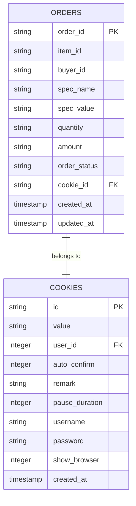
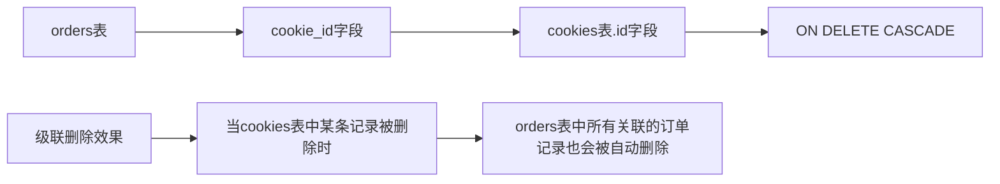
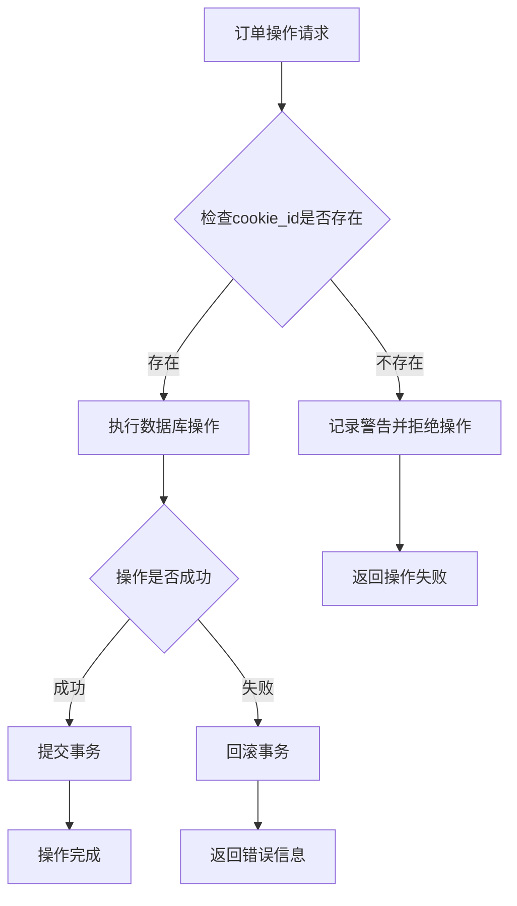
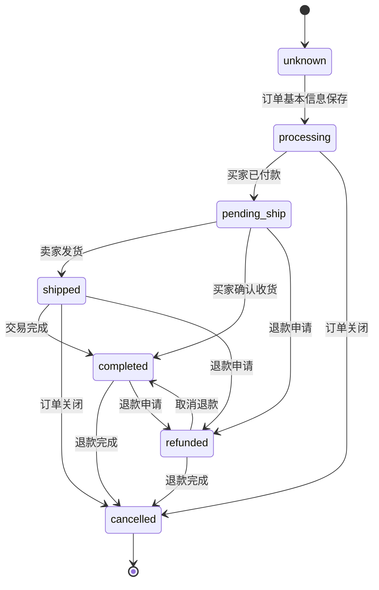
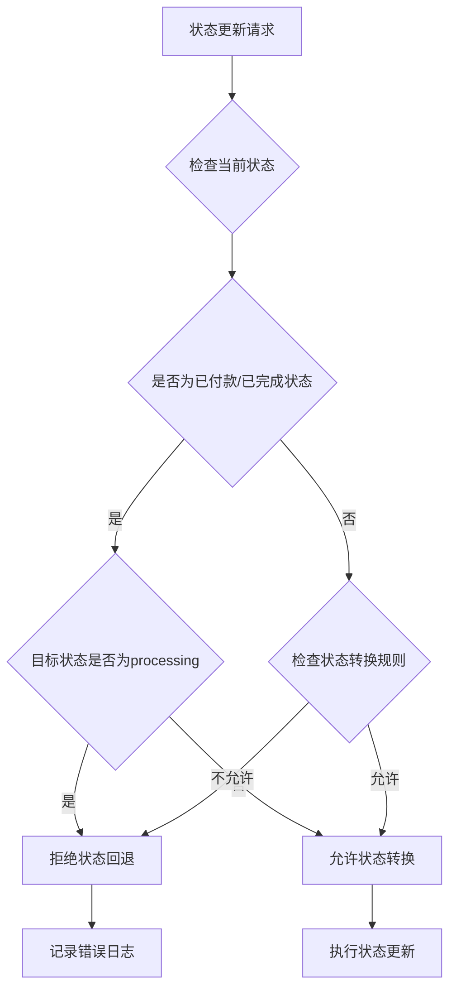
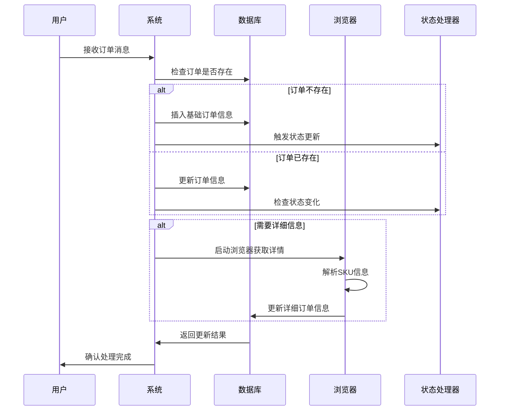
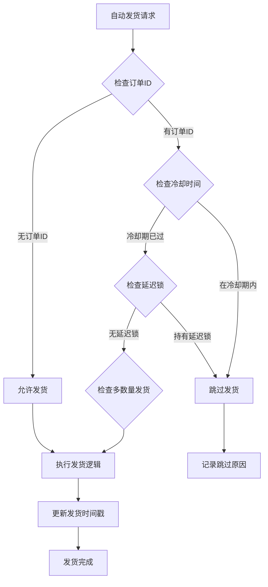

# 订单表 (orders)

<cite>
**本文档引用的文件**
- [db_manager.py](file://db_manager.py)
- [order_status_handler.py](file://order_status_handler.py)
- [cookie_manager.py](file://cookie_manager.py)
- [utils/order_detail_fetcher.py](file://utils/order_detail_fetcher.py)
- [XianyuAutoAsync.py](file://XianyuAutoAsync.py)
- [secure_confirm_decrypted.py](file://secure_confirm_decrypted.py)
- [secure_freeshipping_decrypted.py](file://secure_freeshipping_decrypted.py)
</cite>

## 目录
1. [简介](#简介)
2. [表结构设计](#表结构设计)
3. [字段详细说明](#字段详细说明)
4. [外键关系与约束](#外键关系与约束)
5. [订单状态管理系统](#订单状态管理系统)
6. [数据采集与更新流程](#数据采集与更新流程)
7. [自动发货验证机制](#自动发货验证机制)
8. [SQL建表语句](#sql建表语句)
9. [最佳实践建议](#最佳实践建议)

## 简介

orders表是闲鱼自动回复系统的核心数据表，负责存储和管理所有订单的详细信息。该表采用SQLite数据库实现，支持订单状态的完整生命周期管理，包括订单创建、状态更新、自动发货验证等功能。

## 表结构设计



**图表来源**
- [db_manager.py](file://db_manager.py#L219-L234)
- [db_manager.py](file://db_manager.py#L109-L124)

**节来源**
- [db_manager.py](file://db_manager.py#L219-L234)

## 字段详细说明

### 主键字段

| 字段名 | 数据类型 | 约束条件 | 业务含义 |
|--------|----------|----------|----------|
| `order_id` | TEXT | PRIMARY KEY | 订单唯一标识符，由闲鱼平台生成的10位以上数字字符串 |

### 商品信息字段

| 字段名 | 数据类型 | 约束条件 | 业务含义 |
|--------|----------|----------|----------|
| `item_id` | TEXT | NULLABLE | 商品唯一标识符，关联到具体商品 |
| `spec_name` | TEXT | NULLABLE | 商品规格名称，如"颜色"、"尺寸"等 |
| `spec_value` | TEXT | NULLABLE | 商品规格值，如"红色"、"XL"等 |
| `quantity` | TEXT | NULLABLE | 商品数量，字符串格式，支持多规格数量 |
| `amount` | TEXT | NULLABLE | 商品金额，包含货币符号的字符串格式 |

### 用户与状态字段

| 字段名 | 数据类型 | 约束条件 | 业务含义 |
|--------|----------|----------|----------|
| `buyer_id` | TEXT | NULLABLE | 买家用户ID，用于买家识别 |
| `order_status` | TEXT | DEFAULT 'unknown' | 订单状态，支持多种状态值 |
| `cookie_id` | TEXT | FOREIGN KEY | 关联到cookies表的外键，标识所属账号 |

### 时间戳字段

| 字段名 | 数据类型 | 约束条件 | 业务含义 |
|--------|----------|----------|----------|
| `created_at` | TIMESTAMP | DEFAULT CURRENT_TIMESTAMP | 记录创建时间 |
| `updated_at` | TIMESTAMP | DEFAULT CURRENT_TIMESTAMP | 记录最后更新时间 |

**节来源**
- [db_manager.py](file://db_manager.py#L221-L232)

## 外键关系与约束

### cookie_id外键关系

orders表的`cookie_id`字段与cookies表建立了外键关系，具有以下特性：



**图表来源**
- [db_manager.py](file://db_manager.py#L233-L233)

这种级联删除机制确保了数据的一致性：
- 当某个闲鱼账号被删除时，该账号下的所有订单记录会自动清理
- 避免了孤立订单记录的存在
- 维护了订单与账号之间的引用完整性

### 约束条件验证

系统在插入或更新订单时会进行严格的约束检查：



**图表来源**
- [db_manager.py](file://db_manager.py#L4408-L4415)

**节来源**
- [db_manager.py](file://db_manager.py#L4408-L4415)

## 订单状态管理系统

### 状态机设计

orders表支持完整的订单状态生命周期管理，状态转换遵循严格的业务规则：



**图表来源**
- [order_status_handler.py](file://order_status_handler.py#L36-L44)

### 状态转换规则

| 当前状态 | 允许转换到的状态 | 业务场景 |
|----------|------------------|----------|
| processing | pending_ship, completed, cancelled, refunded | 处理中状态可转为待发货、已完成、已关闭或退款中 |
| pending_ship | shipped, completed, cancelled, refunded | 已付款状态可转为已发货、已完成、已关闭或退款中 |
| shipped | completed, cancelled, refunded | 已发货状态可转为已完成、已关闭或退款中 |
| completed | cancelled, refunded | 已完成状态可转为已关闭或退款中 |
| refunded | completed, cancelled, refund_cancelled | 退款中状态可转为已完成、已关闭或退款撤销 |

### 状态验证机制

系统实现了严格的状态转换验证，防止不合理的状态回退：



**图表来源**
- [order_status_handler.py](file://order_status_handler.py#L323-L330)

**节来源**
- [order_status_handler.py](file://order_status_handler.py#L36-L44)
- [order_status_handler.py](file://order_status_handler.py#L323-L330)

## 数据采集与更新流程

### 订单信息采集流程

系统采用多层次的数据采集策略，确保订单信息的准确性和完整性：



**图表来源**
- [XianyuAutoAsync.py](file://XianyuAutoAsync.py#L4677-L4702)
- [utils/order_detail_fetcher.py](file://utils/order_detail_fetcher.py#L200-L351)

### 数据更新模式

系统支持两种主要的数据更新模式：

#### 1. 基础信息更新模式
适用于订单的基本信息保存，如订单ID、买家ID等：

```python
# 基础信息更新示例
success = db_manager.insert_or_update_order(
    order_id=order_id,
    item_id=item_id,
    buyer_id=send_user_id,
    cookie_id=self.cookie_id
)
```

#### 2. 详细信息更新模式  
适用于订单的详细规格信息获取：

```python
# 详细信息更新示例
order_info = db_manager.get_order_by_id(order_id)
if not order_info.get('amount'):  # 如果金额无效
    # 启动浏览器获取详细信息
    detail_info = await fetcher.fetch_order_detail(order_id)
    # 更新详细信息
    db_manager.insert_or_update_order(
        order_id=order_id,
        spec_name=detail_info['spec_name'],
        spec_value=detail_info['spec_value'],
        quantity=detail_info['quantity'],
        amount=detail_info['amount']
    )
```

**节来源**
- [XianyuAutoAsync.py](file://XianyuAutoAsync.py#L4677-L4702)
- [utils/order_detail_fetcher.py](file://utils/order_detail_fetcher.py#L200-L351)

## 自动发货验证机制

### 防重复发货保护

系统实现了多层防重复发货保护机制：



**图表来源**
- [XianyuAutoAsync.py](file://XianyuAutoAsync.py#L809-L821)

### 发货验证流程

系统通过多个维度验证发货资格：

#### 1. Cookie有效性验证
```python
# Cookie有效性检查
cookie_info = db_manager.get_cookie_by_id(self.cookie_id)
if not cookie_info:
    logger.warning(f"Cookie ID {self.cookie_id} 不存在，丢弃订单")
    return
```

#### 2. 订单状态验证
```python
# 订单状态检查
existing_order = db_manager.get_order_by_id(order_id)
if not existing_order:
    # 插入新订单
    success = db_manager.insert_or_update_order(...)
```

#### 3. 自动确认设置验证
```python
# 自动确认发货检查
if not self.is_auto_confirm_enabled():
    logger.info(f"账号 {self.cookie_id} 未启用自动确认发货")
    return
```

**节来源**
- [XianyuAutoAsync.py](file://XianyuAutoAsync.py#L809-L821)
- [XianyuAutoAsync.py](file://XianyuAutoAsync.py#L4677-L4684)

## SQL建表语句

以下是orders表的完整SQL建表语句：

```sql
CREATE TABLE IF NOT EXISTS orders (
    order_id TEXT PRIMARY KEY,
    item_id TEXT,
    buyer_id TEXT,
    spec_name TEXT,
    spec_value TEXT,
    quantity TEXT,
    amount TEXT,
    order_status TEXT DEFAULT 'unknown',
    cookie_id TEXT,
    created_at TIMESTAMP DEFAULT CURRENT_TIMESTAMP,
    updated_at TIMESTAMP DEFAULT CURRENT_TIMESTAMP,
    FOREIGN KEY (cookie_id) REFERENCES cookies(id) ON DELETE CASCADE
);

-- 索引优化（可根据查询需求添加）
CREATE INDEX IF NOT EXISTS idx_orders_cookie_id ON orders(cookie_id);
CREATE INDEX IF NOT EXISTS idx_orders_order_status ON orders(order_status);
CREATE INDEX IF NOT EXISTS idx_orders_created_at ON orders(created_at);
```

### 数据库迁移脚本

系统支持动态数据库迁移，确保表结构的演进：

```sql
-- 检查并添加字段（示例）
BEGIN TRANSACTION;
ALTER TABLE orders ADD COLUMN new_field TEXT DEFAULT '';
COMMIT;

-- 更新约束（示例）
PRAGMA foreign_keys=off;
CREATE TABLE orders_new (
    -- 新的表结构
);
INSERT INTO orders_new SELECT * FROM orders;
DROP TABLE orders;
ALTER TABLE orders_new RENAME TO orders;
PRAGMA foreign_keys=on;
```

**节来源**
- [db_manager.py](file://db_manager.py#L219-L234)

## 最佳实践建议

### 数据完整性保证

1. **外键约束验证**
   - 在插入订单前验证`cookie_id`的有效性
   - 确保`cookie_id`存在于cookies表中

2. **状态转换验证**
   - 实现严格的状态转换规则检查
   - 防止不合理的状态回退操作

3. **并发控制**
   - 使用数据库事务保证操作的原子性
   - 实现适当的锁机制防止数据竞争

### 性能优化建议

1. **索引策略**
   ```sql
   -- 为常用查询字段创建索引
   CREATE INDEX idx_orders_cookie_status ON orders(cookie_id, order_status);
   CREATE INDEX idx_orders_buyer_id ON orders(buyer_id);
   ```

2. **查询优化**
   ```sql
   -- 使用LIMIT限制查询结果
   SELECT * FROM orders 
   WHERE cookie_id = ? 
   ORDER BY created_at DESC 
   LIMIT 100;
   ```

3. **定期清理**
   ```sql
   -- 清理过期订单数据
   DELETE FROM orders 
   WHERE order_status = 'cancelled' 
   AND updated_at < datetime('now', '-30 days');
   ```

### 错误处理策略

1. **异常捕获**
   ```python
   try:
       # 数据库操作
       db_manager.insert_or_update_order(...)
   except sqlite3.IntegrityError as e:
       logger.error(f"数据库完整性错误: {e}")
   except Exception as e:
       logger.error(f"未知错误: {e}")
   ```

2. **重试机制**
   ```python
   max_retries = 3
   for attempt in range(max_retries):
       try:
           # 执行操作
           break
       except sqlite3.OperationalError as e:
           if attempt == max_retries - 1:
               raise
           time.sleep(0.1 * (attempt + 1))
   ```

### 监控与日志

1. **关键指标监控**
   - 订单创建成功率
   - 状态转换频率
   - 并发操作冲突率

2. **日志记录**
   ```python
   logger.info(f"订单 {order_id} 状态更新: {current_status} -> {new_status}")
   logger.error(f"订单 {order_id} 处理失败: {error_message}")
   ```

通过以上设计和实践，orders表能够高效、可靠地支持闲鱼自动回复系统的各项功能，确保订单数据的完整性和系统的稳定性。