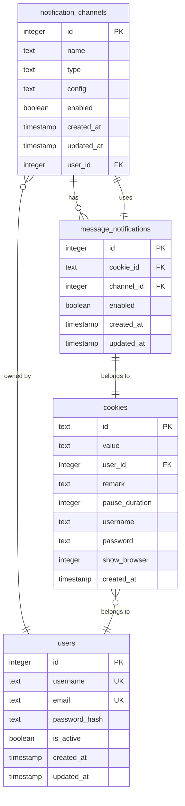
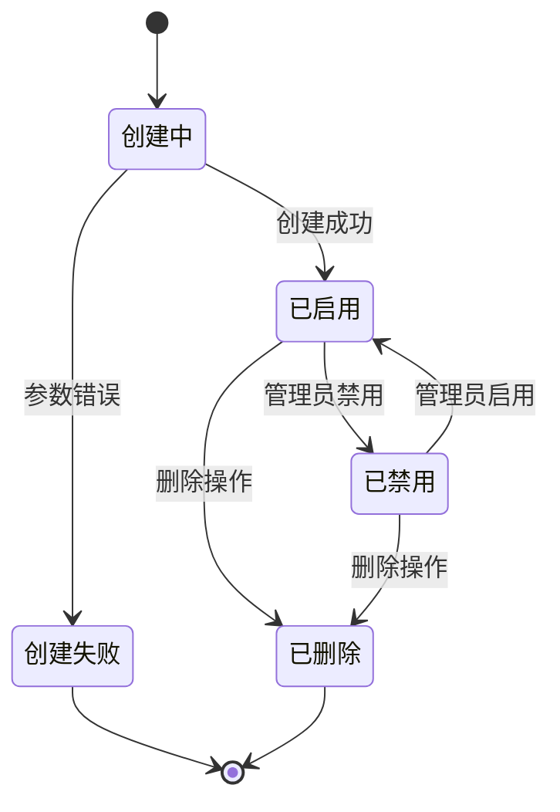
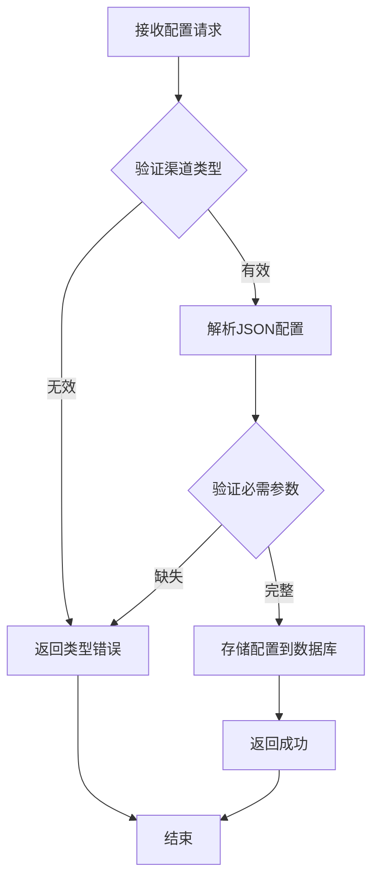
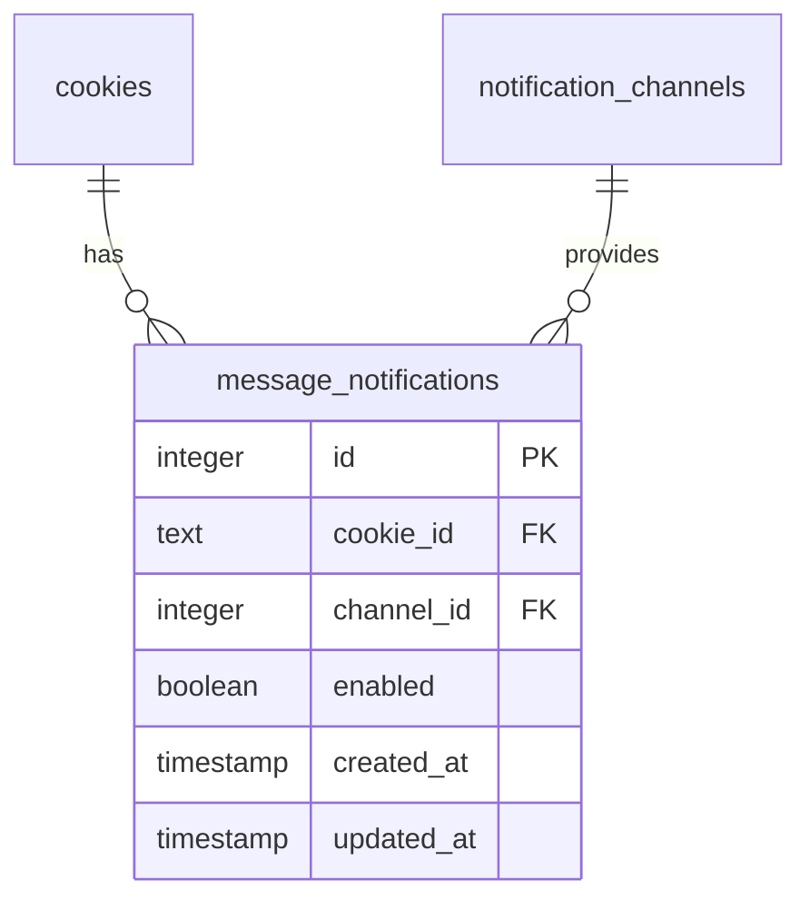

# 通知渠道表 (notification_channels)

<cite>
**本文档引用的文件**
- [db_manager.py](file://db_manager.py)
- [reply_server.py](file://reply_server.py)
- [config.py](file://config.py)
- [XianyuAutoAsync.py](file://XianyuAutoAsync.py)
- [utils/slider_patch.py](file://utils/slider_patch.py)
- [static/js/app.js](file://static/js/app.js)
</cite>

## 目录
1. [简介](#简介)
2. [表结构设计](#表结构设计)
3. [字段详细说明](#字段详细说明)
4. [数据类型与约束](#数据类型与约束)
5. [业务逻辑分析](#业务逻辑分析)
6. [多对多关联关系](#多对多关联关系)
7. [SQL建表语句](#sql建表语句)
8. [配置参数详解](#配置参数详解)
9. [使用示例](#使用示例)
10. [最佳实践](#最佳实践)

## 简介

通知渠道表 (`notification_channels`) 是消息通知系统的核心组件，负责管理各种通知渠道的配置信息。该表支持多种通知渠道类型，包括QQ、钉钉、飞书、企业微信、Telegram等，为系统提供了灵活的通知策略配置能力。

通知渠道表采用SQLite数据库实现，具有以下特点：
- 支持多种通知渠道类型
- 配置参数以JSON格式存储
- 提供启用/禁用控制
- 支持用户级别的权限管理
- 实现与cookies表的多对多关联

## 表结构设计



**图表来源**
- [db_manager.py](file://db_manager.py#L355-L391)

**节来源**
- [db_manager.py](file://db_manager.py#L355-L391)

## 字段详细说明

### 核心字段

| 字段名 | 数据类型 | 约束条件 | 业务含义 |
|--------|----------|----------|----------|
| `id` | INTEGER | PRIMARY KEY AUTOINCREMENT | 通知渠道唯一标识符，自增主键 |
| `name` | TEXT | NOT NULL | 通知渠道显示名称，用于用户界面展示 |
| `type` | TEXT | NOT NULL CHECK | 通知渠道类型，支持的类型见下文 |
| `config` | TEXT | NOT NULL | 配置参数JSON字符串，存储具体配置信息 |

### 状态控制字段

| 字段名 | 数据类型 | 默认值 | 业务含义 |
|--------|----------|--------|----------|
| `enabled` | BOOLEAN | TRUE | 启用状态标志，控制渠道是否可用 |

### 时间戳字段

| 字段名 | 数据类型 | 默认值 | 业务含义 |
|--------|----------|--------|----------|
| `created_at` | TIMESTAMP | CURRENT_TIMESTAMP | 记录创建时间 |
| `updated_at` | TIMESTAMP | CURRENT_TIMESTAMP | 记录最后更新时间 |

### 用户关联字段

| 字段名 | 数据类型 | 约束条件 | 业务含义 |
|--------|----------|----------|----------|
| `user_id` | INTEGER | NOT NULL | 关联的用户ID，实现用户级别的权限控制 |

**节来源**
- [db_manager.py](file://db_manager.py#L355-L366)

## 数据类型与约束

### type字段的CHECK约束

`type`字段使用SQLite的CHECK约束限制有效值，支持的通知渠道类型包括：

```sql
CHECK (type IN ('qq','ding_talk','dingtalk','feishu','lark','bark','email','webhook','wechat','telegram'))
```

**支持的渠道类型说明：**

| 类型 | 说明 | 示例用途 |
|------|------|----------|
| `qq` | QQ消息通知 | 个人QQ号接收通知 |
| `ding_talk` | 钉钉机器人通知 | 企业钉钉群组通知 |
| `dingtalk` | 钉钉机器人通知（兼容） | 兼容旧版本 |
| `feishu` | 飞书机器人通知 | 企业飞书群组通知 |
| `lark` | 飞书机器人通知（兼容） | 兼容旧版本 |
| `bark` | Bark推送服务 | iOS设备推送通知 |
| `email` | 邮件通知 | SMTP邮件发送 |
| `webhook` | Webhook接口通知 | 自定义HTTP回调 |
| `wechat` | 企业微信通知 | 企业微信应用通知 |
| `telegram` | Telegram通知 | Telegram机器人通知 |

### 配置参数格式要求

`config`字段存储JSON格式的配置参数，不同类型的渠道有不同的配置要求：

```json
{
  "config": "配置字符串",
  "additional_params": "额外参数"
}
```

**节来源**
- [db_manager.py](file://db_manager.py#L359-L361)

## 业务逻辑分析

### 通知渠道生命周期管理



### 配置验证流程



**节来源**
- [db_manager.py](file://db_manager.py#L1988-L2100)

## 多对多关联关系

### 与cookies表的关联

通知渠道表通过`message_notifications`中间表与cookies表建立多对多关联关系：



**图表来源**
- [db_manager.py](file://db_manager.py#L378-L391)

### 关联关系特性

1. **一对多关系**：一个通知渠道可以配置给多个cookies
2. **多对一关系**：一个cookies可以使用多个通知渠道
3. **独立配置**：每个cookies的通知配置是独立的
4. **启用控制**：可以在中间表中单独控制每个配置的启用状态

### 查询示例

获取特定cookies的所有通知配置：

```sql
SELECT mn.*, nc.name, nc.type, nc.config
FROM message_notifications mn
JOIN notification_channels nc ON mn.channel_id = nc.id
WHERE mn.cookie_id = ?
```

**节来源**
- [db_manager.py](file://db_manager.py#L378-L391)

## SQL建表语句

### 完整建表语句

```sql
CREATE TABLE IF NOT EXISTS notification_channels (
    id INTEGER PRIMARY KEY AUTOINCREMENT,
    name TEXT NOT NULL,
    type TEXT NOT NULL CHECK (type IN ('qq','ding_talk','dingtalk','feishu','lark','bark','email','webhook','wechat','telegram')),
    config TEXT NOT NULL,
    enabled BOOLEAN DEFAULT TRUE,
    created_at TIMESTAMP DEFAULT CURRENT_TIMESTAMP,
    updated_at TIMESTAMP DEFAULT CURRENT_TIMESTAMP,
    user_id INTEGER NOT NULL,
    FOREIGN KEY (user_id) REFERENCES users(id) ON DELETE CASCADE
);

CREATE TABLE IF NOT EXISTS message_notifications (
    id INTEGER PRIMARY KEY AUTOINCREMENT,
    cookie_id TEXT NOT NULL,
    channel_id INTEGER NOT NULL,
    enabled BOOLEAN DEFAULT TRUE,
    created_at TIMESTAMP DEFAULT CURRENT_TIMESTAMP,
    updated_at TIMESTAMP DEFAULT CURRENT_TIMESTAMP,
    FOREIGN KEY (cookie_id) REFERENCES cookies(id) ON DELETE CASCADE,
    FOREIGN KEY (channel_id) REFERENCES notification_channels(id) ON DELETE CASCADE,
    UNIQUE(cookie_id, channel_id)
);
```

### 索引优化

```sql
-- 为查询性能优化索引
CREATE INDEX IF NOT EXISTS idx_notification_channels_user_id ON notification_channels(user_id);
CREATE INDEX IF NOT EXISTS idx_message_notifications_cookie_id ON message_notifications(cookie_id);
CREATE INDEX IF NOT EXISTS idx_message_notifications_channel_id ON message_notifications(channel_id);
```

**节来源**
- [db_manager.py](file://db_manager.py#L355-L391)

## 配置参数详解

### 不同渠道的配置参数

#### QQ通知配置
```json
{
  "qq_number": "123456789",
  "access_token": "your_access_token"
}
```

#### 钉钉通知配置
```json
{
  "webhook_url": "https://oapi.dingtalk.com/robot/send?access_token=xxx",
  "secret_key": "your_secret_key"
}
```

#### 飞书通知配置
```json
{
  "webhook_url": "https://open.feishu.cn/open_api/chat/send",
  "app_id": "your_app_id",
  "app_secret": "your_app_secret"
}
```

#### 邮件通知配置
```json
{
  "smtp_server": "smtp.example.com",
  "smtp_port": 587,
  "smtp_user": "username@example.com",
  "smtp_password": "password",
  "smtp_from": "通知系统 <noreply@example.com>",
  "recipient_email": "admin@example.com",
  "smtp_use_tls": true,
  "smtp_use_ssl": false
}
```

#### Webhook通知配置
```json
{
  "webhook_url": "https://api.example.com/webhook",
  "headers": {
    "Content-Type": "application/json",
    "Authorization": "Bearer your_token"
  },
  "timeout": 10
}
```

**节来源**
- [XianyuAutoAsync.py](file://XianyuAutoAsync.py#L3540-L3561)
- [utils/slider_patch.py](file://utils/slider_patch.py#L46-L75)

## 使用示例

### 创建通知渠道

```python
# 创建QQ通知渠道
channel_id = db_manager.create_notification_channel(
    name="我的QQ通知",
    channel_type="qq",
    config=json.dumps({"qq_number": "123456789"}),
    user_id=1
)

# 创建钉钉通知渠道
channel_id = db_manager.create_notification_channel(
    name="工作群通知",
    channel_type="ding_talk",
    config=json.dumps({
        "webhook_url": "https://oapi.dingtalk.com/robot/send?access_token=xxx",
        "secret_key": "your_secret_key"
    }),
    user_id=1
)
```

### 设置账号通知配置

```python
# 为特定cookies设置通知
success = db_manager.set_message_notification(
    cookie_id="cookie_123",
    channel_id=channel_id,
    enabled=True
)
```

### 获取通知配置

```python
# 获取cookies的所有通知配置
notifications = db_manager.get_account_notifications("cookie_123")

# 获取所有通知渠道
channels = db_manager.get_notification_channels(user_id=1)
```

**节来源**
- [db_manager.py](file://db_manager.py#L1988-L2100)
- [reply_server.py](file://reply_server.py#L2464-L2625)

## 最佳实践

### 1. 配置参数安全

- 敏感信息（如API密钥）应加密存储
- 定期轮换配置参数
- 实施访问控制和审计日志

### 2. 性能优化

- 为频繁查询的字段建立索引
- 使用连接池管理数据库连接
- 实施适当的缓存策略

### 3. 错误处理

- 实现配置验证机制
- 提供详细的错误信息
- 支持配置回滚功能

### 4. 扩展性考虑

- 设计可插拔的通知渠道架构
- 支持动态添加新的通知渠道类型
- 实现配置模板功能

### 5. 监控和维护

- 监控通知发送成功率
- 定期检查配置有效性
- 实施通知渠道健康检查

通过合理设计和使用通知渠道表，系统能够实现灵活的通知策略配置，满足不同场景下的通知需求，提高系统的可维护性和用户体验。