# 闲鱼账号表 (cookies)

<cite>
**本文档引用的文件**
- [db_manager.py](file://db_manager.py)
- [cookie_manager.py](file://cookie_manager.py)
- [reply_server.py](file://reply_server.py)
- [app.js](file://static/js/app.js)
</cite>

## 目录
1. [简介](#简介)
2. [表结构设计](#表结构设计)
3. [字段详细说明](#字段详细说明)
4. [外键关系与数据隔离](#外键关系与数据隔离)
5. [核心业务功能](#核心业务功能)
6. [数据库迁移与升级](#数据库迁移与升级)
7. [应用架构分析](#应用架构分析)
8. [性能优化考虑](#性能优化考虑)
9. [故障排除指南](#故障排除指南)
10. [总结](#总结)

## 简介

闲鱼账号表（cookies表）是闲鱼自动回复系统的核心数据结构，负责存储和管理多个闲鱼账号的Cookie信息及相关配置。该表采用SQLite数据库实现，支持多用户数据隔离、账号密码登录、自动确认发货等功能，为系统的多账号管理提供了基础支撑。

## 表结构设计

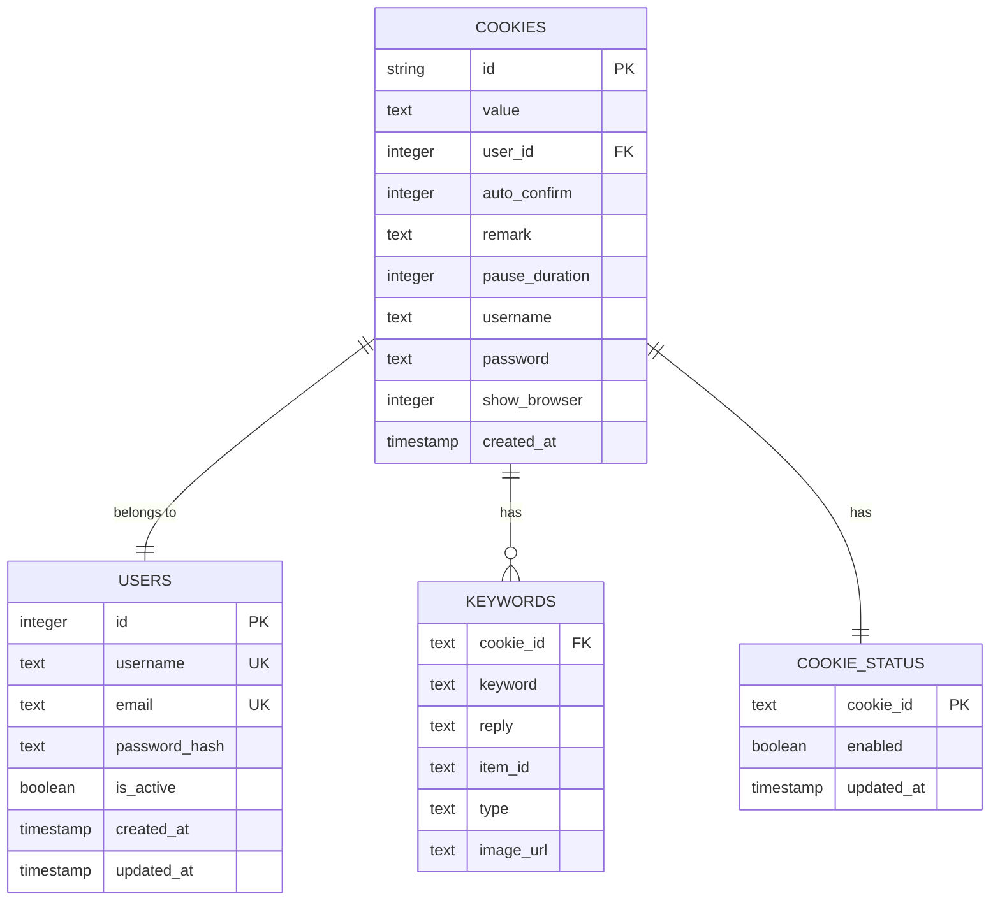

**图表来源**
- [db_manager.py](file://db_manager.py#L110-L123)

**章节来源**
- [db_manager.py](file://db_manager.py#L110-L123)

## 字段详细说明

### 核心标识字段

| 字段名 | 数据类型 | 约束条件 | 默认值 | 业务含义 |
|--------|----------|----------|--------|----------|
| `id` | TEXT | PRIMARY KEY | - | Cookie的唯一标识符，通常为闲鱼用户的sessionid |
| `value` | TEXT | NOT NULL | - | 序列化的Cookie值，包含用户登录状态信息 |

### 用户关联字段

| 字段名 | 数据类型 | 约束条件 | 默认值 | 业务含义 |
|--------|----------|----------|--------|----------|
| `user_id` | INTEGER | NOT NULL, FOREIGN KEY | - | 关联到users表的用户ID，实现多用户数据隔离 |

### 功能控制字段

| 字段名 | 数据类型 | 约束条件 | 默认值 | 业务含义 |
|--------|----------|----------|--------|----------|
| `auto_confirm` | INTEGER | DEFAULT 1 | 1 | 自动确认发货开关，1=开启，0=关闭 |
| `pause_duration` | INTEGER | DEFAULT 10 | 10 | 自动回复暂停时长（分钟），0=不暂停 |
| `remark` | TEXT | DEFAULT '' | '' | 账号备注信息，用于标记和分类 |

### 账号登录字段

| 字段名 | 数据类型 | 约束条件 | 默认值 | 业务含义 |
|--------|----------|----------|--------|----------|
| `username` | TEXT | DEFAULT '' | '' | 账号登录用户名，支持密码登录方式 |
| `password` | TEXT | DEFAULT '' | '' | 账号登录密码，支持密码登录方式 |
| `show_browser` | INTEGER | DEFAULT 0 | 0 | 浏览器显示控制，0=隐藏，1=显示 |

### 时间戳字段

| 字段名 | 数据类型 | 约束条件 | 默认值 | 业务含义 |
|--------|----------|----------|--------|----------|
| `created_at` | TIMESTAMP | DEFAULT CURRENT_TIMESTAMP | 当前时间 | 账号创建时间戳 |

**章节来源**
- [db_manager.py](file://db_manager.py#L110-L123)
- [db_manager.py](file://db_manager.py#L1267-L1286)

## 外键关系与数据隔离

### user_id外键关联机制

cookies表通过`user_id`字段与users表建立外键关联，实现了完整的多用户数据隔离机制：

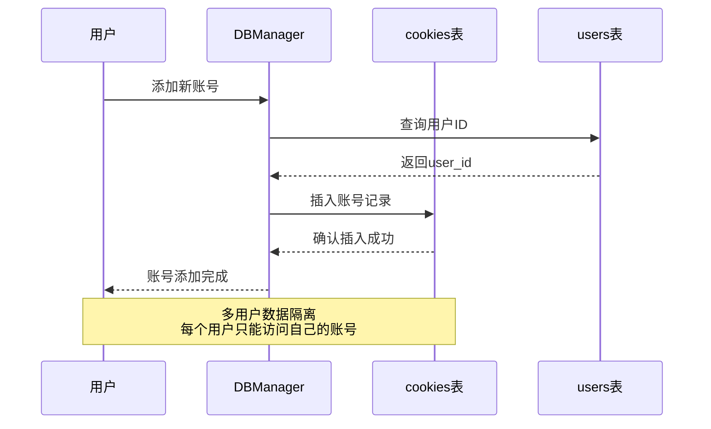

**图表来源**
- [db_manager.py](file://db_manager.py#L1162-L1172)
- [db_manager.py](file://db_manager.py#L1230-L1233)

### ON DELETE CASCADE行为

当users表中的用户记录被删除时，cookies表中关联的账号记录会自动级联删除，确保数据一致性：

- **级联删除触发条件**：users表中user_id被删除
- **影响范围**：cookies表中所有关联的账号记录
- **业务意义**：维护数据完整性，防止孤儿记录产生

**章节来源**
- [db_manager.py](file://db_manager.py#L122-L123)
- [db_manager.py](file://db_manager.py#L636-L646)

## 核心业务功能

### Cookie值管理

#### 存储格式与序列化
Cookie值采用文本格式存储，包含完整的键值对信息：

```python
# 示例Cookie值格式
cookies_str = "sessionid=abc123; sid=xyz456; token=secret789"
```

#### 值更新机制
系统支持动态更新Cookie值，无需删除重建：

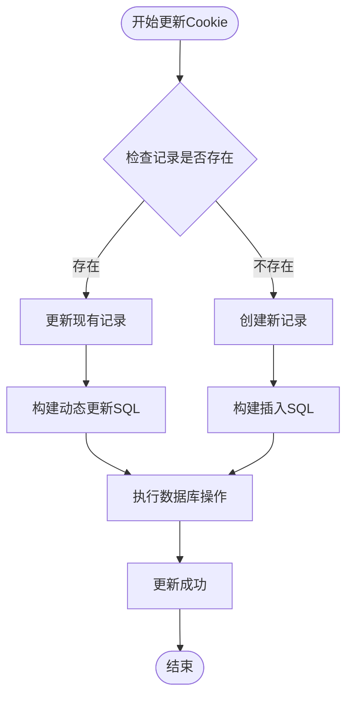

**图表来源**
- [db_manager.py](file://db_manager.py#L1357-L1441)

### 自动确认发货控制

#### auto_confirm字段逻辑
- **值1**：自动确认发货功能开启
- **值0**：自动确认发货功能关闭
- **默认值**：1（开启）

#### 控制流程
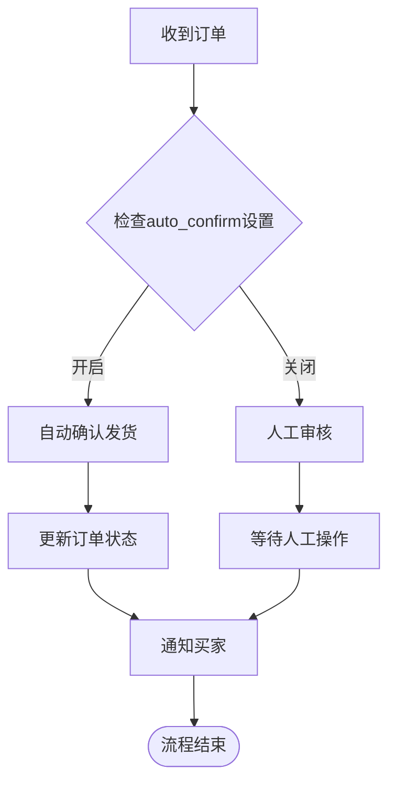

**图表来源**
- [db_manager.py](file://db_manager.py#L1292-L1303)
- [cookie_manager.py](file://cookie_manager.py#L407-L425)

### 暂停时长配置

#### pause_duration字段用途
- **单位**：分钟
- **有效值**：0（不暂停）、正整数
- **默认值**：10分钟
- **业务场景**：防止频繁回复导致账号被封禁

#### 暂停策略
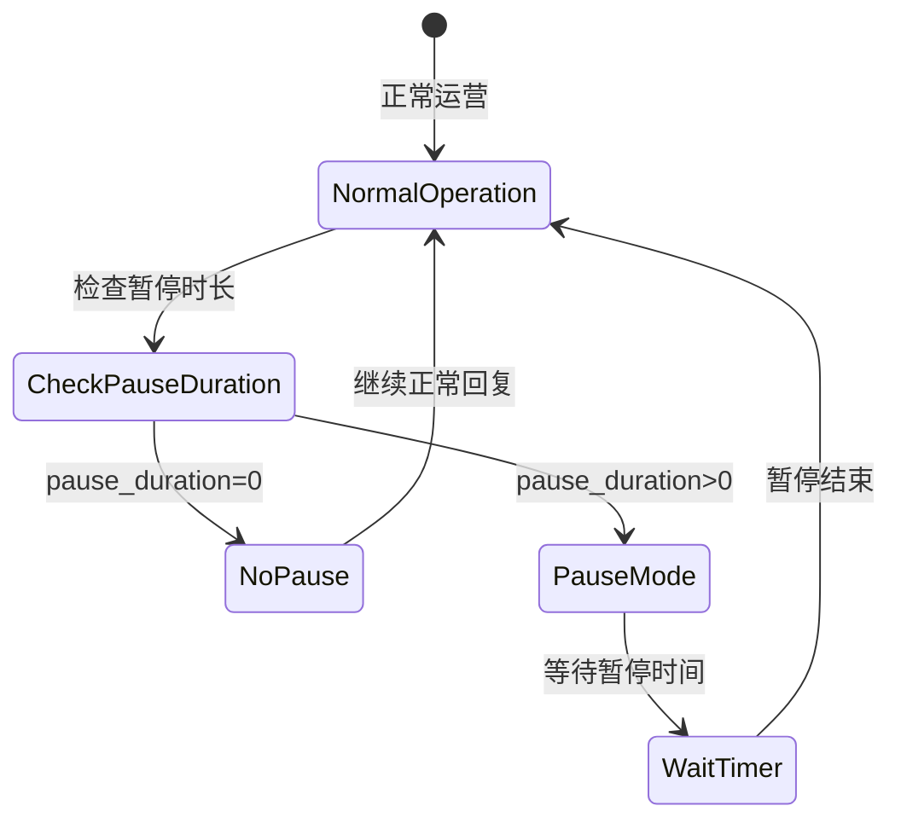

**图表来源**
- [db_manager.py](file://db_manager.py#L1318-L1349)

### 账号备注管理

#### remark字段功能
- **存储内容**：账号的自定义备注信息
- **用途**：账号标记、分类、优先级管理
- **查询支持**：支持按备注内容搜索和过滤

#### 备注更新流程
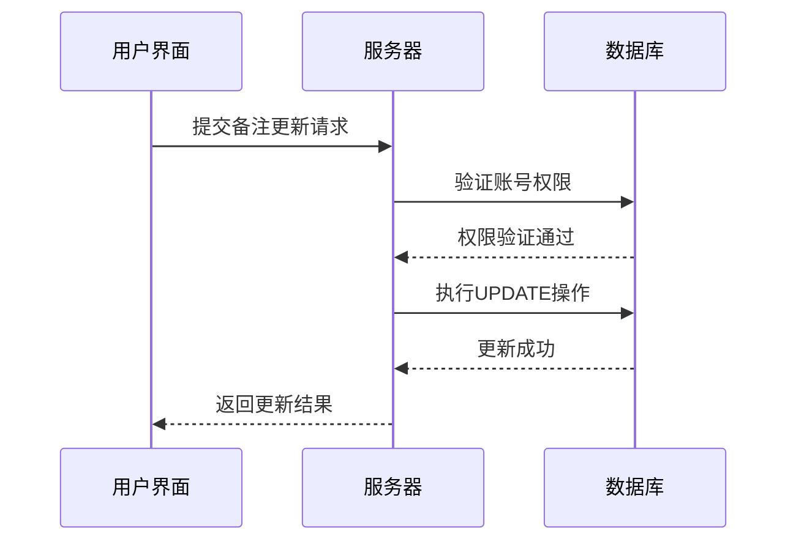

**图表来源**
- [db_manager.py](file://db_manager.py#L1305-L1316)

### 浏览器显示控制

#### show_browser字段逻辑
- **值0**：后台静默运行，不显示浏览器界面
- **值1**：显示浏览器界面，便于调试和监控
- **默认值**：0（隐藏）

#### 应用场景
- **生产环境**：建议设置为0，减少资源占用
- **开发调试**：设置为1，便于观察浏览器行为
- **监控需求**：设置为1，实时查看操作过程

**章节来源**
- [db_manager.py](file://db_manager.py#L1353-L1441)
- [app.js](file://static/js/app.js#L1572-L1574)

## 数据库迁移与升级

### 版本演进历程

系统经历了多次数据库结构升级，cookies表也随之演进：

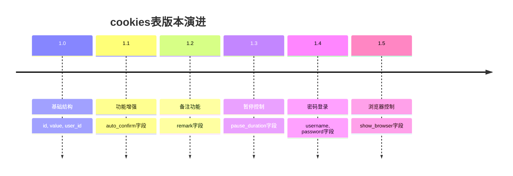

**图表来源**
- [db_manager.py](file://db_manager.py#L600-L604)
- [db_manager.py](file://db_manager.py#L918-L950)

### 升级策略

#### 自动迁移机制
系统具备自动检测和升级能力：

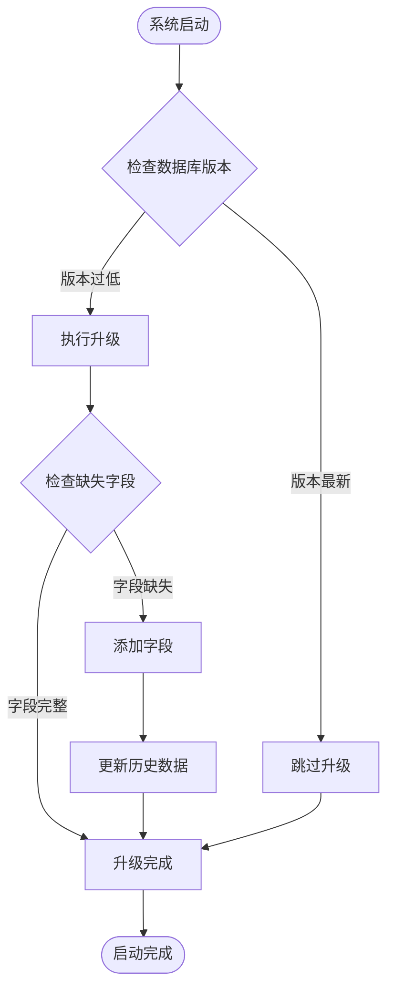

**图表来源**
- [db_manager.py](file://db_manager.py#L558-L607)

#### 字段升级示例
以username字段为例展示升级过程：

```sql
-- 检查字段是否存在
PRAGMA table_info(cookies);

-- 如果不存在，添加字段
ALTER TABLE cookies ADD COLUMN username TEXT DEFAULT '';

-- 更新历史数据
UPDATE cookies SET username = '' WHERE username IS NULL;
```

**章节来源**
- [db_manager.py](file://db_manager.py#L918-L950)
- [db_manager.py](file://db_manager.py#L453-L486)

## 应用架构分析

### 多层架构设计

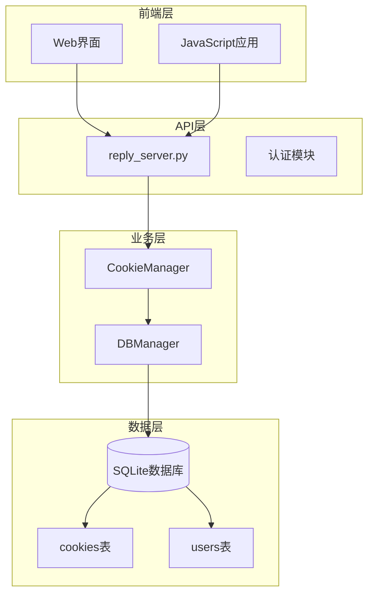

**图表来源**
- [cookie_manager.py](file://cookie_manager.py#L10-L11)
- [db_manager.py](file://db_manager.py#L15-L17)

### 核心组件交互

#### CookieManager组件职责
- **多账号管理**：同时维护多个账号的状态
- **任务调度**：为每个账号创建独立的异步任务
- **状态同步**：保持内存状态与数据库状态一致

#### 数据流处理
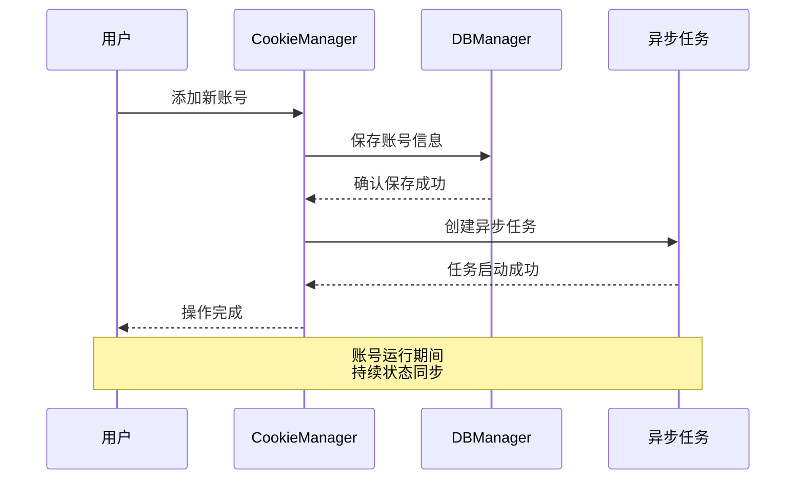

**图表来源**
- [cookie_manager.py](file://cookie_manager.py#L183-L201)
- [cookie_manager.py](file://cookie_manager.py#L333-L362)

### 并发控制机制

#### 锁机制设计
系统采用多层级锁机制确保数据一致性：

- **全局锁**：DBManager级别的数据库操作锁
- **任务锁**：CookieManager级别的任务创建锁
- **线程安全**：支持多线程并发操作

#### 锁竞争处理
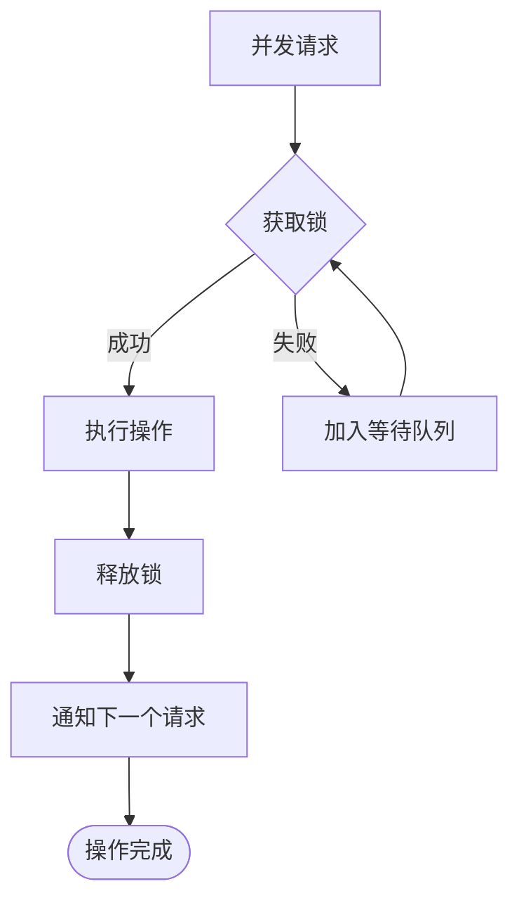

**章节来源**
- [db_manager.py](file://db_manager.py#L50-L51)
- [cookie_manager.py](file://cookie_manager.py#L113-L118)

## 性能优化考虑

### 索引策略

#### 主键索引
- **字段**：id（PRIMARY KEY）
- **用途**：快速定位单个账号记录
- **性能特点**：自动创建B-tree索引，查询效率极高

#### 外键索引
- **字段**：user_id（FOREIGN KEY）
- **用途**：支持用户维度查询
- **优化效果**：提升多用户数据隔离查询性能

### 查询优化

#### 分页查询
对于大量账号的场景，系统支持分页查询：

```python
# 用户维度查询
def get_all_cookies(self, user_id: int = None):
    if user_id is not None:
        # 使用索引查询特定用户的所有账号
        self._execute_sql(cursor, "SELECT id, value FROM cookies WHERE user_id = ?", (user_id,))
```

#### 缓存策略
- **内存缓存**：CookieManager维护内存中的账号状态
- **数据库缓存**：SQLite内置查询缓存机制
- **连接池**：复用数据库连接减少开销

### 存储优化

#### 数据压缩
- **Cookie值压缩**：存储时进行适当的压缩处理
- **文本字段优化**：合理使用TEXT类型，避免过度占用空间

#### 空值处理
- **默认值设置**：为可选字段设置合理的默认值
- **NULL值最小化**：尽量避免存储NULL值

**章节来源**
- [db_manager.py](file://db_manager.py#L1226-L1234)
- [db_manager.py](file://db_manager.py#L1155-L1192)

## 故障排除指南

### 常见问题诊断

#### 数据库连接问题
**症状**：系统启动时提示数据库连接失败
**原因**：数据库文件权限不足或路径错误
**解决方案**：
1. 检查数据库文件路径配置
2. 验证目录写入权限
3. 确认SQLite依赖安装

#### 外键约束错误
**症状**：删除用户时提示外键约束冲突
**原因**：级联删除机制未正确执行
**解决方案**：
1. 检查SQLite版本是否支持外键约束
2. 确认数据库连接设置了foreign_keys=ON
3. 手动清理关联数据

#### 字段升级失败
**症状**：系统启动时报字段不存在错误
**原因**：数据库迁移脚本执行失败
**解决方案**：
1. 检查数据库版本号
2. 手动执行缺失字段的ALTER TABLE语句
3. 重新启动系统

### 性能问题排查

#### 查询缓慢
**诊断步骤**：
1. 启用SQL日志查看执行计划
2. 检查索引使用情况
3. 分析查询语句复杂度

**优化建议**：
- 为常用查询字段添加索引
- 优化复杂查询语句
- 考虑数据分区策略

#### 内存占用过高
**排查方法**：
1. 监控CookieManager内存使用
2. 检查异步任务数量
3. 分析缓存命中率

**解决方案**：
- 限制同时运行的账号数量
- 定期清理无用的异步任务
- 优化缓存策略

### 数据恢复

#### 备份策略
系统支持完整的数据备份功能：

```python
# 系统级备份
def export_system_backup(self, user_id: int = None):
    # 备份cookies表数据
    # 备份相关关联表数据
    # 生成备份文件
```

#### 恢复流程
1. 停止系统服务
2. 恢复数据库文件
3. 重启系统服务
4. 验证数据完整性

**章节来源**
- [db_manager.py](file://db_manager.py#L2248-L2270)
- [db_manager.py](file://db_manager.py#L1195-L1211)

## 总结

闲鱼账号表（cookies表）作为系统的核心数据结构，展现了优秀的数据库设计原则和业务需求适配能力：

### 设计亮点
- **多用户隔离**：通过user_id字段实现完整的数据隔离
- **功能扩展性**：预留字段支持未来功能扩展
- **数据完整性**：完善的外键约束和级联操作
- **版本兼容性**：智能的数据库迁移机制

### 业务价值
- **多账号管理**：支持大规模账号批量管理
- **灵活配置**：丰富的功能配置选项满足不同需求
- **稳定可靠**：完善的错误处理和数据保护机制
- **易于维护**：清晰的架构设计和文档支持

### 技术优势
- **性能优化**：合理的索引策略和查询优化
- **并发安全**：完善的锁机制和事务处理
- **扩展性强**：模块化设计支持功能扩展
- **部署简单**：SQLite轻量级部署方案

该表结构不仅满足了当前业务需求，还为未来的功能扩展奠定了坚实基础，是闲鱼自动回复系统稳定运行的重要保障。