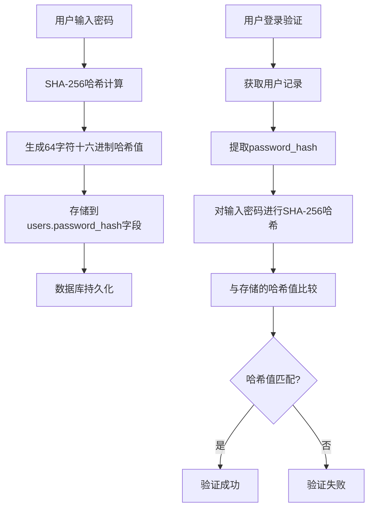
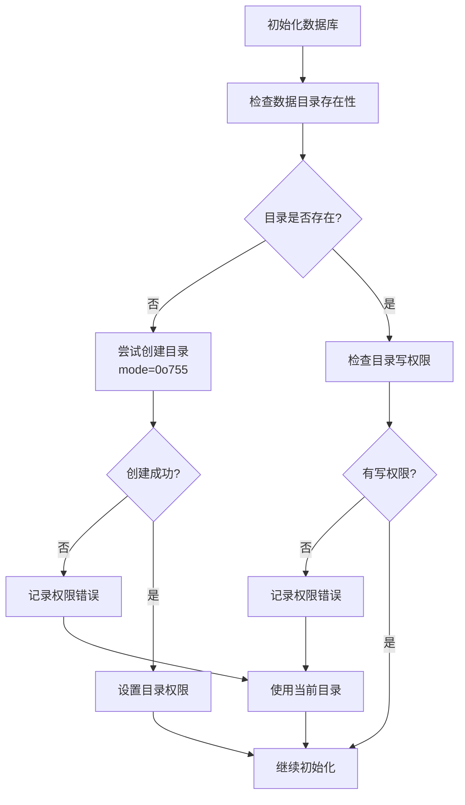
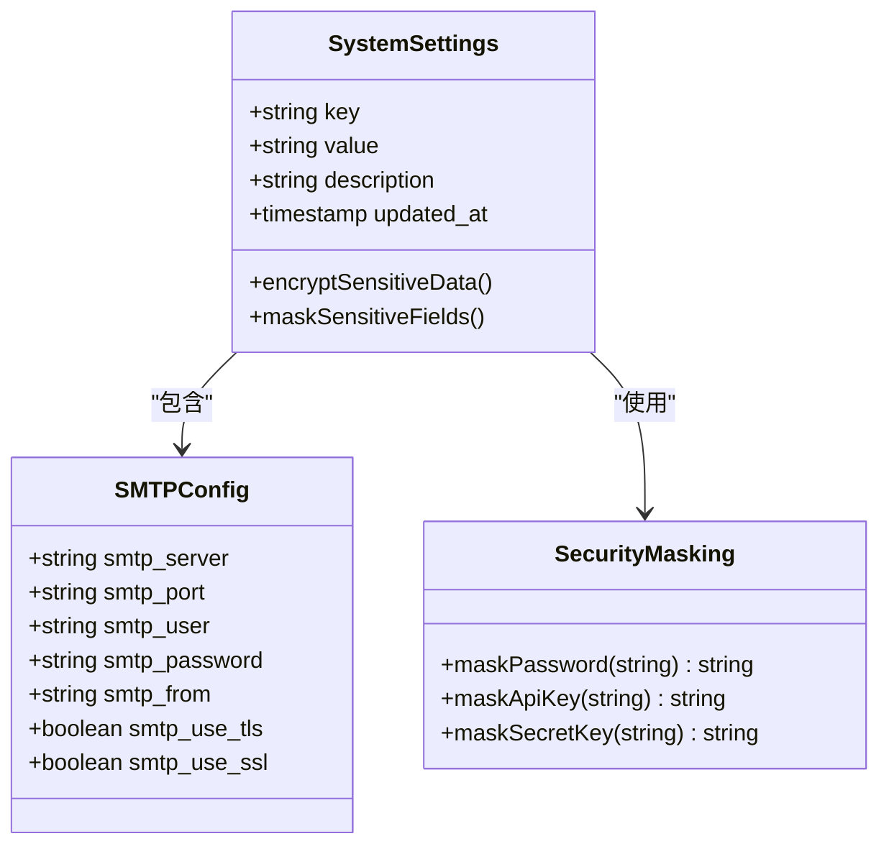
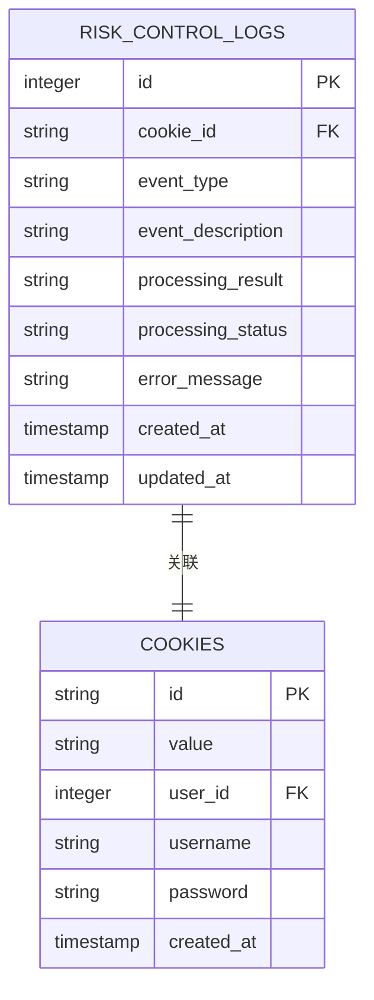
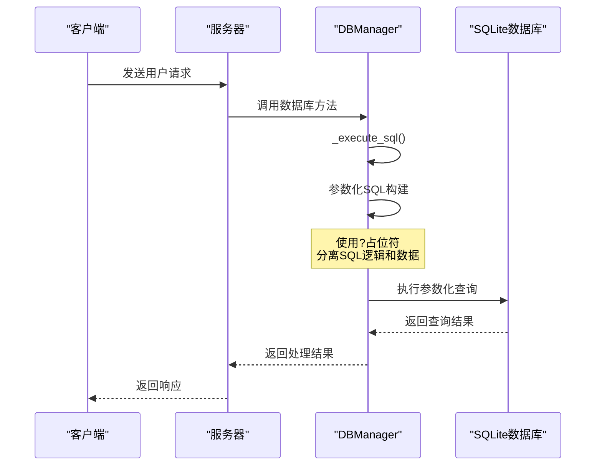
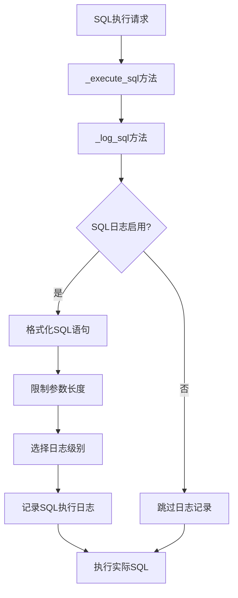

# 数据安全机制

<cite>
**本文档引用的文件**
- [db_manager.py](file://db_manager.py)
- [config.py](file://config.py)
- [static/js/app.js](file://static/js/app.js)
- [static/index.html](file://static/index.html)
- [reply_server.py](file://reply_server.py)
- [XianyuAutoAsync.py](file://XianyuAutoAsync.py)
- [README.md](file://README.md)
</cite>

## 目录
1. [概述](#概述)
2. [密码哈希存储机制](#密码哈希存储机制)
3. [数据库文件访问权限控制](#数据库文件访问权限控制)
4. [敏感字段加密存储策略](#敏感字段加密存储策略)
5. [系统设置表安全配置](#系统设置表安全配置)
6. [安全审计日志系统](#安全审计日志系统)
7. [SQL注入防护机制](#sql注入防护机制)
8. [最佳实践与安全建议](#最佳实践与安全建议)

## 概述

本系统采用多层次的安全架构来保护用户数据和系统配置。核心安全机制包括密码哈希存储、数据库文件权限控制、敏感信息加密存储、完整的审计日志系统以及严格的SQL注入防护。

## 密码哈希存储机制

### SHA-256密码哈希算法

系统使用`hashlib.sha256`算法对用户密码进行哈希处理，确保密码不会以明文形式存储。

**图表来源**
- [db_manager.py](file://db_manager.py#L2431-L2436)
- [db_manager.py](file://db_manager.py#L2508-L2509)

### 密码处理流程

系统在多个关键场景中应用密码哈希机制：

1. **用户注册时**：[`create_user`](file://db_manager.py#L2426-L2448) 方法自动对密码进行哈希处理
2. **密码验证时**：[`verify_user_password`](file://db_manager.py#L2502-L2509) 方法进行哈希比对
3. **密码更新时**：[`update_user_password`](file://db_manager.py#L2511-L2534) 方法重新生成哈希值

**章节来源**
- [db_manager.py](file://db_manager.py#L2426-L2534)

## 数据库文件访问权限控制

### 目录权限检查机制

系统实现了严格的数据库文件访问权限控制，确保数据安全。

**图表来源**
- [db_manager.py](file://db_manager.py#L25-L47)

### 权限控制特性

1. **目录创建权限**：使用`mode=0o755`确保适当的目录权限
2. **写权限验证**：运行时检查目录写权限
3. **降级策略**：权限不足时自动降级到当前目录

**章节来源**
- [db_manager.py](file://db_manager.py#L25-L47)

## 敏感字段加密存储策略

### SMTP密码保护机制

系统对SMTP密码等敏感信息实施多重保护措施。

**图表来源**
- [db_manager.py](file://db_manager.py#L430-L436)
- [static/js/app.js](file://static/js/app.js#L2580-L2585)

### API密钥保护策略

1. **前端掩码显示**：密码字段使用`type="password"`进行掩码
2. **后端传输加密**：通过HTTPS协议传输敏感配置
3. **数据库存储**：直接存储原始密钥值（配合其他安全措施）

**章节来源**
- [static/js/app.js](file://static/js/app.js#L2580-L2585)
- [db_manager.py](file://db_manager.py#L430-L436)

## 系统设置表安全配置

### system_settings表结构设计

系统设置表采用键值对结构存储配置信息，包含安全相关的配置项。

| 配置项 | 类型 | 默认值 | 安全级别 |
|--------|------|--------|----------|
| `smtp_server` | string | "" | 中等 |
| `smtp_port` | string | "587" | 低 |
| `smtp_user` | string | "" | 中等 |
| `smtp_password` | string | "" | 高 |
| `smtp_from` | string | "" | 低 |
| `smtp_use_tls` | string | "true" | 低 |
| `smtp_use_ssl` | string | "false" | 低 |
| `qq_reply_secret_key` | string | "xianyu_qq_reply_2024" | 高 |

### 安全配置项说明

1. **高风险配置**：
   - `smtp_password`：SMTP登录密码，最高安全级别
   - `qq_reply_secret_key`：QQ回复API密钥，最高安全级别

2. **中等风险配置**：
   - `smtp_server`：SMTP服务器地址
   - `smtp_user`：SMTP登录用户名

3. **低风险配置**：
   - `smtp_port`：SMTP端口号
   - `smtp_from`：发件人显示名
   - `smtp_use_tls`：TLS启用状态
   - `smtp_use_ssl`：SSL启用状态

**章节来源**
- [db_manager.py](file://db_manager.py#L430-L436)

## 安全审计日志系统

### risk_control_logs表设计

系统实现了完整的风控日志记录机制，用于跟踪安全事件和异常行为。

**图表来源**
- [db_manager.py](file://db_manager.py#L409-L421)

### 日志记录功能

1. **事件类型分类**：
   - `slider_captcha`：滑块验证码事件
   - 自定义事件类型

2. **处理状态跟踪**：
   - `processing`：处理中
   - `success`：处理成功
   - `failed`：处理失败

3. **错误信息记录**：详细记录异常信息便于排查

### 日志管理API

系统提供了完整的日志管理接口：

- [`add_risk_control_log`](file://db_manager.py#L4842-L4858)：添加风控日志
- [`update_risk_control_log`](file://db_manager.py#L4860-L4906)：更新日志状态
- [`get_risk_control_logs`](file://db_manager.py#L4908-L4949)：查询日志列表
- [`delete_risk_control_log`](file://db_manager.py#L4978-L4996)：删除日志记录

**章节来源**
- [db_manager.py](file://db_manager.py#L4842-L4996)

## SQL注入防护机制

### 参数化查询实现

系统严格使用参数化查询防止SQL注入攻击。

**图表来源**
- [db_manager.py](file://db_manager.py#L1142-L1148)

### SQL日志记录机制

系统实现了详细的SQL执行日志记录，支持调试和安全审计。

**图表来源**
- [db_manager.py](file://db_manager.py#L1108-L1141)

### 参数化查询最佳实践

1. **统一参数化方法**：[`_execute_sql`](file://db_manager.py#L1142-L1148) 和 [`_executemany_sql`](file://db_manager.py#L1150-L1153) 方法确保所有查询都使用参数化
2. **SQL语句模板**：使用`?`占位符而非字符串拼接
3. **参数类型安全**：自动处理不同类型的参数
4. **日志记录**：详细的SQL执行日志便于审计

**章节来源**
- [db_manager.py](file://db_manager.py#L1108-L1153)

## 最佳实践与安全建议

### 密码安全配置

1. **强制密码复杂度**：前端验证最小长度6位
2. **定期密码更新**：提供密码修改接口
3. **默认密码变更**：强烈建议修改默认管理员密码

### 数据库安全配置

1. **文件权限控制**：确保数据库文件权限适当
2. **目录访问控制**：限制数据库目录的访问权限
3. **备份文件保护**：数据库备份文件的安全存储

### 网络安全措施

1. **HTTPS协议**：所有敏感数据传输必须使用HTTPS
2. **API密钥保护**：定期轮换API密钥
3. **访问控制**：实施适当的访问控制策略

### 监控与审计

1. **日志记录**：完整的操作日志记录
2. **异常监控**：实时监控异常访问行为
3. **定期审计**：定期审查系统配置和访问日志

**章节来源**
- [static/js/app.js](file://static/js/app.js#L5026-L5037)
- [README.md](file://README.md#L703-L712)