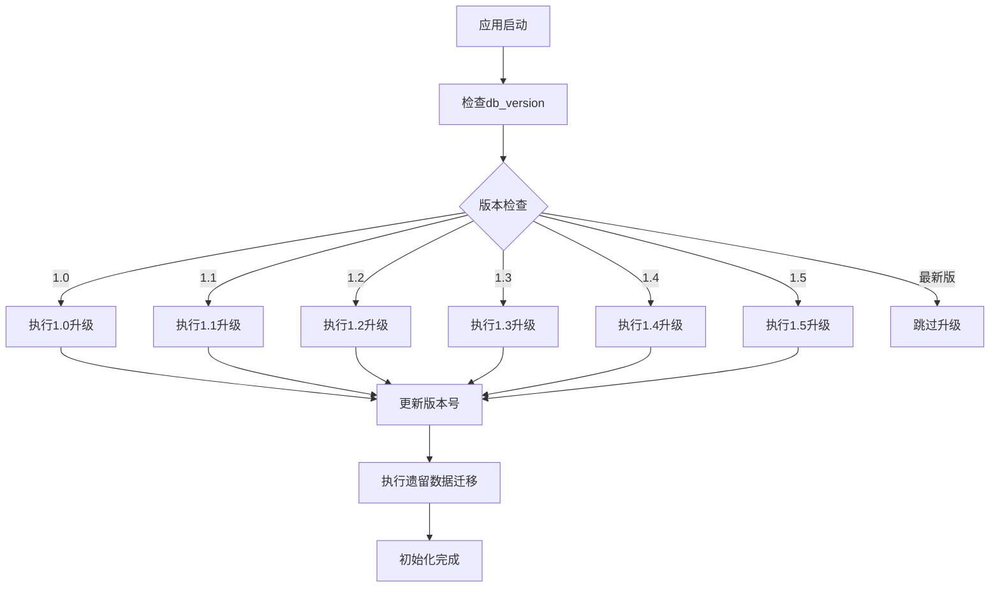
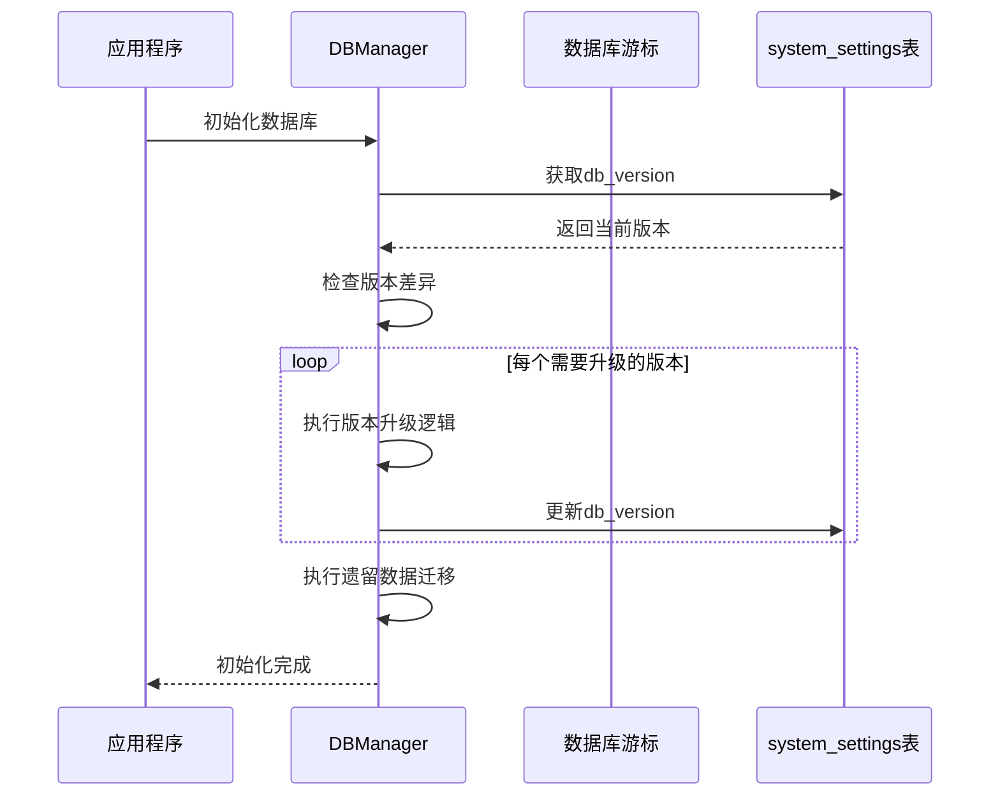
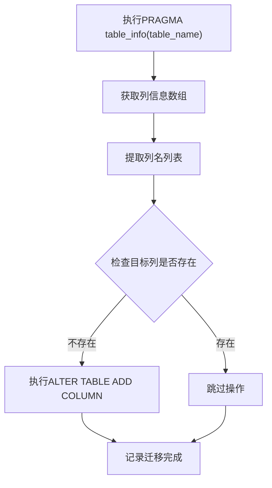
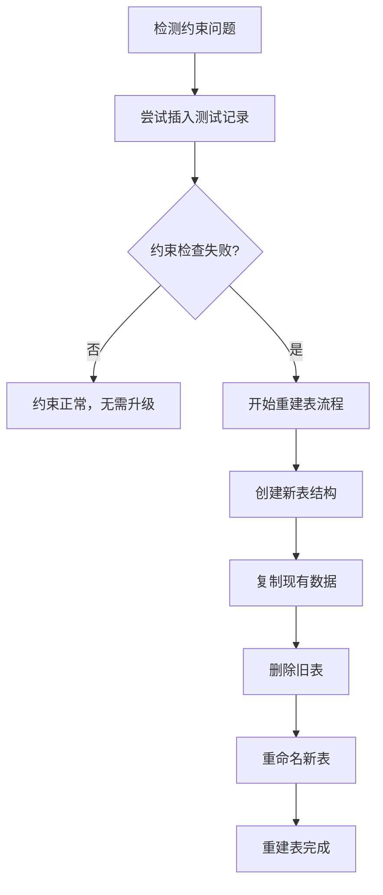

# 数据库迁移策略

<cite>
**本文档引用的文件**
- [db_manager.py](file://db_manager.py)
- [config.py](file://config.py)
</cite>

## 目录
1. [概述](#概述)
2. [数据库版本控制系统](#数据库版本控制系统)
3. [核心迁移机制](#核心迁移机制)
4. [版本演进历程](#版本演进历程)
5. [动态列检测机制](#动态列检测机制)
6. [表结构变更流程](#表结构变更流程)
7. [自定义迁移脚本指南](#自定义迁移脚本指南)
8. [最佳实践与注意事项](#最佳实践与注意事项)
9. [故障排除](#故障排除)

## 概述

本文档详细分析了`db_manager.py`中实现的数据库版本控制与迁移机制。该系统采用渐进式升级策略，通过版本号跟踪和自动化迁移流程，确保数据库结构的平滑演进，同时保证数据安全性和应用稳定性。

## 数据库版本控制系统

### 版本管理架构

系统通过`system_settings`表维护数据库版本信息，使用`db_version`键存储当前版本号。



**图表来源**
- [db_manager.py](file://db_manager.py#L557-L608)

### 版本检查机制

版本检查通过`check_and_upgrade_db()`方法实现，该方法按顺序检查每个版本的升级需求：

**章节来源**
- [db_manager.py](file://db_manager.py#L557-L608)

## 核心迁移机制

### check_and_upgrade_db() 方法详解

该方法是整个迁移系统的核心入口，负责协调各个版本的升级流程：



**图表来源**
- [db_manager.py](file://db_manager.py#L557-L608)

### _migrate_database() 方法

专门处理即时性的数据库迁移任务，主要负责添加新字段和更新约束：

**章节来源**
- [db_manager.py](file://db_manager.py#L453-L485)

## 版本演进历程

### 从1.0到1.5的演进过程

#### 版本1.0 - 基础功能完善
- 添加`user_id`字段到`cards`表
- 添加`delay_seconds`字段到`cards`表
- 添加`item_id`字段到`keywords`表
- 引入多规格商品支持
- 添加多数量发货功能

#### 版本1.1 - 通知系统增强
- 升级`notification_channels`表结构
- 支持更多通知渠道类型
- 数据类型映射和转换

#### 版本1.2 - 通知渠道扩展
- 扩展通知渠道类型支持
- 完善类型标准化机制

#### 版本1.3 - 图片关键词支持
- 升级`keywords`表支持图片类型
- 添加`image_url`字段
- 重构唯一约束逻辑

#### 版本1.4 - 通知系统优化
- 再次升级通知渠道类型
- 统一类型名称规范

#### 版本1.5 - 账号登录功能
- 为`cookies`表添加账号登录字段
- 新增`username`、`password`、`show_browser`字段
- 支持密码登录模式

**章节来源**
- [db_manager.py](file://db_manager.py#L564-L604)

## 动态列检测机制

### PRAGMA table_info() 的应用

系统使用SQLite的PRAGMA命令动态检测表结构变化：



**图表来源**
- [db_manager.py](file://db_manager.py#L456-L458)
- [db_manager.py](file://db_manager.py#L468-L470)

### 列检测的实际应用

系统在多个场景中使用这种检测机制：

1. **cards表字段添加**：检查`image_url`、`is_multi_spec`、`spec_name`、`spec_value`字段
2. **cookies表字段添加**：检查`remark`、`pause_duration`、`username`、`password`、`show_browser`字段
3. **notification_channels表约束升级**：测试CHECK约束兼容性

**章节来源**
- [db_manager.py](file://db_manager.py#L453-L485)

## 表结构变更流程

### 约束升级策略

对于复杂的约束升级，系统采用重建表的方式：



**图表来源**
- [db_manager.py](file://db_manager.py#L488-L554)

### 关键词表约束迁移

`keywords`表的约束迁移是最复杂的案例，需要支持基于`item_id`的条件唯一性：

**章节来源**
- [db_manager.py](file://db_manager.py#L1036-L1094)

## 自定义迁移脚本指南

### 新增字段迁移模板

```python
def upgrade_custom_table_for_new_feature(self, cursor):
    """为自定义表添加新功能字段"""
    try:
        # 检查字段是否存在
        try:
            self._execute_sql(cursor, "SELECT new_field FROM custom_table LIMIT 1")
            logger.info("custom_table新字段已存在")
        except sqlite3.OperationalError:
            # 字段不存在，需要添加
            self._execute_sql(cursor, "ALTER TABLE custom_table ADD COLUMN new_field TEXT DEFAULT ''")
            logger.info("为custom_table添加新字段")
        
        return True
    except Exception as e:
        logger.error(f"升级custom_table字段失败: {e}")
        raise
```

### 修改约束迁移模板

```python
def upgrade_custom_table_constraints(self, cursor):
    """升级自定义表的约束"""
    try:
        # 测试新约束
        try:
            cursor.execute('''
                INSERT INTO custom_table (id, name, type)
                VALUES ('__test_constraint__', 'test', 'valid_type')
            ''')
            cursor.execute("DELETE FROM custom_table WHERE id = '__test_constraint__'")
            logger.info("自定义表约束检查通过")
        except Exception as e:
            if "CHECK constraint failed" in str(e):
                logger.info("检测到旧约束，开始升级...")
                # 执行重建表流程...
            else:
                raise
        
        return True
    except Exception as e:
        logger.error(f"升级自定义表约束失败: {e}")
        raise
```

### 数据转换迁移模板

```python
def migrate_custom_data(self, cursor):
    """迁移自定义数据格式"""
    try:
        # 检查需要迁移的数据
        cursor.execute("SELECT COUNT(*) FROM old_custom_table")
        count = cursor.fetchone()[0]
        
        if count > 0:
            # 获取旧数据
            cursor.execute("SELECT * FROM old_custom_table")
            old_data = cursor.fetchall()
            
            # 执行数据转换
            for row in old_data:
                # 数据转换逻辑
                new_value = self.transform_old_format(row[1])
                
                # 插入新格式数据
                cursor.execute('''
                    INSERT INTO new_custom_table (id, transformed_data)
                    VALUES (?, ?)
                ''', (row[0], new_value))
            
            logger.info(f"成功迁移 {count} 条自定义数据")
        
        return True
    except Exception as e:
        logger.error(f"迁移自定义数据失败: {e}")
        raise
```

## 最佳实践与注意事项

### 迁移安全性原则

1. **事务保护**：所有迁移操作应在事务中执行
2. **回滚机制**：关键操作应具备回滚能力
3. **数据备份**：重要迁移前建议备份数据
4. **版本兼容性**：确保新旧版本的兼容性

### 性能优化建议

1. **批量操作**：对大量数据的操作使用批量处理
2. **索引优化**：在迁移后及时重建必要的索引
3. **内存管理**：大数据量迁移时注意内存使用

### 错误处理策略

1. **优雅降级**：迁移失败不应影响应用启动
2. **详细日志**：记录详细的迁移过程和错误信息
3. **状态监控**：提供迁移状态查询接口

## 故障排除

### 常见问题及解决方案

#### 迁移失败
- **原因**：数据格式不兼容或约束冲突
- **解决**：检查数据格式，清理冲突数据

#### 版本升级卡住
- **原因**：版本号设置错误或迁移逻辑问题
- **解决**：手动更新`system_settings`表中的版本号

#### 数据丢失
- **原因**：迁移脚本错误或意外中断
- **解决**：从备份恢复，重新执行迁移

### 调试技巧

1. **启用SQL日志**：设置`SQL_LOG_ENABLED=true`和适当的日志级别
2. **检查迁移状态**：查询`system_settings`表确认版本号
3. **验证数据完整性**：迁移后运行数据一致性检查

**章节来源**
- [db_manager.py](file://db_manager.py#L1108-L1153)