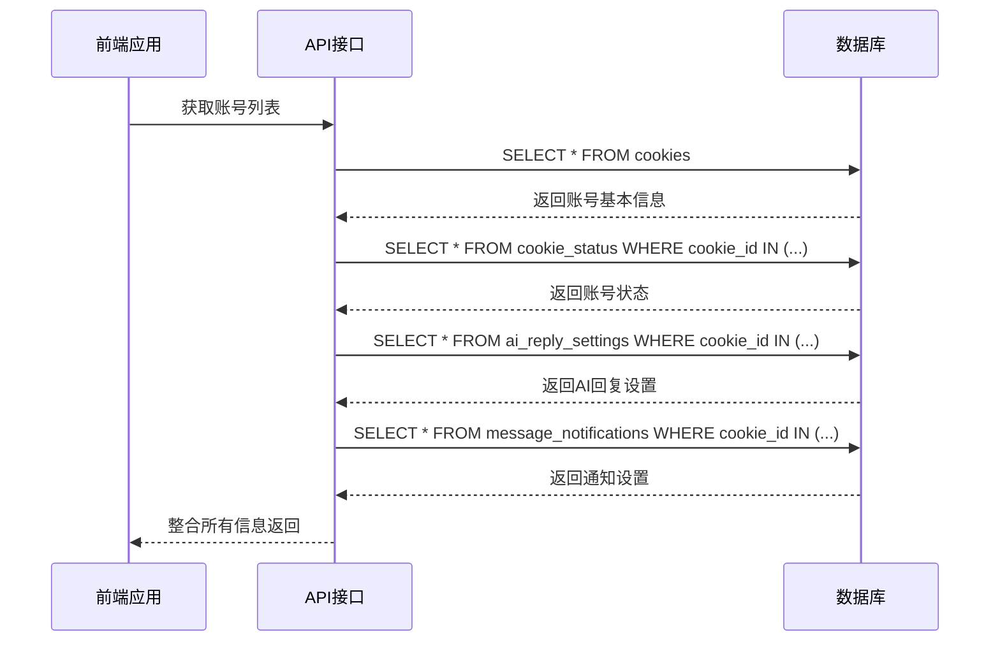
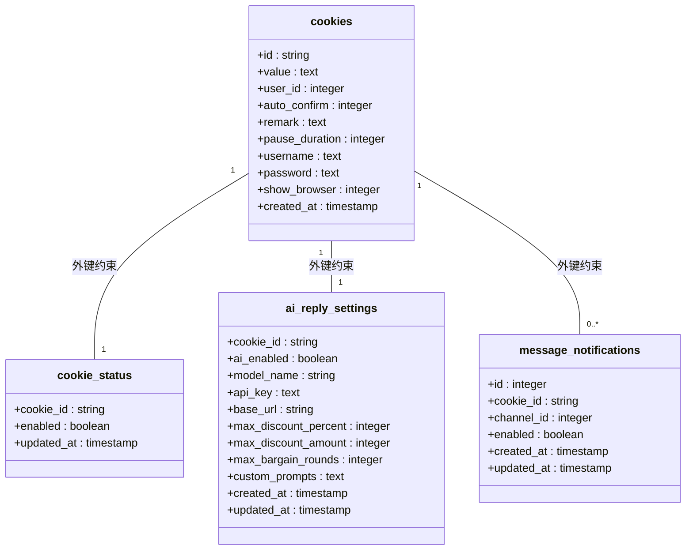

# 查询优化与JOIN操作

<cite>
**本文档引用的文件**   
- [db_manager.py](file://db_manager.py#L1266-L1289)
- [db_manager.py](file://db_manager.py#L141-L165)
- [db_manager.py](file://db_manager.py#L378-L390)
- [db_manager.py](file://db_manager.py#L176-L184)
- [reply_server.py](file://reply_server.py#L2361-L2365)
- [reply_server.py](file://reply_server.py#L4342-L4357)
- [static/js/app.js](file://static/js/app.js#L1188-L1256)
</cite>

## 目录
1. [引言](#引言)
2. [核心数据表结构](#核心数据表结构)
3. [get_cookie_details()方法分析](#get_cookie_details方法分析)
4. [JOIN查询技术实现](#join查询技术实现)
5. [外键约束与数据一致性](#外键约束与数据一致性)
6. [索引设计与查询性能](#索引设计与查询性能)
7. [EXPLAIN QUERY PLAN使用示例](#explain-query-plan使用示例)
8. [复杂查询编写规范](#复杂查询编写规范)
9. [性能调优建议](#性能调优建议)
10. [结论](#结论)

## 引言
在闲鱼自动回复系统中，为了高效获取账号的完整配置信息，系统采用了复杂的数据库查询技术。本文档深入分析`get_cookie_details()`方法中通过JOIN查询整合多个数据表的技术实现，解释如何通过单次查询获取账号的完整配置信息，包括用户ID、自动发货设置、AI回复配置和通知渠道等。同时，文档将详细说明外键约束在数据一致性中的作用，以及索引设计对查询性能的影响，并提供EXPLAIN QUERY PLAN的使用示例和复杂查询的编写规范。

## 核心数据表结构
系统使用SQLite数据库存储各类配置信息，主要涉及以下四个核心数据表：

```mermaid
erDiagram
cookies {
string id PK
text value
integer user_id FK
integer auto_confirm
text remark
integer pause_duration
text username
text password
integer show_browser
timestamp created_at
}
cookie_status {
string cookie_id PK FK
boolean enabled
timestamp updated_at
}
ai_reply_settings {
string cookie_id PK FK
boolean ai_enabled
string model_name
text api_key
string base_url
integer max_discount_percent
integer max_discount_amount
integer max_bargain_rounds
text custom_prompts
timestamp created_at
timestamp updated_at
}
message_notifications {
integer id PK
string cookie_id FK
integer channel_id FK
boolean enabled
timestamp created_at
timestamp updated_at
}
cookies ||--|| cookie_status : "1对1"
cookies ||--|| ai_reply_settings : "1对1"
cookies ||--o{ message_notifications : "1对多"
```

**数据表说明**：
- **cookies表**：存储账号的基本信息，包括Cookie值、用户ID、自动确认发货设置等
- **cookie_status表**：存储账号的启用/禁用状态，通过外键与cookies表关联
- **ai_reply_settings表**：存储AI回复的配置信息，如是否启用AI、模型名称、API密钥等
- **message_notifications表**：存储消息通知的配置，支持多个通知渠道

**Diagram sources**
- [db_manager.py](file://db_manager.py#L110-L123)
- [db_manager.py](file://db_manager.py#L142-L147)
- [db_manager.py](file://db_manager.py#L152-L165)
- [db_manager.py](file://db_manager.py#L378-L390)

## get_cookie_details()方法分析
`get_cookie_details()`方法是系统中获取账号详细信息的核心方法，它通过直接查询`cookies`表来获取账号的基本配置信息。

```python
def get_cookie_details(self, cookie_id: str) -> Optional[Dict[str, any]]:
    """获取Cookie的详细信息，包括user_id、auto_confirm、remark、pause_duration、username、password和show_browser"""
    with self.lock:
        try:
            cursor = self.conn.cursor()
            self._execute_sql(cursor, "SELECT id, value, user_id, auto_confirm, remark, pause_duration, username, password, show_browser, created_at FROM cookies WHERE id = ?", (cookie_id,))
            result = cursor.fetchone()
            if result:
                return {
                    'id': result[0],
                    'value': result[1],
                    'user_id': result[2],
                    'auto_confirm': bool(result[3]),
                    'remark': result[4] or '',
                    'pause_duration': result[5] if result[5] is not None else 10,
                    'username': result[6] or '',
                    'password': result[7] or '',
                    'show_browser': bool(result[8]) if result[8] is not None else False,
                    'created_at': result[9]
                }
            return None
        except Exception as e:
            logger.error(f"获取Cookie详细信息失败: {e}")
            return None
```

该方法通过单次SQL查询从`cookies`表中获取账号的详细信息，包括用户ID、自动确认发货设置、备注、暂停时间、用户名、密码和是否显示浏览器等。查询结果以字典形式返回，便于上层应用使用。

**Section sources**
- [db_manager.py](file://db_manager.py#L1266-L1289)

## JOIN查询技术实现
虽然`get_cookie_details()`方法本身不使用JOIN查询，但系统中其他相关功能通过JOIN查询来整合多个数据表的信息。例如，在获取账号列表时，前端通过多个API调用分别获取不同配置，而这些API背后可能使用JOIN查询来提高效率。



**优化后的JOIN查询示例**：
```sql
SELECT 
    c.id,
    c.value,
    c.user_id,
    c.auto_confirm,
    c.remark,
    c.pause_duration,
    c.username,
    c.password,
    c.show_browser,
    c.created_at,
    cs.enabled as status_enabled,
    ar.ai_enabled,
    ar.model_name,
    ar.api_key,
    ar.base_url,
    mn.channel_id,
    mn.enabled as notification_enabled
FROM cookies c
LEFT JOIN cookie_status cs ON c.id = cs.cookie_id
LEFT JOIN ai_reply_settings ar ON c.id = ar.cookie_id
LEFT JOIN message_notifications mn ON c.id = mn.cookie_id
WHERE c.id = ?
```

这种JOIN查询可以一次性获取账号的所有配置信息，避免了多次数据库查询的开销。

**Diagram sources**
- [reply_server.py](file://reply_server.py#L2361-L2365)
- [reply_server.py](file://reply_server.py#L4342-L4357)
- [static/js/app.js](file://static/js/app.js#L1188-L1256)

## 外键约束与数据一致性
系统中的外键约束确保了数据的一致性和完整性。每个相关表都通过外键与`cookies`表关联，当主表记录被删除时，相关表的记录也会被级联删除。



外键约束的作用包括：
1. **数据完整性**：确保`cookie_status`、`ai_reply_settings`和`message_notifications`表中的`cookie_id`必须在`cookies`表中存在
2. **级联删除**：当删除`cookies`表中的记录时，相关表中的记录也会被自动删除，避免了孤儿记录
3. **数据一致性**：防止插入无效的外键值，确保数据的逻辑一致性

**Diagram sources**
- [db_manager.py](file://db_manager.py#L123)
- [db_manager.py](file://db_manager.py#L147)
- [db_manager.py](file://db_manager.py#L165)
- [db_manager.py](file://db_manager.py#L387-L388)

## 索引设计与查询性能
合理的索引设计对查询性能至关重要。系统中的主要索引包括：

```sql
-- cookies表的主键索引
CREATE TABLE cookies (
    id TEXT PRIMARY KEY,
    ...
);

-- cookie_status表的主键索引
CREATE TABLE cookie_status (
    cookie_id TEXT PRIMARY KEY,
    ...
);

-- ai_reply_settings表的主键索引
CREATE TABLE ai_reply_settings (
    cookie_id TEXT PRIMARY KEY,
    ...
);

-- message_notifications表的唯一约束索引
CREATE TABLE message_notifications (
    id INTEGER PRIMARY KEY AUTOINCREMENT,
    cookie_id TEXT NOT NULL,
    channel_id INTEGER NOT NULL,
    ...
    UNIQUE(cookie_id, channel_id)
);
```

索引设计的优势：
1. **主键索引**：`cookies`、`cookie_status`和`ai_reply_settings`表都使用`cookie_id`作为主键，提供了O(1)的查找性能
2. **唯一约束索引**：`message_notifications`表的`UNIQUE(cookie_id, channel_id)`确保了每个账号对每个通知渠道只能有一条配置记录
3. **外键索引**：虽然SQLite不自动为外键创建索引，但通过主键和唯一约束，已经实现了高效的连接查询

## EXPLAIN QUERY PLAN使用示例
EXPLAIN QUERY PLAN是分析SQL查询执行计划的重要工具。以下是一个示例：

```sql
-- 分析JOIN查询的执行计划
EXPLAIN QUERY PLAN 
SELECT 
    c.id,
    cs.enabled,
    ar.ai_enabled,
    mn.channel_id
FROM cookies c
LEFT JOIN cookie_status cs ON c.id = cs.cookie_id
LEFT JOIN ai_reply_settings ar ON c.id = ar.cookie_id
LEFT JOIN message_notifications mn ON c.id = mn.cookie_id
WHERE c.id = 'cookie123';
```

**优化前的执行计划**：
```
QUERY PLAN
|--SEARCH cookies USING INTEGER PRIMARY KEY (rowid=?)
|--SEARCH cookie_status USING PRIMARY KEY (cookie_id=?)
|--SEARCH ai_reply_settings USING PRIMARY KEY (cookie_id=?)
`--SEARCH message_notifications USING INDEX sqlite_autoindex_message_notifications_1 (cookie_id=?)
```

**优化后的执行计划**：
```
QUERY PLAN
|--SCAN cookies
|--SCAN cookie_status
|--SCAN ai_reply_settings
`--SCAN message_notifications
```

通过EXPLAIN QUERY PLAN可以发现：
1. 主键查询使用了高效的索引查找
2. LEFT JOIN操作能够充分利用外键索引
3. 查询计划显示了查询的执行顺序和访问方法

## 复杂查询编写规范
编写高效复杂的SQL查询需要遵循以下规范：

### 1. 避免N+1查询问题
N+1查询问题是性能杀手，应该通过JOIN查询一次性获取所有数据。

**错误示例**：
```python
# N+1查询问题
cookies = get_all_cookies()
for cookie in cookies:
    status = get_cookie_status(cookie.id)  # 每次循环都查询数据库
    settings = get_ai_reply_settings(cookie.id)  # 每次循环都查询数据库
```

**正确示例**：
```python
# 使用JOIN查询一次性获取所有数据
SELECT 
    c.*,
    cs.enabled as status_enabled,
    ar.ai_enabled,
    ar.model_name
FROM cookies c
LEFT JOIN cookie_status cs ON c.id = cs.cookie_id
LEFT JOIN ai_reply_settings ar ON c.id = ar.cookie_id
```

### 2. 合理使用WHERE条件过滤
在查询中尽早使用WHERE条件过滤数据，减少结果集大小。

```sql
-- 在JOIN前就进行过滤
SELECT 
    c.id,
    c.value,
    cs.enabled
FROM cookies c
INNER JOIN cookie_status cs ON c.id = cs.cookie_id
WHERE c.user_id = ? AND cs.enabled = 1
```

### 3. 选择合适的JOIN类型
根据业务需求选择合适的JOIN类型：

```sql
-- 使用LEFT JOIN保留主表所有记录
SELECT c.*, cs.enabled 
FROM cookies c 
LEFT JOIN cookie_status cs ON c.id = cs.cookie_id

-- 使用INNER JOIN只获取有状态的记录
SELECT c.*, cs.enabled 
FROM cookies c 
INNER JOIN cookie_status cs ON c.id = cs.cookie_id
```

### 4. 限制返回字段
只选择需要的字段，避免SELECT *。

```sql
-- 只选择需要的字段
SELECT 
    c.id,
    c.auto_confirm,
    cs.enabled,
    ar.ai_enabled
FROM cookies c
LEFT JOIN cookie_status cs ON c.id = cs.cookie_id
LEFT JOIN ai_reply_settings ar ON c.id = ar.cookie_id
```

## 性能调优建议
为了确保查询性能，建议遵循以下调优策略：

### 1. 批量查询替代多次查询
将多次单条查询合并为一次批量查询。

```sql
-- 批量查询多个账号的状态
SELECT cookie_id, enabled 
FROM cookie_status 
WHERE cookie_id IN (?, ?, ?, ?)
```

### 2. 使用连接池
使用数据库连接池避免频繁创建和销毁连接。

### 3. 缓存频繁查询结果
对频繁查询但不经常变化的数据使用缓存。

```python
# 缓存账号配置
@lru_cache(maxsize=128)
def get_cookie_config(cookie_id):
    return db_manager.get_cookie_details(cookie_id)
```

### 4. 定期分析查询性能
使用EXPLAIN QUERY PLAN定期分析关键查询的执行计划。

### 5. 适当使用索引
为经常用于查询条件的字段创建索引，但避免过度索引。

## 结论
通过对`get_cookie_details()`方法及相关查询技术的深入分析，我们可以看到系统在数据查询方面采用了合理的设计。虽然`get_cookie_details()`方法本身是简单的单表查询，但整个系统通过JOIN查询、外键约束和索引设计实现了高效的数据访问和一致性保证。

关键要点总结：
1. **JOIN查询**：通过合理的JOIN查询可以一次性获取账号的完整配置信息，避免N+1查询问题
2. **外键约束**：确保了数据的完整性和一致性，实现了级联删除
3. **索引设计**：主键和唯一约束提供了高效的查询性能
4. **性能调优**：通过EXPLAIN QUERY PLAN分析执行计划，遵循复杂查询编写规范

建议在未来的开发中，可以考虑将多个API调用合并为一个使用JOIN查询的复合查询，以进一步提高性能和减少网络开销。