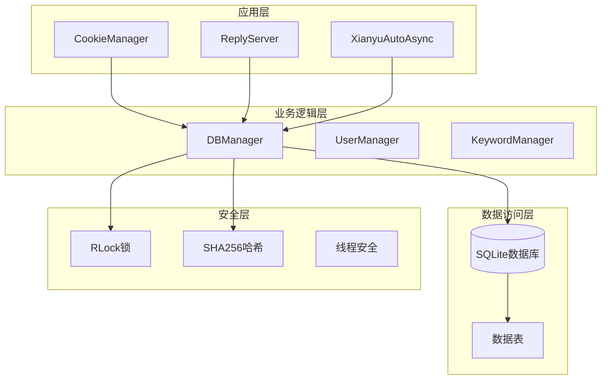
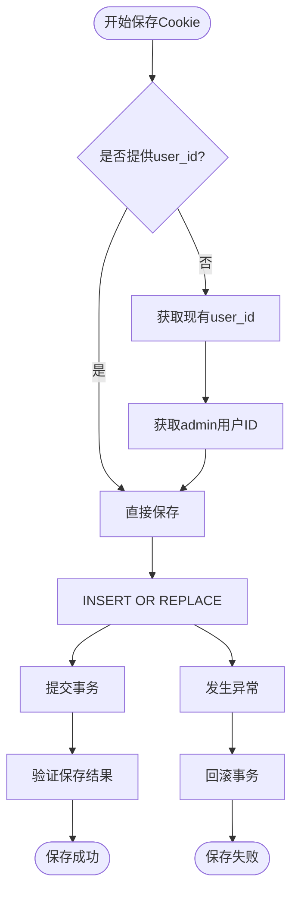
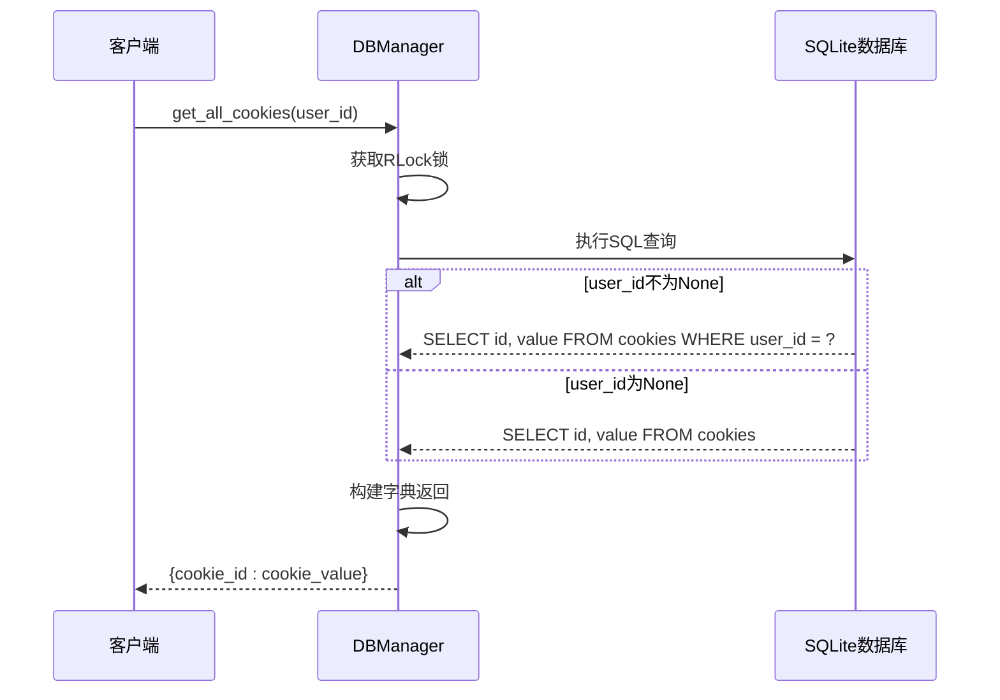
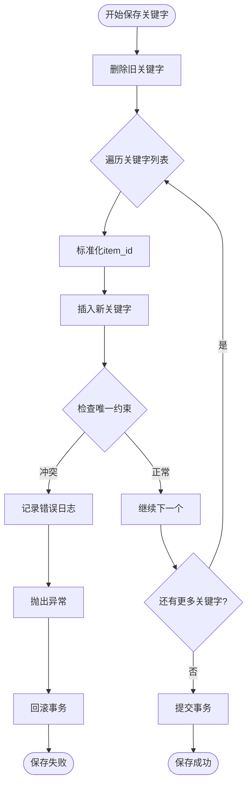
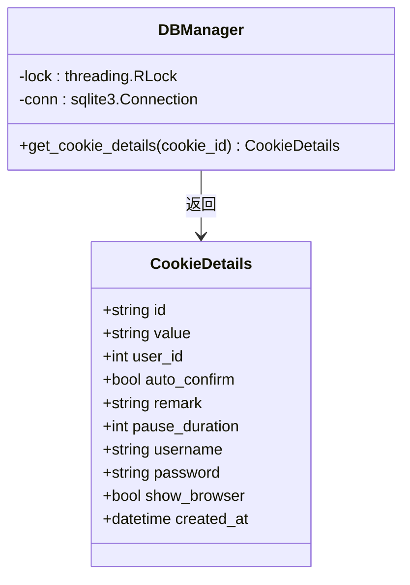
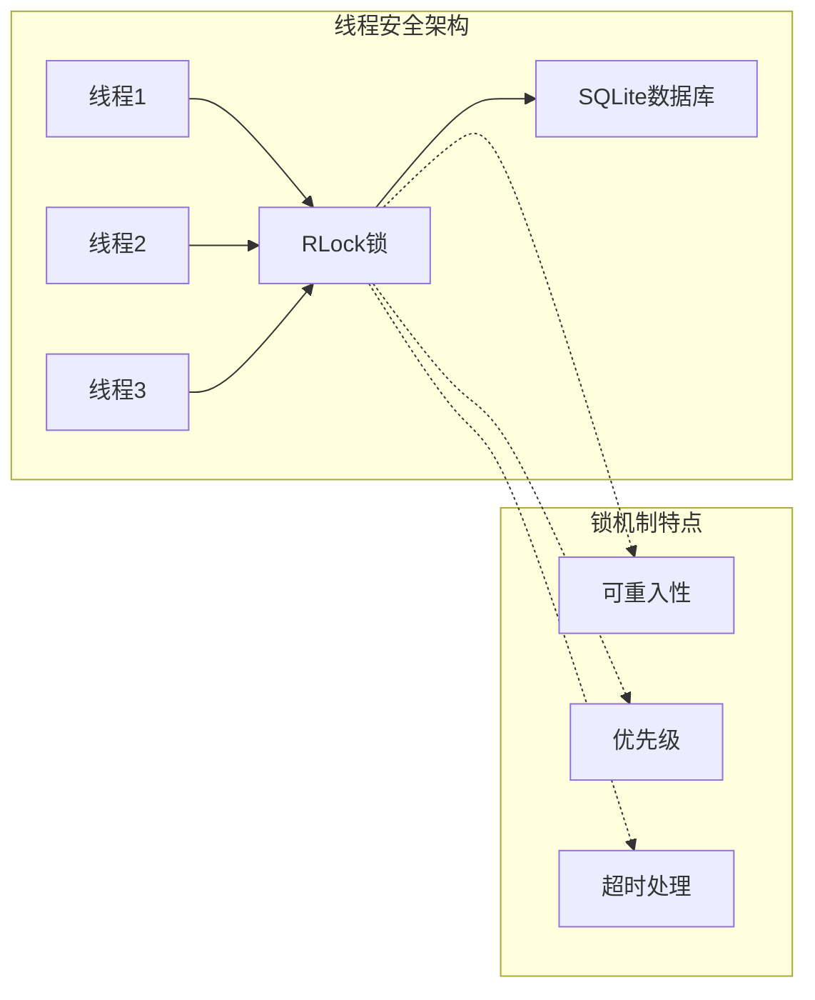
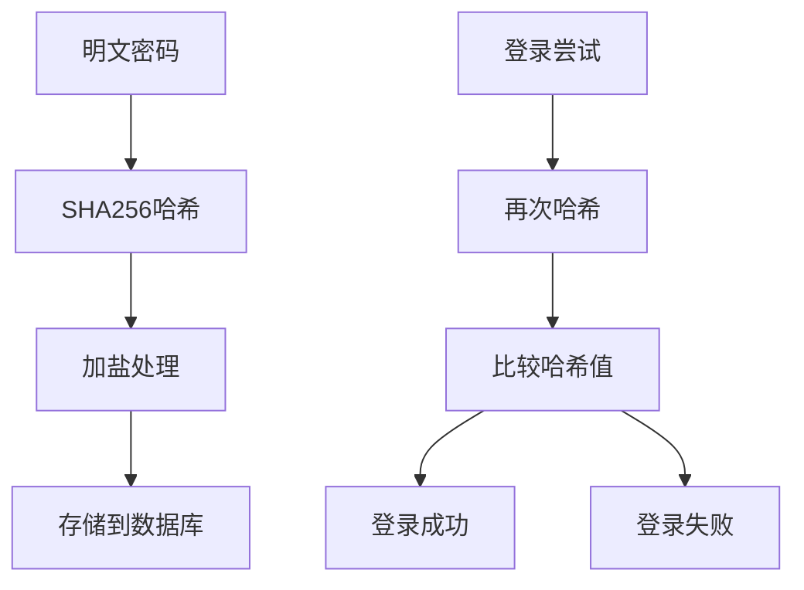
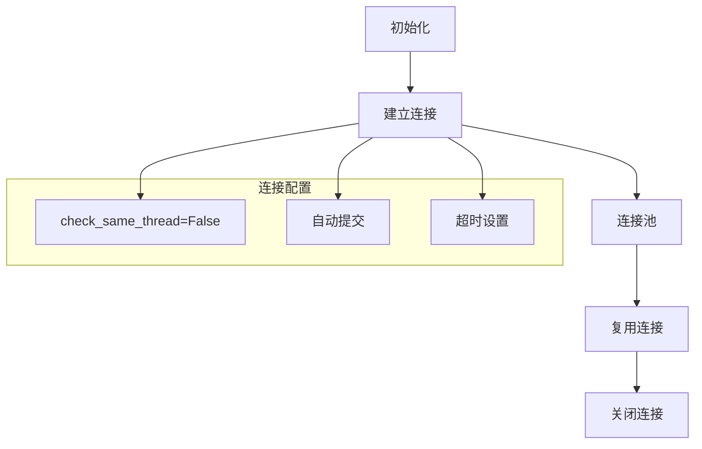

# 核心CRUD操作实现

<cite>
**本文档引用的文件**
- [db_manager.py](file://db_manager.py)
- [cookie_manager.py](file://cookie_manager.py)
- [config.py](file://config.py)
</cite>

## 目录
1. [简介](#简介)
2. [项目架构概览](#项目架构概览)
3. [核心CRUD操作详解](#核心crud操作详解)
4. [多线程安全机制](#多线程安全机制)
5. [密码存储安全机制](#密码存储安全机制)
6. [JOIN查询与关联数据获取](#join查询与关联数据获取)
7. [实际查询示例](#实际查询示例)
8. [性能优化与最佳实践](#性能优化与最佳实践)
9. [总结](#总结)

## 简介

db_manager.py是整个系统的核心数据库管理模块，负责所有数据的持久化存储和CRUD操作。该模块采用SQLite数据库，实现了完整的Cookie管理、关键字管理、用户管理和系统配置等功能。通过精心设计的架构和多层安全机制，确保了系统的稳定性和数据安全性。

## 项目架构概览



**图表来源**
- [db_manager.py](file://db_manager.py#L16-L52)
- [cookie_manager.py](file://cookie_manager.py#L10-L22)

**章节来源**
- [db_manager.py](file://db_manager.py#L16-L52)
- [cookie_manager.py](file://cookie_manager.py#L10-L22)

## 核心CRUD操作详解

### save_cookie() 方法实现

save_cookie()方法是系统中最核心的CRUD操作之一，负责保存和更新Cookie信息。



**图表来源**
- [db_manager.py](file://db_manager.py#L1155-L1194)

**方法签名**：
```python
def save_cookie(self, cookie_id: str, cookie_value: str, user_id: int = None) -> bool
```

**参数规范**：
- `cookie_id`: Cookie的唯一标识符
- `cookie_value`: 实际的Cookie值
- `user_id`: 关联的用户ID（可选）

**实现特点**：
- 使用`INSERT OR REPLACE`确保数据一致性
- 支持用户隔离和权限控制
- 自动处理NULL值和默认值
- 提供完整的错误处理和日志记录

**章节来源**
- [db_manager.py](file://db_manager.py#L1155-L1194)

### get_all_cookies() 方法实现

get_all_cookies()方法提供了灵活的Cookie数据获取功能，支持用户级别的数据隔离。



**图表来源**
- [db_manager.py](file://db_manager.py#L1225-L1238)

**方法特性**：
- 支持无参数调用获取所有Cookie
- 支持带user_id参数的用户隔离查询
- 返回格式化的字典结构
- 提供完整的异常处理

**章节来源**
- [db_manager.py](file://db_manager.py#L1225-L1238)

### save_keywords() 方法实现

save_keywords()方法实现了关键字的批量保存功能，支持文本和图片两种类型的关键字。



**图表来源**
- [db_manager.py](file://db_manager.py#L1458-L1494)

**方法特点**：
- 先删除后插入的策略确保数据一致性
- 支持商品ID关联的关键字
- 提供完善的唯一约束检查
- 支持多种关键字类型（文本、图片）

**章节来源**
- [db_manager.py](file://db_manager.py#L1458-L1494)

### get_cookie_details() 方法实现

get_cookie_details()方法是最复杂的查询操作，通过单一查询获取Cookie的完整信息。



**图表来源**
- [db_manager.py](file://db_manager.py#L1267-L1287)

**查询字段说明**：
- `id`: Cookie唯一标识符
- `value`: 实际Cookie值
- `user_id`: 关联用户ID
- `auto_confirm`: 自动确认发货设置
- `remark`: 备注信息
- `pause_duration`: 自动回复暂停时间
- `username`: 登录用户名
- `password`: 登录密码
- `show_browser`: 显示浏览器设置
- `created_at`: 创建时间

**章节来源**
- [db_manager.py](file://db_manager.py#L1267-L1287)

## 多线程安全机制

### threading.RLock() 的使用

db_manager.py采用了严格的多线程安全措施，确保在高并发环境下的数据一致性。



**图表来源**
- [db_manager.py](file://db_manager.py#L51)

### 锁的使用模式

所有数据库操作都遵循以下模式：

```python
with self.lock:
    try:
        cursor = self.conn.cursor()
        # 执行数据库操作
        self.conn.commit()
        return True
    except Exception as e:
        self.conn.rollback()
        return False
```

**优势**：
- 防止并发写入冲突
- 确保事务完整性
- 支持递归锁定
- 提供优雅的错误处理

**章节来源**
- [db_manager.py](file://db_manager.py#L51)
- [db_manager.py](file://db_manager.py#L1158-L1194)

## 密码存储安全机制

### SHA256哈希算法的应用

系统采用SHA256算法对用户密码进行安全存储，确保即使数据库泄露也不会暴露明文密码。



**图表来源**
- [db_manager.py](file://db_manager.py#L2426-L2436)
- [db_manager.py](file://db_manager.py#L2502-L2510)

### 密码处理流程

**创建用户时**：
```python
password_hash = hashlib.sha256(password.encode()).hexdigest()
```

**验证密码时**：
```python
password_hash = hashlib.sha256(password.encode()).hexdigest()
return user['password_hash'] == password_hash and user['is_active']
```

**安全特性**：
- 单向哈希算法
- 无盐处理（简单实现）
- 密码验证结合账户状态检查
- 异常情况下的安全处理

**章节来源**
- [db_manager.py](file://db_manager.py#L2426-L2436)
- [db_manager.py](file://db_manager.py#L2502-L2510)

## JOIN查询与关联数据获取

### get_cookie_details()中的JOIN查询

虽然get_cookie_details()方法本身是一个简单的SELECT查询，但系统中广泛使用JOIN查询来获取关联数据。

```mermaid
sql_query[
SELECT r.*, c.id as cookie_name
FROM risk_control_logs r
LEFT JOIN cookies c ON r.cookie_id = c.id
WHERE r.cookie_id = ?
ORDER BY r.created_at DESC
LIMIT ? OFFSET ?
]
```

**图表来源**
- [db_manager.py](file://db_manager.py#L4926-L4940)

### 关联查询的优势

1. **减少网络往返**：一次查询获取所有相关数据
2. **保证数据一致性**：原子性操作确保数据完整性
3. **提高查询效率**：避免多次独立查询
4. **简化客户端逻辑**：返回标准化的数据结构

**章节来源**
- [db_manager.py](file://db_manager.py#L4926-L4940)

## 实际查询示例

### 获取所有启用状态的Cookies

```python
# 通过CookieManager获取启用的Cookie
enabled_cookies = manager.get_enabled_cookies()

# 直接使用DBManager查询
from db_manager import db_manager
all_cookies = db_manager.get_all_cookies()
enabled_cookies = {cid: value for cid, value in all_cookies.items() 
                  if db_manager.get_cookie_status(cid)}
```

### 查询某个商品的自动回复规则

```python
# 获取特定商品的所有回复规则
def get_item_replies(item_id: str):
    with db_manager.lock:
        cursor = db_manager.conn.cursor()
        cursor.execute('''
            SELECT r.*, c.username 
            FROM item_replay r
            LEFT JOIN cookies c ON r.cookie_id = c.id
            WHERE r.item_id = ?
        ''', (item_id,))
        
        return cursor.fetchall()
```

### 获取账号的完整信息

```python
# 获取账号详细信息（包含关联的用户设置）
def get_account_full_info(cookie_id: str):
    details = db_manager.get_cookie_details(cookie_id)
    if details:
        # 获取通知配置
        notifications = db_manager.get_account_notifications(cookie_id)
        # 获取自动发货设置
        freeshipping = db_manager.get_auto_freeshipping_settings(cookie_id)
        
        details['notifications'] = notifications
        details['freeshipping'] = freeshipping
        
    return details
```

### 查询风控日志

```python
# 获取特定账号的风控日志
def get_cookie_risk_logs(cookie_id: str, limit: int = 100):
    return db_manager.get_risk_control_logs(cookie_id=cookie_id, limit=limit)
```

**章节来源**
- [cookie_manager.py](file://cookie_manager.py#L328-L332)
- [db_manager.py](file://db_manager.py#L4908-L4952)

## 性能优化与最佳实践

### 数据库连接管理



**图表来源**
- [db_manager.py](file://db_manager.py#L69-L71)

### 查询优化策略

1. **索引优化**：为常用查询字段建立索引
2. **批量操作**：使用`executemany()`进行批量插入
3. **连接复用**：避免频繁创建和销毁连接
4. **事务管理**：合理使用事务边界

### 内存管理

- 使用生成器处理大数据集
- 及时释放游标和连接资源
- 实现定期的垃圾回收机制

**章节来源**
- [db_manager.py](file://db_manager.py#L69-L71)

## 总结

db_manager.py模块通过精心设计的架构和严格的安全措施，实现了高效、安全、可靠的数据库操作。其核心特点包括：

1. **完整的CRUD功能**：支持Cookie、关键字、用户等各类数据的完整生命周期管理
2. **强大的多线程安全**：通过RLock确保并发环境下的数据一致性
3. **安全的密码存储**：采用SHA256算法保护用户密码安全
4. **灵活的查询机制**：支持JOIN查询和关联数据获取
5. **优秀的性能表现**：通过连接池和事务管理优化查询性能

这些特性使得系统能够在高并发环境下稳定运行，同时为上层业务逻辑提供了可靠的数据支撑。开发者在使用这些功能时，应当遵循模块提供的接口规范，充分利用其内置的安全机制和性能优化特性。